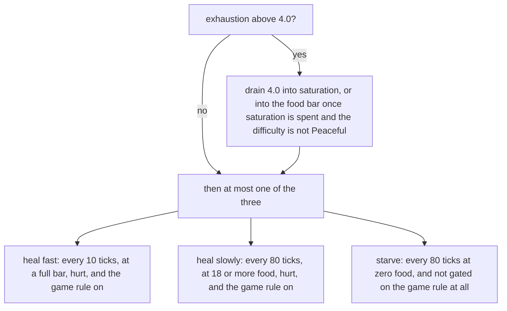
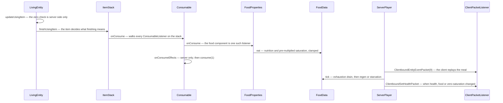

# Hunger and experience

> Verified against **Minecraft 26.2** · Part VIII · Two bars above the hotbar that the server owns outright: one you empty by sprinting, one you fill by mining — and they meet in the enchanting table.

The food bar and the experience bar look like the same kind of thing: a
number the server keeps and sends you. They are, and they are also the two
counters a player argues with most — the meal that does not seem to fill
you, the levels that vanish into an anvil. Both are worth following for the
same reason: neither is quite what the interface suggests. **There is no
method called *eat*** on `Player` or `LivingEntity` — eating is a walk over
the components of a stack that happens to end in `FoodData.eat` — and the
experience packet is change-detected on the **total** alone, so every
mutation that changes only your level has to poison the last-sent value or
the bar will not move.

## The cast

| class | what it decides | thread |
|---|---|---|
| `FoodData` | the food bar, saturation and exhaustion — and by type, only on the server | server main |
| `FoodProperties` | how much a given item is worth, as a data component | both |
| `Consumable` | how long eating takes, what it sounds like, and what else it applies | both |
| `Player` | the four experience fields, the level curve, and the enchanting seed | both |
| `ExperienceOrb` | a value and a multiplicity, wandering toward you | both |
| `ServerPlayer` | the change detection that turns any of this into a packet | server main |

Both halves hang off `ServerPlayer.doTick`, the connection-driven half of
[the two-phase tick](the-two-phase-tick.md); the level's entity tick touches
essentially none of it. The order inside that half matters: item use is
resolved, then `Player.aiStep` runs `ServerPlayer.tickRegeneration`, the
Peaceful refill and the orb pickup, then **`FoodData.tick`**, and then the
change-detection block that emits the packets. So a meal eaten this tick and
a Hunger effect's exhaustion from this tick are both visible to
`FoodData.tick` in the same tick, and the resulting health and food reach
the client in that tick too.

## The food bar is four numbers and a pile of literals

**`FoodData`** (`world/food`) is a value bag with no back-reference to the
player: `FoodData.foodLevel` (20), `FoodData.saturationLevel` (5.0),
`FoodData.exhaustionLevel` and `FoodData.tickTimer`. Its surface is the two
`FoodData.eat` overloads — one taking a `FoodProperties`, one taking a
nutrition and saturation pair — plus `FoodData.addExhaustion` (which caps at
40), `FoodData.needsFood`, `FoodData.hasEnoughFood`, `FoodData.setFoodLevel`,
`FoodData.setSaturation`, the two accessors, and `FoodData.tick` — whose
signature is `FoodData.tick(ServerPlayer)`, **server-only by type**. It saves
as four loose keys in the player tag, not a sub-compound.

**`FoodConstants`** names every threshold in the system —
`FoodConstants.MAX_FOOD`, `FoodConstants.HEAL_LEVEL`,
`FoodConstants.HEALTH_TICK_COUNT`,
`FoodConstants.HEALTH_TICK_COUNT_SATURATED`,
`FoodConstants.EXHAUSTION_DROP`, `FoodConstants.EXHAUSTION_HEAL`,
`FoodConstants.EXHAUSTION_SPRINT`, `FoodConstants.EXHAUSTION_MINE`,
`FoodConstants.EXHAUSTION_ATTACK`, `FoodConstants.SPRINT_LEVEL`,
`FoodConstants.SATURATION_FLOOR` and the saturation-quality ladder from
`FoodConstants.FOOD_SATURATION_POOR` to
`FoodConstants.FOOD_SATURATION_SUPERNATURAL` — and **none of them is
referenced by anything.** Only `FoodConstants.saturationByModifier` has call
sites; `FoodData` writes every threshold as an inline literal, so the
constants file and the behaviour can drift apart without a compile error.

What `FoodData.tick` does with those literals is one exhaustion rule and a
three-way mutually exclusive chain:

The game rule is `GameRules.NATURAL_HEALTH_REGENERATION`, which lives in
`world/level/gamerules` with typed `GameRule` lookups ([level data and
rules](../../reference/level-data-and-rules.md)). The starvation hit only
lands if health is above five hearts, or above half a heart on Normal, or
unconditionally on Hard: five hearts is the floor on Easy and Peaceful, half
a heart on Normal, and death on Hard. `DamageTypes.STARVE` is declared with
zero exhaustion, so starving does not feed itself.

## Eating is a component walk

**`FoodProperties`** (`DataComponents.FOOD`) is three things: nutrition,
saturation and *can always eat*. The duration is not on it — that lives on
**`Consumable`** (`DataComponents.CONSUMABLE`), which owns
`Consumable.consumeSeconds` (with `Consumable.consumeTicks` derived from
it), the `ItemUseAnimation`, the sound, the particles and a list of
`ConsumeEffect`s: `ApplyStatusEffectsConsumeEffect`,
`RemoveStatusEffectsConsumeEffect`, `ClearAllStatusEffectsConsumeEffect`,
`TeleportRandomlyConsumeEffect`, `PlaySoundConsumeEffect`.

`FoodProperties` reaches the player by implementing **`ConsumableListener`**,
and `Consumable.onConsume` walks every component of that type on the stack.
It is not the only implementation — `PotionContents`,
`SuspiciousStewEffects` and `OminousBottleAmplifier` implement it too, and
`PotionContents` is how drinking applies an effect, which is where this page
and [status effects](status-effects.md) meet in one method. Two routes reach
`FoodData.eat` without any of that: `CakeBlock.eat`, and the saturation
effect, both using the raw nutrition-and-saturation overload.

`Consumable.canConsume` consults `Player.canEat` only when the stack has
`DataComponents.FOOD` and the user is a player — potions and milk are
ungated — and `Player.canEat` itself passes for *invulnerable abilities*,
*can always eat*, or `FoodData.needsFood`. An item whose
`Consumable.consumeTicks` is zero is consumed instantly with no animation.
After the food lands, `ItemStack.finishUsingItem` applies
`DataComponents.USE_REMAINDER` and `DataComponents.USE_COOLDOWN` ([using an
item](../items/using-an-item.md)).

The *decision* to finish is server-only, but the client replays the meal:
the server announces it with an entity event, `Player.handleEntityEvent`
turns that back into `LivingEntity.completeUsingItem`, and the client
therefore runs `FoodProperties.onConsume` and its `FoodData.eat` locally,
with no side guard on it. `ClientPacketListener.handleSetHealth` then
overwrites all three values outright. The client also *reads* its food data
for two decisions of its own: sprinting is gated on having more than six
food, and the HUD's food-bar jitter reads saturation.

Eating slowdown is a third component again. **`UseEffects`**
(`DataComponents.USE_EFFECTS`) is on *every* item —
`UseEffects.canSprint`, `UseEffects.interactVibrations`,
`UseEffects.speedMultiplier` — and its slowdown half is genuinely
client-side: `LocalPlayer.isSlowDueToUsingItem` and
`LocalPlayer.itemUseSpeedMultiplier` are its only readers, which is how a
spear overrides the component and lets you sprint while charging ([the
spear](the-spear.md)). The vibration half is not client-side:
`ItemStack.causeUseVibration` reads the same component server-side to decide
whether using an item emits a game event.

## The other bar

`Player.experienceLevel`, `Player.experienceProgress`,
`Player.totalExperience` and `Player.enchantmentSeed`, plus
`Player.takeXpDelay`, are the whole of it. The arithmetic is
`Player.giveExperiencePoints`, `Player.giveExperienceLevels` and
`Player.getXpNeededForNextLevel` — the three-segment curve with corners at
levels 15 and 30.

Where orbs come from is worth naming, because two game rules gate it:
`LivingEntity.dropExperience` requires the experience not to have been
consumed already, and either an always-dropper or a recent player kill with
`GameRules.MOB_DROPS` on; a player's own death drop is
`Player.getBaseExperienceReward`, seven per level capped at 100, unless
`GameRules.KEEP_INVENTORY`.

**`ExperienceOrb`** is an `Entity` with `ExperienceOrb.DATA_VALUE` synched
and `ExperienceOrb.count`, `ExperienceOrb.age`, `ExperienceOrb.health` and
`ExperienceOrb.followingPlayer` unsynched — though the last two are still
mutated by the client's own tick, which runs the follow behaviour locally.
`ExperienceOrb.awardWithDirection` splits an amount into denominations via
`ExperienceOrb.getExperienceValue` (a fixed ladder from 2477 down to 1) and
calls `ExperienceOrb.tryMergeToExisting` for each; `ExperienceOrb.award` is
a one-line delegate to it. Merging is by **count, not value**: an orb
carries one value and a multiplicity. The merge candidate search picks a
*random* group number below `ExperienceOrb.ORB_GROUPS_PER_AREA` and only
merges into orbs whose id is congruent to it — which caps how many orbs
collapse into one entity rather than reducing the scan.

## Questions players ask

**Why does walking cost nothing?** Because it is multiplied by zero, out
loud: `ServerPlayer.checkMovementStatistics` multiplies distance by a
literal zero on both the walking and the crouching branch, while
`FoodConstants.EXHAUSTION_WALK` documents the intent and is referenced by
nothing. The exhaustion economy is sprinting, jumping, swimming, mining,
attacking, the Hunger effect, the `ApplyExhaustion` enchantment effect, and
being hurt — the last of which is data-driven, since
`DamageSource.getFoodExhaustion` reads the damage type. And in creative or
spectator the whole economy is disabled in one line:
`Player.causeFoodExhaustion` returns immediately for invulnerable abilities.

**Why does my saturation sit above my food bar on Peaceful?**
`ServerPlayer.tickRegeneration` raises saturation directly toward 20, while
`FoodData.eat` clamps saturation to the food level. Only one of the two
respects the clamp.

**Why does the saturation shown by the HUD lag?** Because it is sent but not
change-detected. `ClientboundSetHealthPacket` carries a full float, yet the
server only notices whether saturation became *zero* — so your client's
saturation does not update until health or food moves.

**Why does enchanting update the bar when the level packet is
change-detected on the total?** Because the code forces it.
`ServerPlayer.lastSentExp` is compared against `Player.totalExperience`, so
every mutation that changes only the level — `ServerPlayer.setExperienceLevels`,
`Player.giveExperienceLevels`, enchanting, respawn — has to poison the
last-sent value to make the packet go out.

**Why does an orb repair my pickaxe before it reaches my bar?** Because
`ExperienceOrb.playerTouch` runs `ExperienceOrb.repairPlayerItems` first and
only the remainder becomes experience — and that method calls itself with
the leftover. One orb entity can also be picked up many times: it carries a
count, decremented per touch behind a two-tick `Player.takeXpDelay`, and a
player absorbs **one orb per tick**, chosen at random from those it is
touching. The pickup sweep buckets orbs separately from items for exactly
that purpose.

**Why is the Standard Galactic gibberish stable until I enchant?** Because
`Player.onEnchantmentPerformed` subtracts the level cost *and* re-rolls
`Player.enchantmentSeed`, while `AnvilMenu` — which also spends levels,
through `Player.giveExperienceLevels` — does not. A seed that loads back as
zero is re-rolled on read. [Enchanting](../items/enchanting.md) owns what
the seed is for.

**What crosses the wire?** `ClientboundSetHealthPacket` (health, food and
saturation together, to that player only), `ClientboundSetExperiencePacket`
(progress, level and total), and `ClientboundTakeItemEntityPacket` for the
orb pickup animation. The data-driven side is `DataComponents.FOOD`,
`DataComponents.CONSUMABLE`, `DataComponents.USE_EFFECTS`,
`Registries.CONSUME_EFFECT_TYPE`,
`EnchantmentEffectComponents.REPAIR_WITH_XP` for mending, and the three game
rules above.

## Where to look

`FoodData` · `FoodConstants` · `FoodProperties` · `Consumable` ·
`ConsumableListener` · `ConsumeEffect` · `UseEffects` · `Foods` ·
`Player.giveExperiencePoints` · `ExperienceOrb` ·
`ServerPlayer.tickRegeneration` · `ClientboundSetHealthPacket` ·
`ClientboundSetExperiencePacket`

---

*Rules: names, never code · how the system works, not how the code reads ·
newest version only · every backticked name passes `tools/verify_names.py`.*
