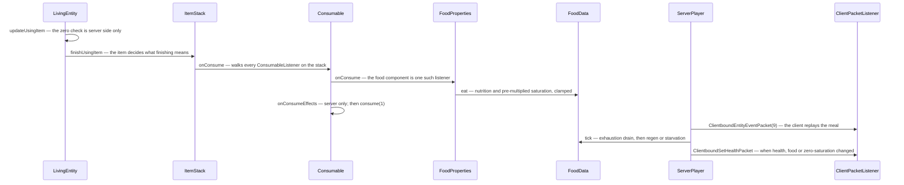

# Hunger, XP and effects

> Verified against **Minecraft 26.2** · Part VIII · Three counters the server owns outright: the food bar, the experience bar, and the list of things currently happening to you.

## Responsibility

Three small systems that share one property: **the server decides all of
them.** Hunger, experience and status effects are server-authoritative
state that arrives as a number in a packet. They are grouped here because
they are the rest of what a player *is*, after the inventory and the
position.

The one sentence a player recognises: *the two bars above the hotbar, and
the swirls.*

The headline: **the natural-regeneration game rule is
`GameRules.NATURAL_HEALTH_REGENERATION`**, and `GameRules` lives in
`world/level/gamerules` with typed `GameRule` lookups
([level data and rules](../world/level-data-and-rules.md)). And no method
called *eat* exists on `Player` or `LivingEntity` — eating is a component
walk that ends in `FoodData.eat`.

## The data it owns

### Hunger

**`FoodData`** (`world/food`) is a value bag with no back-reference to the
player: `FoodData.foodLevel` (20), `FoodData.saturationLevel` (5.0),
`FoodData.exhaustionLevel` and `FoodData.tickTimer`. Its surface is the
two `FoodData.eat` overloads — one taking a `FoodProperties`, one taking
a nutrition and saturation pair — plus `FoodData.addExhaustion` (which
caps at 40), `FoodData.needsFood`, `FoodData.hasEnoughFood`,
`FoodData.setFoodLevel`, `FoodData.setSaturation`, the two accessors and
`FoodData.tick` — whose signature is `FoodData.tick(ServerPlayer)`,
**server-only by type**. It saves as four loose keys in the player tag,
not a sub-compound.

**`FoodConstants`** is the interesting one: it names every threshold —
`FoodConstants.MAX_FOOD`, `FoodConstants.HEAL_LEVEL`,
`FoodConstants.HEALTH_TICK_COUNT`,
`FoodConstants.HEALTH_TICK_COUNT_SATURATED`,
`FoodConstants.EXHAUSTION_DROP`, `FoodConstants.EXHAUSTION_HEAL`,
`FoodConstants.EXHAUSTION_SPRINT`, `FoodConstants.EXHAUSTION_MINE`,
`FoodConstants.EXHAUSTION_ATTACK`, `FoodConstants.SPRINT_LEVEL`,
`FoodConstants.SATURATION_FLOOR` and the saturation-quality ladder from
`FoodConstants.FOOD_SATURATION_POOR` to
`FoodConstants.FOOD_SATURATION_SUPERNATURAL` — and **none of them is
referenced by anything.** Only `FoodConstants.saturationByModifier` has
call sites; `FoodData` writes every threshold as an inline literal.

### Eating

**`FoodProperties`** (`DataComponents.FOOD`) is three things: nutrition,
saturation and *can always eat*. The duration lives on **`Consumable`**
(`DataComponents.CONSUMABLE`), which owns `Consumable.consumeSeconds`
(with `Consumable.consumeTicks` derived from it), the `ItemUseAnimation`,
the sound, the particles and a list of `ConsumeEffect`s —
`ApplyStatusEffectsConsumeEffect`, `RemoveStatusEffectsConsumeEffect`,
`ClearAllStatusEffectsConsumeEffect`, `TeleportRandomlyConsumeEffect`,
`PlaySoundConsumeEffect`. `FoodProperties` reaches the player by
implementing **`ConsumableListener`**: `Consumable.onConsume` walks every
component of that type on the stack. It is not the only one —
`PotionContents`, `SuspiciousStewEffects` and `OminousBottleAmplifier`
implement it too, and `PotionContents` is how drinking applies an effect,
which is the other two thirds of this page meeting in one method.

Two routes reach `FoodData.eat` without any of that: `CakeBlock.eat`, and
the saturation effect, both using the raw nutrition-and-saturation
overload.

**`UseEffects`** (`DataComponents.USE_EFFECTS`) is the eat-slowdown, and
it is on *every* item — `UseEffects.canSprint`,
`UseEffects.interactVibrations`, `UseEffects.speedMultiplier`. The
slowdown half is genuinely client-side: `LocalPlayer.isSlowDueToUsingItem`
and `LocalPlayer.itemUseSpeedMultiplier` are its only readers, and spears
override the component so you can sprint while charging. The vibration
half is not — `ItemStack.causeUseVibration` reads the same component
server-side to decide whether using an item emits a game event.

### Experience

`Player.experienceLevel`, `Player.experienceProgress`,
`Player.totalExperience` and `Player.enchantmentSeed`, plus
`Player.takeXpDelay`. The arithmetic is `Player.giveExperiencePoints`,
`Player.giveExperienceLevels` and `Player.getXpNeededForNextLevel` (the
three-segment curve at levels 15 and 30).

**Where orbs come from** is worth naming, because two game rules gate it:
`LivingEntity.dropExperience` requires the experience not to have been
consumed already and either an always-dropper or a recent player kill
with `GameRules.MOB_DROPS` on; a player's own death drop is
`Player.getBaseExperienceReward`, seven per level capped at 100, unless
`GameRules.KEEP_INVENTORY`.

**`ExperienceOrb`** is an `Entity` with `ExperienceOrb.DATA_VALUE`
synched and `ExperienceOrb.count`, `ExperienceOrb.age`,
`ExperienceOrb.health` and `ExperienceOrb.followingPlayer` unsynched —
though the last two of those are still mutated by the client's own tick,
which runs the follow behaviour locally. `ExperienceOrb.awardWithDirection`
is the method that splits an amount into denominations via
`ExperienceOrb.getExperienceValue` (a fixed ladder from 2477 down to 1)
and calls `ExperienceOrb.tryMergeToExisting` for each;
`ExperienceOrb.award` is a one-line delegate to it. Merging is by
**count, not value**: an orb carries one value and a multiplicity. The
merge candidate search picks a *random* group number below
`ExperienceOrb.ORB_GROUPS_PER_AREA` and only merges into orbs whose id is
congruent to it — which caps how many orbs collapse into one entity
rather than reducing the scan.

### Effects

**`MobEffect`** is the behaviour singleton: a category, a colour, a
particle factory, blend durations and a map of `MobEffect.AttributeTemplate`s.
Its hooks are `MobEffect.applyEffectTick` (returning false ends the
effect), `MobEffect.shouldApplyEffectTickThisTick` (**false by default** —
the overrides are what give each effect its rhythm: poison every
*25 ≫ amplifier* ticks, regeneration every *50 ≫ amplifier*, wither every
*40 ≫ amplifier*, hunger every tick, and an instantaneous effect on its
last tick), `MobEffect.applyInstantaneousEffect`,
`MobEffect.onEffectStarted`, `MobEffect.onEffectAdded`,
`MobEffect.onMobHurt`, `MobEffect.onMobRemoved`. Attribute modifiers go
on as `AttributeInstance.addPermanentModifier` with an amount linear in
amplifier + 1, computed by `MobEffect.AttributeTemplate.create`
([attributes](../entities/attributes.md)).

**`MobEffectInstance`** holds duration, amplifier, the ambient,
visible and show-icon flags, a **`MobEffectInstance.hiddenEffect`** — the
stack that lets a stronger, shorter effect temporarily mask a weaker,
longer one, built by `MobEffectInstance.update` — and a private blend
state. `MobEffectInstance.INFINITE_DURATION` is −1.
`MobEffectInstance.compareTo` is what orders the HUD.
`LivingEntity.canBeAffected` is the veto, and it consults three entity
tags as well as the effect itself.

**`MobEffects`** is forty entries, and every one is a
`Holder<MobEffect>`, not a bare `MobEffect` — including
`MobEffects.BREATH_OF_THE_NAUTILUS`. Some effects point at attributes a
reader would not expect: `MobEffects.JUMP_BOOST` modifies
`Attributes.SAFE_FALL_DISTANCE`, and `MobEffects.INVISIBILITY` modifies
`Attributes.WAYPOINT_TRANSMIT_RANGE`.

On the entity: `LivingEntity.activeEffects` (a plain unordered map),
`LivingEntity.effectsDirty`, and two synched values —
`LivingEntity.DATA_EFFECT_PARTICLES`, which is a **list of
`ParticleOptions`**, not a packed colour, and
`LivingEntity.DATA_EFFECT_AMBIENCE_ID`. `MobEffectUtil` is the shared
question-asking surface: `MobEffectUtil.hasDigSpeed`,
`MobEffectUtil.hasWaterBreathing`,
`MobEffectUtil.shouldEffectsRefillAirsupply`,
`MobEffectUtil.addEffectToPlayersAround` and the duration formatter the
inventory screen uses.

## When it runs

All three hang off the player tick, and *which* player tick matters
([player anatomy](player-anatomy.md)). `ServerPlayer.tick` — the entity
loop's tick — touches essentially none of them. Everything here is under
`ServerPlayer.doTick`, the connection-driven half:

1. `Player.tick` → `LivingEntity.tick` →
   `LivingEntity.baseTick` → **`LivingEntity.tickEffects`**, the last
   thing `LivingEntity.baseTick` does;
2. still in `LivingEntity.tick`, `LivingEntity.updatingUsingItem`
   decides whether an eaten item finishes — **that decision is
   server-side only**;
3. `Player.aiStep` → `ServerPlayer.tickRegeneration`, the Peaceful
   refill, and the orb pickup;
4. back in `ServerPlayer.doTick`, **`FoodData.tick`**;
5. then the change-detection block that emits the packets.

So a Hunger effect's exhaustion and a meal eaten this tick are both
visible to `FoodData.tick` in the same tick, and the resulting health and
food reach the client in that tick too.

**The client ticks effects, and predicts a meal.** `LivingEntity.tickEffects`'
client branch only counts durations down, unhides hidden effects, advances
the blend factor and spawns particles from the synched list; it never
calls `MobEffect.applyEffectTick` and never touches an attribute. It does
not even remove an expired effect — it keeps a zero-duration instance
until told otherwise.

Eating is different, and the page's older framing had it backwards. The
*decision* to finish is server-only, but the server announces it with an
entity event, `Player.handleEntityEvent` turns that back into
`LivingEntity.completeUsingItem` on the client, and the client therefore
runs `FoodProperties.onConsume` and its `FoodData.eat` locally — there is
no side guard on it. `ClientPacketListener.handleSetHealth` then
overwrites all three values outright. The client also *reads* its food
data for two decisions of its own: sprinting is gated on having more than
six food, and the HUD's food-bar jitter reads saturation.

## The trace: eating bread on a full stomach's edge

`Consumable.canConsume` consults `Player.canEat` only when the stack has
`DataComponents.FOOD` and the user is a player — potions and milk are
ungated — and `Player.canEat` itself passes for *invulnerable abilities*,
*can always eat*, or `FoodData.needsFood`. An item whose
`Consumable.consumeTicks` is zero is consumed instantly with no
animation. After the food lands, `ItemStack.finishUsingItem` applies
`DataComponents.USE_REMAINDER` and `DataComponents.USE_COOLDOWN`
([items and stacks](../items/items-and-stacks.md)).

`FoodData.tick` then runs one exhaustion rule and a three-way
mutually exclusive chain. Exhaustion above 4.0 drains 4.0 into saturation, or into the food
bar if saturation is already spent and the difficulty is not
`Difficulty.PEACEFUL`. Then, in order, at most one of three: **heal fast**
off saturation — every ten ticks, at a full bar, if the player is hurt
and `GameRules.NATURAL_HEALTH_REGENERATION` is on; **heal slowly** —
every eighty ticks, at 18 or more food, same two conditions; **starve** —
every eighty ticks at zero food, and *not* gated on the game rule. The
starvation hit only lands if health is above five hearts, or above half a
heart on Normal, or unconditionally on Hard: so five hearts is the floor
on Easy and Peaceful, half a heart on Normal, and death on Hard.
`DamageTypes.STARVE` is declared with zero exhaustion so starving does not
feed itself.

## Interfaces

- **Called by:** `ServerPlayer.doTick` for all three;
  `ExperienceOrb.playerTouch` for XP pickup;
  `LivingEntity.addEffect` from every source of an effect.
- **Calls into:** `LivingEntity.hurtServer` (starvation, poison, wither —
  [damage and death](../entities/damage-and-death.md)); `AttributeMap`
  ([attributes](../entities/attributes.md)); `EnchantmentHelper` for
  mending.
- **Crosses the network as:** `ClientboundSetHealthPacket` (health, food
  and saturation together, to that player only),
  `ClientboundSetExperiencePacket` (progress, level and total),
  `ClientboundUpdateMobEffectPacket` and
  `ClientboundRemoveMobEffectPacket`, plus
  `LivingEntity.DATA_EFFECT_PARTICLES` for other entities' swirls and
  `ClientboundTakeItemEntityPacket` for the orb pickup animation.
- **Data-driven by:** `DataComponents.FOOD`,
  `DataComponents.CONSUMABLE`, `DataComponents.USE_EFFECTS`,
  `Registries.CONSUME_EFFECT_TYPE`, `BuiltInRegistries.MOB_EFFECT`,
  `EnchantmentEffectComponents.REPAIR_WITH_XP`,
  `GameRules.NATURAL_HEALTH_REGENERATION`, `GameRules.KEEP_INVENTORY`,
  `GameRules.MOB_DROPS`.

## Invariants and surprises

- **Walking and crouching cost exactly zero exhaustion, and the code says
  so out loud.** `ServerPlayer.checkMovementStatistics` multiplies
  distance by a literal zero on both branches, and
  `FoodConstants.EXHAUSTION_WALK` documents the intent while being
  referenced by nothing. The exhaustion economy is sprinting, jumping,
  swimming, mining, attacking, the Hunger effect, the `ApplyExhaustion`
  enchantment effect, and being hurt — the last of which is data-driven,
  since `DamageSource.getFoodExhaustion` reads the damage type.
- **Creative and spectator accrue no exhaustion at all.**
  `Player.causeFoodExhaustion` returns immediately for invulnerable
  abilities, which quietly disables the entire economy above.
- **`FoodConstants` is entirely dead.** `FoodData` duplicates every
  threshold inline, so the constants file and the behaviour can drift
  apart without a compile error.
- **Mending takes the orb before you do, and recurses.**
  `ExperienceOrb.playerTouch` runs `ExperienceOrb.repairPlayerItems`
  first and only the remainder becomes experience; that method calls
  itself with the leftover.
- **One orb entity can be picked up many times.** It carries a count,
  decremented per touch behind a two-tick `Player.takeXpDelay`. And a
  player absorbs **one orb per tick**, chosen at random from those it is
  touching — the pickup sweep buckets orbs separately from items for
  exactly that purpose.
- **The experience packet is change-detected on the *total* alone.**
  `ServerPlayer.lastSentExp` is compared against
  `Player.totalExperience`, so every mutation that changes only the level
  — `ServerPlayer.setExperienceLevels`, `Player.giveExperienceLevels`,
  enchanting, respawn — has to force the packet by poisoning the
  last-sent value. Without that, enchanting would not update the bar.
- **The enchanting seed is re-rolled by enchanting.**
  `Player.onEnchantmentPerformed` subtracts the level cost *and* re-rolls
  `Player.enchantmentSeed`; `AnvilMenu`, which also spends levels through
  `Player.giveExperienceLevels`, does not. And a seed that loads back as
  zero is re-rolled on read.
- **The client never runs a status effect.** All of
  `LivingEntity.onEffectAdded`, `LivingEntity.onEffectUpdated` and
  `LivingEntity.onEffectsRemoved` are server-guarded, so no attribute modifier is ever applied
  client-side; attribute values arrive by their own sync. Durations
  desync harmlessly and are corrected by a re-send every 600 ticks — with
  two holes: an **infinite** effect's duration is −1 and never satisfies
  that test, so it is never re-sent, and the re-send only ever reaches
  the affected player or a player riding them. A client watching a mob it
  is not riding is never sent a `MobEffectInstance` at all, only the
  particle list.
- **`ClientboundUpdateMobEffectPacket` never carries the hidden-effect
  chain** — only one instance, plus flag bits for ambient, visible, icon
  and blend. The save codec *is* recursive; the stream codec is not.
- **Blending is a pure render quantity.** `MobEffectInstance`'s blend
  state ticks only on the client and is never saved or sent; only
  `MobEffects.NAUSEA` and `MobEffects.DARKNESS` use it. The blend bit is
  set only when an effect is first added; an update clears it, and the
  client responds by skipping the blend.
- **A concurrent-modification error in effect ticking is caught and
  silently dropped** by `LivingEntity.tickEffects` — an effect that adds
  or removes another quietly aborts the rest of that tick's processing.
- **An infinite effect pulses off a different clock.**
  `MobEffectInstance.tickServer` counts an infinite-duration effect's
  pulses off the entity's age and a finite one off its own countdown.
- **Ambient does not choose the particles; it makes them rarer.** The
  client spawns one particle from the synched list with a probability
  that an invisible entity divides by about four and an ambient effect by
  a further five.
- **The Peaceful refill breaks the saturation clamp.**
  `ServerPlayer.tickRegeneration` raises saturation directly toward 20
  while `FoodData.eat` clamps saturation to the food level — so on
  Peaceful saturation can sit above the food bar.
- **Saturation is sent but not change-detected.**
  `ClientboundSetHealthPacket` carries a full float, yet the server only
  notices whether saturation became *zero* — so the client's saturation
  lags until health or food moves.

## Where to look

`FoodData` · `FoodConstants` · `FoodProperties` · `Consumable` ·
`ConsumableListener` · `ConsumeEffect` · `UseEffects` · `Foods` ·
`ExperienceOrb` · `Player` · `MobEffect` · `MobEffectInstance` ·
`MobEffects` · `MobEffectCategory` · `MobEffectUtil` · `LivingEntity` ·
`ClientboundSetHealthPacket` · `ClientboundUpdateMobEffectPacket`

---

*Rules: names, never code · how the system works, not how the code reads ·
newest version only · every backticked name passes `tools/verify_names.py`.*
