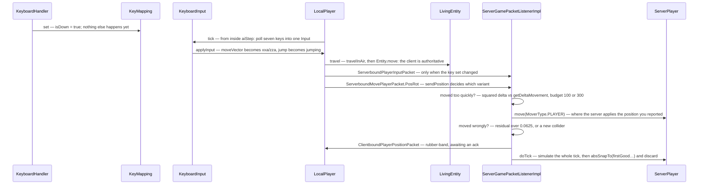

# Input to movement

> Verified against **Minecraft 26.2** · Part VIII · W is pressed: the key becomes a boolean, the boolean becomes a velocity, the velocity becomes a packet, and the server decides whether to believe it.

You press W. Nothing happens for up to a twentieth of a second, because the
key was not pushed anywhere — it was written into a boolean that the next
tick will read. That tick turns seven booleans into a velocity, the velocity
into a position, and the position into a packet; the server then decides
whether to believe the packet. It usually does. The player is the one entity
the server does not control, and everything here exists to reconcile that.

The surprising part is what *deciding* costs you. **Sending move packets
faster makes the check stricter, not looser**, a key held for less than a
tick never happened at all, and the packet that reports your key presses
cannot move you — though it can move a minecart. The server has an expected
velocity to compare yours against because it simulates your player every tick
and throws the answer away ([the two-phase
tick](the-two-phase-tick.md#the-bracket-and-what-survives-it)).

## The cast

| class | what it decides | thread |
|---|---|---|
| `KeyboardHandler` | that a key went down, when nothing is in the way of it | client main |
| `KeyMapping` | what that key is bound to, and whether it is held | client main |
| `KeyboardInput` | seven booleans and a normalised vector, once per tick | client main |
| `LocalPlayer` | the movement itself, and what is worth sending | client main |
| `ServerGamePacketListenerImpl` | whether to believe it, and where the player really is | server main |
| `ServerPlayer` | what the client last said: the input, and the known movement | server main |

Who is *allowed* to decide any of this is [Part VI's
authority](../entities/authority.md#five-predicates-and-the-final-one-the-other-four-hang-off),
and this page assumes it in one sentence: the server simulates your player
and is not allowed to believe the result. Everything below is what that
costs, and the cost is paid twice — once on the way out, where the client
decides, and once on the way in, where the server checks.

## What each side holds

### On the client

- **`KeyMapping`** — one object per bindable action, holding
  `KeyMapping.isDown` and `KeyMapping.clickCount`. Only the first of those
  matters here: the movement keys are **polled** with `KeyMapping.isDown`
  and never drained with `KeyMapping.consumeClick`, so a key held for ten
  ticks reads down ten times. What a mapping is, how a press reaches one,
  what a toggle does to it and why a sneak *toggle* survives opening the
  inventory when a held sneak does not are all [input and
  keybinds](../client/input-and-keybinds.md#two-ways-gameplay-reads-a-mapping-and-they-behave-differently)'.
- **`Options`** — the movement bindings: `Options.keyUp`,
  `Options.keyDown`, `Options.keyLeft`, `Options.keyRight`,
  `Options.keyJump`, `Options.keyShift`, `Options.keySprint`. Plus
  `Options.autoJump` and `Options.sprintWindow` (the double-tap window in
  ticks, default seven, zero to disable).
- **`Input`** (`world/entity/player`) — a **shared** record of seven
  booleans (forward, backward, left, right, jump, shift, sprint) with
  `Input.EMPTY` and an `Input.STREAM_CODEC` that packs all seven into one
  byte; the bit values are named `Input.FLAG_FORWARD` …
  `Input.FLAG_SPRINT`.
- **`ClientInput`** — `ClientInput.keyPresses` (an `Input`) plus
  `ClientInput.moveVector` (a `Vec2`, where `Vec2.x` is the *left*
  impulse and `Vec2.y` the *forward* one). `ClientInput.makeJump` is how
  auto-jump fakes a press. `ClientInput.tick` is empty; the subclass that
  actually reads the keyboard is **`KeyboardInput`**, whose
  `KeyboardInput.tick` builds a fresh `Input` from the seven
  `KeyMapping.isDown` values, maps each pair to −1, 0 or +1 with
  `KeyboardInput.calculateImpulse`, and normalises the resulting vector.
- **`LocalPlayer`** — one block of fields whose entire job is *what did I
  last tell the server*. Five of them shadow the position and rotation
  (`LocalPlayer.xLast`, `LocalPlayer.yLast`, `LocalPlayer.zLast`,
  `LocalPlayer.yRotLast`, `LocalPlayer.xRotLast`), two shadow the ground and
  collision flags (`LocalPlayer.lastOnGround`,
  `LocalPlayer.lastHorizontalCollision`), one shadows the key set
  (`LocalPlayer.lastSentInput`) and one counts down to a re-send that
  happens whether anything changed or not
  (`LocalPlayer.positionReminder`, against
  `LocalPlayer.POSITION_REMINDER_INTERVAL`, twenty). The rest of the block
  is local state nobody is told about: `LocalPlayer.wasSprinting` and
  `LocalPlayer.sprintTriggerTime` for the double-tap,
  `LocalPlayer.autoJumpEnabled` and `LocalPlayer.autoJumpTime` for
  auto-jump, and `LocalPlayer.crouching`.

`LocalPlayer.input` starts as a bare `ClientInput` and is replaced with a
`KeyboardInput` by `ClientPacketListener` on login and on respawn — which
is why a respawned player's input object is a different one.

### On the server

`ServerGamePacketListenerImpl` holds the whole judgement in four groups of
fields, and the groups are the argument. **Two positions**, not one:
`ServerGamePacketListenerImpl.firstGoodX` and its siblings are where the
connection tick found the player at the top of the bracket, and
`ServerGamePacketListenerImpl.lastGoodX` and its siblings are the last
position it actually accepted from you. **Three teleport fields** —
`ServerGamePacketListenerImpl.awaitingTeleport`,
`ServerGamePacketListenerImpl.awaitingTeleportTime` and
`ServerGamePacketListenerImpl.awaitingPositionFromClient` — hold the
handshake open while a rubber-band is in flight. **Two counters**,
`ServerGamePacketListenerImpl.receivedMovePacketCount` against
`ServerGamePacketListenerImpl.knownMovePacketCount`, are how the speed budget
learns how many packets arrived since the last tick, with
`ServerGamePacketListenerImpl.receivedMovementThisTick` the per-tick flag.
And **a floating pair**, `ServerGamePacketListenerImpl.clientIsFloating` and
`ServerGamePacketListenerImpl.aboveGroundTickCount`. Every one of those four
groups has a vehicle twin beside it —
`ServerGamePacketListenerImpl.lastVehicle`,
`ServerGamePacketListenerImpl.vehicleFirstGoodX`,
`ServerGamePacketListenerImpl.vehicleLastGoodX`,
`ServerGamePacketListenerImpl.clientVehicleIsFloating` — which is the first
sign that a vehicle is judged by its own cut-down copy of this code.

On `ServerPlayer` itself there are only two: the observed per-tick
displacement, `ServerPlayer.lastKnownClientMovement`, read back through
`ServerPlayer.getKnownMovement` and `ServerPlayer.getKnownSpeed`, and the raw
key state, `ServerPlayer.lastClientInput`.

**Almost none of the thresholds have names.** The numbers in the movement
checks are inline literals. Two constants nearby do have names —
`ServerGamePacketListenerImpl.MAXIMUM_FLYING_TICKS` (80 ticks) and
`ServerGamePacketListenerImpl.CLIENT_LOADED_TIMEOUT_TIME` (60 ticks) — and
the second is not read by anything either: the load timer is armed with a
bare 60 beside it.

## Sampled once a tick, judged once a tick

Keys are **sampled inside the tick, not pushed from the callback.** The
*movement* half of `KeyboardHandler.keyPress` sets `KeyMapping.isDown` and
bumps `KeyMapping.clickCount`, and does even that only when no screen is
open; everything else the method does — the screen's own key handling, the
debug keys, the pause — never reaches a `KeyMapping` at all. Releases, by
contrast, are always delivered, screen or no screen. That asymmetry is the
whole reason a mapping can be left stuck down, and repairing it is [input and
keybinds](../client/input-and-keybinds.md#two-ways-gameplay-reads-a-mapping-and-they-behave-differently)'s,
along with when the callback actually runs. The *read* happens once per game
tick, deep inside `LocalPlayer.aiStep`, which calls
`ClientInput.tick` — the empty base method whose `KeyboardInput` override
does the work.

Mouse look is the exception, and it is the one input on this page not
sampled once a tick. `MouseHandler.handleAccumulatedMovement` runs **per
frame**, in `Minecraft.runTick` after the tick loop, and — when the window is
active and the mouse grabbed — `MouseHandler.turnPlayer` calls `Entity.turn`
directly. Rotation is therefore finer-grained than position, which is why a
packet can carry a rotation the tick never saw a keypress for. The
sensitivity curve inside `MouseHandler.turnPlayer` and the rest of the gates
on it are [input and
keybinds](../client/input-and-keybinds.md#the-mouse-accumulate-apply-discard)'s.

On the server the ordering is the whole story:

1. `MinecraftServer.processPacketsAndTick` drains `PacketProcessor`
   **before** `MinecraftServer.tickServer`. Every movement packet for the
   tick is applied first, ahead of any level ticking.
2. The levels tick.
3. `MinecraftServer.tickChildren` reaches its connection phase, and
   `ServerGamePacketListenerImpl.tick` runs
   `ServerGamePacketListenerImpl.tickPlayer` — the simulate-and-discard
   step, and the place the floating check is enforced. A paused server
   short-circuits before it.

## W, held down: what the client decides and sends

### The client half

`KeyboardInput.tick` builds an `Input` from the seven
keys and a normalised `Vec2`. `LocalPlayer.applyInput` — overriding a
`LivingEntity.applyInput` that does nothing but decay them —
turns that into the `LivingEntity.xxa` and `LivingEntity.zza` movement
fields, after passing it through
`LocalPlayer.modifyInput`: a flat 0.98 scaling, then the item-use
slowdown (from `LocalPlayer.itemUseSpeedMultiplier`),
`Attributes.SNEAKING_SPEED` when moving slowly, and
`LocalPlayer.modifyInputSpeedForSquareMovement`, the diagonal correction.
From there it is ordinary
[movement and collision](../entities/movement-and-collision.md#the-tick):
`Player.travel` — a real override, handling passengers, the swimming look
nudge and the creative-flight damping — then `LivingEntity.travel` →
`LivingEntity.travelInAir` →
`LivingEntity.handleRelativeFrictionAndCalculateMovement` →
`Entity.moveRelative` → `Entity.move`.

Sprint is decided in `LocalPlayer.aiStep` before that, and it is a
**rising edge, not a release**. `LocalPlayer.aiStep` snapshots the forward
impulse *before* ticking the input, so the value it later tests is the
previous tick's; `LocalPlayer.canStartSprinting` requires the current
tick's. The pair means the double-tap window — `Options.sprintWindow`, seven ticks by
default — is armed on the first *press* and consumed on the second. Letting
go is not what arms it, and letting go is not what cancels it either:
sneaking, using an item or walking backwards clear
`LocalPlayer.sprintTriggerTime` outright, and
`LocalPlayer.shouldStopRunSprinting` ends a sprint already running. Auto-jump is
`LocalPlayer.updateAutoJump` (called from `LocalPlayer.move`) setting
`LocalPlayer.autoJumpTime`, which makes the *next* tick call
`ClientInput.makeJump`.

### What goes on the wire

`LocalPlayer.sendPosition` picks the variant:
`ServerboundMovePlayerPacket.PosRot` when both changed,
`ServerboundMovePlayerPacket.Pos` or `.Rot` for one,
`ServerboundMovePlayerPacket.StatusOnly` when only the ground or
collision flag changed, and **nothing at all** otherwise — except that a
position is re-sent every twenty ticks regardless, via
`LocalPlayer.positionReminder`. "Changed" is not the same test for the
two halves: rotation compares exactly, while position must have moved by
more than 2×10⁻⁴ blocks. And the whole method sits behind
`LocalPlayer.isControlledCamera`, so while spectating another entity a
client sends no move packets at all, not even the reminder — which has one
side effect nobody would look for here, because `LocalPlayer.sendPosition` is
also where `Options.autoJump` is read back into
`LocalPlayer.autoJumpEnabled`, so the setting quietly stops tracking for a
passenger or a non-camera player. The two
booleans ride in one byte
(`ServerboundMovePlayerPacket.FLAG_ON_GROUND`,
`ServerboundMovePlayerPacket.FLAG_HORIZONTAL_COLLISION`).
`ServerboundPlayerInputPacket` is sent only when the key set *changes*,
and `ServerboundClientTickEndPacket` — a zero-byte singleton — closes
every client tick that has a level and is not paused.

### Elytra, which is its own round trip

`LocalPlayer.aiStep` asks
`Player.tryToStartFallFlying` and, if it says yes, sends
`ServerboundPlayerCommandPacket.Action.START_FALL_FLYING` — the server runs
the same method on receipt. The server may
disagree and call `LivingEntity.stopFallFlying`, and the flight itself is
`LivingEntity.updateFallFlying` and `LivingEntity.travelFallFlying`.

## What the server does with the packet it gets

Everything above happens before the packet exists. What follows is one
method, `ServerGamePacketListenerImpl.handleMovePlayer`, and two judgements
inside it — and then, because a judgement can go against you, a handshake for
putting you back.

### The two checks, in the order they run

`ServerGamePacketListenerImpl.handleMovePlayer`
begins with `ServerGamePacketListenerImpl.containsInvalidValues`, which
rejects **NaN** coordinates and non-finite *rotations* — an infinite
coordinate survives it and is clamped instead, to ±3×10⁷ horizontally by
`ServerGamePacketListenerImpl.clampHorizontal` and ±2×10⁷ vertically by
`ServerGamePacketListenerImpl.clampVertical`. It then discards the
position entirely while a teleport is outstanding; short-circuits a
sleeping player, teleporting them back if they claim to have moved more
than a block; and for a passenger applies rotation only —
snapping the position back with `Entity.absSnapTo` and re-registering the
chunk position, which is not quite "returns early". Then two checks:

- *moved too quickly*: the squared distance from `firstGood…` minus
  `Entity.getDeltaMovement().lengthSqr()` against a budget of **100 per
  packet, or 300 while fall-flying**, scaled by how many move packets
  arrived since the last tick. Both sides are squared, so 100 is a
  hundred blocks *squared* — about ten blocks a tick. The whole check,
  and the packet counter it uses, is gated on
  `TickRateManager.runsNormally`, so a frozen or stepping world does no
  speed checking at all. It is also skipped for the singleplayer host,
  during a dimension change, and when
  `GameRules.PLAYER_MOVEMENT_CHECK` is off
  (`GameRules.ELYTRA_MOVEMENT_CHECK` covers the elytra case). Failure
  teleports the player back and returns.
- The move is then actually applied — `Entity.move` with
  `MoverType.PLAYER` — and *moved wrongly* measures what is left over: a
  residual above `0.0625` while not changing dimension, sleeping,
  creative, spectating or inside `LivingEntity.isInPostImpulseGraceTime`
  (the mace and wind-charge exemption, closed by
  `ServerGamePacketListenerImpl.tryResetCurrentImpulseContext`). The
  rubber-band that follows is a **disjunction**: either that failure with
  a demonstrably clear old box, *or*
  `ServerGamePacketListenerImpl.isEntityCollidingWithAnythingNew`
  reporting the player ended up inside a collider it was not already
  inside — which fires whether or not the residual check failed. Both
  arms are additionally suppressed for a no-physics or sleeping player. The
  vertical half of that residual is dead code: the guard that zeroes it is a
  disjunction true for every finite double, so the 0.0625 test is
  horizontal-only in practice, in the vehicle handler as well as this one.

Accepting means `Entity.absSnapTo`, `ServerChunkCache.move`,
`Entity.setOnGroundWithMovement`, `Entity.doCheckFallDamage`,
`ServerGamePacketListenerImpl.handlePlayerKnownMovement` and
`ServerPlayer.checkMovementStatistics` — the walked-distance statistics
are computed from the *client's reported* delta, never from a simulation.
The server also **infers the jump**: a packet that reports leaving the
ground while moving upward calls `LivingEntity.jumpFromGround` on the player's
behalf.

### Where the velocity everything downstream reads comes from

The reported delta is stored by
`ServerPlayer.setKnownMovement`, and
`ServerGamePacketListenerImpl.handleClientTickEnd` zeroes it if no move
packet arrived that tick. That is what everything downstream reads when it
wants the player's velocity — whether a swing sweeps, what a spear's charge
does, the speed a fired projectile inherits, leash physics — and it is why a
client that stops sending is treated as stationary rather than as still
coasting.

### The teleport handshake, and what it does not undo

`ServerGamePacketListenerImpl.teleport` bumps
`ServerGamePacketListenerImpl.awaitingTeleport`, moves the player with `Entity.teleportSetPosition`,
records `ServerGamePacketListenerImpl.awaitingPositionFromClient` and sends
`ClientboundPlayerPositionPacket` (a `PositionMoveRotation` plus a set of
`Relative` flags saying which fields are deltas).
`ServerGamePacketListenerImpl.updateAwaitingTeleport` **re-sends after
more than twenty ticks** if no acknowledgement arrives, and until it does,
every incoming move packet contributes rotation only. That is also the answer
to what happens to the movement you made while the rubber-band was in
flight: nothing replays it. The client snaps, the packets it had already sent
are discarded as positions, and the ticks you walked between the rejection
and the snap are simply gone — unlike a block prediction, which survives the
same teleport on purpose. The client replies
with `ServerboundAcceptTeleportationPacket` *and* an immediate
`ServerboundMovePlayerPacket.PosRot`, then calls
`BlockStatePredictionHandler.onTeleport`, which does *not* drop its
outstanding block predictions: it records the sequence the teleport arrived
at, so that when those predictions are settled later the ledger skips the
position snap that would otherwise shove you back ([prediction and
acknowledgement](../client/prediction-and-acks.md#the-four-writes)). On the
receiving end `ClientPacketListener.handleMovePlayer` applies the position
only when the player is not a passenger, and never interpolates: it passes
the interpolate flag as a literal false, so your own player is always
snapped, and the 4096-blocks-squared jump test that gates interpolation is
reached only on the entity-teleport path.
`ClientboundPlayerRotationPacket` is the rotation-only sibling.

## Floating, and everything exempted from it

The third judgement is not about a packet at all. It runs in the connection
tick beside the bracket, and it is the one that ends sessions.

*Floating* has a flat definition — **no blocks anywhere below you** — and a
budget that is anything but flat.
`ServerGamePacketListenerImpl.getMaximumFlyingTicks` returns an effectively
unbounded budget below a gravity of 10⁻⁵, and otherwise stretches the
eighty-tick budget as gravity falls; so the kick scales with gravity, and
only upward. `ServerGamePacketListenerImpl.clientIsFloating` is then
suppressed outright by six things: spectator mode, `Abilities.mayfly`, the
server's own allow-flight setting, `MobEffects.LEVITATION`, fall-flying and
riptide. That list is why creative flight never trips it, and it is the list
the rest of the book points here for.

A floating *vehicle* runs a second copy of the whole check —
`ServerGamePacketListenerImpl.clientVehicleIsFloating` against
`ServerGamePacketListenerImpl.aboveGroundVehicleTickCount`, on its own budget
and only for the controlling passenger — so a rider and the thing they are
riding are judged separately, and either can end the session ([players and
sessions](../server/players-and-sessions.md#the-three-kicks-that-come-from-the-tick)).

## What it calls, and what crosses the wire

- **Called by:** `Minecraft.tick` (client, via `ClientLevel` and
  `Minecraft.handleKeybinds`); `PacketProcessor` and
  `MinecraftServer.tickChildren` (server).
- **Calls into:** `LivingEntity.travel` and `Entity.move`
  ([movement and
  collision](../entities/movement-and-collision.md#building-the-delta));
  `ServerChunkCache.move`, which is what makes chunks load as you walk
  ([tickets and
  loading](../world/tickets-and-loading.md#which-chunks-a-player-is-owed-and-what-makes-one-eligible)).
- **Crosses the network as:** `ServerboundMovePlayerPacket` and its four
  variants, `ServerboundPlayerInputPacket`,
  `ServerboundPlayerCommandPacket` (whose
  `ServerboundPlayerCommandPacket.Action` is seven values — start and stop
  sprinting, start and stop riding-jump,
  `ServerboundPlayerCommandPacket.Action.STOP_SLEEPING`,
  `ServerboundPlayerCommandPacket.Action.OPEN_INVENTORY`,
  `ServerboundPlayerCommandPacket.Action.START_FALL_FLYING`; **there is
  no sneak action** — sneaking reaches the server through
  `ServerboundPlayerInputPacket`, which calls `Entity.setShiftKeyDown`; and
  the packet carries an entity id the server never validates against the
  sender),
  `ServerboundMoveVehiclePacket`,
  `ServerboundAcceptTeleportationPacket`,
  `ServerboundClientTickEndPacket`; and back,
  `ClientboundPlayerPositionPacket`, `ClientboundPlayerRotationPacket`,
  `ClientboundMoveVehiclePacket`.
- **Data-driven by:** almost nothing —
  `GameRules.PLAYER_MOVEMENT_CHECK` and `GameRules.ELYTRA_MOVEMENT_CHECK`
  ([level data and
  rules](../../reference/level-data-and-rules.md#game-rules-are-a-registry)), plus the
  movement attributes.

## Questions players ask

**If `ServerboundPlayerInputPacket` never moves me, what is it for?**
Two things. `ServerPlayer.setLastClientInput` feeds
`ServerPlayer.getLastClientMoveIntent`, and both `NewMinecartBehavior` and
`OldMinecartBehavior` read it to nudge a stalled cart along the rider's
intended direction — so the packet that cannot move a player *can* move a
minecart. And the handler sets the sneak flag directly, which is why there
is no sneak action on `ServerboundPlayerCommandPacket`. Boats are steered
client-side (`LocalPlayer.rideTick` → `AbstractBoat.setInput`) and the
*result* ships as `ServerboundMoveVehiclePacket`.

**Does sending move packets faster help me cheat?** It does the opposite.
The per-packet budget normally scales with how many packets arrived since
the last tick, but above five the code clamps the count to one — so a flood
gets a one-packet budget for a many-packet displacement. There is no
throttle or kick for the flood itself; only chat, commands and item drops
have a `TickThrottler`.

**Why is a passenger barely checked?** A passenger's own move packet
contributes rotation and a chunk re-registration and nothing else, and the
*vehicle's* packet is judged by a cut-down copy of the same code: a flat
budget of 100, no elytra case, no game rule, and no horizontal-collision
flag.

**Why did my quick tap do nothing?** Movement polls `KeyMapping.isDown` once
a tick, so a press shorter than a tick never happened. The keys that use
`KeyMapping.consumeClick` behave the other way: three taps inside one tick
can fire three times.

**Why does brushing a wall sometimes cancel my sprint and sometimes not?**
`LocalPlayer.isHorizontalCollisionMinor` is a client-only override that
measures the angle against `LocalPlayer.MINOR_COLLISION_ANGLE_THRESHOLD_RADIAN`,
about eight degrees; a graze shallower than that is forgiven. The server has
no equivalent.

## Where to look

The client half reads shortest first: **`KeyboardInput.tick`** is the whole
of the sampling, **`LocalPlayer.aiStep`** the tick it happens inside, and
**`LocalPlayer.sendPosition`** the method that decides what, if anything,
leaves. **`MouseHandler.handleAccumulatedMovement`** is the per-frame
exception beside them, and **`KeyboardHandler.keyPress`** the callback that
does less than its name suggests.

The server half is essentially one class. Read
**`ServerGamePacketListenerImpl.handleMovePlayer`** end to end — it is the
speed check, the move, the residual check and the rubber-band in one method —
then **`ServerGamePacketListenerImpl.handleMoveVehicle`** beside it to see
the same logic with the elytra case and the game rule taken out. On the wire,
**`ServerboundMovePlayerPacket`** with its four variants and
**`ClientboundPlayerPositionPacket`** with its `PositionMoveRotation` and
`Relative` flags are worth opening for their shape alone. Two doors this page
only points at: **`PacketProcessor`**, which is what drains a move packet
before any level ticks, and **`TickThrottler`**, which is what movement
notably does *not* have.

---

*Rules: names, never code · how the system works, not how the code reads ·
newest version only · every backticked name passes `tools/verify_names.py`.*
