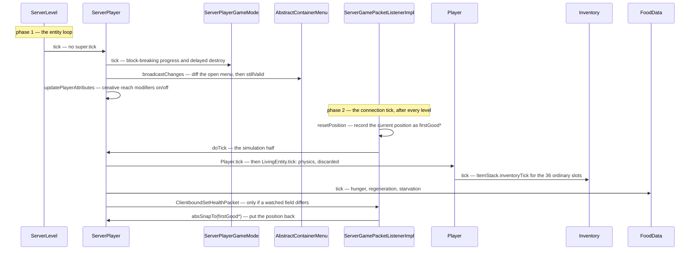

# Player anatomy

> Verified against **Minecraft 26.2** · Part VIII · One server tick of one player, which happens twice: once from the level's entity loop and once from the connection — and the second half throws its own answer away.

## Responsibility

A player is an entity that a human is steering through a socket. Almost
everything else follows from that sentence. The class ladder exists to
separate *what any living thing does* from *what a thing with an inventory
and a game mode does* from *what a thing with a connection does*, and the
tick is split in two because half of a player's update belongs to the
level and half belongs to the connection.

The one sentence a player recognises: *me.*

The headline: **there is an abstract class between `LivingEntity` and
`Player`, and `Inventory` is not three lists.** `Avatar` is a rendering
seam that lets a non-player entity wear a skin, and `Inventory` is
thirty-six slots plus a window onto the same `EntityEquipment` a zombie
has.

## The data it owns

### The ladder

```
Entity
 └ LivingEntity
    └ Avatar
       ├ Player
       │  ├ ServerPlayer
       │  └ AbstractClientPlayer
       │     ├ LocalPlayer
       │     └ RemotePlayer
       └ Mannequin
          └ ClientMannequin
```

`Entity` and `LivingEntity` belong to
[Part VI](../entities/entity-anatomy.md). The layers below them:

- **`Avatar`** (`world/entity`) — fifty-seven lines and **no instance
  fields at all**. It owns the player-shaped dimensions (`Avatar.POSES`,
  `Avatar.STANDING_DIMENSIONS`, `Avatar.CROUCH_BB_HEIGHT`,
  `Avatar.SWIMMING_BB_WIDTH`, `Avatar.SWIMMING_BB_HEIGHT`), the 1.62 eye
  height (`Avatar.DEFAULT_EYE_HEIGHT`), the two cosmetic synched values
  (`Avatar.DATA_PLAYER_MAIN_HAND`, `Avatar.DATA_PLAYER_MODE_CUSTOMISATION`)
  with `Avatar.getMainArm` / `Avatar.isModelPartShown`, and one abstract
  method, `Avatar.getProfile`, returning a `ResolvableProfile`. That is the
  whole class.
- **`Mannequin`** (`world/entity/decoration`) — the other `Avatar`
  subclass, and therefore a **sibling of `Player`**, not of `ArmorStand`;
  only the package is shared with the armour stand. It is a posable
  skinned dummy with a profile (`Mannequin.DATA_PROFILE`), an immovable
  flag (`Mannequin.DATA_IMMOVABLE`), a description
  (`Mannequin.DATA_DESCRIPTION`) and a fixed set of legal poses
  (`Mannequin.VALID_POSES`).
- **`Player`** (`world/entity/player`) — abstract, and where everything
  a reader means by "the player" actually lives.
- **`ServerPlayer`** (`server/level`) and **`AbstractClientPlayer`** /
  **`LocalPlayer`** / **`RemotePlayer`** (`client/player`) — the two
  sides, below.

`Avatar` exists for the renderer. `AvatarRenderer` is generic over
"an `Avatar` that is also a `ClientAvatarEntity`", and exactly two classes
satisfy that: `AbstractClientPlayer` and **`ClientMannequin`**, a
client-only subclass of `Mannequin`. The mechanism is worth knowing:
`Mannequin` holds a mutable static factory, `Mannequin.constructor`, and
`ClientMannequin.registerOverrides` swaps it during client startup, so a
mannequin spawned into a `ClientLevel` is really a `ClientMannequin`. That
is how a decoration entity gets the full `PlayerModel` and skin pipeline,
and it is the same server/client split `Player` has, one class lower.

### `Player`

- **`Player.inventory`** and **`Player.enderChestInventory`**
  (a `PlayerEnderChestContainer`).
- **`Player.inventoryMenu`** (the `InventoryMenu`, final) and
  **`Player.containerMenu`** (whatever is open; it *is*
  `Player.inventoryMenu` when nothing is). [Containers and menus](../items/containers-and-menus.md)
  owns what happens inside them.
- **`Player.abilities`** — an `Abilities`, below.
- **`Player.foodData`** — a `FoodData`, owned by
  [hunger, XP and effects](hunger-xp-and-effects.md).
- **Experience**: `Player.experienceLevel`, `Player.experienceProgress`,
  `Player.totalExperience`, `Player.enchantmentSeed`,
  `Player.lastLevelUpTime`, `Player.takeXpDelay`, mutated through
  `Player.giveExperiencePoints`, `Player.giveExperienceLevels` and
  `Player.getXpNeededForNextLevel`.
- **Sleep**: `Player.sleepCounter`, `Player.startSleepInBed` /
  `Player.stopSleepInBed` with the `Player.BedSleepingProblem` refusals,
  and the constants `Player.SLEEP_DURATION` (100) and
  `Player.WAKE_UP_DURATION` (10). `ServerLevel` owns the "everyone is
  asleep" half.
- **The two combat clocks.** `LivingEntity.attackStrengthTicker` and
  `LivingEntity.itemSwapTicker` are declared one level up but everything
  that reads or resets them is on `Player`, and `Player.tick` is the only
  thing that increments them — including
  `Player.resetAttackStrengthTicker` when the main-hand *item* changes.
  [The sword swing](the-sword-swing.md) owns what they mean.
- **`Player.cooldowns`** — an `ItemCooldowns`; `Player.createItemCooldowns`
  is the seam, and only `ServerPlayer` overrides it.
- **`Player.gameProfile`**, `Player.lastDeathLocation`,
  `Player.fishing`, `Player.reducedDebugInfo`,
  `Player.lastItemInMainHand`, `Player.hurtDir`, `Player.jumpTriggerTime`,
  `Player.wasUnderwater`.
- **Synched data it declares**: `Player.DATA_PLAYER_ABSORPTION_ID`,
  `Player.DATA_SCORE_ID`, `Player.DATA_SHOULDER_PARROT_LEFT`,
  `Player.DATA_SHOULDER_PARROT_RIGHT` — four, and none of them is the
  hand, which went up to `Avatar`. The *skin* is not synched data at all:
  it arrives out of band, from the tab-list entry for a player and from
  `Mannequin.DATA_PROFILE` for a mannequin.
- **Slot offsets** for command and container addressing:
  `Player.ENDER_SLOT_OFFSET` (200), `Player.HELD_ITEM_SLOT` (499),
  `Player.CRAFTING_SLOT_OFFSET` (500), decoded by `Player.getSlot`.
- **Reach**: `Player.blockInteractionRange` and
  `Player.entityInteractionRange` read
  `Attributes.BLOCK_INTERACTION_RANGE` and
  `Attributes.ENTITY_INTERACTION_RANGE`
  ([attributes](../entities/attributes.md)) — whose defaults, 4.5 and
  3.0, live on the attributes themselves;
  `Player.DEFAULT_BLOCK_INTERACTION_RANGE` and
  `Player.DEFAULT_ENTITY_INTERACTION_RANGE` name the same numbers and are
  read by nothing. `Player.isWithinBlockInteractionRange` /
  `Player.isWithinEntityInteractionRange` are the checks the server makes.
  Note that `Player.createAttributes` adds the *block* range,
  `Attributes.BLOCK_BREAK_SPEED`, `Attributes.SUBMERGED_MINING_SPEED`,
  `Attributes.SNEAKING_SPEED`, `Attributes.MINING_EFFICIENCY`,
  `Attributes.SWEEPING_DAMAGE_RATIO` and the waypoint attributes; the
  *entity* range comes from `LivingEntity.createLivingAttributes`.
- **Permissions**: `Player.permissions` returns
  `PermissionSet.NO_PERMISSIONS` and both sides override it. It is what
  `Player.canUseGameMasterBlocks` consults, alongside
  `Abilities.instabuild`, for `Permissions.COMMANDS_GAMEMASTER`.

`Player` is abstract for one method above all: **`Player.gameMode`**,
which returns a nullable `GameType`. It also implements `ContainerUser`,
which is how a chest decides whether the player is still close enough to
keep it open (`Player.getContainerInteractionRange`).

A long tail of `Player` methods are empty hooks that exist so the two
sides can disagree — `Player.onUpdateAbilities`, `Player.awardStat`,
`Player.triggerRecipeCrafted`, `Player.crit`, `Player.magicCrit`,
`Player.sendSystemMessage`, `Player.doCloseContainer`,
`Player.openTextEdit`, `Player.sendMerchantOffers`,
`Player.handleCreativeModeItemDrop`. On `Player` they do nothing; the
subclass that has somewhere to send a packet overrides them.

### Persistence

`Player.addAdditionalSaveData` and `Player.readAdditionalSaveData` are
where a player becomes a file: the inventory as a sparse slot/stack list,
the selected slot, the sleep timer, the four experience fields (including
the enchanting seed), the score, the abilities through
`Abilities.Packed`, the ender chest, and the last death location.
`ServerPlayer` adds the game-type history through
`ServerPlayer.storeGameTypes`, the thrown ender pearls through
`ServerPlayer.saveEnderPearls`, the vehicle through
`ServerPlayer.saveParentVehicle`, and `ServerPlayer.SavedPosition` — which
is read *before* the entity exists, by the configuration-phase spawn task.

### `Abilities` and `GameType`

`Abilities` is five public booleans and two floats:
`Abilities.invulnerable`, `Abilities.flying`, `Abilities.mayfly`,
`Abilities.instabuild`, `Abilities.mayBuild`, plus
`Abilities.getFlyingSpeed` / `Abilities.getWalkingSpeed`. It does not
serialise itself by hand — it packs into the record `Abilities.Packed`
and `Abilities.Packed.CODEC` does the work, via `Abilities.pack` and
`Abilities.apply`.

`GameType` is the four-constant enum (`GameType.SURVIVAL`,
`GameType.CREATIVE`, `GameType.ADVENTURE`, `GameType.SPECTATOR`) with
`GameType.DEFAULT_MODE`, a `GameType.CODEC` and a `GameType.STREAM_CODEC`.
The important method is **`GameType.updatePlayerAbilities`**: it is the
single place in the game that decides which abilities a mode grants, and
both sides call it — the server from `ServerPlayerGameMode`, the client
from `MultiPlayerGameMode` on login, respawn and a mode-change event.
`GameType.isBlockPlacingRestricted` is what sets `Abilities.mayBuild`, and
`GameType.isSurvival` is true for `GameType.ADVENTURE` too.

### `Inventory`

`Inventory` implements `Container`, in a particular shape. It is
**one `Inventory.items` list of thirty-six stacks
(`Inventory.INVENTORY_SIZE`) plus a reference to the player's
`EntityEquipment`.** Slots at or above thirty-six are not stored here at
all: `Inventory.EQUIPMENT_SLOT_MAPPING` routes them into the equipment
object — the four armour indices, `Inventory.SLOT_OFFHAND` (40),
`Inventory.SLOT_BODY_ARMOR` (41) and `Inventory.SLOT_SADDLE` (42). So
`Inventory.getContainerSize` is forty-three, and a player carries the
same equipment container a horse does.

`Player.createEquipment` returns a **`PlayerEquipment`**, which overrides
the map so that `EquipmentSlot.MAINHAND` resolves to
`Inventory.getSelectedItem`. The held item is not stored twice; the main
hand *is* the selected hotbar slot, viewed through the equipment
interface.

The rest of the class is the vocabulary the whole game uses to put things
in a player: `Inventory.add`, `Inventory.getFreeSlot`,
`Inventory.getSlotWithRemainingSpace`,
`Inventory.placeItemBackInInventory`, `Inventory.findSlotMatchingItem`,
`Inventory.contains`, `Inventory.removeItem`,
`Inventory.clearOrCountMatchingItems`, `Inventory.dropAll`,
`Inventory.getSuitableHotbarSlot`, `Inventory.addAndPickItem` and
`Inventory.pickSlot` (pick-block), `Inventory.fillStackedContents`
(the recipe book). `Inventory.save` and `Inventory.load` cover the
thirty-six — the equipment half is persisted by `LivingEntity` — and
`Inventory.setSelectedSlot` throws rather than accept a non-hotbar index.

### `ServerPlayer`

Everything that needs a server. `ServerPlayer.connection` (the
`ServerGamePacketListenerImpl`), `ServerPlayer.gameMode` (a
`ServerPlayerGameMode`), `ServerPlayer.advancements`, `ServerPlayer.stats`,
`ServerPlayer.recipeBook` (a `ServerRecipeBook`),
`ServerPlayer.chunkTrackingView` and `ServerPlayer.lastSectionPos` (what
the client has been sent — [tickets and loading](../world/tickets-and-loading.md)),
`ServerPlayer.respawnConfig`, `ServerPlayer.camera`,
`ServerPlayer.textFilter`, `ServerPlayer.wardenSpawnTracker`,
`ServerPlayer.enderPearls`, `ServerPlayer.containerSynchronizer`, and a
row of *last sent* fields — `ServerPlayer.lastSentHealth`,
`ServerPlayer.lastSentFood`, `ServerPlayer.lastSentExp`,
`ServerPlayer.lastRecordedArmor` and friends — that exist only so the
server can notice a change and send one packet.
[Players and sessions](../server/players-and-sessions.md) owns the
lifecycle of this object; it is constructed during the *configuration*
phase by `PrepareSpawnTask`, before the play listener exists.

It also remembers what the client *said*: `ServerPlayer.lastClientInput`
(an `Input`) and `ServerPlayer.lastKnownClientMovement`, which
[input to movement](input-to-movement.md) explains.

### The client side

`AbstractClientPlayer` adds the tab-list entry
(`AbstractClientPlayer.playerInfo`, fetched lazily from the connection),
the per-frame animation state `AvatarRenderer` reads
(`AbstractClientPlayer.clientAvatarState`), `AbstractClientPlayer.getSkin`
and the field-of-view modifier. Its
`AbstractClientPlayer.gameMode` implementation is the surprising one —
see below.

`LocalPlayer` is the one the human steers: `LocalPlayer.connection`
(a `ClientPacketListener`), **`LocalPlayer.input`** (a `ClientInput` at
construction, swapped for a `KeyboardInput` by the connection on login
and respawn), `LocalPlayer.lastSentInput`, the last-sent position block
used to decide whether to send a movement packet, `LocalPlayer.recipeBook`
(a `ClientRecipeBook`), `LocalPlayer.dropSpamThrottler`,
`LocalPlayer.permissions`, `LocalPlayer.autoJumpEnabled`,
`LocalPlayer.startedUsingItem`, and the view-bob fields
`LocalPlayer.yBob` / `LocalPlayer.xBob`.

`RemotePlayer` is every *other* player on the client: it sets
`Entity.noPhysics`, interpolates through
`RemotePlayer.lerpDeltaMovement`, and — tellingly — has an **empty
`RemotePlayer.updatePlayerPose`**. Another player's pose is told to you;
it is not derived.

`LocalPlayer` does **not** hold the game-mode object. `Minecraft.gameMode`
does, and it is a `MultiPlayerGameMode`.

### The two game-mode objects

| | `ServerPlayerGameMode` (`server/level`) | `MultiPlayerGameMode` (`client/multiplayer`) |
|---|---|---|
| owns the mode | `ServerPlayerGameMode.getGameModeForPlayer` | `MultiPlayerGameMode.getPlayerMode` |
| changes it | `ServerPlayerGameMode.changeGameModeForPlayer` | `MultiPlayerGameMode.setLocalMode` |
| breaking state | `ServerPlayerGameMode.isDestroyingBlock`, `ServerPlayerGameMode.destroyProgressStart`, `ServerPlayerGameMode.hasDelayedDestroy` | `MultiPlayerGameMode.isDestroying`, `MultiPlayerGameMode.destroyProgress`, `MultiPlayerGameMode.destroyDelay` |
| the block hooks | `ServerPlayerGameMode.handleBlockBreakAction`, `ServerPlayerGameMode.useItemOn`, `ServerPlayerGameMode.useItem` | `MultiPlayerGameMode.startDestroyBlock`, `MultiPlayerGameMode.continueDestroyBlock`, `MultiPlayerGameMode.useItemOn`, `MultiPlayerGameMode.useItem` |
| attacking | — (`ServerGamePacketListenerImpl` handles it) | `MultiPlayerGameMode.attack`, `MultiPlayerGameMode.interact` |
| containers | — | `MultiPlayerGameMode.handleContainerInput` |

[Block interaction](../blocks/block-interaction.md) and
[block breaking](../blocks/block-breaking.md) own the block halves of both
columns, including the prediction ledger — which, note,
`MultiPlayerGameMode` does not hold: `MultiPlayerGameMode.startPrediction`
reaches for `ClientLevel.getBlockStatePredictionHandler` per call.

## Authority: who is allowed to decide what

This is the fact everything else on the page hangs from, and it reads
backwards at first. **`Player.isClientAuthoritative` returns an
unconditional *true*** — for a `ServerPlayer` too. Since
`Entity.isLocalInstanceAuthoritative` is *client side ? locally
authoritative : not client-authoritative*, that makes it **false on the
server** and true only for `LocalPlayer`.

But `Player` separately overrides `Entity.canSimulateMovement` and
`Entity.isEffectiveAi` to *not the client, or the local player*, which is
true on the server. So the server **does** run the whole physics pipeline
for a player, and is **not** the authority on the result. That pairing is
why phase two of the tick simulates and then discards, and why a player's
fall damage is applied from
`Entity.doCheckFallDamage` on the movement-packet path rather than from
inside `Entity.move`, whose fall-damage branch is gated on local-instance
authority.

For a `RemotePlayer` all four are false, which is what
`Entity.noPhysics` and the empty pose update follow from.
[Movement and collision](../entities/movement-and-collision.md) owns the
matrix; [input to movement](input-to-movement.md) owns the consequences.

## When it runs

On the server, a player is ticked **twice per tick, by two different
callers, and the two halves are disjoint**.

- **`ServerPlayer.tick`** is called by the level's entity loop — through
  `ServerLevel.tickNonPassenger` when the player is walking, and through
  `ServerLevel.tickPassenger` and `Entity.rideTick` when mounted — and
  players are ticked there whether or not their chunk is entity-ticking
  ([the level tick](../server/server-level-tick.md)). It does **not** call
  `Player.tick` at all. It runs `ServerPlayerGameMode.tick`, decrements
  invulnerability, broadcasts the open menu
  (`AbstractContainerMenu.broadcastChanges`) and closes it if it is no
  longer valid, drags the camera entity along when one is set, fires the
  per-tick advancement criteria and flushes the dirty ones, ticks the
  warden spawn tracker, and calls
  `ServerPlayer.updatePlayerAttributes`. It is not quite
  connection-free: its very first statement is the connection's
  client-load timeout.
- **`ServerPlayer.doTick`** is called by
  `ServerGamePacketListenerImpl.tickPlayer`, from the connection tick,
  *after* every level has ticked. This is the half that calls
  up into `Player.tick` and `LivingEntity.tick`, so
  **the player's physics are simulated here**. It then ticks
  `FoodData.tick`, the play-time statistics,
  `ServerPlayer.synchronizeSpecialItemUpdates` over all forty-three
  slots, and every *has this changed since I last sent it* comparison
  that produces `ClientboundSetHealthPacket` and
  `ClientboundSetExperiencePacket`. Most of it — including
  `Player.tick` — sits behind a gate that a spectator in unloaded chunks
  fails.

`Player.aiStep` — reached from `ServerPlayer.doTick` — is where
`Inventory.tick` runs over the thirty-six ordinary slots, immediately
before `EntityEquipment.tick` covers the other seven from
`LivingEntity.aiStep`. It is also the item and orb pickup sweep, gated on
being alive and not a spectator, and it takes **one** experience orb per
tick, chosen at random from those touching.

On the client, `LocalPlayer.tick` runs from `ClientLevel`'s entity tick on
the main thread, with its entire body gated on the connection reporting
that the level has loaded. `Minecraft.gameMode` is ticked separately, and
*earlier* in `Minecraft.tick` than the entity tick. `ClientInput.tick` is
called from inside `LocalPlayer.aiStep`, so input is *sampled inside the
tick*, not pushed from the key callback — though the method that does the
sampling is `KeyboardInput.tick`; `ClientInput.tick` itself is empty.

Netty threads never touch player state: the handlers that read or write it
all begin by deferring to the owning thread
([the connection](../server/server-tick.md) covers the mechanism). A
handful that touch nothing — the ping reply, an empty custom-payload hook
— do not bother.

## The trace: one server tick of one player



Read the two phases as answering different questions. Phase one asks
*what does the world do to this player* — the menu is diffed against what
the client was told, the breaking timer advances, the spectator camera
follows. It runs inside the level, in entity order, late in
`ServerLevel.tick`: after the block ticks and the chunk source, before the
block entities.

Phase two asks *what would this player do if it were simulating itself*,
and the answer is deliberately thrown away.
`ServerGamePacketListenerImpl.tickPlayer` brackets the call: it
**records** the current position into the `firstGood…` and `lastGood…`
fields, runs `ServerPlayer.doTick`, and then snaps the player back to the
recorded position with `Entity.absSnapTo`, keeping only the rotation. The
authoritative position moves in `ServerGamePacketListenerImpl.handleMovePlayer`
or a teleport, never here. What survives the snap-back is
`Entity.getDeltaMovement` — which is exactly what the anti-cheat compares
the client's reported motion against — plus everything non-positional the
tick did: drowning, burning, effects, hunger, the last-sent diffs.

Both halves run every tick whether or not a packet arrived; packets are
drained before either. Everything the client must be *told* about its own
player is written during phase two, but nothing reaches the socket until
the end of the server tick, when flushing resumes.

## Interfaces

- **Called by:** `ServerLevel` (entity loop) and
  `ServerGamePacketListenerImpl` (connection tick) on the server;
  `ClientLevel` and `Minecraft` on the client. `PlayerList` creates,
  saves, respawns and removes `ServerPlayer`
  ([players and sessions](../server/players-and-sessions.md)).
- **Calls into:** `Inventory` / `EntityEquipment`
  ([items and stacks](../items/items-and-stacks.md)), `AbstractContainerMenu`
  ([containers and menus](../items/containers-and-menus.md)),
  `ServerPlayerGameMode` → `BlockBehaviour`
  ([block interaction](../blocks/block-interaction.md)), `FoodData`,
  `PlayerAdvancements`, `ServerStatsCounter`, and all of `LivingEntity`
  ([entity anatomy](../entities/entity-anatomy.md)).
- **Crosses the network as:** `ClientboundLoginPacket` and
  `ClientboundRespawnPacket`, both carrying a `CommonPlayerSpawnInfo`
  built by `ServerPlayer.createCommonSpawnInfo` — which is also where the
  client's *local* game mode comes from;
  `ClientboundPlayerAbilitiesPacket` and the much smaller
  `ServerboundPlayerAbilitiesPacket`, which carries only the flying bit;
  `ClientboundGameEventPacket.CHANGE_GAME_MODE` and
  `ClientboundPlayerInfoUpdatePacket.Action.UPDATE_GAME_MODE` for a mode
  change; `ClientboundSetHeldSlotPacket` and the serverbound
  `ServerboundSetCarriedItemPacket` for the hotbar;
  `ClientboundSetPlayerInventoryPacket` (built by
  `Inventory.createInventoryUpdatePacket`);
  `ClientboundSetHealthPacket` and `ClientboundSetExperiencePacket`.
- **Data-driven by:** almost nothing. `Player.createAttributes` supplies
  the attribute defaults; game rules and server properties set the
  starting `GameType`. The player is one of the few systems in the game
  that a data pack cannot redefine.

## Invariants and surprises

- **`ServerPlayer.tick` never calls up into `Player.tick`.** The two
  halves are genuinely disjoint: the simulation lives in
  `ServerPlayer.doTick`, driven by the connection, and both halves run
  every tick regardless of traffic. What stops a silent client moving is
  not that `ServerPlayer.doTick` stops running — it is the snap-back.
- **The server simulates a player's physics and discards the position.**
  `Player` is client-authoritative on both sides;
  `Entity.canSimulateMovement` and `Entity.isEffectiveAi` are overridden
  true on the server anyway, so the pipeline runs, and
  `Entity.absSnapTo` undoes it. Fall damage therefore comes from
  `Entity.doCheckFallDamage` on the packet path, not from `Entity.move`.
- **`Player.isCreative` and `Player.isSpectator` do not read
  `Abilities`.** They compare `Player.gameMode` against `GameType`
  constants. Of the ability flags, only `Abilities.instabuild` has a
  narrow readership — `Player.hasInfiniteMaterials` and
  `Player.preventsBlockDrops`; the others are read all over, by
  `Player.mayBuild`, `Player.isSwimming`, `Player.isPushedByFluid` and
  the pose and damage paths.
- **On the client, a player's game mode comes from the tab list — except
  your own.** `AbstractClientPlayer.gameMode` resolves through
  `AbstractClientPlayer.getPlayerInfo`, so it is null until
  `ClientboundPlayerInfoUpdatePacket` has arrived. The local player has a
  second, independent source: `MultiPlayerGameMode.localPlayerMode`, set
  from the spawn info on login and respawn and from the game-event
  packet, and it is the one that drives `Abilities`, block breaking and
  the creative screen.
- **`Avatar` holds no state.** It is a rendering seam, not a state seam,
  and it exists so `Mannequin` — through `ClientMannequin` — can be drawn
  by `AvatarRenderer` with the full skin pipeline. Everything one would
  call player anatomy is still on `Player`.
- **The main hand is not stored.** `PlayerEquipment` aliases
  `EquipmentSlot.MAINHAND` to `Inventory.getSelectedItem`, so
  `LivingEntity.getMainHandItem` and the selected hotbar slot are the same
  bytes.
- **`Inventory` has forty-three slots, not forty-one** — the player
  carries a body-armour and a saddle slot because it shares
  `EntityEquipment` with mobs. Two consequences: item ticking needs two
  callers, and `ServerPlayer.synchronizeSpecialItemUpdates` walks all
  forty-three.
- **`Abilities.mayBuild` never goes on the wire, and nothing recomputes
  it on receipt.** `ClientboundPlayerAbilitiesPacket` carries four flag
  bits and two floats, none of them the build permission; the client's
  copy is written only by `MultiPlayerGameMode` on a mode change, so an
  abilities packet with no mode change leaves it as it was.
- **`Abilities` saves under keys that do not match its fields** —
  `Abilities.Packed.CODEC` writes *flySpeed* and *walkSpeed*. And one
  constant is misspelled in the source: `Abilities.DEFAULY_FLYING`.
- **`RemotePlayer.updatePlayerPose` is empty.** Poses for other players
  are synched state, not a local derivation — which is why a desynced
  swimming animation stays wrong until the server says otherwise.
- **The renderer is `AvatarRenderer` and pick-block is
  `Inventory.addAndPickItem`** — two names a reader will otherwise hunt
  for under other spellings.

## Where to look

`Player` · `Avatar` · `ServerPlayer` · `AbstractClientPlayer` ·
`LocalPlayer` · `RemotePlayer` · `Inventory` · `PlayerEquipment` ·
`Abilities` · `GameType` · `ServerPlayerGameMode` · `MultiPlayerGameMode` ·
`ServerGamePacketListenerImpl` · `PrepareSpawnTask` · `Mannequin` ·
`ClientMannequin` · `AvatarRenderer` · `ClientAvatarEntity`

---

*Rules: names, never code · how the system works, not how the code reads ·
newest version only · every backticked name passes `tools/verify_names.py`.*
