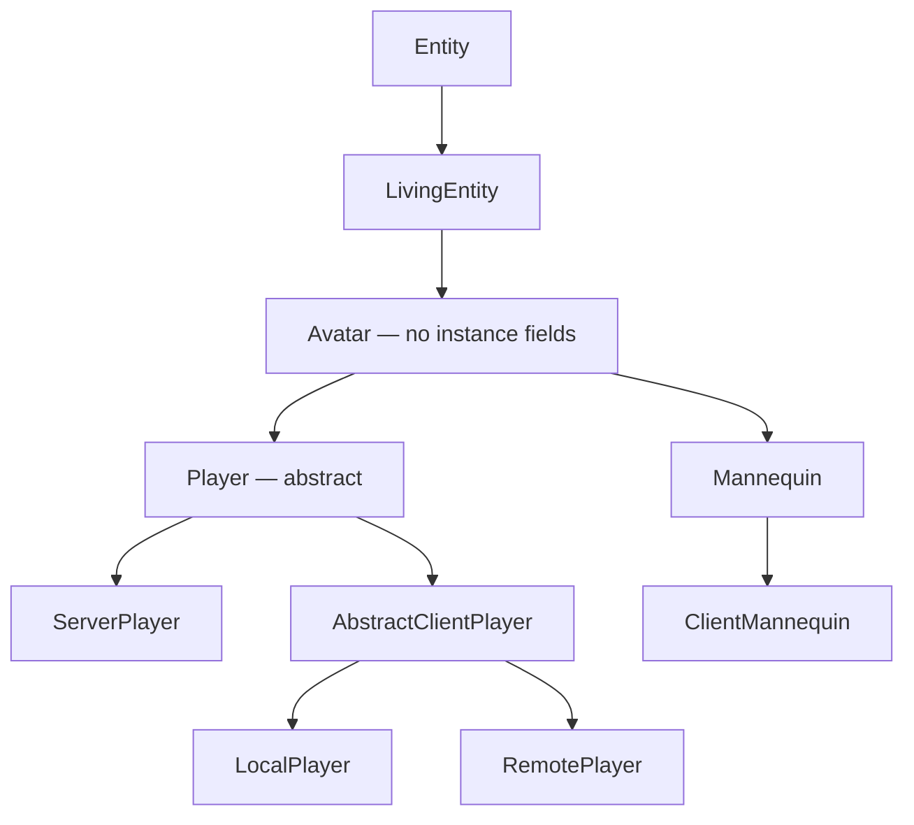

# Player anatomy

> Verified against **Minecraft 26.2** · Part VIII · You open your own inventory and look at what you are made of: six classes deep on your own screen, forty-three slots wide, and one of those slots is not storage at all.

You are a `LivingEntity` that a human is steering down a connection. Almost
everything on this page follows from that sentence: the class ladder exists
to separate *what any living thing does* from *what a thing with an
inventory and a game mode does* from *what a thing with a connection does*.
Six rungs of it stand between `Entity` and the object on your own screen, and
five between `Entity` and the one the server holds. But two of the things a
reader goes looking for are not where they look. **One rung of that ladder
holds no instance state at all**, and **the main-hand item has no storage of
its own** — the hotbar slot you are looking at and the item
`LivingEntity.getMainHandItem` returns are the same bytes, aliased through
the equipment container a horse also has.

## The cast

| class | what it decides | thread |
|---|---|---|
| `Avatar` | the player-shaped hitbox, the eye height and the two cosmetic synched values — and no instance state | both main threads |
| `Player` | everything a reader means by *the player*: inventory, abilities, experience, sleep, reach | both |
| `ServerPlayer` | the connection, the advancements, the statistics, and every *last sent* field | server main |
| `AbstractClientPlayer` | the rung both client players share: the tab-list entry, the skin, the animation state | client main |
| `LocalPlayer` / `RemotePlayer` | the two that sit on it: the one a human steers, and every other player on your screen — interpolated, never derived | client main |
| `Inventory` | thirty-six stacks, and a window onto `EntityEquipment` for the rest | both |
| `ServerPlayerGameMode` / `MultiPlayerGameMode` | what the current `GameType` allows, one object per side | server / client main |
| `Mannequin` | the other `Avatar`: a posable dummy that gets the whole skin pipeline | both |

## The ladder, and the class 26.2 put in the middle

`Entity` and `LivingEntity` belong to [Part
VI](../entities/entity-anatomy.md#the-tree-and-the-class-that-was-inserted-into-it).
The rung above them, **`Avatar`** (`world/entity`), is fifty-seven lines
and **no instance fields at all** — every name below it is a static
constant or a static `EntityDataAccessor`, a key onto the synched table
`Entity` owns, so *owning* a synched value here means holding the key and
not the storage. It owns the player-shaped dimensions
(`Avatar.POSES`, `Avatar.STANDING_DIMENSIONS`, `Avatar.CROUCH_BB_HEIGHT`,
`Avatar.SWIMMING_BB_WIDTH`, `Avatar.SWIMMING_BB_HEIGHT`), the 1.62 eye
height (`Avatar.DEFAULT_EYE_HEIGHT`), the two cosmetic synched values
(`Avatar.DATA_PLAYER_MAIN_HAND`, `Avatar.DATA_PLAYER_MODE_CUSTOMISATION`)
read back through `Avatar.getMainArm` and `Avatar.isModelPartShown`, and
one abstract method, `Avatar.getProfile`, returning a `ResolvableProfile`.
That is the whole class.

It exists because two things in the game are shaped like a person and only
one of them is a player. `Avatar` ships in the server jar, and what it holds
is what `Player` and **`Mannequin`** both need and nothing else does: the
body, the eye height, the arm you favour and the model parts you have turned
off. Everything a *player* has on top of that — the inventory, the abilities,
the hunger, the attribute set — is `Player`'s, which is why
`Player.createAttributes` is on `Player` and a mannequin gets the plain
living set ([attributes](../entities/attributes.md#the-prototype-frozen-at-class-init)).
The renderer follows the same line rather than drawing it: `AvatarRenderer`
is generic over *an `Avatar` that is also a `ClientAvatarEntity`*, and exactly
two classes satisfy that, `AbstractClientPlayer` and **`ClientMannequin`**.
That pairing is worth knowing, because the mannequin repeats `Player`'s
server/client split on its own branch, and in one class instead of two:
`Mannequin` (`world/entity/decoration`) holds a mutable static factory,
`Mannequin.constructor`, and `ClientMannequin.registerOverrides` replaces it
during client startup, so a mannequin spawned into a `ClientLevel` is really
a `ClientMannequin` with the full `PlayerModel` and skin pipeline behind it.
The mannequin is therefore a **sibling of `Player`**, not of `ArmorStand`;
only the package is shared with the armour stand. It is posable
(`Mannequin.VALID_POSES`), profiled (`Mannequin.DATA_PROFILE`), describable
(`Mannequin.DATA_DESCRIPTION`) and optionally immovable
(`Mannequin.DATA_IMMOVABLE`).

**`Player`** itself is abstract for one method above all: `Player.gameMode`,
returning a nullable `GameType`. A long tail of its other methods are empty
hooks that exist so the two sides can disagree —
`Player.onUpdateAbilities`, `Player.awardStat`,
`Player.triggerRecipeCrafted`, `Player.crit`, `Player.magicCrit`,
`Player.sendSystemMessage`, `Player.doCloseContainer`,
`Player.openTextEdit`, `Player.sendMerchantOffers`,
`Player.handleCreativeModeItemDrop`. On `Player` they do nothing; the
subclass with somewhere to send a packet overrides them.

## What `Player` owns

| what | the fields | who explains it |
|---|---|---|
| storage | `Player.inventory`, `Player.enderChestInventory` (a `PlayerEnderChestContainer`) | below |
| the open window | `Player.inventoryMenu` (final) and `Player.containerMenu`, which *is* `Player.inventoryMenu` when nothing is open | [containers and menus](../items/containers-and-menus.md#the-chest-you-see-is-not-the-chest) |
| what the mode allows | `Player.abilities` | below |
| the food bar | `Player.foodData` | [hunger and experience](hunger-and-experience.md#the-food-bar-is-four-numbers-and-a-pile-of-literals) |
| experience | `Player.experienceLevel`, `Player.experienceProgress`, `Player.totalExperience`, `Player.enchantmentSeed`, `Player.lastLevelUpTime`, `Player.takeXpDelay` | [hunger and experience](hunger-and-experience.md#the-other-bar-and-the-number-it-is-really-watching) |
| sleep | `Player.sleepCounter`, `Player.startSleepInBed` / `Player.stopSleepInBed`, the `Player.BedSleepingProblem` refusals, `Player.SLEEP_DURATION` (100) and `Player.WAKE_UP_DURATION` (10) | `ServerLevel` owns the *everyone is asleep* half |
| the two combat clocks | `LivingEntity.attackStrengthTicker` and `LivingEntity.itemSwapTicker`, declared one rung up but read, reset and incremented only here | [the sword swing](the-sword-swing.md#the-two-clocks-a-swing-is-charged-against) |
| cooldowns | `Player.cooldowns`, built by `Player.createItemCooldowns`, which only `ServerPlayer` overrides | [using an item](../items/using-an-item.md#the-two-endings) |
| four synched values | `Player.DATA_PLAYER_ABSORPTION_ID`, `Player.DATA_SCORE_ID`, `Player.DATA_SHOULDER_PARROT_LEFT`, `Player.DATA_SHOULDER_PARROT_RIGHT` | [synched entity data](../entities/synched-entity-data.md#nineteen-slots-and-where-the-numbers-come-from) |
| addressing | `Player.ENDER_SLOT_OFFSET` (200), `Player.HELD_ITEM_SLOT` (499), `Player.CRAFTING_SLOT_OFFSET` (500), decoded by `Player.getSlot` — the numbering `/item` and `/replaceitem` speak | below |
| the odds and ends | `Player.gameProfile`, `Player.lastDeathLocation`, `Player.fishing`, `Player.reducedDebugInfo`, `Player.lastItemInMainHand`, `Player.hurtDir`, `Player.jumpTriggerTime`, `Player.wasUnderwater` | — |

None of those four synched values is the hand, which went up to `Avatar`;
and a *player's* skin is not synched data at all: it arrives out of band,
from the tab-list entry. A mannequin's does travel as synched data, in
`Mannequin.DATA_PROFILE`.

The skin itself is a small closed family in the same package, and it is
worth naming because none of it is on the entity. **`PlayerSkin`** is a
record of three textures — body, cape and elytra — plus a `PlayerModelType`
(`PlayerModelType.SLIM` or `PlayerModelType.WIDE`, the two arm widths) and a
*secure* flag saying whether the textures came signed. It lives on the
tab-list entry, not on the player, which is why a skin can change without an
entity packet. **`PlayerModelPart`** is the other half: the seven toggles in
the skin-customisation screen, each a bit in the byte
`Avatar.DATA_PLAYER_MODE_CUSTOMISATION` carries, read back through
`Avatar.isModelPartShown`. Drawing any of it is Part XI's — the skin and
the seven toggles land in an `AvatarRenderState` at [extract
time](../rendering/entity-rendering.md#a-player-is-a-skin-record-and-seven-booleans).

**Reach is two attributes, not one.** `Player.blockInteractionRange` and
`Player.entityInteractionRange` read `Attributes.BLOCK_INTERACTION_RANGE`
and `Attributes.ENTITY_INTERACTION_RANGE`
([attributes](../entities/attributes.md#forty-numbers-every-one-of-them-clamped)), whose defaults — 4.5 and 3.0 —
live on the attributes themselves. `Player.DEFAULT_BLOCK_INTERACTION_RANGE`
and `Player.DEFAULT_ENTITY_INTERACTION_RANGE` name the same two numbers and
are read by nothing. The checks the server makes are
`Player.isWithinBlockInteractionRange` and
`Player.isWithinEntityInteractionRange`. Note which class supplies which:
`Player.createAttributes` adds the *block* range, `Attributes.BLOCK_BREAK_SPEED`,
`Attributes.SUBMERGED_MINING_SPEED`, `Attributes.SNEAKING_SPEED`,
`Attributes.MINING_EFFICIENCY`, `Attributes.SWEEPING_DAMAGE_RATIO` and the
waypoint attributes, while the *entity* range comes from
`LivingEntity.createLivingAttributes`.

Two smaller seams: `Player.permissions` returns
`PermissionSet.NO_PERMISSIONS` and both sides override it — it is what
`Player.canUseGameMasterBlocks` consults alongside `Abilities.instabuild`
for `Permissions.COMMANDS_GAMEMASTER` — and `Player` implements
`ContainerUser`, which is how a chest decides you are still close enough to
keep it open (`Player.getContainerInteractionRange`).

## Forty-three slots, and one of them is an alias

`Inventory` implements `Container` in a particular shape: **one
`Inventory.items` list of thirty-six stacks (`Inventory.INVENTORY_SIZE`)
plus a reference to the player's `EntityEquipment`.** Slots at or above
thirty-six are not stored here at all. `Inventory.EQUIPMENT_SLOT_MAPPING`
routes them into the equipment object — the four armour indices,
`Inventory.SLOT_OFFHAND` (40), `Inventory.SLOT_BODY_ARMOR` (41) and
`Inventory.SLOT_SADDLE` (42) — so `Inventory.getContainerSize` is
**forty-three**, and a player carries the same body-armour and saddle slots
a horse does.

`Player.createEquipment` returns a **`PlayerEquipment`**, which overrides
the map so that `EquipmentSlot.MAINHAND` resolves to
`Inventory.getSelectedItem`. That is the alias: the held item is not stored
twice, and the main hand *is* the selected hotbar slot seen through the
equipment interface.

The rest of the class is the vocabulary the whole game uses to put things
in a player: `Inventory.add`, `Inventory.getFreeSlot`,
`Inventory.getSlotWithRemainingSpace`,
`Inventory.placeItemBackInInventory`, `Inventory.findSlotMatchingItem`,
`Inventory.contains`, `Inventory.removeItem`,
`Inventory.clearOrCountMatchingItems`, `Inventory.dropAll`,
`Inventory.getSuitableHotbarSlot`, `Inventory.addAndPickItem` and
`Inventory.pickSlot` (pick-block), and `Inventory.fillStackedContents`, which
hands the whole inventory to `StackedContents` — the 470-line matcher that
lives in this package and belongs to [recipes](../items/recipes.md#the-cast). `Inventory.save` and `Inventory.load` cover the thirty-six —
the equipment half is persisted by `LivingEntity` — and
`Inventory.setSelectedSlot` throws rather than accept a non-hotbar index.

### Why the forty-three need two ticking calls

The split is visible once a tick. `Inventory.tick` runs over the thirty-six
ordinary slots, called from `Player.aiStep`; `EntityEquipment.tick` covers
the other seven, called from `LivingEntity.aiStep` one rung up. Neither
knows about the other's slots, because neither object holds them. A third
walk then crosses the whole forty-three at once — the second half of the
player's tick offers every stack to
`ServerPlayer.synchronizeSpecialItemUpdates`, which is how a filled map gets
its update packet ([the two-phase
tick](the-two-phase-tick.md#phase-two-what-this-player-would-do-if-it-simulated-itself)).
Two callers for one tick hook is not an accident of history; it is the
storage split showing through.

### The other numbering, the one a command speaks

Those forty-three are not the numbering a command speaks. `Player.getSlot`
decodes a second, sparser addressing over the same storage and past it: an
index inside the thirty-six is an ordinary slot, `Player.ENDER_SLOT_OFFSET`
plus *n* reaches the ender chest, `Player.CRAFTING_SLOT_OFFSET` plus *n* the
four crafting-grid slots, `Player.HELD_ITEM_SLOT` is the stack on the cursor
rather than any stored slot, and anything else falls through to the equipment
slots one rung up. That is the map behind a slot argument in a command.

## `Abilities`, `GameType`, and the one method that connects them

`Abilities` is five public booleans and two floats:
`Abilities.invulnerable`, `Abilities.flying`, `Abilities.mayfly`,
`Abilities.instabuild`, `Abilities.mayBuild`, plus
`Abilities.getFlyingSpeed` and `Abilities.getWalkingSpeed`. It does not
serialise itself by hand — it packs into the record `Abilities.Packed` and
`Abilities.Packed.CODEC` does the work, through `Abilities.pack` and
`Abilities.apply`.

`GameType` is the four-constant enum (`GameType.SURVIVAL`,
`GameType.CREATIVE`, `GameType.ADVENTURE`, `GameType.SPECTATOR`) with
`GameType.DEFAULT_MODE`, a `GameType.CODEC` and a `GameType.STREAM_CODEC`.
The method that matters is **`GameType.updatePlayerAbilities`**: the single
place in the game that decides which abilities a mode grants. Both sides
call it — the server from `ServerPlayerGameMode`, the client from
`MultiPlayerGameMode` on login, on respawn and on a mode-change event.
`GameType.isBlockPlacingRestricted` is what sets `Abilities.mayBuild`, and
`GameType.isSurvival` is true for `GameType.ADVENTURE` too.

The save file does not use the accessors' names for any of this:
`Abilities.Packed.CODEC` names the keys, and it writes *flySpeed* where the
accessor is `Abilities.getFlyingSpeed`. While reading that class, note the
misspelled constant beside it — `Abilities.DEFAULY_FLYING`.

That is also where a data pack's reach over the player ends. Two things
outside the class are data: `Player.createAttributes` supplies the attribute
defaults, and game rules and server properties set the starting `GameType`.
Everything else here — the ladder, the slot count, what each mode grants — is
code, which makes the player one of the few systems in the game a data pack
cannot redefine.

## The two game-mode objects

|  | `ServerPlayerGameMode` (`server/level`) | `MultiPlayerGameMode` (`client/multiplayer`) |
|---|---|---|
| owns the mode | `ServerPlayerGameMode.getGameModeForPlayer` | `MultiPlayerGameMode.getPlayerMode` |
| changes it | `ServerPlayerGameMode.changeGameModeForPlayer` | `MultiPlayerGameMode.setLocalMode` |
| breaking state | `ServerPlayerGameMode.isDestroyingBlock`, `ServerPlayerGameMode.destroyProgressStart`, `ServerPlayerGameMode.hasDelayedDestroy` | `MultiPlayerGameMode.isDestroying`, `MultiPlayerGameMode.destroyProgress`, `MultiPlayerGameMode.destroyDelay` |
| the block hooks | `ServerPlayerGameMode.handleBlockBreakAction`, `ServerPlayerGameMode.useItemOn`, `ServerPlayerGameMode.useItem` | `MultiPlayerGameMode.startDestroyBlock`, `MultiPlayerGameMode.continueDestroyBlock`, `MultiPlayerGameMode.useItemOn`, `MultiPlayerGameMode.useItem` |
| attacking | — (`ServerGamePacketListenerImpl` handles it) | `MultiPlayerGameMode.attack`, `MultiPlayerGameMode.interact` |
| containers | — | `MultiPlayerGameMode.handleContainerInput` |

`ServerPlayerGameMode` has exactly one subclass, **`DemoMode`**, which
`MinecraftServer` hands a player instead when the server is in demo mode. It
watches the level's own *gameTime* rather than a clock of its own: it fires
the tutorial prompts on the first morning, a message on each of the
`DemoMode.DEMO_DAYS`, and past `DemoMode.TOTAL_PLAY_TICKS` it overrides the
block-break and use hooks to answer with a reminder instead of doing
anything. It is the only place in the game where the game-mode *object*,
rather than the `GameType`, decides what you may do.

Neither object is held by `Player` itself, and only one of them is held by
a player at all: `Minecraft.gameMode` holds the client one — `LocalPlayer`
has no such field — while `ServerPlayer.gameMode` is a field on the server
player. [Block
interaction](../blocks/block-interaction.md#the-gate-list-and-what-each-refusal-answers-with)
and [block breaking](../blocks/block-breaking.md#the-button-is-not-the-switch)
own the block halves of both columns,
and [prediction and
acknowledgement](../client/prediction-and-acks.md#the-four-writes) owns
the ledger they share — which, note, `MultiPlayerGameMode` does not hold
either: `MultiPlayerGameMode.startPrediction` reaches for
`ClientLevel.getBlockStatePredictionHandler` per call.

## The three sides of one player

Three concrete classes carry a player, and the fourth name in this section is
not a fourth side: **`AbstractClientPlayer`** is the rung the two client ones
share, and it holds what both of them need.

**`ServerPlayer`** is everything that needs a server. `ServerPlayer.connection`
is the `ServerGamePacketListenerImpl` everything else reaches the client
through; `ServerPlayer.advancements`, `ServerPlayer.stats` and
`ServerPlayer.recipeBook` (a `ServerRecipeBook`) are the three ledgers a
session accumulates; `ServerPlayer.chunkTrackingView` and
`ServerPlayer.lastSectionPos` record what the client has been sent ([what the
client is
told](../networking/what-the-client-is-told.md#chunks-arrive-on-a-loop-the-client-paces));
and `ServerPlayer.chatSession`, a `RemoteChatSession`, holds the *public*
half of message signing, since the key pair never leaves the client ([chat and
signing](../networking/chat-and-signing.md#what-the-signature-covers)).
Around those sit the fields that exist because a server has to remember
something the world cannot re-derive: `ServerPlayer.respawnConfig` for where
you come back, `ServerPlayer.camera` for what you are looking through,
`ServerPlayer.textFilter` for what a chat message is allowed to be,
`ServerPlayer.wardenSpawnTracker` for how loud you have been,
`ServerPlayer.enderPearls` for the pearls in flight, and
`ServerPlayer.containerSynchronizer` for the open window's own outbound
channel.

What is worth more than the roll-call is the shape of two rows of fields on
it, because both exist for the same reason and answer to different readers.
The `ServerPlayer.lastSentHealth`, `ServerPlayer.lastSentFood` and
`ServerPlayer.lastSentExp` trio turn a difference into **one packet**; a
second row led by `ServerPlayer.lastRecordedArmor` turns a difference into a
**scoreboard criterion update** instead. Nothing on the server watches a
value change: it compares the value against the copy it last acted on. A
third pair remembers what the client *said* rather than what the server
found — `ServerPlayer.lastClientInput` (an `Input`) and
`ServerPlayer.lastKnownClientMovement`, both explained by [input to
movement](input-to-movement.md#what-each-side-holds). [Players and
sessions](../server/players-and-sessions.md#preparing-a-place-to-stand) owns
this object's lifecycle; it is constructed during the *configuration* phase
by `PrepareSpawnTask`, before the play listener exists.

**`AbstractClientPlayer`** adds what a client needs to *draw* a player and to
name one. Its `AbstractClientPlayer.playerInfo` is the tab-list entry,
fetched lazily from the connection — and that entry is enough of a directory
that the client registers `LocalPlayerResolver` in front of the ordinary
profile lookup, so a name typed into a command resolves out of the tab list
before anything asks a server. It also carries the per-frame animation state
`AvatarRenderer` reads (`AbstractClientPlayer.clientAvatarState`),
`AbstractClientPlayer.getSkin` and the field-of-view modifier.

**`LocalPlayer`** is the one the human steers, and everything it adds is
about sending: `LocalPlayer.connection` (a `ClientPacketListener`),
`LocalPlayer.input` (a `ClientInput` at construction, swapped for a
`KeyboardInput` by the connection on login and respawn),
`LocalPlayer.lastSentInput` and the last-sent position block, and
`LocalPlayer.dropSpamThrottler`, which is the client's own rate limit on
throwing things away. The rest is what only a first-person view needs:
`LocalPlayer.recipeBook` (a `ClientRecipeBook`), `LocalPlayer.permissions`,
`LocalPlayer.startedUsingItem`, the auto-jump pair, and the view-bob
accumulators `LocalPlayer.yBob` and `LocalPlayer.xBob`.
**`RemotePlayer`** is every *other* player on the client, and
adds almost nothing: it sets `Entity.noPhysics`, interpolates through
`RemotePlayer.lerpDeltaMovement`, and has an **empty
`RemotePlayer.updatePlayerPose`** — another player's pose is told to you, not
derived.

Which of the three is allowed to decide anything is [Part VI's
authority](../entities/authority.md#five-predicates-and-the-final-one-the-other-four-hang-off),
stated once there: a `Player` is client-authoritative on *both* sides, and
the server runs the physics anyway. [The two-phase
tick](the-two-phase-tick.md#the-bracket-and-what-survives-it) is what that
costs.

### What crosses between them

Very little of a player is entity-synched, so the packets that carry one are
their own small set. `ClientboundLoginPacket` and `ClientboundRespawnPacket`
both carry a `CommonPlayerSpawnInfo` built by
`ServerPlayer.createCommonSpawnInfo` — which is also where the client's
*local* game mode comes from. A mode change afterwards arrives as
`ClientboundGameEventPacket.CHANGE_GAME_MODE` or
`ClientboundPlayerInfoUpdatePacket.Action.UPDATE_GAME_MODE`, and the
abilities as `ClientboundPlayerAbilitiesPacket`. The hotbar selection travels
both ways, as `ClientboundSetHeldSlotPacket` and
`ServerboundSetCarriedItemPacket`, and the inventory itself as
`ClientboundSetPlayerInventoryPacket`, built by
`Inventory.createInventoryUpdatePacket`.

## What a player is on disk

`Player.addAdditionalSaveData` and `Player.readAdditionalSaveData` are where
a player becomes a file: the inventory as a sparse slot/stack list, the
selected slot, the sleep timer, the four experience fields including the
enchanting seed, the score, the abilities through `Abilities.Packed`, the
ender chest, and the last death location. `ServerPlayer` adds the game-type
history through `ServerPlayer.storeGameTypes`, the thrown ender pearls
through `ServerPlayer.saveEnderPearls`, the vehicle through
`ServerPlayer.saveParentVehicle`, and `ServerPlayer.SavedPosition` — which
is read *before* the entity exists, by the configuration-phase spawn task.

## Questions players ask

**Why does the creative flag not come from my abilities?**
`Player.isCreative` and `Player.isSpectator` do not read `Abilities` at all;
they compare `Player.gameMode` against `GameType` constants. The flags
themselves are reached through accessors on `Player` that consult `Abilities`
for you, and the widest by far is `Player.hasInfiniteMaterials`, which reads
`Abilities.instabuild` and has more call sites than every other such accessor
put together — with `Player.preventsBlockDrops` next and `Player.mayBuild`,
`Player.isSwimming` and `Player.isPushedByFluid` well behind. The most
permissive flag in the game is also the most widely consulted one.

**Whose game mode arrives late — and why is it yours?**
On the client every player's mode comes from the tab list:
`AbstractClientPlayer.gameMode` resolves through
`AbstractClientPlayer.getPlayerInfo`, and returns null when there is no
entry. For *another* player that gap cannot be observed —
`ClientPacketListener` refuses to spawn a `RemotePlayer` whose `PlayerInfo`
has not arrived, and a `PlayerInfo` starts at `GameType.DEFAULT_MODE`, so
their mode is survival until an update packet says otherwise, never null.
The one player who really does have a null tab-list entry is **you**:
`LocalPlayer` is built during login, before your own entry is sent. What
covers the gap is a second, independent source —
`MultiPlayerGameMode.localPlayerMode`, set from the spawn info on login and
respawn and from the game-event packet — and that is the one that drives
`Abilities`, block breaking and the creative screen.

**Why does building permission survive a packet that says otherwise?**
`Abilities.mayBuild` never goes on the wire, and nothing recomputes it on
receipt. `ClientboundPlayerAbilitiesPacket` carries four flag bits and two
floats, none of them the build permission; the client's copy is written only
by `MultiPlayerGameMode` on a mode change, so an abilities packet with no
mode change leaves it as it was. The other direction is smaller still:
`ServerboundPlayerAbilitiesPacket` carries only the flying bit.

## Where to look

Open **`Player`** first and read it as the class the two sides argue over:
`Player.getSlot` is the one method that shows the command numbering,
`Player.createAttributes` the one that shows what a player has that a
mannequin does not. Then **`Avatar`** above it, which takes two minutes
and explains the `Mannequin` beside it. **`Inventory`** and
**`PlayerEquipment`** are the pair to read together, in that order, because
the second is four methods long and is the whole of the alias.
**`ServerPlayer`** and **`LocalPlayer`** are the two big faces: read them
for their *last sent* fields rather than end to end. For the modes,
**`GameType.updatePlayerAbilities`** is the single decision point and
**`ServerPlayerGameMode`** / **`MultiPlayerGameMode`** are the two objects
that call it. Two doors this page only points at: **`PrepareSpawnTask`**,
where a `ServerPlayer` is built before the play listener exists, and
**`AvatarRenderer`** with its `ClientAvatarEntity` bound, which is where the
skin and the seven toggles go.

---

*Rules: names, never code · how the system works, not how the code reads ·
newest version only · every backticked name passes `tools/verify_names.py`.*
