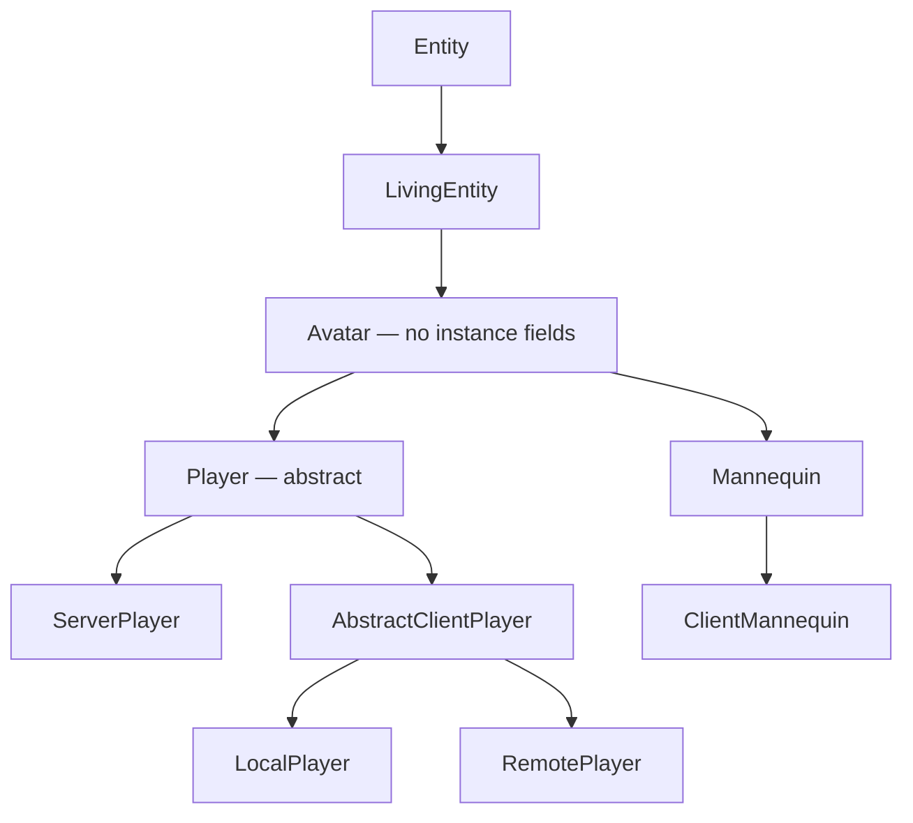

# Player anatomy

> Verified against **Minecraft 26.2** · Part VIII · You open your own inventory and look at what you are made of: five classes deep, forty-three slots wide, and one of those slots is an alias.

You are a `LivingEntity` that a human is steering through a socket. Almost
everything on this page follows from that sentence: the class ladder exists
to separate *what any living thing does* from *what a thing with an
inventory and a game mode does* from *what a thing with a connection does*.
But two of the rungs are not where a reader expects them. **There is an
abstract class between `LivingEntity` and `Player` that holds no state at
all**, and **the main hand is not stored anywhere** — the hotbar slot you
are looking at and the item `LivingEntity.getMainHandItem` returns are the
same bytes, aliased through the equipment container a horse also has.

## The cast

| class | what it decides | thread |
|---|---|---|
| `Avatar` | the player-shaped hitbox and the two cosmetic synched values — and nothing else | both main threads |
| `Player` | everything a reader means by *the player*: inventory, abilities, experience, sleep, reach | both |
| `ServerPlayer` | the connection, the advancements, the statistics, and every *last sent* field | server main |
| `LocalPlayer` | the one a human steers: input, prediction, what to send | client main |
| `RemotePlayer` | every other player on your screen — interpolated, never derived | client main |
| `Inventory` | thirty-six stacks, and a window onto `EntityEquipment` for the rest | both |
| `ServerPlayerGameMode` / `MultiPlayerGameMode` | what the current `GameType` allows, one object per side | server / client main |
| `Mannequin` | the other `Avatar`: a posable dummy that gets the whole skin pipeline | both |

## The ladder, and the class 26.2 put in the middle

`Entity` and `LivingEntity` belong to [Part VI](../entities/entity-anatomy.md).
The rung above them, **`Avatar`** (`world/entity`), is fifty-seven lines
and **no instance fields at all**. It owns the player-shaped dimensions
(`Avatar.POSES`, `Avatar.STANDING_DIMENSIONS`, `Avatar.CROUCH_BB_HEIGHT`,
`Avatar.SWIMMING_BB_WIDTH`, `Avatar.SWIMMING_BB_HEIGHT`), the 1.62 eye
height (`Avatar.DEFAULT_EYE_HEIGHT`), the two cosmetic synched values
(`Avatar.DATA_PLAYER_MAIN_HAND`, `Avatar.DATA_PLAYER_MODE_CUSTOMISATION`)
read back through `Avatar.getMainArm` and `Avatar.isModelPartShown`, and
one abstract method, `Avatar.getProfile`, returning a `ResolvableProfile`.
That is the whole class.

It exists for the renderer. `AvatarRenderer` is generic over *an `Avatar`
that is also a `ClientAvatarEntity`*, and exactly two classes satisfy that:
`AbstractClientPlayer` and **`ClientMannequin`**. The swap is worth knowing,
because it is the same server/client split `Player` has, one class lower:
`Mannequin` (`world/entity/decoration`) holds a mutable static factory,
`Mannequin.constructor`, and `ClientMannequin.registerOverrides` replaces it
during client startup, so a mannequin spawned into a `ClientLevel` is really
a `ClientMannequin` with the full `PlayerModel` and skin pipeline behind it.
The mannequin is therefore a **sibling of `Player`**, not of `ArmorStand`;
only the package is shared with the armour stand. It is posable
(`Mannequin.VALID_POSES`), profiled (`Mannequin.DATA_PROFILE`), describable
(`Mannequin.DATA_DESCRIPTION`) and optionally immovable
(`Mannequin.DATA_IMMOVABLE`).

**`Player`** itself is abstract for one method above all: `Player.gameMode`,
returning a nullable `GameType`. A long tail of its other methods are empty
hooks that exist so the two sides can disagree —
`Player.onUpdateAbilities`, `Player.awardStat`,
`Player.triggerRecipeCrafted`, `Player.crit`, `Player.magicCrit`,
`Player.sendSystemMessage`, `Player.doCloseContainer`,
`Player.openTextEdit`, `Player.sendMerchantOffers`,
`Player.handleCreativeModeItemDrop`. On `Player` they do nothing; the
subclass with somewhere to send a packet overrides them.

## What `Player` owns

| what | the fields | who explains it |
|---|---|---|
| storage | `Player.inventory`, `Player.enderChestInventory` (a `PlayerEnderChestContainer`) | below |
| the open window | `Player.inventoryMenu` (final) and `Player.containerMenu`, which *is* `Player.inventoryMenu` when nothing is open | [containers and menus](../items/containers-and-menus.md) |
| what the mode allows | `Player.abilities` | below |
| the food bar | `Player.foodData` | [hunger and experience](hunger-and-experience.md) |
| experience | `Player.experienceLevel`, `Player.experienceProgress`, `Player.totalExperience`, `Player.enchantmentSeed`, `Player.lastLevelUpTime`, `Player.takeXpDelay` | [hunger and experience](hunger-and-experience.md) |
| sleep | `Player.sleepCounter`, `Player.startSleepInBed` / `Player.stopSleepInBed`, the `Player.BedSleepingProblem` refusals, `Player.SLEEP_DURATION` (100) and `Player.WAKE_UP_DURATION` (10) | `ServerLevel` owns the *everyone is asleep* half |
| the two combat clocks | `LivingEntity.attackStrengthTicker` and `LivingEntity.itemSwapTicker`, declared one rung up but read, reset and incremented only here | [the sword swing](the-sword-swing.md) |
| cooldowns | `Player.cooldowns`, built by `Player.createItemCooldowns`, which only `ServerPlayer` overrides | [using an item](../items/using-an-item.md) |
| four synched values | `Player.DATA_PLAYER_ABSORPTION_ID`, `Player.DATA_SCORE_ID`, `Player.DATA_SHOULDER_PARROT_LEFT`, `Player.DATA_SHOULDER_PARROT_RIGHT` | [synched entity data](../entities/synched-entity-data.md) |
| addressing | `Player.ENDER_SLOT_OFFSET` (200), `Player.HELD_ITEM_SLOT` (499), `Player.CRAFTING_SLOT_OFFSET` (500), decoded by `Player.getSlot` | commands and containers |
| the odds and ends | `Player.gameProfile`, `Player.lastDeathLocation`, `Player.fishing`, `Player.reducedDebugInfo`, `Player.lastItemInMainHand`, `Player.hurtDir`, `Player.jumpTriggerTime`, `Player.wasUnderwater` | — |

None of those four synched values is the hand, which went up to `Avatar`;
and the *skin* is not synched data at all. It arrives out of band — from the
tab-list entry for a player, from `Mannequin.DATA_PROFILE` for a mannequin.

**Reach is two attributes, not one.** `Player.blockInteractionRange` and
`Player.entityInteractionRange` read `Attributes.BLOCK_INTERACTION_RANGE`
and `Attributes.ENTITY_INTERACTION_RANGE`
([attributes](../entities/attributes.md)), whose defaults — 4.5 and 3.0 —
live on the attributes themselves. `Player.DEFAULT_BLOCK_INTERACTION_RANGE`
and `Player.DEFAULT_ENTITY_INTERACTION_RANGE` name the same two numbers and
are read by nothing. The checks the server makes are
`Player.isWithinBlockInteractionRange` and
`Player.isWithinEntityInteractionRange`. Note which class supplies which:
`Player.createAttributes` adds the *block* range, `Attributes.BLOCK_BREAK_SPEED`,
`Attributes.SUBMERGED_MINING_SPEED`, `Attributes.SNEAKING_SPEED`,
`Attributes.MINING_EFFICIENCY`, `Attributes.SWEEPING_DAMAGE_RATIO` and the
waypoint attributes, while the *entity* range comes from
`LivingEntity.createLivingAttributes`.

Two smaller seams: `Player.permissions` returns
`PermissionSet.NO_PERMISSIONS` and both sides override it — it is what
`Player.canUseGameMasterBlocks` consults alongside `Abilities.instabuild`
for `Permissions.COMMANDS_GAMEMASTER` — and `Player` implements
`ContainerUser`, which is how a chest decides you are still close enough to
keep it open (`Player.getContainerInteractionRange`).

## Forty-three slots, and one of them is an alias

`Inventory` implements `Container` in a particular shape: **one
`Inventory.items` list of thirty-six stacks (`Inventory.INVENTORY_SIZE`)
plus a reference to the player's `EntityEquipment`.** Slots at or above
thirty-six are not stored here at all. `Inventory.EQUIPMENT_SLOT_MAPPING`
routes them into the equipment object — the four armour indices,
`Inventory.SLOT_OFFHAND` (40), `Inventory.SLOT_BODY_ARMOR` (41) and
`Inventory.SLOT_SADDLE` (42) — so `Inventory.getContainerSize` is
**forty-three**, and a player carries the same body-armour and saddle slots
a horse does.

`Player.createEquipment` returns a **`PlayerEquipment`**, which overrides
the map so that `EquipmentSlot.MAINHAND` resolves to
`Inventory.getSelectedItem`. That is the alias: the held item is not stored
twice, and the main hand *is* the selected hotbar slot seen through the
equipment interface.

The rest of the class is the vocabulary the whole game uses to put things
in a player: `Inventory.add`, `Inventory.getFreeSlot`,
`Inventory.getSlotWithRemainingSpace`,
`Inventory.placeItemBackInInventory`, `Inventory.findSlotMatchingItem`,
`Inventory.contains`, `Inventory.removeItem`,
`Inventory.clearOrCountMatchingItems`, `Inventory.dropAll`,
`Inventory.getSuitableHotbarSlot`, `Inventory.addAndPickItem` and
`Inventory.pickSlot` (pick-block), and `Inventory.fillStackedContents` (the
recipe book). `Inventory.save` and `Inventory.load` cover the thirty-six —
the equipment half is persisted by `LivingEntity` — and
`Inventory.setSelectedSlot` throws rather than accept a non-hotbar index.

## `Abilities`, `GameType`, and the one method that connects them

`Abilities` is five public booleans and two floats:
`Abilities.invulnerable`, `Abilities.flying`, `Abilities.mayfly`,
`Abilities.instabuild`, `Abilities.mayBuild`, plus
`Abilities.getFlyingSpeed` and `Abilities.getWalkingSpeed`. It does not
serialise itself by hand — it packs into the record `Abilities.Packed` and
`Abilities.Packed.CODEC` does the work, through `Abilities.pack` and
`Abilities.apply`.

`GameType` is the four-constant enum (`GameType.SURVIVAL`,
`GameType.CREATIVE`, `GameType.ADVENTURE`, `GameType.SPECTATOR`) with
`GameType.DEFAULT_MODE`, a `GameType.CODEC` and a `GameType.STREAM_CODEC`.
The method that matters is **`GameType.updatePlayerAbilities`**: the single
place in the game that decides which abilities a mode grants. Both sides
call it — the server from `ServerPlayerGameMode`, the client from
`MultiPlayerGameMode` on login, on respawn and on a mode-change event.
`GameType.isBlockPlacingRestricted` is what sets `Abilities.mayBuild`, and
`GameType.isSurvival` is true for `GameType.ADVENTURE` too.

## The two game-mode objects

|  | `ServerPlayerGameMode` (`server/level`) | `MultiPlayerGameMode` (`client/multiplayer`) |
|---|---|---|
| owns the mode | `ServerPlayerGameMode.getGameModeForPlayer` | `MultiPlayerGameMode.getPlayerMode` |
| changes it | `ServerPlayerGameMode.changeGameModeForPlayer` | `MultiPlayerGameMode.setLocalMode` |
| breaking state | `ServerPlayerGameMode.isDestroyingBlock`, `ServerPlayerGameMode.destroyProgressStart`, `ServerPlayerGameMode.hasDelayedDestroy` | `MultiPlayerGameMode.isDestroying`, `MultiPlayerGameMode.destroyProgress`, `MultiPlayerGameMode.destroyDelay` |
| the block hooks | `ServerPlayerGameMode.handleBlockBreakAction`, `ServerPlayerGameMode.useItemOn`, `ServerPlayerGameMode.useItem` | `MultiPlayerGameMode.startDestroyBlock`, `MultiPlayerGameMode.continueDestroyBlock`, `MultiPlayerGameMode.useItemOn`, `MultiPlayerGameMode.useItem` |
| attacking | — (`ServerGamePacketListenerImpl` handles it) | `MultiPlayerGameMode.attack`, `MultiPlayerGameMode.interact` |
| containers | — | `MultiPlayerGameMode.handleContainerInput` |

Neither object is held by the player. `Minecraft.gameMode` holds the client
one; `ServerPlayer.gameMode` holds the server one. [Block
interaction](../blocks/block-interaction.md) and [block
breaking](../blocks/block-breaking.md) own the block halves of both columns,
and [prediction and acknowledgement](../client/prediction-and-acks.md) owns
the ledger they share — which, note, `MultiPlayerGameMode` does not hold
either: `MultiPlayerGameMode.startPrediction` reaches for
`ClientLevel.getBlockStatePredictionHandler` per call.

## The three sides of one player

**`ServerPlayer`** is everything that needs a server:
`ServerPlayer.connection` (the `ServerGamePacketListenerImpl`),
`ServerPlayer.gameMode`, `ServerPlayer.advancements`, `ServerPlayer.stats`,
`ServerPlayer.recipeBook` (a `ServerRecipeBook`),
`ServerPlayer.chunkTrackingView` and `ServerPlayer.lastSectionPos` — what
the client has been sent ([tickets and
loading](../world/tickets-and-loading.md)) —
`ServerPlayer.respawnConfig`, `ServerPlayer.camera`,
`ServerPlayer.textFilter`, `ServerPlayer.wardenSpawnTracker`,
`ServerPlayer.enderPearls`, `ServerPlayer.containerSynchronizer`, and a row
of *last sent* fields — `ServerPlayer.lastSentHealth`,
`ServerPlayer.lastSentFood`, `ServerPlayer.lastSentExp`,
`ServerPlayer.lastRecordedArmor` and friends — that exist only so the
server can notice a change and send one packet. It also remembers what the
client *said*: `ServerPlayer.lastClientInput` (an `Input`) and
`ServerPlayer.lastKnownClientMovement`, both explained by [input to
movement](input-to-movement.md). [Players and
sessions](../server/players-and-sessions.md) owns this object's lifecycle;
it is constructed during the *configuration* phase by `PrepareSpawnTask`,
before the play listener exists.

**`AbstractClientPlayer`** adds the tab-list entry
(`AbstractClientPlayer.playerInfo`, fetched lazily from the connection), the
per-frame animation state `AvatarRenderer` reads
(`AbstractClientPlayer.clientAvatarState`), `AbstractClientPlayer.getSkin`
and the field-of-view modifier. **`LocalPlayer`** is the one the human
steers: `LocalPlayer.connection` (a `ClientPacketListener`),
`LocalPlayer.input` (a `ClientInput` at construction, swapped for a
`KeyboardInput` by the connection on login and respawn),
`LocalPlayer.lastSentInput`, the last-sent position block,
`LocalPlayer.recipeBook` (a `ClientRecipeBook`),
`LocalPlayer.dropSpamThrottler`, `LocalPlayer.permissions`,
`LocalPlayer.autoJumpEnabled`, `LocalPlayer.startedUsingItem` and the
view-bob fields `LocalPlayer.yBob` / `LocalPlayer.xBob`. **`RemotePlayer`**
is every *other* player on the client: it sets `Entity.noPhysics`,
interpolates through `RemotePlayer.lerpDeltaMovement`, and has an **empty
`RemotePlayer.updatePlayerPose`** — another player's pose is told to you,
not derived.

Which of the three is allowed to decide anything is [Part VI's
authority](../entities/authority.md), stated once there: a `Player` is
client-authoritative on *both* sides, and the server runs the physics
anyway. [The two-phase tick](the-two-phase-tick.md) is what that costs.

## What a player is on disk

`Player.addAdditionalSaveData` and `Player.readAdditionalSaveData` are where
a player becomes a file: the inventory as a sparse slot/stack list, the
selected slot, the sleep timer, the four experience fields including the
enchanting seed, the score, the abilities through `Abilities.Packed`, the
ender chest, and the last death location. `ServerPlayer` adds the game-type
history through `ServerPlayer.storeGameTypes`, the thrown ender pearls
through `ServerPlayer.saveEnderPearls`, the vehicle through
`ServerPlayer.saveParentVehicle`, and `ServerPlayer.SavedPosition` — which
is read *before* the entity exists, by the configuration-phase spawn task.

## Questions players ask

**Why does the creative flag not come from my abilities?**
`Player.isCreative` and `Player.isSpectator` do not read `Abilities` at all;
they compare `Player.gameMode` against `GameType` constants. Of the ability
flags, only `Abilities.instabuild` has a narrow readership —
`Player.hasInfiniteMaterials` and `Player.preventsBlockDrops` — while the
others are read all over, by `Player.mayBuild`, `Player.isSwimming`,
`Player.isPushedByFluid` and the pose and damage paths.

**Why does another player's game mode arrive late, and mine not at all?**
On the client a player's mode comes from the tab list:
`AbstractClientPlayer.gameMode` resolves through
`AbstractClientPlayer.getPlayerInfo`, so it is null until
`ClientboundPlayerInfoUpdatePacket` has arrived. Your own has a second,
independent source — `MultiPlayerGameMode.localPlayerMode`, set from the
spawn info on login and respawn and from the game-event packet — and it is
the one that drives `Abilities`, block breaking and the creative screen.

**Why does building permission survive a packet that says otherwise?**
`Abilities.mayBuild` never goes on the wire, and nothing recomputes it on
receipt. `ClientboundPlayerAbilitiesPacket` carries four flag bits and two
floats, none of them the build permission; the client's copy is written only
by `MultiPlayerGameMode` on a mode change, so an abilities packet with no
mode change leaves it as it was. The other direction is smaller still:
`ServerboundPlayerAbilitiesPacket` carries only the flying bit.

**Why does the save file say *flySpeed* when the accessor is
`Abilities.getFlyingSpeed`?** Because `Abilities.Packed.CODEC` names the
keys, and it does not match the accessors. While reading that class, note
the misspelled constant: `Abilities.DEFAULY_FLYING`.

**Why does item ticking need two callers?** Because of the forty-three
slots. `Inventory.tick` runs over the thirty-six ordinary ones from
`Player.aiStep`, and `EntityEquipment.tick` covers the other seven from
`LivingEntity.aiStep`; `ServerPlayer.synchronizeSpecialItemUpdates` walks
all forty-three.

**What crosses the wire about the player itself?**
`ClientboundLoginPacket` and `ClientboundRespawnPacket`, both carrying a
`CommonPlayerSpawnInfo` built by `ServerPlayer.createCommonSpawnInfo` —
which is also where the client's *local* game mode comes from;
`ClientboundPlayerAbilitiesPacket`; `ClientboundGameEventPacket.CHANGE_GAME_MODE`
and `ClientboundPlayerInfoUpdatePacket.Action.UPDATE_GAME_MODE` for a mode
change; `ClientboundSetHeldSlotPacket` and the serverbound
`ServerboundSetCarriedItemPacket` for the hotbar; and
`ClientboundSetPlayerInventoryPacket`, built by
`Inventory.createInventoryUpdatePacket`.

**Can a data pack redefine any of this?** Almost none of it.
`Player.createAttributes` supplies the attribute defaults, and game rules
and server properties set the starting `GameType`. The player is one of the
few systems in the game a data pack cannot redefine.

**Which names will I hunt for under other spellings?** The renderer is
`AvatarRenderer`, and pick-block is `Inventory.addAndPickItem`.

## Where to look

`Player` · `Avatar` · `ServerPlayer` · `AbstractClientPlayer` ·
`LocalPlayer` · `RemotePlayer` · `Inventory` · `PlayerEquipment` ·
`Abilities` · `GameType` · `ServerPlayerGameMode` · `MultiPlayerGameMode` ·
`PrepareSpawnTask` · `Mannequin` · `ClientMannequin` · `AvatarRenderer` ·
`ClientAvatarEntity`

---

*Rules: names, never code · how the system works, not how the code reads ·
newest version only · every backticked name passes `tools/verify_names.py`.*
