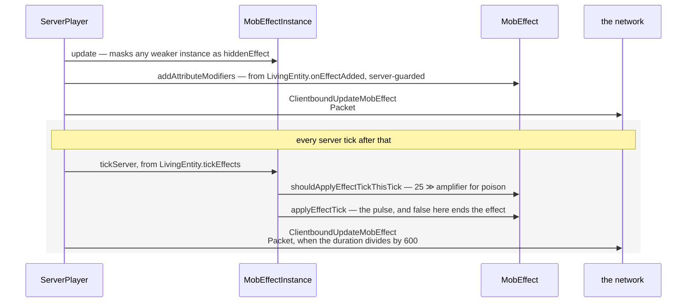
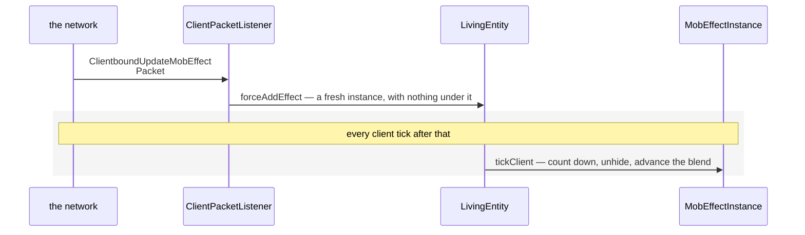

# Status effects

> Verified against **Minecraft 26.2** · Part VIII · Poison II is already on you: the server hurts you on a rhythm, and your client never runs a single one of the effect's hooks — it only counts.

Poison II lands. Your health starts dropping in steps, the swirls appear,
the icon in the corner counts down, and if the connection stutters the
number in the corner keeps counting anyway. That last part is the whole
page. **The client never runs a `MobEffect` hook.** It counts durations
down, advances a blend factor, unhides a masked effect and spawns particles
from a list the server synched. It does *read* the effects it holds — jump
boost in `LivingEntity.getJumpBoostPower`, slow falling in
`LivingEntity.getEffectiveGravity`, levitation inside `LivingEntity.travel`
([movement and
collision](../entities/movement-and-collision.md#and-then-gravity)) — because
that is shared movement code your own player runs unguarded, which is the one
case in the book where the client simulates in earnest ([authority](../entities/authority.md#three-cases-read-on-both-sides)). But
every attribute modifier, every pulse of damage, every regeneration tick
happens on the server behind an explicit server-side guard, and the client's
copy of the duration is corrected only when the server happens to notice —
which it does by testing whether the remaining duration **divides by six
hundred**. For a finite effect that is once every six hundred ticks. An
**infinite** effect's duration is −1, which divides by nothing, so it is
never re-sent at all.

## The cast

| class | what it decides | thread |
|---|---|---|
| `MobEffect` | what the effect *does*, and on what rhythm — the singleton, shared by every holder | server main (of this class the client reads only the colour and the blend durations) |
| `MobEffectInstance` | duration, amplifier, flags, and the masked effect underneath | both main threads |
| `MobEffects` | the forty built-in holders | — |
| `LivingEntity` | `LivingEntity.activeEffects`, the tick, and the three server-guarded hooks | both |
| `AttributeInstance` | where an effect's modifier actually lands | server main |
| `ServerPlayer` | who gets told, and how often | server main |
| `MobEffectUtil` | the questions the rest of the game asks about effects | both |

## What an effect is

**`MobEffect`** is the behaviour singleton: a category, a colour, a particle
factory, blend durations and a map of `MobEffect.AttributeTemplate`s. Its
hooks are the interesting part, because one of them is false by default.

| hook | when it runs |
|---|---|
| `MobEffect.shouldApplyEffectTickThisTick` | every tick, to ask whether this is a pulse — **false by default** |
| `MobEffect.applyEffectTick` | on a pulse; returning false ends the effect |
| `MobEffect.applyInstantaneousEffect` | never from the tick — only from the splash potion, the lingering cloud and the drink |
| `MobEffect.onEffectAdded` | when it lands on an entity that did not already have it |
| `MobEffect.onEffectStarted` | on every successful add, a refresh of an existing effect included |
| `MobEffect.onMobHurt` | when the holder takes damage |
| `MobEffect.onMobRemoved` | when the holder goes |

The default *false* is why each effect has its own rhythm, and each rhythm is
one number **right-shifted by the amplifier** — halved per level, floored at
one tick. Poison's is 25, so Poison I pulses every 25 ticks and the Poison II
of this page's scenario every 12; regeneration's is 50, wither's 40, and
hunger's override skips the arithmetic and pulses every tick.
Attribute modifiers go on as `AttributeInstance.addPermanentModifier` with
an amount linear in amplifier + 1, computed by
`MobEffect.AttributeTemplate.create` ([attributes](../entities/attributes.md#strength-ii-lands-and-nothing-leaves-the-server)).

**`MobEffectInstance`** is the per-entity half: duration, amplifier, the
ambient, visible and show-icon flags, a private blend state, and
**`MobEffectInstance.hiddenEffect`**.

That last one is a stack, and it is where a weaker effect goes when a
stronger one lands on top of it. `MobEffectInstance.update` builds the chain,
so Strength I with nine minutes left survives underneath a Strength II that
has thirty seconds, and surfaces again through
`MobEffectInstance.downgradeToHiddenEffect` when the stronger one expires.
Both of the instance's codecs are recursive, so the save file *and* the wire
format are each capable of carrying the whole chain.

The wire does not. **`ClientboundUpdateMobEffectPacket` never uses that
stream codec at all**: it writes an entity id, a `MobEffect` holder, an
amplifier, a duration and a flags byte by hand. So the client rebuilds an
instance with nothing under it, and learns about the masked one only when the
surfacing on the server triggers a fresh packet — which is why a weaker
effect can appear from nowhere in your list the instant a stronger one runs
out.

`MobEffectInstance.INFINITE_DURATION` is −1, and
`MobEffectInstance.compareTo` is what orders both lists of effects a player
sees — ambient last, infinite next, then by remaining duration, then by
colour. The two surfaces read it in opposite directions: the HUD sorts it
reversed and the inventory list does not, so a list of effects runs
top-to-bottom one way beside the hotbar and the other way beside your
inventory.

The blend state beside those flags is a **pure render quantity**: it ticks
only on the client, is never saved and never sent, and only
`MobEffects.NAUSEA` and `MobEffects.DARKNESS` declare blend durations to use
it. The wire carries one bit for it, set only when an effect is *first*
added — an update clears the bit, and the client responds by skipping the
blend. That is why Nausea swims in when you drink it and simply resumes when
you drink a second bottle.

`LivingEntity.canBeAffected` is the veto, and it consults three entity tags
as well as the effect itself.

**`MobEffectCategory`** is the third small vocabulary word, and it is three
constants — `MobEffectCategory.BENEFICIAL`, `MobEffectCategory.HARMFUL` and
`MobEffectCategory.NEUTRAL` — carrying nothing but a `ChatFormatting`. Two
things read it. A potion's tooltip takes each line's colour from
`MobEffectCategory.getTooltipFormatting`, which is why *neutral* prints blue
like a benefit; and the HUD asks `MobEffect.isBeneficial`, which is true of
`MobEffectCategory.BENEFICIAL` alone, to decide which of its two rows an icon
goes in — so a neutral effect sits on the bottom row with the harmful ones
while its tooltip is coloured with the good ones.

Those three are the vocabulary. The registry that uses them,
**`MobEffects`**, is forty entries, and every one is a `Holder<MobEffect>`,
not a bare `MobEffect` — including `MobEffects.BREATH_OF_THE_NAUTILUS`. Some
point at attributes a reader would not expect: `MobEffects.JUMP_BOOST`
modifies `Attributes.SAFE_FALL_DISTANCE`, and `MobEffects.INVISIBILITY`
modifies `Attributes.WAYPOINT_TRANSMIT_RANGE`.

Behind all of it is a fourth family the page's own hook rests on:
`world/effect` holds one small `MobEffect` subclass per effect that needs
behaviour — `PoisonMobEffect`, `RegenerationMobEffect`, `WitherMobEffect`,
`HungerMobEffect`, `AbsorptionMobEffect` and a dozen more, plus
`InstantaneousMobEffect` for the ones that only ever fire once. Everything
else in `MobEffects` is a plain `MobEffect` with an attribute template and no
code. The rhythms above are those subclasses overriding two methods each; the
family is the shape, and no one member is worth a lecture.

On the entity itself: `LivingEntity.activeEffects` (a plain unordered map),
`LivingEntity.effectsDirty`, and two synched values —
`LivingEntity.DATA_EFFECT_PARTICLES`, which is a **list of
`ParticleOptions`** rather than a packed colour, and
`LivingEntity.DATA_EFFECT_AMBIENCE_ID`. The dirty flag has exactly one
reader, and it is not this page's tick: `LivingEntity.updateDirtyEffects`
drains it into the invisibility flag and the swirl list from inside
`Entity.updateDataBeforeSync`, which the server's entity-sync pass calls
before it looks at what changed ([synched entity
data](../entities/synched-entity-data.md#the-gate-that-holds-a-packet-back)).
An effect that expired this tick therefore opens its own gate.

That particle list is also the whole of what a *watcher* gets, and it is
deliberately hard to see. The default particle factory bakes ambience into
the `ParticleOptions` itself — alpha 38 of 255 instead of opaque — so an
ambient effect really does synch a different, fainter particle; and the
client spawns one particle from the list on a one-in-*n* roll whose *n* is
four, fifteen if the entity is invisible, and multiplied by five again when
**every** effect on it is ambient, which is what
`LivingEntity.DATA_EFFECT_AMBIENCE_ID` records. An invisible, wholly ambient
entity is rolling one in seventy-five; a visible one in the same state,
twenty.

`MobEffectUtil` is the shared
question-asking surface: `MobEffectUtil.hasDigSpeed`,
`MobEffectUtil.hasWaterBreathing`,
`MobEffectUtil.shouldEffectsRefillAirsupply`,
`MobEffectUtil.addEffectToPlayersAround` and the duration formatter the
inventory screen uses.

## Poison II counting down on two machines

Effects are ticked from `LivingEntity.tickEffects`, the last call
`LivingEntity.baseTick` makes before it copies this tick's rotations into
last tick's — which for a player means inside
`ServerPlayer.doTick`, the connection-driven half of [the two-phase
tick](the-two-phase-tick.md#phase-two-what-this-player-would-do-if-it-simulated-itself),
not the level's entity tick.

On the server, that tick is four objects and two packets:

*Two arrows leave for the client and the second is the whole of the
correction: inside the band the duration is the server's, and the client only
hears about it on the ticks where it divides by six hundred.*

The client's half of the same scenario is a different set of objects, and the
first thing to notice about it is which class is not in it:

*There is no `MobEffect` lane here, and that absence is the page: the client
holds the instance and counts it, and never once asks the singleton what the
effect does.*

The client branch of `LivingEntity.tickEffects` never calls
`MobEffect.applyEffectTick` and never touches an attribute. It does not even
remove an expired effect: it keeps a zero-duration instance until told
otherwise.

## What survives a save, and why the modifiers do

`LivingEntity.addAdditionalSaveData` writes the active list under
*active_effects* through `MobEffectInstance.CODEC`, and only when the list is
non-empty; `LivingEntity.readAdditionalSaveData` reads it back, clears
`LivingEntity.activeEffects` and puts each instance straight in. **Nothing on
that path runs `LivingEntity.onEffectAdded`**, so the hook that would install
the attribute modifier never fires on load — and the effect's Strength still
works, because the modifier was written into the `AttributeInstance` as a
*permanent* one and was itself saved and restored ([attributes](../entities/attributes.md#the-map-and-which-set-a-change-lands-in)).
The two halves of an effect are persisted separately and reunited by
convention rather than by code, which is why the codec that can carry a
hidden-effect chain matters at all.

## Questions players ask

**Why does my duration sometimes jump?** Because it was wrong and got
corrected. The client's duration is a local countdown with nothing keeping it
honest, and the correction has no name in the code: `LivingEntity.tickEffects`
calls `LivingEntity.onEffectUpdated` whenever the remaining duration divides
by six hundred, against a bare literal. The re-send only ever reaches the
affected player or a player riding them — and never at all for an infinite
effect, whose −1 divides by nothing.

**Why can I not see how long a mob's effect has left?** Because you were
never told. A client watching a mob it is not riding receives no
`MobEffectInstance` at all — only the synched particle list, which is why
other entities have swirls and no numbers.

**Does an effect pulse on its own clock or the world's?** Both, depending on
whether it ends. `MobEffectInstance.tickServer` counts an infinite-duration
effect's pulses off the entity's age and a finite one off its own countdown.

**What happens when one effect adds another?** The rest of that tick's
effects are silently skipped. `LivingEntity.tickEffects` catches a
concurrent-modification error and drops it, so an effect that adds or removes
another quietly aborts the loop it was in.

**Where does the effect come from in the first place?** Not from this page.
Everything above starts at the moment an instance exists on a
`LivingEntity`; the machinery that puts one there — the use timer, the
finish, the replay — is [using an
item](../items/using-an-item.md#the-meal-tick-by-tick), and the components
that ride on it, `PotionContents` and `SuspiciousStewEffects` and
`ApplyStatusEffectsConsumeEffect` among them, are [hunger and
experience](hunger-and-experience.md#eating-is-a-component-walk). What
crosses the wire from here on is `ClientboundUpdateMobEffectPacket` and
`ClientboundRemoveMobEffectPacket` for the effects you hold, and
`LivingEntity.DATA_EFFECT_PARTICLES` through [synched entity
data](../entities/synched-entity-data.md) for everyone else's swirls. The
effects themselves are code, registered into `BuiltInRegistries.MOB_EFFECT`
by `MobEffects` with no JSON behind them; what is data-driven is the ways
they land.

## Where to look

**`LivingEntity.tickEffects`** is the page in one method: the server branch
and the client branch sit side by side in it, and the asymmetry is visible at
a glance. Read **`MobEffectInstance`** next, for the hidden-effect chain and
the two codecs that can carry it, then **`MobEffect`** for the seven hooks
and the one that is false by default. **`PoisonMobEffect`** is a
twenty-line subclass and is the cheapest way to see what an override actually
overrides; `world/effect` has a dozen more of the same shape.

**`MobEffects`** is worth one pass for the two attribute targets nobody
expects, and **`MobEffectCategory`** takes a minute and explains why a
neutral effect is coloured like a benefit and filed with the harmful ones.
When you want to know what the client is allowed to know,
**`ClientboundUpdateMobEffectPacket`** is five fields written by hand and is
the whole answer. Two doors this page only points at:
**`LivingEntity.canBeAffected`**, the veto and its three entity tags, and
**`MobEffectUtil`**, which is where the rest of the game asks its questions.

---

*Rules: names, never code · how the system works, not how the code reads ·
newest version only · every backticked name passes `tools/verify_names.py`.*
