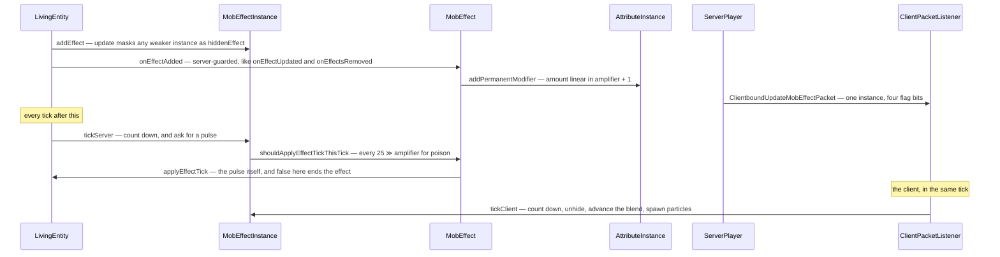

# Status effects

> Verified against **Minecraft 26.2** · Part VIII · You drink a potion of Poison: the server starts hurting you on a rhythm, and your client does nothing but count and spawn swirls.

Poison II lands. Your health starts dropping in steps, the swirls appear,
the icon in the corner counts down, and if the connection stutters the
number in the corner keeps counting anyway. That last part is the whole
page. **The client never runs a status effect.** It counts durations down,
advances a blend factor, unhides a masked effect and spawns particles from a
list the server synched — and that is all. Every attribute modifier, every
pulse of damage, every regeneration tick happens on the server behind an
explicit server-side guard, and the client's copy of the duration is
corrected by a re-send every six hundred ticks. An **infinite** effect is
never re-sent at all, because its duration is −1 and −1 never satisfies the
test.

## The cast

| class | what it decides | thread |
|---|---|---|
| `MobEffect` | what the effect *does*, and on what rhythm | server main (client: nothing) |
| `MobEffectInstance` | duration, amplifier, flags, and the masked effect underneath | both main threads |
| `MobEffects` | the forty built-in holders | — |
| `LivingEntity` | `LivingEntity.activeEffects`, the tick, and the three server-guarded hooks | both |
| `AttributeInstance` | where an effect's modifier actually lands | server main |
| `ServerPlayer` | who gets told, and how often | server main |
| `MobEffectUtil` | the questions the rest of the game asks about effects | both |

## What an effect is

**`MobEffect`** is the behaviour singleton: a category, a colour, a particle
factory, blend durations and a map of `MobEffect.AttributeTemplate`s. Its
hooks are the interesting part, because one of them is false by default.

| hook | when it runs |
|---|---|
| `MobEffect.shouldApplyEffectTickThisTick` | every tick, to ask whether this is a pulse — **false by default** |
| `MobEffect.applyEffectTick` | on a pulse; returning false ends the effect |
| `MobEffect.applyInstantaneousEffect` | for the instant effects, which pulse on their last tick |
| `MobEffect.onEffectStarted` / `MobEffect.onEffectAdded` | when it lands |
| `MobEffect.onMobHurt` | when the holder takes damage |
| `MobEffect.onMobRemoved` | when the holder goes |

The default *false* is why each effect has its own rhythm: the overrides
give poison a pulse every *25 ≫ amplifier* ticks, regeneration every
*50 ≫ amplifier*, wither every *40 ≫ amplifier*, and hunger every tick.
Attribute modifiers go on as `AttributeInstance.addPermanentModifier` with
an amount linear in amplifier + 1, computed by
`MobEffect.AttributeTemplate.create` ([attributes](../entities/attributes.md)).

**`MobEffectInstance`** is the per-entity half: duration, amplifier, the
ambient, visible and show-icon flags, a private blend state, and
**`MobEffectInstance.hiddenEffect`** — the stack that lets a stronger,
shorter effect temporarily mask a weaker, longer one, built by
`MobEffectInstance.update`. `MobEffectInstance.INFINITE_DURATION` is −1, and
`MobEffectInstance.compareTo` is what orders the icons in the HUD.
`LivingEntity.canBeAffected` is the veto, and it consults three entity tags
as well as the effect itself.

**`MobEffects`** is forty entries, and every one is a `Holder<MobEffect>`,
not a bare `MobEffect` — including `MobEffects.BREATH_OF_THE_NAUTILUS`. Some
point at attributes a reader would not expect: `MobEffects.JUMP_BOOST`
modifies `Attributes.SAFE_FALL_DISTANCE`, and `MobEffects.INVISIBILITY`
modifies `Attributes.WAYPOINT_TRANSMIT_RANGE`.

On the entity itself: `LivingEntity.activeEffects` (a plain unordered map),
`LivingEntity.effectsDirty`, and two synched values —
`LivingEntity.DATA_EFFECT_PARTICLES`, which is a **list of
`ParticleOptions`** rather than a packed colour, and
`LivingEntity.DATA_EFFECT_AMBIENCE_ID`. `MobEffectUtil` is the shared
question-asking surface: `MobEffectUtil.hasDigSpeed`,
`MobEffectUtil.hasWaterBreathing`,
`MobEffectUtil.shouldEffectsRefillAirsupply`,
`MobEffectUtil.addEffectToPlayersAround` and the duration formatter the
inventory screen uses.

## The trace: Poison II, on both sides at once

Effects are ticked from `LivingEntity.tickEffects`, the **last** thing
`LivingEntity.baseTick` does — which for a player means inside
`ServerPlayer.doTick`, the connection-driven half of [the two-phase
tick](the-two-phase-tick.md), not the level's entity tick.

The client branch of `LivingEntity.tickEffects` never calls
`MobEffect.applyEffectTick` and never touches an attribute. It does not even
remove an expired effect: it keeps a zero-duration instance until told
otherwise.

## Questions players ask

**Why does my duration sometimes jump?** Because it was wrong and got
corrected. All of `LivingEntity.onEffectAdded`,
`LivingEntity.onEffectUpdated` and `LivingEntity.onEffectsRemoved` are
server-guarded, so no attribute modifier is ever applied client-side and
attribute values arrive by their own sync; the client's *duration* is a
local countdown that drifts, re-sent every six hundred ticks. Two holes in
that: an **infinite** effect's duration is −1 and never satisfies the
re-send test, so it is never re-sent, and the re-send only ever reaches the
affected player or a player riding them.

**Why can I not see how long a mob's effect has left?** Because you were
never told. A client watching a mob it is not riding receives no
`MobEffectInstance` at all — only `LivingEntity.DATA_EFFECT_PARTICLES`, the
synched particle list, which is why other entities have swirls and no
numbers.

**Where did my weaker effect go?** Under the stronger one.
`MobEffectInstance.hiddenEffect` is a stack, and it survives a save:
the save codec *is* recursive. The **stream codec is not** —
`ClientboundUpdateMobEffectPacket` carries one instance plus flag bits for
ambient, visible, icon and blend, and never the chain — so the client
learns about the masked effect only when it surfaces.

**Why does Nausea swim in and out, but Poison just starts?** Blending is a
pure render quantity: `MobEffectInstance`'s blend state ticks only on the
client, is never saved and never sent, and only `MobEffects.NAUSEA` and
`MobEffects.DARKNESS` use it. The blend *bit* is set only when an effect is
first added — an update clears it, and the client responds by skipping the
blend.

**Why are a beacon's swirls so faint?** Ambient does not choose different
particles; it makes them rarer. The client spawns one particle from the
synched list with a probability that an invisible entity divides by about
four and an ambient effect by a further five.

**Does an effect pulse on its own clock or the world's?** Both, depending on
whether it ends. `MobEffectInstance.tickServer` counts an infinite-duration
effect's pulses off the entity's age and a finite one off its own countdown.

**What happens when one effect adds another?** The rest of that tick's
effects are silently skipped. `LivingEntity.tickEffects` catches a
concurrent-modification error and drops it, so an effect that adds or
removes another quietly aborts the loop it was in.

**What crosses the wire?** `ClientboundUpdateMobEffectPacket` and
`ClientboundRemoveMobEffectPacket` for the effects you hold, and
`LivingEntity.DATA_EFFECT_PARTICLES` through [synched entity
data](../entities/synched-entity-data.md) for everyone else's swirls.
Effects themselves are data-driven through `BuiltInRegistries.MOB_EFFECT`,
and the ways they land — `PotionContents`, `SuspiciousStewEffects`,
`ApplyStatusEffectsConsumeEffect` and its siblings — are [using an
item](../items/using-an-item.md) and [hunger and
experience](hunger-and-experience.md).

## Where to look

`MobEffect` · `MobEffectInstance` · `MobEffects` · `MobEffectCategory` ·
`MobEffectUtil` · `LivingEntity.tickEffects` · `LivingEntity.activeEffects` ·
`LivingEntity.canBeAffected` · `ClientboundUpdateMobEffectPacket` ·
`ClientboundRemoveMobEffectPacket`

---

*Rules: names, never code · how the system works, not how the code reads ·
newest version only · every backticked name passes `tools/verify_names.py`.*
