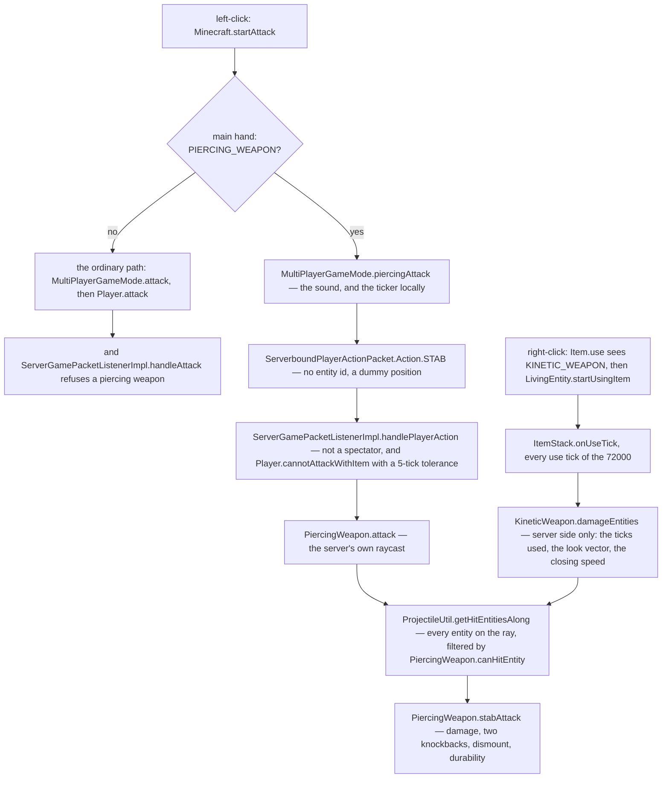

# The spear

> Verified against **Minecraft 26.2** · Part VIII · Two ways to hit something with the same item: jab it, and the client sends no target at all; charge it and run, and the damage comes from how fast the gap is closing.

A spear is one item with two weapons in it. Left-click and you **stab**: the
client sends a packet with no entity id in it, and the server does its own
raycast and hits *everything* along the ray. Hold right-click and you
**charge**: the spear becomes an item you are using, like a bow, except that
what it does each tick is look for entities in front of you and hurt them in
proportion to the closing speed. Neither path enters `Player.attack`, the
method [the sword
swing](the-sword-swing.md#the-damage-one-number-two-curves-one-order) is
about, and the second has a property no other melee attack in the game has.
Every ordinary swing is scaled by how far the attack-strength clock has
recharged — quadratically on the base damage, linearly on the enchantment
bonus, so a mashed sword does about 40% of what a patient one does ([the two
clocks](the-sword-swing.md#the-two-clocks-a-swing-is-charged-against)).
**A charging spear ignores that scaling entirely**, because the code that
applies the two curves is skipped for the item you are currently using, and a
charge is a use.

## The cast

| class | what it decides | thread |
|---|---|---|
| `PiercingWeapon` | the stab — and, through its filter, who *either* weapon is allowed to hit along a ray | server main (its sounds play on both sides) |
| `KineticWeapon` | the charge: three speed conditions, and the damage from closing speed | server main |
| `Item.Properties.spear` | the seven spears, and the combat components that make one | — |
| `Minecraft` / `MultiPlayerGameMode` | the client's short-circuit, and the packet with no target | client main |
| `ServerGamePacketListenerImpl` | `ServerboundPlayerActionPacket.Action.STAB`, and the piercing rejection in the ordinary attack handler | server main |
| `LivingEntity.stabAttack` | the shared tail: damage, two knockbacks, dismount, durability | server main |
| `Player.stabAttack` | the override that adds the cooldown curves — sometimes | server main |
| `SpearUseGoal` / `SpearAttack` | how a zombie or a piglin does the same thing | server main |

## What an item needs to be a spear

`Item.Properties.spear` is one builder call per material, and the seven
spears — `Items.WOODEN_SPEAR` through `Items.NETHERITE_SPEAR` — differ
almost only in the numbers it is given; the wooden one gets its own sounds
and the netherite one is additionally fire-resistant. What it attaches is the interesting part,
because it is *both* weapons at once plus the reach to use them:

| component | what the spear gets |
|---|---|
| `DataComponents.PIERCING_WEAPON` | knockback yes, dismount no, a use sound and a hit sound |
| `DataComponents.KINETIC_WEAPON` | a contact cooldown of ten ticks, a delay, three conditions, and a damage multiplier |
| `DataComponents.ATTACK_RANGE` | `AttackRange.minReach` of 2.0 and `AttackRange.maxReach` of 4.5 — 2.0 and 6.5 in creative — with a hitbox margin and a mob factor |
| `DataComponents.MINIMUM_ATTACK_CHARGE` | 1.0: no partial-charge stab |
| `DataComponents.SWING_ANIMATION` | `SwingAnimationType.STAB`, with a per-material duration |
| `DataComponents.DAMAGE_TYPE` | `DamageTypes.SPEAR`, as a delayed holder component |
| `DataComponents.USE_EFFECTS` | the whole component overridden: sprint allowed, vibrations off, speed multiplier one — the only item in the game that does not slow you down while you hold it out |
| `DataComponents.WEAPON` | a durability cost of one per attack |
| attribute modifiers | `Attributes.ATTACK_DAMAGE` from the material, and an `Attributes.ATTACK_SPEED` derived from the swing duration |

Four of those rows are what the rest of this page is about — the two weapon
components, the reach they share, and the `UseEffects` override. The other
five are what stops a spear behaving oddly in the hand: no partial-charge
stab, a stab animation rather than a slash, its own damage type in the death
message, and a durability cost of one per attack.

The ordinary tool components come from the material and are not in the table:
`Item.Properties.spear` also calls `Item.Properties.durability`,
`Item.Properties.repairable` and `Item.Properties.enchantable`, so a spear
takes damage, mends on an anvil and accepts enchantments the way any tool
does ([items and stacks](../items/items-and-stacks.md#the-cast) and
[enchanting](../items/enchanting.md#the-one-question-all-five-ask)).

That `UseEffects` override is why a spear feels unlike every other held-down
item — `LocalPlayer.isSlowDueToUsingItem` is the reader it turns off, and
[using an item](../items/using-an-item.md#moving-while-you-use) explains what
the component does for everything else.

## Two entries, one exit

*Two entries — a click on the left, a held right-click on the right — meeting
at one raycast, and the only place the two columns touch is that meeting: the
left column's refusal node is the reason a client cannot route a stab down the
ordinary path.*

Two things in that picture are worth stopping on. The **client tells the
server nothing about the target** on the stab path: the packet is a
`ServerboundPlayerActionPacket` carrying
`ServerboundPlayerActionPacket.Action.STAB`, whose block position and
direction are dummies, and every question about what was hit is answered by
the server's own raycast. And the ordinary attack handler *refuses* a
piercing weapon — `ServerGamePacketListenerImpl.handleAttack` checks for
`DataComponents.PIERCING_WEAPON` and drops out — so the two paths cannot be
confused for one another even by a client that tries.

## The stab

`PiercingWeapon.attack` takes the attacker's `Attributes.ATTACK_DAMAGE`,
the weapon in the given slot and `LivingEntity.getAttackRangeWith`, and
walks `ProjectileUtil.getHitEntitiesAlong` with the block-collider clip
context — so a wall stops the ray, but a crowd does not. **Every** entity
along it is stabbed — in the order the ray walk happened to append them,
which is not sorted by distance — each through `LivingEntity.stabAttack`
with the same damage figure.

`PiercingWeapon.canHitEntity` is the filter, and it is a projectile-shaped
test rather than a melee one: the target must not be
`Entity.isInvulnerableToPiercingWeapon`, must be alive, and must satisfy
`Entity.canBeHitByProjectile`. Player against player defers to
`Player.canHarmPlayer`, and an entity riding the same vehicle as the
attacker is not hit. An `Interaction` — the invisible click-target entity a
data pack places to catch hits — short-circuits the whole filter to
*hittable* before any of those tests, same vehicle included.

Afterwards the attacker gets `LivingEntity.onAttack` — which on a `Player`
resets the attack-strength ticker — and `LivingEntity.postPiercingAttack`,
the hook that runs `EnchantmentHelper.doPostPiercingAttackEffects`; only
then does the weapon play `PiercingWeapon.makeHitSound` if anything was hit
and `PiercingWeapon.makeSound` regardless, and swing the arm. The client
half did the swing and `LivingEntity.onAttack` itself a round trip earlier,
but not `LivingEntity.postPiercingAttack`, which does nothing off a
`ServerLevel`.

## The charge

A kinetic weapon is the only weapon in the game that *requires* you to be
moving: its damage is built from closing speed, and the `UseEffects` override
above exists so that you can sprint while charging. The two halves are one
design.

A kinetic weapon is also *used*, not swung. `Item.use` sees
`DataComponents.KINETIC_WEAPON`, calls `LivingEntity.startUsingItem` and
plays the sound; `Item.getUseDuration` returns **72000** for it, the same
effectively-endless duration a bow gets, so the charge ends only when you
release ([using an
item](../items/using-an-item.md#the-bow-tick-by-tick)). Starting also
allocates `LivingEntity.recentKineticEnemies`, a server-side map of who has
been hit and when, which `LivingEntity.stopUsingItem` throws away.

Each use tick, `ItemStack.onUseTick` diverts to
`KineticWeapon.damageEntities` — **and skips the item's own
`Item.onUseTick` when it does**. What that method computes is a speed
argument, not a swing:

- **How long you have been charging.** Ticks used must be at least
  `KineticWeapon.delayTicks`; everything below is measured from there.
- **How fast you are going, along your look vector.**
  `KineticWeapon.getMotion` reads `Entity.getKnownSpeed` — the *reported*
  movement from [input to movement](input-to-movement.md) — scaled to
  blocks per second, taking the **root vehicle's** motion for a
  non-player passenger ([input to
  movement](input-to-movement.md#where-the-velocity-everything-downstream-reads-comes-from)).
- **How fast the gap is closing.** The target's own projected speed is
  subtracted, floored at zero, and that relative speed is what the damage
  is built from.
- **Whether you already hit them.** `LivingEntity.wasRecentlyStabbed`
  against `KineticWeapon.contactCooldownTicks` — ten for a spear — is why
  running through a crowd does not hit the same mob every tick.

Who is in front of you is answered exactly as it is for the stab:
`ProjectileUtil.getHitEntitiesAlong` walks the weapon's `AttackRange` with
the block-collider clip context and `PiercingWeapon.canHitEntity` filters
what it finds. The two attacks differ in what they compute, never in what
they can reach.

Three independent `KineticWeapon.Condition`s then decide what the hit *is*,
and the point is that each gates its own effect rather than the hit as a
whole: `KineticWeapon.dismountConditions`, `KineticWeapon.knockbackConditions`
and `KineticWeapon.damageConditions`. Each is a maximum duration and a speed
bar — measured against the attacker's own projected speed for the first two,
and against the closing speed for damage. If **any** of the three passes the
attack happens at all; then the dismount only dismounts if its own condition
passed, the knockbacks only fire if theirs did, and **the damage is only
dealt if the damage condition passed**. A charge can knock a target off a
horse and do nothing to it.

A spear's three come from the builder with different windows, and for all
seven materials they nest the same way: damage has the longest window and the
lowest bar, dismount the shortest window and much the highest. A wooden spear
dismounts for five seconds, knocks back for ten and damages for fifteen — so
a charge that has run too long can still hurt when it can no longer unseat
anyone. When the damage does land it is the attacker's **base**
`Attributes.ATTACK_DAMAGE` plus the floor of relative speed ×
`KineticWeapon.damageMultiplier` — the base value, so the modifiers a sword
swing would pick up are not in it.

A landed charge broadcasts an entity event, and it is the part of the
telling that is *about the charge*, alongside the ordinary damage sync,
knockback and durability every hit sends: `LivingEntity.onKineticHit` plays a local hit
sound, throttled to ten ticks by a bare literal in
`LivingEntity.onKineticHit` — the `KineticWeapon.HIT_FEEDBACK_TICKS`
constant that names that number is read by nothing — and
`LivingEntity.getTicksSinceLastKineticHitFeedback` feeds the animation. A
`ServerPlayer` also trips `CriteriaTriggers.SPEAR_MOBS_TRIGGER` with the
number of living entities stabbed this charge.

## The tail, and the cooldown that is not applied

Both paths end in a method called *stabAttack*, which exists twice.
`LivingEntity.stabAttack` is the general one: it returns false off a
`ServerLevel`, runs the damage through `EnchantmentHelper.modifyDamage`,
calls `Entity.hurtServer` — into the same pipeline a sword swing ends in
([damage and death](../entities/damage-and-death.md#the-number-the-arrow-decides))
— applies two knockbacks, a flat one and `LivingEntity.getKnockback`, and
dismounts the target, each of the three behind its own flag. Two things then
run on different conditions again: `ItemStack.hurtEnemy` for any living
target whether or not the damage landed, and the post-attack enchantment
effects ([enchantments](../items/enchantments.md)) only if it did. The attack
sound plays once anything at all happened.

`Player.stabAttack` overrides it, and the override is where the spear
becomes strange. It computes the enchantment boost the way `Player.attack`
does, and then applies the two cooldown curves — the linear one to the
boost, the quadratic `Player.baseDamageScaleFactor` to the base — **only if
the player is not currently using an item in that slot.** A stab qualifies,
so a stab is charged like a sword swing. A kinetic charge does not: while
you are holding the spear out, both curves are skipped and every tick's hit
lands at full base damage. The rest of the override is the familiar tail —
`Player.deflectProjectile` can still end it, the knockbacks are the same
two, `Player.itemAttackInteraction` applies the durability cost, and
`Player.causeFoodExhaustion` charges the same 0.1 a sword does ([hunger and
experience](hunger-and-experience.md#the-food-bar-is-four-numbers-and-a-pile-of-literals)).

## What a mob does with the same item

A mob runs both attacks, and the split between the two ways it can is the
ordinary one ([goals and brains](../entities/ai-goals-and-brains.md#what-holds-the-state)).
`SpearUseGoal` drives the charge for a goal-based mob; `SpearApproach`,
`SpearAttack` and `SpearRetreat` do it for a brain-based one. Zombies,
zombified piglins and piglins are the users in the tree, and `Piglin` treats
a kinetic weapon like a crossbow when deciding what it is holding. Both
paths read `KineticWeapon.computeDamageUseDuration` — the delay plus the
damage condition's window — to know how long to hold the charge for.

The thresholds are far easier for them than for you. Every speed bar in the
three conditions is multiplied by an action factor of **0.2** for anything
that is not a player, against 1.0 for you: a mob charging at a fifth of your
speed clears the same bar.

## What a data pack can and cannot change here

The shape is data-driven; the values are not. `PiercingWeapon` and
`KineticWeapon` are ordinary data components with codecs and stream codecs,
so a data pack can describe a weapon of either kind without code — but every
built-in spear's numbers are hard-coded in `Item.Properties.spear` rather
than read from JSON, which is why the seven differ only in arithmetic.

One field in `KineticWeapon` is not a combat number at all.
`KineticWeapon.forwardMovement` — 0.38 for a spear — is read **only** by
`SpearAnimations`, and only by its *third-person* methods: a rendering offset
living in the middle of a combat component, shipped to every client that
receives the item.

## Where to look

**`Item.Properties.spear`** is one line long and is the whole definition of
the weapon — read it first, with the numbers for one material in hand. Then
the two components it hangs on: **`PiercingWeapon`**, whose
`PiercingWeapon.canHitEntity` filter serves both attacks, and
**`KineticWeapon`**, whose `KineticWeapon.damageEntities` is the charge end
to end and whose nested **`KineticWeapon.Condition`** is three fields and one
test.

The exit is worth reading as a pair: **`LivingEntity.stabAttack`** for what
both attacks do to a target, then **`Player.stabAttack`** for the eight lines
of override that put the cooldown curves back — and the one condition that
skips them. On the way in,
**`MultiPlayerGameMode.piercingAttack`** and
**`ServerboundPlayerActionPacket`** show how little the client sends, and
**`Minecraft.startAttack`** is where the short-circuit sits. Two doors this
page only points at: **`SpearUseGoal`** for the mob side, and
**`SpearAnimations`**, which turns out to be the only reader of a field in
the combat component.

---

*Rules: names, never code · how the system works, not how the code reads ·
newest version only · every backticked name passes `tools/verify_names.py`.*
