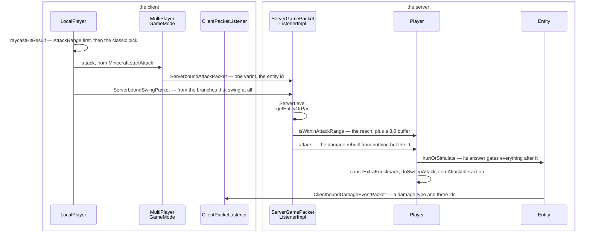
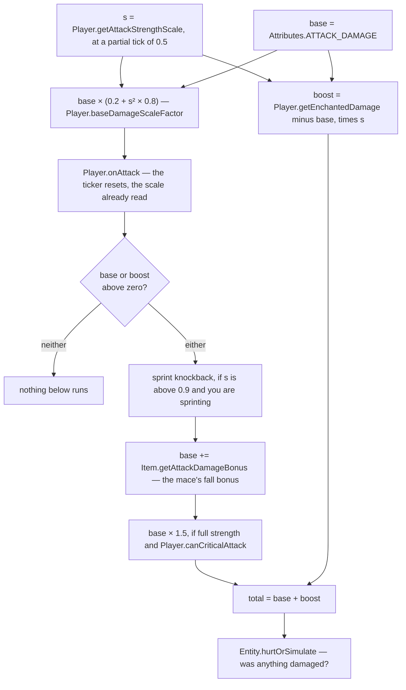

# The sword swing

> Verified against **Minecraft 26.2** · Part VIII · Left-click on a pig: the client picks a target and sends one integer, and the server rebuilds every part of the hit from scratch.

You put the crosshair on a pig and click. The client has already decided
what you are looking at — earlier in this same tick — checks a handful of
reasons not to swing, and sends the smallest packet in melee combat:
**`ServerboundAttackPacket` is a record of one int, the entity id.** No
hand, no sneak flag, no hit position, no damage. Everything else the server
re-derives: the weapon from your main hand, the geometry from the target's
bounding box measured against your eye, and the damage from an attribute, a cooldown curve applied twice in
two different shapes, and a multiplication order in which the mace's fall
bonus lands *before* the critical hit and is therefore multiplied by it.

## The cast

| class | what it decides | thread |
|---|---|---|
| `Minecraft` | what you are looking at, and whether the click swings at all | client main |
| `LocalPlayer` | the raycast, and which range each candidate is judged against | client main |
| `MultiPlayerGameMode` | sends the attack, and predicts almost nothing | client main |
| `ServerGamePacketListenerImpl` | resolves the id, re-checks the range and the item | server main |
| `Player` | `Player.attack`: one method, and the order inside it is load-bearing | both (only the server's answer counts) |
| `LivingEntity` | the swing animation state, and the two attack clocks | both |
| `AttackRange` | a weapon's own reach, with a minimum as well as a maximum | — |

## Picking: what is under the crosshair

`Minecraft.pick` runs before `Minecraft.handleKeybinds` in the client tick
([the client
loop](../client/the-client-loop.md#what-a-tick-is-in-order)), and the keybind
drain is what turns `Options.keyAttack` into `Minecraft.startAttack` — so
**the hit result a click uses was computed earlier in the same tick**.
`Minecraft.pick` also runs per frame, for the crosshair and the block
outline, but that value is not what the attack sees.

It asks the camera entity, and for the local player that is
`LocalPlayer.raycastHitResult`. A player carries **two** reaches, and the
whole of this section turns on their being different numbers:
`Attributes.BLOCK_INTERACTION_RANGE` (4.5) and
`Attributes.ENTITY_INTERACTION_RANGE` (3.0) ([player
anatomy](player-anatomy.md#what-player-owns)).

If the **active** item — the one being used, if any, else the main hand —
carries an `AttackRange` (`DataComponents.ATTACK_RANGE`), that component's
own search runs first, and the classic algorithm runs only when that search
comes back empty: a block clip out to the greater of the two ranges, an
entity sweep with
`ProjectileUtil.getEntityHitResult` over the bounding box expanded along the
view direction and inflated by one, each candidate inflated by
`Entity.getPickRadius` (**zero** for everything but projectiles) — and the
entity wins only if it is strictly nearer than the block. Then
`LocalPlayer.filterHitResult` measures each candidate against *its own* one
of the two reaches, the entity against 3.0 and the block against 4.5. That
is the divergence: one raycast, two verdicts, and a mob at four blocks is
out of reach while the wall behind it is not.

`AttackRange` is worth a second look, because it is a reach *floor* as well
as a ceiling: a minimum and a maximum, separate creative values, a hitbox
margin and a mob factor. `AttackRange.isInRange` is the test,
`AttackRange.defaultFor` falls back to `Attributes.ENTITY_INTERACTION_RANGE`,
and `AttackRange.effectiveMinRange` / `AttackRange.effectiveMaxRange` apply
the mob factor — only for non-players.

## Deciding: most branches do not swing

`Minecraft.startAttack` is the branch point. It returns early — no swing, no
packet — while `Minecraft.missTime` is running, when there is no hit result
at all (setting a ten-tick miss time), while `LocalPlayer.isHandsBusy`, for
a disabled item, and when `Player.cannotAttackWithItem` refuses with a
tolerance of **zero**; spectators take a branch of their own. Two branches
do swing: the piercing short-circuit to `MultiPlayerGameMode.piercingAttack`
when the item carries `DataComponents.PIERCING_WEAPON` — [the
spear](the-spear.md) — and the tail of the hit-result switch: entity to
`MultiPlayerGameMode.attack`, block to
`MultiPlayerGameMode.startDestroyBlock` ([block
breaking](../blocks/block-breaking.md#one-dig-end-to-end)), a miss on an air block to
`Player.resetAttackStrengthTicker` and the ten-tick miss time. Even the
entity branch is conditional — a weapon with its own `AttackRange` that the
hit falls outside of swings but sends no attack packet at all. The miss time
itself only exists outside creative, and opening any screen parks it at a
very large number.

On the server, `ServerGamePacketListenerImpl.handleAttack` requires the
client to have loaded and the player not to be a spectator, resolves the id
with `ServerLevel.getEntityOrPart`, checks the world border, applies
`Player.isWithinAttackRange` with a **3.0-block server buffer** — applied to
*both* ends, so a weapon's minimum range effectively vanishes server-side —
rejects a piercing weapon (that path arrives elsewhere), checks the item is
enabled, re-checks `Player.cannotAttackWithItem` with a tolerance of **five
ticks**, more lenient than the client's zero, and calls `Player.attack`.
Attacking something absurd — an `ItemEntity`, an `ExperienceOrb`, an
unattackable `AbstractArrow`, yourself — is a **disconnect**, not a
rejection; failing the range check is a silent drop.

The packet is drained from `PacketProcessor` at the **top** of the tick,
before `MinecraftServer.tickServer` and therefore before any level ticks.
That ordering matters: `Player.attack` runs before the victim's
invulnerability counter comes down for the tick ([damage and
death](../entities/damage-and-death.md#ten-ticks-in-which-nothing-shows-and-ten-that-protect-nothing)
owns `Entity.invulnerableTime` and who decrements it when). Each of the
resulting feedback packets is written and flushed on its own: the
connection suspends flushing only across `MinecraftServer.tickChildren`,
and the attack was handled before that bracket opened.

## One click, one integer, one round trip

Two packets go out and one comes back, and the one that comes back has no
damage number in it.

*Everything the client sent is on the two arrows that cross to the right, and
between them they carry one integer: every number in the box on the right was
rebuilt there, and the arrow coming back carries none of them.*

## The two clocks a swing is charged against

Before the arithmetic, the thing the arithmetic reads. A player carries two
attack clocks, and both are declared one rung up on `LivingEntity` while
being read, reset and incremented **only** from `Player`:
`LivingEntity.attackStrengthTicker` and `LivingEntity.itemSwapTicker`.

The first is the one you watch. `Player.getCurrentItemAttackStrengthDelay` is
twenty divided by `Attributes.ATTACK_SPEED`, and the scale the damage uses is
how far through that delay the ticker has got.
`Player.resetAttackStrengthTicker` clears both clocks;
`Player.resetOnlyAttackStrengthTicker` clears one. `Player.tick` resets both
when the main-hand *item type* changes — swap weapons and you start again.

The second exists only to drive the held-item swap animation, and what
distinguishes it is what does *not* touch it: `Player.onAttack` clears the
attack ticker and leaves the swap ticker alone. Both sides then reset the
attack ticker **twice** per swing, once inside `Player.attack` and once
after it — the client in `MultiPlayerGameMode.attack`, the server on the
swing packet that follows, because `ServerPlayer.swing` resets the ticker
too.

## The damage: one number, two curves, one order

`Player.attack` is a single method, and everything interesting about melee
combat is the order in which it touches one float.

*One float, followed down: the left-hand branch is the enchantment bonus,
which is scaled once and then left alone, and the right-hand one is the base
damage, which is scaled, gated, added to and multiplied before the two meet
again at the bottom.*

One node in it needs its meaning before the rest of the page spends it.
`Entity.hurtOrSimulate` is the wrapper that branches on the side —
`Entity.hurtServer` on the server, `Entity.hurtClient` on the client ([damage
and death](../entities/damage-and-death.md#everything-that-calls-it) owns the
wrapper itself) — and what it *returns* is not the obvious thing: the boolean
means **was anything damaged**, not *did the hit land*. That is what gates
the knockback, the sweep, the durability and the hit particles below.

Read the picture for the two things it makes obvious. **The cooldown is
applied twice, differently** — `Player.baseDamageScaleFactor` is the
quadratic ramp on the base damage, and a plain multiplication is the linear
one on the enchantment bonus, both from the same scale read with the same 0.5
partial tick. And **the item bonus is inside the crit**, because
`Item.getAttackDamageBonus` is added before the ×1.5 rather than after it.
One substitution the figure leaves out: while an auto-spin attack is in
flight the base is `Player.autoSpinAttackDmg`, the riptide number, instead of
the attribute.

The gates along the way are as particular as the arithmetic, and the first
two are put to the *target* rather than to the attacker.
**`Player.cannotAttack`** asks it two things: `Entity.isAttackable`,
which `Entity.isPickable` backs and which is false by default for most things
that are not mobs, and `Entity.skipAttackInteraction`, the hook by which a
thing claims the swing for itself — an `Interaction` block uses it to record
who hit it, and a `BlockAttachedEntity` to re-enter through
`Entity.hurtOrSimulate` with zero damage. Either answer ends the swing
([damage outside `LivingEntity`](../../reference/non-living-damage.md) has
the per-class table). Then **`Player.deflectProjectile`**, which is why a
ghast fireball can be batted back: anything in
`EntityTypeTags.REDIRECTABLE_PROJECTILE` is turned around here rather than
damaged, and the attack ends.

Then three tests that are not gates but switches, each deciding what *kind*
of hit this is. **Sprint knockback** needs the scale above 0.9, plays a
sound, and adds a flat **0.5** to the knockback later; it is the step the
item bonus is added immediately after, which is why the item-bonus node in the
figure above sits where it does. `Player.canCriticalAttack`
needs falling, not on the ground, not climbing, not in water, not
mobility-restricted, not a passenger, **not sprinting**, a `LivingEntity`
target — and full strength as well. `Player.isSweepAttack` needs full
strength, *not* a crit, *not* sprint knockback, on the ground, moving slower
than 2.5× the walking speed, and something in `ItemTags.SWORDS`.

If the hit landed, the tail runs in order: `Player.causeExtraKnockback` —
which is also where the attacker's own motion is damped and sprinting
cancelled, using `LivingEntity.getKnockback` computed from
`Attributes.ATTACK_KNOCKBACK` through the enchantments and halved — then
`Player.doSweepAttack`, `Player.attackVisualEffects`,
`LivingEntity.setLastHurtMob`, `Player.itemAttackInteraction`,
`Player.damageStatsAndHearts`, and `Player.causeFoodExhaustion` of 0.1
([hunger and experience](hunger-and-experience.md#the-food-bar-is-four-numbers-and-a-pile-of-literals)). If
it did not land, a no-damage sound. Either way `LivingEntity.postPiercingAttack`
runs at the end — the same hook a stab ends on, which is why the name says
*piercing* on a method that closes an ordinary swing ([the
spear](the-spear.md#the-stab)).

`Player.itemAttackInteraction` is itself three steps in a particular order:
`ItemStack.hurtEnemy` (the item's own hook and the use statistic, *not*
durability), then `EnchantmentHelper.doPostAttackEffectsWithItemSource`
([enchantments](../items/enchantments.md)),
then `ItemStack.postHurtEnemy`, which is where `Weapon`'s per-attack
durability cost is applied. `Weapon` (`DataComponents.WEAPON`) is a pair:
that cost, and `Weapon.disableBlockingForSeconds`, the axe's shield-breaking
rule. `LivingEntity.getSecondsToDisableBlocking` reads it back, but only when
the weapon in the attacker's hand is also their *active* item — so an axe
swung while the other hand is using something disables no shield.

`Player.doSweepAttack` damages every *living* entity in a box around the **primary
target** inflated by (1, 0.25, 1), for candidates within three blocks of the
**attacker**, excluding the attacker, the primary target, allies and marker
armour stands. Each takes `1.0 + Attributes.SWEEPING_DAMAGE_RATIO × base`,
run through `Player.getEnchantedDamage` and then scaled by the
attack-strength scale, plus a flat 0.4 knockback. Its sweep *sound* is
unguarded; the damage and the `ParticleTypes.SWEEP_ATTACK` particles sit
behind the server check.

Armour, invulnerability frames, `DataComponents.BLOCKS_ATTACKS` and knockback
resistance decide how much of that damage arrives, and all four are [damage
and
death](../entities/damage-and-death.md#armour-and-why-big-hits-punch-through-it)'s.

## Questions players ask

**Why does mashing do less damage?** Because the base damage is quadratic in
the charge and the enchantment bonus is linear in it. At half charge the base
is 0.2 + 0.25 × 0.8 — that is *s²* with *s* = 0.5 — so 40% of full, while the
enchantment bonus is at the full 50%. Mashing costs you more of the sword
than of the enchantments on it.

**Why does my sword make no sound until the server answers?** Because the
attack sounds are the counter-example to the client's own prediction rule:
`Player.playServerSideSound` excludes nobody, so every hit sound the attacker
hears arrives as a `ClientboundSoundPacket`, one round trip late ([what makes
a sound](../client/what-makes-a-sound.md)).

**Does the client predict any of this against a mob?** Almost none.
`Entity.hurtClient` returns false and neither `LivingEntity` nor `Mob`
overrides it, so on the client `Entity.hurtOrSimulate` reports that the hit
did not land and the entire block after it is skipped: no predicted
knockback, no sweep, no visual effects, no durability, no exhaustion. The
exceptions are the eight classes that do override it, and the pattern is the
answer: **every one of them is something you can hit that is not a mob** — a
`RemotePlayer`, a vehicle, a hanging thing, an orb ([damage outside
`LivingEntity`](../../reference/non-living-damage.md) has the roll-call).
Against those the whole block runs locally. `Player.getEnchantedDamage` does nothing on `Player` either;
it returns its argument unchanged and only `ServerPlayer` overrides it. With
`Attributes.ATTACK_DAMAGE` not being client-syncable
([attributes](../entities/attributes.md)), the client's damage figure is
never authoritative wherever that block does run. That the client may not
decide a hit at all is [authority](../entities/authority.md#three-cases-read-on-both-sides)'s
rule, applied to combat.

**Can a weapon be too close to swing?** On the client, yes — `AttackRange`
has a minimum. On the server, no: the 3.0-block leniency is subtracted from
the minimum as well as added to the maximum, so the floor does not survive
the round trip.

**How does my client know how badly the pig was hurt?** It does not.
`ClientboundDamageEventPacket` carries no amount at all — a damage-type
holder, three entity ids and an optional source position — and the victim's
red flash, hurt sound and invulnerability window are reconstructed from
that ([damage and
death](../entities/damage-and-death.md#telling-everyone-and-what-a-block-replaces)
owns the packet). Health bars come from [synched entity
data](../entities/synched-entity-data.md#nineteen-slots-and-where-the-numbers-come-from).

**Are sweep and knockback enchantment effects?** They are attributes.
`Attributes.SWEEPING_DAMAGE_RATIO` defaults to zero, so a vanilla sweep does
1.0 — scaled by the attack-strength ratio, so slightly less than 1.0
anywhere in the sweep's legal window below full charge. And
`Attributes.ATTACK_KNOCKBACK` defaults to zero, so for an unenchanted sword
the *entire* attacker-side knockback is the sprint bonus of 0.5.

**What makes my own arm move?** Your own client does, before the server hears
about it. Every branch of `Minecraft.startAttack` that swings at all calls
`LivingEntity.swing`, and `LocalPlayer.swing` overrides it to do two things: set the
animation state locally through the base method, and send
`ServerboundSwingPacket`. That is why a miss on an air block still animates,
and why the animation never waits for a round trip. The server's own
`LivingEntity.swing` then broadcasts `ClientboundAnimatePacket` to your
**trackers** — the players who can see you — and not back to you, because you
played it a round trip ago.

**Why does my swing look different with a different weapon?** Because swing
duration is a data component — `ItemStack.getSwingAnimation` returns a
`SwingAnimation` — not a constant six ticks;
`MobEffects.MINING_FATIGUE` stretches it and haste shortens it. The
animation state itself is `LivingEntity.swinging`,
`LivingEntity.swingingArm`, `LivingEntity.swingTime` and
`LivingEntity.attackAnim`, and `ServerGamePacketListenerImpl.handleAnimate`
is where the server receives yours. Crit particles are the exception to the
never-echoed rule, because they go to the trackers of the **attacker** while
naming the **victim** — and you are one of your own trackers' subjects.

**Is this the only way to hit something in melee?** No. Two other paths end
in damage and neither goes through `Player.attack`: a `PiercingWeapon`
short-circuits before the hit-result switch, and a `KineticWeapon` is
reached from item *use* rather than attack. Both are [the
spear](the-spear.md).

## Where to look

Two methods are the whole lecture, and they are worth reading in this order.
**`Minecraft.startAttack`** is the client's branch point: every reason not to
swing is in it, and so are the two branches that do.
**`Player.attack`** is the server's, and everything surprising about melee
combat is the order of the lines in it — read it once for the shape and a
second time for where `Player.baseDamageScaleFactor` and
`Item.getAttackDamageBonus` land relative to the ×1.5.

Around them: **`ServerGamePacketListenerImpl.handleAttack`** for the eight
checks between the packet and the method, **`AttackRange`** for the reach
floor the server subtracts away, and **`Weapon`** for the two-field component
that charges the durability. **`Player.doSweepAttack`** and
**`Player.itemAttackInteraction`** are the two halves of the tail worth
opening on their own. On the wire, **`ServerboundAttackPacket`** takes ten
seconds to read and **`ClientboundDamageEventPacket`** is worth the same for
what it leaves out. Two doors this page only points at:
**`ProjectileUtil`**, which is where the entity sweep actually happens, and
**`SwingAnimation`**, the component behind the arm.

---

*Rules: names, never code · how the system works, not how the code reads ·
newest version only · every backticked name passes `tools/verify_names.py`.*
