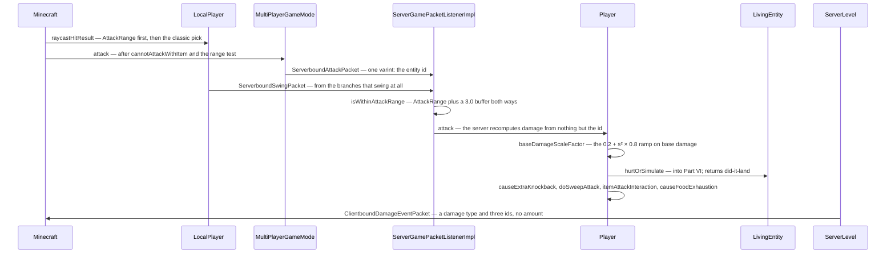

# The sword swing

> Verified against **Minecraft 26.2** · Part VIII · Left-click on a pig: the client picks a target and sends one integer, and the server recomputes every part of the hit that matters.

## Responsibility

Melee combat is the place where the client's opinion and the server's
authority meet most often and most visibly. This page follows one attack:
how the client decides what is under the crosshair, what it is allowed to
tell the server, how the server rebuilds the damage from scratch, and what
comes back.

The one sentence a player recognises: *swinging at the right moment does
more damage than mashing.*

The headline: **attack has its own packet, and it carries nothing but an
entity id.** `ServerboundInteractPacket` is right-click only. And reach is
not just an attribute — it is a data component on the weapon, with a
*minimum* range as well as a maximum.

## The data it owns

- **`Minecraft.hitResult`** and **`Minecraft.crosshairPickEntity`** — the
  client's answer to "what am I looking at", rewritten by
  `Minecraft.pick` once per tick and again per frame.
- **The two attack tickers.** The fields
  `LivingEntity.attackStrengthTicker` and `LivingEntity.itemSwapTicker`
  are declared on `LivingEntity`; every method that reads or resets them
  is on `Player`, and `Player.tick` is the only thing that increments
  them. The vocabulary is `Player.getAttackStrengthScale`,
  `Player.getItemSwapScale`,
  `Player.getCurrentItemAttackStrengthDelay` (twenty divided by
  `Attributes.ATTACK_SPEED`), `Player.resetAttackStrengthTicker` (clears
  both) and `Player.resetOnlyAttackStrengthTicker` (clears one).
  `Player.tick` also resets them when the main-hand *item* changes —
  which is what the swap ticker is for.
- **`AttackRange`** (`DataComponents.ATTACK_RANGE`) — a weapon's reach: a
  minimum and maximum, separate creative values, a hitbox margin and a mob
  factor. `AttackRange.isInRange` is the test;
  `AttackRange.defaultFor` falls back to
  `Attributes.ENTITY_INTERACTION_RANGE`. `AttackRange.effectiveMinRange`
  and `AttackRange.effectiveMaxRange` apply the mob factor, and only for
  non-players.
- **`Weapon`** (`DataComponents.WEAPON`) — a pair: the durability cost per
  attack, and `Weapon.disableBlockingForSeconds`, which is the axe's
  shield-breaking rule, read back through
  `LivingEntity.getSecondsToDisableBlocking`.
- **`PiercingWeapon`** (`DataComponents.PIERCING_WEAPON`) and
  **`KineticWeapon`** (`DataComponents.KINETIC_WEAPON`) — the two
  components that route an attack *around* this page's trace. The spear
  carries both.
- `DataComponents.MINIMUM_ATTACK_CHARGE` and
  `DataComponents.DAMAGE_TYPE` — the rest of what makes an item a weapon
  ([items and stacks](../items/items-and-stacks.md)).
- **The swing animation state** on `LivingEntity`: `LivingEntity.swinging`,
  `LivingEntity.swingingArm`, `LivingEntity.swingTime`,
  `LivingEntity.attackAnim`. The duration is a component too —
  `ItemStack.getSwingAnimation` gives a `SwingAnimation`.

## When it runs

Client, once per tick, in this order inside `Minecraft.tick`:
`MultiPlayerGameMode.tick` → **`Minecraft.pick`** → the GUI →
`Minecraft.handleKeybinds`, which drains `Options.keyAttack` into
`Minecraft.startAttack` and finishes with `Minecraft.continueAttack` for
held-down mining. So the hit result a click uses was computed *earlier in
the same tick*. `Minecraft.pick` also runs per frame for the crosshair and
block outline, but that value is not what the attack sees.

Server: the packet is drained from `PacketProcessor` at the **top** of the
tick, before `MinecraftServer.tickServer` and therefore before any level
ticks. That ordering matters — `Player.attack` runs before the victim's
`LivingEntity.baseTick` decrements `Entity.invulnerableTime` for the
tick. (The counter is declared on `Entity`, decremented in
`LivingEntity.baseTick`, and skipped entirely for a `ServerPlayer`.) All
the resulting feedback packets leave in one flush, because the connection
suspends flushing across `MinecraftServer.tickChildren`.

## The trace: click to damage

**Picking.** `Minecraft.pick` asks the camera entity, and for the local
player that is `LocalPlayer.raycastHitResult`. If the **active** item —
the one being used, if any, else the main hand — carries an
`AttackRange`, that component's own search runs first; and if it finds
nothing, the classic algorithm runs **as well**: a block clip out to the
greater of the two ranges, an entity sweep with
`ProjectileUtil.getEntityHitResult` over the bounding box expanded along
the view direction and inflated by one, each candidate inflated by
`Entity.getPickRadius` (**zero** for everything but projectiles) — and
the entity wins only if it is strictly nearer than the block. Then
`LocalPlayer.filterHitResult` discards each against *its own* range:
`Attributes.ENTITY_INTERACTION_RANGE` (3.0) for the entity,
`Attributes.BLOCK_INTERACTION_RANGE` (4.5) for the block. That is where
the two reaches diverge.

**Deciding.** `Minecraft.startAttack` is the branch point, and most of its
branches do **not** swing. It returns early — with no swing and no packet
— while `Minecraft.missTime` is running, when there is no hit result at
all (setting a ten-tick miss time), while `LocalPlayer.isHandsBusy`, for
a disabled item, and when `Player.cannotAttackWithItem` refuses with a
tolerance of **zero**; spectators take a branch of their own. Two
branches do swing: the piercing short-circuit to
`MultiPlayerGameMode.piercingAttack` when the item has
`DataComponents.PIERCING_WEAPON`, and the tail of the hit-result switch —
entity to `MultiPlayerGameMode.attack`, block to
`MultiPlayerGameMode.startDestroyBlock`
([block breaking](../blocks/block-breaking.md)), a miss on an air block to
`Player.resetAttackStrengthTicker` and the ten-tick miss time. Even the
entity branch is conditional: a weapon with its own `AttackRange` that
the hit falls outside of swings but sends no attack packet at all. The
miss time itself only exists outside creative, and opening any screen
parks it at a very large number.

**The packet.** `ServerboundAttackPacket` is a record of one int.
`ServerGamePacketListenerImpl.handleAttack` requires the client to have
loaded and the player not to be a spectator, resolves the id with
`ServerLevel.getEntityOrPart`, checks the world border, applies
`Player.isWithinAttackRange` with a **3.0-block server buffer** — applied
to *both* ends, so a weapon's minimum range effectively vanishes
server-side — rejects a piercing weapon (that path arrives elsewhere),
checks the item is enabled, re-checks `Player.cannotAttackWithItem` with
a tolerance of **five ticks**, more lenient than the client's zero, and
calls `Player.attack`. Attacking something absurd (an `ItemEntity`, an
`ExperienceOrb`, an unattackable `AbstractArrow`, yourself) is a
**disconnect**, not a rejection; failing the range check is a silent
drop.

**The damage.** `Player.attack` is one method, and the order is
load-bearing:

1. `Player.cannotAttack` — the target must be attackable and must not
   claim the interaction for itself;
2. base damage from `Attributes.ATTACK_DAMAGE` (or the riptide value),
   and the weapon from `Player.getWeaponItem`;
3. the `DamageSource` from `Player.createAttackSource`, which asks
   `ItemStack.getDamageSource` — `DataComponents.DAMAGE_TYPE`, else
   `Item.getItemDamageSource`, else the plain player attack;
4. `Player.getAttackStrengthScale` with a partial tick of **0.5**;
5. the enchantment bonus, as `Player.getEnchantedDamage`'s delta scaled
   **linearly** by that scale;
6. base damage scaled by `Player.baseDamageScaleFactor` — *0.2 + s² ×
   0.8*, a **quadratic** ramp, and a second reading of the same scale.
   Two different curves in one number;
7. `Player.onAttack` resets the attack ticker (not the swap ticker) —
   *after* the scale was read, *before* the hit;
8. `Player.deflectProjectile` can end the attack here;
9. everything below is inside a test that the damage or the enchantment
   bonus is above zero;
10. sprint knockback if the scale is above 0.9 — which also plays a
    sound and adds a flat **0.5** to the knockback later;
11. **`Item.getAttackDamageBonus`** is added here, between the sprint
    check and the crit — which is why the mace's fall bonus is
    multiplied by the crit;
12. `Player.canCriticalAttack` — falling, not on the ground, not
    climbing, not in water, not mobility-restricted, not a passenger,
    **not sprinting**, and the target must be a `LivingEntity` — for
    ×1.5;
13. `Player.isSweepAttack` — full strength, *not* a crit, *not* sprint
    knockback, on the ground, moving slower than 2.5× the walking speed,
    and holding something in `ItemTags.SWORDS`;
14. **`Entity.hurtOrSimulate`**, whose boolean gates everything after it.

If it landed: `Player.causeExtraKnockback` — which is also where the
attacker's own motion is damped and sprinting cancelled, using the value
`LivingEntity.getKnockback` computed from `Attributes.ATTACK_KNOCKBACK`
through the enchantments and halved — then `Player.doSweepAttack`,
`Player.attackVisualEffects`, `LivingEntity.setLastHurtMob`,
`Player.itemAttackInteraction`, `Player.damageStatsAndHearts`, and
`Player.causeFoodExhaustion` of 0.1. If it did not land, a
no-damage sound. Either way `Player.postPiercingAttack` runs at the end.

`Player.itemAttackInteraction` is three steps in a particular order:
`ItemStack.hurtEnemy` (the item's own hook and the use statistic, *not*
durability), then
`EnchantmentHelper.doPostAttackEffectsWithItemSource`, then
`ItemStack.postHurtEnemy`, which is where `Weapon`'s per-attack
durability cost is actually applied.

`Player.doSweepAttack` damages everything in a box around the **primary
target** inflated by (1, 0.25, 1), for candidates within three blocks of
the **attacker**, excluding the attacker, the primary target, allies and
marker armour stands. Each takes
`1.0 + Attributes.SWEEPING_DAMAGE_RATIO × base`, run through
`Player.getEnchantedDamage` and then scaled by the attack-strength scale,
plus a flat 0.4 knockback. Its sweep *sound* is unguarded; the damage and
the `ParticleTypes.SWEEP_ATTACK` particles sit behind the server check.

**Into Part VI.** `Entity.hurtOrSimulate` is a final wrapper that
branches on the side: `Entity.hurtServer` on the server,
`Entity.hurtClient` on the client. Armour, invulnerability frames,
`DataComponents.BLOCKS_ATTACKS` and knockback resistance all belong to
[damage and death](../entities/damage-and-death.md).

## Interfaces

- **Called by:** `Minecraft.handleKeybinds` (client);
  `ServerGamePacketListenerImpl.handleAttack` (server).
- **Calls into:** `LivingEntity.hurtServer`
  ([damage and death](../entities/damage-and-death.md));
  `EnchantmentHelper` ([enchantments](../items/enchantments.md));
  `Attributes` ([attributes](../entities/attributes.md)).
- **Crosses the network as:** `ServerboundAttackPacket` (attack) and
  `ServerboundInteractPacket` (right-click only, carrying an entity id, a
  hand, a location and a sneak flag); `ServerboundSwingPacket` and
  `ServerboundPlayerActionPacket` for the piercing path; back the other
  way, `ClientboundAnimatePacket` (swing, crit, magic crit),
  `ClientboundDamageEventPacket`, `ClientboundHurtAnimationPacket`,
  `ClientboundSetHealthPacket`, `ClientboundSetEntityMotionPacket`,
  `ClientboundSoundPacket`.
- **Data-driven by:** `DataComponents.ATTACK_RANGE`,
  `DataComponents.WEAPON`, `DataComponents.PIERCING_WEAPON`,
  `DataComponents.KINETIC_WEAPON`,
  `DataComponents.DAMAGE_TYPE`, `DataComponents.MINIMUM_ATTACK_CHARGE`,
  and the `ItemTags.SWORDS` tag for sweep.

## Invariants and surprises

- **The attack packet carries one integer.** No hand, no sneak flag, no
  hit position. The server never learns *where* on the hitbox you hit; it
  re-derives the weapon from `LivingEntity.getMainHandItem` and the
  geometry from the two bounding boxes.
- **Against a mob, the client predicts almost nothing.**
  `Entity.hurtClient` returns false and neither `LivingEntity` nor `Mob`
  overrides it — so on the client `Entity.hurtOrSimulate` says the hit did
  not land, and the entire block after it is skipped: no predicted
  knockback, no sweep, no visual effects, no durability, no exhaustion.
  The exception is another *player*: `RemotePlayer` does override it, and
  returns true, so the whole block runs locally against them.
- **`Player.getEnchantedDamage` does nothing on `Player`.** It returns its
  argument unchanged; only `ServerPlayer` overrides it. Combined with
  `Attributes.ATTACK_DAMAGE` not being client-syncable
  ([attributes](../entities/attributes.md)), the client's damage figure is
  never authoritative — and, per the point above, it is not applied to
  anything but a `RemotePlayer` anyway.
- **Reach is an item property with a floor — except on the server.**
  `AttackRange` gives a weapon a minimum range, so a weapon can be *too
  close* to swing, and the creative values are separate. But the server's
  3.0-block leniency is subtracted from the minimum as well as added to
  the maximum, so the floor does not survive the round trip.
- **The client's own attack is silent.** `ClientLevel.playSeededSound`
  plays a sound only when the excluded player *is* the local player, and
  `Player.playServerSideSound` excludes nobody — so every hit sound the
  attacker hears arrives as a `ClientboundSoundPacket`, one round trip
  late.
- **The cooldown curve is applied twice, differently.** Base damage gets
  a quadratic ramp; the enchantment bonus gets a linear one. Both read
  the scale with a 0.5 partial tick.
- **The ticker resets mid-method,** and the client resets it a *second*
  time after `Player.attack` returns while the server resets it once.
- **`ClientboundDamageEventPacket` carries no amount.** The victim's red
  flash, hurt sound and invulnerability window are all reconstructed from
  a damage-type holder, three entity ids and an optional source position.
  The client never learns how much damage anyone but itself took; health
  bars come from
  [synched entity data](../entities/synched-entity-data.md).
- **Sweep and knockback are attributes, not enchantments.**
  `Attributes.SWEEPING_DAMAGE_RATIO` defaults to zero, so a vanilla sweep
  does 1.0 — scaled by the attack-strength ratio, so slightly less than
  1.0 anywhere in the sweep's legal window below full charge. And
  `Attributes.ATTACK_KNOCKBACK` defaults to zero, so for an unenchanted
  sword the *entire* attacker-side knockback is the sprint bonus of 0.5.
- **There are two other melee paths, and neither touches `Player.attack`.**
  A `PiercingWeapon` short-circuits before the hit-result switch, travels
  as a `ServerboundPlayerActionPacket` with **no target id at all**, and
  the server does its own raycast inside `PiercingWeapon.attack` —
  hitting **every** entity along the ray, each through
  `LivingEntity.stabAttack`. A `KineticWeapon` is reached from item *use*
  rather than attack, raycasts the same way, gates on the closing speed,
  and also ends in `LivingEntity.stabAttack`. For those weapons the
  client's hit result is irrelevant.
- **The swing is not echoed to the swinger.**
  `ServerGamePacketListenerImpl.handleAnimate` broadcasts
  `ClientboundAnimatePacket` to trackers only — but crit particles *are*
  sent back, because they go to the trackers of the **attacker** while
  naming the **victim**.
- **Swing duration is a data component** (`SwingAnimation`), not a
  constant six ticks; `MobEffects.MINING_FATIGUE` stretches it and haste
  shortens it.

## Where to look

`Minecraft` · `LocalPlayer` · `MultiPlayerGameMode` ·
`ServerboundAttackPacket` · `ServerGamePacketListenerImpl` · `Player` ·
`AttackRange` · `PiercingWeapon` · `KineticWeapon` · `Weapon` ·
`ProjectileUtil` ·
`LivingEntity` · `EnchantmentHelper` · `ClientboundDamageEventPacket` ·
`ClientboundAnimatePacket` · `SwingAnimation`

---

*Rules: names, never code · how the system works, not how the code reads ·
newest version only · every backticked name passes `tools/verify_names.py`.*
