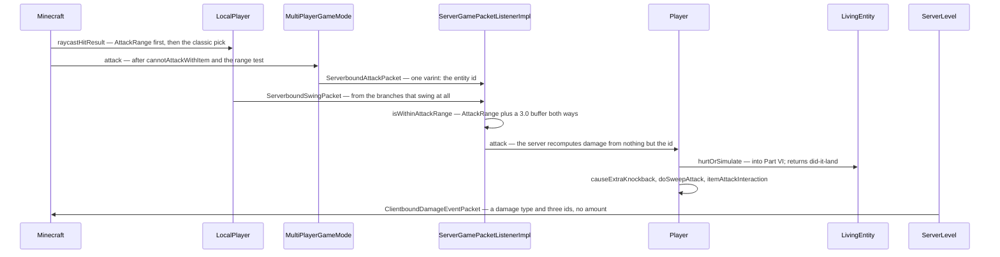
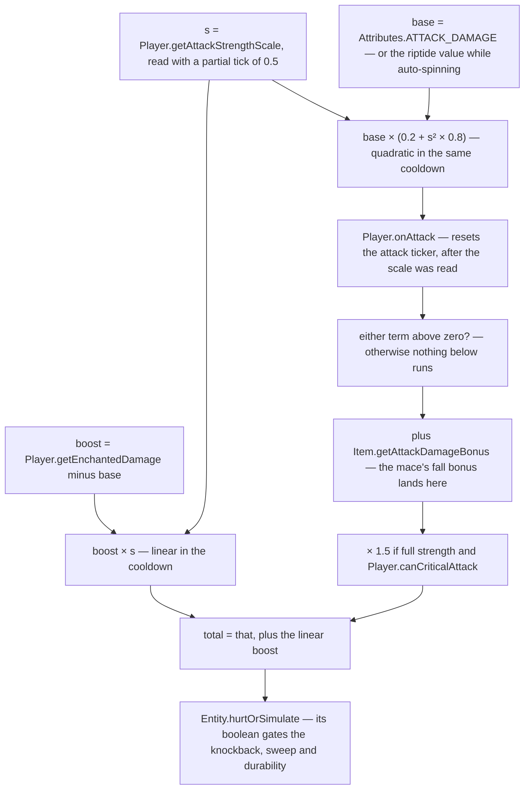

# The sword swing

> Verified against **Minecraft 26.2** · Part VIII · Left-click on a pig: the client picks a target and sends one integer, and the server rebuilds every part of the hit from scratch.

You put the crosshair on a pig and click. The client has already decided
what you are looking at — earlier in this same tick — checks a handful of
reasons not to swing, and sends the smallest packet in melee combat:
**`ServerboundAttackPacket` is a record of one int, the entity id.** No
hand, no sneak flag, no hit position, no damage. Everything else the server
re-derives: the weapon from your main hand, the geometry from two bounding
boxes, and the damage from an attribute, a cooldown curve applied twice in
two different shapes, and a multiplication order in which the mace's fall
bonus lands *before* the critical hit and is therefore multiplied by it.

## The cast

| class | what it decides | thread |
|---|---|---|
| `Minecraft` | what you are looking at, and whether the click swings at all | client main |
| `LocalPlayer` | the raycast, and which range each candidate is judged against | client main |
| `MultiPlayerGameMode` | sends the attack, and predicts nothing | client main |
| `ServerGamePacketListenerImpl` | resolves the id, re-checks the range and the item | server main |
| `Player` | `Player.attack`: one method, and the order inside it is load-bearing | server main |
| `LivingEntity` | the swing animation state, and the two attack clocks | both |
| `AttackRange` | a weapon's own reach, with a minimum as well as a maximum | — |

## Picking: what is under the crosshair

`Minecraft.pick` runs once per tick inside `Minecraft.tick`, in this order:
`MultiPlayerGameMode.tick` → **`Minecraft.pick`** → the GUI →
`Minecraft.handleKeybinds`, which drains `Options.keyAttack` into
`Minecraft.startAttack` and finishes with `Minecraft.continueAttack` for
held-down mining. So the hit result a click uses was computed *earlier in
the same tick*. `Minecraft.pick` also runs per frame, for the crosshair and
the block outline, but that value is not what the attack sees.

It asks the camera entity, and for the local player that is
`LocalPlayer.raycastHitResult`. If the **active** item — the one being used,
if any, else the main hand — carries an `AttackRange`
(`DataComponents.ATTACK_RANGE`), that component's own search runs first; and
if it finds nothing, the classic algorithm runs **as well**: a block clip
out to the greater of the two ranges, an entity sweep with
`ProjectileUtil.getEntityHitResult` over the bounding box expanded along the
view direction and inflated by one, each candidate inflated by
`Entity.getPickRadius` (**zero** for everything but projectiles) — and the
entity wins only if it is strictly nearer than the block. Then
`LocalPlayer.filterHitResult` discards each against *its own* range:
`Attributes.ENTITY_INTERACTION_RANGE` (3.0) for the entity,
`Attributes.BLOCK_INTERACTION_RANGE` (4.5) for the block. That is where the
two reaches diverge.

`AttackRange` is worth a second look, because it is a reach *floor* as well
as a ceiling: a minimum and a maximum, separate creative values, a hitbox
margin and a mob factor. `AttackRange.isInRange` is the test,
`AttackRange.defaultFor` falls back to `Attributes.ENTITY_INTERACTION_RANGE`,
and `AttackRange.effectiveMinRange` / `AttackRange.effectiveMaxRange` apply
the mob factor — only for non-players.

## Deciding: most branches do not swing

`Minecraft.startAttack` is the branch point. It returns early — no swing, no
packet — while `Minecraft.missTime` is running, when there is no hit result
at all (setting a ten-tick miss time), while `LocalPlayer.isHandsBusy`, for
a disabled item, and when `Player.cannotAttackWithItem` refuses with a
tolerance of **zero**; spectators take a branch of their own. Two branches
do swing: the piercing short-circuit to `MultiPlayerGameMode.piercingAttack`
when the item carries `DataComponents.PIERCING_WEAPON` — [the
spear](the-spear.md) — and the tail of the hit-result switch: entity to
`MultiPlayerGameMode.attack`, block to
`MultiPlayerGameMode.startDestroyBlock` ([block
breaking](../blocks/block-breaking.md)), a miss on an air block to
`Player.resetAttackStrengthTicker` and the ten-tick miss time. Even the
entity branch is conditional — a weapon with its own `AttackRange` that the
hit falls outside of swings but sends no attack packet at all. The miss time
itself only exists outside creative, and opening any screen parks it at a
very large number.

On the server, `ServerGamePacketListenerImpl.handleAttack` requires the
client to have loaded and the player not to be a spectator, resolves the id
with `ServerLevel.getEntityOrPart`, checks the world border, applies
`Player.isWithinAttackRange` with a **3.0-block server buffer** — applied to
*both* ends, so a weapon's minimum range effectively vanishes server-side —
rejects a piercing weapon (that path arrives elsewhere), checks the item is
enabled, re-checks `Player.cannotAttackWithItem` with a tolerance of **five
ticks**, more lenient than the client's zero, and calls `Player.attack`.
Attacking something absurd — an `ItemEntity`, an `ExperienceOrb`, an
unattackable `AbstractArrow`, yourself — is a **disconnect**, not a
rejection; failing the range check is a silent drop.

The packet is drained from `PacketProcessor` at the **top** of the tick,
before `MinecraftServer.tickServer` and therefore before any level ticks.
That ordering matters: `Player.attack` runs before the victim's
`LivingEntity.baseTick` decrements `Entity.invulnerableTime` for the tick.
(The counter is declared on `Entity`, decremented in
`LivingEntity.baseTick`, and skipped entirely for a `ServerPlayer`.) All the
resulting feedback packets leave in one flush, because the connection
suspends flushing across `MinecraftServer.tickChildren`.

## The trace: one click, one integer, one round trip

## The damage: one number, two curves, one order

`Player.attack` is a single method, and everything interesting about melee
combat is the order in which it touches one float.

Read that picture for the two things it makes obvious. **The cooldown is
applied twice, differently** — a quadratic ramp on the base damage, a linear
one on the enchantment bonus, both from the same scale read with the same
0.5 partial tick. And **the item bonus is inside the crit**, because
`Item.getAttackDamageBonus` is added between the sprint check and the
multiplication.

The gates along the way are as particular as the arithmetic.
`Player.cannotAttack` comes first: the target must be attackable and must
not claim the interaction for itself. `Player.deflectProjectile` can end the
attack outright. Sprint knockback needs the scale above 0.9, plays a sound,
and adds a flat **0.5** to the knockback later. `Player.canCriticalAttack`
needs falling, not on the ground, not climbing, not in water, not
mobility-restricted, not a passenger, **not sprinting**, a `LivingEntity`
target — and full strength as well. `Player.isSweepAttack` needs full
strength, *not* a crit, *not* sprint knockback, on the ground, moving slower
than 2.5× the walking speed, and something in `ItemTags.SWORDS`.

If the hit landed, the tail runs in order: `Player.causeExtraKnockback` —
which is also where the attacker's own motion is damped and sprinting
cancelled, using `LivingEntity.getKnockback` computed from
`Attributes.ATTACK_KNOCKBACK` through the enchantments and halved — then
`Player.doSweepAttack`, `Player.attackVisualEffects`,
`LivingEntity.setLastHurtMob`, `Player.itemAttackInteraction`,
`Player.damageStatsAndHearts`, and `Player.causeFoodExhaustion` of 0.1. If
it did not land, a no-damage sound. Either way `Player.postPiercingAttack`
runs at the end.

`Player.itemAttackInteraction` is itself three steps in a particular order:
`ItemStack.hurtEnemy` (the item's own hook and the use statistic, *not*
durability), then `EnchantmentHelper.doPostAttackEffectsWithItemSource`,
then `ItemStack.postHurtEnemy`, which is where `Weapon`'s per-attack
durability cost is applied. `Weapon` (`DataComponents.WEAPON`) is a pair:
that cost, and `Weapon.disableBlockingForSeconds`, the axe's shield-breaking
rule, read back through `LivingEntity.getSecondsToDisableBlocking`.

`Player.doSweepAttack` damages everything in a box around the **primary
target** inflated by (1, 0.25, 1), for candidates within three blocks of the
**attacker**, excluding the attacker, the primary target, allies and marker
armour stands. Each takes `1.0 + Attributes.SWEEPING_DAMAGE_RATIO × base`,
run through `Player.getEnchantedDamage` and then scaled by the
attack-strength scale, plus a flat 0.4 knockback. Its sweep *sound* is
unguarded; the damage and the `ParticleTypes.SWEEP_ATTACK` particles sit
behind the server check.

`Entity.hurtOrSimulate` is the wrapper that branches on the side —
`Entity.hurtServer` on the server, `Entity.hurtClient` on the client. Armour,
invulnerability frames, `DataComponents.BLOCKS_ATTACKS` and knockback
resistance are all [damage and death](../entities/damage-and-death.md).

## Questions players ask

**Why does mashing do less damage?** Because of the quadratic. At half
charge the base damage is 0.2 + 0.25 × 0.8 = 40% of full, while the
enchantment bonus is at 50%. The vocabulary behind it is small:
`LivingEntity.attackStrengthTicker` and `LivingEntity.itemSwapTicker` are
declared on `LivingEntity` but read, reset and incremented only from
`Player`; `Player.getCurrentItemAttackStrengthDelay` is twenty divided by
`Attributes.ATTACK_SPEED`; `Player.resetAttackStrengthTicker` clears both
clocks and `Player.resetOnlyAttackStrengthTicker` clears one. `Player.tick`
also resets them when the main-hand *item* changes — which is what the swap
ticker is for. The ticker also resets mid-method, and the client resets it a
*second* time after `Player.attack` returns, while the server resets it once.

**Why does my sword make no sound until the server answers?**
`ClientLevel.playSeededSound` plays a sound only when the excluded player
*is* the local player, and `Player.playServerSideSound` excludes nobody — so
every hit sound the attacker hears arrives as a `ClientboundSoundPacket`,
one round trip late.

**Does the client predict any of this against a mob?** Almost none.
`Entity.hurtClient` returns false and neither `LivingEntity` nor `Mob`
overrides it, so on the client `Entity.hurtOrSimulate` reports that the hit
did not land and the entire block after it is skipped: no predicted
knockback, no sweep, no visual effects, no durability, no exhaustion. The
exception is another *player* — `RemotePlayer` overrides it and returns
true, so the whole block runs locally against them. `Player.getEnchantedDamage`
does nothing on `Player` either; it returns its argument unchanged and only
`ServerPlayer` overrides it. With `Attributes.ATTACK_DAMAGE` not being
client-syncable ([attributes](../entities/attributes.md)), the client's
damage figure is never authoritative and is not applied to anything but a
`RemotePlayer` anyway.

**Can a weapon be too close to swing?** On the client, yes — `AttackRange`
has a minimum. On the server, no: the 3.0-block leniency is subtracted from
the minimum as well as added to the maximum, so the floor does not survive
the round trip.

**How does my client know how badly the pig was hurt?** It does not.
`ClientboundDamageEventPacket` carries no amount at all — a damage-type
holder, three entity ids and an optional source position — and the victim's
red flash, hurt sound and invulnerability window are reconstructed from
that. Health bars come from [synched entity
data](../entities/synched-entity-data.md).

**Are sweep and knockback enchantment effects?** They are attributes.
`Attributes.SWEEPING_DAMAGE_RATIO` defaults to zero, so a vanilla sweep does
1.0 — scaled by the attack-strength ratio, so slightly less than 1.0
anywhere in the sweep's legal window below full charge. And
`Attributes.ATTACK_KNOCKBACK` defaults to zero, so for an unenchanted sword
the *entire* attacker-side knockback is the sprint bonus of 0.5.

**Why does my swing look different with a different weapon?** Because swing
duration is a data component — `ItemStack.getSwingAnimation` returns a
`SwingAnimation` — not a constant six ticks;
`MobEffects.MINING_FATIGUE` stretches it and haste shortens it. The
animation state itself is `LivingEntity.swinging`,
`LivingEntity.swingingArm`, `LivingEntity.swingTime` and
`LivingEntity.attackAnim`. The swing is not echoed to the swinger:
`ServerGamePacketListenerImpl.handleAnimate` broadcasts
`ClientboundAnimatePacket` to trackers only — but crit particles *are* sent
back, because they go to the trackers of the **attacker** while naming the
**victim**.

**Is this the only way to hit something in melee?** No. Two other paths end
in damage and neither goes through `Player.attack`: a `PiercingWeapon`
short-circuits before the hit-result switch, and a `KineticWeapon` is
reached from item *use* rather than attack. Both are [the
spear](the-spear.md).

## Where to look

`Minecraft.startAttack` · `LocalPlayer.raycastHitResult` ·
`MultiPlayerGameMode.attack` · `ServerboundAttackPacket` ·
`ServerGamePacketListenerImpl.handleAttack` · `Player.attack` ·
`Player.baseDamageScaleFactor` · `Player.doSweepAttack` ·
`Player.itemAttackInteraction` · `AttackRange` · `Weapon` ·
`ProjectileUtil` · `ClientboundDamageEventPacket` · `SwingAnimation`

---

*Rules: names, never code · how the system works, not how the code reads ·
newest version only · every backticked name passes `tools/verify_names.py`.*
