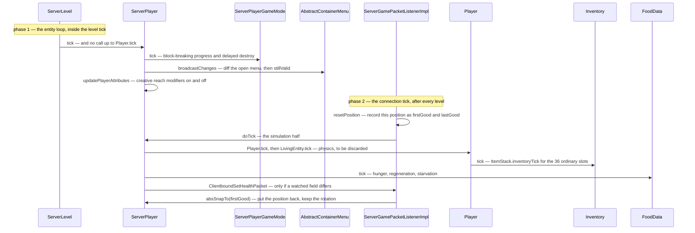

# The two-phase tick

> Verified against **Minecraft 26.2** · Part VIII · One server tick of one player — which happens twice, from two different callers, and the second half throws its own answer away.

Every other entity on the server is ticked once, by the level it stands in.
A player is ticked twice: once from the level's entity loop, and once from
its own connection, after every level in the game has finished. The two
halves share almost no work — the first never calls up into `Player.tick`
at all, and the one block they have in common is the container-validity
check —
and the second half is stranger still. **The connection records where the
player is, runs the entire physics pipeline, and then puts the player back
where it found them.** The server simulates your movement in full, every
tick, and deletes the result: what it keeps is the *velocity*, because that
is the number the anti-cheat compares your reported motion against.

## The cast

| class | what it decides | thread |
|---|---|---|
| `ServerLevel` | phase one: ticks the player in entity order, inside the level tick | server main |
| `ServerPlayer` | both halves — `ServerPlayer.tick` and `ServerPlayer.doTick` overlap in one block only | server main |
| `ServerGamePacketListenerImpl` | phase two: the record–simulate–snap-back bracket | server main |
| `Player` | `Player.tick` and `Player.aiStep`, reached only from phase two | both |
| `Inventory` | the thirty-six ordinary slots' per-tick item hook | both |
| `FoodData` | hunger, regeneration and starvation, last of the three | server main |
| `AbstractContainerMenu` | the open window, diffed against what the client was told | server main |
| `LocalPlayer` | the client's own single tick, gated on the level having loaded | client main |

## Phase one: what the world does to this player

`ServerPlayer.tick` is called by the level's entity loop — through
`ServerLevel.tickNonPassenger` when the player is walking, and through
`ServerLevel.tickPassenger` and `Entity.rideTick` when mounted — and players
are ticked there whether or not their chunk is entity-ticking ([the level
tick](../server/server-level-tick.md)). It runs late in `ServerLevel.tick`:
after the block ticks and the chunk source, before the block entities.

It does **not** call `Player.tick`. What it does instead is the outside
world's business with the player: `ServerPlayerGameMode.tick` for
block-breaking progress and the delayed destroy, the invulnerability
countdown, `AbstractContainerMenu.broadcastChanges` on the open menu
followed by closing it if it is no longer valid, dragging the camera entity
along when one is set, the per-tick advancement criteria and a flush of the
dirty ones, the warden spawn tracker, and
`ServerPlayer.updatePlayerAttributes`. It is not quite connection-free: its
very first statement is the connection's client-load timeout.

## Phase two: what this player would do if it simulated itself

`ServerPlayer.doTick` is called by
`ServerGamePacketListenerImpl.tickPlayer`, from the connection tick, *after*
every level has ticked. This is the half that calls up into `Player.tick`
and `LivingEntity.tick`, so **the player's physics are simulated here**. It
then ticks `FoodData.tick`, the play-time statistics,
`ServerPlayer.synchronizeSpecialItemUpdates` over all forty-three slots, and
every *has this changed since I last sent it* comparison that produces
`ClientboundSetHealthPacket` and `ClientboundSetExperiencePacket`. Most of
it — including `Player.tick` — sits behind a gate that a spectator in
unloaded chunks fails.

`Player.aiStep`, reached from inside that, is where `Inventory.tick` runs
over the thirty-six ordinary slots, immediately before `EntityEquipment.tick`
covers the other seven from `LivingEntity.aiStep`. It is also the item and
orb pickup sweep, gated on being alive and not a spectator, and it takes
**one** experience orb per tick, chosen at random from those touching.

## The trace: one player, one tick, twice

## The bracket, and what survives it

`ServerGamePacketListenerImpl.tickPlayer` is a bracket around one call.
It **records** the player's current position into the `firstGood…` and
`lastGood…` fields, runs `ServerPlayer.doTick`, and then snaps the player
back to the recorded position with `Entity.absSnapTo`, keeping only the
rotation. The rest of the method is the anti-cheat that rides along in the
same bracket: the *floating too long* kick, and the same record-and-check
done again for the vehicle the player is steering. The authoritative position moves in
`ServerGamePacketListenerImpl.handleMovePlayer` or in a teleport, never
here.

What survives the snap-back is `Entity.getDeltaMovement` — exactly what the
anti-cheat subtracts from the client's reported displacement ([input to
movement](input-to-movement.md)) — plus everything non-positional the tick
did: drowning, burning, effects, hunger, the last-sent diffs. Both halves
run every tick whether or not a packet arrived, and packets are drained
before either of them. Everything the client must be *told* about its own
player is written during phase two, and it leaves at once: `Connection.tick`
flushes the channel on the line after it has run the listener that called
`ServerPlayer.doTick` ([the server tick](../server/server-tick.md)).

The pairing that makes this necessary is [Part VI's
authority](../entities/authority.md): `Player.isClientAuthoritative` is an
unconditional yes on **both** sides, which denies a `ServerPlayer`
local-instance authority, while `Entity.canSimulateMovement` and
`Entity.isEffectiveAi` are overridden true on the server anyway. So the
pipeline runs and its answer is not believed.

## The client's single tick

`LocalPlayer.tick` runs from `ClientLevel`'s entity tick on the main thread,
with its entire body gated on the connection reporting that the level has
loaded. `Minecraft.gameMode` is ticked separately, and *earlier* in
`Minecraft.tick` than the entity tick. `ClientInput.tick` is called from
inside `LocalPlayer.aiStep`, so input is **sampled inside the tick**, not
pushed from the key callback — though the method doing the sampling is
`KeyboardInput.tick`; `ClientInput.tick` itself is empty.

Netty threads mostly do not touch player state: fifty-two of the sixty-one
game handlers open by deferring to the owning thread ([the server
tick](../server/server-tick.md) covers the mechanism). The exceptions are
worth knowing, because they are not all trivial. Two really do touch
nothing — the ping reply and an empty custom-payload hook. But all three
chat handlers reach `ServerGamePacketListenerImpl.tryHandleChat`, which
reads `ServerPlayer.getChatVisibility` and calls
`ServerPlayer.resetLastActionTime` **on the Netty thread** before handing
the rest to `MinecraftServer.execute`.

## Questions players ask

**If the server ticks my player from the connection, does a silent client
stop being ticked?** No. `ServerPlayer.doTick` runs every tick regardless of
traffic, and so does `ServerPlayer.tick`; the one thing that stops phase two
is `MinecraftServer.isPaused`, which only an integrated server reports. What stops a silent client moving
is not a missing tick — it is the snap-back, which undoes every position the
simulation produced.

**Why does fall damage come from the packet handler?** Because inside
`Entity.move`, the fall-damage branch is gated on local-instance authority,
which is false for a `ServerPlayer`. The damage is applied instead by
`Entity.doCheckFallDamage`, called on the movement-packet path with the
client's own reported delta.

**Which half does the thing I am looking for?** If it is the world acting on
the player — the menu's change broadcast, the breaking timer, the spectator
camera, the advancement criteria — phase one. If it is the player acting — physics,
hunger, effects, item ticking, the packets that report a changed number —
phase two.

**Is a mounted player different?** Only in who calls phase one:
`ServerLevel.tickPassenger` through `Entity.rideTick` rather than
`ServerLevel.tickNonPassenger`. Phase two is unchanged, and the movement
packets a passenger sends are treated very differently — see [input to
movement](input-to-movement.md).

## Where to look

`ServerPlayer.tick` · `ServerPlayer.doTick` ·
`ServerGamePacketListenerImpl.tickPlayer` · `Entity.absSnapTo` ·
`Player.tick` · `Player.aiStep` · `Inventory.tick` · `FoodData.tick` ·
`LocalPlayer.tick` · `ServerLevel.tickNonPassenger`

---

*Rules: names, never code · how the system works, not how the code reads ·
newest version only · every backticked name passes `tools/verify_names.py`.*
