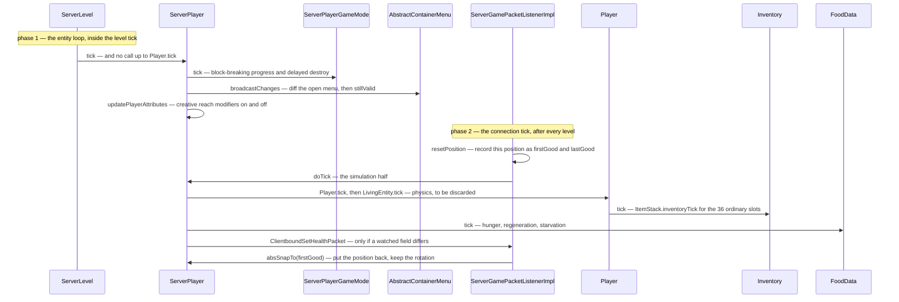

# The two-phase tick

> Verified against **Minecraft 26.2** · Part VIII · One server tick of one player — which happens twice, from two different callers, and the second half throws its own answer away.

Every other entity on the server is ticked once, by the level it stands in.
A player is ticked twice: once from the level's entity loop, and once from
its own connection, after every level in the game has finished. Keep the
inheritance chain in view for the whole page, because the halves are told
apart by how far up it they reach: a `ServerPlayer` *is* a `Player`, which is
a `LivingEntity`, which is an `Entity`, and each of the four declares its own
*tick* and its own *aiStep*. The first half never calls up past
`ServerPlayer` at all, and the one block the two have in common is the
container-validity check — and the second half is stranger still. **The connection records where the
player is, runs the entire physics pipeline, and then puts the player back
where it found them.** The server simulates your movement in full, every
tick, and deletes the result: what it keeps is the *velocity*, because that
is the number the anti-cheat compares your reported motion against.

## The cast

| class | what it decides | thread |
|---|---|---|
| `ServerLevel` | phase one: ticks the player in entity order, inside the level tick | server main |
| `ServerPlayer` | both halves — `ServerPlayer.tick` and `ServerPlayer.doTick` overlap in one block only | server main |
| `ServerGamePacketListenerImpl` | phase two: the record–simulate–snap-back bracket | server main |
| `Player` | `Player.tick` and `Player.aiStep` — on the server, reached from phase two only; on the client, from `LocalPlayer.tick` | both |
| `Inventory` | the thirty-six ordinary slots' per-tick item hook | both |
| `FoodData` | hunger, regeneration and starvation, last of the three | server main |
| `AbstractContainerMenu` | the open window, diffed against what the client was told | server main |
| `LocalPlayer` | the client's own single tick, gated on the level having loaded | client main |

## Phase one: what the world does to this player

`ServerPlayer.tick` is called by the level's entity loop — through
`ServerLevel.tickNonPassenger` when the player is walking, and through
`ServerLevel.tickPassenger` and `Entity.rideTick` when mounted — and players
are ticked there whether or not their chunk is entity-ticking ([the level
tick](../server/server-level-tick.md#every-entity-and-then-its-riders)). It runs late in `ServerLevel.tick`:
after the block ticks and the chunk source, before the block entities.

It does **not** call `Player.tick`. What it does instead is the outside
world's business with the player: `ServerPlayerGameMode.tick` for
block-breaking progress and the delayed destroy ([block
breaking](../blocks/block-breaking.md#the-button-is-not-the-switch)), the
invulnerability countdown, `AbstractContainerMenu.broadcastChanges` on the
open menu followed by closing it if it is no longer valid ([containers and
menus](../items/containers-and-menus.md#where-in-the-tick-a-broadcast-happens)),
dragging the camera entity along when one is set, the per-tick advancement
criteria and a flush of the dirty ones, the warden spawn tracker, and
`ServerPlayer.updatePlayerAttributes`. It is not quite connection-free: its
very first statement is the connection's client-load timeout ([players and
sessions](../server/players-and-sessions.md#loaded-is-something-the-client-says)).

## Phase two: what this player would do if it simulated itself

`ServerPlayer.doTick` is called by
`ServerGamePacketListenerImpl.tickPlayer`, from the connection tick, *after*
every level has ticked. This is the half that calls up into `Player.tick`
and `LivingEntity.tick`, so **the player's physics are simulated here**. It
then ticks `FoodData.tick`, the play-time statistics,
`ServerPlayer.synchronizeSpecialItemUpdates` over all forty-three slots
([player anatomy](player-anatomy.md#forty-three-slots-and-one-of-them-is-an-alias)),
and every *has this changed since I last sent it* comparison that produces
`ClientboundSetHealthPacket` and `ClientboundSetExperiencePacket` ([hunger
and experience](hunger-and-experience.md#the-other-bar-and-the-number-it-is-really-watching)). This is also where
the shared block turns up: `ServerPlayer.doTick` re-runs the same
`AbstractContainerMenu.stillValid` check phase one ran, and closes the menu
if it now fails — the only work both halves do.

The first group of those is gated, and the gate is a single condition:
**a spectator that is touching an unloaded chunk skips it.** Behind that gate
sit `Player.tick`, the container check, `FoodData.tick` and the play-time
statistics; the forty-three-slot sweep and every last-sent comparison run
regardless. So a spectator drifting out of the loaded world stops being
simulated and keeps being reported on.

`Player.aiStep`, reached from inside that, is where the two item-tick calls
happen and in which order: `Inventory.tick` over the thirty-six ordinary
slots, immediately before `EntityEquipment.tick` covers the other seven from
`LivingEntity.aiStep` — why there are two of them is the forty-three slots
([player anatomy](player-anatomy.md#why-the-forty-three-need-two-ticking-calls)). It is also the
item and orb pickup sweep, gated on being alive and not a spectator; what the
sweep does with an orb once it touches one is [hunger and
experience](hunger-and-experience.md#the-other-bar-and-the-number-it-is-really-watching).

The division is clean enough to use as a rule while reading the rest of this
part. If the thing you are looking for is the **world acting on the player** —
the menu's change broadcast, the breaking timer, the spectator camera, the
advancement criteria — it is in phase one. If it is the **player acting** —
physics, hunger, effects, item ticking, the packets that report a changed
number — it is in phase two.

## Both halves, in the order they run

## The bracket, and what survives it

`ServerGamePacketListenerImpl.tickPlayer` is a bracket around one call.
`ServerGamePacketListenerImpl.resetPosition` **records** the player's current
position into the `firstGood…` and `lastGood…` fields — *good* meaning *this
is the last place the server was willing to agree you were* — then
`ServerPlayer.doTick` runs, and then the player is snapped back to the
recorded position with `Entity.absSnapTo`, keeping only the rotation. What runs inside it is the whole of `LivingEntity.aiStep`,
`LivingEntity.travel` and `Entity.move`. The rest of the method is the
anti-cheat that rides along in the same bracket: the *floating too long*
kick, and the same record-and-check done again for the vehicle the player is
steering. On foot the authoritative position moves in
`ServerGamePacketListenerImpl.handleMovePlayer` or in a teleport, never here.
Riding is the exception, and it is phase *one* that makes it one:
`Entity.rideTick` ticks the passenger and then has the vehicle reposition it,
so a rider's real position is written by the level's loop before the bracket
ever opens, and the snap-back at the end of the bracket puts it back there.

What survives the snap-back is `Entity.getDeltaMovement` — exactly what the
anti-cheat subtracts from the client's reported displacement ([input to
movement](input-to-movement.md)) — plus everything non-positional the tick
did: drowning, burning, effects, hunger, the last-sent diffs. Both halves
run every tick whether or not a packet arrived, and packets are drained
before either of them. Everything the client must be *told* about its own
player is written during phase two, and it leaves at once: `Connection.tick`
flushes the channel on the line after it has run the listener that called
`ServerPlayer.doTick` ([the server
tick](../server/server-tick.md#the-two-writes-each-client-gets)).

One qualification to *phase two is where a player's own state is written*,
and it is the only one. Almost every game handler defers to the owning thread
before it touches anything ([the server
tick](../server/server-tick.md#every-packet-since-last-time-in-one-drain)
owns the rule and counts the exceptions); the chat handlers are the ones that
do not. `ServerGamePacketListenerImpl.tryHandleChat` reads
`ServerPlayer.getChatVisibility` and calls `ServerPlayer.resetLastActionTime`
**on the Netty thread**, before it hands the rest over ([chat and
signing](../networking/chat-and-signing.md)) — two fields on a `ServerPlayer`
written outside both halves and outside the server thread.

The pairing that makes this necessary is [Part VI's
authority](../entities/authority.md#five-predicates-and-the-final-one-the-other-four-hang-off):
`Player.isClientAuthoritative` is an
unconditional yes on **both** sides, which denies a `ServerPlayer`
local-instance authority, while `Entity.canSimulateMovement` and
`Entity.isEffectiveAi` are overridden true on the server anyway. So the
pipeline runs and its answer is not believed.

## The client ticks its player once

`LocalPlayer.tick` runs from `ClientLevel`'s entity tick on the main thread,
with its entire body gated on the connection reporting that the level has
loaded. `Minecraft.gameMode` is ticked separately, and *earlier* in
`Minecraft.tick` than the entity tick. `ClientInput.tick` is called from
inside `LocalPlayer.aiStep`, so input is **sampled inside the tick**, not
pushed from the key callback — though the method doing the sampling is
`KeyboardInput.tick`; `ClientInput.tick` itself is empty.

## Questions players ask

**If the server ticks my player from the connection, does a silent client
stop being ticked?** No. `ServerPlayer.doTick` runs every tick regardless of
traffic, and so does `ServerPlayer.tick`. Only two things hold phase two
back, and neither is silence: `MinecraftServer.isPaused` — which only an
integrated server ever reports true — short-circuits the whole bracket before
`ServerPlayer.doTick` is called at all, and the spectator gate above skips
its first half. What stops a silent client *moving* is neither: it is the
snap-back, which undoes every position the simulation produced.

**Why does fall damage come from the packet handler?** Because the branch
inside `Entity.move` is one of the three things gated on local-instance
authority, which a `ServerPlayer` fails ([authority](../entities/authority.md#three-cases-read-on-both-sides)).
`Entity.doCheckFallDamage` on the movement-packet path does it instead, with
the client's own reported delta — which is the two-phase split showing up as
a damage number.

**Is a mounted player different?** Not in phase two, which is unchanged, and
not in what the bracket does. The difference is that the movement packets a
passenger sends are judged by an almost entirely separate piece of code — see
[input to movement](input-to-movement.md).

## Where to look

Read the two halves side by side: **`ServerPlayer.tick`** and
**`ServerPlayer.doTick`** are both short, and the second is the one with the
spectator gate at the top of it. Then
**`ServerGamePacketListenerImpl.tickPlayer`** for the bracket itself — the
record, the call, the `Entity.absSnapTo`, and the two floating checks that
ride along after it. **`Player.aiStep`** is where the item ticks and the
pickup sweep happen, and **`LocalPlayer.tick`** is the client's whole
one-pass answer to all of it, worth reading immediately afterwards for the
contrast. If you want the callers rather than the callees,
**`ServerLevel.tickNonPassenger`** is phase one's.

---

*Rules: names, never code · how the system works, not how the code reads ·
newest version only · every backticked name passes `tools/verify_names.py`.*
