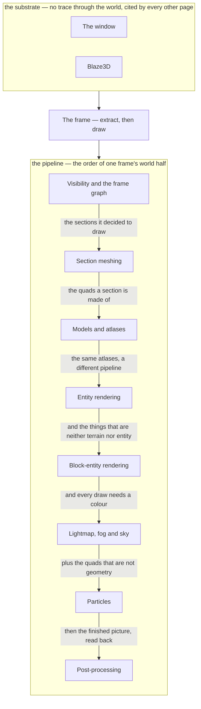

# XI · Rendering

> Verified against **Minecraft 26.2** · Part XI · one thread, sixty times a second, turning a world nobody can see into a picture — and two layers of machinery underneath that never touch the world at all.

A frame is one method call. Everything in this part happens inside
`Minecraft.renderFrame`, on the same thread that ticked the world a moment
earlier, and it happens twice over: once to *copy* the live game into a pile
of immutable value objects, and once to *draw* those objects with the live
game deliberately out of reach. A player recognises the part by the seams in
that arrangement — terrain filling in outward as you fly, a block you placed
appearing before the server has agreed to it, a mob that pins in place under
`/tick freeze` while you keep moving, a resource pack that makes the game
stop for a second and come back looking different.

It is also the largest system in the game. Counting `client/renderer`,
`client/model` and `com/mojang/blaze3d` together — one class per file, one
line per line of decompiled source, the same way [the atlas](../../maps/README.md)
counts everything else — the renderer is **1,179 classes and 87,000 lines**,
against 420 classes and 53,000 for the whole of `net/minecraft/server`. This
part does not cover all of it, and [what this book
skips](../anatomy/what-this-book-skips.md) says which parts are declined and
why.

## The shape of the part

Part XI is **a substrate under a pipeline**. Two of its pages — the window
and Blaze3D — are what the renderer stands on: neither has a trace through
the world, and every other page in the part cites them. The rest really is a
pipeline, in the order things happen inside one frame. `the-frame` opens the
part because it is the shortest way to see the whole shape at once, and
because a reader who has watched one frame end to end has a reason to care
what a `GpuDevice` is.

Read the substrate arrow as *depends on*, not as *happens before*: the window
and the device are made once at startup and never again. Read the pipeline
arrows as *hands to*. The last arrow is the one the figure flatters: **two**
of the six post chains append their passes to the very frame graph the
visibility page describes, and the other four build a graph of their own and
throw it away. They are one machine because they are one loader, one schema
and one pass class — not because they all end up in one graph.

## Before you start

[The client loop](../client/the-client-loop.md) from Part X, and not
optionally: it is the only page that says *when* a frame happens and how many
ticks ran before it, and this part begins exactly where that page's *frame*
zone opens. It is the shortest page in Part X, so this is a cheap dependency.

[The resource system](../foundations/resource-system.md) from Part II before
[models and atlases](models-and-atlases.md), which is a reload listener and
leans on the barrier semantics taught there rather than restating them.

[Environment attributes and timelines](../world/environment-attributes-and-timelines.md)
from Part IV before [lightmap, fog and sky](lightmap-fog-and-sky.md). Part IV
owns that system; Part XI is its client-side consumer and deliberately does
not re-teach it.

[The client level](../client/the-client-level.md), for what the thing being
drawn actually is — a `Level` with its authority removed — and for the three
ways `LevelExtractor` is reached.

## Watch in this order

1. [The frame](the-frame.md) — one method, two halves, and a wall between
   them. Nine profiler zones, five different partial ticks, and a failed
   surface acquisition that costs you the picture but not the work.
2. [The window](the-window.md) — the substrate nothing else admits to
   needing. A retry loop that creates a window and a graphics backend
   together, six operating-system callbacks of which the game hears two, and
   `NativeImage`, the seam between a file and a texture.
3. [Blaze3D](blaze3d.md) — the game's own graphics API, and the part's
   vocabulary page. Four validating façades over two real backends, one of
   which is Vulkan and is the larger of the two.
4. [Visibility and the frame graph](visibility-and-the-frame-graph.md) — what
   the frame decides to draw, and in what order. A reachability walk over an
   octree whose asymmetry is why terrain reveals itself outward.
5. [Section meshing](section-meshing.md) — where the triangles came from. A
   block is placed, a halo of positions goes dirty, a worker compiles a
   snapshot, and the swap happens frames later and all at once.
6. [Models and atlases](models-and-atlases.md) — the reload pipeline behind
   every quad. Thirteen atlases stitched in parallel, one barrier, and a
   quad whose chunk layer is read out of its sprite's pixels.
7. [Entity rendering](entity-rendering.md) — everything in the world that is
   not terrain, in four stages, none of which is called *render*. The zombie
   is animated at least twice per frame.
8. [Block-entity rendering](block-entity-rendering.md) — the same four
   stages with three differences that show. A chest's block model is empty,
   a block entity is culled by its section rather than by the frustum, and
   the chest in your hand is drawn by a different renderer at a different
   partial tick.
9. [Lightmap, fog and sky](lightmap-fog-and-sky.md) — what colour all of it
   is. One question asked five times over, by renderers that mostly no
   longer know what time it is.
10. [Particles](particles.md) — the part's policy page: five gates that
    disagree with each other, and a break puff that passes through none of
    them.
11. [Post-processing](post-processing.md) — the closer. Six JSON-declared
    shader chains, which is how the pause-menu blur and the creeper
    spectator shader turn out to be the same machine — and a resource pack
    can rewrite all six and add none.

Four and five are a pair — they were one page until this pass, and they are
still one journey seen from its two ends — and so are seven and eight, the
second of which is written as the differences from the first. One to three can be watched in
order or in the order one, three, two; the window is the page a viewer is
most likely to skip and least likely to regret.

## Reference this part uses

[Submit phases and feature renderers](../../reference/submit-phases.md) is
the catalogue behind [entity rendering](entity-rendering.md) and
[block-entity rendering](block-entity-rendering.md): the fifteen phases a
submitted feature can land in, in declaration order, and the thirteen
renderers that write the vertices. [Diagram
lanes](../../reference/lanes.md) for the abbreviations these figures use, and
[the threads](../../reference/threads.md) for the two that matter here — the
one the whole part runs on, and the background pool that meshes sections.
[Naming drift](../../reference/naming-drift.md) is worth having open for this
part in particular: no area of the game was renamed harder between 1.21 and
26.2. [The glossary](../../reference/glossary.md) for *extract*, *render
state*, *frame graph*, *chunk layer*, *partial tick*, *atlas*, *special
model renderer* and *built-in block model*.

Where the part stops: what draws *over* the world rather than in it — screens,
the HUD, the render tree they record into and the text inside them — is Part
X, from [the GUI render tree](../client/the-gui-render-tree.md) onward. What
the server chose to tell this client in the first place is Part IX.

---

*Rules: names, never code · how the system works, not how the code reads ·
newest version only · every backticked name passes `tools/verify_names.py`.*
