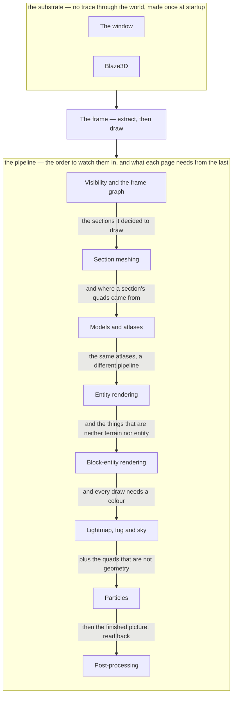

# XI · Rendering

> Verified against **Minecraft 26.2** · Part XI · one thread, a hundred-odd times a second, turning a world nobody can see into a picture — and two layers of machinery underneath that never touch the world at all.

**The renderer is not allowed to look at the world.** A frame is one call to
[`Minecraft.renderFrame`](the-frame.md), on the same thread that ticked the
world a moment earlier, and it runs twice over: once to *copy* the live game
into a pile of value objects, and once to draw those objects with the live
game held at arm's length. Everything in this part is either that wall, or
something feeding it, or something on the far side of it working from a copy
— and every seam a player notices is some piece of the game disagreeing about
*which* copy it got. A mob pins in place under `/tick freeze` while the item
in your hand keeps swaying, because they were copied at different instants.
Terrain fills in outward as you fly, because the walk that decides what is
visible can only reach as far as the meshes that already exist. A chest's lid
stops and the chest in your hand does not. The wall is why all three are
true.

Three things escape the frame, and each of them is a page: particles are
stepped from the [*tick*](particles.md), sections are meshed on [a background
pool](section-meshing.md), and the atlases are built by [a resource
reload](models-and-atlases.md).

It is also the largest thing on the client by a distance. Counting
`client/renderer`, `client/model`, `client/particle` and `com/mojang/blaze3d`
together — one class per file, one line per line of decompiled source, the
same way [the atlas](../../maps/README.md) counts everything else — that is
{{#include ../../generated/part-rendering.md}}, against 420 classes and
53,000 for the whole of `net/minecraft/server`.

Read that number with two corrections. Some of what it counts belongs to
other parts, because the packages are shared and the mapping is by package:
the GUI's render state and its debug renderers live under `client/renderer`
and are Part X's, and the feature renderers are the Reference tier's. And the
traffic runs the other way too — `client/resources/model` counts against
Part X and is [models and atlases](models-and-atlases.md)' subject entire.
Most of the rest is *families*: one class per mob model, one per renderer,
one per render state, one per particle, and one file per GL or Vulkan call
site. This part teaches each of those shapes once and declines the instances,
which is what [what this book
skips](../anatomy/what-this-book-skips.md) records.

## The shape of the part

Part XI is **a substrate under a pipeline**. Two of its pages — the window
and Blaze3D — are what the renderer stands on: neither has a trace through
the world, and both are cited far more than they cite, Blaze3D by eight of
the other ten and the window by two. The rest is a pipeline, and the arrows
below are the order to *watch* it in rather than the order a frame runs in.
[The frame](the-frame.md) opens the part because it is the shortest way to
see the whole shape at once, and because a reader who has watched one frame
end to end has a reason to care what a `GpuDevice` is.

Every arrow is *what the next page needs from the last*. Inside a frame the
order is different — the sky pass is declared before the main one, the
lightmap is built before the world is drawn at all, and [two of the six post
chains are passes of the world's own graph while the other four build one and
throw it away](post-processing.md#two-doors-into-the-gpu-and-one-of-them-is-deprecated).

## Before you start

[The client loop](../client/the-client-loop.md) from Part X, and not
optionally: it is the page that says *when* a frame happens and how many
ticks ran before it, and this part begins exactly where that page's *frame*
zone opens. It is one of the two longest pages in Part X, so budget for it.

[The resource system](../foundations/resource-system.md) from Part II before
[models and atlases](models-and-atlases.md), which is a reload listener and
leans on the barrier semantics taught there rather than restating them.

[Environment attributes and timelines](../world/environment-attributes-and-timelines.md)
from Part IV before [lightmap, fog and sky](lightmap-fog-and-sky.md). Part IV
owns that system; Part XI is its client-side consumer and deliberately does
not re-teach it.

[The client level](../client/the-client-level.md), for what the thing being
drawn actually is — a `Level` with its authority removed — and for the two
ways `LevelExtractor` is reached, pushed and pulled.

## Watch in this order

1. [The frame](the-frame.md) — one method, two halves, and a wall between
   them. Nine profiler zones, six clocks disagreeing on purpose, and a failed
   surface acquisition that costs you the picture but not the work.
2. [The window](the-window.md) — the substrate nothing else admits to
   needing. A retry loop that creates a window and a graphics backend
   together, six operating-system callbacks of which the game hears two, and
   `NativeImage`, the seam between a file and a texture.
3. [Blaze3D](blaze3d.md) — the game's own graphics API, and the part's
   vocabulary page. Four validating façades over two real backends, one of
   which is Vulkan and is the larger of the two.
4. [Visibility and the frame graph](visibility-and-the-frame-graph.md) — what
   the frame decides to draw, and in what order. A reachability walk whose
   asymmetry — uncompiled sections stop it, empty ones do not — is why
   terrain reveals itself outward.
5. [Section meshing](section-meshing.md) — where the triangles came from. A
   block is placed, a halo of positions goes dirty, a worker compiles a
   snapshot, and the swap happens frames later and all at once.
6. [Models and atlases](models-and-atlases.md) — the reload pipeline behind
   every quad. Thirteen atlases stitched in parallel, one barrier, and a
   quad whose chunk layer is read out of its sprite's pixels.
7. [Entity rendering](entity-rendering.md) — everything in the world that is
   not terrain, in four stages, none of which is called *render*. The zombie
   is animated at least twice per frame.
8. [Block-entity rendering](block-entity-rendering.md) — the same four
   stages with three differences that show. A chest's block model is empty,
   a block entity is culled by its section rather than by the frustum, and
   the chest in your hand is drawn by a different renderer at a different
   partial tick.
9. [Lightmap, fog and sky](lightmap-fog-and-sky.md) — what colour all of it
   is. One question asked five times over, by renderers that mostly no
   longer know what time it is.
10. [Particles](particles.md) — the part's policy page: three distance rules
    enforced in three places and three readers of one setting who disagree
    about what its values mean, with a break puff that answers to almost
    none of them.
11. [Post-processing](post-processing.md) — the closer. Six JSON-declared
    shader chains, which is how the pause-menu blur and the creeper
    spectator shader turn out to be the same machine — and a resource pack
    can rewrite all six and add none.

Four and five are a pair — one journey seen from its two ends — and so are
seven and eight, the second of which is written as the differences from the
first. One to three can be watched in order or in the order one, three, two;
the window is the page a viewer is most likely to skip and least likely to
regret.

## Reference this part uses

[Submit phases and feature renderers](../../reference/submit-phases.md) is
the catalogue behind [entity rendering](entity-rendering.md) and
[block-entity rendering](block-entity-rendering.md): the fifteen phases a
submitted feature can land in, in declaration order, and the thirteen
renderers that write the vertices. [Diagram
lanes](../../reference/lanes.md) for the abbreviations these figures use, and
[the threads](../../reference/threads.md) for the two that matter here — the
one the whole part runs on, and the background pool that meshes sections.
[Naming drift](../../reference/naming-drift.md) is worth having open for this
part in particular: the client was rewritten around extract-then-render, so
almost nothing at the top of the render stack kept the name a 1.21-era
reader knows it by. [The glossary](../../reference/glossary.md) for *extract*, *render
state*, *frame graph*, *partial tick*, *atlas*, *special model renderer* and
*built-in block model*.

Where the part stops: what draws *over* the world rather than in it — screens,
the HUD, the render tree they record into and the text inside them — is Part
X, from [the GUI render tree](../client/the-gui-render-tree.md) onward. What
the server chose to tell this client in the first place is Part IX.

---

*Rules: names, never code · how the system works, not how the code reads ·
newest version only · every backticked name passes `tools/verify_names.py`.*
