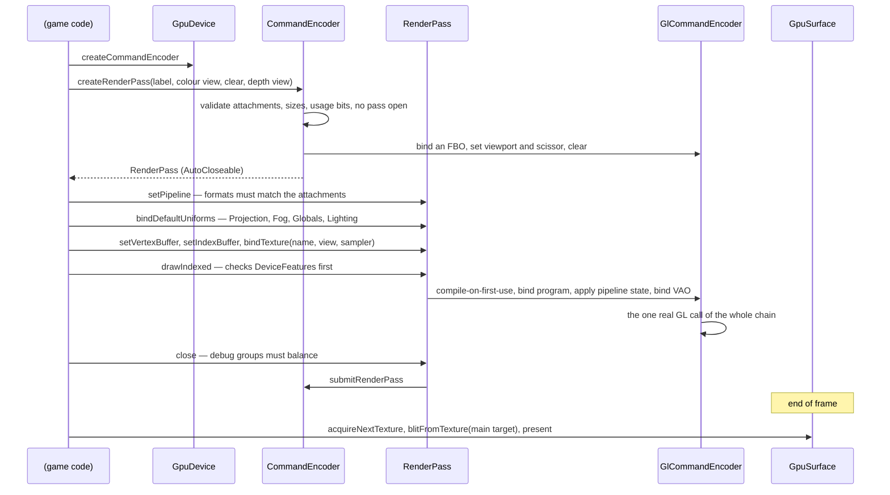

# Blaze3D

> Verified against **Minecraft 26.2** · Part XI · one draw call, from a declared pipeline to a triangle — and the two backends that can serve it.

## Responsibility

Blaze3D is Minecraft's own graphics API. Nothing in the *net.minecraft*
packages talks to a driver; it talks to `GpuDevice`, `CommandEncoder` and
`RenderPass`, and a backend under `com/mojang/blaze3d/opengl` or
`com/mojang/blaze3d/vulkan` turns that into real calls. The abstraction
is the subject of this page. The driver is not.

The one sentence a player would recognise: *the Graphics API setting in
Video Settings, and the fact that the game now runs on Vulkan.*

The headline for a 1.21-era reader: **the state machine is gone.**
*RenderSystem.setShader*, *enableBlend*, *depthMask*, *setShaderTexture*,
*ShaderInstance*, *RenderStateShard*, *VertexBuffer*, *Tesselator*,
*BufferUploader* — none of them exist. Blend mode, depth test, cull and
polygon mode are *fields of a `RenderPipeline`*, declared once and
applied when the pipeline is bound. And `RenderSystem` itself contains no
GL call at all: its only native imports are GLFW and a memory utility.

## The data it owns

### The façade the game uses

Five concrete, validating classes sit in `com/mojang/blaze3d/systems`,
each wrapping a thin per-backend interface:

| the game holds | the backend implements |
|---|---|
| `GpuDevice` | `GpuDeviceBackend` |
| `CommandEncoder` | `CommandEncoderBackend` |
| `RenderPass` | `RenderPassBackend` |
| `GpuSurface` | `GpuSurfaceBackend` |
| — | `GpuBackend` (creates the others) |

The façade owns **every** precondition check and the backend owns none.
`CommandEncoder.createRenderPass` validates the attachment count against
`DeviceLimits.maxColorAttachments`, that each attachment carries
`GpuTexture.USAGE_RENDER_ATTACHMENT`, that all attachments are the same
size, and that no pass is already open. `RenderPass.setPipeline` checks
the pipeline's `ColorTargetState` list against the pass's attachments in
both count and `GpuFormat`. `RenderPass.setUniform` checks the offset
against `DeviceLimits.minUniformOffsetAlignment`. Every draw checks a
`DeviceFeatures` flag first.

- **`RenderSystem`** — the static holder. `RenderSystem.getDevice`,
  `RenderSystem.initRenderer`, `RenderSystem.initRenderThread`,
  `RenderSystem.assertOnRenderThread`, `RenderSystem.pollEvents`,
  `RenderSystem.getModelViewStack`, `RenderSystem.setProjectionMatrix`,
  `RenderSystem.setShaderFog`, `RenderSystem.setShaderLights`,
  `RenderSystem.bindDefaultUniforms`, `RenderSystem.getSamplerCache`,
  `RenderSystem.getDynamicUniforms`, `RenderSystem.getSequentialBuffer`
  (the shared quad index buffer), and the fence queue
  `RenderSystem.queueFencedTask` / `RenderSystem.executePendingTasks`.
- **Capabilities** are one record graph, not a pile of getters:
  `GpuDevice.getDeviceInfo` returns a `DeviceInfo` holding
  `DeviceInfo.name`, `DeviceInfo.backendName`, `DeviceInfo.isZZeroToOne`,
  a `DeviceLimits` (`DeviceLimits.maxTextureSize`,
  `DeviceLimits.minUniformOffsetAlignment`,
  `DeviceLimits.maxColorAttachments`, `DeviceLimits.maxAnisotropy`), a
  `DeviceFeatures` (`DeviceFeatures.shaderDrawParameters`,
  `DeviceFeatures.multiDrawIndirect`,
  `DeviceFeatures.nonZeroFirstInstance`,
  `DeviceFeatures.persistentMapping` …), a `HintsAndWorkarounds` and a
  `DeviceType`.

### Pipelines

`RenderPipeline` is declarative and immutable: two shader `Identifier`s,
a `ShaderDefines`, a list of `BindGroupLayout`, up to eight
`ColorTargetState`, an optional `DepthStencilState`, vertex bindings, a
`PolygonMode`, a cull flag and a `PrimitiveTopology`. It is built through
`RenderPipeline.Builder` (`RenderPipeline.Builder.withVertexShader`,
`RenderPipeline.Builder.withFragmentShader`,
`RenderPipeline.Builder.withBindGroupLayout`,
`RenderPipeline.Builder.withColorTargetState`,
`RenderPipeline.Builder.withDepthStencilState`,
`RenderPipeline.Builder.withVertexBinding`,
`RenderPipeline.Builder.withCull`, `RenderPipeline.Builder.build`), and
composed from `RenderPipeline.Snippet`s via
`RenderPipeline.Builder.buildSnippet`. Blending is a named
`BlendFunction` (`BlendFunction.TRANSLUCENT`, `BlendFunction.ADDITIVE`,
`BlendFunction.GLINT`…), not a pair of loose factors.

The catalogue lives on the game side: `RenderPipelines` registers the
static pipelines (`RenderPipelines.GUI`, `RenderPipelines.LIGHTMAP`,
`RenderPipelines.SKY`, `RenderPipelines.CLOUDS`,
`RenderPipelines.OPAQUE_PARTICLE`, `RenderPipelines.ANIMATE_SPRITE_BLIT`
and dozens more), assembled from a shallow tree of snippets and the
shared uniform-name sets in `BindGroupLayouts`
(`BindGroupLayouts.GLOBALS`, `BindGroupLayouts.PROJECTION`,
`BindGroupLayouts.FOG`, `BindGroupLayouts.SAMPLER0`,
`BindGroupLayouts.DYNAMIC_TRANSFORMS`, `BindGroupLayouts.CHUNK_SECTION`…).
`RenderPipelines.getStaticPipelines` is what the backend precompiles.

### Resources

`GpuBuffer` and `GpuBufferSlice` (with usage bits
`GpuBuffer.USAGE_VERTEX`, `GpuBuffer.USAGE_INDEX`,
`GpuBuffer.USAGE_UNIFORM`, `GpuBuffer.USAGE_COPY_DST`,
`GpuBuffer.USAGE_MAP_WRITE`…), `GpuTexture` and
`GpuTextureView` (`GpuTexture.USAGE_RENDER_ATTACHMENT`,
`GpuTexture.USAGE_TEXTURE_BINDING`), `GpuSampler`, `GpuFence`,
`GpuFormat`, `IndexType`, `PrimitiveTopology`. Uniform blocks are packed
by hand with `Std140Builder` and sized with `Std140SizeCalculator`.
Vertex data is described by `VertexFormat` / `VertexFormatElement` (a
plain record of name, offset and `GpuFormat`) with the standard layouts
in `DefaultVertexFormat`; it is built with `ByteBufferBuilder` and
`BufferBuilder` into a `MeshData`.

Render targets are `RenderTarget` / `TextureTarget` / `MainTarget`, and
the frame's transient ones are allocated through
`GraphicsResourceAllocator` and recycled by `CrossFrameResourcePool`.

## When it runs

All of it on the client's single thread — see [the frame](the-frame.md).
Interestingly, the new API asserts nothing about that:
`RenderSystem.assertOnRenderThread` is called only from inside Blaze3D's
own legacy corners (`GlStateManager`, `RenderTarget`, `Window`,
`TextureUtil`) and never from `GpuDevice`, `CommandEncoder` or
`RenderPass`. The assertion is a survivor of the GL-state era.

Asynchronous GPU results come back through `GpuFence`: a caller registers
a callback with `RenderSystem.queueFencedTask`, and
`RenderSystem.executePendingTasks` runs those whose fence has signalled,
stopping at the first that has not.

## The trace: one draw

Every arrow above the backend lane is validation or declaration; only the
bottom one touches a driver. The pipeline is compiled lazily on its first
`RenderPass.setPipeline` and cached by identity, so the first frame that
uses a new pipeline pays for it and no frame after that does.

The Vulkan path substitutes dynamic rendering for the framebuffer bind,
push descriptors for the uniform binding, and a real swapchain in
`VulkanGpuSurface` — the same six lines of game code.

## Interfaces

- **Called by:** everything that draws — `LevelRenderer`,
  `GuiRenderer`, `FeatureRenderDispatcher`, `Lightmap`, `SkyRenderer`,
  `CloudRenderer`, `TextureAtlas`.
- **Calls into:** LWJGL — OpenGL under `com/mojang/blaze3d/opengl`,
  Vulkan (with shaderc, spirv-cross and VMA) under
  `com/mojang/blaze3d/vulkan`.
- **Crosses the network as:** nothing.
- **Data-driven by:** shaders on disk, loaded by `ShaderManager` and
  handed to a backend through the `ShaderSource` interface;
  `ShaderDefines` supplies the compile-time flags.

## Invariants and surprises

- **OpenGL is imported by exactly one package.** Outside
  `com/mojang/blaze3d/opengl` (and the native-library bootstrap), nothing
  in the game references LWJGL's OpenGL bindings. `RenderSystem` holds
  the device, a matrix stack, four uniform slices and the shared index
  buffers, and nothing else.
- **The abstraction leaks Vulkan in exactly one place.** `RenderPass`
  imports two Vulkan indirect-command structs — purely to use their size
  when validating an indirect buffer. That is the only Vulkan reference
  outside the Vulkan backend.
- **Vulkan is not a stub.** The Vulkan tree is *larger* than the OpenGL
  tree, implements a real swapchain, compiles the same GLSL to SPIR-V and
  reflects it to build bind-group layouts, and requires a modern feature
  set (dynamic rendering, push descriptors, synchronisation2, timeline
  semaphores). `VulkanBackend.checkBackendAvailable` reports precisely
  why it is unavailable when it is.
- **The backend is chosen in `Minecraft`, not in Blaze3D.**
  `PreferredGraphicsApi.getBackendsToTry` returns an ordered list and
  each candidate is tried in turn — so every setting has the other API as
  a fallback, and the *default* is OpenGL-first. A previous unclean
  shutdown downgrades a Vulkan preference automatically.
- **Depth is reversed-Z.** `DepthStencilState.DEFAULT` compares
  greater-or-equal and `RenderSystem.DEFAULT_DEPTH_CLEAR_VALUE` is zero.
- **`GpuDevice.createCommandEncoder` does not create an encoder.** It
  allocates a fresh façade each call; the backend returns the single
  long-lived encoder it owns. The "is a pass open" guard is therefore
  per-façade, which is why the game calls it fresh at every use site.
- **Sampler state left the texture.** `GpuTexture` has no filter or wrap
  setters; filtering is an immutable `GpuSampler` bound per draw.
  `SamplerCache` eagerly creates every combination at startup and throws
  if either enum ever gains a constant.
- **Presentation is a four-step protocol, not a swap.**
  `GpuSurface.configure` → `GpuSurface.acquireNextTexture` →
  `GpuSurface.blitFromTexture` → `GpuSurface.present`, with vsync expressed as a `GpuSurface.PresentMode` inside
  the configuration. The OpenGL backend implements it degenerately; the
  Vulkan one supports mailbox and relaxed-FIFO as well.
- **The two backends differ in exactly one mirrored pair of features.**
  Each supports one of the two multi-draw flavours and not the other, and
  the façade refuses the unsupported one before the backend is reached.
- **The OpenGL backend probes rather than trusts.** It halves a proxy
  texture allocation until the driver accepts one, instead of believing
  the reported maximum, and it guesses the device type from the renderer
  string — flagging slow buffer writes on GL-over-D3D12 and known
  anisotropy problems on some vendors, both of which change how the game
  uploads and filters.
- **Deep validation only runs in a development environment.** The
  "missing uniform", "invalid shader program" and buffer-usage checks in
  the backends are gated on the in-IDE flag.
- **Blaze3D is not only graphics.** `com/mojang/blaze3d/audio` is the
  OpenAL wrapper — see [sound](../client/sound.md).
- **Names a 1.21-era reader will hunt for and not find:**
  *ShaderInstance*, *RenderStateShard*, *VertexBuffer*, *Tesselator*,
  *BufferUploader*, *RenderSystem.setShader* and every state toggle on
  it, *VertexFormat.Mode* (now `PrimitiveTopology`),
  *VertexFormat.IndexType* (now a top-level `IndexType`),
  *TextureFormat* (now `GpuFormat`), *GpuDevice.getDeviceName* and its
  siblings (now the `DeviceInfo` record), *Window.updateDisplay* and
  *setVsync*. `PoseStack` did *not* move and is still here.

## Where to look

`RenderSystem` for what the game holds, then `GpuDevice`,
`CommandEncoder` and `RenderPass` for the façade and its checks.
`RenderPipeline.Builder` and `RenderPipelines` for how a draw is
declared. `GlCommandEncoder` for what an OpenGL draw becomes, and
`VulkanCommandEncoder` for the other answer. `GpuSurface` for where a
frame ends.

---

*Rules: names, never code · how the system works, not how the code reads ·
newest version only · every backticked name passes `tools/verify_names.py`.*
