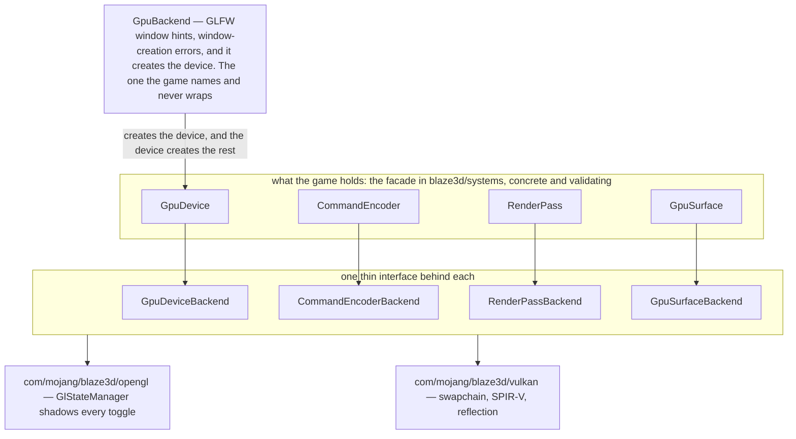
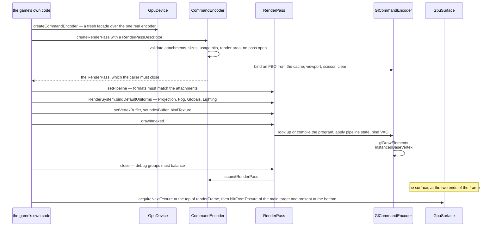

# Blaze3D

> Verified against **Minecraft 26.2** · Part XI · one draw call, from a declared pipeline to a triangle — and the two backends that can serve it.

Open Video Settings, change **Graphics API**, restart, and the game comes back
looking exactly as it did. Nothing in the *net.minecraft* packages noticed,
because nothing in them talks to a driver: they talk to `GpuDevice`,
`CommandEncoder` and `RenderPass`, and a backend under
`com/mojang/blaze3d/opengl` or `com/mojang/blaze3d/vulkan` turns that into
real calls. What made the swap possible is that the state machine left the
game. Blend mode, depth test, cull and polygon mode are *fields of a
`RenderPipeline`*, declared once and applied when the pipeline is bound, and
`RenderSystem` — the class that used to be the state machine — contains no GL
call at all. It did not vanish, though. It moved behind the backend boundary,
where `GlStateManager` still shadows every toggle and still elides the
redundant ones.

Nothing in this page chooses which backend that is. The choice is made in
`Minecraft`, before Blaze3D exists, and which candidates it tries and in what
order is [the
window](the-window.md#trying-backends-until-one-of-them-makes-a-window)'s —
which is also why the option is a preference rather than an instruction. This
page is the vocabulary of the boundary once one of them has won; the frame
that drives it is [the frame](the-frame.md).

## The cast

| class | what it decides | thread |
|---|---|---|
| `RenderSystem` | the static holder: the device, the render thread, the frame's shared uniforms and buffers | Render thread |
| `GpuBackend` | which API is alive — window hints, creation errors, and the device itself | Render thread |
| `GpuDevice` | what exists, and what the hardware will allow | Render thread |
| `CommandEncoder` | whether a pass may open, and with which attachments | Render thread |
| `RenderPass` | that the pipeline matches the attachments before a draw is allowed | Render thread |
| `GpuSurface` | how a finished frame reaches the screen, and what vsync means | Render thread |
| `RenderPipeline` | how to rasterise: shaders, blend, depth, cull, topology — declared, never called | declaration only, read on the Render thread |
| `BufferBuilder` | vertex data — on the render thread, except the one instance chunk meshing runs | Render thread, and the meshing workers |

## Four objects the game only touches through a façade

Four concrete, validating classes sit in `blaze3d/systems`, each over one thin
per-backend interface: the game holds the left column below, never the right.

| the game holds | the backend implements |
|---|---|
| `GpuDevice` | `GpuDeviceBackend` |
| `CommandEncoder` | `CommandEncoderBackend` |
| `RenderPass` | `RenderPassBackend` |
| `GpuSurface` | `GpuSurfaceBackend` |

`GpuBackend` is the entry point and the exception: no façade, because it is
what exists before a device does. Everything else the device creates, and it
answers for the hardware too — as one record graph, not a pile of getters.
`GpuDevice.getDeviceInfo` returns a `DeviceInfo` of `DeviceInfo.name`,
`DeviceInfo.backendName`, `DeviceInfo.isZZeroToOne`, a `DeviceFeatures` of
seven booleans, a `HintsAndWorkarounds`, a `DeviceType` and a `DeviceLimits`
whose `DeviceLimits.maxMemoryAllocationSize` caps the window size.

That record is **sniffed as well as queried**, which is why the game cares
which GPU you have when it could simply ask the driver. `GlHeuristics` reads
the renderer and vendor strings to guess the device type, flags GL-over-D3D12
— assumed on Windows-on-ARM whatever the string says — and flags AMD for
anisotropy problems, both of which change how the game uploads and filters.
The backend probes the reported maximum texture size rather than trusting it
too, halving a proxy allocation until the driver accepts one.

### Who checks what

The façade owns the **API-contract** checks and the backend owns the
resource-state ones. `CommandEncoder.createRenderPass` validates the attachment
count against `DeviceLimits.maxColorAttachments`, each attachment's
`GpuTexture.USAGE_RENDER_ATTACHMENT` bit, that the attachments are all one size,
that a render area was supplied and fits, and that no pass is already open.
`RenderPass.setPipeline` checks the pipeline's `ColorTargetState` list against
the pass's attachments in both count and `GpuFormat`. The `GpuBufferSlice`
overload of `RenderPass.setUniform` checks the offset against
`DeviceLimits.minUniformOffsetAlignment` — the plain `GpuBuffer` overload checks
nothing.

Underneath, the backend throws on its own account: `GlBuffer` for a buffer
mapped without persistent-mapping support, unreadably, unwritably or over two
gigabytes, and `GlDevice` `GpuOutOfMemoryException` on a failed allocation.
And it is the backends, not the façade, that keep the development-only
checks: the only validation in this whole tree gated on running from an IDE
is in `GlRenderPass` and `VulkanRenderPass`. Everything the façade asserts,
it asserts in a shipped game, which is the half of the split that bites: a
draw that hits one of the development-only conditions — a missing uniform, an
invalid shader program, a buffer used against its usage bits — produces
nothing in a shipped game and says nothing about it either.

The thread assertions are not where a reader expects them either.
`RenderSystem.assertOnRenderThread` is called from eleven classes, eight of
those sites inside `RenderSystem` itself: it guards `RenderSystem`'s own
mutable statics and the GL- and GLFW-facing classes, while `GpuDevice`,
`CommandEncoder` and `RenderPass` assert nothing at all. And
`GpuDevice.createCommandEncoder` does not create an encoder — it allocates a
fresh façade over the one long-lived encoder the backend owns, so the *is a
pass open* guard is per-façade and the game calls it fresh at every use site.

### How tight the boundary is

**OpenGL is imported by exactly fourteen files** — thirteen in
`com/mojang/blaze3d/opengl`, the fourteenth the native-library bootstrap — and
nothing else in the game references LWJGL's OpenGL bindings. Vulkan gets the
same treatment and the same two exemptions: outside
`com/mojang/blaze3d/vulkan`, exactly two files import its bindings, and they
are the mirror of OpenGL's exemption rather than a leak of their own — the
same native-library bootstrap, and `RenderPass`, which borrows two Vulkan
indirect-command structs for their *size* when it validates an indirect
buffer. The boundary is thinner still than that suggests in one direction and
thicker in the other: `BackendCreationException`, in `blaze3d/systems` where
the game can see it, names ten ways a backend can fail to be created and
**seven of the ten are Vulkan's**, so the neutral façade layer knows rather a
lot about one of the two APIs it is meant not to. Graphics is not all of it
either, and neither is the render thread: `com/mojang/blaze3d/audio` is the OpenAL wrapper and runs on
the sound engine's own thread — see [the sound
engine](../client/sound-engine.md).

## Vulkan is not a stub

**7,477 lines against 5,627** — the Vulkan backend against the OpenGL one,
forty classes against twenty-eight.

It is the larger of the two trees: a real swapchain, the same GLSL compiled to
SPIR-V and reflected to build bind-group layouts, five required device
extensions, nine required features, and vendor-specific GPU crash breadcrumbs in
*vulkan/checkpoints* that OpenGL has no answer to.
`VulkanBackend.checkBackendAvailable` says why it is unavailable, though only
the default preference consults it.

The backends differ in **all seven** `DeviceFeatures` flags, and only one
difference is symmetric: Vulkan hardcodes five flags true that OpenGL derives
from extensions, and the mirrored pair is the two direct multi-draw flavours,
where OpenGL has the separate one and never the interleaved one and Vulkan the
interleaved one only if the driver offers *VK_EXT_multi_draw* — so a Vulkan
device can support neither. Not every draw consults those flags: the six
multi-draw and indirect entry points gate unconditionally, `RenderPass.draw`
and `RenderPass.drawIndexed` only when a non-zero first instance is asked for,
and `RenderPass.drawMultipleIndexed` — the batched chunk path — not at all.

## A pipeline is a record, not a sequence of calls

`RenderPipeline` is declarative and effectively immutable: a
`RenderPipeline.getLocation` identity, two shader `Identifier`s, a
`ShaderDefines`, a list of `BindGroupLayout`, up to eight `ColorTargetState`,
an optional `DepthStencilState`, vertex bindings, a `PolygonMode`, a cull flag
and a `PrimitiveTopology`. `RenderPipeline.Builder` assembles one, and
composition is the static `RenderPipeline.builder` taking
`RenderPipeline.Snippet`s, which `RenderPipeline.Builder.buildSnippet`
produces rather than consumes.

Blending is a named `BlendFunction` (`BlendFunction.TRANSLUCENT`,
`BlendFunction.ADDITIVE`…) rather than a pair of loose factors, and
`RenderPipeline.Builder.build` refuses a pipeline whose colour targets do not
all share one blend function, or that binds more than sixteen vertex
attributes. Depth is reversed-Z throughout: `DepthStencilState.DEFAULT`
compares greater-or-equal and `RenderSystem.DEFAULT_DEPTH_CLEAR_VALUE` is zero.

The catalogue lives on the game side: `RenderPipelines` registers the static
pipelines — `RenderPipelines.GUI`, `RenderPipelines.LIGHTMAP`,
`RenderPipelines.SKY` and dozens more, eighty-seven in all — from a shallow
tree of snippets and the shared uniform-name sets in `BindGroupLayouts`, and
`RenderPipelines.getStaticPipelines` is the list `ShaderManager` walks to
precompile them.

## What a pipeline does not say

A `RenderPipeline` says how to rasterise. It does not say which textures to
bind or which target to draw into — and that is where a 1.21 reader's composed
stack of *RenderStateShard*s went. The answer is *client/renderer/rendertype*:
`RenderType` wraps a `RenderPipeline` with an `OutputTarget`, a
`TextureTransform`, a `LayeringTransform`, an outline variant and the batching
predicates `RenderType.canConsolidateConsecutiveGeometry` and
`RenderType.sortOnUpload`. `RenderTypes` is the static catalogue, `RenderSetup`
builds the entries, and `RenderType.prepare` resolves one into a
`PreparedRenderType` — pipeline, texture bindings, uniform slice — at draw time.

## Buffers, uniforms, and the ring that resets every frame

The resource vocabulary is small: `GpuBuffer` and `GpuBufferSlice` with usage
bits (`GpuBuffer.USAGE_VERTEX`, `GpuBuffer.USAGE_UNIFORM`,
`GpuBuffer.USAGE_MAP_WRITE`…), `GpuTexture` and `GpuTextureView` with theirs,
`GpuSampler`, `GpuFence`, `GpuFormat`, `IndexType`, `PrimitiveTopology`. Two of
those are where old habits break. Sampler state left the texture — `GpuTexture`
has no filter or wrap setters, filtering is an immutable `GpuSampler` bound per
draw, and `SamplerCache` eagerly creates all thirty-two combinations at startup
and throws if either enum ever gains a constant. And there are three shared
index buffers, not one: `RenderSystem.getSequentialBuffer` switches between a
quad buffer, a line buffer with different winding, and a one-to-one buffer.

### The ring, and the one block every shader gets for free

Per-draw uniform data does not come from per-draw uniform calls; it is carved
out of ring buffers, and the ring is what makes it safe: a slice handed out
this frame is still being read while the next frame is being built, so the
buffer is *rotated* rather than overwritten. `DynamicUniforms` and
`DynamicUniformStorage` hand out `GpuBufferSlice`s of a `MappableRingBuffer`,
and `DynamicUniformStorage.endFrame` rotates it, resets the write cursor and
closes any buffer a growth left behind. `FogRenderer.regularBuffer` is a
second ring rotated the same way at the end of the same frame, while
`GlobalSettingsUniform` and `ProjectionMatrixBuffer` hold one buffer apiece
and rewrite it in place, which is all a frame-wide value needs. The first of
those is the *Globals* block `RenderSystem.bindDefaultUniforms` puts in front
of every draw in the game, and its seven members are fixed in Java: the
camera position as an integer block position *and* the fraction left over,
the screen size, the glint strength, the time of day as a fraction of
twenty-four thousand ticks, the menu blur radius, and a flag for the
supersampled texture-filtering mode. That is the whole of what a shader may
know without being told, which is why [a post chain that
wants something to vary per
frame](post-processing.md#a-pass-is-three-vertices-and-its-uniforms-are-written-once-at-load)
has nowhere else to put it. Per-frame
scratch comes from `TransientMemory` — one interface over the shared
`TransientBlockAllocator`, with `GlTransientMemory` and
`VulkanTransientMemory` behind it, and between them the two largest classes
in either backend tree after the constant tables `GlConst` and `VulkanConst`
that translate the game's enums into each API's integers.
Blocks are packed by hand with `Std140Builder`, sized by `Std140SizeCalculator`.

### Vertices, and the one builder that is not on the render thread

Vertex data is described by `VertexFormat` and `VertexFormatElement` (a plain
record of name, offset and `GpuFormat`) with the standard layouts in
`DefaultVertexFormat`, and built with `ByteBufferBuilder` and `BufferBuilder`
into a `MeshData`. Most `BufferBuilder`s are on the render thread like
everything else here; the exception is the one that matters most for
throughput, because chunk meshing runs `BufferBuilder` on worker threads and
stages the result
through `StagedVertexBuffer` and `UberGpuBuffer` into a `StagingBuffer`, which
is why `SectionRenderDispatcher` has a spin-wait guarded by
`RenderSystem.isOnRenderThread`. ### Targets, and the two static fields that redirect them

Render targets are `RenderTarget`,
`TextureTarget` and `MainTarget`, the transient ones allocated through
`GraphicsResourceAllocator` — `CrossFrameResourcePool` implements it — and
declared in the `FrameGraphBuilder` of [visibility and the frame
graph](visibility-and-the-frame-graph.md#declaring-the-passes-and-why-none-of-them-is-ever-culled).
Which target a pass actually lands on is otherwise never in doubt, with one
exception: `RenderSystem.outputColorTextureOverride` and
`RenderSystem.outputDepthTextureOverride` are two static fields that redirect
the default target somewhere else for as long as they are set, and the only
things that set them are the GUI's item atlas and its picture-in-picture
renderers, which is how [a spinning entity in an inventory
screen](../client/the-gui-render-tree.md) is drawn by the world's machinery
into a texture instead of onto the screen.

## Shaders, and the reflection that checks them

`ShaderManager` loads shader sources and hands them to a backend through
`ShaderSource`. Preprocessing happens twice, in two places, and knowing which
is which is the whole of it: `ShaderManager` resolves the *moj_import*
directives **on a worker, during a reload's prepare**, before a backend sees
anything; the `ShaderDefines` are injected later and inside each backend, by
the same shared `GlslPreprocessor` at the moment a program is compiled. The Vulkan side goes further than compiling: `GlslCompiler`
runs the GLSL through shaderc to SPIR-V and `IntermediaryShaderModule`
*reflects* the result with spirv-cross, enumerating `SpvUniformBuffer`s and
`SpvSampler`s — which is what lets a declared `BindGroupLayout` be checked
against what the shader declares. It is all data on disk, alongside the chains
in [post-processing](post-processing.md).

## One draw

Every drawing class comes through this one shape: `LevelRenderer`,
`GuiRenderer`, `FeatureRenderDispatcher`, `Lightmap`, `TextureAtlas`.

Everything above the `GlCommandEncoder` lane is validation or declaration.
Below it, one call is not one call: pass setup alone binds a framebuffer, sets
viewport and scissor and clears, and a single `RenderPass.drawIndexed` applies
depth, cull, blend, polygon mode and colour mask, binds a program, walks the
uniform and sampler bindings, binds a vertex array and finally draws. The
point is not that a draw is cheap. It is that *the game* never sees any of it.

The pipeline compiles lazily on its first `RenderPass.setPipeline` and is
cached by identity on the device, but no frame in a running game pays for it:
on the *apply* half of every resource reload, on the render thread,
`ShaderManager` clears the device's pipeline cache and precompiles the whole
static catalogue back into it — and swaps in a new
`ShaderManager.CompilationCache` only if every one of them succeeded, so a
pack that breaks a shader leaves the old cache standing rather than a
half-built one. The lazy path is left for pipelines outside the catalogue,
which in a stock game means [the post
chains](post-processing.md#loaded-off-thread-compiled-inside-a-frame). Run the trace
on Vulkan and the game code is unchanged — dynamic rendering replaces the
framebuffer bind, push descriptors the uniform binding, and the swapchain
lives in `VulkanGpuSurface`.

## How a frame reaches the screen

Presentation is a four-step protocol, not a swap: `GpuSurface.configure`, then
`GpuSurface.acquireNextTexture`, then `GpuSurface.blitFromTexture`, then
`GpuSurface.present`. Vsync is not a toggle in that sequence but a
`GpuSurface.PresentMode` in the configuration: OpenGL offers a fixed pair of
modes, Vulkan whatever the driver enumerates, mailbox and relaxed FIFO included.

### What stops the CPU running a hundred frames ahead of the GPU

Not the present. A **two-deep submit fence** is the pacing:
`GlCommandEncoder` rotates its transient memory and a small fence ring every
time it submits, and a submit that would outrun the ring waits. Results that
must come *back* from the GPU use `GpuFence` instead — a callback registered
with `RenderSystem.queueFencedTask`, run by `RenderSystem.executePendingTasks`
once a frame in [the *gpuAsync*
zone](the-frame.md#the-zones-a-frame-is-made-of), stopping at the first fence
that has not signalled. Its one registration site in the game is
`GlCommandEncoder`'s texture readback, and Vulkan routes the same callbacks
through its own destruction queue.

> **For a 1.21-era reader.** Nearly every name you would reach for in this
> corner of the codebase has gone. `PoseStack` did *not* move, and is still here.

| you are looking for | it is now |
|---|---|
| *RenderSystem.setShader* and every state toggle on it | fields of a `RenderPipeline` |
| *ShaderInstance* | the pipeline's two shader `Identifier`s, compiled by `ShaderManager` |
| *RenderStateShard* | `RenderType` over a `RenderPipeline` |
| *VertexBuffer*, *Tesselator*, *BufferUploader* | `BufferBuilder` into a `MeshData`, then a `GpuBuffer` |
| *VertexFormat.Mode*, *VertexFormat.IndexType*, *TextureFormat* | `PrimitiveTopology`, a top-level `IndexType`, `GpuFormat` |
| *GpuDevice.getDeviceName* and its siblings | the `DeviceInfo` record |
| *Window.updateDisplay*, *setVsync* | `GpuSurface.present` and a `GpuSurface.PresentMode` |

## Where to look

`RenderSystem` for what the game holds, then `GpuDevice`, `CommandEncoder` and
`RenderPass` for the façade and its checks. `RenderPipeline.Builder` and
`RenderPipelines` for how a draw is declared, `RenderTypes` for how one is
dressed. `GlCommandEncoder` for an OpenGL draw, `VulkanCommandEncoder` for the
other answer, `GpuSurface` for where a frame ends.

---

*Rules: names, never code · how the system works, not how the code reads ·
newest version only · every backticked name passes `tools/verify_names.py`.*
