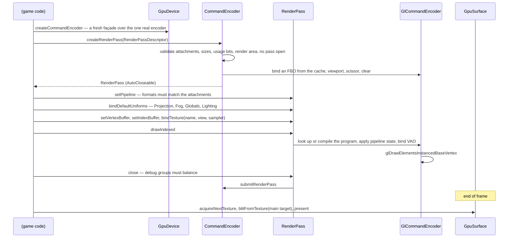

# Blaze3D

> Verified against **Minecraft 26.2** · Part XI · one draw call, from a declared pipeline to a triangle — and the two backends that can serve it.

## Responsibility

Blaze3D is Minecraft's own graphics API. Nothing in the *net.minecraft*
packages talks to a driver; it talks to `GpuDevice`, `CommandEncoder` and
`RenderPass`, and a backend under `com/mojang/blaze3d/opengl` or
`com/mojang/blaze3d/vulkan` turns that into real calls. The abstraction
is the subject of this page. The driver is not. The window the device is
created against is [the window](the-window.md).

The one sentence a player would recognise: *the Graphics API setting in
Video Settings, and the fact that the game now runs on Vulkan.*

The headline for a 1.21-era reader: **the state machine left the game.**
*RenderSystem.setShader*, *enableBlend*, *depthMask*, *setShaderTexture*,
*ShaderInstance*, *RenderStateShard*, *VertexBuffer*, *Tesselator*,
*BufferUploader* — none of them exist. Blend mode, depth test, cull and
polygon mode are *fields of a `RenderPipeline`*, declared once and
applied when the pipeline is bound. And `RenderSystem` itself contains no
GL call at all: its only native imports are GLFW and a memory utility.
The state machine did not vanish, though — it moved behind the backend
boundary, where `GlStateManager` still shadows every GL toggle and still
elides redundant calls.

## The data it owns

### The façade the game uses

Four concrete, validating classes sit in `blaze3d/systems`,
each wrapping a thin per-backend interface:

| the game holds | the backend implements |
|---|---|
| `GpuDevice` | `GpuDeviceBackend` |
| `CommandEncoder` | `CommandEncoderBackend` |
| `RenderPass` | `RenderPassBackend` |
| `GpuSurface` | `GpuSurfaceBackend` |

A fifth interface, `GpuBackend`, has no façade at all: it is the entry
point that sets GLFW window hints, interprets window-creation errors and
creates the `GpuDevice`. Everything else is created by the device.

The façade owns the **API-contract** checks and the backend owns the
resource-state ones. `CommandEncoder.createRenderPass` validates the
attachment count against `DeviceLimits.maxColorAttachments`, that each
attachment carries `GpuTexture.USAGE_RENDER_ATTACHMENT`, that all
attachments are the same size, that a render area was supplied and fits,
and that no pass is already open. `RenderPass.setPipeline` checks the
pipeline's `ColorTargetState` list against the pass's attachments in both
count and `GpuFormat`. The `GpuBufferSlice` overload of
`RenderPass.setUniform` checks the offset against
`DeviceLimits.minUniformOffsetAlignment` — the plain `GpuBuffer` overload
checks nothing. Underneath, `GlBuffer` throws on its own account for a
buffer mapped without persistent-mapping support, an unreadable or
unwritable map, and a map over two gigabytes, and `GlDevice` throws
`GpuOutOfMemoryException` on a failed allocation. Those are not
development-only.

- **`RenderSystem`** — the static holder, and rather more than a holder.
  `RenderSystem.getDevice`, `RenderSystem.initRenderer`,
  `RenderSystem.initRenderThread`, `RenderSystem.assertOnRenderThread`,
  `RenderSystem.pollEvents`, `RenderSystem.getModelViewStack`,
  `RenderSystem.setProjectionMatrix`, `RenderSystem.setShaderFog`,
  `RenderSystem.setShaderLights`, `RenderSystem.bindDefaultUniforms`,
  `RenderSystem.getSamplerCache`, `RenderSystem.getDynamicUniforms`,
  `RenderSystem.getSequentialBuffer`, the fence queue
  `RenderSystem.queueFencedTask` / `RenderSystem.executePendingTasks`,
  the scissor channel `RenderSystem.enableScissorForRenderTypeDraws`, and
  the two output overrides `RenderSystem.outputColorTextureOverride` /
  `RenderSystem.outputDepthTextureOverride` that redirect where the world
  is drawn.
- **Capabilities** are one record graph, not a pile of getters:
  `GpuDevice.getDeviceInfo` returns a `DeviceInfo` holding
  `DeviceInfo.name`, `DeviceInfo.backendName`, `DeviceInfo.isZZeroToOne`,
  a `DeviceLimits` (`DeviceLimits.maxTextureSize`,
  `DeviceLimits.minUniformOffsetAlignment`,
  `DeviceLimits.maxColorAttachments`, `DeviceLimits.maxAnisotropy`,
  `DeviceLimits.maxMemoryAllocationSize` — which is what caps the
  window size — and
  `DeviceLimits.maxMultiDrawDirectInterleavedDrawCount`), a
  `DeviceFeatures` of seven booleans, a `HintsAndWorkarounds` and a
  `DeviceType`.

### Pipelines

`RenderPipeline` is declarative and effectively immutable: a
`RenderPipeline.getLocation` identity, two shader `Identifier`s, a
`ShaderDefines`, a list of `BindGroupLayout`, up to eight
`ColorTargetState`, an optional `DepthStencilState`, vertex bindings, a
`PolygonMode`, a cull flag and a `PrimitiveTopology`. It is built through
`RenderPipeline.Builder` (`RenderPipeline.Builder.withVertexShader`,
`RenderPipeline.Builder.withFragmentShader`,
`RenderPipeline.Builder.withBindGroupLayout`,
`RenderPipeline.Builder.withColorTargetState`,
`RenderPipeline.Builder.withDepthStencilState`,
`RenderPipeline.Builder.withVertexBinding`,
`RenderPipeline.Builder.withCull`, `RenderPipeline.Builder.build`).
Composition is the static `RenderPipeline.builder` taking
`RenderPipeline.Snippet`s — `RenderPipeline.Builder.buildSnippet`
produces one rather than consuming it. Blending is a named
`BlendFunction` (`BlendFunction.TRANSLUCENT`, `BlendFunction.ADDITIVE`,
`BlendFunction.GLINT`…), not a pair of loose factors, and `RenderPipeline.Builder.build` rejects
a pipeline whose colour targets do not all share one blend function, or
that binds more than sixteen vertex attributes.

The catalogue lives on the game side: `RenderPipelines` registers the
static pipelines (`RenderPipelines.GUI`, `RenderPipelines.LIGHTMAP`,
`RenderPipelines.SKY`, `RenderPipelines.CLOUDS`,
`RenderPipelines.OPAQUE_PARTICLE`, `RenderPipelines.ANIMATE_SPRITE_BLIT`
and dozens more — eighty-seven in all), assembled from a shallow tree of
snippets and the shared uniform-name sets in `BindGroupLayouts`
(`BindGroupLayouts.GLOBALS`, `BindGroupLayouts.PROJECTION`,
`BindGroupLayouts.FOG`, `BindGroupLayouts.SAMPLER0`,
`BindGroupLayouts.DYNAMIC_TRANSFORMS`, `BindGroupLayouts.CHUNK_SECTION`…).
`RenderPipelines.getStaticPipelines` is the list `ShaderManager` walks to
precompile them.

### What replaced *RenderStateShard*

A `RenderPipeline` says how to rasterise; it does not say which textures
to bind or which target to draw into. That is
*client/renderer/rendertype*: `RenderType` wraps a `RenderPipeline` with
an `OutputTarget`, a `TextureTransform`, a `LayeringTransform`, an
outline variant and the two batching predicates
`RenderType.canConsolidateConsecutiveGeometry` and
`RenderType.sortOnUpload`. `RenderTypes` is the static catalogue,
`RenderSetup` and `RenderSetup.RenderSetupBuilder` build the entries, and
`RenderType.prepare` resolves one into a `PreparedRenderType` — pipeline,
resolved texture bindings and a uniform slice — at draw time. Where a
1.21 reader looks for a composed stack of *RenderStateShard*s, this is
the answer.

### Resources and uniforms

`GpuBuffer` and `GpuBufferSlice` (with usage bits
`GpuBuffer.USAGE_VERTEX`, `GpuBuffer.USAGE_INDEX`,
`GpuBuffer.USAGE_UNIFORM`, `GpuBuffer.USAGE_COPY_DST`,
`GpuBuffer.USAGE_MAP_WRITE`…), `GpuTexture` and
`GpuTextureView` (`GpuTexture.USAGE_RENDER_ATTACHMENT`,
`GpuTexture.USAGE_TEXTURE_BINDING`), `GpuSampler`, `GpuFence`,
`GpuFormat`, `IndexType`, `PrimitiveTopology`. Uniform blocks are packed
by hand with `Std140Builder` and sized with `Std140SizeCalculator`.
Vertex data is described by `VertexFormat` / `VertexFormatElement` (a
plain record of name, offset and `GpuFormat`) with the standard layouts
in `DefaultVertexFormat`; it is built with `ByteBufferBuilder` and
`BufferBuilder` into a `MeshData`.

Per-draw uniform data does not come from per-draw uniform calls. It is
carved out of ring buffers: `DynamicUniforms` and
`DynamicUniformStorage` hand out `GpuBufferSlice`s of a
`MappableRingBuffer` that is reset once a frame,
`GlobalSettingsUniform` and `ProjectionMatrixBuffer` do the same for the
frame-wide values, and per-frame scratch allocations come from
`TransientMemory` — one interface, two large implementations, over the
shared `TransientBlockAllocator`.

Render targets are `RenderTarget` / `TextureTarget` / `MainTarget`, and
the frame's transient ones are allocated through
`GraphicsResourceAllocator` — which `CrossFrameResourcePool` implements —
and declared in the `FrameGraphBuilder` described in
[level rendering](level-rendering.md).

### Shaders

`ShaderManager` loads shader sources and hands them to a backend through
`ShaderSource`; `ShaderDefines` supplies the compile-time flags. Before
either backend sees a source, the shared
`GlslPreprocessor` resolves its `#moj_import` directives and injects the
defines. The Vulkan side then goes further than compiling: `GlslCompiler`
runs the GLSL through shaderc to SPIR-V, and `IntermediaryShaderModule`
*reflects* the result with spirv-cross — enumerating `SpvUniformBuffer`s
and `SpvSampler`s — which is what lets a declared `BindGroupLayout` be
checked against what the shader actually declares.

## When it runs

Mostly on the client's single thread — see [the frame](the-frame.md).
But the `blaze3d/vertex` package is not: chunk meshing runs `BufferBuilder` on
worker threads and stages the result through `StagedVertexBuffer` and
`UberGpuBuffer` into a `StagingBuffer`, which is exactly why
`SectionRenderDispatcher` has a spin-wait guarded by
`RenderSystem.isOnRenderThread`.

The assertion is not where a reader expects it.
`RenderSystem.assertOnRenderThread` is called from eleven classes,
including eight sites in `RenderSystem` itself — on
`RenderSystem.setProjectionMatrix`, `RenderSystem.getModelViewStack` and
`RenderSystem.getSequentialBuffer`, all of which are current API. What it
guards is `RenderSystem`'s own remaining mutable statics and the
GL/GLFW-facing classes; `GpuDevice`, `CommandEncoder` and `RenderPass`
assert nothing at all.

Asynchronous GPU results come back through `GpuFence`: a caller registers
a callback with `RenderSystem.queueFencedTask`, and
`RenderSystem.executePendingTasks` — called once a frame, in the frame's
*gpuAsync* zone — runs those whose fence has signalled, stopping at the
first that has not. This is an OpenGL-backend mechanism rather than a
general facility: its one registration site is `GlCommandEncoder`'s
texture readback, and the Vulkan backend routes the same callbacks
through its own destruction queue.

## The trace: one draw

Everything above the backend lane is validation or declaration. Below it
is not one GL call but a burst of them: the pass setup alone binds a
framebuffer, sets viewport and scissor and clears, and a single
`RenderPass.drawIndexed` applies depth, cull, blend, polygon mode and colour mask,
binds a program, walks the uniform and sampler bindings, binds a vertex
array and finally draws. The point is not that a draw is cheap; it is
that *the game* never sees any of it.

The pipeline is compiled lazily on its first `RenderPass.setPipeline` and
cached by identity on the device — but in a running game no frame pays
for it, because `ShaderManager` precompiles the whole static catalogue on
every resource reload into the same cache. The lazy path is the fallback
for pipelines that are not in the catalogue.

The Vulkan path substitutes dynamic rendering for the framebuffer bind,
push descriptors for the uniform binding, and a real swapchain in
`VulkanGpuSurface` — with the game code unchanged.

## Interfaces

- **Called by:** everything that draws — `LevelRenderer`,
  `GuiRenderer`, `FeatureRenderDispatcher`, `Lightmap`, `SkyRenderer`,
  `CloudRenderer`, `TextureAtlas`.
- **Calls into:** LWJGL — OpenGL under `com/mojang/blaze3d/opengl`,
  Vulkan (with shaderc, spirv-cross and VMA) under
  `com/mojang/blaze3d/vulkan`.
- **Crosses the network as:** nothing.
- **Data-driven by:** shaders on disk, loaded by `ShaderManager`, plus
  the post-effect chains described in [the frame](the-frame.md).

## Invariants and surprises

- **OpenGL is imported by exactly one package.** Outside
  `com/mojang/blaze3d/opengl` — fourteen files in all, the fourteenth
  being the native-library bootstrap — nothing in the game references
  LWJGL's OpenGL bindings.
- **Vulkan leaks into the abstraction in two places, not one.**
  `RenderPass` imports two Vulkan indirect-command structs, purely to use
  their size when validating an indirect buffer; and the bootstrap that
  probes for a loader imports Vulkan too. `BackendCreationException`,
  also inside `blaze3d/systems`, carries seven Vulkan-named failure reasons. The
  OpenGL exemption and the Vulkan one are the same exemption.
- **Vulkan is not a stub.** The Vulkan tree is *larger* than the OpenGL
  tree — 7,461 lines against 5,623 — implements a real swapchain,
  compiles the same GLSL to SPIR-V and reflects it to build bind-group
  layouts, and requires five device extensions and nine device features.
  It also has something OpenGL has no answer to: vendor-specific GPU
  crash breadcrumbs, in *vulkan/checkpoints*.
  `VulkanBackend.checkBackendAvailable` reports why it is unavailable —
  but it is only consulted when the preference is the default.
- **The backend is chosen in `Minecraft`, not in Blaze3D.**
  `PreferredGraphicsApi.getBackendsToTry` returns an ordered pair and
  each candidate is tried in turn — so every setting has the other API as
  a fallback, and the *default* is OpenGL-first. A previous unclean
  shutdown downgrades twice: a Vulkan preference to the default, and the
  default to OpenGL.
- **The capability record is sniffed, not queried.** `GlHeuristics` reads
  the renderer and vendor strings to guess the device type, flags
  GL-over-D3D12 — which on Windows-on-ARM it assumes regardless of the
  string — and flags AMD for known anisotropy problems. Both flags change
  how the game uploads and filters. The OpenGL backend also probes rather
  than trusts the reported maximum texture size, halving a proxy
  allocation until the driver accepts one.
- **The two backends differ in six of seven feature flags, and only one
  of those differences is symmetric.** Vulkan hardcodes five flags true
  that OpenGL derives from extensions; the genuinely mirrored pair is the
  two direct multi-draw flavours, where OpenGL has the separate one and
  never the interleaved one, and Vulkan has the interleaved one only if
  the driver offers *VK_EXT_multi_draw* — so a Vulkan device can support
  neither.
- **Not every draw checks a feature flag.** The six multi-draw and
  indirect entry points gate unconditionally; `RenderPass.draw` and
  `RenderPass.drawIndexed` check only when a non-zero first instance is
  asked for; and `RenderPass.drawMultipleIndexed` — the batched chunk
  path — checks nothing.
- **Depth is reversed-Z.** `DepthStencilState.DEFAULT` compares
  greater-or-equal and `RenderSystem.DEFAULT_DEPTH_CLEAR_VALUE` is zero.
- **`GpuDevice.createCommandEncoder` does not create an encoder.** It
  allocates a fresh façade each call; the backend returns the single
  long-lived encoder it owns. The "is a pass open" guard is therefore
  per-façade, and the game calls it fresh at every use site.
- **There are three shared index buffers, not one.**
  `RenderSystem.getSequentialBuffer` is a three-way switch: a quad
  buffer, a line buffer with different winding, and a one-to-one buffer
  for everything else.
- **Sampler state left the texture.** `GpuTexture` has no filter or wrap
  setters; filtering is an immutable `GpuSampler` bound per draw.
  `SamplerCache` eagerly creates all thirty-two combinations at startup
  and throws if either enum ever gains a constant.
- **Presentation is a four-step protocol, not a swap.**
  `GpuSurface.configure` → `GpuSurface.acquireNextTexture` →
  `GpuSurface.blitFromTexture` → `GpuSurface.present`, with vsync
  expressed as a `GpuSurface.PresentMode` inside the configuration. The
  OpenGL backend offers a fixed pair of modes; the Vulkan one reports
  whatever the driver enumerates, which can include mailbox and
  relaxed FIFO.
- **A frame is paced by a two-deep submit fence.** `GlCommandEncoder`
  rotates its transient memory and a small fence ring on submit; that,
  not the swap, is what stops the CPU running away from the GPU.
- **Deep validation only runs in a development environment — and outside
  it a bad draw is silently dropped.** The "missing uniform", "invalid
  shader program" and buffer-usage checks are gated on the in-IDE flag;
  in a shipped game the same conditions make the draw return without a
  word.
- **Blaze3D is not only graphics.** `com/mojang/blaze3d/audio` is the
  OpenAL wrapper — see [the sound engine](../client/sound-engine.md).
- **Names a 1.21-era reader will hunt for and not find:**
  *ShaderInstance*, *RenderStateShard* (now `RenderType` over a
  `RenderPipeline`), *VertexBuffer*, *Tesselator*,
  *BufferUploader*, *RenderSystem.setShader* and every state toggle on
  it, *VertexFormat.Mode* (now `PrimitiveTopology`),
  *VertexFormat.IndexType* (now a top-level `IndexType`),
  *TextureFormat* (now `GpuFormat`), *GpuDevice.getDeviceName* and its
  siblings (now the `DeviceInfo` record), *Window.updateDisplay* and
  *setVsync*. `PoseStack` did *not* move and is still here.

## Where to look

`RenderSystem` for what the game holds, then `GpuDevice`,
`CommandEncoder` and `RenderPass` for the façade and its checks.
`RenderPipeline.Builder` and `RenderPipelines` for how a draw is
declared, and `RenderTypes` for how one is dressed. `GlCommandEncoder`
for what an OpenGL draw becomes, and `VulkanCommandEncoder` for the other
answer. `GpuSurface` for where a frame ends.

---

*Rules: names, never code · how the system works, not how the code reads ·
newest version only · every backticked name passes `tools/verify_names.py`.*
