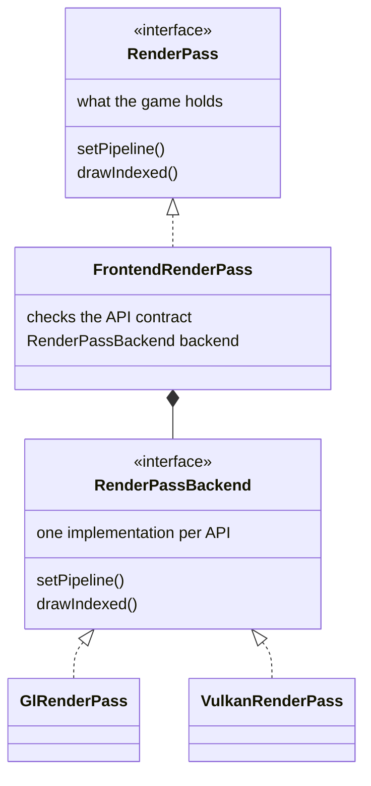
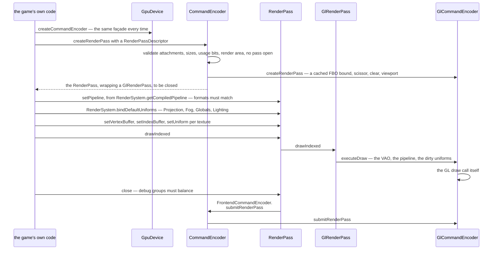

# Blaze3D

> Verified against **Minecraft 26.3** · Part XI · one draw call, from a declared pipeline to a triangle — and the two backends that can serve it.

Open Video Settings, change **Graphics API**, restart, and the game comes back
looking exactly as it did. Nothing in the *net.minecraft* packages noticed,
because nothing in them talks to a driver: they talk to `GpuDevice`,
`CommandEncoder` and `RenderPass`, and a backend under
`com/mojang/renderpearl/backend/opengl` or
`com/mojang/renderpearl/backend/vulkan` turns that into real calls. What made
the swap possible is that the state machine left the game. Blend mode, depth
test, cull and polygon mode are *fields of a `RenderPipeline`*, declared once
and applied by the backend (by OpenGL at the first draw that uses the pipeline,
by Vulkan when it is bound), and
`RenderSystem` — the class that used to be the state machine — contains no GL
call at all. It did not vanish, though. It moved behind the backend boundary,
where `GlStateManager` still shadows the enable-and-disable toggles and still
elides the redundant ones.

Nothing in this page chooses which backend that is. The choice is made in
`Minecraft`, before Blaze3D exists, and which candidates it tries and in what
order belongs to [the
window](the-window.md#trying-backends-until-one-of-them-makes-a-device) —
which is also why the option is a preference rather than an instruction. This
page is the vocabulary of the boundary once one of them has won; the frame
that drives it is [the frame](the-frame.md).

## The cast

| class | what it decides | thread |
|---|---|---|
| `RenderSystem` | the static holder: the device, the Render thread, the frame's shared uniforms and buffers | Render thread |
| `GpuBackend` | which API is alive — its library, the device, creation errors, and then the window | Render thread |
| `GpuDevice` | what exists, and what the hardware will allow | Render thread |
| `CommandEncoder` | whether a pass may open, and with which attachments | Render thread |
| `RenderPass` | that the pipeline matches the attachments before a draw is allowed | Render thread |
| `GpuSurface` | how a finished frame reaches the screen, and what vsync means | Render thread |
| `RenderPipeline` | how to rasterise: shaders, blend, depth, cull, topology — declared, never called | declaration only, compiled on workers, bound on the Render thread |
| `BufferBuilder` | vertex data — on the Render thread, except the builders chunk meshing runs on workers | Render thread, and the meshing workers |

## Four objects the game only touches through a façade

The four are interfaces in `renderpearl/api`, and behind each sits one
concrete, validating class in `renderpearl/frontend` over one thin per-backend
interface. The figure draws those three rungs for one of the four, and the
table after it names them for all four: the game holds the left column, never
the other two.

```mermaid
classDiagram
    class RenderPass {
        <<interface>>
        what the game holds
        setPipeline()
        drawIndexed()
    }
    class FrontendRenderPass {
        checks the API contract
        RenderPassBackend backend
    }
    class RenderPassBackend {
        <<interface>>
        one implementation per API
        setPipeline()
        drawIndexed()
    }
    RenderPass <|.. FrontendRenderPass
    FrontendRenderPass *-- RenderPassBackend
    RenderPassBackend <|.. GlRenderPass
    RenderPassBackend <|.. VulkanRenderPass
```

*One of the four façades as the objects behind it: the game holds a
`RenderPass`, which is a `FrontendRenderPass` wrapping one backend's
`RenderPassBackend`. The API's contract is checked in `FrontendRenderPass`, and
only the bottom row, `GlRenderPass` or `VulkanRenderPass`, knows which API is
running.*

| the game holds | which checks | the backend implements |
|---|---|---|
| `GpuDevice` | `FrontendGpuDevice` | `GpuDeviceBackend` |
| `CommandEncoder` | `FrontendCommandEncoder` | `CommandEncoderBackend` |
| `RenderPass` | `FrontendRenderPass` | `RenderPassBackend` |
| `GpuSurface` | `FrontendGpuSurface` | `GpuSurfaceBackend` |

`GpuBackend` is the entry point and the exception: no façade, because it is
what exists before a device does, and it makes the device and the window. Everything else the device creates, or its encoder
does, and the device answers for the hardware too — as one record graph, not a pile of getters.
`GpuDevice.getDeviceInfo` returns a `DeviceInfo` whose fields include `DeviceInfo.name`,
`DeviceInfo.backendName`, `DeviceInfo.isZZeroToOne`, a `DeviceFeatures` of
eight booleans, a `HintsAndWorkarounds`, a `DeviceType` and a `DeviceLimits`
whose `DeviceLimits.maxTextureSize`, and what its
`DeviceLimits.maxMemoryAllocationSize` can hold, cap the window size.

That record is **sniffed as well as queried**, which is why the game cares
which GPU you have when it could simply ask the driver. `GlHeuristics` reads
the renderer and vendor strings to guess the device type, flags GL-over-D3D12
— assumed on Windows-on-ARM whatever the string says — and flags AMD for
anisotropy problems: the first changes how the backend maps buffers and stages
chunk uploads, the second which filtering a graphics preset picks.
The backend probes the reported maximum texture size rather than trusting it
too, halving a proxy allocation until the driver accepts one.

### Who checks what

The façade owns the **API-contract** checks and the backend owns the state of
its own resources. `FrontendCommandEncoder.createRenderPass` validates the
attachment count against `DeviceLimits.maxColorAttachments`, each attachment's
`GpuTexture.USAGE_RENDER_ATTACHMENT` bit, that the attachments are all one size,
that the render area fits, and that no pass is already open.
`FrontendRenderPass.setPipeline` checks the pipeline's `ColorTargetState` list
against the pass's attachments in both count and `GpuFormat`. The
`GpuBufferSlice` overload of `FrontendRenderPass.setUniform` checks the offset
against `DeviceLimits.minUniformOffsetAlignment` — the plain `GpuBuffer`
overload feeds it the whole buffer at offset zero, which cannot fail.

Underneath, the backend throws on its own account: `GlBuffer` for a buffer
mapped without persistent-mapping support, unreadably, unwritably or over two
gigabytes, and `GlDevice` `GpuOutOfMemoryException` on a failed allocation.
The development-only checks are the façade's too, behind one flag: the only
validation in this whole tree gated on running from an IDE is
`FrontendRenderPass`'s draw-time check, behind
`FrontendGpuDevice.STRICT_VALIDATION`. Everything else the façade asserts, it
asserts in a shipped game, and the gated half is the one that bites: a draw
that breaks one of its rules — a missing uniform, an index or uniform buffer
used against its usage bits, a pipeline that wants a depth texture the pass
lacks — goes to the backend unchecked in a shipped game.

The thread assertions are not where a reader expects them either.
`RenderSystem.assertOnRenderThread` is called from nine classes, eight of
those sites inside `RenderSystem` itself: it guards `RenderSystem`'s own
mutable statics, the GL- and SDL-facing classes, the render targets and one
texture helper, while
`FrontendGpuDevice`, `FrontendCommandEncoder` and `FrontendRenderPass` assert
nothing at all. And `GpuDevice.createCommandEncoder` does not create an
encoder — `FrontendGpuDevice` hands back the one `FrontendCommandEncoder` it
built over the backend's one encoder, so the game can call it fresh at every
use site and the *is a pass open* guard still sees every pass.

### How tight the boundary is

**OpenGL is imported by exactly fifteen files** — fourteen in
`com/mojang/renderpearl/backend/opengl`, the fifteenth the native-library
bootstrap — and nothing else in the game references LWJGL's OpenGL bindings.
Vulkan gets nearly the same treatment: outside
`com/mojang/renderpearl/backend/vulkan`, exactly two files import its bindings
— the same native-library bootstrap, and `FrontendRenderPass`, which borrows
two Vulkan indirect-command structs for their *size* when it validates an
indirect buffer, a small leak OpenGL has no counterpart to. The boundary is thinner still than that suggests in one
direction and thicker in the other: `BackendCreationException`, in
`renderpearl/api` where the game can see it, names eleven ways a backend can
fail to be created and **eight of the eleven are Vulkan's**, so the neutral
façade layer knows rather a lot about one of the two APIs it is meant not to.
Graphics is not all of it either, and neither is the Render thread:
`com/mojang/blaze3d/audio` is the OpenAL wrapper, whose per-source calls run on the sound engine's own thread — see [the sound
engine](../client/sound-engine.md).

## Vulkan is not a stub

**7,387 lines against 5,815** — the Vulkan backend against the OpenGL one,
thirty-three files against twenty-nine.

It is the larger of the two trees: a real swapchain, pipelines built straight
from the SPIR-V the shared compiler produces, five required device
extensions, nine required features, and vendor-specific GPU crash breadcrumbs in
*vulkan/checkpoints* that OpenGL has no answer to.
`VulkanBackend.checkBackendAvailable` says why it is unavailable, though only
the default preference consults it.

The backends differ in **all eight** `DeviceFeatures` flags, and only one
difference is symmetric: Vulkan hardcodes five flags true that OpenGL derives
from extensions, OpenGL hardcodes `DeviceFeatures.wireframeFillMode` true where
Vulkan asks the device for *fillModeNonSolid*, and the mirrored pair is the two
direct multi-draw flavours, where OpenGL has the separate one and never the
interleaved one and Vulkan the interleaved one only if the driver offers
*VK_EXT_multi_draw* — so a Vulkan device can support neither. Not every draw
consults those flags: the six multi-draw and indirect entry points gate
unconditionally, `RenderPass.draw` and `RenderPass.drawIndexed` only when a
non-zero first instance is asked for, and `RenderPass.drawMultipleIndexed` —
the batched chunk path wherever terrain is not drawn indirect — not at all.

## A pipeline is a record, not a sequence of calls

`RenderPipeline` is declarative and effectively immutable: a
`RenderPipeline.getLocation` name, two shader `Identifier`s, a
`ShaderDefines`, a list of `BindGroupLayout`, up to eight `ColorTargetState`,
an optional `DepthStencilState`, vertex bindings, a `PolygonMode`, a cull flag
and a `PrimitiveTopology`. `RenderPipeline.Builder` assembles one, and
composition is the static `RenderPipeline.builder` taking
`RenderPipeline.Snippet`s, which `RenderPipeline.Builder.buildSnippet`
produces rather than consumes.

Blending is a `BlendFunction` record, most often a named one
(`BlendFunction.TRANSLUCENT`, `BlendFunction.ADDITIVE`…), rather than factors
set on the device, and `RenderPipeline.Builder.build` refuses a pipeline whose
blended colour targets do not all share one blend function, or that binds more than sixteen vertex
attributes. Depth is reversed-Z throughout: `DepthStencilState.DEFAULT`
compares greater-or-equal and `RenderSystem.DEFAULT_DEPTH_CLEAR_VALUE` is zero.

The catalogue lives on the game side: `RenderPipelines` registers the static
pipelines — `RenderPipelines.GUI`, `RenderPipelines.LIGHTMAP`,
`RenderPipelines.SKY` and a hundred and ninety-two more, ninety-three of them
the three stages of thirty-one `OitPipelineSet`s — from a shallow tree of
snippets and the shared uniform-name sets in `BindGroupLayouts`, and
`ShaderManager` compiles what `RenderPipelines.requiredPipelines` and
`RenderPipelines.optionalPipelines` list.

## What a pipeline does not say

A `RenderPipeline` says how to rasterise. It does not say which textures to
bind or which target to draw into. The textures are *client/renderer/rendertype*'s:
`RenderType` wraps a `RenderPipeline` with its texture bindings, a
`TextureTransform`, a `LayeringTransform`, an outline variant and the batching
predicates `RenderType.canConsolidateConsecutiveGeometry` and
`RenderType.sortOnUpload`. `RenderTypes` is the static catalogue, `RenderSetup`
builds the entries, and `RenderType.prepare` resolves one into a
`PreparedRenderType` — pipeline, texture bindings, uniform slice — at draw time,
and that draws into whatever `RenderPass` its caller has opened.

## Buffers, uniforms, and the ring that resets every frame

The resource vocabulary is small: `GpuBuffer` with usage bits
(`GpuBuffer.USAGE_VERTEX`, `GpuBuffer.USAGE_UNIFORM`, `GpuBuffer.USAGE_MAP_WRITE`…)
and `GpuBufferSlice` over it, `GpuTexture` with its own and `GpuTextureView`
over it,
`GpuSampler`, `GpuFence`, `GpuFormat`, `IndexType`, `PrimitiveTopology`. Two of
those are where old habits break. Sampler state left the texture — `GpuTexture`
has no filter or wrap setters, filtering is an immutable `GpuSampler` bound per
draw, and `SamplerCache` eagerly creates all thirty-two combinations at startup
and throws if either enum ever gains a constant. And there are three shared
index buffers, not one: `RenderSystem.getSequentialBuffer` switches between a
quad buffer, a line buffer with different winding, and a one-to-one buffer.

### The ring, and the blocks a shader gets for free

Per-draw uniform data does not come from per-draw uniform calls; it is carved
out of ring buffers, and the ring is what makes it safe: a slice handed out
this frame is still being read while the next frame is being built, so the
buffer is *rotated* rather than overwritten. `DynamicGpuData` and
`DynamicGpuDataStorageMapped` hand out `GpuBufferSlice`s of a
`MappableRingBuffer`, and `DynamicGpuDataStorageMapped.endFrame` rotates it,
resets the write cursor and closes any buffer a growth left behind.
`FogRenderer.regularBuffer` is a
second ring, rotated the same way every frame, between the world and the GUI, while
`GlobalSettingsUniform` and `ProjectionMatrixBuffer` hold one buffer apiece
and rewrite it in place, which is all a frame-wide value needs. The first of
those is the *Globals* block, one of the four `RenderSystem.bindDefaultUniforms`
puts in front of every draw but the two depth-integrating passes — beside the
projection, the fog and the lighting — and its seven members are fixed in Java: the
camera position as an integer block position *and* the fraction left over,
the screen size, the glint strength, the time of day as a fraction of
twenty-four thousand ticks, the menu blur radius, and a flag for the
supersampled texture-filtering mode. Those four, and a post pass's own sizes, are the whole of what a shader may
know without being told, and a post pipeline declares only the first of the
four, which is why [a post chain that
wants something to vary per
frame](post-processing.md#a-pass-is-three-vertices-and-its-uniforms-are-written-once-at-load)
has to find it in *Globals* or in its own pass's sizes. Per-frame
scratch comes from `TransientMemory` — one interface over the shared
`TransientBlockAllocator`, with `GlTransientMemory` and
`VulkanTransientMemory` behind it, each among the four longest classes of its
backend tree.
Blocks are packed by hand with `Std140Builder`, sized by `Std140SizeCalculator`.

### Vertices, and the builders that are not on the Render thread

Vertex data is described by `VertexFormat` and `VertexFormatElement` (a plain
record of name, offset and `GpuFormat`) with the standard layouts in
`DefaultVertexFormat`, and built with `ByteBufferBuilder` and `BufferBuilder`
into a `MeshData`. Most `BufferBuilder`s are on the Render thread like
everything else here; the exception is the use that matters most for
throughput, because chunk meshing builds its sections with `BufferBuilder`s on
worker threads, a synchronous compile's aside, and stages the result through `UberGpuBuffer` into a `StagingBuffer`, which is why
`SectionRenderDispatcher` has a spin-wait guarded by
`RenderSystem.isOnRenderThread`.

### Targets, and the pass a draw is handed

Render targets are `RenderTarget`,
`TextureTarget` and `MainTarget`, the transient ones allocated through
`GraphicsResourceAllocator` — `CrossFrameResourcePool` implements it — and
declared in the `FrameGraphBuilder` of [visibility and the frame
graph](visibility-and-the-frame-graph.md#declaring-the-passes-and-why-none-of-them-is-ever-culled).
Which target a draw lands on is never in doubt: it is the one its
`RenderPass` was opened on, and `PreparedRenderType.drawFromBuffer` draws into
the pass its caller hands it. The GUI's item atlas and its picture-in-picture
renderers open that pass on a texture of their own and hand it to
`FeatureRenderDispatcher.renderAllFeatures`, which is how [an entity that turns to follow the mouse in an inventory screen](../client/the-gui-render-tree.md) is drawn by the
world's machinery into a texture instead of onto the screen.

## Shaders, and the reflection that checks them

`ShaderManager` loads shader sources and hands them to the device through
`ShaderSource`. Preprocessing happens once, in one place, and knowing where is
the whole of it: `ShaderManager` only reads every source and every
*shaders/include* file, **on a worker, during a reload's prepare**; the
*#include* directives and the `ShaderDefines` are both resolved later, by
shaderc, when `GlslCompiler.compileToSpv` compiles a stage to SPIR-V — the
defines as macros, the includes through a callback that answers from
`ShaderSource.getInclude`. Both backends start from that SPIR-V, and the
checking happens before either sees it: `PipelineBuilder` *reflects* each
module with spirv-cross through `SpvModule.reflect` — which is what lets a
declared `BindGroupLayout` be checked against what the shader declares, and a
vertex format against the vertex shader's inputs. Vulkan then takes the SPIR-V
as it is, and OpenGL's `GlPipelineRecompiler` translates it back into GLSL for
the driver. It is all data on disk, alongside the chains in
[post-processing](post-processing.md).

## One draw

Every drawing class comes through this one shape — `LevelRenderer`,
`GuiRenderer`, `Lightmap` and `TextureAtlas` among them — or joins it halfway, handed a pass
someone else opened, as `FeatureRenderDispatcher` is.

```mermaid
sequenceDiagram
    participant Game as the game's own code
    participant GD as GpuDevice
    participant CE as CommandEncoder
    participant RP as RenderPass
    participant GlRP as GlRenderPass
    participant GlCE as GlCommandEncoder

    Game->>GD: createCommandEncoder — the same façade every time
    Game->>CE: createRenderPass with a RenderPassDescriptor
    CE->>CE: validate attachments, sizes, usage bits, render area, no pass open
    CE->>GlCE: createRenderPass — a cached FBO bound, scissor, clear, viewport
    CE-->>Game: the RenderPass, wrapping a GlRenderPass, to be closed
    Game->>RP: setPipeline, from RenderSystem.getCompiledPipeline — formats must match
    Game->>RP: RenderSystem.bindDefaultUniforms — Projection, Fog, Globals, Lighting
    Game->>RP: setVertexBuffer, setIndexBuffer, setUniform per texture
    Game->>RP: drawIndexed
    RP->>GlRP: drawIndexed
    GlRP->>GlCE: executeDraw — the VAO, the pipeline, the dirty uniforms
    GlCE->>GlCE: the GL draw call itself
    Game->>RP: close — debug groups must balance
    RP->>CE: FrontendCommandEncoder.<br/>submitRenderPass
    CE->>GlCE: submitRenderPass
```

*One draw on the OpenGL backend: the game talks only to the three façade lanes
beside it, which check what can break the API's contract and pass the work to
the two on the right. A single `RenderPass.drawIndexed` becomes a vertex array,
a pipeline, the dirty uniforms and the driver's draw.*

What the game and the three façades do is declaration and the contract's
checks. In the two lanes on the right, one call is not one call: pass setup
alone binds a framebuffer, sets the scissor, clears and sets the viewport, and
the first `RenderPass.drawIndexed` of a pass binds a vertex array and an index
buffer, binds a program and applies its depth, cull, colour mask, blend and
polygon mode, walks the uniform and sampler bindings and finally draws. The
point is not that a draw is cheap. It is that *the game* never sees any of it.

A pipeline reaches `RenderPass.setPipeline` already compiled: the game asks
`RenderSystem.getCompiledPipeline` for it, and the current `PipelineCache`
answers by identity, compiling on a miss while the Render thread waits. The
reload is what keeps that off the frame: in the *prepare* half of every
resource reload `ShaderManager` compiles the static catalogue through
`GpuDevice.compilePipeline` — the SPIR-V and its reflection on workers, each
pipeline finished on the Render thread — and in the *apply* half it fills a
fresh `PipelineCache` and swaps it in with `RenderSystem.setCurrentPipelineCache`
only if every required pipeline compiled, so a pack that breaks one leaves the
old cache standing rather than a half-built one. The lazy path is left for
pipelines the reload did not compile, which in a stock game means [the post
chains](post-processing.md#loaded-off-thread-compiled-inside-a-frame) and
three item pipelines, `RenderPipelines.ITEM_CUTOUT` among them, that the
location-keyed required list drops because another pipeline reuses their
location. Run the trace on Vulkan and the game code is unchanged — dynamic
rendering replaces the framebuffer bind, and push descriptors the uniform
binding.

## How a frame reaches the screen

Presentation is a four-step protocol, not a swap: `GpuSurface.configure`, then
`GpuSurface.acquireNextTexture`, then `GpuSurface.blitFromTexture`, then
`GpuSurface.present`. Vsync is not a toggle in that sequence but a
`GpuSurface.PresentMode` in the configuration: OpenGL offers a fixed pair of
modes, Vulkan whatever the driver enumerates for the surface
`VulkanGpuSurface` owns beside its swapchain, mailbox and relaxed FIFO included.

### What stops the CPU running a hundred frames ahead of the GPU

Not the present. A **two-deep submit fence** is the pacing:
`GlCommandEncoder` rotates its transient memory and a small fence ring every
time it submits, and a submit that would outrun the ring waits. Results that
must come *back* from the GPU use `GpuFence` instead — a callback registered
with `RenderSystem.queueFencedTask`, run by `RenderSystem.executePendingTasks`
once a frame in [the *gpuAsync*
zone](the-frame.md#the-zones-a-frame-is-made-of), stopping at the first fence
that has not signalled. Its one registration site in the game is
`GlCommandEncoder`'s texture readback, and Vulkan routes the same callbacks
through its own destruction queue.

> **For a 1.21-era reader.** *Tesselator* is gone: vertices go through a
> `BufferBuilder` into a `MeshData`, then a `GpuBuffer`. *VertexFormat.Mode*,
> *VertexFormat.IndexType* and *TextureFormat* are now `PrimitiveTopology`, a
> top-level `IndexType` and `GpuFormat`; *GpuDevice.getRenderer* and its
> siblings are the `DeviceInfo` record; and *Window.updateDisplay* is
> `GpuSurface.present`, with vsync a `GpuSurface.PresentMode`. `PoseStack` did
> not move.

## Where to look

`RenderSystem` for what the game holds, then `GpuDevice`, `CommandEncoder` and
`RenderPass` for the façade, and `FrontendCommandEncoder` and
`FrontendRenderPass` for its checks. `RenderPipeline.Builder` and
`RenderPipelines` for how a draw is declared, `RenderTypes` for how one is
dressed. `GlCommandEncoder` for an OpenGL draw, `VulkanCommandEncoder` for the
other answer, `GpuSurface` for where a frame ends.

---

*Rules: names, never code · how the system works, not how the code reads ·
newest version only · every backticked name passes `tools/verify_names.py`.*
