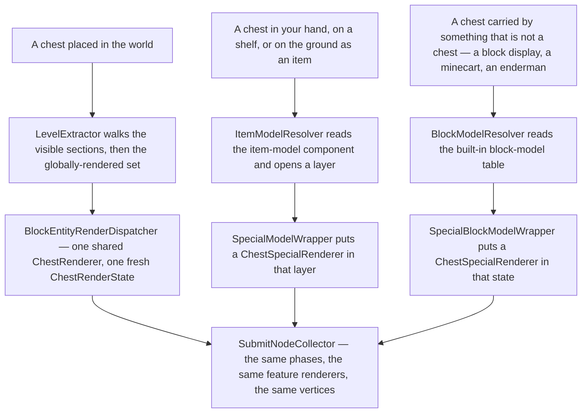
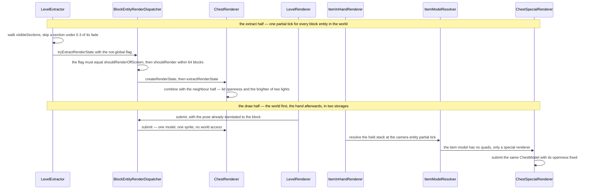

# Block-entity rendering

> Verified against **Minecraft 26.2** · Part XI · a chest on the ground and a chest in your hand, drawn in the same frame by two renderers that share a model and nothing else.

You place a chest, step back, and hold a second one up in front of your face.
Both are chests, both are lit, both open the same lid on the same hinge — and
almost nothing about how they got onto the screen is shared. The one on the
ground is a *block entity*: the terrain mesh at its position contains no
geometry at all, and everything you can see of it was extracted from the live
world by `ChestRenderer` a few microseconds ago. The one in your hand is an
*item*: it has no block entity, no render state and no extract stage, and it
is drawn by a class in a different package that exists only because an item
cannot be a block entity. The seam shows if you type */tick freeze*. The chest
on the ground is nailed to its last tick; the chest in your hand keeps
swaying with your view bob, because the two are drawn at **different partial
ticks** and only one of them respects the freeze.

This page is the sibling of [entity rendering](entity-rendering.md), and does
not re-teach it. Extract, submit, prepare, execute; render states that hold no
live object; `SubmitNodeCollector` and the fifteen phases behind it — all of
that is that page's, and all of it is true here. What follows is only the
differences, and they are larger than the shared machinery suggests.

## The cast

| class | what it decides | thread |
|---|---|---|
| `LevelExtractor` | which block entities are candidates at all — the two lists it walks | Render thread |
| `BlockEntityRenderDispatcher` | the renderer for a type, and the two gates every extraction passes | Render thread |
| `BlockEntityRenderer` | the geometry, and its own answers to *how far* and *off screen* | Render thread |
| `BlockEntityRenderState` | one block entity's whole frame: position, block state, type, light, break progress | a value object |
| `ClientLevel` | membership of the globally-rendered set, decided once when the block entity is added | Render thread |
| `SpecialModelRenderer` | the thirteen shapes an item model cannot express, drawn without a block entity | Render thread |
| `SpecialModelWrapper` | how an item model reaches one — the item road into `renderer/special` | Render thread |
| `BuiltInBlockModels` | how a *block state* reaches one, in a model table terrain never reads | a worker thread, on every resource reload |

## Three roads to the same collector

Two of the three roads end in `renderer/special`, and that is the package's
whole reason to exist: a chest that is not a block entity still has to look
like a chest. Only the left-hand road has a visibility policy of its own, a
state class of its own, or an extract stage that reads the live world.

| | entity | block entity | special model |
|---|---|---|---|
| what is walked | the level's renderable entities | the visible sections' meshes, then a global set | nothing — it is reached from a model |
| the visibility test | a frustum, plus a size-scaled distance | the *section* is visible, then a per-renderer radius | whatever drew the thing holding it |
| the stages | extract, finalize, submit | extract, submit | resolve and submit, in one call |
| the state | an `EntityRenderState` subclass | a `BlockEntityRenderState` subclass | a layer of an `ItemStackRenderState` |
| the partial tick | one computed per entity | one for every block entity in the world | the camera entity's |
| where the pose comes from | the dispatcher, from the state's position | `LevelRenderer`, translated to the block | the item transform for the display context |
| how many | one renderer per entity type | 24 renderer classes, 26 of the 49 types | 13 renderers under 13 ids |

## The chest, both halves, one frame

The two halves of the figure are not two stages of one pipeline. The world's
block entities go through `LevelRenderer.submitFeatures` into the frame
graph. The held chest goes into [the hand's own submit
storage](the-frame.md#the-wall-and-the-one-level-at-which-it-is-real),
drained after the whole world is already on the screen. They never share a
submit node.

## The chest's block model is empty, and there are two tables of them

Open *blockstates/chest.json* and it names one model for every state. Open
that model and it declares a particle texture and no elements. So when
`SectionCompiler` walks the section and tesselates every block whose render
shape is *MODEL*, the chest contributes exactly zero quads to the terrain
mesh — and, in the same pass, adds itself to the section's list of block
entities. Everything you see of a placed chest is drawn one stage later, by a
renderer, from a snapshot.

That is what a block entity renderer is *for*: the shapes that a cuboid model
cannot express, and the state that a block state cannot hold. Only 26 of the
49 entries in `BlockEntityTypes` have a renderer registered in
`BlockEntityRenderers`, and the other 23 — furnaces, hoppers, barrels,
beehives — are drawn entirely by their block models, like any other block.
Having a block entity does not make a block interesting to look at.

There are **two** baked block-model tables, and confusing them is easy.
`ModelManager.getBlockStateModelSet` is the one built from the resource
packs, and it is the one `SectionCompiler` reads: a chest is empty in it.
`ModelManager.getBlockModelSet` is built on top of that one and merged with
`BuiltInBlockModels.createBlockModels`, which attaches a
`SpecialBlockModelWrapper` to every state of every chest, banner, skull,
shulker box, conduit, decorated pot, bell, enchanting table, end gateway, end
portal and copper golem statue in the game. Nothing in terrain ever reads
that table — that is the whole of the separation, and it is membership rather
than behaviour. `BlockModelResolver` is its one reader, and every caller that
reads it is an *entity* renderer: item frames, block displays, minecart
contents, the golems, the block an enderman is carrying. It reaches the
block-entity side too, as a field of `BlockEntityRendererProvider.Context` —
the record every block-entity renderer is constructed from — where nothing
reads it, because a block entity already has a renderer and does not need to
find one through a model. When an entity renderer draws a chest it gets the
quads **and** the special renderer, both, because that road draws whatever it
finds; terrain simply never asks this table, and reads `BlockStateModelSet`
instead, where the chest's entry is empty.

The reason one entry can hold quads *and* a renderer is the object the road
resolves into. `BlockModelResolver` hands the model a
`BlockModelRenderState`, which has a slot for each: a list of
`BlockStateModelPart`, a transformation, a `RenderType`, a
`SpecialModelRenderer` with a transformation of its own, and the tint layers
and light. Every `BlockModel` implementation writes into that one object, and
what comes out is submitted in one go.

Not every entry in it is a wrapped block, either. The three airs are an
`EmptyBlockModel`; wildflowers and pink petals are a `SelectBlockModel` that
branches on the display context; and the two ordinary chests are a
`ConditionalBlockModel` — the Christmas switch this page comes back to. Most
of the rest are a `CompositeBlockModel`: the block's own quads *and* the
special renderer stacked. **Five are not**, and get the renderer alone with
no quads under it — the bell, the conduit, the end gateway, the end portal
and the enchanting table, whose built-in model is `BookSpecialRenderer` and
nothing else. Put an enchanting table in a block display and you get a book
hanging in the air.

## Culling by section, not by frustum

A block entity is never frustum-tested. `LevelExtractor.extractVisibleBlockEntities`
starts from `LevelRenderer.visibleSections` — the reachability walk that
[visibility and the frame graph](visibility-and-the-frame-graph.md)
describes — and takes each section's compiled list of block entities whole.
Culling has already happened, one section at a time.

Two extra gates then apply, and both are stricter than they look. The first is
the section's own fade-in: a freshly uploaded section reports a visibility
ramping from zero to one over a duration the *chunk section fade-in time*
option sets, and `LevelExtractor` skips its block entities until that number
reaches **0.3**. Terrain fades in from the first frame, and the chests inside
it appear about a third of the way through — furniture arriving after the
room. `LevelRenderer.compileSections` zeroes the duration for a section within
about twenty-eight blocks of the camera or one that was empty before, so the
gate only bites on distant terrain, which is exactly where you would blame the
draw distance for it.

The second is a distance test with the same name as the entity one and only
half of its behaviour. `EntityRenderer.shouldRender` does a size-scaled
distance test *and* a frustum intersection. `BlockEntityRenderer.shouldRender`
keeps the distance half alone: a camera position, and whether the block's
centre is within `BlockEntityRenderer.getViewDistance`.

**Sixty-four blocks** — the default, taken by nineteen of the twenty-four
renderer classes, and it does not scale with your render distance the way
`Entity.shouldRender` does.

| renderer | how far | why |
|---|---|---|
| the other nineteen | 64 | the interface default |
| `PistonHeadRenderer` | 68 | a moving block starts outside the block it is drawn from |
| `BlockEntityWithBoundingBoxRenderer` | 96 | the structure block's outline is a build tool — and its extraction sets a visibility flag from `Player.canUseGameMasterBlocks` or spectator mode, so it is the one renderer in the package whose output depends on your permissions |
| `TheEndGatewayRenderer` | 256 | the beam is the thing you are looking for |
| `BeaconRenderer` | the render distance in blocks | and measured **horizontally only** |
| `TestInstanceRenderer` | the larger of its two delegates | it wraps a beacon and a bounding box |

The beacon is the interesting row twice over. Its `BlockEntityRenderer.shouldRender` flattens both
positions onto the horizontal plane before comparing, so altitude never costs
you the beam — you can be at build height above a beacon at bedrock and still
see it. And its extraction scales the beam's radius by the horizontal distance
divided by 96, floored at one, so **the beam gets visibly wider the further
away you stand**, which is why a distant beacon does not thin into nothing.
Raising a spyglass resets the scale to one, because `BeaconRenderer` checks
whether the local player is scoping. The topmost beam segment is drawn to
`BeaconRenderer.MAX_RENDER_Y`, 2048 blocks above the block.

### Off screen means off *this* list

`BlockEntityRenderer.shouldRenderOffScreen` is not an extra permission — it is
a switch between two mutually exclusive lists, and it is enforced twice.
`ClientLevel.onBlockEntityAdded` puts a block entity into
`ClientLevel.getGloballyRenderedBlockEntities` only if its renderer says yes,
and `BlockEntityRenderDispatcher.tryExtractRenderState` throws the extraction
away unless the flag it was called with **equals** the renderer's answer. The
second check is what stops double-drawing: a beacon inside a visible section
is in that section's list *and* in the global set, and the equality test is
the only thing that picks one. Exactly three renderers say yes —
`BeaconRenderer`, `BlockEntityWithBoundingBoxRenderer` and
`TestInstanceRenderer`, which says yes because either of its two delegates
does.

## What a block entity's snapshot carries

`blockentity/state` holds 26 classes: the base and twenty-five subclasses. The
base is five fields wide — the position, the block state, the type, packed
light sampled from the level, and the crumbling overlay — and it is filled by
one static method, `BlockEntityRenderState.extractBase`, that every renderer
calls before adding its own. There is no `EntityRenderer.finalizeRenderState`
counterpart here: `BlockEntityRenderer` declares one extraction method, not
two, so nothing reaches back into the world after the snapshot is taken.

The crumbling overlay is the fifth field and the only one built outside the
renderer. `LevelExtractor` looks the block position up in
`ClientLevel.destructionProgress`, takes the *last* entry of the sorted set —
`BlockDestructionProgress` orders on the stage first and the digger's entity
id only to break a tie, so two players on one block show whichever crack is
further along — and wraps that stage and a pose into a
`ModelFeatureRenderer.CrumblingOverlay`. This is the only place
in the game a non-null one is made, which is why [a mob is never
crumbled](entity-rendering.md#why-the-zombie-is-animated-more-than-once) and
a chest being mined is. The global list is extracted with a null overlay
outright, so a beacon someone is breaking shows no cracks.

Twenty-five subclasses, twenty-six classes: `BedRenderState` is reachable from
nothing in the game. There is no bed block entity in `BlockEntityTypes` and no
bed renderer, and a corpus-wide search for the name finds only its own file.
It is the only orphan in the package.

Five states carry another pipeline's snapshot inside them, which is where the
machines actually touch — and **two** of the five carry an *entity* state, not
an item one. `SpawnerRenderState.displayEntity` is a whole
`EntityRenderState`, extracted through `EntityRenderDispatcher` from a display
entity the spawner creates client-side — a mob that `LevelExtractor` never
sees, never frustum-tests, and whose light the spawner overwrites with the
block's. `VaultRenderState.displayItem` reads like the item cases and is not
one: it is an `ItemClusterRenderState`, which extends `EntityRenderState`, and
the vault submits it through `ItemEntityRenderer` — the same renderer that
draws a dropped item lying on the ground. The three genuine item carriers are
`ShelfRenderState.items`, an array of three `ItemStackRenderState` that reaches
`ChestSpecialRenderer` from inside a block-entity render state, and
`CampfireRenderState.items` and `BrushableBlockRenderState.itemState` for what
is cooking and what is buried.

One live handle survives into a snapshot, and it is not unique to this side:
`MovingBlockRenderState` is a one-block fake world that holds the level's
`MovingBlockRenderState.lightEngine` and `MovingBlockRenderState.cardinalLighting`
by reference, so a moving block is lit at *prepare* time rather than at
extract. `PistonHeadRenderState` carries up to two of them, and the entity
side's `FallingBlockRenderState` carries one.

Signs are the other partial exception. `SignRenderState` stores the two
`SignText` objects rather than laid-out glyphs, and `AbstractSignRenderer`
calls `Font.split` during **submit** — the line wrapping of a sign happens a
stage later than everything else in the frame.

## One partial tick for the whole world

This is the difference a player can see. [Six partial ticks are in play in
one frame](the-frame.md#update-and-extract-six-clocks-in-one-frame), and
block entities take the row that has no exception in it. The entity side is
asked per entity, `TickRateManager.isEntityFrozen` at a time, so a mob exempt
from a freeze keeps interpolating while its neighbours stop. Block entities
get no such question: they all receive the single
`DeltaTracker.getGameTimeDeltaPartialTick` value the world got, which returns
exactly 1.0 while the game is frozen. Every block entity in the world is
therefore pinned to its last completed tick, with no per-block exemption
anywhere in the path.

The held chest is a third answer again, off
`Camera.getCameraEntityPartialTicks` — and the frozen check never freezes a
`Player`, so under */tick freeze* the item in your hand is redrawn from a
live partial tick while every chest lid in the world is stopped dead. Three
things drawn in one frame from three different clocks, and the only reason
they disagree is which question each one was allowed to ask.

The same split shows up in the Christmas textures, which the game implements
three times. `ChestRenderer` reads `SpecialDates.isExtendedChristmas` **once,
in its constructor**, and its constructor runs only when
`BlockEntityRenderDispatcher.onResourceManagerReload` rebuilds every renderer
— so a placed chest that was ordinary at 23:59 on the 23rd stays ordinary
until the next resource reload. The item model in *items/chest.json* selects on
the *minecraft:local_time* property, whose `LocalTime` implementation re-checks
the clock at most once a second. And the built-in block model wraps its two
chests in a `ConditionalBlockModel` whose `IsXmas` property calls the same
static method live, every time the model is resolved. Two of the three notice
midnight almost at once. The one you are standing in front of does not.

## Where `renderer/special` borrows its geometry

`SpecialModelRenderers.bootstrap` registers thirteen renderers under thirteen
ids, dispatched by a codec, and the package holds exactly thirteen renderer
classes to match. Nine of them implement `NoDataSpecialModelRenderer` and read
nothing at all from the stack; the other four — banner, decorated pot, player
head and shield — pull one component out of it through
`SpecialModelRenderer.extractArgument`, which is the closest thing this road
has to an extract stage.

Eleven of the thirteen reach into `client/renderer/blockentity` for their
geometry. Three hold an instance of the block-entity renderer outright
(`BannerSpecialRenderer`, `DecoratedPotSpecialRenderer`,
`ShulkerBoxSpecialRenderer`); the rest call a static submit or name a static
texture or model layer on one — `SkullBlockRenderer.submitSkull`,
`AbstractEndPortalRenderer.submitSpecial`, `BannerRenderer.submitPatterns`,
`ChestRenderer.LAYERS`. Only `TridentSpecialRenderer` and
`CopperGolemStatueSpecialRenderer` stand alone. The chest in your hand really
is the same `ChestModel`, baked from the same `ModelLayerLocation`, posed at a
fixed openness instead of an interpolated one.

Beyond the two named here, the twenty-four renderer classes are a family and
this page teaches the shape rather than the instances: each is one
`BlockEntityRenderer.extractRenderState` and one `BlockEntityRenderer.submit`,
and the interesting ones differ only in the six ways the table above records. The shared piece worth naming is
`WallAndGroundTransformations`, which is how a skull, a banner or a sign
answers *am I on the floor or on a wall* — one transformation per
`Direction` for the wall case and an array indexed by rotation segment for
the free-standing one, built once in the renderer's constructor rather than
per frame.

### How an empty item model turns into a chest

Reaching a special renderer from an item is one indirection: `SpecialModelWrapper` is an
`ItemModel` like any other, and its baked form puts the renderer into a layer
of the `ItemStackRenderState` through
`ItemStackRenderState.LayerRenderState.setupSpecialModel`. A layer either has
quads or has a special renderer, never both, and the layer's submit picks
whichever it has. That is the entire mechanism by which an empty item model
turns into a chest.

> **For a 1.21-era reader.** `BlockEntityRenderer` has no *render* method
> either: the pair is `BlockEntityRenderer.extractRenderState` and
> `BlockEntityRenderer.submit`, and `blockentity/state` is a package that did
> not exist. Three names to stop hunting for: *getRenderBoundingBox*, absent
> from the corpus entirely, because visibility is the section's business now
> plus the radius in `BlockEntityRenderer.getViewDistance`, *BedRenderer*, and
> every *renderItem* on a block-entity class — an item held by a block entity
> now goes through `ItemModelResolver` into an `ItemStackRenderState` like any
> other. `BlockEntityRenderer.shouldRenderOffScreen` survives with its meaning
> narrowed to *which of two lists*, `BlockEntityRenderers` still registers by
> `BlockEntityType`, and the fifteen submit phases these renderers land in are
> shared with entities.

## Where to look

`BlockEntityRenderDispatcher.tryExtractRenderState` first — it is twenty-one
lines and it contains both visibility gates. Then
`LevelExtractor.extractVisibleBlockEntities` for the two lists it is called
from, and `ChestRenderer` as the clearest renderer in the package, since it is
the one with a counterpart in `renderer/special` to compare against. For the
other road, `SpecialModelWrapper` and `ItemStackRenderState.LayerRenderState`,
then `BuiltInBlockModels` for the block-state road nobody expects to exist.
[Submit phases and feature renderers](../../reference/submit-phases.md) is the
catalogue everything here submits into.

---

*Rules: names, never code · how the system works, not how the code reads ·
newest version only · every backticked name passes `tools/verify_names.py`.*
