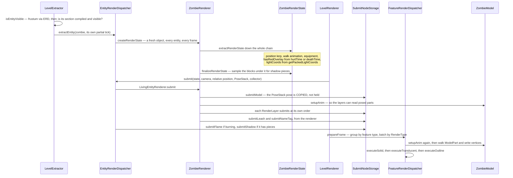

# Entity rendering

> Verified against **Minecraft 26.2** · Part XI · a zombie is drawn: extract, submit, prepare, execute.

## Responsibility

Everything in the world that is not terrain: mobs, players, items on the
ground, block entities, name tags, shadows, the flame overlay. This page
is the three-stage pipeline they all go through, and the model and layer
machinery that produces their geometry.

The one sentence a player would recognise: *a zombie walks toward you and
flashes red when you hit it.*

The headline for a 1.21-era reader: **`EntityRenderer` has no *render*
method.** Nor does anything else here. The pair is
`EntityRenderer.extractRenderState` — which reads the live entity — and
`EntityRenderer.submit`, which describes what should be drawn without
touching a vertex. *MultiBufferSource* does not exist anywhere in the
game. Vertices are written a stage later, by a *feature renderer*.

## The data it owns

### Dispatch

- **`EntityRenderDispatcher`** — one `EntityRenderer` per `EntityType`,
  looked up by `EntityRenderDispatcher.getRenderer`. Its two verbs are
  `EntityRenderDispatcher.extractEntity` and
  `EntityRenderDispatcher.submit`, with
  `EntityRenderDispatcher.prepare` setting the camera for the frame.
  Renderers come from the factory table `EntityRenderers` through an
  `EntityRendererProvider.Context`. It also owns
  `EntityRenderDispatcher.getPackedLightCoords`, which is where an
  entity's light actually comes from — and which returns full brightness
  for a burning entity.
- **`BlockEntityRenderDispatcher`** — the same shape, with
  `BlockEntityRenderDispatcher.tryExtractRenderState` and
  `BlockEntityRenderDispatcher.submit`, and
  `BlockEntityRenderer.shouldRenderOffScreen` deciding which of the two
  gathering paths a block entity may arrive on. Its renderers each have
  their own `BlockEntityRenderer.getViewDistance`.

### Render states

Every entity produces a fresh, allocation-per-frame value object.
`EntityRenderState` holds position, `EntityRenderState.ageInTicks`,
`EntityRenderState.lightCoords`, `EntityRenderState.outlineColor`,
`EntityRenderState.nameTag`, `EntityRenderState.leashStates` and
`EntityRenderState.shadowPieces`. `LivingEntityRenderState` adds
rotations, `LivingEntityRenderState.walkAnimationPos`,
`LivingEntityRenderState.deathTime`, `LivingEntityRenderState.isBaby`
and `LivingEntityRenderState.hasRedOverlay`. `ArmedEntityRenderState`
adds the hands, `HumanoidRenderState` the pose and equipment, then
`UndeadRenderState`, then `ZombieRenderState` with its two flags. The
player's is `AvatarRenderState`.

Nothing in these classes holds an `Entity` or a `Level` — verified across
all of them. The one thing that looks live — an `AnimationState` on the
eleven states that have one — is a single-int tick counter copied by
value, not a handle.

### Renderers, models and layers

`EntityRenderer` → `LivingEntityRenderer` → `MobRenderer` →
`AgeableMobRenderer` → `HumanoidMobRenderer` → `AbstractZombieRenderer`
→ `ZombieRenderer`. Players are served by `AvatarRenderer`, keyed by
skin model rather than by entity type.

Geometry is `Model` → `EntityModel` → `HumanoidModel`, built from
`ModelPart`s. A model is baked once from a `LayerDefinition` /
`MeshDefinition` / `PartDefinition` tree named by a `ModelLayerLocation`
in `ModelLayers` and held in an `EntityModelSet`; `LayerDefinitions` is
the single static table that builds every one of them, out of the
`CubeListBuilder` / `CubeDefinition` / `CubeDeformation` / `PartPose`
vocabulary. Posing is `Model.setupAnim`, either hand-written or driven by
an `AnimationDefinition` of `Keyframe`s through `KeyframeAnimation`,
whose channels interpolate linearly or along a Catmull–Rom spline.

Extras hang off `RenderLayer` — `HumanoidArmorLayer`, `ItemInHandLayer`,
`CustomHeadLayer`, `WingsLayer`, `EyesLayer`, `CapeLayer` and forty-odd
more — each contributing through `RenderLayer.submit`. Armour and trims
funnel through `EquipmentLayerRenderer`, and a renderer holds a whole
`ArmorModelSet` per body size rather than a single armour model.

### The submit layer

`SubmitNodeCollector` is the description API: `OrderedSubmitNodeCollector.submitModel`,
`.submitItem`, `.submitText`, `.submitNameTag`, `.submitShadow`,
`.submitFlame`, `.submitLeash`, `.submitBlockModel`, `.submitCustomGeometry`,
plus `SubmitNodeCollector.order` to pick a draw-order bucket.
`SubmitNodeStorage` collects those into a `SubmitNodeCollection` per
order, each holding fifteen named phases —
`SubmitNodeCollection.solid`, `.shadows`, `.nameTags`,
`.seeThroughNameTags`, `.texts`, `.shapeOutlines`,
`.translucentBlocksAndItems`, `.translucentModels`,
`.translucentCustomGeometry`, `.gizmos`, `.breakingOverlay`,
`.waterMask`, `.afterTerrain`, `.alwaysOnTop` and `.outline`.

`FeatureRenderDispatcher` turns that into draws:
`FeatureRenderDispatcher.prepareFrame` sorts and batches every submit,
then `FeatureRenderDispatcher.PreparedFrame.executeSolid`,
`.executeTranslucent`, `.executeOutline` and
`.executeTranslucentAfterTerrain` are called from the frame graph's main
pass, while `.executeAlwaysOnTop` runs in a later pass of its own that
clears depth first. Thirteen concrete feature renderers do the writing —
`ModelFeatureRenderer` for model trees, plus `ShadowFeatureRenderer`,
`FlameFeatureRenderer`, `LeashFeatureRenderer`, `NameTagFeatureRenderer`,
`TextFeatureRenderer`, `ItemFeatureRenderer`, `BlockModelFeatureRenderer`,
`MovingBlockFeatureRenderer`, `ShapeOutlineFeatureRenderer`,
`GizmoFeatureRenderer`, `QuadParticleFeatureRenderer` and
`CustomFeatureRenderer`. That list is the answer to "what can be drawn in
a level".

## When it runs

All on the client thread, inside one `Minecraft.renderFrame` — but the
code is already split as though it were not. The extract half touches
live entities; the submit half touches only value snapshots, with a few
deliberate exceptions that reach `Minecraft` for a font or a skin cache.

- **Extract** — `LevelExtractor.extractVisibleEntities` walks
  `ClientLevel.entitiesForRendering`, culls with
  `LevelExtractor.isEntityVisible`, and calls
  `EntityRenderDispatcher.extractEntity`, which allocates and fills a
  render state and then `EntityRenderer.finalizeRenderState` samples the
  shadow from the world.
- **Submit** — `LevelRenderer.submitEntities` walks the states and calls
  `EntityRenderDispatcher.submit` with a shared `PoseStack`.
- **Prepare** — `FeatureRenderDispatcher.prepareFrame` groups submits,
  and `ModelFeatureRenderer` builds the vertices.
- **Execute** — the frame graph's main pass issues the draws.

## The trace: a zombie is drawn

The zombie is animated **at least twice** per frame. Once during submit —
but only because it has layers, and `ItemInHandLayer`, `CustomHeadLayer`
and half a dozen others need posed `ModelPart`s to hang things off — and
once again per model submission at geometry time. A glowing zombie is
animated three times, because the outline is a second submission of the
same model; one inside a block-breaking overlay, four. That is only sound
because `Model.setupAnim` **resets every part to its baked pose first**,
so each call is idempotent from a known base — not because the model is
stateless, which it is not.

And the red flash is not a colour. `LivingEntity.hurtTime` — or
`LivingEntity.deathTime` — becomes
`LivingEntityRenderState.hasRedOverlay` at extract;
`LivingEntityRenderer.getOverlayCoords` packs it into an `OverlayTexture`
coordinate alongside the separate white-flash axis that creepers and the
wither use; that packed integer rides through the submit node and lands
as a per-vertex attribute.

## Interfaces

- **Called by:** `LevelExtractor` and `LevelRenderer` — see
  [level rendering](level-rendering.md).
- **Calls into:** `EntityModelSet` and the model tree;
  `ItemModelResolver` and `ItemStackRenderState` for held and worn items
  (see [models and atlases](models-and-atlases.md)); [blaze3d](blaze3d.md)
  for the draws.
- **Crosses the network as:** nothing directly — everything drawn here
  is read from entities the server described, as in
  [what the client is told](../networking/what-the-client-is-told.md) and
  [synched entity data](../entities/synched-entity-data.md).
- **Data-driven by:** entity textures and equipment assets from resource
  packs, via `EquipmentAssetManager` and `EquipmentClientInfo`; player
  skins fetched and cached by `SkinManager`, `SkinTextureDownloader` and
  `PlayerSkinRenderCache`, with `DefaultPlayerSkin` as the fallback.

## Invariants and surprises

- **Renderers and models are shared and mutable; render states are not.**
  One `ZombieRenderer` serves every zombie — though it holds an adult and
  a baby model, and two baked armour sets. Safety comes entirely from the
  fresh per-entity state and from replaying the animation at draw time.
- **Visibility is two tests in two places.** The frustum test is
  `EntityRenderer.shouldRender`; the "is the section it stands in
  actually compiled and visible" test is `LevelExtractor`'s, and there is
  a separate threshold a section must pass before its block entities
  count at all. Two entities escape the frustum entirely: anything
  indirectly carrying the local player, and the four renderers that
  declare themselves unaffected by culling.
- **Shadows are sampled from the world during extract, and never past
  sixteen blocks.** The renderer walks the blocks under the entity,
  computes each piece's alpha, and stores shapes and alphas in the render
  state; the feature renderer only turns those into quads. The strength
  falls to nothing at sixteen blocks, so a distant mob has no shadow at
  any settings. Invisible entities skip it entirely.
- **Avatars get their shadow at a different origin.** The crouch offset
  is removed before the shadow is submitted for a player and after it for
  everything else — which is what stops a sneaking player's shadow
  sinking into the ground.
- **`SubmitNodeCollector.order` is a global key, not a per-entity one.**
  Order one means "after every entity's order-zero body in the whole
  world", not "after this entity's body". That is how the eyes layer, the
  armour layers and the glint stack correctly across a crowd — armour
  claims consecutive orders as it goes, so a dyed, enchanted, trimmed
  helmet occupies three. Exactly one layer in the game asks for a
  negative order, to get underneath everything.
- **Batching is by feature type, then by `RenderType`, and translucency
  opts out of reordering rather than of merging.** All zombies collapse
  into one draw. A translucent phase marks its group strictly ordered,
  which stops a submit merging backwards into a non-consecutive earlier
  draw — consecutive same-type submits still merge, unless the render
  type itself forbids it.
- **The pose stack is transient, and half of it is dropped.** A submit
  copies the current pose; nothing downstream ever sees the stack. Models,
  items and block models copy the full pose; shadows, name tags, text and
  leashes copy only the 4×4, so no normal matrix crosses. A leaked push
  is fatal, but the check is at the end of the *submit phase*, on a local
  stack — not at the end of the frame.
- **Player renderers are keyed by skin model, not entity type.** The type
  map has no entry for the player — nor for the mannequin; the dispatcher
  keeps two separate maps of `AvatarRenderer`s keyed by wide-or-slim and
  falls back to wide.
- **Block entities take the same three stages but a stricter visibility
  rule.** A block entity is extracted from the visible-section walk *or*
  from the globally-rendered list, never both — the check is an exact
  match against `BlockEntityRenderer.shouldRenderOffScreen`, and only
  three renderers opt in. The rule is enforced twice: once when the
  block entity is added to the level, once when its state is extracted.
- **`AgeableMobRenderer` is deprecated, and it is not the base of every
  humanoid.** It is the base of `HumanoidMobRenderer` and so of the
  zombie, skeleton and piglin families — but the enderman and the giant
  extend `MobRenderer` directly, and the armour stand and the avatar
  extend `LivingEntityRenderer`, all four while using humanoid models.
- **Hitboxes left the renderer.** F3+B is a debug-entry toggle read by a
  separate debug renderer that emits gizmo primitives; the old hitbox
  render state record is dead code with exactly two references, both
  inside its own file. It is also suppressed under reduced debug info.
- **The first-person hand is a second pipeline, not part of this one.**
  `ItemInHandRenderer` submits into its own `SubmitNodeStorage` and is
  drawn by `FeatureRenderDispatcher.renderAllFeatures`, outside the frame
  graph entirely — see [the frame](the-frame.md).
- **Names a 1.21-era reader will hunt for and not find:**
  *PlayerRenderer* (now `AvatarRenderer`, serving both players and
  mannequins), every *render* method on `EntityRenderer` and `RenderLayer`
  (now *submit*), *MultiBufferSource* and every buffer source,
  *EntityRenderDispatcher.renderHitbox* and *renderLeash*,
  *LivingEntityRenderer.getBob*, *MobRenderer.prepareMobModel*,
  *RenderType.entityCutoutNoCull* (the polarity flipped — the culled
  variant is now the one that says so), *ItemBlockRenderTypes* and
  *ElytraLayer* (now `WingsLayer`). `RenderLayerParent` survives in name
  only: it is now a single-method interface, and the texture lookup that
  used to live on it is gone. `PoseStack` and `ModelPart` are unchanged.

## Where to look

`EntityRenderDispatcher.extractEntity` and
`EntityRenderer.extractRenderState` for the first stage,
`LivingEntityRenderer.submit` for the second — it is the clearest single
method in the part. Then `SubmitNodeCollection` for the phase list and
`ModelFeatureRenderer` for where vertices are finally written.
`ModelLayers` and `LayerDefinitions` for how a model is described.

---

*Rules: names, never code · how the system works, not how the code reads ·
newest version only · every backticked name passes `tools/verify_names.py`.*
