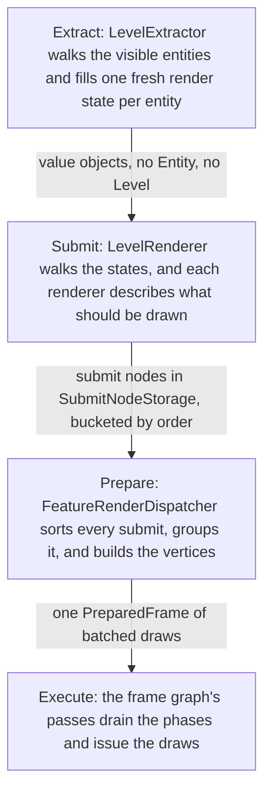
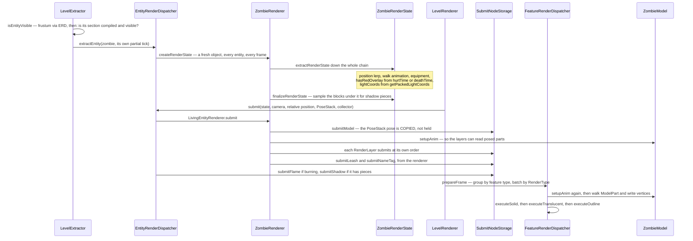

# Entity rendering

> Verified against **Minecraft 26.2** · Part XI · a zombie is drawn: extract, submit, prepare, execute.

A zombie shuffles out of the dark towards you, you hit it, and for a moment it
flashes red. Between that zombie and those pixels stand four stages that never
share an object: the live mob is read into a fresh value object, the value
object is described as things that *ought* to be drawn, the descriptions are
sorted and batched, and only then does anything write a vertex. Which is why
`EntityRenderer` has no *render* method — nothing on this page draws anything
— and why the zombie is posed **at least twice** in the frame you are looking
at, three times if it is glowing and four if you are mining through it, an
arrangement that is only sound because `Model.setupAnim` resets every part to
its baked pose before it starts.

All four stages are one thread, inside one `Minecraft.renderFrame`. The split
is a discipline, not a threading boundary: the first stage touches live
entities, the other three only snapshots. Nothing here reads the network —
everything drawn is a redrawing of what the server already told the client
([what the client is told](../networking/what-the-client-is-told.md),
[synched entity data](../entities/synched-entity-data.md)).

## The cast

| class | what it decides | thread |
|---|---|---|
| `LevelExtractor` | which entities are visible at all, and when their states are built | Render thread |
| `EntityRenderDispatcher` | which `EntityRenderer` an entity gets, and what light it is lit by | Render thread |
| `EntityRenderer` | what goes into the render state, and what gets submitted — it never draws | Render thread |
| `EntityRenderState` | one entity's whole frame, copied by value, holding no `Entity` and no `Level` | a value object |
| `RenderLayer` | the extras — armour, held items, eyes, capes — each submitting at its own order | Render thread |
| `SubmitNodeStorage` | the submit nodes, bucketed by a global draw order | Render thread |
| `FeatureRenderDispatcher` | the grouping, the batching, and where the vertices are finally written | Render thread |
| `ModelFeatureRenderer` | the one feature renderer that walks a `ModelPart` tree | Render thread |

## Four stages that never share an object

The worked instance is one zombie going through all four.

## Extract: the live entity becomes a snapshot

**In:** `ClientLevel.entitiesForRendering`, and a frustum.
**Out:** one freshly allocated render state per surviving entity.
**Decided:** visibility, and everything the other three stages will ever know.

`LevelExtractor.extractVisibleEntities` walks the level's entity list, drops
what `LevelExtractor.isEntityVisible` rejects, and hands each survivor to
`EntityRenderDispatcher.extractEntity`. That call finds the renderer for the
entity's `EntityType` through `EntityRenderDispatcher.getRenderer`, allocates
a state with `EntityRenderer.createRenderState`, fills it by running
`EntityRenderer.extractRenderState` down the whole inheritance chain, and then
lets `EntityRenderer.finalizeRenderState` reach into the world one last time
to sample the shadow.

Visibility is **two tests in two places**. The frustum test is
`EntityRenderer.shouldRender`, on the renderer; the "is the section this entity
stands in actually compiled and visible" test belongs to `LevelExtractor`, and
block entities must additionally clear a separate section threshold to count at
all. Two things escape the frustum entirely: anything indirectly carrying the
local player, and the four renderers that declare themselves unculled.

Light is not read at draw time. It comes from
`EntityRenderDispatcher.getPackedLightCoords` during extract, and that method
returns full brightness for a burning entity. Shadows are sampled here too,
and never past sixteen blocks: the renderer walks the blocks under the entity,
computes an alpha for each, and stores the shapes and alphas in the state, so
that the feature renderer three stages later only has to turn them into quads.
The strength falls to nothing at sixteen blocks, so a distant mob has no
shadow at any settings, and an invisible entity skips the sampling entirely.

### The ladder of render states

<figure class="map">
{{#include ../../generated/tree-EntityRenderState.svg}}
<figcaption>Every render state in the game, by depth. Click to enlarge.</figcaption>
</figure>

The tree is a ladder, each rung adding what the rung below could not assume.
`EntityRenderState` is the floor: position, `EntityRenderState.ageInTicks`,
`EntityRenderState.lightCoords`, `EntityRenderState.outlineColor`,
`EntityRenderState.nameTag`, `EntityRenderState.leashStates` and
`EntityRenderState.shadowPieces` — as true of a dropped item as of a wither.
`LivingEntityRenderState` adds rotations,
`LivingEntityRenderState.walkAnimationPos`,
`LivingEntityRenderState.deathTime`, `LivingEntityRenderState.isBaby` and
`LivingEntityRenderState.hasRedOverlay`. `ArmedEntityRenderState` adds hands,
`HumanoidRenderState` a pose and equipment, `UndeadRenderState` what the undead
share, `ZombieRenderState` two flags of its own. The player sits off the ladder
in `AvatarRenderState`.

Nothing in any of them holds an `Entity` or a `Level` — verified across every
class in the tree. The one member that looks live, an `AnimationState` on the
eleven states that carry one, is a single-int tick counter copied by value,
not a handle back into the world.

### The red flash is not a colour

It starts as `LivingEntity.hurtTime` — or `LivingEntity.deathTime` — and
becomes the boolean `LivingEntityRenderState.hasRedOverlay` here, at extract.
At submit, `LivingEntityRenderer.getOverlayCoords` packs that boolean into an
`OverlayTexture` coordinate alongside a separate white-flash axis, the one
creepers and the wither use. That packed integer rides through the submit node
untouched and lands, at execute, as a **per-vertex attribute**. Nothing along
the way is ever tinted red.

## Submit: describing a draw without making one

**In:** the render states, the camera, and a shared `PoseStack`.
**Out:** submit nodes in `SubmitNodeStorage`, bucketed by order.
**Decided:** what should be drawn, and where in the world's draw order.

`LevelRenderer.submitEntities` walks the states and calls
`EntityRenderDispatcher.submit` for each, after
`EntityRenderDispatcher.prepare` has set the camera for the frame.
`LivingEntityRenderer.submit` then poses the model, describes the body, and
lets every `RenderLayer` describe its own extra through `RenderLayer.submit`.

The description API is `SubmitNodeCollector` and its ordered form:
`OrderedSubmitNodeCollector.submitModel`, `.submitItem`, `.submitText`,
`.submitNameTag`, `.submitShadow`, `.submitFlame`, `.submitLeash`,
`.submitBlockModel` and `.submitCustomGeometry`, plus
`SubmitNodeCollector.order` to choose a bucket. `SubmitNodeStorage` keeps one
`SubmitNodeCollection` per order, and each collection files what it is given
into one of fifteen named phases — `SubmitNodeCollection.solid`,
`.translucentModels`, `.breakingOverlay`, `.outline` and eleven more, all
catalogued in [submit phases and feature
renderers](../../reference/submit-phases.md).

**`SubmitNodeCollector.order` is a global key, not a per-entity one.** Order
one means *after every entity's order-zero body in the whole world*, not
"after this entity's body". That is how the eyes layer, the armour layers and
the enchantment glint stack correctly across a crowd instead of interleaving
one mob's helmet with another's head. Armour claims consecutive orders as it
goes, so a dyed, enchanted, trimmed helmet occupies three, and exactly one
layer in the game asks for a **negative** order, to get underneath everything.

The pose stack is transient, and half of it is dropped. A submit *copies* the
current pose; nothing downstream ever sees the stack. Models, items and block
models copy the full pose, while shadows, name tags, text and leashes copy
only the 4×4, so no normal matrix crosses for those. A leaked push is fatal,
but the check happens at the end of the *submit phase*, on a local stack, not
at the end of the frame. Avatars differ in one small way: the crouch offset is
removed *before* the shadow is submitted for a player and *after* it for
everything else, which stops a sneaking player's shadow sinking into the
ground.

### The renderers and models being described

Renderers and models are **shared and mutable**; render states are not. One
`ZombieRenderer` serves every zombie in the world — though it holds an adult
model, a baby model and two baked armour sets — and safety comes entirely from
the fresh per-entity state and from replaying the animation at draw time. The
chain is `EntityRenderer` → `LivingEntityRenderer` → `MobRenderer` →
`AgeableMobRenderer` → `HumanoidMobRenderer` → `AbstractZombieRenderer` →
`ZombieRenderer`. `AgeableMobRenderer` is deprecated and is not the base of
every humanoid: the enderman and the giant extend `MobRenderer` directly, the
armour stand and the avatar extend `LivingEntityRenderer`, all four while
using humanoid models. Players are served by `AvatarRenderer`, keyed by **skin
model rather than entity type** — the type map has no entry for the player or
the mannequin, and the dispatcher keeps two avatar maps, wide and slim,
falling back to wide.

Geometry is `Model` → `EntityModel` → `HumanoidModel`, built out of
`ModelPart`s. A model is baked once from a `LayerDefinition` /
`MeshDefinition` / `PartDefinition` tree named by a `ModelLayerLocation` in
`ModelLayers` and held in an `EntityModelSet`; `LayerDefinitions` is the single
static table that builds every one of them, out of the `CubeListBuilder` /
`CubeDefinition` / `CubeDeformation` / `PartPose` vocabulary. Posing is
`Model.setupAnim`, hand-written or driven by an `AnimationDefinition` of
`Keyframe`s through `KeyframeAnimation`, whose channels interpolate linearly
or along a Catmull–Rom spline.

Extras hang off `RenderLayer` — `HumanoidArmorLayer`, `ItemInHandLayer`,
`CustomHeadLayer`, `WingsLayer`, `EyesLayer`, `CapeLayer` and forty-odd more.
Armour and trims funnel through `EquipmentLayerRenderer`, dressed by
`EquipmentAssetManager` and `EquipmentClientInfo` out of the resource packs,
and a renderer holds a whole `ArmorModelSet` per body size rather than one
armour model. Player skins come by another road — `SkinManager`,
`SkinTextureDownloader`, `PlayerSkinRenderCache`, with `DefaultPlayerSkin` as
the fallback — and held or worn items through `ItemModelResolver` and
`ItemStackRenderState`, [models and atlases](models-and-atlases.md)'s business.

## Prepare: sorting, batching, and the vertices

**In:** a whole frame of submit nodes.
**Out:** a `FeatureRenderDispatcher.PreparedFrame` whose vertices already exist.
**Decided:** how few draws this can be.

`FeatureRenderDispatcher.prepareFrame` drains every phase of every order
bucket, groups the nodes, and lets the thirteen feature renderers build
geometry — `ModelFeatureRenderer` being where a `ModelPart` tree finally
becomes vertices. Batching is by feature type first, then by `RenderType`: all
the zombies in the world collapse into one draw. Translucency opts out of
*reordering* rather than of *merging* — a translucent phase marks its group
strictly ordered, which stops a submit merging backwards into a
non-consecutive earlier draw, while consecutive same-type submits still merge
unless the render type itself forbids it.

### Why the zombie is animated more than once

Once during **submit** — but only because it has layers, and
`ItemInHandLayer`, `CustomHeadLayer` and half a dozen others need posed
`ModelPart`s to hang things off. Once again, per model submission, at
**prepare** time, because the submit node carried the model and the state but
not a pose for every part. A glowing zombie is animated three times, since the
outline is a second submission of the same model into
`SubmitNodeCollection.outline`; one inside a block-breaking overlay, four.
That is only sound because `Model.setupAnim` **resets every part to its baked
pose first**, so each call is idempotent from a known base — not because the
model is stateless, which it emphatically is not.

## Execute: the frame graph pulls the trigger

**In:** the prepared frame.
**Out:** draws.
**Decided:** almost nothing — the ordering was fixed two stages ago.

`FeatureRenderDispatcher.PreparedFrame` exposes five drains. `.executeSolid`,
`.executeTranslucent`, `.executeOutline` and `.executeTranslucentAfterTerrain`
are called from the frame graph's main pass, while `.executeAlwaysOnTop` runs
in a later pass of its own that clears depth first. Where those passes sit
relative to terrain, sky and post-processing is [visibility and the frame
graph](visibility-and-the-frame-graph.md)'s subject; the draws go out through
[blaze3d](blaze3d.md).

## Three things shaped like this pipeline, that are not it

**Block entities** take the same four stages, through
`BlockEntityRenderDispatcher.tryExtractRenderState` and
`BlockEntityRenderDispatcher.submit`, under a stricter visibility rule: a
block entity is extracted from the visible-section walk *or* from the
globally-rendered list, never both. The check is an exact match against
`BlockEntityRenderer.shouldRenderOffScreen`, only three renderers opt in, and
it is enforced twice — once when the block entity is added to the level, once
when its state is extracted. Each renderer carries its own
`BlockEntityRenderer.getViewDistance`.

**The first-person hand** is a second pipeline entirely: `ItemInHandRenderer`
submits into its own `SubmitNodeStorage` and is drawn by
`FeatureRenderDispatcher.renderAllFeatures`, outside the frame graph — see
[the frame](the-frame.md).

**Hitboxes** left the renderer. F3+B is a debug-entry toggle read by a
separate debug renderer that emits gizmo primitives, suppressed under reduced
debug info, and the old hitbox render state record is dead code with exactly
two references, both inside its own file. Name tags borrow in the same way:
the submit node carries only a `Component`, and every glyph in it is resolved
by [text and fonts](../client/text-and-fonts.md), not here.

> **For a 1.21-era reader.** `EntityRenderer` has no *render* method, and
> neither does anything else on this page: the pair is
> `EntityRenderer.extractRenderState`, which reads the live entity, and
> `EntityRenderer.submit`, which describes what should be drawn without
> touching a vertex. *MultiBufferSource* does not exist anywhere in the game,
> nor any other buffer source. The rest of the names to stop hunting for:
> *PlayerRenderer* (now `AvatarRenderer`, for players and mannequins alike),
> every *render* method on `EntityRenderer` and `RenderLayer` (now *submit*),
> *EntityRenderDispatcher.renderHitbox* and *renderLeash*,
> *LivingEntityRenderer.getBob*, *MobRenderer.prepareMobModel*,
> *RenderType.entityCutoutNoCull* (the polarity flipped — the culled variant
> is now the one that says so), *ItemBlockRenderTypes*, and *ElytraLayer*
> (now `WingsLayer`). `RenderLayerParent` survives in name only: it is now a
> single-method interface, and the texture lookup that used to live on it is
> gone. `PoseStack` and `ModelPart` are unchanged.

## Where to look

`EntityRenderDispatcher.extractEntity` and `EntityRenderer.extractRenderState`
for the first stage, `LivingEntityRenderer.submit` for the second — the
clearest single method in the part. Then `SubmitNodeCollection` for the phase
list and `ModelFeatureRenderer` for where vertices are written. `ModelLayers`
and `LayerDefinitions` for how a model is described, and [submit phases and
feature renderers](../../reference/submit-phases.md) for both catalogues.

---

*Rules: names, never code · how the system works, not how the code reads ·
newest version only · every backticked name passes `tools/verify_names.py`.*
