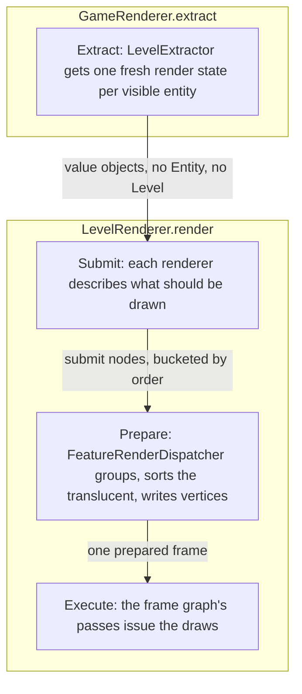
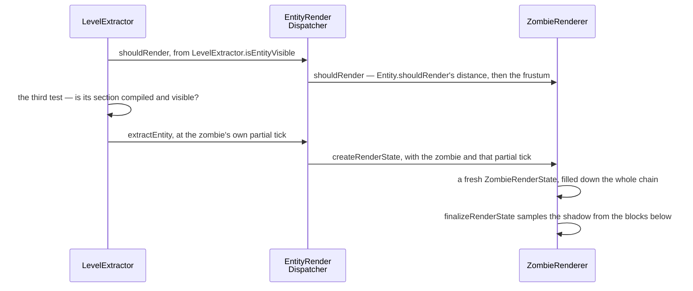
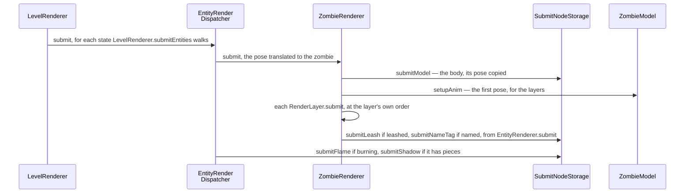
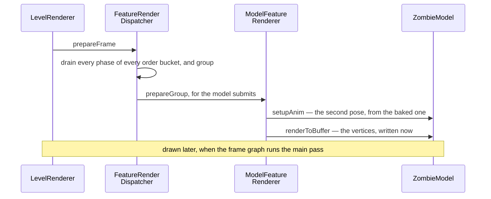

# Entity rendering

> Verified against **Minecraft 26.3** · Part XI · a zombie is drawn: extract, submit, prepare, execute.

A zombie shuffles out of the dark towards you, you hit it, and for a moment it
flashes red. Between that zombie and those pixels stand four stages, each
handing the next what the stage before made of it, never the live mob: the live mob is read
into a fresh render state, the state is described as things that *ought* to be
drawn, the descriptions are grouped and the translucent ones sorted, and only then
does anything write a vertex. Which is why `EntityRenderer` has no *render*
method — nothing on this page draws until the last stage — and why the zombie is posed **at least twice**
in the frame you are looking at, three times if it is glowing, an
arrangement that is only sound because `Model.setupAnim` resets every part to
its baked pose before it starts.

All four stages are one thread, inside one `Minecraft.renderFrame`. The split
is a discipline, not a threading boundary: the first stage touches live
entities, the other three only snapshots. Nothing here reads the network —
everything drawn is a redrawing of what the server already told the client
([what the client is told](../networking/what-the-client-is-told.md),
[synched entity data](../entities/synched-entity-data.md)).

## The cast

| class | what it decides | thread |
|---|---|---|
| `LevelExtractor` | which entities are visible at all, and when their states are built | Render thread |
| `EntityRenderDispatcher` | which `EntityRenderer` an entity gets | Render thread |
| `EntityRenderer` | what goes into the render state, and what gets submitted — it never draws | Render thread |
| `EntityRenderState` | one entity's whole frame, copied by value, holding no `Entity` and no `Level` | a value object |
| `RenderLayer` | the extras — armour, held items, eyes, capes — each submitting at its own order | Render thread |
| `SubmitNodeStorage` | the submit nodes, bucketed by a global draw order | Render thread |
| `FeatureRenderDispatcher` | the grouping, the batching, and where the vertices are finally written | Render thread |
| `ModelFeatureRenderer` | the one feature renderer that walks a `ModelPart` tree | Render thread |

## Four stages, and what each hands the next

```mermaid
flowchart TD
    subgraph EX["GameRenderer.extract"]
        E["Extract: LevelExtractor gets one fresh render state per visible entity"]
    end
    subgraph RE["LevelRenderer.render"]
        S["Submit: each renderer describes what should be drawn"]
        P["Prepare: FeatureRenderDispatcher groups, sorts the translucent, writes vertices"]
        X["Execute: the frame graph's passes issue the draws"]
    end
    E -- "value objects, no Entity, no Level" --> S
    S -- "submit nodes, bucketed by order" --> P
    P -- "one prepared frame" --> X
```

*The four stages and what each hands the next, the first inside the extract
and the other three inside the level's render. Only the box at the top reads a
live entity: everything below it works from the copy.*

The worked instance is one zombie, traced through extract, submit and prepare
in the sections below.

## Extract: the live entity becomes a snapshot

**In:** `ClientLevel.entitiesForRendering`, and a frustum.
**Out:** one freshly allocated render state per surviving entity.
**Decided:** visibility, and everything the other three stages will ever know.

`LevelExtractor.extractVisibleEntities` walks [the client level's entity
list](../client/the-client-level.md), drops what
`LevelExtractor.isEntityVisible` rejects, and hands each survivor to
`EntityRenderDispatcher.extractEntity`. That call finds the renderer for the
entity's `EntityType` through `EntityRenderDispatcher.getRenderer` — a map
the dispatcher rebuilds on every resource reload from `EntityRenderers`, the static table that
files one `EntityRendererProvider` per type and is the reason a renderer is
shared rather than per-entity — allocates a state with
`EntityRenderer.createRenderState`, fills it by running
`EntityRenderer.extractRenderState` down the whole inheritance chain, and then
lets `EntityRenderer.finalizeRenderState` reach into the world one last time
to sample the shadow.

Visibility is **three tests in two places**. `EntityRenderer.shouldRender`
runs two of them, in this order: first `Entity.shouldRender` (which is the
distance test, its limit scaling with the entity's own bounding box), and
only then the frustum. The third — "is the section this entity stands in
compiled and faded at least a third of the way in" — belongs to `LevelExtractor`, which asks `LevelRenderer`
to look the section up: a question the [reachability walk](visibility-and-the-frame-graph.md#the-walk-that-decides-what-exists-and-the-frustum-that-only-trims-it)
never answers, since an entity is not tested against its list. Block entities keep the distance half
and meet the frustum only with their section, the few drawn off screen not at all, which is [the first difference
block-entity rendering](block-entity-rendering.md#frustum-culled-by-section-not-one-by-one)
makes. Several things escape the frustum entirely: anything indirectly carrying
the local player, the three renderers that declare themselves unculled, a
`Display` that sets its own no-culling flag — `DisplayRenderer` is large for the
same reason the entity is unusual: one abstract
base carrying the interpolation and billboarding every display shares, with a
nested renderer each for a block, an item and a line of text — and, the ones
nobody expects,
an entity on the other end of a visible leash, an end crystal with a beam
target and a guardian firing one, each of which is drawn for what it is attached
to: the leash and the beam when they are in view, the crystal whenever it has a
target at all.

One zombie through this stage, from the three tests to a finished state:

```mermaid
sequenceDiagram
    participant LX as LevelExtractor
    participant ERD as EntityRender<br/>Dispatcher
    participant ZR as ZombieRenderer

    LX->>ERD: shouldRender, from LevelExtractor.isEntityVisible
    ERD->>ZR: shouldRender — Entity.shouldRender's distance, then the frustum
    LX->>LX: the third test — is its section compiled and visible?
    LX->>ERD: extractEntity, at the zombie's own partial tick
    ERD->>ZR: createRenderState, with the zombie and that partial tick
    ZR->>ZR: a fresh ZombieRenderState, filled down the whole chain
    ZR->>ZR: finalizeRenderState samples the shadow from the blocks below
```

*Extract for one zombie: two of the three visibility tests are the renderer's,
and the extractor asks the third of `LevelRenderer`. Everything after them
happens inside the renderer, which builds a new state object and fills it.*

Light is not read at draw time. It comes from
`EntityRenderer.getPackedLightCoords` during extract — the dispatcher has a
method of the same name, and nothing calls it — and
that method returns full block light for a burning entity. Shadows are sampled here too,
and never past sixteen blocks: the renderer walks the blocks under the entity,
computes an alpha for each, and stores the shapes and alphas in the state, so
that the feature renderer two stages later only has to turn them into quads.
The strength falls to nothing at sixteen blocks, so a distant mob has no
shadow at any settings, and an invisible entity skips the sampling entirely.

### The ladder of render states

<figure class="map">
{{#include ../../generated/tree-EntityRenderState.svg}}
<figcaption>Every entity render state, cut three levels down: a number counts the states below a name, a folded row the states it folds, and the zombie's last two rungs are inside HumanoidRenderState's count. Click to enlarge.</figcaption>
</figure>

The tree is a ladder, each rung adding what the rung below could not assume.
`EntityRenderState` is the floor: position, `EntityRenderState.ageInTicks`,
`EntityRenderState.lightCoords`, `EntityRenderState.outlineColor`,
`EntityRenderState.nameTag`, `EntityRenderState.leashStates` and
`EntityRenderState.shadowPieces` — as true of a dropped item as of a wither.
`LivingEntityRenderState` adds rotations,
`LivingEntityRenderState.walkAnimationPos`,
`LivingEntityRenderState.deathTime`, `LivingEntityRenderState.isBaby` and
`LivingEntityRenderState.hasRedOverlay`. `ArmedEntityRenderState` adds hands,
`HumanoidRenderState` a pose and equipment, `UndeadRenderState` one overridden rule,
which the zombies share with the illagers and not the skeletons, `ZombieRenderState` two flags of its own. The player's
`AvatarRenderState` branches off the humanoid rung beside them.

Nothing in any of them holds an `Entity` or a `Level` — verified across every
class in the tree. The one member that looks live, an `AnimationState` on the
eleven states that carry one, is a single-int tick counter copied by value,
not a handle back into the world. The one real handle is a falling block's: its
moving-block state carries the level's light engine, which lights it at prepare.

### The red flash is not a colour

It starts as `LivingEntity.hurtTime` — or `LivingEntity.deathTime` — and
becomes the boolean `LivingEntityRenderState.hasRedOverlay` here, at extract.
At submit, `LivingEntityRenderer.getOverlayCoords` packs that boolean into an
`OverlayTexture` coordinate alongside a separate white-flash axis, the one
the creeper's fuse uses — and, besides the creeper, only primed TNT, a primed TNT minecart and the sulfur cube's inner layer. The wither is not on that list: it flashes
by swapping to a second texture. That packed integer rides through the submit node
untouched and lands, at prepare, as a **per-vertex attribute**. Nothing along
the way is ever tinted red.

## Submit: describing a draw without making one

**In:** the render states, the camera, and a shared `PoseStack`.
**Out:** submit nodes in `SubmitNodeStorage`, bucketed by order.
**Decided:** what should be drawn, and where in the world's draw order.

`LevelRenderer.submitEntities` walks the states and calls
`EntityRenderDispatcher.submit` for each, after
`EntityRenderDispatcher.prepare` has set the camera for the frame.
`LivingEntityRenderer.submit` then describes the body, poses the model, and
lets every `RenderLayer` describe its own extra through `RenderLayer.submit` —
in that order, because the pose is only needed by the layers. One zombie
through this stage:

```mermaid
sequenceDiagram
    participant LR as LevelRenderer
    participant ERD as EntityRender<br/>Dispatcher
    participant ZR as ZombieRenderer
    participant SNS as SubmitNodeStorage
    participant ZM as ZombieModel

    LR->>ERD: submit, for each state LevelRenderer.submitEntities walks
    ERD->>ZR: submit, the pose translated to the zombie
    ZR->>SNS: submitModel — the body, its pose copied
    ZR->>ZM: setupAnim — the first pose, for the layers
    ZR->>ZR: each RenderLayer.submit, at the layer's own order
    ZR->>SNS: submitLeash if leashed, submitNameTag if named, from EntityRenderer.submit
    ERD->>SNS: submitFlame if burning, submitShadow if it has pieces
```

*Submit for one zombie: the body, then the one pose the layers need, then the
extras, all of it descriptions filed into `SubmitNodeStorage`. Nothing here
writes a vertex.*

The description API is `SubmitNodeCollector` and its ordered form. The
methods a renderer is likely to call are
`OrderedSubmitNodeCollector.submitModel`, `.submitItem`, `.submitText`,
`.submitNameTag`, `.submitShadow`, `.submitFlame`, `.submitLeash`,
`.submitBlockModel` and `.submitCustomGeometry`, plus
`SubmitNodeCollector.order` to choose a bucket — between them eight of the
twelve kinds of node the storage can hold, since text and name tags make the
same kind, the other four being moving blocks (a falling block's among them), shape
outlines, gizmos and particle groups, which the zombie never submits. `SubmitNodeStorage` keeps one
`SubmitNodeCollection` per order, and each collection files what it is given
into one of fifteen named phases — `SubmitNodeCollection.solid`,
`.translucentModels`, `.breakingOverlay`, `.outline` and eleven more, all
catalogued in [submit phases and feature
renderers](../../reference/submit-phases.md).

**`SubmitNodeCollector.order` is a global key, not a per-entity one.** Order
one means *after every entity's order-zero body in the whole world*, not
"after this entity's body". That is how the eyes layer, the armour layers and
the enchantment glint stack correctly across a crowd instead of interleaving
one mob's helmet with another's head. Armour claims consecutive orders as it
goes, so a dyed, enchanted, trimmed helmet occupies four — leather is the
only dyeable helmet and its equipment definition has two layers of its own —
and exactly one
layer in the game asks for a **negative** order, to get underneath
everything: `SulfurCubeInnerLayer`, which has to sit inside the shell it is
drawn with.

The pose stack is transient, and half of it is dropped. A submit *copies* the
current pose; nothing downstream ever sees the stack. Models, items, block
models, flames, shape outlines and custom geometry copy the full pose, while
shadows, name tags, text, leashes and moving blocks copy only the 4×4, so no normal matrix crosses for those. A leaked push is fatal,
but the check happens at the end of the *submit phase*, on a local stack, not
at the end of the frame. Avatars differ in one small way: the crouch offset is
removed *before* the shadow is submitted for a player and *after* it for
everything else, which stops a sneaking player's shadow sinking into the
ground.

### The renderers and models being described

Renderers and models are **shared and mutable**; render states are not. One
`ZombieRenderer` serves every zombie in the world — though it holds an adult
model, a baby model and two baked armour sets — and safety comes entirely from
the fresh per-entity state and from replaying the animation at prepare time. The
chain is `EntityRenderer` → `LivingEntityRenderer` → `MobRenderer` →
`AgeableMobRenderer` → `HumanoidMobRenderer` → `AbstractZombieRenderer` →
`ZombieRenderer`. `AgeableMobRenderer` is deprecated and is not the base of
every humanoid: the enderman and the giant extend `MobRenderer` directly, the
armour stand and the avatar extend `LivingEntityRenderer`, all four while
using humanoid models. Players are served by `AvatarRenderer`, keyed by **skin
model rather than entity type** — the type map has no entry for the player or
the mannequin, and the dispatcher keeps two avatar maps, one for players and
one for mannequins, each keyed wide and slim and falling back to wide.

Geometry is `Model` → `EntityModel` → `HumanoidModel`, built out of
`ModelPart`s. A model is baked once from a `LayerDefinition` /
`MeshDefinition` / `PartDefinition` tree named by a `ModelLayerLocation` in
`ModelLayers` and held in an `EntityModelSet`; `LayerDefinitions` is the single
static table that builds every one of them, out of the `CubeListBuilder` /
`CubeDefinition` / `CubeDeformation` / `PartPose` vocabulary. Posing is
`Model.setupAnim`, hand-written or driven by an `AnimationDefinition` of
`Keyframe`s through `KeyframeAnimation`, whose channels interpolate linearly
or along a Catmull–Rom spline.

Extras hang off `RenderLayer` — `HumanoidArmorLayer`, `ItemInHandLayer`,
`CustomHeadLayer`, `WingsLayer`, `EyesLayer`, `CapeLayer` and forty-odd more.
Armour and trims funnel through `EquipmentLayerRenderer`, dressed by
`EquipmentAssetManager` and `EquipmentClientInfo` out of the resource packs,
and a renderer holds a whole `ArmorModelSet` per body size rather than one
armour model. Held or worn items come through `ItemModelResolver` and
`ItemStackRenderState`, which [models and
atlases](models-and-atlases.md#how-an-item-picks-its-model) covers.

### A player is a skin record and seven booleans

[Player anatomy](../player/player-anatomy.md#what-player-owns) leaves the drawing
here, and the answer is that all of it becomes render state at extract like
everything else. `AvatarRenderState` carries the whole `PlayerSkin` record by
value — three textures, the arm width and the secure flag — read, for a
player, off the tab-list entry rather than off the entity, which is why a skin
change needs no entity packet; a mannequin carries its own. Beside it sit seven booleans, one per `PlayerModelPart`:
the hat, the jacket, the two sleeves, the two trouser legs and the cape, each
copied from `Avatar.isModelPartShown` once per frame, so a customisation
toggle is a part the model is told not to draw rather than a different model.
`PlayerModelType` is the arm width inside that record, and the dispatcher reads
it back out of the state at submit as the key into the players' avatar map,
whichever avatar the state came from. The textures themselves arrive by
a road of their own, `SkinManager` and `SkinTextureDownloader`, with a
`PlayerSkinRenderCache` in front for the profiles a mannequin or a head names
and `DefaultPlayerSkin` standing in until one does.

## Prepare: sorting, batching, and the vertices

**In:** a whole frame of submit nodes.
**Out:** a `FeatureRenderDispatcher.PreparedFrame` whose vertices already exist.
**Decided:** how few draws this can be.

`FeatureRenderDispatcher.prepareFrame` drains every phase of every order
bucket, groups the nodes, and lets the twelve feature renderers build
geometry — `ModelFeatureRenderer` being where a `ModelPart` tree finally
becomes vertices, as it does here for one zombie:

```mermaid
sequenceDiagram
    participant LR as LevelRenderer
    participant FRD as FeatureRender<br/>Dispatcher
    participant MFR as ModelFeature<br/>Renderer
    participant ZM as ZombieModel

    LR->>FRD: prepareFrame
    FRD->>FRD: drain every phase of every order bucket, and group
    FRD->>MFR: prepareGroup, for the model submits
    MFR->>ZM: setupAnim — the second pose, from the baked one
    MFR->>ZM: renderToBuffer — the vertices, written now
    Note over LR,ZM: drawn later, when the frame graph runs the main pass
```

*Prepare for one zombie: the model is posed a second time because its submit
carried the state but not a pose for every part. The vertices exist before
any of the frame graph's passes has run.*

The phases come in two kinds and the kind decides how hard the grouping is
allowed to try. With improved transparency off, as a new client
starts, twelve are a `SimpleFeatureRenderPhase`, which groups by feature type
and then by *batch key* — and **only two of the twelve kinds of submit have a
batch key at all**, a model and a piece of custom geometry. Everything else
keeps the order it was submitted in. Either way, a simple phase's
`RenderTypeFeatureRenderer.Group` is free to fold a node's geometry into
**any** earlier draw of the same `RenderType` rather than only the adjacent
one, which is how the zombies of the world collapse into one draw.

The other three phases are a `TranslucentFeatureRenderPhase` (with improved
transparency on, ten of the fifteen names share one simple phase, and only the
see-through phase sorts). That one keeps
every node, sorts them back to front by squared distance to the camera, and
marks the group strictly ordered — which switches off exactly one of the
group's two merges. Consecutive submits of one render type still share a
draw. What stops is the fold into a *non-adjacent* earlier draw, which is the
merge that would move geometry ahead of everything between it and its target,
and so undo the sort the phase exists for. A render type may also opt out of
both merges on its own account, through
`RenderType.canConsolidateConsecutiveGeometry`, which is how something whose
primitives are chained keeps them chained. Which three phases are the
translucent ones, and what lands in each of the fifteen, is [submit phases and
feature renderers](../../reference/submit-phases.md).

### Why the zombie is animated more than once

Once during **submit** — but only because it has layers, and
`ItemInHandLayer`, `CustomHeadLayer` and several others need posed
`ModelPart`s to hang things off. Once again, per model submission, at
**prepare** time, because the submit node carried the model and the state but
not a pose for every part. A glowing zombie is animated three times, since the
outline is a second submission of the same model into
`SubmitNodeCollection.outline`. A fourth pass exists in the machinery — the
crumbling overlay — but no entity ever reaches it: the only non-null
`ModelFeatureRenderer.CrumblingOverlay` in the game is built in
`LevelExtractor`'s *block-entity* loop, so it is a chest being mined that
gets a fourth pose, never a mob. That the repeats are sound at all is only
because `Model.setupAnim` **resets every part to its baked
pose first**, so each call is idempotent from a known base — not because the
model is stateless, which it emphatically is not.

## Execute: the frame graph pulls the trigger

**In:** the prepared frame.
**Out:** draws.
**Decided:** almost nothing — the ordering was fixed at submit and prepare.

`FeatureRenderDispatcher.PreparedFrame` exposes eight drains, each handed the
render pass to draw into, and the frame graph's main pass is where each is called:
`.executeSolid` always, `.executeOutline` when something glows,
`.executeTranslucent` and `.executeTranslucentAfterTerrain` for classic
transparency, `.executeWaterMask` and `.executeOit` for improved transparency,
and `.executeSeeThrough` and `.executeAlwaysOnTop` when something needs them.
Only the solid and classic translucent drains share the main render pass; the
others each get a render pass the main pass opens, the always-on-top one
clearing depth first. Where those passes sit
relative to terrain, sky and post-processing is the subject of [visibility and
the frame graph](visibility-and-the-frame-graph.md); the draws go out through
[blaze3d](blaze3d.md).

## What borrows this pipeline without being it

**Block entities** take the same four stages under a different visibility
policy, a different partial tick and an empty block model —
[block-entity rendering](block-entity-rendering.md) is the whole of the
difference.

**The first-person hand** is a second pipeline from submit on: its state is
extracted with the player's (`FirstPersonHandsAndItems`), then
`FirstPersonHandsAndItemsRenderer` submits into a `SubmitNodeStorage` it shares
with the screen effects,
which is drawn by `FeatureRenderDispatcher.renderAllFeatures` outside the frame graph — see
[the frame](the-frame.md).

**Hitboxes** left the renderer. F3+B is a debug-entry toggle read by a
separate debug renderer that emits gizmo primitives, suppressed under reduced
debug info, and the old hitbox render state record is dead code with exactly
two references, both inside its own file. Name tags borrow in the same way:
the submit node carries the text already laid out and measured, and every
glyph in it is resolved by [text and fonts](../client/text-and-fonts.md), not
here.

> **For a 1.21-era reader.** *MultiBufferSource* does not exist anywhere in
> the game, nor any other buffer source: a renderer submits, and the feature
> renderers write the vertices. *RenderTypes.entityCutoutNoCull* is now
> `RenderTypes.entityCutout`, the polarity flipped so that the culled variant,
> `RenderTypes.entityCutoutCull`, is the one that says so. And
> *ItemBlockRenderTypes* is gone: a quad's layer is [read out of its
> sprite](models-and-atlases.md#a-quads-chunk-layer-is-read-out-of-the-sprites-pixels).

## Where to look

`EntityRenderDispatcher.extractEntity` and `EntityRenderer.extractRenderState`
for the first stage, `LivingEntityRenderer.submit` for the second — the
clearest single method in the part. Then `SubmitNodeCollection` for the phase
list and `ModelFeatureRenderer` for where vertices are written. `ModelLayers`
and `LayerDefinitions` for how a model is described, and [submit phases and
feature renderers](../../reference/submit-phases.md) for both catalogues.

---

*Rules: names, never code · how the system works, not how the code reads ·
newest version only · every backticked name passes `tools/verify_names.py`.*
