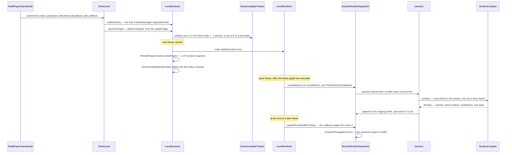

# Level rendering

> Verified against **Minecraft 26.2** · Part XI · a block is placed, and the section it lives in is re-meshed, uploaded and drawn.

## Responsibility

Turning a world into triangles. This page covers the client's terrain
pipeline — which sections are visible, which need re-meshing, what a
mesher is allowed to read, how the result gets onto the GPU, and the
order in which the passes of a frame are declared and executed.

The one sentence a player would recognise: *terrain pops in as you fly,
and a block you place appears instantly.*

The headline for a 1.21-era reader: **the level renderer was cut in half.**
Everything about *the world* — dirty flags, frustum application,
gathering entities and block entities — moved into
the new `LevelExtractor`, in *client/renderer/extract*. `LevelRenderer`
keeps only GPU-facing work and reads nothing but render state.
*LevelRenderer.renderLevel* does not exist; the method is
`LevelRenderer.render`.

## The data it owns

### The extract side

- **`LevelExtractor`** — the world-facing half. It owns the dirty API
  (`LevelExtractor.blockChanged`, `LevelExtractor.setBlockDirty`,
  `LevelExtractor.setBlocksDirty`,
  `LevelExtractor.setSectionDirty`,
  `LevelExtractor.setSectionDirtyWithNeighbors`,
  `LevelExtractor.setSectionRangeDirty`, `LevelExtractor.allChanged`),
  the frustum step (`LevelExtractor.applyFrustum`, which throws if it is
  not on the client thread), and the gathering passes
  `LevelExtractor.extractVisibleEntities`,
  `LevelExtractor.extractVisibleBlockEntities`,
  `LevelExtractor.extractBlockOutline` and
  `LevelExtractor.extractBlockDestroyAnimation`. Its output is a
  `LevelRenderState`.
- **`SectionUpdateTracker`** — where dirtiness now lives, *not* on the
  render section. Each entry is a
  `SectionUpdateTracker.SectionDirtyState` with
  `SectionUpdateTracker.SectionDirtyState.isDirty` and
  `SectionUpdateTracker.SectionDirtyState.isDirtyFromPlayer`;
  `SectionUpdateTracker.hasAllNeighbors` is the gate a never-compiled
  section must pass.
- **`RotatingSectionStorage`** — a fixed ring of section slots,
  re-homed by `RotatingSectionStorage.repositionCenter` as the camera
  moves. Both `ViewArea` and `SectionUpdateTracker` are built on it.
- **`RenderRegionCache`** and **`RenderSectionRegion`** — the snapshot a
  mesher reads: a 3×3×3 grid of `SectionCopy`, each holding a *copy* of
  one section's `PalettedContainer` plus an immutable map of the chunk's
  block entities. The cache shares copies between the regions built in
  one extract, so *n* dirty sections cost far fewer than 27*n* copies.
- **`LevelRenderState`** — the frame's product:
  `LevelRenderState.sectionUpdateRenderStates`,
  `LevelRenderState.entityRenderStates`,
  `LevelRenderState.blockEntityRenderStates`,
  `LevelRenderState.blockOutlineRenderState`,
  `LevelRenderState.blockBreakingRenderStates`,
  `LevelRenderState.skyRenderState`,
  `LevelRenderState.weatherRenderState`,
  `LevelRenderState.particlesRenderState`, plus a `CameraRenderState`.
  `OptionsRenderState` is *not* here — it is a sibling on
  `GameRenderState`, filled by `GameRenderer.extractOptions`.

### The render side

- **`LevelRenderer`** — `LevelRenderer.visibleSections` and
  `LevelRenderer.nearbyVisibleSections`, the `LevelRenderer.viewArea`,
  the `LevelRenderer.sectionOcclusionGraph`, the
  `LevelRenderer.sectionRenderDispatcher`, the
  `LevelRenderer.submitNodeStorage`, the render targets in
  `LevelRenderer.targets` (a `LevelTargetBundle`), and the translucency
  bookkeeping `LevelRenderer.lastTranslucentSortBlockPos` and
  `LevelRenderer.translucencyResortIterationIndex`. Its per-frame draw
  list is built by `LevelRenderer.prepareChunkRenders`.
- **`SectionOcclusionGraph`** — the reachability BFS.
  `SectionOcclusionGraph.GraphState` (held in an `AtomicReference` and
  published atomically, because the full rebuild runs off-thread),
  `SectionOcclusionGraph.Node`, an `Octree` of sections,
  `SectionOcclusionGraph.update`,
  `SectionOcclusionGraph.scheduleFullUpdate`,
  `SectionOcclusionGraph.runPartialUpdate`,
  `SectionOcclusionGraph.addSectionsInFrustum`,
  `SectionOcclusionGraph.schedulePropagationFrom`, and the smart-cull
  threshold `SectionOcclusionGraph.MINIMUM_ADVANCED_CULLING_DISTANCE`.
  The per-section visibility data it walks is a `VisibilitySet`, produced
  at compile time by `VisGraph`.
- **`SectionRenderDispatcher`** — the mesher.
  `SectionRenderDispatcher.RenderSection` (with
  `SectionRenderDispatcher.RenderSection.sectionMesh`,
  `.compileAsync`, `.compileSync`, `.resortTransparency`,
  `.getVisibility`, `.reset`), the work queue
  `SectionTaskDynamicQueue`, the scratch buffers
  `SectionBufferBuilderPack` / `SectionBufferBuilderPool`, and the GPU
  side: one `UberGpuBuffer` pair per layer fed through a `StagingBuffer`,
  drained by `SectionRenderDispatcher.uploadTerrainBuffersToGpu`.
- **`SectionCompiler`** — what runs on a worker.
  `SectionCompiler.compile` produces `SectionCompiler.Results`
  (`SectionCompiler.Results.renderedLayers`,
  `.blockEntities`, `.visibilitySet`, `.transparencyState`), which
  becomes a `CompiledSectionMesh`. `BlockModelLighter` is what computes
  the smooth lighting and ambient occlusion as it goes, with a
  thread-local cache bracketed around each compile.
- **`ChunkSectionLayer`** — `ChunkSectionLayer.SOLID`,
  `ChunkSectionLayer.CUTOUT`, `ChunkSectionLayer.TRANSLUCENT`. Three,
  and only three. `ChunkSectionLayerGroup.OPAQUE` and
  `ChunkSectionLayerGroup.TRANSLUCENT` are the two draw groups, batched
  into a `ChunkSectionsToRender`.
- **The frame graph** — `FrameGraphBuilder.addPass`,
  `FrameGraphBuilder.importExternal`,
  `FrameGraphBuilder.createInternal`, `FrameGraphBuilder.execute`, and
  the per-pass declarations `FramePass.reads`,
  `FramePass.readsAndWrites`, `FramePass.executes`. Targets are named in
  `LevelTargetBundle` (`LevelTargetBundle.main`, `.translucent`,
  `.itemEntity`, `.particles`, `.weather`, `.clouds`,
  `.entityOutline`).

## When it runs

Two things leave the client thread, not one. Meshing goes to
`Util.backgroundExecutor` — the shared background pool, not a dedicated
chunk-builder pool — and so does the occlusion graph's **full** BFS
rebuild, which is the whole reason `SectionOcclusionGraph.GraphState` is
published through an `AtomicReference`. Only
`SectionOcclusionGraph.runPartialUpdate` is on the client thread.

Concurrency is throttled not by thread count but by buffers:
`SectionRenderDispatcher` submits one task-runner per schedule, and each
runner must acquire a `SectionBufferBuilderPack` from
`SectionBufferBuilderPool` before it can work. The pool is sized to the
processor count *or* to a share of the heap, whichever is smaller, and
degrades further if it hits an out-of-memory error while allocating.

A mesher may read only its `RenderSectionRegion`. Block states and block
entities are snapshotted (that is what `SectionCopy` is for — the compile
runs for an unbounded time while the client thread keeps applying block
updates); tints and light are read through the region's references to
`ClientLevel` and the light engine.

The result comes back **through the client thread, as a callback**. The
worker writes into a `StagingBuffer` under a lock, spinning if it is
full; the client thread drains it into the per-layer `UberGpuBuffer`s in
the *uploadTerrainBuffers* step at the end of `LevelRenderer.render`, and
each upload fires the callback that publishes the new mesh and re-arms
`SectionOcclusionGraph.schedulePropagationFrom`. The one exception is a
section that compiled to nothing at all, which is published directly on
the worker.

## The trace: a block is placed

Two things in that diagram are the whole point. First, **only visible
sections are re-meshed**: `LevelExtractor` iterates
`LevelRenderer.visibleSections`, so a block change behind you costs
nothing until the occlusion graph makes that section visible again — the
dirty flag simply waits. Second, **the swap is atomic and late**: a
section keeps drawing its old mesh until every layer's vertex *and* index
buffer has reported uploaded, so there is no frame in which a rebuilt
section is missing.

Note also what the first arrow is *not*. `MultiPlayerGameMode` owns the
prediction sequence; the `Level.setBlock` itself happens down inside
`BlockItem.placeBlock`.

## The passes of a frame

`LevelRenderer.render` builds a graph, then executes it. The passes, in
declaration order: *clear*, *sky* (`LevelRenderer.addSkyPass`), *main*
(`LevelRenderer.addMainPass`), the entity-outline post chain, *clouds*
(`LevelRenderer.addCloudsPass`), *weather*
(`LevelRenderer.addWeatherPass` — which also draws the world border), the
transparency post chain, and *always on top*
(`LevelRenderer.addAlwaysOnTopPass`, which clears depth first). Inside the
main pass: opaque terrain, then
`FeatureRenderDispatcher.PreparedFrame.executeSolid`, then depth copies,
then `FeatureRenderDispatcher.PreparedFrame.executeTranslucent` and
`FeatureRenderDispatcher.PreparedFrame.executeOutline`, then translucent
terrain, then
`FeatureRenderDispatcher.PreparedFrame.executeTranslucentAfterTerrain`.
After the graph executes, `LevelRenderer.compileSections` queues this
frame's rebuilds, `SectionRenderDispatcher.uploadTerrainBuffersToGpu`
drains the staging buffer, and `SectionOcclusionGraph.update` re-walks
reachability.

Everything submitted by entities and block entities is gathered *before*
the graph is built, in `LevelRenderer.submitFeatures` /
`LevelRenderer.submitEntities` / `LevelRenderer.submitBlockEntities`, and
grouped by `FeatureRenderDispatcher.prepareFrame`. See
[entity rendering](entity-rendering.md).

Note the ordering: **terrain is drawn before the sections queued this
frame are compiled.** Even the "prioritise chunk updates" option only
guarantees the mesh exists by the end of frame *N*; it appears in frame
*N+1*.

## Interfaces

- **Called by:** two different phases of the frame.
  `LevelExtractor.extract` is called from `GameRenderer.extract`;
  `LevelRenderer.render` from `GameRenderer.renderLevel`. See
  [the frame](the-frame.md).
- **Calls into:** [blaze3d](blaze3d.md) for every draw;
  `BlockStateModelSet` and `ModelBlockRenderer` for the meshing itself —
  see [models and atlases](models-and-atlases.md); the entity and block
  entity submit path in [entity rendering](entity-rendering.md).
- **Crosses the network as:** nothing directly. Block changes arrive as
  the packets described in
  [what the client is told](../networking/what-the-client-is-told.md),
  and `ClientLevel.sendBlockUpdated` is what turns them into dirty
  sections.
- **Data-driven by:** the models and the atlas, via `SectionCompiler`'s
  `BlockStateModelSet`; and `Options` — render distance, ambient
  occlusion, `PrioritizeChunkUpdates`, section fade-in time.

## Invariants and surprises

- **`LevelRenderer` no longer touches the level.** Its only
  `ClientLevel` reference is a parameter to
  `LevelRenderer.invalidateCompiledGeometry`. Every block-state read in
  the render path is somebody else's.
- **The dirty halo is 27 block positions, not 27 sections.** A block
  change marks the 3×3×3 *block* neighbourhood dirty, and those map to
  **one** section for any block that is not on a section boundary, and at
  most eight when it is. Only the mesher's *read* region is genuinely 27
  sections.
- **A dirty section that is not visible is never rebuilt** — and its
  flag waits, so it rebuilds the instant it becomes visible. With one
  caveat: the flag belongs to a *slot* in a ring, so walking far enough
  away re-homes the slot and discards it. Nothing is lost, because a
  newly homed slot starts dirty.
- **A never-compiled section additionally waits for its neighbours.**
  `SectionUpdateTracker.hasAllNeighbors` requires the eight surrounding
  chunk columns — horizontally only, not the section's own — to be full
  and lit. A *re*compile skips that check entirely.
- **There are only three chunk layers, and the mesher can still overrule
  them.** Cutout-mipped and tripwire are gone as layers; a quad's layer
  is decided at model-bake time and carried on
  `BakedQuad.MaterialInfo.layer`. But `SectionCompiler` redirects every
  leaf quad to *SOLID* when the "cutout leaves" option is off, and fluids
  never consult a `BakedQuad` at all — `FluidRenderer` takes the layer
  from the `FluidModel`.
- **A layer's geometry is in one *arena*, not one buffer.** Each layer has
  an `UberGpuBuffer` pair that owns a growing list of fixed-size heaps —
  128 MiB for vertices, 32 MiB for indices — each heap a real `GpuBuffer`
  sub-allocated by a `TlsfAllocator`, and freed again when it empties.
  That is why `LevelRenderer.prepareChunkRenders` hashes on buffer
  identity at all.
- **The batching lives on `LevelRenderer`, not on `ChunkSectionsToRender`.**
  `LevelRenderer.prepareChunkRenders` buckets sections by a hash and
  `ChunkSectionsToRender` issues one multi-draw per bucket, with the
  per-section transform arriving as a uniform slice — not one draw call
  per section.
- **Translucent batching deliberately defeats itself.** The grouping hash
  skips the buffer contribution for the translucent layer, so those
  sections stay in visit order and are drawn reversed. Back-to-front
  correctness beats batching.
- **Translucency is re-sorted on a rolling budget, and there are two
  triggers.** Everything within a short radius, plus a round-robin slice
  of the visible set — an eighth of it, or fifteen sections, whichever is
  larger — is considered each frame. A section resorts if its
  `TranslucencyPointOfView` changed, *or* if the camera's block position
  changed and the section is either axis-aligned from the camera or
  nearby. It is then skipped if a resort is already scheduled or the
  section has no translucent geometry.
- **Buffer-pool exhaustion is signalled by a null — and so is every other
  null.** A worker that cannot acquire a scratch pack puts its task back
  on the queue. The catch that implements this covers the whole compile,
  so *any* null-pointer failure inside the mesher requeues the section
  instead of reporting it.
- **The concurrent-mesh ceiling is the pool plus one.** The synchronous
  path uses `RenderBuffers.fixedBufferPack`, which is not in the pool at
  all. And because the pool is usually larger than the background pool,
  the real constraint is normally the thread count.
- **The task queue is nearest-first with a starvation guard.** A
  recompile only beats a first-time compile while a small quota lasts —
  and only if it is also nearer. With no first-time compile queued, a
  recompile wins outright.
- **An uncompiled section is opaque to the BFS; an empty one is
  transparent; and a section that compiled to nothing is neither.** The
  third case keeps a real `CompiledSectionMesh` with no draws and answers
  from its own `VisibilitySet`. The asymmetry between the first two is
  why terrain reveals itself outward as it compiles rather than all at
  once — but the *streaming* is the chunk handshake:
  `SectionOcclusionGraph` parks sections that are waiting on a chunk load
  and resumes them when `ClientChunkCache` reports the chunk arrived.
- **Beyond three sections on any axis, smart cull adds a ray march** back
  toward the camera, rejecting a neighbour if any section along the way
  has not been reached by this BFS. The march stops once it is within
  sixty blocks of the camera.
- **The frame graph culls passes and versions writes — but it culls none
  of this page's passes.** A pass that does not transitively feed an
  imported external resource is not executed; in a stock game every pass
  `LevelRenderer` declares reaches the main target. The clouds pass is
  absent from a clouds-off frame because `LevelRenderer.render` never
  adds it, which is a cheaper mechanism and a different one. The five
  internal targets are created only when the transparency post chain is
  active.
- **Sections fade in, but only far ones, and only once.**
  `SectionRenderDispatcher.RenderSection.setFadeDuration` is non-zero
  only for distant sections that were not previously empty — and the fade
  clock starts at a section's *first* upload, so a recompile of terrain
  you have been looking at never fades.
- **Directional shading is per-dimension, but it is not data.** Shading
  reads a `CardinalLighting` record — and there are exactly two of them,
  `CardinalLighting.DEFAULT` and `CardinalLighting.NETHER`, hard-coded.
  `DimensionType` carries only the choice between them.
- **`LevelExtractor.applyFrustum` does not run every frame.** The
  occlusion graph invalidates on a camera move quantised to eight blocks,
  on a field-of-view change and on the smart-cull toggle;
  `LevelRenderer.visibleSections` is a cached list between those.
- **Names a 1.21-era reader will hunt for and not find:**
  *ChunkRenderDispatcher* and *RenderChunk* (now `SectionRenderDispatcher`
  and its nested `SectionRenderDispatcher.RenderSection`), *CompiledChunk* (now `CompiledSectionMesh`),
  *RenderType.chunkBufferLayers* and the five chunk render types (now
  three `ChunkSectionLayer`s), *LevelRenderer.renderChunkLayer*,
  *LevelRenderer.renderLevel*, *LevelRenderer.setupRender*, every dirty
  method on `LevelRenderer`, *RenderChunkRegion* (now
  `RenderSectionRegion`), *BlockRenderDispatcher*, *LiquidBlockRenderer*
  (now `FluidRenderer`) and *BlockAndTintGetter.getShade*. `ViewArea`,
  `VisGraph`, `Octree` and `Frustum` all survive.

## Where to look

`LevelExtractor.extract` for the world half, then `LevelRenderer.render`
for the graph. `SectionUpdateTracker` for where dirtiness lives.
`SectionRenderDispatcher.RenderSection.compileAsync` and
`SectionCompiler.compile` for the mesher, and `BlockModelLighter` for
where ambient occlusion comes from. `SectionOcclusionGraph.update`
for what is visible. `LevelRenderer.prepareChunkRenders` and
`ChunkSectionsToRender` for how it is finally drawn.

---

*Rules: names, never code · how the system works, not how the code reads ·
newest version only · every backticked name passes `tools/verify_names.py`.*
