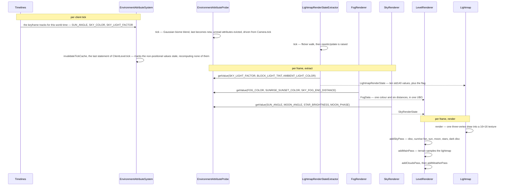

# Lightmap, fog and sky

> Verified against **Minecraft 26.2** · Part XI · the sun goes down: every colour on screen, traced back to one keyframe curve.

Stand on a hill and watch the light go. The sky over the taiga slides from
blue towards black, the murk closes in until the far trees dissolve, stars
come up, the moon takes whatever shape it is owed tonight, and if a storm
arrives the scene goes grey and streaked. Five renderers make those colours —
`Lightmap` decides how bright, `FogRenderer` how far, `SkyRenderer` and
`CloudRenderer` what is up there, `WeatherEffectRenderer` what is coming down
— and between them they ask one question and nothing else: *what is this
attribute worth, here, now?* The surprise is who they ask. **Most of them no
longer know what time it is.** They ask a probe for a named value at a
position and a partial tick, and the day/night curve behind it is keyframes in
a data pack. Two still read the raw world clock — the clouds, because they
drift, and the rain, whose texture scrolls — but the weather asks nobody for a
colour: it seeds each column of rain from that column's own *coordinates*, and
touches no attribute and no probe at all.

## The cast

| class | what it decides | thread |
|---|---|---|
| `EnvironmentAttributeProbe` | what any attribute is worth at the camera, this frame | Render thread |
| `LightmapRenderStateExtractor` | the lightmap's ten uniforms, and whether to redraw at all | Render thread |
| `Lightmap` | how bright, as the 16×16 texture every terrain vertex samples | Render thread |
| `FogRenderer` | how far you can see, in what colour, and in which medium | Render thread |
| `SkyRenderer` | what hangs above the horizon — and which of two skies it is | Render thread |
| `CloudRenderer` | the cloud cells, and the face list built from them | `CloudRenderer.prepare` bakes on a worker, the rest on Render |
| `WeatherEffectRenderer` | which columns get rain, which get snow, and how hard | Render thread |
| `LevelRenderer` | which of those become frame-graph passes at all | Render thread |

## What a renderer has to know about an attribute, and no more

An **environment attribute** is a named, typed quantity — a colour, a
distance, an angle, a moon phase — that the world answers for a position and
an instant. `EnvironmentAttributeSystem` assembles that answer by running a
short stack of layers over the attribute's own default: the dimension, the
biome, one layer per timeline the dimension runs, and weather where a
dimension can have it. That machinery belongs to [environment attributes and
timelines](../world/environment-attributes-and-timelines.md); this page
assumes it and names only what it consumes. Three consequences shape
everything below.

**The client resolves the same stack from the same data** — it is never sent
a resolved colour — and what it adds is `EnvironmentAttributeProbe`, on the
camera: a per-tick cache that smooths in space and in time and [evicts
anything nobody asked
for](../world/environment-attributes-and-timelines.md#the-same-value-on-the-client).
What matters on this page is that
every renderer here that asks for an attribute at all goes through the probe
and never through the system — and one of the five asks for none.

**Whether a value smooths or steps is declared on the attribute**, not chosen
by the renderer — which is why the sky colour slides and
`EnvironmentAttributes.MOON_PHASE` snaps, and why a renderer that wants a
different curve must ask for a different attribute.

**`ClientLevel` adds two layers of its own** on top of the four, and both are
the **lightning** flash ([the stack a value falls
through](../world/environment-attributes-and-timelines.md#the-stack-a-value-falls-through)).
Neither has anything to do with the End's sky flash, which never
enters the stack at all.

### What the dimension type and the biome still carry

Some of the old per-dimension and per-biome data survived the migration
unchanged. `DimensionType.skybox` is a
three-valued `DimensionType.Skybox` — `DimensionType.Skybox.NONE`,
`DimensionType.Skybox.OVERWORLD`, `DimensionType.Skybox.END` — and it is a
*branch*, not a colour. `BiomeSpecialEffects` still exists, hollowed out to
`BiomeSpecialEffects.waterColor`, `BiomeSpecialEffects.grassColorOverride`,
`BiomeSpecialEffects.grassColorModifier` and the foliage colours: every fog
and sky colour left it for `Biome.getAttributes`. None of it crosses the
network as pixels — the inputs arrive as registry sync during configuration,
attribute maps filtered through `EnvironmentAttributeMap.NETWORK_CODEC`, then
world time and weather during play ([protocol
phases](../networking/protocol-phases.md)) — so a data pack retints a
dimension without touching the client.

## The five askers

| renderer | what it asks for | when it asks | what it produces |
|---|---|---|---|
| `Lightmap`, through `LightmapRenderStateExtractor` | how bright block light and sky light should read, and in what tint | once per tick, at a partial tick of exactly one | ten std140 uniforms and one 16×16 texture |
| `FogRenderer` | the colour of the murk and the six distances it lives between | once per frame, inside the camera extract | one `FogData`, uploaded as one UBO slice |
| `SkyRenderer` | where the sun, moon and stars are, and how bright | once per frame | a `SkyRenderState` for the sky pass |
| `CloudRenderer` | what colour the clouds are and how high they sit | once per frame, read for it by `LevelExtractor` | a compressed face list, rebaked only when it must be |
| `WeatherEffectRenderer` | nothing, until it is raining | once per frame, and only then | a list of `WeatherEffectRenderer.ColumnInstance` |

## The trace: the sun goes down

The middle band's order is a dependency order. `GameRenderer.extract` runs
`LightmapRenderStateExtractor.extract`, then `GameRenderer.extractCamera` —
where `FogRenderer.setupFog` stashes its `FogData` on
`CameraRenderState.fogData` — then `LevelExtractor.extract`, which drives
`WeatherEffectRenderer.extractRenderState` and
`SkyRenderer.extractRenderState`. Then `GameRenderer.renderLevel` uploads the
fog with `FogRenderer.updateBuffer`, takes one slice with
`FogRenderer.getBuffer`, and `LevelRenderer.render` declares the passes.

`SkyRenderer.renderSunriseAndSunset` is the clearest instance of the pattern.
The sunrise fan's colour *is* `EnvironmentAttributes.SUNRISE_SUNSET_COLOR`, an
ARGB keyframe track, and its visibility is that colour's own alpha channel —
which the renderer also scales the fan's depth by. The fade is a property of
the data, not of the geometry, so a data pack restyles the sunset without a
line of client code changing.

## How bright: one draw per tick, and no partial ticks at all

`Lightmap` is a 16×16 `GpuTexture` plus a `MappableRingBuffer` of uniforms.
`Lightmap.render` writes those uniforms and issues **one three-vertex draw**
with `RenderPipelines.LIGHTMAP`: the brightness curve lives in the shader and
the whole texture is a by-product of it. In 1.21 this was a `NativeImage`
filled pixel by pixel in Java and re-uploaded every frame.

What it draws from is `LightmapRenderState`: ten values in std140 order — six
floats from `LightmapRenderState.skyFactor` and
`LightmapRenderState.blockFactor` to `LightmapRenderState.brightness`, then
four colours, `LightmapRenderState.blockLightTint` and
`LightmapRenderState.skyLightColor` from
`EnvironmentAttributes.BLOCK_LIGHT_TINT` and
`EnvironmentAttributes.SKY_LIGHT_COLOR`, the other two from
`EnvironmentAttributes.AMBIENT_LIGHT_COLOR` and
`EnvironmentAttributes.NIGHT_VISION_COLOR` — and an eleventh field,
`LightmapRenderState.needsUpdate`, which is not a uniform at all but the flag
that decides whether the draw happens. `LightmapRenderStateExtractor.tick`
runs the torch-flicker random walk in
`LightmapRenderStateExtractor.blockLightFlicker` and raises its own copy of
the flag; `LightmapRenderStateExtractor.extract` copies it across, clears it,
and reads the probe alongside `Options.gamma`, `Options.darknessEffectScale`,
the conduit-power water vision and
`LightmapRenderStateExtractor.calculateDarknessScale`. **So the lightmap is
recomputed once per tick and not once per frame** — and, deliberately,
`GameRenderer.extract` hands the extractor a partial tick of exactly one
while `FogRenderer.setupFog` and `SkyRenderer.extractRenderState` get the
real one. Sky and fog interpolate mid-tick. World lighting steps.

Three leftovers. `Lightmap.getBrightness` survives but no longer feeds the
lightmap: it is a CPU-side duplicate of the shader's curve, kept for `Hud`,
`EntityRenderer`'s shadow sampling and `ScreenEffectRenderer` alone. The
packing statics moved out of the texture into `LightCoordsUtil`, from where a
packed value reaches a vertex through `VertexConsumer.setLight`. And there are two lightmaps, not one: `GameRenderer.levelLightmap` always
returns the real 16×16 texture, `UiLightmap` is a 1×1 white
`DynamicTexture`, and `GameRenderer.lightmap` hands out the second for
exactly as long as `GameRenderer.useUiLightmap` is set — which is the GUI
block and nothing else, and which is [why the HUD is not shaded by the light
you are standing in](the-frame.md#questions-players-ask).

### Two curves that look like one

`EnvironmentAttributes.SKY_LIGHT_FACTOR` is a *visual* attribute, spatially
interpolated, and the lightmap reads it;
`EnvironmentAttributes.SKY_LIGHT_LEVEL` is a *gameplay* attribute, not
positional, and `Level.updateSkyBrightness` turns it into `Level.skyDarken`
for mob spawning. `Timelines.OVERWORLD_DAY` keyframes both, at slightly
different times and to different night values — so they look like one number,
and a data pack can pull them apart.

## How far: one block for the whole frame, filled by a priority walk

`FogRenderer`'s output is a mutable `FogData`: `FogData.color` plus six
distances — a start and an end each for the medium and the horizon, then
`FogData.skyEnd` and `FogData.cloudEnd`. In open air those are
`EnvironmentAttributes.FOG_COLOR`, `EnvironmentAttributes.FOG_START_DISTANCE`,
`EnvironmentAttributes.FOG_END_DISTANCE`,
`EnvironmentAttributes.SKY_FOG_END_DISTANCE` and
`EnvironmentAttributes.CLOUD_FOG_END_DISTANCE`, and underwater they are
`EnvironmentAttributes.WATER_FOG_COLOR`,
`EnvironmentAttributes.WATER_FOG_START_DISTANCE` and
`EnvironmentAttributes.WATER_FOG_END_DISTANCE` instead. It owns one ring
buffer, `FogRenderer.regularBuffer`, and beside it a second buffer of its
own, `FogRenderer.emptyBuffer`, filled with *infinitely far* for when fog is
off.

**There is one fog UBO for the whole frame, not one per pass.**
`LevelRenderer.render` takes a single slice and hands the same one to the
sky, main, weather and always-on-top passes, and does not hand it to the
clouds pass — which reads a cloud fog end out of the same buffer anyway,
because the binding is sticky and the shader simply keeps reading what was
last bound. The sky and cloud fog ends are separate fields *inside that one
block*, which the shaders choose between, so what a player sees as
per-element fog is a shader decision and not a binding.

### The list that decides the colour

The colour and the darkening come from different places.
`FogRenderer.FOG_ENVIRONMENTS` is an ordered list and the order *is* the
priority: `LavaFogEnvironment`, `PowderedSnowFogEnvironment`,
`BlindnessFogEnvironment`, `DarknessFogEnvironment`, `WaterFogEnvironment`,
and `AtmosphericFogEnvironment` **last**, which is what makes it the
guaranteed fallback. `FogRenderer.computeFogColor` makes **one** pass down
that list carrying two independent latches — it takes the colour from the
first environment whose `FogEnvironment.providesColor` is true and the
darkness from the first whose `FogEnvironment.modifiesDarkness` is, which need
not be the same one — whereas
`FogEnvironment.setupFog` stops at the first applicable one, and it and
`FogEnvironment.isApplicable` are the class's only abstract methods.
`MobEffectFogEnvironment` declares `FogEnvironment.providesColor` false on
purpose: blindness and darkness may darken somebody else's colour, never
supply one, and the atmospheric environment sits last precisely so somebody
always does. Which medium the camera is in is a `FogType` (`FogType.WATER`,
`FogType.LAVA`, `FogType.POWDER_SNOW`, `FogType.ATMOSPHERIC`,
`FogType.NONE`), and *NONE* maps to the atmospheric environment. Rain fog is
the only stateful one: `AtmosphericFogEnvironment.rainFogMultiplier` is an
exponential follower, so the murk lags a storm starting rather than
snapping to it, and `AtmosphericFogEnvironment.updateRainFogState` thickens it
even in a biome with no precipitation, at half strength.

## What is up there: two skies, and a texture that is never bound

`SkyRenderer` builds every buffer it will ever need in its constructor, from
`SkyRenderer.buildStars` to `SkyRenderer.buildMoonPhases` against the
`AtlasIds.CELESTIALS` atlas, and per frame fills a `SkyRenderState` running
from `SkyRenderState.skybox` through `EnvironmentAttributes.SUN_ANGLE`,
`EnvironmentAttributes.MOON_ANGLE`, `EnvironmentAttributes.STAR_ANGLE` and
`EnvironmentAttributes.STAR_BRIGHTNESS` to `SkyRenderState.endFlashIntensity`.

**The stars are the same in every world.** `SkyRenderer.buildStars` seeds a
fixed constant and rejects samples outside a shell, so `SkyRenderer.STAR_COUNT`
is an attempt count rather than a star count, and they are rebuilt only when a
resource reload takes the whole renderer down:
`LevelExtractor.onResourceManagerReload` sets
`LevelExtractor.shouldResetSkyRenderer` and `LevelRenderer.addSkyPass` closes
and reconstructs the entire `SkyRenderer`, stars, moon phases and all. The moon
phase, likewise, is no longer arithmetic on the day count — it is
`EnvironmentAttributes.MOON_PHASE` driven by `Timelines.MOON`, whose period is
`MoonPhase.COUNT` days, and the renderer picks a sub-quad of an eight-quad
buffer by `MoonPhase.index`.

**The End takes a different branch entirely.** With
`DimensionType.Skybox.END`, `SkyRenderer.extractRenderState` fills only the
End-flash fields: the sun angle, the moon phase, the sky colour and the dark
disc are never sampled. And `EndFlashState` is not the dragon fight — it is a
free-running flash on a six-hundred-tick cycle, seeded per interval for its
offset, duration and angles, advanced by `EndFlashState.tick` in any dimension
whose skybox is the End's. The sky is also skipped five ways, four of them in one method:
`LevelRenderer.addSkyPass` bails in lava, in powder snow, when
`CameraRenderState` reports that a mob effect blocks the sky — which is
blindness and darkness folded into one boolean before the method is entered —
and when `DimensionType.Skybox` is *NONE*, which is the Nether. The fifth is
outside it: `GameRenderer.renderLevel` suppresses the sky when a boss bar
wants world fog, with `AtmosphericFogEnvironment.setupFog` clamping the fog
hard in that case.

### The clouds, which get no fog and no texture

The clouds are the first of the two exceptions: their colour and height are
`EnvironmentAttributes.CLOUD_COLOR` and `EnvironmentAttributes.CLOUD_HEIGHT`,
but their *drift* is raw world time. **And the cloud texture is never bound as
a texture.** `CloudRenderer.prepare` does the whole job on a worker — reading
the image and baking it into `CloudRenderer.TextureData` through
`CloudRenderer.packCellData`, one 64-bit word per pixel with the colour in the
high bits and four neighbour-emptiness flags in the low four — and
`CloudRenderer.apply` is two statements on the client thread that install the
result and raise the rebuild flag.
`CloudRenderer.buildMesh` walks cells of `CloudRenderer.CELL_SIZE_IN_BLOCKS`,
writing three bytes per face through `CloudRenderer.encodeFace` — a compressed
*face list*, expanded to quads in the shader, with
`CloudRenderer.RelativeCameraPos` and `CloudStatus` deciding which faces
exist. It is rebuilt on a reload, when the camera crosses a cell boundary or
changes side, or when the `CloudStatus` changes — and a data pack setting the
cloud colour to zero alpha removes the pass entirely.

## What is coming down: rebuilt every frame, and seeded from the clock

`WeatherEffectRenderer` is the second exception: its columns are placed by
world position, but the streaks are seeded from raw world time. It holds one
`WeatherEffectRenderer.vertexBuffer` and the precomputed tangent tables
`WeatherEffectRenderer.columnSizeX` and `WeatherEffectRenderer.columnSizeZ`,
and its per-frame product is a list of `WeatherEffectRenderer.ColumnInstance`
records inside a `WeatherRenderState`.
`WeatherEffectRenderer.extractRenderState` returns immediately when the rain
level is zero, so a clear sky costs nothing. Otherwise it loops every column
in a square of radius `Options.weatherRadius`, querying the heightmap and the
precipitation at each — every frame, on the CPU. The vertex buffer is rebuilt in
`WeatherEffectRenderer.render` rather than in extract, and rain and snow are
two indexed draws sharing it. `WorldBorderRenderer` rides in the same pass and
is nothing to do with the weather: the pass simply draws the two of them one
after the other into whichever target it was given — the dedicated weather
target when the transparency chain made one, the main target otherwise — and
the border's own draw is handed the render distance and the far plane so it
can stop the wall where the fog would have taken it anyway. What the border
*is* stays [Part IV's](../../reference/level-data-and-rules.md).
Particles and sound are somebody else's job: `ClientLevel.tickWeatherEffects`
spawns those per tick within the same radius, next to
`ClientLevel.animateTick`, whose scatter of
`EnvironmentAttributes.AMBIENT_PARTICLES` is
[particles](particles.md#three-neighbours-that-look-like-the-same-thing)'.

## What is not an attribute

The migration was not total, which is why *everything is an attribute now*
needs a qualifier. `DimensionType.ambientLight` and
`DimensionType.cardinalLightType` are plain record fields, read directly —
and the first of the two no longer reaches the lightmap at all: its two readers are
`Lightmap.getBrightness`, the CPU-side duplicate this page has already said
the shader does not use, and one deprecated method on `LevelReader`.

The second is the one you can see, because **directional shading is per
dimension and it is not data**. How bright a face is by which way it points
comes from a `CardinalLighting` record, and there are exactly two in the
game: `CardinalLighting.DEFAULT` and `CardinalLighting.NETHER`, both
hard-coded. `DimensionType` carries the choice between them and nothing else
— a data pack picks, it does not supply numbers. What does the picking is
`Lighting`, a single UBO of two diffuse light directions sliced five ways,
one slice per `Lighting.Entry`. Four of the five —
`Lighting.Entry.ITEMS_FLAT`, `.ITEMS_3D`, `.ENTITY_IN_UI` and
`.PLAYER_SKIN`, which is why an item in a slot, an item in your hand and the
player in the inventory screen are each lit differently — are written once in
the constructor and never again. Only `Lighting.Entry.LEVEL` is rewritten,
by `Lighting.updateLevel`, and only when the dimension's choice changes.

Block tint never moved at all: grass, foliage and water
are still `BiomeColors` reading `BiomeSpecialEffects` through the four
`ColorResolver`s, with no probe and no layer stack in it. And the clouds still
read the world clock, because a value sampled at the camera and lerped by
partial tick is the wrong shape for a drift — as does the weather, whose
streaks scroll off it, though the weather is the one renderer here that asks
for no attribute at all and seeds each column from its own coordinates.

> **For a 1.21-era reader.** Nearly every per-dimension, per-biome,
> per-time-of-day visual constant is an environment attribute now, so the
> names to stop hunting for are: *LightTexture* (now `Lightmap` plus
> `LightCoordsUtil`), *DimensionSpecialEffects* and all three subclasses (now
> `DimensionType.skybox` plus attributes), *FogParameters* (now `FogData`),
> *RenderSystem.setShaderFogColor* and its siblings (now one
> `RenderSystem.setShaderFog` taking a uniform slice),
> *LevelRenderer.renderSky* / *renderClouds* / *renderSnowAndRain* (now the
> `LevelRenderer.addSkyPass` family of frame-graph passes, declared as
> [visibility and the frame graph](visibility-and-the-frame-graph.md)
> describes), and *Level.getSkyColor*, *ClientLevel.getStarBrightness* and
> *ClientLevel.effects*, all attributes now. The draws went the way of
> everything in [blaze3d](blaze3d.md), from `RenderPipelines.LIGHTMAP` and
> `RenderPipelines.SKY` to `RenderPipelines.WEATHER_DEPTH_WRITE`.

## Where to look

`LightmapRenderStateExtractor.extract` first, then `Lightmap.render` for what
it feeds. `EnvironmentAttributeProbe.getValue` for the question every renderer
here asks, and [environment attributes and
timelines](../world/environment-attributes-and-timelines.md) for how it is
answered. `FogRenderer.computeFogColor` for the priority walk.
`SkyRenderer.extractRenderState` and `LevelRenderer.addSkyPass` for the sky
and its two branches, `CloudRenderer.buildMesh` and
`WeatherEffectRenderer.extractRenderState` for the meshes rebuilt inside the
frame, and `BiomeColors` for the colour system that did not move.

---

*Rules: names, never code · how the system works, not how the code reads ·
newest version only · every backticked name passes `tools/verify_names.py`.*
