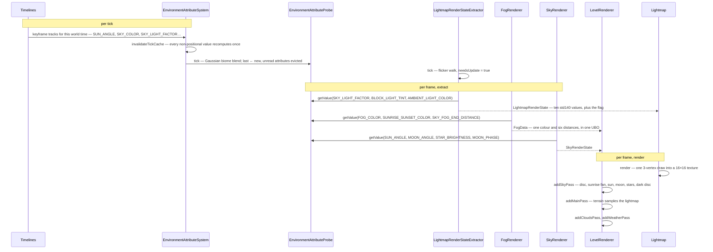

# Lightmap, fog and sky

> Verified against **Minecraft 26.2** · Part XI · the sun goes down: every colour on screen, traced back to one keyframe curve.

## Responsibility

This is the part of the renderer that decides what colour the world is.
Not what shape it is — that is [level rendering](level-rendering.md) — but
how bright a torch-lit corner reads, how far you can see through the
murk, what hangs above the horizon and what falls out of it. Four
renderers own the four answers: `Lightmap` (how bright), `FogRenderer`
(how far), `SkyRenderer` and `CloudRenderer` (what is up there),
`WeatherEffectRenderer` (what is coming down).

The one sentence a player would recognise: *it gets dark, and then it
gets foggy, and then it rains.*

The headline for a 1.21-era reader: **most of these renderers no longer
know what time it is.** *DimensionSpecialEffects* is gone. *LightTexture*
is gone. Nearly every per-dimension, per-biome, per-time-of-day visual
constant now lives in one registry-backed, data-driven, layered system —
`EnvironmentAttributes` — and each renderer asks a probe for a value at a
position and a partial tick. The day/night cycle is a `Timeline`: JSON
keyframes, in a data pack. Two renderers are exceptions and still read
raw world time: the clouds, which drift, and the weather, whose streaks
are seeded from it.

## The data it owns

### The attribute system (server-side data, client-side consumers)

- **`EnvironmentAttribute`** — one visual (or gameplay) quantity, in
  `BuiltInRegistries`. Each declares `EnvironmentAttribute.defaultValue`,
  an `EnvironmentAttribute.type` (fourteen of them in `AttributeTypes`,
  including `AttributeTypes.RGB_COLOR`, `AttributeTypes.ARGB_COLOR`,
  `AttributeTypes.FLOAT`, `AttributeTypes.ANGLE_DEGREES` and
  `AttributeTypes.MOON_PHASE`), an `EnvironmentAttribute.valueRange` that
  clamps the assembled answer, and three flags:
  `EnvironmentAttribute.isPositional`,
  `EnvironmentAttribute.isSpatiallyInterpolated` and
  `EnvironmentAttribute.isSyncable`, set by
  `EnvironmentAttribute.Builder.notPositional`,
  `EnvironmentAttribute.Builder.spatiallyInterpolated` and
  `EnvironmentAttribute.Builder.syncable`. Whether a type is declared
  interpolated is what decides if a value smooths across a tick boundary
  or steps — which is why the moon phase snaps.
- **`EnvironmentAttributes`** — the catalogue. The ones this page uses:
  `EnvironmentAttributes.SKY_COLOR`, `EnvironmentAttributes.FOG_COLOR`,
  `EnvironmentAttributes.FOG_START_DISTANCE`,
  `EnvironmentAttributes.FOG_END_DISTANCE`,
  `EnvironmentAttributes.SKY_FOG_END_DISTANCE`,
  `EnvironmentAttributes.CLOUD_FOG_END_DISTANCE`,
  `EnvironmentAttributes.WATER_FOG_COLOR`,
  `EnvironmentAttributes.WATER_FOG_START_DISTANCE`,
  `EnvironmentAttributes.WATER_FOG_END_DISTANCE`,
  `EnvironmentAttributes.SUNRISE_SUNSET_COLOR`,
  `EnvironmentAttributes.CLOUD_COLOR`,
  `EnvironmentAttributes.CLOUD_HEIGHT`,
  `EnvironmentAttributes.SUN_ANGLE`,
  `EnvironmentAttributes.MOON_ANGLE`,
  `EnvironmentAttributes.STAR_ANGLE`,
  `EnvironmentAttributes.STAR_BRIGHTNESS`,
  `EnvironmentAttributes.MOON_PHASE`,
  `EnvironmentAttributes.BLOCK_LIGHT_TINT`,
  `EnvironmentAttributes.SKY_LIGHT_COLOR`,
  `EnvironmentAttributes.SKY_LIGHT_FACTOR`,
  `EnvironmentAttributes.SKY_LIGHT_LEVEL`,
  `EnvironmentAttributes.AMBIENT_LIGHT_COLOR`,
  `EnvironmentAttributes.NIGHT_VISION_COLOR`,
  `EnvironmentAttributes.AMBIENT_PARTICLES`.
- **`EnvironmentAttributeSystem`** — the per-level stack that answers an
  attribute: dimension, biome, one layer per timeline, and the weather
  layers if the dimension can have weather, baked once in the level
  constructor by `EnvironmentAttributeSystem.addDefaultLayers`, with a
  per-tick cache that covers only the positionless answer. Layers come in
  three shapes — constant, time-based and positional — and a run of
  leading constants is folded into a base value rather than kept as
  layers. It is owned by
  [environment attributes and timelines](../world/environment-attributes-and-timelines.md);
  what matters here is that **the client builds the same stack from the
  same synced data** and resolves colours locally, and that `ClientLevel`
  adds two layers of its own — both for the **lightning** flash, which
  whitens `EnvironmentAttributes.SKY_COLOR` and pins
  `EnvironmentAttributes.SKY_LIGHT_FACTOR` to one while it lasts.
- **`EnvironmentAttributeProbe`** — the camera's sampler.
  `EnvironmentAttributeProbe.tick` Gaussian-samples the surrounding
  biomes into a `SpatialAttributeInterpolator` and rolls each
  `EnvironmentAttributeProbe.ValueProbe`'s new value down into
  `EnvironmentAttributeProbe.ValueProbe.lastValue`, clearing
  `EnvironmentAttributeProbe.ValueProbe.newValue` — and **evicting any
  attribute nobody asked for last tick**. `EnvironmentAttributeProbe.getValue`
  fetches the fresh value lazily, during the frame, and interpolates
  between the two by partial tick. Layers combine through
  `ColorModifier.MULTIPLY_RGB`, `ColorModifier.ALPHA_BLEND`,
  `FloatModifier.MULTIPLY`, `FloatModifier.MAXIMUM` and friends;
  `WeatherAttributes.RAIN` and `WeatherAttributes.THUNDER` are the
  worked examples.
- **`Timeline`** — a period in ticks plus keyframe tracks, built through
  `Timeline.Builder` (`Timeline.Builder.addTrack`,
  `Timeline.Builder.addModifierTrack`, `Timeline.Builder.addTimeMarker`,
  eased by `EasingType`). There are **four**: `Timelines.OVERWORLD_DAY`
  is the day/night cycle, `Timelines.MOON` a second and longer one,
  `Timelines.VILLAGER_SCHEDULE` drives villager activity, and
  `Timelines.EARLY_GAME` does not loop at all — it is what gates pillager
  patrols until the world is old enough. Time itself comes from
  `WorldClock`/`ClockManager` (see
  [the level tick](../server/server-level-tick.md)), and
  `ClockTimeMarkers` names six instants on it —
  `ClockTimeMarkers.DAY`, `ClockTimeMarkers.NOON`, `ClockTimeMarkers.NIGHT`
  and `ClockTimeMarkers.MIDNIGHT` are the four that commands can name;
  `ClockTimeMarkers.WAKE_UP_FROM_SLEEP` and
  `ClockTimeMarkers.ROLL_VILLAGE_SIEGE` are internal.
- **`DimensionType`** now carries `DimensionType.skybox` — a three-valued
  `DimensionType.Skybox` (`DimensionType.Skybox.NONE`,
  `DimensionType.Skybox.OVERWORLD`, `DimensionType.Skybox.END`) —
  plus `DimensionType.attributes` (an `EnvironmentAttributeMap`) and
  `DimensionType.timelines`. `BiomeSpecialEffects` still exists but has
  been hollowed out to `BiomeSpecialEffects.waterColor`,
  `BiomeSpecialEffects.grassColorOverride`,
  `BiomeSpecialEffects.grassColorModifier` and the foliage colours; every
  fog and sky colour left it.

### The lightmap

- **`Lightmap`** — a 16×16 `GpuTexture` (`Lightmap.texture`,
  `Lightmap.textureView`, `Lightmap.TEXTURE_SIZE`) and a
  `MappableRingBuffer` of uniforms (`Lightmap.ubo`,
  `Lightmap.LIGHTMAP_UBO_SIZE`). `Lightmap.render` writes the uniforms
  and issues one three-vertex draw with `RenderPipelines.LIGHTMAP`.
- **`LightmapRenderState`** — ten uniforms in std140 order — six floats
  (`LightmapRenderState.skyFactor`, `LightmapRenderState.blockFactor`,
  `LightmapRenderState.nightVisionEffectIntensity`,
  `LightmapRenderState.darknessEffectScale`,
  `LightmapRenderState.bossOverlayWorldDarkening`,
  `LightmapRenderState.brightness`) then four colours
  (`LightmapRenderState.blockLightTint`,
  `LightmapRenderState.skyLightColor`,
  `LightmapRenderState.ambientColor`,
  `LightmapRenderState.nightVisionColor`) — plus
  `LightmapRenderState.needsUpdate`, which is not a uniform at all but
  the flag that decides whether the draw happens.
- **`LightmapRenderStateExtractor`** — fills that state.
  `LightmapRenderStateExtractor.tick` runs the torch-flicker random walk
  (`LightmapRenderStateExtractor.blockLightFlicker`) and raises its own
  `LightmapRenderStateExtractor.needsUpdate`;
  `LightmapRenderStateExtractor.extract` copies that flag into the render
  state, clears it, and reads the probe, `Options.gamma`,
  `Options.darknessEffectScale`, the conduit-power water vision, and
  `LightmapRenderStateExtractor.calculateDarknessScale`.
- **`LightCoordsUtil`** — the packing statics, split out of the texture.
  `LightCoordsUtil.pack`, `LightCoordsUtil.block`, `LightCoordsUtil.sky`,
  `LightCoordsUtil.FULL_BRIGHT`, `LightCoordsUtil.FULL_SKY`, the smooth
  variants used by ambient occlusion
  (`LightCoordsUtil.smoothPack`, `LightCoordsUtil.smoothBlend`,
  `LightCoordsUtil.addSmoothBlockEmission`) and the lookups
  `LightCoordsUtil.getLightCoords` with its
  `LightCoordsUtil.BrightnessGetter.DEFAULT`. A packed value reaches a
  vertex through `VertexConsumer.setLight`.
- **`UiLightmap`** — a 1×1 white `DynamicTexture`. `GameRenderer.lightmap`
  hands this out while `GameRenderer.useUiLightmap` is set;
  `GameRenderer.levelLightmap` always returns the real one.

### Fog

`FogRenderer` owns one ring buffer, `FogRenderer.regularBuffer`, and one
static `FogRenderer.emptyBuffer` filled once with "infinitely far" for
when fog is off. Its output is a mutable `FogData` — `FogData.color`
plus six distances (`FogData.environmentalStart`, `FogData.environmentalEnd`,
`FogData.renderDistanceStart`, `FogData.renderDistanceEnd`,
`FogData.skyEnd`, `FogData.cloudEnd`) — stashed on
`CameraRenderState.fogData` and uploaded by `FogRenderer.updateBuffer`.

`FogRenderer.FOG_ENVIRONMENTS` is an ordered list and the order is the
priority: `LavaFogEnvironment`, `PowderedSnowFogEnvironment`,
`BlindnessFogEnvironment`, `DarknessFogEnvironment`,
`WaterFogEnvironment`, and `AtmosphericFogEnvironment` **last**, which is
what makes it the guaranteed fallback. Only `FogEnvironment.setupFog` and
`FogEnvironment.isApplicable` are abstract; `FogEnvironment.providesColor`,
`FogEnvironment.getBaseColor`, `FogEnvironment.modifiesDarkness` and
`FogEnvironment.getModifiedDarkness` are defaults a subclass overrides
only when it needs to. `FogType` (`FogType.WATER`, `FogType.LAVA`,
`FogType.POWDER_SNOW`, `FogType.ATMOSPHERIC`, `FogType.NONE`) says which
medium the camera is in — and *NONE* maps to the atmospheric environment.

### Sky, clouds, weather

`SkyRenderer` builds every buffer it will ever need in its constructor:
`SkyRenderer.starBuffer` (`SkyRenderer.buildStars`),
`SkyRenderer.topSkyBuffer` and `SkyRenderer.bottomSkyBuffer`
(`SkyRenderer.buildSkyDisc`, `SkyRenderer.SKY_DISC_RADIUS`),
`SkyRenderer.sunriseBuffer` (`SkyRenderer.buildSunriseFan`),
`SkyRenderer.sunBuffer` and `SkyRenderer.moonBuffer`
(`SkyRenderer.buildSunQuad`, `SkyRenderer.buildMoonPhases`, from the
`AtlasIds.CELESTIALS` atlas), `SkyRenderer.endSkyBuffer` and
`SkyRenderer.endFlashBuffer`. Per frame it fills a `SkyRenderState` —
`SkyRenderState.skybox`, `SkyRenderState.sunAngle`,
`SkyRenderState.moonAngle`, `SkyRenderState.starAngle`,
`SkyRenderState.starBrightness`, `SkyRenderState.skyColor`,
`SkyRenderState.sunriseAndSunsetColor`, `SkyRenderState.moonPhase`,
`SkyRenderState.rainBrightness`, `SkyRenderState.shouldRenderDarkDisc`,
`SkyRenderState.endFlashIntensity` and the two End-flash angles.

`CloudRenderer` is a `SimplePreparableReloadListener`: `CloudRenderer.prepare`
reads the cloud image and `CloudRenderer.apply` bakes it into
`CloudRenderer.TextureData`, one 64-bit word per pixel with the colour in the
high bits and four neighbour-emptiness flags in the low four
(`CloudRenderer.packCellData`, `CloudRenderer.isCellEmpty`).
`CloudRenderer.buildMesh` walks cells (`CloudRenderer.CELL_SIZE_IN_BLOCKS`)
and writes three bytes per face through `CloudRenderer.encodeFace`;
`CloudRenderer.RelativeCameraPos` and `CloudStatus` decide which faces
exist at all.

`WeatherEffectRenderer` holds one `WeatherEffectRenderer.vertexBuffer` and
the precomputed tangent tables `WeatherEffectRenderer.columnSizeX` and
`WeatherEffectRenderer.columnSizeZ` (`WeatherEffectRenderer.RAIN_TABLE_SIZE`).
Its per-frame product is a list of
`WeatherEffectRenderer.ColumnInstance` records inside `WeatherRenderState`
(`WeatherRenderState.rainColumns`, `WeatherRenderState.snowColumns`,
`WeatherRenderState.intensity`, `WeatherRenderState.radius`).

## When it runs

All the per-tick and per-frame work is on the client's main thread. The
one exception is the cloud bake: `CloudRenderer.prepare` is a reload
task and runs on a worker, with only `CloudRenderer.apply` coming back.

**Per client tick.** `EnvironmentAttributeSystem.invalidateTickCache`
bumps the cache id, dropping every non-positional cached value.
`EnvironmentAttributeProbe.tick` re-samples the biome neighbourhood.
`LightmapRenderStateExtractor.tick` advances the flicker and raises the
update flag. `Level.updateSkyBrightness` recomputes
`Level.skyDarken`. `ClientLevel.tickWeatherEffects` spawns rain particles
and sounds within `Options.weatherRadius`; `ClientLevel.animateTick` runs
the ambient particle scatter; `EndFlashState.tick` advances the End-sky
flash.

**Per frame, extract.** `GameRenderer.extract` runs
`LightmapRenderStateExtractor.extract` first of the level-facing steps,
then `GameRenderer.extractCamera` (which calls `FogRenderer.setupFog` and
stores the `FogData`), then `LevelExtractor.extract`, which drives
`WeatherEffectRenderer.extractRenderState` and
`SkyRenderer.extractRenderState` and reads the cloud colour and height.

**Per frame, render.** `Lightmap.render` goes first and returns
immediately unless the flag is set. `GameRenderer.renderLevel`
uploads the fog with `FogRenderer.updateBuffer` and takes a single slice
with `FogRenderer.getBuffer`. `LevelRenderer.render` then declares the
passes: `LevelRenderer.addSkyPass`, `LevelRenderer.addMainPass`,
`LevelRenderer.addCloudsPass`, `LevelRenderer.addWeatherPass`. The frame
closes with `FogRenderer.endFrame` and `CloudRenderer.endFrame` rotating
their ring buffers.

**Per resource reload.** `CloudRenderer.prepare`/`CloudRenderer.apply`
rebake the cloud cells, and `LevelExtractor.onResourceManagerReload` sets
`LevelExtractor.shouldResetSkyRenderer`, which makes
`LevelRenderer.addSkyPass` close and reconstruct the entire `SkyRenderer`
— stars, moon phases and all.

## The trace: the sun goes down

Read the diagram as one question asked repeatedly: *what is this
attribute worth, here, now?* The timeline supplies the curve, the layer
stack decides how dimension, biome, time and weather combine, the probe
smooths the answer over space and time, and four renderers consume it.
`SkyRenderer.renderSunriseAndSunset` is the clearest case: the sunrise
fan's colour *is* `EnvironmentAttributes.SUNRISE_SUNSET_COLOR`, an ARGB
keyframe track, and its visibility is that colour's own alpha channel —
which the renderer also scales the fan's depth by, so the fade is a
property of the data, not of the geometry.

## Interfaces

- **Called by:** `GameRenderer.extract` and `GameRenderer.render` for the
  lightmap and fog; `LevelRenderer.render` for sky, clouds and weather,
  through the frame graph described in
  [level rendering](level-rendering.md).
- **Calls into:** `EnvironmentAttributeProbe` for most values;
  `RenderSystem.setShaderFog` and `RenderPipelines.LIGHTMAP`,
  `RenderPipelines.SKY`, `RenderPipelines.CELESTIAL`,
  `RenderPipelines.STARS`, `RenderPipelines.SUNRISE_SUNSET`,
  `RenderPipelines.END_SKY`, `RenderPipelines.CLOUDS`,
  `RenderPipelines.FLAT_CLOUDS`,
  `RenderPipelines.WEATHER_DEPTH_WRITE` and
  `RenderPipelines.WEATHER_NO_DEPTH_WRITE` for the draws — see
  [blaze3d](blaze3d.md).
- **Crosses the network as:** nothing directly. The inputs arrive as
  registry sync (`DimensionType`, `Biome`, `Timeline`,
  `EnvironmentAttributeMap.NETWORK_CODEC`) during configuration, and as
  the world time and weather in the play phase — see
  [protocol phases](../networking/protocol-phases.md).
- **Data-driven by:** `DimensionType.attributes`, `Biome.getAttributes`,
  `Timelines.OVERWORLD_DAY` and `Timelines.MOON`, all reloadable
  registries. A data pack can retint a dimension without touching the
  client.

## Invariants and surprises

- **The lightmap is computed on the GPU now, and only once per tick.**
  `Lightmap.render` writes ten uniforms and draws three vertices; the
  brightness curve lives in the shader. It early-outs unless
  `LightmapRenderState.needsUpdate` — a flag raised by
  `LightmapRenderStateExtractor.tick` and cleared by its own
  `LightmapRenderStateExtractor.extract`. In 1.21 this was a 16×16
  `NativeImage` filled pixel by pixel in Java and re-uploaded every frame.
- **The lightmap deliberately ignores partial ticks.**
  `GameRenderer.extract` passes a literal `1.0` to
  `LightmapRenderStateExtractor.extract`, while `FogRenderer.setupFog`
  and `SkyRenderer.extractRenderState` use the real one. Sky and fog
  interpolate mid-tick; world lighting steps.
- **`Lightmap.getBrightness` survives but no longer feeds the lightmap.**
  It is a CPU-side duplicate of the shader's curve, kept for exactly
  three callers: `Hud`, `EntityRenderer`'s shadow sampling and
  `ScreenEffectRenderer`.
- **There is one fog UBO for the whole frame, not one per pass.**
  `LevelRenderer.render` takes a single slice and hands the same one to
  the sky, main, weather and always-on-top passes; the clouds pass is
  handed no fog at all. The sky and cloud fog *ends* are separate fields
  **inside that one block**, which the shaders choose between — so the
  effect the page's reader sees is real and the mechanism is not per-pass
  binding.
- **Fog picks its colour and its darkening from different sources.**
  `FogRenderer.computeFogColor` walks `FogRenderer.FOG_ENVIRONMENTS` in a
  fixed priority order and takes the first that
  `FogEnvironment.providesColor` and, separately, the first that
  `FogEnvironment.modifiesDarkness`. `MobEffectFogEnvironment` declares
  the former false — blindness and darkness can only darken somebody
  else's colour, never supply one — and `AtmosphericFogEnvironment` sits
  last in the list precisely so that somebody always does.
  `FogEnvironment.setupFog`, by contrast, stops at the first applicable
  environment.
- **Rain fog is the only stateful fog.**
  `AtmosphericFogEnvironment.rainFogMultiplier` is an exponential
  follower, so fog lags a storm starting; and
  `AtmosphericFogEnvironment.updateRainFogState` still thickens it in a
  biome that has no precipitation, at half strength.
- **The cloud texture is never bound as a texture.** It is baked into a
  `CloudRenderer.TextureData` cell array at reload, and the mesh is a
  compressed *face list* — three bytes per face, expanded to quads in the
  shader. The mesh is rebuilt on a resource reload, when the camera
  crosses a cell boundary, when it changes side
  (`CloudRenderer.RelativeCameraPos`), or when the `CloudStatus` changes.
  A data pack that sets `EnvironmentAttributes.CLOUD_COLOR` to zero alpha
  removes the pass entirely.
- **The stars are the same in every world.** `SkyRenderer.buildStars`
  seeds a fixed constant and rejects samples outside a shell, so
  `SkyRenderer.STAR_COUNT` is an attempt count, not a star count. They
  are built once in the constructor and only rebuilt when a resource
  reload reconstructs the whole `SkyRenderer`.
- **Weather is re-derived on the CPU every frame — when there is
  weather.** `WeatherEffectRenderer.extractRenderState` returns
  immediately if the rain level is zero; otherwise it loops every column
  in a square of radius `Options.weatherRadius`, queries the heightmap
  and the precipitation at each. The vertex buffer itself is rebuilt in
  `WeatherEffectRenderer.render`, not in extract, and rain and snow are
  two indexed draws sharing one buffer. The world border rides in the
  same pass.
- **The sky can be skipped five different ways.**
  `LevelRenderer.addSkyPass` bails in lava, in powder snow, under
  blindness or darkness, and when the dimension's
  `DimensionType.Skybox` is *NONE* — which is the Nether. On top of that
  `GameRenderer.renderLevel` suppresses it when a boss bar wants world
  fog, and `AtmosphericFogEnvironment.setupFog` clamps the fog hard in
  that case.
- **The End takes a different branch entirely.** With
  `DimensionType.Skybox.END`, `SkyRenderer.extractRenderState` fills only
  the End-flash fields — the sun angle, moon phase, sky colour and dark
  disc are never sampled. And `EndFlashState` is not the dragon fight: it
  is a free-running flash on a six-hundred-tick cycle, seeded per
  interval for its offset, duration and angles, present in any dimension
  whose skybox is the End's.
- **Moon phase is no longer arithmetic on the day count.** It is
  `EnvironmentAttributes.MOON_PHASE`, driven by `Timelines.MOON`, whose
  period is `MoonPhase.COUNT` days; the renderer selects a sub-quad of one
  eight-quad buffer by `MoonPhase.index`.
- **Gameplay darkness and visual darkness are two curves, not one.**
  `EnvironmentAttributes.SKY_LIGHT_FACTOR` is a *visual* attribute,
  spatially interpolated, and drives the lightmap;
  `EnvironmentAttributes.SKY_LIGHT_LEVEL` is a *gameplay* attribute, not
  positional, and is what `Level.updateSkyBrightness` turns into
  `Level.skyDarken` for mob spawning. `Timelines.OVERWORLD_DAY`
  keyframes both, at slightly different times and to different night
  values — so they look like one curve and a data pack can separate them.
- **Not every visual constant is an attribute.**
  `DimensionType.ambientLight` — the floor under the lightmap's curve —
  and `DimensionType.cardinalLightType` are plain record fields, and
  block tint is still `BiomeColors` reading `BiomeSpecialEffects` through
  the four `ColorResolver`s. That is the whole of what is left of the old
  system, and it is why "everything is an attribute now" needs the
  qualifier.
- **Names a 1.21-era reader will hunt for and not find:**
  *LightTexture* (now `Lightmap` plus `LightCoordsUtil`),
  *DimensionSpecialEffects* and all three of its subclasses (now
  `DimensionType.skybox` plus attributes), *FogParameters* (now `FogData`),
  *RenderSystem.setShaderFogColor* and its siblings (now one
  `RenderSystem.setShaderFog` taking a uniform slice),
  *LevelRenderer.renderSky* / *renderClouds* / *renderSnowAndRain* (now
  the `LevelRenderer.addSkyPass` family of frame-graph passes),
  *Level.getSkyColor*, *ClientLevel.getStarBrightness* and
  *ClientLevel.effects* (all attributes now).

## Where to look

`Lightmap`, then `LightmapRenderStateExtractor.extract` for what feeds
it. `EnvironmentAttributes` for the catalogue and
`EnvironmentAttributeSystem.addDefaultLayers` for how a value is
assembled. `FogRenderer.computeFogColor` for the priority walk.
`SkyRenderer.extractRenderState` and `LevelRenderer.addSkyPass` for the
sky. `CloudRenderer.buildMesh` and
`WeatherEffectRenderer.extractRenderState` for the two per-frame meshes.
`BiomeColors` for the one colour system that did not move.

---

*Rules: names, never code · how the system works, not how the code reads ·
newest version only · every backticked name passes `tools/verify_names.py`.*
