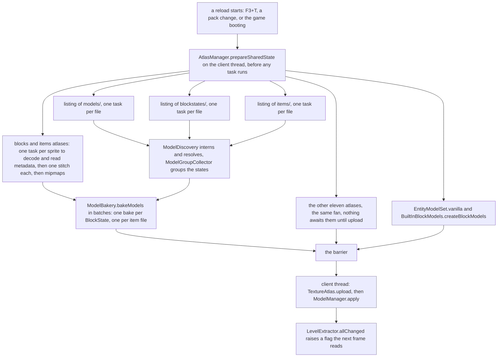

# Models and atlases

> Verified against **Minecraft 26.2** · Part XI · a resource pack changes one texture, and every stone block in the world redraws.

You drop a pack into the folder, move it above the default, and the screen
goes to the loading overlay for a second. The pack replaced exactly one
file, a single stone texture, and when the overlay clears every block you
can see has been thrown away and rebuilt — not just the stone. The models
for stone were byte-identical before and after, and were still re-listed,
re-parsed, re-resolved and re-baked, because the sprite they point at is
now a different object at different coordinates in a different image.
**Nothing here is incremental. The unit of change is the model layer.**

Every block face, every item sprite and every particle texture starts as
JSON and a PNG in a pack and ends as four vertices pointing at a rectangle
of a stitched atlas. The stages below are that journey, and they happen
inside a resource reload — [the resource
system](../foundations/resource-system.md) owns `ReloadableResourceManager`
and the barrier this rides on — and at no other time.

## The cast

| class | what it decides | thread |
|---|---|---|
| `ModelManager` | the reload's spine, and what the finished lookup sets contain | workers, then the client thread at apply |
| `AtlasManager` | which atlases exist, and it publishes their stitches for others to await | client thread for the handshake, workers for the work |
| `SpriteLoader` | how one atlas is decoded, packed and mipmapped | workers |
| `ModelDiscovery` | which file an `Identifier` means, and what its parent chain resolved to | one worker task |
| `ModelBakery` | which unbaked model each `BlockState` and each item file bakes to | workers, in batches |
| `FaceBakery` | a quad's UVs, its rotated cull face, and its chunk layer | workers |
| `TextureManager` | who owns each `AbstractTexture`, and when an animation advances | client thread |
| `ItemModelResolver` | which `ItemModel` a given `ItemStack` draws with | client thread, every frame |

## The shape of the work: eighteen fans, one barrier

This is the clearest fan-out-and-barrier in the client. Eighteen independent
pieces of work start on worker threads at once — thirteen atlas stitches and
the five roots `ModelManager.reload` opens, three of them directory listings
that are each themselves a fan of one task per file — and they converge
exactly once.

Read it as **spread, converge, upload, invalidate**: above the barrier,
worker threads in any order; below it, the client thread in exactly one.

## Thirteen atlases and three listings, all at once

**In:** every enabled pack. **Out:** thirteen stitched images, three parsed maps.

`AtlasManager` owns `AtlasManager.KNOWN_ATLASES` — thirteen of them, named
in `AtlasIds` — and each is a definition file in *atlases/*, not a folder
scan. `SpriteSourceList` runs that file's five kinds of source in order —
`SingleFile`, `DirectoryLister`, `SourceFilter`, `Unstitcher` and
`PalettedPermutations`, registered in `SpriteSources` — and a later source
overwrites an earlier one by id, which is how a pack replaces a vanilla
texture blind. `SpriteLoader.loadAndStitch` decodes and reads metadata one
task per sprite, hands the results to `Stitcher` — which sorts by height
and grows by powers of two — and returns a `SpriteLoader.Preparations`,
after which `MipmapGenerator` builds the mip chain under whatever
`MipmapStrategy` the texture's own metadata asks for.

Two properties of that packing surprise people. The mip level is clamped to
the smallest sprite's power of two, with a warning, so **one undersized
texture degrades mipmapping for every sprite in the atlas** — and only the
block atlas asks for mipmaps, the other twelve stitch flat. And sprite
padding derives from the mip level *and* the anisotropic filtering setting,
with the UVs computed inside the padded box, so anisotropy changes the
layout and every UV in the game. The mipmap slider is blunter still: it
writes the new level onto `AtlasManager` and schedules a texture reload, so
every sprite in the game is decoded and stitched again.

Meanwhile `BlockStateModelLoader` parses *blockstates/* into a
`BlockStateModel.UnbakedRoot` per `BlockState`, through
`BlockStateModelDispatcher` and `VariantSelector`, and `ClientItemInfoLoader`
parses *items/* into `ClientItem`.

### The handshake that lets two listeners share a future

Reload listeners are not supposed to reach into each other, and this pair
has to: baking cannot resolve a texture slot without knowing where the
sprite landed. The channel that lets them is [the resource system's
shared-state
pass](../foundations/resource-system.md#the-shared-state-channel), and
`AtlasManager.PENDING_STITCH` is the only key the game declares. What
matters here is which end of it this page is: `AtlasManager` publishes a
pending stitch for all thirteen atlases, and `ModelManager` awaits exactly
the two it bakes against — the blocks atlas and the items atlas — from
inside its own prepare, which is what lets baking overlap stitching instead
of queueing behind it.

## Interning the models, and dropping the ones that loop

**In:** the raw *models/* map. **Out:** a `ResolvedModel` per `Identifier`.

`ModelDiscovery` is a single worker task and the narrow waist of the
pipeline. Every `Identifier` becomes one `ModelDiscovery.ModelWrapper`,
caching its resolved texture slots and its baked geometry per `ModelState`,
and `ModelDiscovery.resolve` returns the map of `ResolvedModel`, whose
helpers walk the parent chain for geometry, slots, ambient occlusion and
transforms. A model whose parents never reach a root is logged and excluded,
and a model nothing references is parsed and never baked. In parallel,
`ModelGroupCollector` gives each block state a visual-equality group — the
fact that lets `ModelManager.requiresRender` later say *that change is
invisible*.

The JSON model itself is `CuboidModel`, made of `CuboidModelElement`,
`CuboidFace` and `CuboidRotation`, with `UnbakedGeometry` and
`UnbakedCuboidGeometry` between a resolved model and its quads, and
`Material`, `SpriteId`, `TextureSlots` and `MaterialBaker` are the
indirection from a model's *slot* reference to a real sprite.

## One bake per block state, and why that is affordable

**In:** resolved models and the stitched sprites. **Out:** a `ModelBakery.BakingResult`.

`ModelBakery.bakeModels` bakes once per *block state* and once per item
model file, sharing one baker whose caches are concurrent maps, and the
bakes are batched rather than scheduled individually, so this is tens of
tasks and not tens of thousands. `ModelBakery.MissingModels` — a block
part, a block, an item and a fluid — is baked first of all, so there is
always something to substitute. Two further bakes follow: the `BlockModel`
display layer, including the hard-coded `BuiltInBlockModels`, and the
`FluidStateModelSet`.

Dedup is what makes per-state baking cheap. Every state sharing an unbaked
variant gets the *same* baked object, geometry is cached per `ModelState`,
and vertex positions and material infos are interned. Multipart is the
exception that proves it: each state gets its own thin `MultiPartModel`
over a shared `MultiPartModel.SharedBakedState`, so every fence, wall, pane
and redstone-wire state really is a distinct object.

The output is a `QuadCollection` of `BakedQuad` — a ten-component record
of four positions, four packed UVs, a `Direction` recomputed from the baked
vertices, and a `BakedQuad.MaterialInfo` holding the sprite, the
`ChunkSectionLayer`, the item `RenderType`, the tint index, shade and light
emission. Three decisions land here and not later. Cull faces are rotated
at bake time — a rotated variant's north-culled quad is filed under the
rotated direction, in `UnbakedCuboidGeometry`, with `FaceBakery` doing the
UV half of the rotation and the uvlock — so the mesher never thinks about
it. Tint is *not* resolved: the quad carries an index, and the colour
arrives later from `BlockColors` or an `ItemTintSource`. And
`QuadCollection` carries translucent and animated flags, OR-ed up through
every model wrapper, so the mesher and `ItemStackRenderState` can decide
whether they need sorting or re-uploading without reading a quad.

### A quad's chunk layer is read out of the sprite's pixels

The most surprising decision in the pipeline is the one nobody has to make.
`FaceBakery.bakeQuad` does not take the render layer from the block or from
any per-face declaration: it asks `SpriteContents` what transparency actually
exists inside *that quad's UV rectangle*. The answer is a `Transparency`, two
booleans wide — are there fully transparent pixels in there, and are there
partly transparent ones — and `ChunkSectionLayer.byTransparency` reads them in
that order: any partial alpha makes it translucent, otherwise any full
transparency makes it cutout, otherwise solid. The same two booleans pick the
item render type out of `Sheets`, which is where the four block-and-item
sheets live.

**One pixel** — enough alpha inside a quad's UV rectangle to move that face
out of the solid layer (`FaceBakery`, asking `SpriteContents`).

A pack author who softens one edge of a texture has changed which chunk
layer that face draws in, and so when it is sorted and how it blends with
everything behind it. There is no warning, and only one way out: a
`Material` may set `Material.forceTranslucent`, from a *force_translucent*
key beside the sprite name, which skips the scan and takes the translucent
layer whatever the pixels say. A hundred and ten of the shipped models use
it — the stained glass, mostly — and it is the exception that shows the
rule, because it exists for textures whose alpha the scan would read
correctly and whose author wants them sorted anyway.

## A dozen ways to fail soft, and the two that crash

Missing and malformed input is a warning and a substitution at **twelve**
separate layers. An unparseable model file, an unparseable blockstate file
and a single bad variant selector are each swallowed locally, and the
broadest of the twelve is the last: a block state with no entry at all
still gets the missing model rather than an exception. In between sit
missing parents, cycles, bakes that throw, sprite ids that belong to no
atlas, unbound and unresolvable slot chains, and a block model caught
reaching outside the block atlas. The startup sweep that would catch the
last case, `Minecraft.selfTest`, **only runs in a development
environment**, and there it throws rather than warns.

Two places have no soft path. If `Stitcher` cannot grow an atlas within the
device's maximum texture size it raises `StitcherException`, which becomes
a crash report listing every sprite, and mip generation is the second hard
crash site. A pack with too many textures does not degrade — it crashes.

## The barrier, and how a sprite reaches the GPU

**In:** everything above. **Out:** live lookup sets and live GPU textures.

Only now does the client thread do anything. `TextureAtlas.upload` builds
the new texture and closes the old sprites, and `ModelManager.apply`
assigns the new lookup sets in one go. Underneath sits `TextureManager`, a
`PreparableReloadListener` owning every `AbstractTexture` by `Identifier` —
each atlas included — plus the `TickableTexture`s it advances, and it
registers the checkerboard `MissingTextureAtlasSprite` at construction.
The GPU side is [blaze3d](blaze3d.md)'s.

How a sprite's pixels reach the atlas depends on whether it moves. A static
sprite goes into a throwaway scratch texture, is blitted into every mip
level by a render pass, and the scratch texture is closed. An animated
sprite instead keeps one *persistent* texture per unique frame for the life
of the atlas and is redrawn only when it has something new to show, through
a second pipeline entirely if the animation interpolates —
`SpriteContents.AnimationState` drives it and
`TextureAtlas.cycleAnimationFrames` steps it.

## The flag that rebuilds the world

**In:** a successful reload. **Out:** every visible section re-meshed, a frame later.

Nothing rebuilds during the reload. `LevelExtractor.allChanged` raises a
flag, and on the *next frame's* extract
`LevelRenderer.invalidateCompiledGeometry` builds a new `SectionCompiler`
from the new model sets and queues every section for re-meshing — see
[section meshing](section-meshing.md). `SectionCompiler` is the biggest
consumer of `BlockStateModelSet.get` but far from the only one: the
block-breaking overlay, moving blocks, the in-wall screen effect, the
nether-portal sprite on the loading screen, `TerrainParticle` and
`BlockMarker` all read it too, with the HUD, `LevelExtractor` and
`FeatureRenderDispatcher` covering the rest. The path from a set to triangles is
`BlockStateModel.collectParts` then `BlockStateModelPart.getQuads`, over
`SingleVariant`, `WeightedVariants` or `MultiPartModel` with
`SimpleModelWrapper` as the usual concrete part. None of it crosses the
network: the server has no idea what a model is.

## How an item picks its model

An item never asks for a model by name. Every `ItemStack` carries
`DataComponents.ITEM_MODEL` — an `Identifier`, nothing else — and that id
is the whole decision: a stack whose component says *diamond sword* renders
as a diamond sword whatever item it actually is.

`ItemModelResolver` — held by `Minecraft`, called by the entity, block
entity and GUI renderers as they extract a frame — reads the component,
asks `ModelManager.getItemModel` for the baked model and
`ModelManager.getItemProperties` for the flags that travel with it, then
calls `ItemModel.update`, which appends one or more layers to an
`ItemStackRenderState`. Both lookups fall back rather than fail: an unknown
id quietly yields the missing item model and the default
`ClientItem.Properties`, whose two visible flags are whether the item plays
the hand-swap animation and whether it may overflow its slot in the GUI.

What each id maps to came from *items/*, parsed into `ClientItem` by
`ClientItemInfoLoader` and baked alongside the block models. `ItemModels`
registers **eight** kinds of unbaked item model and only one of them,
`CuboidItemModelWrapper`, draws anything by itself. `EmptyModel` draws
nothing, `CompositeModel` stacks the others, `SpecialModelWrapper` hands the
layer to a renderer instead of quads, `BundleSelectedItemSpecialRenderer` is
a bundle's peek — and the remaining three, `RangeSelectItemModel`,
`SelectItemModel` and `ConditionalItemModel`, do not draw at all. They
*branch*. `SpecialModelRenderers` covers the thirteen shapes no cuboid model
can express, from chests and banners to shields, heads, tridents and
decorated pots ([block-entity
rendering](block-entity-rendering.md#where-rendererspecial-borrows-its-geometry)
is where those thirteen get their geometry). `ItemModelGenerator` is the odd
one out and by far the most-used model in the game: it extrudes a flat sprite
into geometry by tracing its alpha channel, which is what *item/generated*
means.

### What the three branching models branch on

The three are the whole of how an item's appearance changes without the item
changing, and each reads from its own registry of *properties* under
`client/renderer/item/properties`. There are thirty-three of them in three
shapes, and the shape decides which model can use it.

| the model | what the property returns | how many | examples |
|---|---|---:|---|
| `RangeSelectItemModel` | a float, thresholded against declared cut-offs | 10, in `RangeSelectItemModelProperties` | `CompassAngle`, `Damage`, `Cooldown`, `CrossbowPull`, `BundleFullness`, `UseDuration` |
| `SelectItemModel` | a value matched against declared cases | 10, in `SelectItemModelProperties` | `MainHand`, `DisplayContext`, `TrimMaterialProperty`, `ItemBlockState`, `LocalTime`, `ContextDimension` |
| `ConditionalItemModel` | a boolean, choosing one of two models | 13, in `ConditionalItemModelProperties` | `Damaged`, `Broken`, `IsUsingItem`, `IsSelected`, `IsCarried`, `FishingRodCast`, `IsKeybindDown` |

Two of them keep state, which nothing else in the baking pipeline does. A
compass is a `NeedleDirectionHelper`, and its needle is a damped follower
updated once per tick per stack rather than a value read straight off the
angle — which is the wobble, and a model may declare *wobble: false* and get
the raw angle instead. `LocalTime` is the other, and it re-reads the wall
clock at most once a second, which is why a chest *item* notices Christmas
and [a placed
chest](block-entity-rendering.md#one-partial-tick-for-the-whole-world) does
not.

`DisplayContext` is the row worth knowing for a different reason: it is what
lets one item file draw one thing in your hand, another in a frame and a
third in the GUI, and the context comes from whoever is drawing rather than
from the stack.

One rule is enforced here and nowhere else. A block model may only use the
block atlas, and a cuboid *item* model must draw every quad from a single
atlas — items or blocks, not both. A model that mixes them throws, the
exception is caught upstream, and the item falls back to the missing model.
Where the stack itself comes from is [items and
stacks](../items/items-and-stacks.md).

## Questions players ask

**Why does lag slow the water down but the pause menu not stop it?** Because
animations do not advance once per tick. `TextureManager.tick` sits outside
the client's catch-up tick loop, so a laggy client advances every animation
by one frame however many ticks it just owed. Pausing does not touch it —
`DeltaTracker` keeps handing out ticks with the menu open — and the one thing
that does stop the water is `/tick freeze`, because the guard on that call is
`Minecraft.isLevelRunningNormally` and nothing else.

**Why does an item frame sometimes look different from the block in it?**
Because a bake produces two block-model tables, not one, and only the first
is the mesher's. Which is which, and why a chest is empty in one and a chest
in the other, is [block-entity
rendering](block-entity-rendering.md#the-chests-block-model-is-empty-and-there-are-two-tables-of-them)'s.
The trap this page owes you is the naming: `BlockStateModel` is the quad
source, while `BlockModel` is a *different interface in a different package*
— the display model — and tints and a transform belong to its usual
implementation, `BlockStateModelWrapper`, not to the interface.

**Can I look at the atlas?** Yes. A debug keybind writes every atlas to
disk, each with a text listing of every sprite's position and size beside it;
a shared-constant flag makes the game dump one at upload time as well.

**Why do some block updates cost nothing to draw?** Because two states that
look identical share a group id from `ModelGroupCollector`, and
`ModelManager.requiresRender` returns false for a change between them,
unless the fluid state differs.

> **For a 1.21-era reader.** This subsystem was renamed and re-packaged
> wholesale:
>
> | you will hunt for | it is now |
> |---|---|
> | *BakedModel* | split into `BlockStateModel` and `ItemModel` |
> | *ModelResourceLocation* | gone — block models are keyed by `BlockState` directly |
> | *BlockModelShaper* | `BlockStateModelSet` |
> | *WeightedBakedModel* | `WeightedVariants` |
> | *BlockElement*, *BlockElementFace* | `CuboidModelElement`, `CuboidFace` |
> | *BlockModelDefinition* | `BlockStateModelDispatcher` |
> | *AtlasSet* | `AtlasManager` |
> | *ItemModelShaper*, *BlockRenderDispatcher*, *ItemRenderer*, *ItemColors*, *SpriteTicker* | gone with no successor of that name |
>
> Two traps. `BlockModel` still exists and now means something entirely
> different — the display model above, not the JSON one. And
> `TextureAtlas.LOCATION_BLOCKS` and its siblings are deprecated but far
> from dead: they are still the *texture* ids the atlas-membership checks
> compare against, while `AtlasIds` names the *definition* files.

## Where to look

`ModelManager.reload` for the shape of the pipeline, then
`AtlasManager.prepareSharedState` for the handshake that makes it parallel.
`ModelDiscovery` for resolution, `ModelBakery.bakeModels` for baking,
`SpriteLoader.loadAndStitch` and `Stitcher` for the atlas,
`FaceBakery.bakeQuad` for where a face's layer is decided, and
`ItemModelResolver` and `BlockStateModelSet.get` for the two ways out.

---

*Rules: names, never code · how the system works, not how the code reads ·
newest version only · every backticked name passes `tools/verify_names.py`.*
