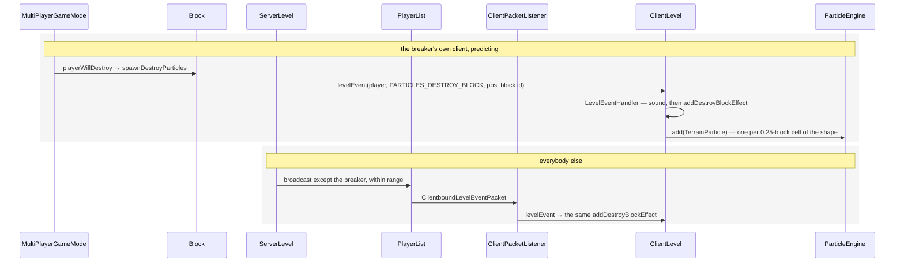

# Particles

> Verified against **Minecraft 26.2** · Part XI · a block breaks, and sixty-four textured quads appear — by two entirely different routes.

## Responsibility

Short-lived visual effects that live only on the client: smoke, flame,
break puffs, drips, splashes, redstone dust. The server can ask for them,
but it never owns one. This page is how a particle type becomes an
instance, what limits it, and how it reaches the screen.

The one sentence a player would recognise: *the puff of block texture
when you break something.*

The headline for a 1.21-era reader: **`ParticleEngine` no longer owns
providers, sprites, reloading or rendering.** Those became
`ParticleResources` and the extract/submit pipeline. *TextureSheetParticle*
is gone, the sheet-based `ParticleRenderType` constants are gone, and the
name `ParticleGroup` was reused for something completely different.

## The data it owns

- **`ParticleType`** and **`ParticleTypes`** — the registry, on both
  sides. `ParticleOptions` is the per-instance payload:
  `SimpleParticleType` for the parameterless majority, and
  `BlockParticleOption`, `ItemParticleOption`, `DustParticleOptions`,
  `ColorParticleOption`, `TrailParticleOption` and friends for the rest.
  `ParticleType.getOverrideLimiter` is the "ignore the settings" flag
  baked into the type.
- **`ParticleResources`** — a reload listener holding
  `ParticleResources.providers` (keyed by numeric registry id) and
  `ParticleResources.spriteSets`. `ParticleResources.registerProviders`
  is the one long list of registrations; `ParticleDescription` is the
  *particles/* JSON that names each type's textures, and `SpriteSet` is
  what a provider is handed.
- **`ParticleEngine`** — `ParticleEngine.particles`, a map from
  `ParticleRenderType` to a `ParticleGroup`;
  `ParticleEngine.particlesToAdd`, the one-tick deferral queue;
  `ParticleEngine.trackingEmitters`; and
  `ParticleEngine.trackedParticleCounts` against `ParticleLimit`. Its
  verbs are `ParticleEngine.createParticle`, `ParticleEngine.add`,
  `ParticleEngine.tick`, `ParticleEngine.extract`,
  `ParticleEngine.countParticles` and `ParticleEngine.clearParticles`.
- **`ParticleRenderType`** — now a record with four values:
  `ParticleRenderType.SINGLE_QUADS`, `.ITEM_PICKUP`,
  `.ELDER_GUARDIANS`, `.NO_RENDER`. `ParticleEngine.RENDER_ORDER` lists
  the three that draw.
- **`ParticleGroup`** — the per-render-type bucket, with
  `ParticleGroup.MAX_PARTICLES`, `ParticleGroup.RESERVOIR_SIZE` and
  `ParticleGroup.RESERVOIR_START`, and the four implementations
  `QuadParticleGroup`, `ItemPickupParticleGroup`,
  `ElderGuardianParticleGroup` and `NoRenderParticleGroup`.
- **`Particle`** — position, previous position, velocity,
  `Particle.age` against `Particle.lifetime`, `Particle.gravity`,
  `Particle.friction`, `Particle.hasPhysics`. `Particle.tick`,
  `Particle.move`, `Particle.remove`, `Particle.getLightCoords`,
  `Particle.getGroup` and `Particle.getParticleLimit`.
  `SingleQuadParticle` adds the sprite, colour, size, roll and a
  `SingleQuadParticle.Layer` — the record that replaced the old sheet
  constants, choosing atlas and pipeline by
  `SingleQuadParticle.Layer.bySprite`. `TerrainParticle` is the
  block-texture one.
- **The render state** — `ParticlesRenderState` holding one
  `ParticleGroupRenderState` per group, with `QuadParticleRenderState`
  packing twelve floats and two integers per particle into a per-layer
  store, and `QuadParticleFeatureRenderer` turning that into draws.

## When it runs

Everything is on the client thread. `ParticleEngine.tick` runs from
`Minecraft.tick`, right after the ambient-particle scatter, and only when
the level is running normally. `ParticleEngine.extract` runs per frame
from `LevelExtractor`. The only off-thread work is
`ParticleResources.reload`.

Interpolation between tick and frame happens at extract time: the
particle's previous and current positions are lerped by the partial tick
and made camera-relative before being packed.

## The trace: a block breaks

Both routes start at the same place — `Block.spawnDestroyParticles`
raising a level event with the breaker as the source — and diverge
because of who that source is.

Note what the prediction path does *not* do: it never goes through
`ClientLevel.addParticle`, so it skips the distance check and the
particle-setting check entirely. That is why break particles always
appear, at any setting.

Two nearby routes worth naming. The *crack* particles while you are
mining come from `ClientLevel.addBreakingBlockEffect`, called per frame
from the attack handler and never networked at all. And everything
scripted — explosions, the `/particle` command — arrives as
`ClientboundLevelParticlesPacket` and goes through
`ClientLevel.addParticle` once per requested count, with Gaussian spread.

## Interfaces

- **Called by:** `ClientLevel` (from level events, packets, and
  `ClientLevel.animateTick`), `LevelExtractor` for the per-frame extract.
- **Calls into:** the particle atlas via `ParticleResources`;
  [blaze3d](blaze3d.md) for the draws.
- **Crosses the network as:** `ClientboundLevelParticlesPacket` (an
  explicit request, with count, spread, speed and two override flags) and
  `ClientboundLevelEventPacket` (an event the client interprets).
- **Data-driven by:** *particles/* JSON naming each type's textures.
  Nothing else — the behaviour of every particle is Java.

## Invariants and surprises

- **Block-break particles ignore both the distance cull and the particle
  setting**, because they are added directly to the engine rather than
  through the level's gated entry point. The same puff arriving as a
  particle *packet* would be culled.
- **"Minimal" means none, and "decreased" is a dice roll.** The decreased
  setting is rewritten to minimal about a third of the time, and minimal
  drops everything. The "always show" flag rescues a minimal setting only
  rarely, and that rescue lands on decreased, which is re-rolled.
- **There are two independent distance cutoffs.** The server refuses to
  send a particle packet beyond a modest radius; the client independently
  drops anything too far from the camera. The override-limiter flag skips
  the setting *and* both range checks.
- **The cap is per render type, not global** — and the last quarter of it
  is probabilistic, with acceptance falling off as the square of the
  remaining headroom. Since almost everything is a single quad, that is
  effectively the whole budget; the other three groups have their own.
- **`ParticleLimit` exists and has exactly one instance.** The whole
  per-type accounting machinery serves one particle type.
- **Particles are culled by a point, against a frustum walked backwards.**
  The test uses the particle's centre, not its quad, and the frustum's
  origin is slid a few blocks behind the camera so particles just behind
  the near plane survive. Two of the four groups accept a frustum and
  never use it.
- **Every quad particle is submitted twice per frame**, once into the
  solid bucket and once into the after-terrain bucket, and the feature
  renderer filters each by whether the layer is translucent. Opaque
  particles therefore draw before terrain-translucent geometry and
  translucent ones after.
- **The dedicated particle render target only exists under the
  transparency post chain**, and even then only translucent particles use
  it.
- **Adding a particle is deferred by up to a tick.** A particle created
  during rendering is invisible until the next tick has run.
- **A resource reload deletes every live particle** — necessarily, since
  they hold sprite references into the old atlas.
- **Ticking and extracting are both crash-report sites by design**: one
  misbehaving particle produces a named report rather than a bare
  exception.
- **The break puff's count is shape-driven.** The destroy effect walks
  every box of the block's collision shape on a fixed grid, so a full
  cube gives sixty-four particles and a torch a handful — and each one
  shows a different randomly-offset crop of the block's particle sprite,
  which is why the puff does not look tiled.
- **The ambient scatter is a fixed cost.** `ClientLevel.animateTick`
  samples over a thousand random block positions every tick regardless of
  what is there, most of which do nothing.
- **The server knows your particle setting and never uses it.** It is
  sent in the client information and stored on the player, but the
  particle broadcast filters only on dimension and distance.
- **Names a 1.21-era reader will hunt for and not find:**
  *TextureSheetParticle* (merged into `SingleQuadParticle`), the sheet
  `ParticleRenderType` constants (now `SingleQuadParticle.Layer`),
  *Particle.getRenderType* (now `Particle.getGroup`),
  *Particle.getLightColor* (now `Particle.getLightCoords`),
  *Particle.render* and *ParticleEngine.render* (now an *extract* method plus a
  feature renderer), *ParticleEngine.destroy* and *crack* (now on
  `ClientLevel`), every provider and sprite-set member on
  `ParticleEngine` (now on `ParticleResources`), and `ParticleGroup` as a
  limiter record (that is now `ParticleLimit`).

## Where to look

`ParticleEngine.tick` and `ParticleEngine.extract` — the engine is
small. `ParticleResources.registerProviders` for the catalogue,
`ClientLevel.doAddParticle` for the gating, `ClientLevel.addDestroyBlockEffect`
for the trace, and `SingleQuadParticle.Layer` for how a sprite picks its
pipeline.

---

*Rules: names, never code · how the system works, not how the code reads ·
newest version only · every backticked name passes `tools/verify_names.py`.*
