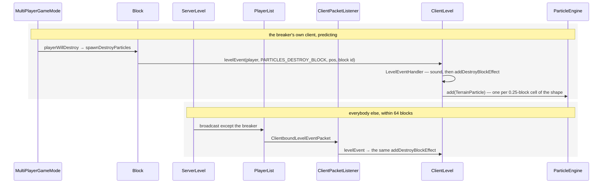

# Particles

> Verified against **Minecraft 26.2** · Part XI · a block breaks, and sixty-four textured quads appear — by two entirely different routes, neither of which asks your particle setting.

## Responsibility

Short-lived visual effects that live only on the client: smoke, flame,
break puffs, drips, splashes, redstone dust. The server can ask for them,
but it never owns one. This page is how a particle type becomes an
instance, what limits it, and how it reaches the screen.

The one sentence a player would recognise: *the puff of block texture
when you break something.*

The headline for a 1.21-era reader: **`ParticleEngine` no longer owns
providers, sprites, reloading or rendering.** Those became
`ParticleResources` and the extract/submit pipeline. *TextureSheetParticle*
is gone, the sheet-based `ParticleRenderType` constants are gone, and the
name `ParticleGroup` was reused for something completely different.

## The data it owns

- **`ParticleType`** and **`ParticleTypes`** — the registry, on both
  sides. `ParticleOptions` is the per-instance payload:
  `SimpleParticleType` for the parameterless majority, and
  `BlockParticleOption`, `ItemParticleOption`, `DustParticleOptions`,
  `ColorParticleOption`, `TrailParticleOption` and friends for the rest.
  `ParticleType.getOverrideLimiter` is the "ignore the settings" flag
  baked into the type.
- **`ParticleResources`** — a reload listener holding
  `ParticleResources.providers` (keyed by numeric registry id) and
  `ParticleResources.spriteSets`. `ParticleResources.registerProviders`
  is the one long list of registrations — about a hundred and thirty
  registration calls through two private overloads, the second of which
  also builds the `ParticleResources.MutableSpriteSet` a provider will be handed.
  `ParticleDescription` is the *particles/* JSON that names each type's
  textures, `SpriteSet` is what a provider reads (by index, at random, or
  `SpriteSet.first`), and `ParticleProvider.Sprite` is the sub-interface
  for the majority that produce a `SingleQuadParticle`.
- **`ParticleEngine`** — `ParticleEngine.particles`, a map from
  `ParticleRenderType` to a `ParticleGroup`;
  `ParticleEngine.particlesToAdd`, the one-tick deferral queue;
  `ParticleEngine.trackingEmitters`; and
  `ParticleEngine.trackedParticleCounts` against `ParticleLimit`. Its
  verbs are `ParticleEngine.createParticle`, `ParticleEngine.add`,
  `ParticleEngine.createTrackingEmitter`, `ParticleEngine.tick`,
  `ParticleEngine.extract`, `ParticleEngine.countParticles`,
  `ParticleEngine.setLevel` and `ParticleEngine.clearParticles`.
- **`TrackingEmitter`** — the thing the `ParticleEngine.trackingEmitters` queue holds,
  and not a particle you ever see: a `NoRenderParticle` bolted to a moving
  entity that spends its short life calling `ClientLevel.addParticle` for
  it. It lives in its own queue rather than in a `ParticleGroup`, so it is
  never counted, never culled and never extracted — it is only ticked.
  Crits, enchanted-hit sparkles and the totem burst are all emitters.
- **`ParticleRenderType`** — now a record with four values:
  `ParticleRenderType.SINGLE_QUADS`, `.ITEM_PICKUP`,
  `.ELDER_GUARDIANS`, `.NO_RENDER`. `ParticleEngine.RENDER_ORDER` lists
  the three that draw.
- **`ParticleGroup`** — the per-render-type bucket, with
  `ParticleGroup.MAX_PARTICLES`, `ParticleGroup.RESERVOIR_SIZE` and
  `ParticleGroup.RESERVOIR_START`, and the four implementations
  `QuadParticleGroup`, `ItemPickupParticleGroup`,
  `ElderGuardianParticleGroup` and `NoRenderParticleGroup`.
- **`Particle`** — position, previous position, velocity,
  `Particle.age` against `Particle.lifetime`, `Particle.gravity`,
  `Particle.friction`, `Particle.hasPhysics`. `Particle.tick`,
  `Particle.move`, `Particle.remove`, `Particle.getLightCoords`,
  `Particle.getGroup` and `Particle.getParticleLimit`, plus the
  construction-time knobs `Particle.setPower`, `Particle.scale`,
  `Particle.setParticleSpeed` and `Particle.LifetimeAlpha`.
  `SingleQuadParticle` adds the sprite, colour, size, roll, a
  `SingleQuadParticle.FacingCameraMode` and a
  `SingleQuadParticle.Layer`. `TerrainParticle` is the block-texture one.
- **`SingleQuadParticle.Layer`** — the record that replaced the old sheet
  constants. Six values: translucent-or-not × the three atlases the particle
  system draws from, resolving to one of two pipelines
  (`RenderPipelines.OPAQUE_PARTICLE`,
  `RenderPipelines.TRANSLUCENT_PARTICLE`).
  `SingleQuadParticle.Layer.OPAQUE` and `.TRANSLUCENT` are the particle
  atlas; `.OPAQUE_TERRAIN` / `.TRANSLUCENT_TERRAIN` the block atlas;
  `.OPAQUE_ITEMS` / `.TRANSLUCENT_ITEMS` the item atlas.
- **The render state** — `ParticlesRenderState` holding one
  `ParticleGroupRenderState` per group, with `QuadParticleRenderState`
  packing twelve floats and two integers per particle into a per-layer
  `QuadParticleRenderState.Storage` (a growable struct-of-arrays, reused
  and reset each frame rather than reallocated), and
  `QuadParticleFeatureRenderer` turning that into draws.

## When it runs

Everything is on the client thread. `ParticleEngine.tick` runs from
`Minecraft.tick`, right after the ambient-particle scatter, and only when
the level is running normally. `ParticleEngine.extract` runs per frame
from `LevelExtractor`. The only off-thread work is the load half of
`ParticleResources.reload`; the bind that rebuilds each `SpriteSet` comes
back to the client thread.

`ParticleEngine.tick` does three things in a fixed order: tick every
existing group, then tick the emitters, then drain
`ParticleEngine.particlesToAdd` into groups. That order is why a new
particle never moves on the tick it was created.

Interpolation between tick and frame happens at extract time: the
particle's previous and current positions are lerped by the partial tick
and made camera-relative before being packed.

## The trace: a block breaks

The two routes below are the *player breaking a block* case. Both start
at `Block.spawnDestroyParticles`, which raises level event
`LevelEvent.PARTICLES_DESTROY_BLOCK` with the breaker as the source, and
they diverge only because of who that source is.

**Neither route is gated.** Both end in `ClientLevel.addDestroyBlockEffect`,
which calls `ParticleEngine.add` directly and never goes through
`ClientLevel.addParticle` — so the distance check and the particle setting
apply to neither of them. The two branches differ only in who dispatches
the event, not in what the client then does with it.

And the breaker is not always a player. `LevelEvent.PARTICLES_DESTROY_BLOCK` has
fifteen call sites and only three pass a source at all; a fox eating a
berry bush, a rabbit trampling a crop, a sheep eating grass, a brush
finishing on a suspicious block and `Level.destroyBlock` itself all raise
it with a null source, which means the server broadcasts it to
*everybody* — including whoever caused it.

Two nearby routes worth naming. The *crack* particles while you are
mining come from `ClientLevel.addBreakingBlockEffect`, called once per
client **tick** from `Minecraft.continueAttack` by way of
`Minecraft.handleKeybinds`, and never networked at all. And the
`/particle` command arrives as `ClientboundLevelParticlesPacket` and goes
through `ClientLevel.addParticle` once per requested count with Gaussian
spread — unless the requested count is zero, which is a second mode
entirely: one particle whose velocity is the offset vector scaled by the
speed, which is how a directed particle is spawned.

## The other way a particle is born: explosions

Explosion particles do not travel as particle packets. `ServerLevel.explode`
sends a `ClientboundExplodePacket` carrying a radius, a block count and a
`WeightedList` of `ExplosionParticleInfo`, and
`ClientPacketListener.handleExplosion` hands that to
`ClientLevel.trackExplosionEffects` and the `ClientExplosionTracker`.

The tracker is a small budgeted particle *generator* of its own. Each
tick it totals the block counts of every explosion it is holding, caps
the result at `ClientExplosionTracker.MAX_PARTICLES_PER_TICK`, and draws
that many weighted samples: a random direction, a cube-root-distributed
radius so the samples fill the volume evenly, rejected outright if the
block there is not air. Each surviving sample picks an
`ExplosionParticleInfo` from the weighted list for its particle type, its
positional scaling and its speed multiplier. Then the whole list is
cleared, holding or not.

Its particle-setting behaviour is unlike anything else on this page:
anything short of *All* clears the pending explosions entirely. There is
no decreased tier for explosion block particles — they are on or off.

## Interfaces

- **Called by:** `ClientLevel` (from level events, packets, the ambient
  scatter and the precipitation scatter), `ClientPacketListener` and
  `LocalPlayer` (item-pickup particles and the tracking emitters),
  `LevelEventHandler`, and `LevelExtractor` for the per-frame extract.
  `DebugEntryParticleRenderStats` is the only reader of
  `ParticleEngine.countParticles`.
- **Calls into:** three atlases, not one — `ParticleResources` takes its
  sprites out of `AtlasManager`'s stitch results, and
  `QuadParticleFeatureRenderer` binds whichever of the particle, block or
  item atlas the layer names; [blaze3d](blaze3d.md) for the draws.
- **Crosses the network as:** `ClientboundLevelParticlesPacket` (an
  explicit request, with count, spread, speed and two override flags),
  `ClientboundLevelEventPacket` (an event the client interprets) and
  `ClientboundExplodePacket` (a description the client expands itself).
- **Data-driven by:** *particles/* JSON naming each type's textures; the
  weighted `ExplosionParticleInfo` list on an explosion; and
  `EnvironmentAttributes.AMBIENT_PARTICLES`, which is how a biome names
  its own ambient particles — see
  [environment attributes and timelines](../world/environment-attributes-and-timelines.md).
  Everything else about a particle's behaviour is Java.

## Invariants and surprises

- **Block-break particles ignore both the distance cull and the particle
  setting**, because both of their routes add to the engine directly
  rather than through the level's gated entry point. The same puff
  arriving as a particle *packet* would be culled. They are not alone:
  firework starters, item-pickup particles and the two crack effects
  bypass it the same way, eight call sites in all.
- **A block can opt out of the puff.**
  `BlockBehaviour.BlockStateBase.shouldSpawnTerrainParticles` gates both destroy and crack
  effects, and `TerrainParticle` additionally refuses air and
  `Blocks.MOVING_PISTON`.
- **"Minimal" means none, and "decreased" is a dice roll** — but only in
  `ClientLevel.doAddParticle`. The decreased setting is rewritten to
  minimal about a third of the time, and minimal drops everything; the
  "always show" flag rescues a minimal setting one time in ten, and that
  rescue lands on decreased, which is then re-rolled. Two other consumers
  read the same setting with different rules: the explosion tracker
  treats anything below *All* as off, and `ClientLevel.tickWeatherEffects`
  simply halves its column count on decreased.
- **The two distance cutoffs are the same distance, reached
  independently.** The server refuses to send a particle packet more than
  32 blocks from the player; the client independently drops anything
  further than 32 blocks from the *camera*. The override-limiter flag
  skips the client check entirely but only *widens* the server's, from 32
  blocks to 512. Level events — the break-puff route — use a third radius
  of 64.
- **The cap is per render type, not global** — and the last quarter of it
  is probabilistic: past `ParticleGroup.RESERVOIR_START`, a new particle
  is accepted with probability equal to the *square of the fraction of
  the reservoir still free*, so the last few hundred slots are very hard
  to fill. Since almost everything is a single quad, that is effectively
  the whole budget; the other three groups have their own.
- **`ParticleLimit` exists and has exactly one instance.** The whole
  per-type accounting machinery — a `ParticleLimit` key, a count map, a
  decrement when a group refuses an accepted particle — serves
  `ParticleLimit.SPORE_BLOSSOM` and nothing else.
- **Particles are culled by a point, against a frustum walked backwards.**
  The test uses the particle's centre, not its quad, and the frustum's
  origin is slid a few blocks behind the camera so particles just behind
  the near plane survive. Three of the four groups take a `Frustum` and
  ignore it; only `QuadParticleGroup` culls.
- **One group is ticked but never drawn.** `ParticleEngine.tick` iterates
  the whole group map, but `ParticleEngine.extract` iterates
  `ParticleEngine.RENDER_ORDER`, which has three entries. A
  `NoRenderParticleGroup` therefore ticks its contents forever and is
  never asked for a render state — which is exactly what a no-render
  particle is for.
- **The layer is chosen from the sprite's pixels, but only for three
  particle classes.** `SingleQuadParticle.Layer.bySprite` reads whether
  the stitched sprite actually contains translucent texels and picks the
  atlas from where the sprite lives — and only `TerrainParticle`,
  `BlockMarker` and `BreakingItemParticle` use it. Every other quad
  particle hard-codes `SingleQuadParticle.Layer.OPAQUE` or
  `SingleQuadParticle.Layer.TRANSLUCENT` on the
  particle atlas, so the four terrain and item layers exist solely for
  block- and item-textured particles.
- **A quad particle *group* is submitted twice per frame**, once into the
  solid bucket and once into the after-terrain bucket — the same render
  state object, entered twice, with the feature renderer filtering each
  entry by whether the layer is translucent. Opaque particles therefore
  draw before terrain-translucent geometry and translucent ones after.
  The per-particle packing happens once.
- **The dedicated particle render target only exists under the
  transparency post chain**, and even then only translucent particles use
  it.
- **Adding a particle is deferred by up to a tick.** A particle created
  during rendering is invisible until the next tick has run — and because
  `ParticleEngine.tick` drains the queue *last*, a particle never moves on
  the tick that admits it.
- **A resource reload deletes every live particle** — necessarily, since
  they hold sprite references into the old atlas. So does changing level:
  `ParticleEngine.setLevel` clears the particles and the emitters both.
- **Ticking and extracting are both crash-report sites by design**, but
  neither is on `ParticleEngine`: the reports are raised in
  `ParticleGroup.tickParticle` and `QuadParticleGroup.extractRenderState`,
  and a third in `ClientLevel.doAddParticle` for a provider that throws
  while constructing. A malformed particle arriving over the network is
  the one case that does *not* crash —
  `ClientPacketListener.handleParticleEvent` logs and drops it.
- **The break puff's count is shape-driven — from the outline shape, not
  the collision shape.** `ClientLevel.addDestroyBlockEffect` walks every
  box of `BlockBehaviour.BlockStateBase.getShape` on a fixed quarter-block grid with a
  minimum of two cells per axis, so a full cube gives sixty-four
  particles and a torch twelve — a torch has no collision shape at all,
  and would give none if the collision shape were what was read. Each
  particle shows a different randomly-offset quarter-crop of the block's
  sprite, which is why the puff does not look tiled.
- **A particle stops colliding if you throw it hard enough.**
  `Particle.move` skips the collision sweep above a fixed speed, and a
  particle that has once been stopped by a collision stays flagged.
- **The ambient scatter is a fixed cost.** `ClientLevel.animateTick`
  samples 1,334 random block positions every tick — 667 within 16 blocks
  and 667 within 32 — regardless of what is there, most of which do
  nothing. Riding on that same loop are the drip particles
  (`ClientLevel.trySpawnDripParticles`), the biome's
  `AmbientParticle` list, and the barrier/light **block markers**: in
  creative, holding one of those two items makes every matching block in
  range emit a marker particle, which is the only reason you can see
  them.
- **The server knows your particle setting and never uses it.** It is
  sent in the client information and stored on the player, but the
  particle broadcast filters only on dimension and distance.
- **One particle is not drawn by this system at all.**
  `ItemPickupParticle` carries an `EntityRenderState` and is submitted
  through `EntityRenderDispatcher` — the item flying into your inventory
  is a rendered entity wearing a particle's lifetime.
- **Names a 1.21-era reader will hunt for and not find:**
  *TextureSheetParticle* (merged into `SingleQuadParticle`), the sheet
  `ParticleRenderType` constants (now `SingleQuadParticle.Layer`),
  *Particle.getRenderType* (now `Particle.getGroup`),
  *Particle.getLightColor* (now `Particle.getLightCoords`),
  *Particle.render* and *ParticleEngine.render* (now an *extract* method plus a
  feature renderer), *ParticleEngine.destroy* and *crack* (now on
  `ClientLevel`), every provider and sprite-set member on
  `ParticleEngine` (now on `ParticleResources`), and `ParticleGroup` as a
  limiter record (that is now `ParticleLimit`).

## Where to look

`ParticleEngine.tick` and `ParticleEngine.extract` — the engine is
small. `ParticleResources.registerProviders` for the catalogue,
`ClientLevel.doAddParticle` for the gating, `ClientLevel.addDestroyBlockEffect`
for the trace, `ClientExplosionTracker.tick` for the one particle source
that budgets itself, and `SingleQuadParticle.Layer` for how a sprite
picks its pipeline.

---

*Rules: names, never code · how the system works, not how the code reads ·
newest version only · every backticked name passes `tools/verify_names.py`.*
