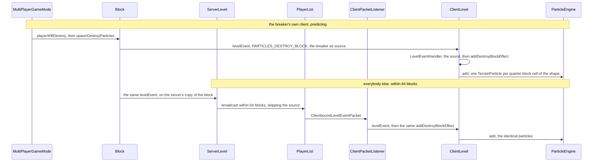
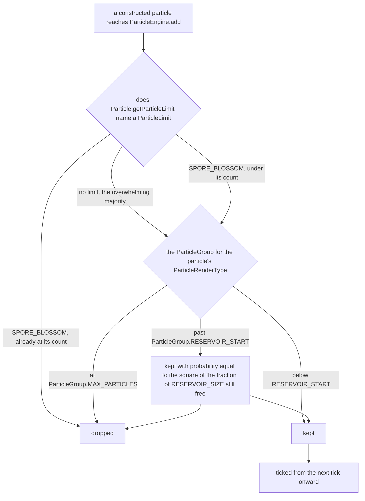

# Particles

> Verified against **Minecraft 26.2** · Part XI · A player breaks a block, and the puff of block texture appears on every screen within sixty-four blocks.

The block goes. On the breaker's own machine the puff is already there,
predicted, before the server has heard about the swing; on every other
machine within sixty-four blocks it arrives a moment later as a level event
and lands as the same sixty-four textured quads, built by the same method
from the same shape. Two entirely different routes, one visual result — and
the interesting thing is what neither route does. Neither asks how far away
you are. Neither asks whether the packet was worth sending. And neither asks
your particle setting, which three pieces of the client read three different
ways, while the server is told what you chose and never once acts on it. **A
particle is not something the game decides to show you. It is something that
survives a series of gates that disagree about what they are gating.**

## The cast

| class | what it decides | thread |
|---|---|---|
| `ServerLevel` | which players are told about a particle at all — on dimension and distance, nothing else | Server |
| `ParticleType` | the type's identity in the registry, and `ParticleType.getOverrideLimiter`, the "ignore the limits" flag baked into it | either |
| `ClientLevel` | the gated entry point, `ClientLevel.doAddParticle` — and the ungated ones beside it | Client |
| `ParticleResources` | which provider and which `SpriteSet` a type gets, rebuilt on every resource reload | load off-thread, bind on Client |
| `ParticleEngine` | the groups, the one-tick admission queue, the emitters, the per-type counts | Client |
| `ParticleGroup` | whether there is room: the per-render-type cap and the probabilistic reservoir | Client |
| `ClientExplosionTracker` | how many explosion particles happen this tick, and where — the client's own budgeted generator | Client |
| `SingleQuadParticle.Layer` | which of three atlases a quad reads, and which of two pipelines draws it | Client |

Everything below the first row runs on the client thread, and the only
off-thread work in the system is the load half of `ParticleResources.reload`
— the bind that rebuilds each `SpriteSet` comes back to the client thread.
Three things cross the network and none of them is a particle: a
`ClientboundLevelParticlesPacket` is an explicit request carrying count,
spread, speed and two override flags, a `ClientboundLevelEventPacket` is an
event the client interprets, and a `ClientboundExplodePacket` is a
description the client expands itself.

## Does the particle happen at all?

Both routes start in the same place. `Block.spawnDestroyParticles` raises
level event `LevelEvent.PARTICLES_DESTROY_BLOCK` with the breaker as the
source, and the two branches diverge only because of *who* that source is
relative to whoever is watching.

**Neither route is gated.** Both end in `ClientLevel.addDestroyBlockEffect`,
which calls `ParticleEngine.add` directly and never passes through
`ClientLevel.addParticle` — so neither the distance check nor the particle
setting applies to either of them. The branches differ in who dispatches the
event, not in what the client then does with it.

And the breaker is not always a player.
`LevelEvent.PARTICLES_DESTROY_BLOCK` has fifteen call sites and only three
pass a source at all. A fox eating a berry bush, a rabbit trampling a crop,
a sheep eating grass, a brush finishing on a suspicious block and
`Level.destroyBlock` itself all raise it with a null source — which means
the server broadcasts it to *everybody*, including whoever caused it.

**Sixty-four** — quads in a full cube's puff, because
`ClientLevel.addDestroyBlockEffect` walks every box of
`BlockBehaviour.BlockStateBase.getShape` on a fixed quarter-block grid with
a minimum of two cells per axis.

That is the *outline* shape, not the collision shape, and the difference is
visible: a torch has no collision shape at all and still gives twelve
particles, where reading the collision shape would give none. Each particle
shows a different randomly-offset quarter-crop of the block's sprite, which
is why the puff does not look tiled. A block may opt out of the whole thing
— `BlockBehaviour.BlockStateBase.shouldSpawnTerrainParticles` gates both the
destroy and the crack effects — and `TerrainParticle` additionally refuses
air and `Blocks.MOVING_PISTON`.

### Three neighbours that look like the same thing

The *crack* particles that fly off while you are still mining come from
`ClientLevel.addBreakingBlockEffect`, called once per client **tick** from
`Minecraft.continueAttack` by way of `Minecraft.handleKeybinds`, and never
networked at all — your neighbour's screen shows their own crack particles,
computed locally, not yours. The `/particle` command arrives as
`ClientboundLevelParticlesPacket` and goes through `ClientLevel.addParticle`
once per requested count with Gaussian spread, unless the requested count is
zero, which is a second mode entirely: one particle whose velocity is the
offset vector scaled by the speed, which is how a *directed* particle is
spawned. And the ambient scatter is a fixed cost paid every tick regardless
of what is there — `ClientLevel.animateTick` samples 1,334 random block
positions, 667 within sixteen blocks and 667 within thirty-two, most of
which do nothing. Riding on that one loop are the drip particles
(`ClientLevel.trySpawnDripParticles`), the biome's `AmbientParticle` list
named by `EnvironmentAttributes.AMBIENT_PARTICLES`
([environment attributes and timelines](../world/environment-attributes-and-timelines.md)),
and the barrier and light **block markers** — in creative, holding one of
those two items makes every matching block in range emit a marker particle,
which is the only reason you can see them.

## Who is allowed to see it?

There are three distance rules, they are enforced by three different pieces
of code, and two of them happen to be the same number.

| the gate | measured from | the distance | what `ParticleType.getOverrideLimiter` does to it |
|---|---|---|---|
| the server choosing whom to send a `ClientboundLevelParticlesPacket` to | the receiving player | 32 blocks | *widens* it, to 512 |
| the client deciding whether to build the particle at all, in `ClientLevel.doAddParticle` | the **camera** | 32 blocks | skips the check entirely |
| the server broadcasting a level event — the break puff's second route | the receiving player | 64 blocks | not consulted: a level event carries no particle type |
| `ClientLevel.addDestroyBlockEffect`, and everything else that hands `ParticleEngine.add` a finished particle | — | none | nothing to override |

The two thirty-twos are independent, not one check written twice. A particle
that clears the server's test can still be dropped by the client's, because
the client measures from where you are *looking* rather than from where your
feet are, and a packet that took a tick to arrive is measured against a
camera that has since moved. The override flag is the tell that these are
separate mechanisms: one of them it deletes outright, the other it multiplies
by sixteen.

The 64-block radius is the third rule, and nothing overrides it in either
direction. Once a level event lands the client asks no further questions,
which is why a break puff at the edge of view is unconditional where the
same particle requested by `/particle` would never have been sent.

## Does the setting apply?

Three pieces of the client read the same particle setting, and none of them
agrees with the others about what its values mean.

| who reads it | what it does |
|---|---|
| `ClientLevel.doAddParticle` | *decreased* is rewritten to *minimal* about a third of the time, and *minimal* drops everything — except that the always-show flag rescues a *minimal* setting one time in ten, and the rescue lands on *decreased*, which is then re-rolled |
| `ClientExplosionTracker` | anything below *All* is off. The pending explosions are cleared unused, and there is no decreased tier for explosion block particles at all |
| `ClientLevel.tickWeatherEffects` | on *decreased*, halves its column count. Rain does not stop, it thins |

Only the first of those is the gate everything is nominally supposed to go
through, and **eight call sites bypass it entirely** by handing a
constructed particle straight to `ParticleEngine.add`: block-break particles
by both of their routes, both crack effects, firework starters and
item-pickup particles among them. The same puff arriving as a particle
*packet* would be distance-culled and might be diced away by the setting.
Arriving as a level event, it is unconditional.

The last piece reads like a bug and is not. **The server knows your particle
setting and never uses it.** It arrives in the client information and is
stored on the player, and the broadcast filters on dimension and distance
and nothing else — so turning particles down saves your GPU and costs the
server exactly nothing.

## Is there room for it?

Explosions are the one source that budgets itself before it asks anyone
else, and they are not a particle packet at all. `ServerLevel.explode` sends
a `ClientboundExplodePacket` carrying a radius, a block count and a
`WeightedList` of `ExplosionParticleInfo`, and
`ClientPacketListener.handleExplosion` hands that to
`ClientLevel.trackExplosionEffects` and the `ClientExplosionTracker`. Each
tick the tracker totals the block counts of every explosion it is holding,
caps the result at `ClientExplosionTracker.MAX_PARTICLES_PER_TICK`, and draws
that many weighted samples: a random direction, a cube-root-distributed
radius so the samples fill the volume evenly, rejected outright if the block
there is not air. Each survivor picks an `ExplosionParticleInfo` from the
weighted list for its type, its positional scaling and its speed multiplier.
Then the whole list is cleared, spent or not.

Everything else meets the engine's own two limits.

The cap is per render type, not global, and the last quarter of it is
probabilistic: past `ParticleGroup.RESERVOIR_START` the acceptance
probability falls as the square of the free fraction, so the last few
hundred slots are very hard to fill and a particle storm degrades gradually
rather than hitting a wall. Since almost everything is a
`ParticleRenderType.SINGLE_QUADS` particle, that one group's budget is
effectively the whole budget; the other three groups have their own.

The per-type machinery beside it is the strangest thing in the system.
`ParticleLimit` is a full accounting apparatus — a key carried by the
particle, a count map in `ParticleEngine.trackedParticleCounts`, a decrement
when a group refuses a particle the limit had already accepted — and it has
**exactly one instance**, `ParticleLimit.SPORE_BLOSSOM`. The whole mechanism
exists to hold down one kind of falling petal. The counts it keeps are
totalled by `ParticleEngine.countParticles`, whose only consumer is
`DebugEntryParticleRenderStats` on the debug screen.

## When does it move, and when is it drawn?

Admission is deferred by up to a tick. `ParticleEngine.add` puts the
particle in `ParticleEngine.particlesToAdd`, and `ParticleEngine.tick` —
which runs from `Minecraft.tick`, right after the ambient scatter, and only
while the level is running normally — does three things in a fixed order:
tick every existing group, then tick the emitters, then drain the queue into
groups. Because the drain is *last*, a particle never moves on the tick that
admits it, and a particle created during rendering is invisible until a tick
has run.

The emitters are the exception to almost everything. A `TrackingEmitter` is
a `NoRenderParticle` bolted to a moving entity, spending its short life
calling `ClientLevel.addParticle` on that entity's behalf — crits, the
enchanted-hit sparkles and the totem burst are all emitters. It lives in
`ParticleEngine.trackingEmitters` rather than in a `ParticleGroup`, so it is
never counted, never culled and never extracted. It is only ticked. So is a
`NoRenderParticleGroup`: `ParticleEngine.tick` iterates the whole group map,
but `ParticleEngine.extract` iterates `ParticleEngine.RENDER_ORDER`, which
lists three of the four render types, so a no-render group ticks its
contents forever and is never asked for a render state. Which is exactly
what a no-render particle is for.

Everything visible happens at extract time, once per frame, from
`LevelExtractor`. That is where the particle's previous and current
positions are lerped by the partial tick and made camera-relative before
being packed — interpolation is not a property of the particle, it is a
property of the extract. It is also where the culling happens, and the cull
is a point test: the particle's centre, not its quad, against a `Frustum`
whose origin has been slid a few blocks *behind* the camera so that
particles just past the near plane survive. Three of the four groups take a
`Frustum` and ignore it. Only `QuadParticleGroup` culls.

What survives is packed into `ParticlesRenderState`, one
`ParticleGroupRenderState` per group, with `QuadParticleRenderState` writing
twelve floats and two integers per particle into a per-layer
`QuadParticleRenderState.Storage` — a growable struct-of-arrays, reset and
reused each frame rather than reallocated — and
`QuadParticleFeatureRenderer` turning that into draws through
[Blaze3D](blaze3d.md). The layer decides which atlas is bound, and the
particle system draws from three of them, not one:

| the sprite lives on | opaque | translucent |
|---|---|---|
| the particle atlas | `SingleQuadParticle.Layer.OPAQUE` | `SingleQuadParticle.Layer.TRANSLUCENT` |
| the block atlas | `SingleQuadParticle.Layer.OPAQUE_TERRAIN` | `SingleQuadParticle.Layer.TRANSLUCENT_TERRAIN` |
| the item atlas | `SingleQuadParticle.Layer.OPAQUE_ITEMS` | `SingleQuadParticle.Layer.TRANSLUCENT_ITEMS` |

The six resolve to two pipelines, `RenderPipelines.OPAQUE_PARTICLE` and
`RenderPipelines.TRANSLUCENT_PARTICLE`. `SingleQuadParticle.Layer.bySprite`
picks a row and a column by reading whether the stitched sprite actually
contains translucent texels and which atlas the sprite lives on — and only
three particle classes ever ask it: `TerrainParticle`, `BlockMarker` and
`BreakingItemParticle`. Every other quad particle hard-codes opaque or
translucent on the particle atlas, so the four terrain and item layers exist
solely for block- and item-textured particles
([models and atlases](models-and-atlases.md)).

The last surprise is in the submission. **A quad particle group is submitted
twice per frame** — once into the solid bucket and once into the
after-terrain bucket, the same render state object entered twice, with the
feature renderer filtering each entry by whether the layer is translucent.
Opaque particles therefore draw before terrain-translucent geometry and
translucent ones after, and the per-particle packing still happens only
once. The dedicated particle render target exists only under the
transparency post chain, and even then only translucent particles use it
([visibility and the frame graph](visibility-and-the-frame-graph.md)). One
particle escapes this system entirely: `ItemPickupParticle` carries an
`EntityRenderState` and is submitted through `EntityRenderDispatcher`, so
the item flying into your inventory is
[a rendered entity](entity-rendering.md) wearing a particle's lifetime.

Two events empty the engine wholesale, and both have to.
`ParticleEngine.clearParticles` runs on a resource reload, because every
live particle holds a sprite reference into an atlas that no longer exists,
and `ParticleEngine.setLevel` clears the particles and the emitters both.
Particles are crash-report sites by design, though none of the reports is
raised on `ParticleEngine`: they come from `ParticleGroup.tickParticle`,
from `QuadParticleGroup.extractRenderState`, and from
`ClientLevel.doAddParticle` for a provider that throws while constructing.
The one malformed particle that does *not* crash is the one arriving over
the network — `ClientPacketListener.handleParticleEvent` logs it and drops
it. And `Particle.move` skips the collision sweep above a fixed speed, so a
particle thrown hard enough stops colliding with the world altogether, while
one that has been stopped by a collision once stays flagged as stopped.

> **For a 1.21-era reader.** `ParticleEngine` no longer owns providers,
> sprites, reloading or rendering — those became `ParticleResources` and the
> extract-plus-feature-renderer pipeline, and every provider and sprite-set
> member moved off the engine. *TextureSheetParticle* merged into
> `SingleQuadParticle`; the sheet-based `ParticleRenderType` constants became
> `SingleQuadParticle.Layer`, leaving `ParticleRenderType` a record with four
> values; *Particle.getRenderType* is `Particle.getGroup`;
> *Particle.getLightColor* is `Particle.getLightCoords`; *Particle.render*
> and *ParticleEngine.render* are an extract method plus
> `QuadParticleFeatureRenderer`; *ParticleEngine.destroy* and *crack* are on
> `ClientLevel`. And the name `ParticleGroup` was reused for something
> completely different: it is the per-render-type bucket now, and the limiter
> record it used to be is `ParticleLimit`.

## Where to look

`Block.spawnDestroyParticles` · `ClientLevel.addDestroyBlockEffect` ·
`ClientLevel.addBreakingBlockEffect` · `ClientLevel.doAddParticle`, the gate
everything else bypasses · `ClientLevel.animateTick` ·
`ClientExplosionTracker.tick` · `ParticleEngine.add` · `ParticleEngine.tick` ·
`ParticleEngine.extract` · `ParticleGroup.MAX_PARTICLES` · `ParticleLimit` ·
`ParticleResources.registerProviders` for the catalogue ·
`SingleQuadParticle.Layer.bySprite` · `QuadParticleFeatureRenderer`

---

*Rules: names, never code · how the system works, not how the code reads ·
newest version only · every backticked name passes `tools/verify_names.py`.*
