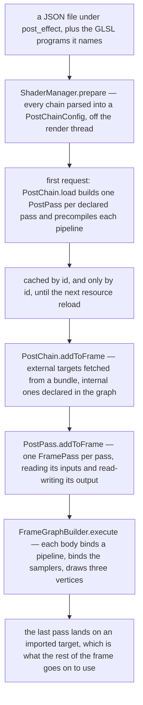
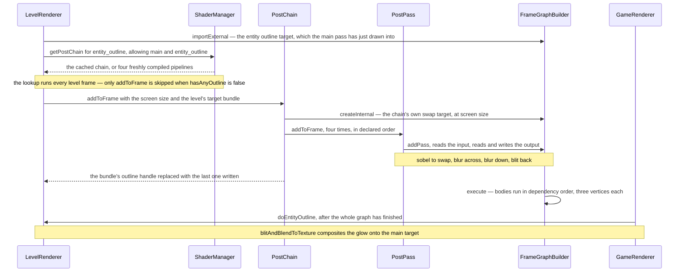

# Post-processing

> Verified against **Minecraft 26.2** · Part XI · you press Escape and the world goes soft behind the menu — and the machine that softened it is the one that turns everything green when you spectate a creeper.

The blur behind the pause menu is not a GUI effect. It is a *post-processing
chain*: a file called *blur.json*, sitting in the jar beside *creeper.json*,
in the same format, loaded by the same loader, compiled into the same kind of
object and run by the same three classes. Six such files ship, covering the
pause menu, the three things it is unpleasant to spectate, the glow around a
spectral-arrowed mob and the option that sorts water against particles. A
resource pack can rewrite every one of them. What it cannot do is add a
seventh, because every chain this game will ever load is named by a constant
in Java, and there are only six of those.

## The cast

| class | what it decides | thread |
|---|---|---|
| `PostChainConfig` | what a chain is as data: its own targets, and its passes in order | parsed on a worker |
| `ShaderManager` | which chains exist, when they are compiled, and when they are thrown away | prepare on a worker, everything else on the render thread |
| `PostChain` | which targets a pass may name, and where a pass's output lives | Render thread |
| `PostPass` | one draw: a pipeline, its inputs as samplers, its uniforms as buffers | Render thread |
| `UniformValue` | the seven types a JSON-declared uniform may have, and how each is packed | Render thread |
| `LevelTargetBundle` | the seven names the level's targets answer to, and which set a chain may ask for | Render thread |
| `LevelRenderer` | the two chains that become passes in the world's own frame graph | Render thread |
| `GameRenderer` | the four chains that get a frame graph of their own, built and thrown away on the spot | Render thread |

## From a file on disk to a pass in a graph

Read it as **parse, compile, declare, draw**, and note that the halves live
in different phases of the client's life: the parse belongs to a resource
reload, and everything from *addToFrame* onward happens inside a frame, every
frame, for as long as the effect is on.

## What a chain declares, and the two kinds of name in it

A `PostChainConfig` is two things: a map of *targets* it wants for itself,
and a list of *passes* in the order they run. That is the entire schema.

Each pass names a vertex program and a fragment program by `Identifier`, an
output target, a list of inputs and a map of uniform blocks. An input is one
of exactly two shapes: `PostChainConfig.TargetInput` names another target and
may ask for its depth attachment rather than its colour, and
`PostChainConfig.TextureInput` names a PNG under *textures/effect* with its
dimensions. Both carry a *sampler name*, and two inputs on one pass sharing
one is rejected by the codec while the file is being parsed — so the chain
never reaches the config map at all, rather than failing later when something
asks for it — and that name is the contract with the GLSL —
`PostChain` appends *Sampler* to it when it builds the pass's
`BindGroupLayout`, so an input called *In* is the shader's *InSampler*.

The distinction that matters is between the two kinds of target name. A name
in the chain's own *targets* map is **internal**: it belongs to the chain, is
created fresh inside the frame graph at screen size unless the chain
overrides that, and is gone when the graph finishes. Any other name is
**external** and must be supplied by whoever runs the chain.
`PostChainConfig.Pass.referencedTargets` collects both kinds,
`PostChain.load` subtracts the internal ones, and what remains must be a
subset of the allowed set the caller passed in —
`LevelTargetBundle.MAIN_TARGETS`, `LevelTargetBundle.OUTLINE_TARGETS` or
`LevelTargetBundle.SORTING_TARGETS`, one, two or six names. A chain naming a
target its caller did not offer does not load at all. An internal target may
also be declared *persistent*, in which case `PostChain` allocates it once,
keeps it in `PostChain.persistentTargets` and imports it rather than creating
it, so a pass can read what it wrote last frame. None of the six asks for
one.

## Loaded off-thread, compiled inside a frame

`ShaderManager` is a `SimplePreparableReloadListener`, so its two halves run
in two places. `ShaderManager.prepare` runs on the reload's worker executor:
it reads every GLSL source under *shaders*, resolves each source's
*moj_import* directives through `GlslPreprocessor`, and parses every JSON
under *post_effect* with `PostChainConfig.CODEC` into an immutable map — a
malformed chain is logged and simply absent from it. `ShaderManager.apply`
then runs on the render thread, clears the device's pipeline cache,
precompiles every statically registered pipeline and, only if all of them
succeeded, swaps in a new `ShaderManager.CompilationCache` and closes the
old.

Post chains are not in that precompiled set. They are built lazily, the first
time somebody asks: `ShaderManager.getPostChain` consults the cache, and on a
miss `PostChain.load` walks the config, builds a `RenderPipeline` per pass
from `RenderPipelines.POST_PROCESSING_SNIPPET`, names it *chain id* slash
*pass index*, and precompiles it there and then. **The first frame you
spectate a creeper compiles two shader programs in the middle of itself.** A
failure throws `ShaderManager.CompilationException`, which
`ShaderManager.getPostChain` logs, caches as a permanent absence so the next
frame does not try again, and reports to
`Minecraft.triggerResourcePackRecovery` — the path that disables a resource
pack that broke the game. Closing the old cache, meanwhile, closes every
`PostChain` in it, destroying its persistent targets and freeing each
`PostPass`'s uniform buffers: a reload does not rebuild the chains, it
forgets them.

## A pass is three vertices, and its uniforms are written once, at load

`PostPass.addToFrame` adds one `FrameGraphBuilder.addPass` named after its
pipeline's location. Every target input becomes a `FramePass.reads`, the
output a `FramePass.readsAndWrites`, and the body goes in through
`FramePass.executes` — nothing is drawn while the graph is built.

When the body eventually runs, it sets an orthographic projection —
`ShaderManager` keeps one `Projection` and one `ProjectionMatrixBuffer` and
lends them to every chain — writes the output size and each input's size into
a `MappableRingBuffer` as the *SamplerInfo* block, then opens a `RenderPass`,
binds pipeline, default uniforms, custom uniform blocks and inputs, and draws.

**Three** — vertices in every post-processing draw, in all twenty-six passes
the six chains declare (`PostPass.addToFrame`). There is no quad and no
vertex buffer: the shared vertex program builds one oversized triangle out of
the vertex index alone, and the fragment shader sees the whole screen.

The uniforms are stranger than they look. A `UniformValue` has seven types —
int, ivec3, float, vec2, vec3, vec4 and a 4×4 matrix — and a block is a list
of them under a name. `PostPass`'s constructor sizes the block with
`UniformValue.addSize`, packs it with `UniformValue.writeTo` and uploads it
to a `GpuBuffer` **once**, at load, never to be written again. The per-entry
*name* in the JSON is read by no codec — only the type and the value are, and
members match the GLSL block positionally. Only the block's own name, the key
in the uniforms map, has to match anything.

That is why the blur's radius is not one of them. *blur.json* declares a
radius of zero, and *box_blur* treats zero as "ask elsewhere": it falls back
to a member of the *Globals* block, which `GlobalSettingsUniform.update`
rewrites every frame from `OptionsRenderState.menuBackgroundBlurriness` and
`RenderSystem.bindDefaultUniforms` binds to every post pass. **Anything a
chain needs to vary per frame cannot be a chain uniform.** It has to come in
through the global block, whose seven members are fixed in Java.

## The six chains

| chain | who declares it | what it reads | what a player sees |
|---|---|---|---|
| *blur* | `GameRenderer.processBlurEffect`, called from inside `GuiRenderer.draw` | the main target and one internal target, six passes alternating between them | the world going soft behind a pause or options screen |
| *creeper* | `GameRenderer.render`, when the camera entity is a `Creeper` | the main target, and one internal target it bounces through | luminance collapsed into the green channel, then posterised and mosaicked |
| *spider* | `GameRenderer.render`, when it is a `Spider` | the main target and four internal targets | the view repeated through several skewed, blurred, red-tinted lobes |
| *invert* | `GameRenderer.render`, when it is an `EnderMan` | the main target, and one internal target it bounces through | colours inverted, four fifths of the way |
| *entity_outline* | `LevelRenderer.render`, when anything submitted an outline this frame | the entity-outline target — and never the main one | the coloured halo around a glowing mob |
| *transparency* | `LevelRenderer.render`, when improved transparency is on | **six** of the caller's targets, colour **and** depth, and just one internal target of its own | water, particles, clouds and rain layered in the right order |

Only one of those is a screen effect. *blur* runs over whatever is currently
on the main target, world and GUI alike, because `GuiRenderer.draw` splits the
GUI in two and runs this chain in the gap. Where that boundary falls, who asks
for it and why a chest does not is [the GUI render
tree](../client/the-gui-render-tree.md#blur-is-a-barrier-and-it-is-fussy)'s;
what this page owns is that the thing running in the gap is an ordinary post
chain over the main target, with nothing about it that knows it is a menu.

Three are world effects: *creeper*, *spider* and *invert* run at the end of
`GameRenderer.render`'s world block, after the level and before any GUI, so
they warp the world and leave the HUD alone. The last two are neither.
*entity_outline* never touches the main target — it reads and writes an
offscreen glow buffer that something else composites — and *transparency* is
not a filter over a picture at all but the step that *makes* the picture,
merging six separately rendered layers by depth.
`GameRenderState.useShaderTransparency` gates it on
`OptionsRenderState.improvedTransparency` and on not being in panoramic mode,
and when it is off `LevelRenderer` never creates those five targets, so
everything draws into the main one and sorts by luck.

## The outline chain, end to end

Take the one whose whole life is visible. A mob is glowing, so something
submits it to `SubmitNodeCollection.outline`, and
`FeatureRenderDispatcher.PreparedFrame.executeOutline` draws it — flat, in
the glow colour — into the entity-outline target during the main pass. That
target is a `TextureTarget` `LevelRenderer` owns across frames.

The first pass is an edge detector and what it detects edges in is **alpha**,
not colour: the target is transparent everywhere nothing was submitted, so
the boundary of the silhouette is the boundary of the halo. The next two blur
that outline across and then down, and the last blits it back where it
started — the chain ends on the same external target its first pass read, and
the internal *swap* target is what makes that legal, since no pass ever reads
and writes one buffer at once. Then it stops, and the compositing is somebody
else's job. `LevelRenderer.doEntityOutline` runs after
`GameRenderer.renderLevel` returns, outside the graph entirely, and blends
the glow onto the main target with a pipeline of its own. This is the one
chain whose result is invisible until a separate blit puts it on screen.

## Two doors into the GPU, and one of them is deprecated

`PostChain` has two entry points, and which one a chain goes through is the
whole difference between the two halves of this page.

`PostChain.addToFrame` takes a `FrameGraphBuilder` somebody else already
started and appends to it. That is what `LevelRenderer` does with the outline
and transparency chains: they are not a second rendering path but more passes
in [the graph it was building anyway](visibility-and-the-frame-graph.md),
ordered by their declared reads and writes alongside the sky, the terrain,
the clouds and the weather. They survive that graph's culling for the
ordinary reason — their last pass writes a target imported from outside — and
they appear in the profiler under their pipeline names, because the level's
graph is executed with an inspector that pushes a zone per pass.

`PostChain.process` is the other door, and it is marked deprecated. It builds
a `FrameGraphBuilder` of its own, imports one target as *main*, adds the
chain, executes it and throws it away. Both its callers are in
`GameRenderer`: the camera-entity effect at the end of the world block, and
`GameRenderer.processBlurEffect` in the middle of the GUI.
Neither passes an inspector, so **the blur and the spectator shaders never
get a slice of the F3 pie chart to themselves**: their cost is folded into
whichever enclosing zone they ran under, *render → world* for the spectator
effects and *render → gui → draw* for the blur, and no name in the chart
tells you a post chain is what you are looking at. The graphs are throwaway but the
memory is not: both doors take internal targets from the one
`CrossFrameResourcePool`, which holds a released target for three frames in
case something asks again for that size and format.

## Questions players ask

**Can a resource pack add a post effect?** It can add the *file*, the game
will parse it, and nothing will ever run it. `ShaderManager.getPostChain` is
called with six ids: three constants in `LevelRenderer` and `GameRenderer`,
three built inside `GameRenderer.checkEntityPostEffect` from the camera
entity's class. No registry, no data-driven selection, no command. What a
pack *can* do is replace any of the six, with as many passes as it likes,
running fragment programs it also ships under *shaders/post* — a real and
underused amount of rope.

**Why does the creeper effect vanish when I press F5?** Because third person
clears it, and the perspective key does it directly.
`GameRenderer.checkEntityPostEffect` switches on the camera entity's class,
sets `GameRenderer.postEffectId` for a creeper, a spider or an enderman, and
clears it for anything else — including for no entity at all. The perspective
key calls it straight out of `Minecraft.handleKeybinds`;
`Minecraft.setCameraEntity` is the other door into the same method, for when
what you are spectating changes rather than how. F4 (`Options.keyToggleSpectatorShaderEffects`) is a separate
switch, flipping `GameRenderer.effectActive` without forgetting which chain
was chosen, and the F3 screen names the survivor through
`DebugEntryPostEffect`.

**What happens to a chain when the window is resized?** Nothing. A
`PostChain` has no size of its own: the dimensions arrive as arguments to
`PostChain.addToFrame` every frame, and internal targets are described fresh
from them each time. `GameRenderer.resize` clears the resource pool so the
old targets are not handed back, and `LevelRenderer.resize` resizes the
entity-outline target it owns. The compiled pipelines never mention a
resolution, so they are untouched.

> **For a 1.21-era reader.** *ShaderInstance*, *EffectInstance*, *Effect* and
> *AbstractUniform* are gone, and `Uniform` survives only as an OpenGL-backend
> detail no post chain ever names: a post pass's uniforms are
> `UniformValue` records packed into a `GpuBuffer` with `Std140Builder`, and
> everything else is bound by `RenderSystem.bindDefaultUniforms`.
> *PostChain.process* still exists, but it is deprecated and both its callers
> build a throwaway frame graph — `PostChain.addToFrame` is the real one.
> *PostChain.resize*, *PostChain.getTempTarget* and `PostChain`'s whole
> bookkeeping of named render targets are gone, because the frame graph
> allocates them now. And *Fabulous* is no longer a mode anything reads: it
> survives as one of four `GraphicsPreset` values, but a preset only *writes*
> the individual options and is then forgotten, so what actually gates the
> transparency chain is `Options.improvedTransparency` — which
> `GraphicsPreset.FABULOUS` sets true everywhere except macOS.

## Where to look

`PostChainConfig` first — the record *is* the file format. Then
`ShaderManager.prepare` and `ShaderManager.getPostChain` for where a chain
comes from and how long it lives, `PostChain.load` for the validation that
decides whether it loads at all, and `PostChain.addToFrame` for the only
thing a chain does. `PostPass` is one pass and one draw. For the callers,
`LevelRenderer.render` declares two chains into the world's frame graph,
`GameRenderer.render` and `GameRenderer.processBlurEffect` run the other four
through the deprecated door, and `LevelTargetBundle` names what any may ask.

---

*Rules: names, never code · how the system works, not how the code reads ·
newest version only · every backticked name passes `tools/verify_names.py`.*
