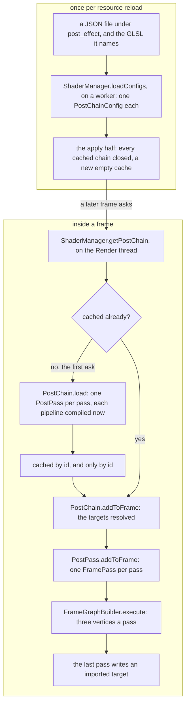
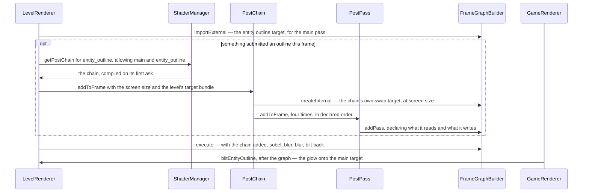

# Post-processing

> Verified against **Minecraft 26.3** · Part XI · you press Escape and the world goes soft behind the menu — and the machine that softened it is the one that turns everything green when you spectate a creeper.

The blur behind the pause menu is not a GUI effect. It is a *post-processing
chain*: a file called *blur.json*, sitting in the jar beside *creeper.json*,
in the same format, loaded by the same loader, compiled into the same kind of object and run by the same two classes, `PostChain` and `PostPass`. Five such files ship, covering the
pause menu, the three things it is unpleasant to spectate and the glow around
a spectral-arrowed mob. A resource pack can rewrite every one of the five,
with as many passes as it likes, running fragment programs it also ships — a
real and underused amount of rope. It can also add a sixth: the list of
chains run over the world every frame starts with *end_of_frame*, and no file
in the jar answers to that name.

## The cast

| class | what it decides | thread |
|---|---|---|
| `PostChainConfig` | what a chain is as data: its own targets, and its passes in order | parsed on a worker |
| `ShaderManager` | which chains exist, when they are compiled, and when they are thrown away | configs read and pipelines compiled on workers (a chain's while the Render thread waits), the rest on the Render thread |
| `PostChain` | which targets a pass may name, and where a pass's output lives | Render thread |
| `PostPass` | one draw: a pipeline, its inputs as samplers, its uniforms as buffers | Render thread |
| `UniformValue` | the seven types a JSON-declared uniform may have, and how each is packed | decoded on a worker, packed on the Render thread |
| `LevelTargetBundle` | the two names the level's targets answer to, and which set a chain may ask for | Render thread |
| `LevelRenderer` | the one chain that becomes passes in the world's own frame graph | Render thread |
| `GameRenderer` | the blur and the per-frame list of chains, each given a frame graph of its own, built and thrown away on the spot | Render thread |

Nothing here talks to a driver directly: a pass is a [`RenderPipeline` and a
`RenderPass`](blaze3d.md#one-draw) like every other draw in the game, and the
vocabulary this page spends — `BindGroupLayout`, `GpuBuffer`,
`MappableRingBuffer`, `Std140Builder`, `TextureTarget` — is taught on
[the Blaze3D page](blaze3d.md#buffers-uniforms-and-the-ring-that-resets-every-frame).
The graph the passes go into belongs to [visibility and the frame
graph](visibility-and-the-frame-graph.md#declaring-the-passes-and-why-none-of-them-is-ever-culled).

## From a file on disk to a pass in a graph

```mermaid
flowchart TD
    subgraph RELOAD["once per resource reload"]
        DISK["a JSON file under post_effect, and the GLSL it names"]
        PREP["ShaderManager.loadConfigs, on a worker: one PostChainConfig each"]
        APPLY["the apply half: every cached chain closed, a new empty cache"]
    end
    subgraph FRAME["inside a frame"]
        GET["ShaderManager.getPostChain, on the Render thread"]
        ASK{"cached already?"}
        LOAD["PostChain.load: one PostPass per pass, each pipeline compiled now"]
        CACHE["cached by id, and only by id"]
        ADD["PostChain.addToFrame: the targets resolved"]
        PASS["PostPass.addToFrame: one FramePass per pass"]
        EXEC["FrameGraphBuilder.execute: three vertices a pass"]
        OUT["the last pass writes an imported target"]
    end
    DISK --> PREP --> APPLY
    APPLY -- "a later frame asks" --> GET --> ASK
    ASK -- "no, the first ask" --> LOAD --> CACHE --> ADD
    ASK -- "yes" --> ADD
    ADD --> PASS --> EXEC --> OUT
```

*A chain's life in its two phases: the reload parses every file and empties
the cache, and the first frame to ask for a chain compiles and caches it.
Every later ask is answered from the cache.*

The chain splits across two phases of the client's life, and the split is the
thing to hold: the top box happens once, during a resource reload, and the
bottom one inside a frame, every frame the effect is on — all but the compile
and the cache entry, which happen only on the first ask after a reload. That
first ask is inside a frame, which is what makes the compile the awkward step.

## What a chain declares, and the two kinds of name in it

A `PostChainConfig` is two things: a map of *targets* it wants for itself,
and a list of *passes* in the order they run. That is the entire schema.

Each pass names a vertex program and a fragment program by `Identifier`, an
output target, a list of inputs and a map of uniform blocks. An input is one
of exactly two shapes: `PostChainConfig.TargetInput` names another target and
may ask for its depth attachment rather than its colour, and
`PostChainConfig.TextureInput` names a PNG under *textures/effect* with its
dimensions. Both carry a *sampler name*, and two inputs on one pass sharing
one is rejected by the codec while the file is being parsed, so the chain
never reaches the config map at all rather than failing later when something
asks for it. That name is the contract with the GLSL:
`PostChain` appends *Sampler* to it when it builds the pass's
`BindGroupLayout`, so an input called *In* is the shader's *InSampler*.

The distinction that matters is between the two kinds of target name. A name
in the chain's own *targets* map is **internal**: it belongs to the chain, is
created fresh inside the frame graph at screen size unless the chain
overrides that, and is gone when the graph finishes. Any other name is
**external** and must be supplied by whoever runs the chain.
`PostChainConfig.Pass.referencedTargets` collects both kinds,
`PostChain.load` subtracts the internal ones, and what remains must be a
subset of the allowed set the caller passed in —
`LevelTargetBundle.MAIN_TARGETS` or `LevelTargetBundle.OUTLINE_TARGETS` — one
name or two, each set being the main target plus whatever else that caller is
prepared to hand over. A chain naming a target its caller did not offer does
not load at all. An internal target may also be declared *persistent*, in which case `PostChain` allocates it itself, again whenever its size changes, keeps it in
`PostChain.persistentTargets` until the chain drops out of the frame's list, and
imports it rather than creating it, so a
pass can read what it wrote last frame. None of the five asks for one.

## Loaded off-thread, compiled inside a frame

`ShaderManager` is a `PreparableReloadListener` that splits its own work
across the [two places a reload
listener has](../foundations/resource-system.md#prepare-every-listener-at-once).
`ShaderManager.loadConfigs` runs on the reload's worker executor: it reads
every GLSL source and include under *shaders*, and parses every JSON under
*post_effect* with `PostChainConfig.CODEC` into an immutable map — a
malformed chain is logged and simply absent from it. Still before the
barrier, `ShaderManager` [precompiles the static pipeline
catalogue](blaze3d.md#one-draw) through `GpuDevice.compilePipeline`, whose
compiler [resolves each source's *#include*
directives](blaze3d.md#shaders-and-the-reflection-that-checks-them) against
what was just read. `ShaderManager.apply` then runs on the Render thread and
installs the compiled set as a new `PipelineCache`.

Post chains are not in that precompiled set. They are built lazily, the first
time somebody asks: `ShaderManager.getPostChain` consults the cache, and on a
miss `PostChain.load` walks the config, builds a `RenderPipeline` per pass
from `RenderPipelines.POST_PROCESSING_SNIPPET`, names it *chain id* slash
*pass index*, and precompiles it there and then. **The first frame you
spectate a creeper compiles two shader programs in the middle of itself.** A
failure throws `ShaderManager.CompilationException`, which
`ShaderManager.getPostChain` logs, caches as an absence until the next reload so the next frame does not try again, and, for the first such failure since that reload, reports to `Minecraft.triggerResourcePackRecovery` — the path that deselects every resource pack it can and reloads, or, when none can be deselected, crashes the game if vanilla is all that is selected and otherwise returns to the title screen. Closing the old cache, meanwhile, closes every
`PostChain` in it, destroying its persistent targets and freeing each
`PostPass`'s uniform buffers: a reload does not rebuild the chains, it
forgets them.

## A pass is three vertices, and its uniforms are written once, at load

`PostPass.addToFrame` adds one `FrameGraphBuilder.addPass` named after its
pipeline's location. Every target input becomes a `FramePass.reads`, the
output a `FramePass.readsAndWrites`, and the body goes in through
`FramePass.executes` — nothing is drawn while the graph is built.

When the body eventually runs, it sets an orthographic projection —
`ShaderManager` keeps one `Projection` and one `ProjectionMatrixBuffer` and
lends them to every chain — writes the output size and each input's size into
a `MappableRingBuffer` as the *SamplerInfo* block, then opens a `RenderPass`,
binds pipeline, default uniforms, custom uniform blocks and inputs, and draws.

**Three vertices** make every post-processing draw, in all twenty-four passes
the five chains declare (`PostPass.addToFrame`). There is no quad and no
vertex buffer: both vertex programs the chains use build one oversized triangle out of the vertex index alone, and the fragment shader sees the whole screen.

The uniforms are stranger than they look. A `UniformValue` has seven types —
int, ivec3, float, vec2, vec3, vec4 and a 4×4 matrix — and a block is a list
of them under a name. `PostPass`'s constructor sizes the block with
`UniformValue.addSize`, packs it with `UniformValue.writeTo` and uploads it
to a `GpuBuffer` **once**, at load, never to be written again. The per-entry
*name* in the JSON is read by no codec — only the type and the value are, and
members match the GLSL block positionally. Only the block's own name, the key
in the uniforms map, has to match anything.

That is why the blur's working radius is not one of them. *blur.json* declares a radius of zero, and *box_blur* treats anything under a half as "ask elsewhere": it falls back
to a member of [the *Globals*
block](blaze3d.md#buffers-uniforms-and-the-ring-that-resets-every-frame),
which `GlobalSettingsUniform.update` rewrites every frame — from
`OptionsRenderState.menuBackgroundBlurriness`, in this case — and
`RenderSystem.bindDefaultUniforms` binds to every post pass. **Anything a
chain needs to vary per frame cannot be a chain uniform.** It has to come in through a block the game writes itself — the global block, or the pass's own *SamplerInfo* sizes, the only two a post pipeline declares beside its own — whose membership is fixed in Java.

## The five chains

The last column is a *reading of the shaders*, not a citation: the GLSL says
what it does to a pixel and does not say what that looks like, so those cells
are the one place on this page where the book is describing rather than
reporting.

| chain | who declares it | what it reads | what it looks like |
|---|---|---|---|
| *blur* | `GameRenderer.processBlurEffect`, called from inside `GuiRenderer.draw` | the main target and one internal target, six passes alternating between them | the world going soft behind a pause or options screen |
| *creeper* | `GameRenderer.render`, when the camera entity is a `Creeper` | the main target, and one internal target it bounces through | luminance collapsed into the green channel, then posterised and mosaicked |
| *spider* | `GameRenderer.render`, when it is a `Spider` | the main target and four internal targets | the view repeated through several skewed, blurred, red-tinted lobes |
| *invert* | `GameRenderer.render`, when it is an `Enderman` | the main target, and one internal target it bounces through | colours inverted, four fifths of the way |
| *entity_outline* | `LevelRenderer.render`, only on a frame where something submitted an outline | the entity-outline target, and one internal target it bounces through — never the main one | the coloured halo around a glowing mob |

Only one of those is a screen effect. *blur* runs over whatever is currently
on the main target, world and GUI alike, because `GuiRenderer.draw` splits the
GUI in two and runs this chain in the gap. Where that boundary falls, who asks
for it and why a chest does not are questions for [the GUI render
tree](../client/the-gui-render-tree.md#blur-is-a-barrier-and-it-is-fussy);
what this page owns is that the thing running in the gap is an ordinary post
chain over the main target, with nothing about it that knows it is a menu.

Three are world effects: *creeper*, *spider* and *invert* run at the end of
`GameRenderer.render`'s world block, after the level and before any GUI, so they warp the world and leave the HUD alone. They get there on a list
`GameRenderer.update` rebuilds every frame — *end_of_frame*, then
`LocalPlayer.getActivePostEffects`, then the spectator chain unless F4 has
switched it off — which `GameRenderer.render` looks up and runs in that
order. No file ships as *end_of_frame*: `ShaderManager.isPostEffectValid`
logs the miss and the name is skipped until the next resource reload, so the
slot is a resource pack's. The middle of the list is the server's:
*/posteffect* (`PostEffectCommand`) edits a list `ServerPlayer` saves with
the player and sends down in `ClientboundPostEffectsPacket`, and the client
runs any chain on it that it has, so long as *main* is the only external
target the chain names. The last row is neither kind, and is the next
section's.

## The outline chain, end to end

Take the one whose whole life is visible. A mob is glowing, so something
submits it to `SubmitNodeCollection.outline`, and
`FeatureRenderDispatcher.PreparedFrame.executeOutline` draws it — flat, in
the glow colour — into the entity-outline target during the main pass. That
target is a `TextureTarget` `LevelRenderer` owns across frames.

```mermaid
sequenceDiagram
    participant LR as LevelRenderer
    participant ShadM as ShaderManager
    participant PChain as PostChain
    participant PPass as PostPass
    participant FGB as FrameGraphBuilder
    participant GR as GameRenderer

    LR->>FGB: importExternal — the entity outline target, for the main pass
    opt something submitted an outline this frame
        LR->>ShadM: getPostChain for entity_outline, allowing main and entity_outline
        ShadM-->>LR: the chain, compiled on its first ask
        LR->>PChain: addToFrame with the screen size and the level's target bundle
        PChain->>FGB: createInternal — the chain's own swap target, at screen size
        PChain->>PPass: addToFrame, four times, in declared order
        PPass->>FGB: addPass, declaring what it reads and what it writes
    end
    LR->>FGB: execute — with the chain added, sobel, blur, blur, blit back
    GR->>LR: blitEntityOutline, after the graph — the glow onto the main target
```

*The outline chain across one frame: declared into the level's graph only when
something glows, run when the graph executes, and composited by a separate
call after the graph has finished. The four passes bounce between the outline
target and the chain's own swap target, ending where they began.*

The first pass is an edge detector and what it detects edges in is **alpha**,
not colour: the target is transparent everywhere nothing was submitted, so
the boundary of the silhouette is the boundary of the halo. The next two blur
that outline across and then down, and the last blits it back where it
started — the chain ends on the same external target its first pass read, and
the internal *swap* target is what makes that legal, since no pass ever reads
and writes one buffer at once. Then it stops, and the compositing is somebody
else's job. `LevelRenderer.blitEntityOutline` runs after
`GameRenderer.renderLevel` returns, outside the graph entirely, and blends
the glow onto the main target with a pipeline of its own. This is the one
chain whose result is invisible until a separate blit puts it on screen.

## Two doors into the GPU, and one of them is deprecated

`PostChain` has two entry points, and which one a chain goes through is the
whole difference between the two halves of this page.

`PostChain.addToFrame` takes a `FrameGraphBuilder` somebody else already
started and appends to it. That is what `LevelRenderer` does with the outline
chain: it is not a second rendering path but four more passes in [the graph
it was building anyway](visibility-and-the-frame-graph.md), ordered by their
declared reads and writes alongside the clear, the sky and the main pass.
They survive that graph's culling for the ordinary reason — their last pass
writes a target imported from outside — and they appear in the profiler under
their pipeline names, because the level's graph is executed with an inspector
that pushes a zone per pass.

`PostChain.process` is the other door, and it is marked deprecated. It builds
a `FrameGraphBuilder` of its own, imports one target as *main*, adds the
chain, executes it and throws it away. Both its callers are in
`GameRenderer`: `GameRenderer.applyPostEffects`, which runs the frame's list
at the end of the world block, and `GameRenderer.processBlurEffect` in the
middle of the GUI.
Neither passes [the inspector the level's graph is executed
with](visibility-and-the-frame-graph.md#declaring-the-passes-and-why-none-of-them-is-ever-culled),
so **the blur and the spectator shaders never get a slice of the F3 pie chart
to themselves**: their cost is folded into whichever enclosing zone they ran
under, *render → world* for the spectator effects and *render → gui → draw*
for the blur, and no name in the chart tells you a post chain is what you are
looking at. The graphs are throwaway; the memory the targets sit in is
pooled either way.

## Questions players ask

**Why does the creeper effect vanish when I press F5?** Because third person
clears it, and the perspective key does it directly.
`GameRenderer.checkEntityPostEffect` switches on the camera entity's class and
sets `GameRenderer.spectatedEntityPostEffect` to one of the three ids written as literals
in its own branches, clearing it for anything else — including for no entity
at all. The perspective
key calls it straight out of `Minecraft.handleKeybinds`;
`Minecraft.setCameraEntity` is the other door into the same method, for when
what you are spectating changes rather than how. F4 (`Options.keyToggleSpectatorShaderEffects`) is a separate
switch, flipping `GameRenderer.spectatedEntityEffectActive` without
forgetting which chain was chosen; the F3 screen's `DebugEntryPostEffects`
lists only the chains the renderer applied, so a switched-off one drops out
of it.

**What happens to a chain when the window is resized?** Nothing, for the five that ship. A `PostChain` without a persistent target has no size of its own: the dimensions arrive as arguments to
`PostChain.addToFrame` every frame, and internal targets are described fresh
from them each time. `GameRenderer.resize` clears the resource pool, freeing the old targets at once rather than three frames later, and `LevelRenderer.resize` resizes the
entity-outline target it owns. The compiled pipelines never mention a
resolution, so they are untouched.

> **For a 1.21-era reader.** The *transparency* chain is gone, and
> *LevelTargetBundle.SORTING_TARGETS* with it: improved transparency is
> `LevelRenderer.executeOit`, drawn inside the level's main pass, and
> `GraphicsPreset.FABULOUS` sets `Options.improvedTransparency` on every
> platform, macOS included.
> `PostChain`, `PostPass`, `UniformValue` and the deprecated
> `PostChain.process` kept their names.

## Where to look

`PostChainConfig` first — the record *is* the file format. Then
`ShaderManager.loadConfigs` and `ShaderManager.getPostChain` for where a chain
comes from and how long it lives, `PostChain.load` for the validation that
decides whether it loads at all, and `PostChain.addToFrame` for the only
thing a chain does. `PostPass` is one pass and one draw. For the callers,
`LevelRenderer.render` declares one chain into the world's frame graph,
`GameRenderer.update` lists the frame's chains, `GameRenderer.render` and
`GameRenderer.processBlurEffect` run the rest through the deprecated door, and
`LevelTargetBundle` names what any may ask.

---

*Rules: names, never code · how the system works, not how the code reads ·
newest version only · every backticked name passes `tools/verify_names.py`.*
