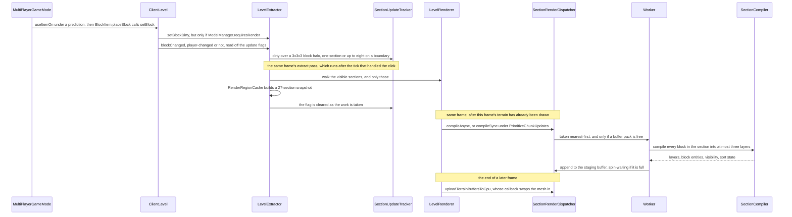

# Section meshing

> Verified against **Minecraft 26.2** · Part XI · a block is placed, and the section it lives in is re-meshed, uploaded and drawn.

You right-click a block into place and it is simply *there* — no shimmer, no
gap, no frame in which the wall you just built has a hole in it. Behind that
instant there is a worker thread rebuilding a cube of world sixteen blocks on
a side from scratch, a snapshot of twenty-seven sections taken so that it may,
a scratch buffer it had to queue for, and a swap that waits until every last
byte has landed on the GPU. All of which is why the *other* half of the
story is the surprising one: place a block behind you and none of it happens
at all. Only sections the frame is already drawing are swept for dirtiness,
so the flag on a section at your back is set and then simply waits — for a
second, for an hour, for as long as you keep your back turned.

## The cast

| class | what it decides | thread |
|---|---|---|
| `LevelExtractor` | which block changes dirty which sections, and which dirty sections are worth compiling this frame | Render thread |
| `SectionUpdateTracker` | where dirtiness lives, and whether a never-compiled section is allowed to compile yet | Render thread |
| `RotatingSectionStorage` | which slot in a fixed ring a section's flag belongs to, and when that slot is re-homed | Render thread |
| `RenderRegionCache` | the snapshot a mesher is allowed to read, and how much of it is shared | Render thread |
| `SectionRenderDispatcher` | queue order, scratch buffers, the GPU arenas, and the moment a new mesh becomes the drawn one | Render thread, workers |
| `SectionTaskDynamicQueue` | which section a free worker takes next | any |
| `SectionCompiler` | the block-by-block walk that turns a snapshot into vertices | `Util.backgroundExecutor` |
| `BlockModelLighter` | smooth lighting and ambient occlusion, per quad, as the walk goes | `Util.backgroundExecutor` |

## The whole trip, in one figure

Read it in three beats: a change makes a flag, a frame turns some flags into
work, and a much later frame publishes the result. The middle beat is the one
that leaves the client thread, and it does not always — a synchronous rebuild
compiles inline where it stands, and an empty mesh is published by the worker
that found it empty.

## A click, and the flag it leaves behind

The first arrow is not what it looks like. `MultiPlayerGameMode` owns the
prediction sequence — the client places the block itself and remembers what
it assumed — but the `Level.setBlock` that actually changes the world happens
down inside `BlockItem.placeBlock`. From the renderer's side it makes no
difference whether the change came from your own hand or from the server;
[what the client is told](../networking/what-the-client-is-told.md) is the
other door into the same call, by way of `ClientLevel.sendBlockUpdated`.

Dirtiness is a small API on `LevelExtractor`, and the calls differ mostly in
how much of the world they condemn.

| call | what it marks |
|---|---|
| `LevelExtractor.blockChanged` | one changed block, with the player-changed bit read off the update flags |
| `LevelExtractor.setBlockDirty` | one changed block, and only if `ModelManager.requiresRender` says a model cares |
| `LevelExtractor.setBlocksDirty` | a box of block positions |
| `LevelExtractor.setSectionDirty` | one section, by section coordinate |
| `LevelExtractor.setSectionDirtyWithNeighbors` | that section and the ones touching it |
| `LevelExtractor.setSectionRangeDirty` | a range of sections |
| `LevelExtractor.allChanged` | everything at once |

**27** — the size of the halo a single block change marks, in *block
positions*, not sections. This is the number to keep straight. A 3×3×3
neighbourhood of blocks maps to exactly **one** section for any block that is
not on a section boundary, and to at most eight when it is — a corner block
touching seven neighbours plus its own. Only the mesher's *read* region,
much later on, is genuinely twenty-seven sections. There *is* a gate on one
of the two doors — `ModelManager.requiresRender` guards
`LevelExtractor.setBlockDirty`, so a state change no model reacts to marks
nothing through that route — but it is not the route a placed block takes.
`Level.setBlock` goes through both, and the second,
`LevelExtractor.blockChanged`, marks the halo whatever the models say.

### The flag belongs to a slot, not to a section

`SectionUpdateTracker` holds a `SectionUpdateTracker.SectionDirtyState` per
section — with `SectionUpdateTracker.SectionDirtyState.isDirty` and
`SectionUpdateTracker.SectionDirtyState.isDirtyFromPlayer`, the second being
what the *prioritise chunk updates* setting keys off further down this page —
and the tracker is built on `RotatingSectionStorage`, a fixed ring of slots that
`RotatingSectionStorage.repositionCenter` re-homes as the camera moves. A
dirty flag therefore belongs to a *slot*, not to a section: walk far enough
away and the slot is re-homed and the flag is gone. Nothing is lost by that,
because a newly homed slot starts dirty.

## The sweep that only looks at what you can see

Once a frame, the extract pass walks the sections the renderer considers
visible and collects the dirty ones. That is the whole mechanism behind the
hook: a section that is not in the visible set is never even asked whether it
is dirty, so its flag sits there, indefinitely, and the section rebuilds the
instant it comes back into view. Which sections count as visible, and the
reachability walk that decides it, belong to [visibility and the frame
graph](visibility-and-the-frame-graph.md).

One extra gate applies, and only to sections that have never been compiled
before. `SectionUpdateTracker.hasAllNeighbors` requires the eight surrounding
chunk columns — horizontally only, never the section's own column — to be
loaded and lit before a first compile is allowed. A mesher decides whether a
block's face is worth drawing by looking at the block on the other side of it,
so a section built without its neighbours would be a section built against
nothing. A *re*compile skips that check entirely: a section that has a mesh
already may always build a new one.

## What a mesher is allowed to read

A compile runs for an unbounded time on a worker while the client thread
keeps applying block updates, so it cannot be allowed near the live world.
`RenderRegionCache` builds it a `RenderSectionRegion` instead: a 3×3×3 grid
of `SectionCopy`, each holding a genuine *copy* of one section's
`PalettedContainer` together with an immutable map of that chunk's block
entities. Inside the compile, a block state read is a read of that copy, and
it will answer the same way from the first quad to the last however much the
world has moved on.

The cache is what stops this being ruinous. Twenty-seven copies per dirty
section would mean 27*n* copies for *n* sections, and neighbouring dirty
sections share almost all of their neighbourhood — so the regions built in
one extract share their `SectionCopy` instances, and the real cost is far
closer to *n*.

What is *not* copied is as informative as what is. Tints and light are read
live, through the region's references to `ClientLevel` and the light engine —
so for those two the mesher is looking at the world as it is when it asks, not
at the world as it was when the snapshot was taken.

## The queue, the packs, and why more cores do not always help

`SectionRenderDispatcher` takes the sections the extract collected and either
queues them (`SectionRenderDispatcher.RenderSection.compileAsync`) or compiles
them on the spot (`SectionRenderDispatcher.RenderSection.compileSync`). The
dispatcher does not decide which: `LevelRenderer.compileSections` does, from
the snapshotted *prioritise chunk updates* option, and this is where
`SectionUpdateTracker.SectionDirtyState.isDirtyFromPlayer` is finally spent.
`PrioritizeChunkUpdates.NONE` — the default — never compiles inline;
`PrioritizeChunkUpdates.PLAYER_AFFECTED` does so for a section the player
changed; `PrioritizeChunkUpdates.NEARBY` does so for those *and* for anything
close to the camera. `SectionTaskDynamicQueue`
decides the order and it is nearest-first, with one guard: a recompile only
beats a first-time compile while a small quota lasts, and only if it is also
nearer. With no first-time compile queued at all, a recompile wins outright.
So terrain you have never seen is never starved by a stream of rebuilds to
terrain you have.

The throttle is not the thread count. Each task-runner must acquire a
`SectionBufferBuilderPack` — the scratch vertex buffers a compile writes into
— from `SectionBufferBuilderPool` before it can do anything, and the pool is
sized to the processor count *or* to a share of the heap, whichever is
smaller, degrading further if it hits an out-of-memory error while
allocating. A worker that cannot get a pack puts its task back on the queue
and gives up its turn.

That requeue is a null check, and it is worth knowing how wide it is: the
catch that implements it covers the whole compile, so *any* null-pointer
failure inside the mesher quietly requeues the section rather than reporting
it. A section that fails this way forever will re-mesh forever, silently.

The ceiling on how many meshes exist at once is therefore the pool **plus
one**: the synchronous path uses `RenderBuffers.fixedBufferPack`, which is not
in the pool at all. And because the pool is usually larger than the
background pool, the constraint you actually hit is normally the thread
count after all.

## What the compiler makes

`SectionCompiler.compile` walks every block in the section, asks the models
for its quads and sorts them into layers. The asking is
`ModelBlockRenderer.tesselateBlock`, one instance built per compile from the
ambient-occlusion option and `BlockColors`, and the quads come back through a
`BlockQuadOutput` — a callback the compiler supplies, so the renderer never
knows which layer's buffer it is writing into. Its product is
`SectionCompiler.Results`, four things at once:
`SectionCompiler.Results.renderedLayers` (the geometry, per layer), the
`SectionCompiler.Results.blockEntities` it found on the way, a
`SectionCompiler.Results.visibilitySet` for the reachability walk on the
other page, and `SectionCompiler.Results.transparencyState`, the sort state
for the translucent layer. Those become the section's `CompiledSectionMesh`.
Lighting is not a separate stage: `BlockModelLighter` computes smooth
lighting and ambient occlusion as the walk goes, with a thread-local cache
bracketed around each compile.

**Three** — the chunk section layers, and there are only three:
`ChunkSectionLayer.SOLID`, `ChunkSectionLayer.CUTOUT` and
`ChunkSectionLayer.TRANSLUCENT`. A quad's layer is normally decided at bake
time and simply carried into the compile — see [models and
atlases](models-and-atlases.md) for the `BlockStateModelSet` the compiler
reads and the reload that invalidates every mesh in the world. But the mesher
can overrule it in two places. Every leaf quad is redirected to
`ChunkSectionLayer.SOLID` when the *cutout leaves* option is off — that is
`ModelBlockRenderer.forceOpaque`, tested per block, and it picks which of the
compiler's two callbacks the renderer is handed — so the setting is baked
into the mesh rather than applied at draw time. And fluids never consult a
baked quad at all: `FluidRenderer.tesselate` is a separate call with its own
callback, and the layer comes from the `FluidModel`.

## Onto the GPU, and a swap that is late on purpose

The worker does not touch the GPU. It appends its vertices to a
`StagingBuffer` under a lock, spinning if the buffer is full — a real
back-pressure point, where a worker waits on the client thread rather than the
buffer growing to fit it. The client thread drains it in
`SectionRenderDispatcher.uploadTerrainBuffersToGpu`, and each completed
upload fires the callback that publishes the new mesh. The result of a
compile therefore arrives back on the client thread, always, with exactly one
exception: a section that compiled to nothing at all is published directly on
the worker, because there is nothing to upload.

The destination is not one buffer per layer but an *arena* per layer. Each
`ChunkSectionLayer` has an `UberGpuBuffer` pair owning a growing list of
fixed-size heaps — 128 MiB for vertices, 32 MiB for indices — and each heap
is a real GPU buffer sub-allocated by a `TlsfAllocator`, freed again when it
empties. Sections are tenants in a shared allocation, not owners of buffers;
[blaze3d](blaze3d.md) is where those buffers come from.

And now the second fact this page exists to place: **the swap is atomic and
late.** `SectionRenderDispatcher.RenderSection.sectionMesh` keeps pointing at
the *old* mesh until every layer's vertex and index buffer has reported
uploaded. There is no frame in which a rebuilt section is missing, no flicker
and no hole — the price being that the section you can see is, for a few
frames, deliberately out of date. `SectionRenderDispatcher.RenderSection.reset`
is the other end of that lifecycle, and
`SectionRenderDispatcher.RenderSection.getVisibility` is not part of it at
all despite the name — it is the fade the next section explains, an alpha
that climbs from nothing to one over the upload's fade duration.
`SectionRenderDispatcher.RenderSection.resortTransparency` is the cheap path
that reorders an existing translucent mesh without recompiling anything;
[visibility and the frame graph](visibility-and-the-frame-graph.md) owns the
budget that decides when it runs.

## Questions players ask

**Why does distant terrain fade in, but a block I place never does?**
Because the fade is deliberately restricted to the case it was written for.
`SectionRenderDispatcher.RenderSection.setFadeDuration` is non-zero only for
distant sections that were not previously empty, and the fade clock starts at
a section's *first* upload — so a recompile of terrain you have been staring
at, which is what placing a block is, has no fade left to spend.

**I turned on "prioritise chunk updates" and it still costs me a frame. Why?**
Because of where compiling sits in the frame. `LevelRenderer.compileSections`
runs *after* `FrameGraphBuilder.execute` — [terrain is already
drawn](visibility-and-the-frame-graph.md#one-bucket-per-buffer-set-and-what-bucketing-actually-buys)
— so the strongest promise the setting can make is that the mesh exists by
the end of frame *N*. It appears in frame *N+1*. The setting buys you the
compile, not the draw — and it buys it by doing the work on the client
thread, which is why it can also cost you the frame outright.

**What happens when the buffer pool runs out?** Nothing visible, which is the
design. The worker that cannot acquire a `SectionBufferBuilderPack` puts its
section back on `SectionTaskDynamicQueue` — the *task* is requeued, not the
flag, which was cleared when the work was taken — so the only symptom is
terrain arriving more slowly. The pool is also allowed to
shrink itself: if it hits an out-of-memory error while allocating, it comes
back smaller and the game keeps going with fewer concurrent meshes.

> **For a 1.21-era reader.** The whole dirty API moved. Every
> *setBlockDirty*-shaped method that used to live on `LevelRenderer` is now on
> `LevelExtractor`, in *client/renderer/extract*, and the flags themselves
> live in `SectionUpdateTracker`. Below that: *ChunkRenderDispatcher* and
> *RenderChunk* are now `SectionRenderDispatcher` and its nested
> `SectionRenderDispatcher.RenderSection`, *CompiledChunk* is
> `CompiledSectionMesh`, *RenderChunkRegion* is `RenderSectionRegion`, and
> *LiquidBlockRenderer* is `FluidRenderer`. *RenderType.chunkBufferLayers* and
> its five chunk render types are three `ChunkSectionLayer`s.
> *BlockRenderDispatcher* is gone as a name and `ModelBlockRenderer` is what
> does its tesselating, while *BlockAndTintGetter.getShade* has no successor
> at all.

## Where to look

`LevelExtractor.blockChanged` and `LevelExtractor.setBlockDirty` for where a
change becomes a flag, and `SectionUpdateTracker` for where the flag lives.
`SectionUpdateTracker.hasAllNeighbors` for the gate on a first compile.
`RenderRegionCache` and `SectionCopy` for what a mesher may read.
`SectionRenderDispatcher.RenderSection.compileAsync` and
`SectionTaskDynamicQueue` for what gets built and in what order.
`SectionCompiler.compile` for the walk itself, and `BlockModelLighter` for
where ambient occlusion comes from.
`SectionRenderDispatcher.uploadTerrainBuffersToGpu` for the upload and the
swap. Then [visibility and the frame
graph](visibility-and-the-frame-graph.md) for who decided the section was
visible in the first place, and [the client
level](../client/the-client-level.md) for the world all of this is reading.

---

*Rules: names, never code · how the system works, not how the code reads ·
newest version only · every backticked name passes `tools/verify_names.py`.*
