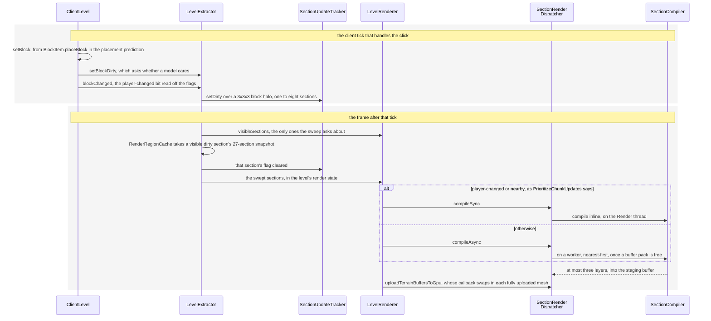

# Section meshing

> Verified against **Minecraft 26.3** · Part XI · a block is placed, and the section it lives in is re-meshed, uploaded and drawn.

You right-click a block into place and within a frame or two it is simply
*there*, with no shimmer and no fade. Behind that wait, on a client left at its
default graphics preset, the Render thread itself rebuilds a cube of world
sixteen blocks on a side from scratch, from a snapshot of twenty-seven
sections, just after the next frame has drawn its terrain from the old mesh,
and swaps the new one in before that frame ends. A block the server changes
takes the slower road: a worker thread, a scratch buffer it has to queue for,
and a swap that can wait a frame or more until every layer has been uploaded. All of which is why the *other* half of the story is the
surprising one: let a block change behind you, farther back than the few blocks the
visible list reaches behind the camera, and none of it happens at all. Only sections the frame is already drawing are swept for dirtiness,
so the flag on a section at your back is set and then simply waits — for a
second, for an hour, for as long as you keep your back turned.

## The cast

| class | what it decides | thread |
|---|---|---|
| `LevelExtractor` | which block changes dirty which sections, and which dirty sections are worth compiling this frame | Render thread |
| `SectionUpdateTracker` | where dirtiness lives, and whether a never-compiled section is allowed to compile yet | Render thread |
| `RotatingSectionStorage` | which slot in a fixed ring a section's flag belongs to, and when that slot is re-homed | Render thread |
| `RenderRegionCache` | the snapshot a mesher is allowed to read, and how much of it is shared | Render thread |
| `SectionRenderDispatcher` | queue order, scratch buffers, the GPU arenas, and the moment a new mesh becomes the drawn one | Render thread, workers |
| `SectionTaskDynamicQueue` | which section a free worker takes next | any |
| `SectionCompiler` | the block-by-block walk that turns a snapshot into vertices | the worker pool, or the Render thread for a synchronous compile |
| `BlockModelLighter` | smooth lighting and ambient occlusion, per quad, as the walk goes | the worker pool, or the Render thread for a synchronous compile |

## The whole trip, in one figure

```mermaid
sequenceDiagram
    participant CL as ClientLevel
    participant LX as LevelExtractor
    participant SUT as SectionUpdateTracker
    participant LR as LevelRenderer
    participant SRD as SectionRender<br/>Dispatcher
    participant SectC as SectionCompiler

    rect rgba(0, 0, 0, 0.04)
    Note over CL,SectC: the client tick that handles the click
    CL->>CL: setBlock, from BlockItem.placeBlock in the placement prediction
    CL->>LX: setBlockDirty, which asks whether a model cares
    CL->>LX: blockChanged, the player-changed bit read off the flags
    LX->>SUT: setDirty over a 3x3x3 block halo, one to eight sections
    end
    rect rgba(0, 0, 0, 0.04)
    Note over CL,SectC: the frame after that tick
    LX->>LR: visibleSections, the only ones the sweep asks about
    LX->>LX: RenderRegionCache takes a visible dirty section's 27-section snapshot
    LX->>SUT: that section's flag cleared
    LX->>LR: the swept sections, in the level's render state
    alt player-changed or nearby, as PrioritizeChunkUpdates says
        LR->>SRD: compileSync
        SRD->>SectC: compile inline, on the Render thread
    else otherwise
        LR->>SRD: compileAsync
        SRD->>SectC: on a worker, nearest-first, once a buffer pack is free
    end
    SectC-->>SRD: at most three layers, into the staging buffer
    LR->>SRD: uploadTerrainBuffersToGpu, whose callback swaps in each fully uploaded mesh
    end
```

*The trip from a placed block to a drawn mesh: a tick sets flags, and the
frame after it sweeps only visible sections and compiles or queues the dirty
ones after its own terrain is drawn. A synchronous compile is swapped in at the
end of that frame, an asynchronous one at the end of whichever frame uploads
the last of it.*

Read it in three beats: a change makes a flag, a frame turns some flags into
work, and the end of that frame or a later one publishes the result. The middle beat is the one
that leaves the Render thread, and it does not always — a synchronous rebuild
compiles inline where it stands, and an empty mesh is published by whichever
thread compiled it.

## A click, and the flag it leaves behind

The first arrow hides who starts it. `MultiPlayerGameMode` starts the
prediction — the client places the block itself, and its level remembers the
state the server last confirmed, to put back if the server disagrees — but the `Level.setBlock` that actually changes the world happens
down inside `BlockItem.placeBlock`. From the renderer's side the one
difference is a flag: your own write carries the player-changed bit and the
server's does not. [What the client is told](../networking/what-the-client-is-told.md)
is the other door into the same call, by way of
`ClientLevel.setServerVerifiedBlockState`.

Dirtiness is a small API on `LevelExtractor`, and the calls differ mostly in
how much of the world they condemn.

| call | what it marks |
|---|---|
| `LevelExtractor.blockChanged` | one changed block, with the player-changed bit read off the update flags |
| `LevelExtractor.setBlockDirty` | one changed block, and only if `ModelManager.requiresRender` says a model cares |
| `LevelExtractor.setBlocksDirty` | a box of block positions |
| `LevelExtractor.setSectionDirty` | one section, by section coordinate |
| `LevelExtractor.setSectionDirtyWithNeighbors` | that section and the ones touching it |
| `LevelExtractor.setSectionRangeDirty` | a range of sections |
| `LevelExtractor.allChanged` | everything at once |

**Twenty-seven block positions** make the halo a single block change marks,
and they are positions, not sections. This is the number to keep straight. A 3×3×3
neighbourhood of blocks maps to exactly **one** section for any block that is
not on a section boundary, and to at most eight when it is — a corner block
touching seven neighbours plus its own. Only the mesher's *read* region,
much later on, is genuinely twenty-seven sections. There *is* a gate on one
of the two doors — `ModelManager.requiresRender` guards
`LevelExtractor.setBlockDirty`, so a state change no model reacts to marks
nothing through that route — but it cannot stop a placed block.
`Level.setBlock` goes through both doors, and the second,
`LevelExtractor.blockChanged`, marks the halo whatever the models say.

### The flag belongs to a slot, not to a section

`SectionUpdateTracker` holds a `SectionUpdateTracker.SectionDirtyState` per
section — with `SectionUpdateTracker.SectionDirtyState.isDirty` and
`SectionUpdateTracker.SectionDirtyState.isDirtyFromPlayer`, the second being
what the *prioritise chunk updates* setting keys off further down this page —
and the tracker is built on `RotatingSectionStorage`, a fixed ring of slots that
`RotatingSectionStorage.repositionCenter` re-homes as the camera moves. A
dirty flag therefore belongs to a *slot*, not to a section: walk far enough
away and the slot is re-homed and the flag is gone. Nothing is lost by that,
because a newly homed slot starts dirty.

## The sweep that only looks at what you can see

Once a frame, the extract pass walks the sections the renderer considers
visible and collects the dirty ones. That is the whole mechanism behind the
hook: a section that is not in the visible set is never even asked whether it
is dirty, so its flag sits there, indefinitely, and the section rebuilds the
instant it comes back into view. Which sections count as visible, and the
reachability walk that decides it, belong to [visibility and the frame
graph](visibility-and-the-frame-graph.md).

One extra gate applies, and only to sections that have never been compiled
before. `SectionUpdateTracker.hasAllNeighbors` requires the eight surrounding
chunk columns — horizontally only, never the section's own column — to be
loaded and lit before a first compile is allowed. A mesher decides whether a
block's face is worth drawing by looking at the block on the other side of it,
so a section built without its neighbours would be a section built against
nothing. A *re*compile skips that check entirely: a section that has a mesh
already may always build a new one.

## What a mesher is allowed to read

A compile on a worker runs for an unbounded time while the Render thread
keeps applying block updates, so it cannot be allowed near the live world.
`RenderRegionCache` builds it a `RenderSectionRegion` instead: a 3×3×3 grid
of `SectionCopy`, each holding a genuine *copy* of one section's
`PalettedContainer` together with an immutable map of that chunk's block
entities. Inside the compile, a block state read is a read of that copy, and
it will answer the same way from the first quad to the last however much the
world has moved on.

The cache is what stops this being ruinous. Twenty-seven copies per dirty
section would mean 27*n* copies for *n* sections, and neighbouring dirty
sections share almost all of their neighbourhood — so the regions built in
one extract share their `SectionCopy` instances, and the real cost is far
closer to *n*.

What is *not* copied is as informative as what is. Tints and light are read
live, through the region's references to `ClientLevel` and the light engine —
so for those two the mesher is looking at the world as it is when it asks, not
at the world as it was when the snapshot was taken.

## The queue, and the scratch buffer every compile must hold

`SectionRenderDispatcher` takes the sections the extract collected and either
queues them (`SectionRenderDispatcher.RenderSection.compileAsync`) or compiles
them on the spot (`SectionRenderDispatcher.RenderSection.compileSync`). The
dispatcher does not decide which: `LevelRenderer.compileSections` does, from
the snapshotted *prioritise chunk updates* option, and this is where
`SectionUpdateTracker.SectionDirtyState.isDirtyFromPlayer` is finally spent.
`PrioritizeChunkUpdates.NONE` — the option's own default, which the fancy preset
a new client starts on replaces — never compiles inline;
`PrioritizeChunkUpdates.PLAYER_AFFECTED` does so for a section the player
changed; `PrioritizeChunkUpdates.NEARBY` does so for those *and* for anything
close to the camera. `SectionTaskDynamicQueue`
decides the order and it is nearest-first, with one guard: a recompile only
beats a first-time compile while a small quota lasts, and only if it is also
nearer. With no first-time compile queued at all, a recompile wins outright.
So terrain you have never seen is never starved by a stream of rebuilds to
terrain you have.

A thread is not enough. Each task-runner must also acquire a
`SectionBufferBuilderPack` — the scratch vertex buffers a compile writes into
— from `SectionBufferBuilderPool` before it can do anything, and the pool is
sized to the processor count *or* to a share of the heap, whichever is
smaller, degrading further if it hits an out-of-memory error while
allocating. A worker that cannot get a pack puts its task back on the queue
and gives up its turn — the *task* is requeued, not the flag, which was
cleared when the work was taken, so the only symptom of an exhausted pool is
terrain arriving more slowly.

That requeue is a null check, and it is worth knowing how wide it is: the catch that implements it covers the whole compile. A failure while one
block is being tesselated is reported, as a crash; a null-pointer failure
anywhere else in the compile quietly requeues the section, and the pack it
had acquired is never given back. A section that fails that way every time
takes one more pack from the pool each time a worker tries it, until the pool is
empty and no compile on a worker ever finishes again.

The ceiling on how many compiles run at once is therefore the pool **plus
one**: the synchronous path uses `RenderBuffers.fixedBufferPack`, which is not
in the pool at all. And because the pool is usually larger than the
background pool, the constraint you actually hit is normally the thread
count after all.

## What the compiler makes

`SectionCompiler.compile` walks every block in the section, asks the models
for its quads and sorts them into layers. The asking is
`ModelBlockRenderer.tesselateBlock`, one instance built per compile from the
ambient-occlusion option and `BlockColors`, and the quads come back through a
`BlockQuadOutput` — one of *two* callbacks the compiler builds per compile and
picks between per block, so the renderer never knows which layer's buffer it
is writing into. Its product is
`SectionCompiler.Results`, four things at once:
`SectionCompiler.Results.renderedLayers` (the geometry, per layer), the
`SectionCompiler.Results.blockEntities` it found on the way, a
`SectionCompiler.Results.visibilitySet` for the reachability walk on the
other page, and `SectionCompiler.Results.transparencyState`, the sort state
for the translucent layer. Those become the section's `CompiledSectionMesh`.
Lighting is not a separate stage: `BlockModelLighter` computes smooth
lighting and ambient occlusion as the walk goes, with a thread-local cache
bracketed around each compile.

**Three chunk section layers** exist, and only three:
`ChunkSectionLayer.SOLID`, `ChunkSectionLayer.CUTOUT` and
`ChunkSectionLayer.TRANSLUCENT`. A quad's layer is normally decided at bake
time and simply carried into the compile — see [models and
atlases](models-and-atlases.md) for the `BlockStateModelSet` the compiler
reads and the reload that invalidates every mesh in the world. But the mesher
overrules it in one place, and fluids take a road of their own. Every leaf quad is redirected to
`ChunkSectionLayer.SOLID` when the *cutout leaves* option is off — that is
`ModelBlockRenderer.forceOpaque`, tested per block, and it picks which of the
compiler's two callbacks the renderer is handed — so the setting is baked
into the mesh rather than applied at draw time. And fluids never consult a
baked quad at all: `FluidRenderer.tesselate` is a separate call with its own
callback, and the layer comes from the `FluidModel`.

### Why "prioritise chunk updates" still costs you a frame

The figure's caption says it and it is worth stating plainly, because it
is the one ordering fact on this page a player can feel:
`LevelRenderer.compileSections` runs *after* `FrameGraphBuilder.execute`, so
[terrain is drawn before the sections queued this frame are
compiled](visibility-and-the-frame-graph.md#one-bucket-per-buffer-set-and-what-bucketing-actually-buys).
The strongest promise the setting can therefore make is that the mesh exists
by the end of frame *N*; it appears in frame *N+1*. The setting buys you the
compile, not the draw — and it buys it by doing the work on the Render thread,
which is why it can cost you that frame outright.

## Onto the GPU, and a swap that is late on purpose

The worker does not touch the GPU. It appends its vertices to a
`StagingBuffer` under a lock, spinning if the buffer is full — a real
back-pressure point, where a worker waits on the Render thread rather than the
buffer growing to fit it. The Render thread drains it in
`SectionRenderDispatcher.uploadTerrainBuffersToGpu`, and each completed
upload fires the callback that publishes the new mesh. The result of a
compile therefore arrives back on the Render thread, always, with exactly one
exception: a section that compiled to no geometry is published directly by
the thread that compiled it, because there is nothing to upload.

The destination is not one buffer per layer but an *arena* per layer. Each
`ChunkSectionLayer` has an `UberGpuBuffer` pair owning a growing list of
fixed-size heaps — 128 MiB for vertices, 32 MiB for indices — and each heap
is a real GPU buffer sub-allocated by a `TlsfAllocator`, freed again when it
empties. Sections are tenants in a shared allocation, not owners of buffers;
[blaze3d](blaze3d.md) is where those buffers come from.

### The swap is atomic and late, on purpose

And now the second fact this page exists to place. `SectionRenderDispatcher.RenderSection.sectionMesh` keeps pointing at
the *old* mesh until every layer's vertex and index buffer has reported
uploaded. There is no frame in which a rebuilt section is missing, no flicker
and no hole — the price being that the section you can see is, for a frame
or more, deliberately out of date. `SectionRenderDispatcher.RenderSection.reset`
is the other end of that lifecycle, and
`SectionRenderDispatcher.RenderSection.getVisibility` is not part of it at
all despite the name — it is a fade, an alpha that climbs from nothing to one
over the fade duration. That fade is why arriving terrain appears softly
and a block you place never does: every section fades in over the one
`Options.chunkSectionFadeInTime` setting, near or far, and the clock starts
at a section's *first* upload — so a recompile of terrain you have been staring at,
which is what placing a block is, has no fade left to spend.
`SectionRenderDispatcher.RenderSection.resortTransparency` is the cheap path
that reorders an existing translucent mesh without recompiling anything;
[visibility and the frame graph](visibility-and-the-frame-graph.md) owns the
budget that decides when it runs.

> **For a 1.21-era reader.** The whole dirty API moved: every
> *setBlockDirty*-shaped method on `LevelRenderer` is now on `LevelExtractor`,
> in *client/renderer/extract*, and the flags live in `SectionUpdateTracker`.
> *LiquidBlockRenderer* is now `FluidRenderer`; *BlockRenderDispatcher* is gone
> and `ModelBlockRenderer` does its tesselating; *BlockAndTintGetter.getShade*
> is gone, and `BlockAndTintGetter.cardinalLighting` answers with a
> `CardinalLighting`. There are three chunk section layers, not four:
> *ChunkSectionLayer.TRIPWIRE* is gone.

## Where to look

`LevelExtractor.blockChanged` and `LevelExtractor.setBlockDirty` for where a
change becomes a flag, and `SectionUpdateTracker` for where the flag lives.
`SectionUpdateTracker.hasAllNeighbors` for the gate on a first compile.
`RenderRegionCache` and `SectionCopy` for what a mesher may read.
`SectionRenderDispatcher.RenderSection.compileAsync` and
`SectionTaskDynamicQueue` for what gets built and in what order.
`SectionCompiler.compile` for the walk itself, and `BlockModelLighter` for
where ambient occlusion comes from.
`SectionRenderDispatcher.uploadTerrainBuffersToGpu` for the upload and the
swap. Then [visibility and the frame
graph](visibility-and-the-frame-graph.md) for who decided the section was
visible in the first place, and [the client
level](../client/the-client-level.md) for the world all of this is reading.

---

*Rules: names, never code · how the system works, not how the code reads ·
newest version only · every backticked name passes `tools/verify_names.py`.*
