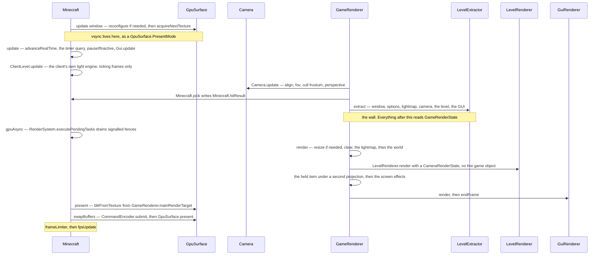

# The frame

> Verified against **Minecraft 26.2** · Part XI · one frame: from acquiring a surface texture to handing it back, and the wall in the middle that the drawing half is not allowed to look past.

The number in the top-left says 143 fps, and each of those 143 is one call to
`Minecraft.renderFrame` — one method with two halves. The first walks the
live game and copies everything drawable into a `GameRenderState`; the second
draws that state and nothing else. Before either half runs, the frame asks
[the window](the-window.md) for somewhere to put the picture, and the
surprising thing is what happens when that request fails. It does not skip
the frame. It skips the *picture*. The world still renders in full into
`GameRenderer.mainRenderTarget`, the GUI still goes on top, the framerate
limiter still parks; only the blit and the present re-test that a surface was
acquired, and both quietly decline. A minimized window is the same story with
no attempt made at all — a client drawing complete frames that nobody will
ever see.

All of this is the one thread the client has. How many ticks ran before the
frame, and what paced it afterwards, is [the client
loop](../client/the-client-loop.md); this page starts where that page's
*frame* zone opens.

## The cast

| class | what it decides | thread |
|---|---|---|
| `Minecraft` | the zones, the acquire guard, and whether this frame advances game time at all | Render thread |
| `GameRenderer` | the frame's owner of everything drawn — the snapshot target, the main render target, the camera, the lightmaps | Render thread |
| `GameRenderState` | what the drawing half is allowed to read, and therefore where the wall is | written in *extract*, read in *render* |
| `Camera` | where the eye is, how wide the view is, and how wide the *cull* frustum is — which is not the same number | Render thread, but ticked from `GameRenderer.tick` |
| `LevelExtractor` | which of the live world becomes drawable state, at one partial tick **per entity** | Render thread |
| `LevelRenderer` | the world half — handed a `CameraRenderState`, never a `Camera` | Render thread |
| `GuiRenderer` | the GUI half, with its own staged buffer and its own submit storage | Render thread |
| `GpuSurface` | whether there is anywhere to put the picture: acquire, blit, present | Render thread |

## Nine zones, which are the frame's table of contents

Naming the profiler zones in order is the shortest honest description of what
a frame is: *update window* · *update* · *extract* · *gpuAsync* · *render* —
which pushes *world* and *gui*, and inside the world *matrices*, *fog*,
*level*, *hand*, *screenEffects* — then *present* · *swapBuffers* ·
*frameLimiter* · *fpsUpdate*. Two of those names are the wrong way round, and
the section on presentation below says which.

Read it as **acquire, snapshot, draw, present** — and note that only the
first and last of those four touch the surface.

## Acquire, and the frame that carries on without one

The *update window* zone reconfigures the surface if it needs it and then
calls `GpuSurface.acquireNextTexture`. Vsync is not a swap interval any
more: it is a `GpuSurface.PresentMode` baked into the surface configuration,
so toggling it in the options forces a reconfigure —
`Minecraft.invalidateSurfaceConfiguration` — rather than setting a flag.

When the acquisition throws, the surface is marked invalid, a reconfigure is
scheduled, and the frame goes on exactly as if nothing had happened. Only
`GpuSurface.blitFromTexture` and `GpuSurface.present` re-test whether a
surface is actually held, and both skip in silence. The work saved by a
minimized window is three calls; everything else — the extract, the world,
the GUI, the limiter — is paid in full.

There is one guard on the whole method, and it is about re-entry rather than
failure: if the surface is *already* acquired when `Minecraft.renderFrame` is
called, the call is a silent no-op.

## Update and extract: five partial ticks in one frame

The *update* zone advances the real-time clock, reads
`Minecraft.timerQuery` — the GPU-side stopwatch behind the F3 utilisation
figure — runs `Minecraft.pauseIfInactive` and updates the GUI. On ticking
frames `ClientLevel.update` runs the client's own light engine. Then
`GameRenderer.update` calls `Camera.update` and `Minecraft.pick`, which
writes `Minecraft.hitResult` for the crosshair and the block outline to find
later.

`Camera` is split three ways across the client, and only one of them is here.
`Camera.tick` — driven from `GameRenderer.tick`, not from the frame — smooths
the eye height and the field-of-view modifier and advances the camera's
`EnvironmentAttributeProbe`. `Camera.update` does the frame's work:
`Camera.alignWithEntity`, `Camera.calculateFov`, `Camera.prepareCullFrustum`,
`Camera.setupPerspective`. `Camera.extractRenderState` then copies the result
across the wall.

*Extract* opens by snapshotting the framerate limit into
`GameRenderState.framerateLimit` and goes on to copy the window, the options,
the lightmap, the camera and the level. It is here that the frame's oddest
number appears: there is no such thing as *the* partial tick of a frame.
There are five, and they disagree on purpose.

| who is interpolated | which value | what it ignores |
|---|---|---|
| the world | `DeltaTracker.getGameTimeDeltaPartialTick` | nothing — frozen time is honoured |
| the camera and the held item | `Camera.getCameraEntityPartialTicks` | freezing, unless the *camera entity itself* is frozen, which a player never is |
| the lightmap | a literal one | everything — it is extracted fully advanced |
| screens and overlays | `DeltaTracker.getRealtimeDeltaTicks` | the game clock, and anything past seven ticks, where it clamps to a half |
| each entity, separately | its own frozen-honouring value, asked for by `LevelExtractor` | the world's single answer |

The last row is the one you can see. Under `/tick freeze` every mob pins at
the end of its last tick while players go on interpolating — in the same
frame, from the same extract.

## The wall, and the one level at which it is real

`LevelRenderer.render` is handed state and reads no live *game* object: no
`ClientLevel`, no `Minecraft`. That is the wall, and one level down it holds.
It still reaches back into live *renderer* objects for the main target and
the shader manager, but no live game object is among them.

At the top it leaks, and the leak is sharper than the naming suggests.
`GameRenderer.render` reads whether the game has finished loading, whether a
level exists, and the world's game time, every frame including GUI-only ones.
Inside the world half, `GameRenderer.shouldRenderBlockOutline` performs a
**live world lookup during rendering** — the camera entity,
`Minecraft.hitResult`, a `BlockState` read and the current game mode. The
interesting fact is not that a wall exists but that it is drawn one level
below where *extract then render* implies it is.

A resize is handled inside the render half rather than before it:
`GameRenderer.render` opens by comparing `GameRenderState.windowRenderState`
against the main target's size and resizing the renderer inline when they
differ. The snapshot is what the frame believes the window size to be, even
if the window has changed since.

The buffers the halves share are far smaller than a 1.21-era reader expects.
`RenderBuffers` holds `RenderBuffers.fixedBufferPack`, the section-meshing
scratch `RenderBuffers.sectionBufferPool` — capped by processor count and
again by a memory budget — and a single shared
`RenderBuffers.stagedVertexBuffer` released by `RenderBuffers.endFrame`, with
the GUI keeping a second staged buffer of its own inside `GuiRenderer`.
Geometry submission moved to `SubmitNodeCollector` and `SubmitNodeStorage`,
drawn either by the passes of the frame graph in [visibility and the frame
graph](visibility-and-the-frame-graph.md) or by
`FeatureRenderDispatcher.renderAllFeatures` — which, despite the name, is
**not** how the level is drawn. It has four call sites: the held item, the
screen effects, the GUI's item atlas and picture-in-picture. The last two are
why the GUI needs submit storage at all. The world's submitted features are
prepared into the frame graph and drawn by its passes.

## Present, swapBuffers, and which of the two names lies

**Nothing is presented in the zone called *present*.** That zone does the
blit from `GameRenderer.mainRenderTarget` to the acquired surface texture.
The submit and the actual `GpuSurface.present` happen in the *swapBuffers*
zone after it. The names are the wrong way round, and the surprise is which
one of them lies.

The last two zones are bookkeeping. *frameLimiter* spends the limit that
*extract* snapshotted, parking only below a threshold, so the top slider
position never parks at all; `FramerateLimitTracker` is what may have
overridden the player's option before the snapshot was taken, when the window
is iconified, after a spell of idleness, or in a menu with no level. Then
*fpsUpdate*, and the frame is over.

## Questions players ask

**Why does lowering a spyglass never reveal a hole in the world?** Because
the cull frustum is deliberately wider than the camera.
`Camera.createProjectionMatrixForCulling` takes the larger of the current and
the *configured* field of view, and stores it as
`CameraRenderState.cullFrustum`. Sprinting and flying raise the live FOV
above the option, so for them the maximum does nothing. It bites when
something **narrows** the view — a spyglass, a drawn bow, the dying-camera
effect — where culling against the configured FOV keeps the geometry a
narrowed view would have thrown away.

**Why is the HUD not shaded by the light the player is standing in?**
Because it is lit by a one-pixel white texture. `GameRenderer.lightmap` hands
out `GameRenderer.uiLightmap` for as long as `GameRenderer.useUiLightmap` is
set, which is exactly the GUI block; `GameRenderer.levelLightmap` always
returns the real one.

**Why does the world go strange when spectating a creeper?** The post-effect
chain is chosen by what you are spectating, not by an option:
`GameRenderer.checkEntityPostEffect` switches on the camera entity's type and
sets `GameRenderer.postEffectId` from it, and F4
(`GameRenderer.togglePostEffect`) flips it off and on. What the chain then
does to the picture is [post-processing](post-processing.md).

**Does minimizing the window save the client any work?** Three calls' worth.
The acquire is not attempted, and the blit and the present find no surface
and skip. Everything from *update* through *frameLimiter* runs as it would
with the window in front of you.

**Where does the main menu's panorama come from?** The game, on the same two
halves. `Minecraft.grabPanoramixScreenshot` runs `GameRenderer.update`,
`GameRenderer.extract` and `GameRenderer.renderLevel` six times at
4096×4096, with a fixed delta of one and the camera in panoramic mode —
which is what `CameraRenderState.isPanoramicMode` exists for. A second,
silent screenshot path inside the world half writes the world icon,
singleplayer only, and only once enough sections have actually been rendered.

**When does the client draw a frame that runs no ticks?** Whenever
`Minecraft.renderFrame` is passed false for the flag that says this frame
advances game time. Three call sites do: the two loops that wait for the
integrated server to start and to stop, and `Minecraft.setScreenAndShow`,
which forces a single frame so that a screen appears during blocking work.
Such a frame has no ticks, no client lighting and no world render at all —
it is GUI only, and [GUI and screens](../client/gui-and-screens.md) is the
half that survives.

> **For a 1.21-era reader.** The rendering model is now **extract then
> render**: `GameRenderer.extract` copies the live game into a
> `GameRenderState` and `LevelRenderer.render` is handed a
> `CameraRenderState` rather than a `Camera`, because by the time it runs the
> camera is allowed to have moved on. Names to stop hunting for:
> *Minecraft.getMainRenderTarget* (now `GameRenderer.mainRenderTarget`),
> *Camera.setup* (now `Camera.update` plus `Camera.extractRenderState`),
> *GameRenderer.getProjectionMatrix* and *resetProjectionMatrix*,
> *Window.updateDisplay*, *LightTexture* (now `Lightmap`), and
> *MultiBufferSource* with every buffer source that used to hang off
> `RenderBuffers` — none of them exist. Most `Camera` accessors lost their
> *get* prefix (`Camera.position`, `Camera.entity`, `Camera.rotation`,
> `Camera.forwardVector`), though `Camera.getCullFrustum`, `Camera.getFov`
> and `Camera.getCameraEntityPartialTicks` kept theirs.

## Where to look

`Minecraft.renderFrame` — the frame is one method, and its profiler zones are
its table of contents. Then `GameRenderer.extract` and `GameRenderer.render`
for the wall between live objects and drawing, `GameRenderer.tick` for the
per-tick half nobody expects a renderer to have, `Camera.update` for how the
view is decided, and `GpuSurface.present` — in the zone called *swapBuffers*
— for where a frame ends. The GPU abstraction underneath all of it is
[blaze3d](blaze3d.md).

---

*Rules: names, never code · how the system works, not how the code reads ·
newest version only · every backticked name passes `tools/verify_names.py`.*
