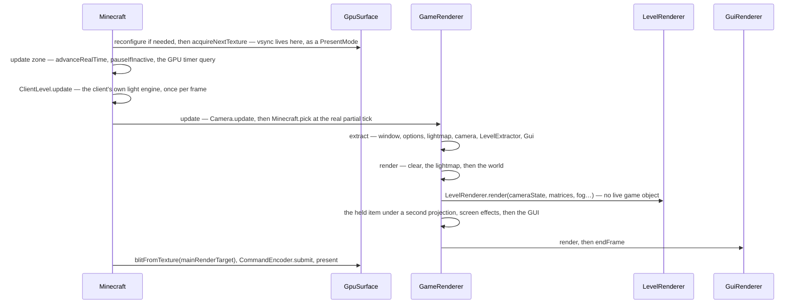

# The frame

> Verified against **Minecraft 26.2** · Part XI · one frame: from acquiring a surface texture to handing it back, and the wall in the middle that the drawing half is not allowed to look past.

## Responsibility

`Minecraft.renderFrame` is one method and two halves. The first walks the
live game and copies everything drawable into a `GameRenderState`; the second
draws that state. This page is the frame: what is in the snapshot, which of
the several different "partial ticks" a given system gets, where presentation
actually happens, and how honest the wall between the halves really is.
How many ticks ran before the frame, and what paced it, is
[the client loop](../client/the-client-loop.md).

The one sentence a player would recognise: *the number in the top-left that
says 143 fps.*

The headline for a 1.21-era reader: **the rendering model is extract then
render.** `GameRenderer.extract` copies the live game into a
`GameRenderState`; `LevelRenderer.render` is handed a `CameraRenderState`
rather than a `Camera`, because by the time it runs the camera is allowed to
have moved on. *MultiBufferSource* does not exist.

## The data it owns

- **`GameRenderer`** — the frame's owner of everything drawn.
  `GameRenderer.gameRenderState` (the extract target),
  `GameRenderer.mainCamera`, `GameRenderer.mainRenderTarget`,
  `GameRenderer.renderBuffers`, `GameRenderer.featureRenderDispatcher`,
  `GameRenderer.guiRenderer`, `GameRenderer.itemInHandRenderer`,
  `GameRenderer.screenEffectRenderer`, `GameRenderer.lightmap` and
  `GameRenderer.uiLightmap`, `GameRenderer.fogRenderer`,
  `GameRenderer.resourcePool` (a `CrossFrameResourcePool`, three frames
  deep), `GameRenderer.globalSettingsUniform`,
  `GameRenderer.levelProjectionMatrixBuffer`, `GameRenderer.hudProjection`,
  and the post-effect state `GameRenderer.postEffectId` /
  `GameRenderer.effectActive`.
- **`GameRenderState`** — the snapshot: `GameRenderState.levelRenderState`,
  `GameRenderState.lightmapRenderState`, `GameRenderState.guiRenderState`,
  `GameRenderState.optionsRenderState`, `GameRenderState.windowRenderState`
  and `GameRenderState.framerateLimit`. `CameraRenderState` is the camera's
  half — `CameraRenderState.pos`, `CameraRenderState.projectionMatrix`,
  `CameraRenderState.cullFrustum`, `CameraRenderState.fogData`,
  `CameraRenderState.fogType`, `CameraRenderState.hudFov`.
- **`Camera`** — split three ways. `Camera.tick` smooths the eye height and
  the field-of-view modifier and advances the camera's
  `EnvironmentAttributeProbe`; `Camera.update` does `Camera.alignWithEntity`,
  `Camera.calculateFov`, `Camera.prepareCullFrustum` and
  `Camera.setupPerspective`; `Camera.extractRenderState` copies the result.
  Its accessors lost their *get* prefix: `Camera.position`,
  `Camera.blockPosition`, `Camera.entity`, `Camera.xRot`, `Camera.yRot`,
  `Camera.rotation`, `Camera.forwardVector`, `Camera.upVector`,
  `Camera.leftVector`, `Camera.isDetached`, `Camera.getCullFrustum`,
  `Camera.attributeProbe`.
- **`RenderBuffers`** — much smaller than it was: `RenderBuffers.fixedBufferPack`
  and `RenderBuffers.sectionBufferPool` (the section-meshing scratch, sized
  to the processor count) plus one shared `RenderBuffers.stagedVertexBuffer`,
  released by `RenderBuffers.endFrame`. Geometry submission moved to
  `SubmitNodeCollector` / `SubmitNodeStorage`, drawn either inside the frame
  graph's passes or, for the hand and screen effects, by
  `FeatureRenderDispatcher.renderAllFeatures`.
- **`Window`** and **`GpuSurface`** — the window handle and the presentable
  surface: `GpuSurface.acquireNextTexture`, `GpuSurface.blitFromTexture`,
  `GpuSurface.present`, `GpuSurface.configure` and
  `GpuSurface.PresentMode`. Alongside them
  `Minecraft.invalidateSurfaceConfiguration` and `Minecraft.timerQuery`, the
  GPU-side stopwatch behind the F3 utilisation figure.

## When it runs

On the same thread as everything else — see
[the client loop](../client/the-client-loop.md). The whole of
`Minecraft.renderFrame` is wrapped in a guard: if the window surface is
already acquired, the call is a silent no-op, which is what makes it safe for
the blocking loops to call it re-entrantly.

`Minecraft.renderFrame` takes a flag saying whether this frame advances game
time, and three call sites pass false: the two loops that wait for the
integrated server to start and to stop, and `Minecraft.setScreenAndShow`,
which forces a single frame so a screen appears during blocking work. With
the flag false there are no ticks, no client lighting and no world render at
all — the frame is GUI only.

## The trace: one frame

Read it as **acquire, snapshot, draw, present**. The wall is between extract
and render, and it is real one level down: `LevelRenderer.render` is handed
state and reads no live object. It is *not* clean at the top —
`GameRenderer.render` still reads whether the game has finished loading,
whether a level exists, the shader manager, and — inside the world half —
the player's portal and nausea intensities and whether the boss bar wants
fog. The interesting fact is not that the wall exists but that it is drawn
one level below where the extract/render naming implies.

## Interfaces

- **Called by:** `Minecraft.runTick`, plus three non-ticking call sites, all
  in `Minecraft`.
- **Calls into:** the frame graph and the section meshes in
  [level rendering](level-rendering.md); the GPU abstraction in
  [blaze3d](blaze3d.md); `Gui.extractRenderState` and `GuiRenderer.render`
  in [GUI and screens](../client/gui-and-screens.md).
- **Crosses the network as:** nothing.
- **Data-driven by:** `Options` — render distance, field of view, vsync,
  graphics preset, and the post-effect chain selected by
  `GameRenderer.postEffectId`.

## Invariants and surprises

- **One frame uses several different partial ticks.** The world gets
  `DeltaTracker.getGameTimeDeltaPartialTick` with frozen time honoured; the
  camera and the held item get `Camera.getCameraEntityPartialTicks`, which
  ignores freezing and returns a hard one when the camera entity itself is
  frozen. The lightmap is extracted at a hard one and ignores partial ticks
  entirely. Under `/tick freeze` the world is pinned and the camera still
  interpolates.
- **Nothing is presented in the zone called *present*.** That zone does the
  blit from the main render target; the submit and the actual
  `GpuSurface.present` happen in the *swapBuffers* zone after it. The names
  are the wrong way round, and the surprise is which one lies.
- **Vsync is not a swap interval any more.** It is a `GpuSurface.PresentMode`
  baked into the surface configuration, so toggling it forces a surface
  reconfigure rather than setting a flag.
- **Surface acquisition can fail, and the frame just stops.** An acquisition
  exception marks the surface invalid and schedules a reconfigure; the blit
  and the present each re-test that the surface is still acquired before
  running.
- **A resize is handled in the middle of a render.** The render pass
  compares the window render state's size against the main target's and
  resizes the renderer inline when they differ.
- **The cull frustum is deliberately wider than the camera.**
  `Camera.createProjectionMatrixForCulling` uses the larger of the current
  and configured fields of view, so sprint FOV can never cull a section the
  unmodified FOV would have shown.
- **The level's geometry is not drawn by `FeatureRenderDispatcher.renderAllFeatures`.**
  That method has two call sites, both for the hand and the screen effects;
  the world's submitted features are prepared into the frame graph and drawn
  by its passes.
- **The framerate the limiter uses is a snapshot.** It is copied into
  `GameRenderState.framerateLimit` during the update zone, so the value the
  loop sleeps against is the one the frame began with.
- **Names a 1.21-era reader will hunt for and not find:**
  *Minecraft.getMainRenderTarget* (now `GameRenderer.mainRenderTarget`),
  *Camera.setup* (now `Camera.update` plus `Camera.extractRenderState`),
  *GameRenderer.getProjectionMatrix* and *resetProjectionMatrix*,
  *Window.updateDisplay*, *MultiBufferSource* and every buffer source on
  `RenderBuffers`, and *LightTexture* (now `Lightmap`).

## Where to look

`Minecraft.renderFrame` — the frame is one method, and its profiler zones are
its table of contents. Then `GameRenderer.extract` and `GameRenderer.render`
for the wall between live objects and drawing, `Camera.update` for how the
view is decided, and `GpuSurface.present` for where a frame ends.

---

*Rules: names, never code · how the system works, not how the code reads ·
newest version only · every backticked name passes `tools/verify_names.py`.*
