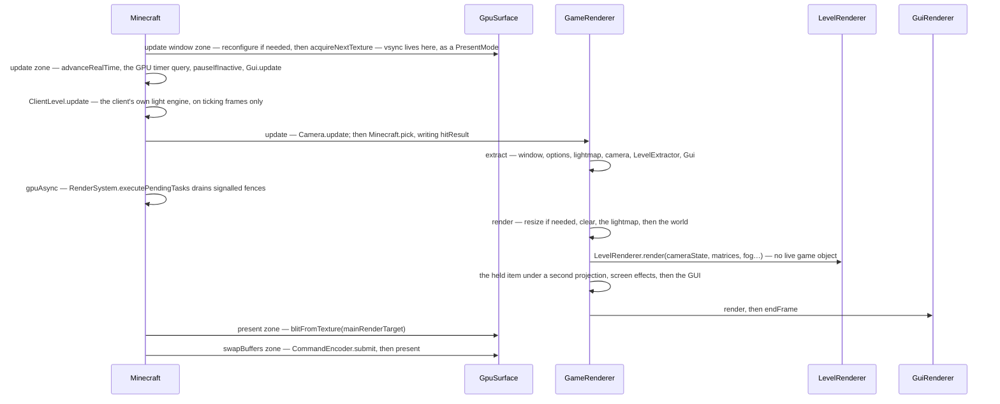

# The frame

> Verified against **Minecraft 26.2** · Part XI · one frame: from acquiring a surface texture to handing it back, and the wall in the middle that the drawing half is not allowed to look past.

## Responsibility

`Minecraft.renderFrame` is one method and two halves. The first walks the
live game and copies everything drawable into a `GameRenderState`; the second
draws that state. This page is the frame: what is in the snapshot, which of
the several different "partial ticks" a given system gets, where presentation
actually happens, and how honest the wall between the halves really is.
How many ticks ran before the frame, and what paced it, is
[the client loop](../client/the-client-loop.md).

The one sentence a player would recognise: *the number in the top-left that
says 143 fps.*

The headline for a 1.21-era reader: **the rendering model is extract then
render.** `GameRenderer.extract` copies the live game into a
`GameRenderState`; `LevelRenderer.render` is handed a `CameraRenderState`
rather than a `Camera`, because by the time it runs the camera is allowed to
have moved on. *MultiBufferSource* does not exist.

## The data it owns

- **`GameRenderer`** — the frame's owner of everything drawn.
  `GameRenderer.gameRenderState` (the extract target),
  `GameRenderer.mainCamera`, `GameRenderer.mainRenderTarget`,
  `GameRenderer.renderBuffers`, `GameRenderer.featureRenderDispatcher`,
  `GameRenderer.guiRenderer`, `GameRenderer.itemInHandRenderer`,
  `GameRenderer.screenEffectRenderer`, `GameRenderer.lightmap` and
  `GameRenderer.uiLightmap`, `GameRenderer.fogRenderer`,
  `GameRenderer.resourcePool` (a `CrossFrameResourcePool`, three frames
  deep), `GameRenderer.globalSettingsUniform`,
  `GameRenderer.levelProjectionMatrixBuffer`, `GameRenderer.hudProjection`
  and `GameRenderer.hud3dProjectionMatrixBuffer`, and the post-effect state
  `GameRenderer.postEffectId` / `GameRenderer.effectActive`.
- **`GameRenderState`** — the snapshot: `GameRenderState.levelRenderState`,
  `GameRenderState.lightmapRenderState`, `GameRenderState.guiRenderState`,
  `GameRenderState.optionsRenderState`, `GameRenderState.windowRenderState`
  and `GameRenderState.framerateLimit`. `CameraRenderState` is the camera's
  half — `CameraRenderState.pos`, `CameraRenderState.projectionMatrix`,
  `CameraRenderState.cullFrustum`, `CameraRenderState.fogData`,
  `CameraRenderState.fogType`, `CameraRenderState.hudFov`.
- **`Camera`** — split three ways. `Camera.tick` (driven from
  `GameRenderer.tick`, not from the frame) smooths the eye height and the
  field-of-view modifier and advances the camera's
  `EnvironmentAttributeProbe`; `Camera.update` does `Camera.alignWithEntity`,
  `Camera.calculateFov`, `Camera.prepareCullFrustum` and
  `Camera.setupPerspective`; `Camera.extractRenderState` copies the result.
  Many accessors lost their *get* prefix: `Camera.position`,
  `Camera.blockPosition`, `Camera.entity`, `Camera.xRot`, `Camera.yRot`,
  `Camera.rotation`, `Camera.forwardVector`, `Camera.upVector`,
  `Camera.leftVector`, `Camera.attributeProbe`. Others kept it —
  `Camera.getCullFrustum`, `Camera.getFov`, `Camera.getNearPlane`,
  `Camera.getCameraEntityPartialTicks`.
- **`RenderBuffers`** — much smaller than it was: `RenderBuffers.fixedBufferPack`
  and `RenderBuffers.sectionBufferPool` (the section-meshing scratch, capped
  by the processor count but also by a memory budget) plus one shared
  `RenderBuffers.stagedVertexBuffer`, released by `RenderBuffers.endFrame`.
  The GUI keeps a second, separate staged buffer inside `GuiRenderer`.
  Geometry submission moved to `SubmitNodeCollector` / `SubmitNodeStorage`,
  drawn either inside the frame graph's passes or by
  `FeatureRenderDispatcher.renderAllFeatures`.
- **`Window`** and **`GpuSurface`** — the window handle and the presentable
  surface: `GpuSurface.acquireNextTexture`, `GpuSurface.blitFromTexture`,
  `GpuSurface.present`, `GpuSurface.configure` and
  `GpuSurface.PresentMode`. Alongside them
  `Minecraft.invalidateSurfaceConfiguration` and `Minecraft.timerQuery`, the
  GPU-side stopwatch behind the F3 utilisation figure.

## When it runs

On the same thread as everything else — see
[the client loop](../client/the-client-loop.md). The whole of
`Minecraft.renderFrame` is wrapped in a guard: if the window surface is
already acquired, the call is a silent no-op.

`Minecraft.renderFrame` takes a flag saying whether this frame advances game
time, and three call sites pass false: the two loops that wait for the
integrated server to start and to stop, and `Minecraft.setScreenAndShow`,
which forces a single frame so a screen appears during blocking work. With
the flag false there are no ticks, no client lighting and no world render at
all — the frame is GUI only.

The profiler zones are the frame's table of contents, and naming them in
order is the shortest description of what a frame is: *update window* ·
*update* · *extract* · *gpuAsync* · *render* (which pushes *world* and
*gui*, and inside the world *matrices*, *fog*, *level*, *hand*,
*screenEffects*) · *present* · *swapBuffers* · *frameLimiter* ·
*fpsUpdate*.

## The trace: one frame

Read it as **acquire, snapshot, draw, present**. The wall is between extract
and render, and it is real one level down: `LevelRenderer.render` is handed
state and reads no live *game* object — it holds no `ClientLevel` and no
`Minecraft` — though it still reaches back into live renderer objects for
the main target and the shader manager.

It is *not* clean at the top. `GameRenderer.render` reads whether the game
has finished loading, whether a level exists, and the world's game time,
every frame including GUI-only ones. And inside the world half the leak is
sharper than the portal and nausea intensities the naming would suggest:
`GameRenderer.shouldRenderBlockOutline` performs a **live world lookup
during rendering** — the camera entity, `Minecraft.hitResult` (written back
in the update zone by `Minecraft.pick`), a `BlockState` read, and the
current game mode. The interesting fact is not that the wall exists but that
it is drawn one level below where the extract/render naming implies.

## Interfaces

- **Called by:** `Minecraft.runTick`, plus three non-ticking call sites, all
  in `Minecraft`.
- **Calls into:** the frame graph and the section meshes in
  [level rendering](level-rendering.md); the GPU abstraction in
  [blaze3d](blaze3d.md); `Gui.extractRenderState` and `GuiRenderer.render`
  in [GUI and screens](../client/gui-and-screens.md).
- **Crosses the network as:** nothing.
- **Data-driven by:** `Options` — render distance, field of view, vsync,
  graphics preset. The post-effect chain is *not* an option: see below.

## Invariants and surprises

- **One frame uses five different partial ticks.** The world gets
  `DeltaTracker.getGameTimeDeltaPartialTick` with frozen time honoured. The
  camera and the held item get `Camera.getCameraEntityPartialTicks`, which
  ignores freezing — and returns a hard one only when the *camera entity
  itself* is frozen, which a player never is. The lightmap is extracted at a
  literal one. Screens and overlays get the realtime delta,
  `DeltaTracker.getRealtimeDeltaTicks`, which is clamped to a half if the
  frame took longer than seven ticks. And **each entity gets its own**:
  `LevelExtractor` asks for the frozen-honouring value per entity, so under
  `/tick freeze` every mob pins at the end of its last tick while players
  keep interpolating, in the same frame.
- **Nothing is presented in the zone called *present*.** That zone does the
  blit from the main render target; the submit and the actual
  `GpuSurface.present` happen in the *swapBuffers* zone after it. The names
  are the wrong way round, and the surprise is which one lies.
- **Vsync is not a swap interval any more.** It is a `GpuSurface.PresentMode`
  baked into the surface configuration, so toggling it forces a surface
  reconfigure rather than setting a flag.
- **A failed surface acquisition does not stop the frame; it discards it.**
  An acquisition exception marks the surface invalid and schedules a
  reconfigure, and then the frame runs *in full* — update, extract, the
  whole world render into `GameRenderer.mainRenderTarget`, the GUI, the
  framerate limiter. Only the blit and the present re-test that the surface
  is acquired, and both quietly skip. A minimized window is the same story
  with no acquisition attempted at all: the game keeps rendering complete
  frames that nobody ever sees.
- **A resize is handled inside the render half.** `GameRenderer.render`
  opens by comparing the window render state's size against the main
  target's and resizing the renderer inline when they differ — the snapshot
  is what the frame believes the window size to be, even if it has changed
  since.
- **The cull frustum is deliberately wider than the camera, and not for the
  reason you would guess.** `Camera.createProjectionMatrixForCulling` takes
  the larger of the current and the *configured* field of view. Sprinting
  and flying raise the live FOV above the option, so for them the maximum is
  a no-op. It bites when something **narrows** the view — a spyglass, a
  drawn bow, the dying-camera effect — where culling against the configured
  FOV keeps the geometry a narrowed view would have thrown away, so
  releasing the zoom does not reveal a hole.
- **`FeatureRenderDispatcher.renderAllFeatures` is not how the level is
  drawn.** It has four call sites — the held item, the screen effects, the
  GUI's item atlas and picture-in-picture — and the last two are why the
  GUI needs its own submit storage. The world's submitted features are
  prepared into the frame graph and drawn by its passes.
- **The GUI is lit by a one-pixel white texture.** `GameRenderer.lightmap`
  hands out `GameRenderer.uiLightmap` while `GameRenderer.useUiLightmap` is
  set, which is exactly the GUI block; `GameRenderer.levelLightmap` always
  returns the real one.
- **The post-effect chain is chosen by what you are spectating, not by an
  option.** `GameRenderer.checkEntityPostEffect` switches on the camera
  entity's type — creeper, spider, enderman — and `GameRenderer.postEffectId`
  is set from there. F4 (`GameRenderer.togglePostEffect`) flips it off and on.
- **The frame limiter runs inside the frame.** The limit is snapshotted into
  `GameRenderState.framerateLimit` as the first statement of the *extract*
  zone, and spent at the end of the same `Minecraft.renderFrame` in the
  *frameLimiter* zone — and only below a threshold, so the top slider
  position does not park at all. `FramerateLimitTracker` overrides the
  option when the window is iconified, when you have been idle, and in a
  menu with no level.
- **The frame is not the only extract/render path.**
  `Minecraft.grabPanoramixScreenshot` runs `GameRenderer.update`,
  `GameRenderer.extract` and `GameRenderer.renderLevel` six times, at 4096×4096, with a fixed delta of
  one and the camera in panoramic mode — which is why
  `CameraRenderState.isPanoramicMode` exists. There is also a silent
  world-icon screenshot inside the world half, singleplayer only and gated
  on enough sections having actually been rendered.
- **Names a 1.21-era reader will hunt for and not find:**
  *Minecraft.getMainRenderTarget* (now `GameRenderer.mainRenderTarget`),
  *Camera.setup* (now `Camera.update` plus `Camera.extractRenderState`),
  *GameRenderer.getProjectionMatrix* and *resetProjectionMatrix*,
  *Window.updateDisplay*, *MultiBufferSource* and every buffer source on
  `RenderBuffers`, and *LightTexture* (now `Lightmap`).

## Where to look

`Minecraft.renderFrame` — the frame is one method, and its profiler zones are
its table of contents. Then `GameRenderer.extract` and `GameRenderer.render`
for the wall between live objects and drawing, `GameRenderer.tick` for the
per-tick half nobody expects a renderer to have, `Camera.update` for how the
view is decided, and `GpuSurface.present` for where a frame ends.

---

*Rules: names, never code · how the system works, not how the code reads ·
newest version only · every backticked name passes `tools/verify_names.py`.*
