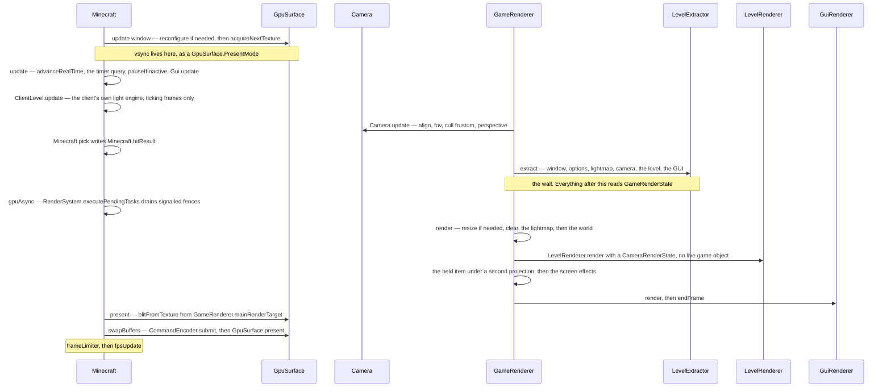

# The frame

> Verified against **Minecraft 26.2** · Part XI · one frame: from acquiring a surface texture to handing it back, and the wall in the middle that the drawing half is not allowed to look past.

The number in the top-left says 143 fps, and each of those 143 is one call to
`Minecraft.renderFrame` — one method with two halves. The first walks the
live game and copies everything drawable into a `GameRenderState`; the second
draws that state and nothing else. Before either half runs, the frame asks
[the window](the-window.md) for somewhere to put the picture, and the
surprising thing is what happens when that request fails. It does not skip
the frame. It skips the *picture*. The world still renders in full into
`GameRenderer.mainRenderTarget`, the GUI still goes on top, the framerate
limiter still parks; only the blit and the present are guarded on a surface
having been acquired, and both are quietly skipped. A minimized window is the same story with
no attempt made at all — a client drawing complete frames that nobody will
ever see.

All of this is one thread — the same one that ticked the world a moment
earlier. How many ticks ran before the
frame, and what paced it afterwards, is [the client
loop](../client/the-client-loop.md); this page starts where that page's
*frame* zone opens.

## The cast

| class | what it decides | thread |
|---|---|---|
| `Minecraft` | the zones, the acquire guard, and whether this frame advances game time at all | Render thread |
| `GameRenderer` | the frame's owner of everything drawn — the snapshot target, the main render target, the camera, the lightmaps | Render thread |
| `GameRenderState` | what the drawing half is allowed to read, and therefore where the wall is | written in *extract*, read in *render* |
| `Camera` | where the eye is, how wide the view is, and how wide the *cull* frustum is — which is not the same number | Render thread, but ticked from `GameRenderer.tick` |
| `LevelExtractor` | which of the live world becomes drawable state, at one partial tick **per entity** | Render thread |
| `LevelRenderer` | the world half — handed a `CameraRenderState`, never a `Camera` | Render thread |
| `GuiRenderer` | the GUI half, with its own `StagedVertexBuffer` and its own `FeatureRenderDispatcher` | Render thread |
| `GpuSurface` | whether there is anywhere to put the picture: acquire, blit, present | Render thread |

## The zones a frame is made of

The profiler zones in order are the shortest honest description of what a
frame is, and the second column is the part a name does not tell you: who
pushes it. Only the first four and the last four are `Minecraft.renderFrame`'s
own. *render* belongs to `GameRenderer.render`, which is why the F3 pie chart
puts the whole of the drawing half under one slice that `Minecraft` never
named, and one of these names is a lie — the section on presentation below
says which.

| zone | pushed by | what happens in it |
|---|---|---|
| *update window* | `Minecraft.renderFrame` | the window's one per-frame call, a surface reconfigure if one is due, then `GpuSurface.acquireNextTexture` |
| *update* | `Minecraft.renderFrame` | the real-time clock, the GPU timer query, `Minecraft.pauseIfInactive`, the GUI, the client light engine on a ticking frame, then `Minecraft.pick` |
| *camera* | `GameRenderer.update`, inside *update* | `Camera.update` alone — the only zone in the frame that wraps a single call |
| *extract* | `Minecraft.renderFrame` | the wall: the window, the options, the lightmap, the camera, the level and the GUI copied into `GameRenderState` |
| *gpuAsync* | `Minecraft.renderFrame` | `RenderSystem.executePendingTasks` drains signalled fences, and nothing else; it is closed before the drawing starts |
| *render* | `GameRenderer.render` | the resize, the clear, the lightmap, then the two zones below |
| *world* | `GameRenderer.render`, inside *render* | only on a frame with a level: *matrices*, *fog*, *level*, *hand*, *screenEffects*, then the outline composite and the spectator post chain |
| *gui* | `GameRenderer.render`, inside *render* | the GUI, drawn under the one-pixel lightmap |
| *present* | `Minecraft.renderFrame` | the blit, and not the present |
| *swapBuffers* | `Minecraft.renderFrame` | the submit, then `GpuSurface.present` |
| *frameLimiter* | `Minecraft.renderFrame` | the parking, spending the limit *extract* snapshotted |
| *fpsUpdate* | `Minecraft.renderFrame` | the counter behind the number in the top-left |

Read it as **acquire, snapshot, draw, present** — and note that only the
first and last of those four touch the surface.

## Acquire, and the frame that carries on without one

The *update window* zone does three things, and the first belongs to
somebody else: `Window.updateFullscreenIfChanged` at the very top of it —
[the window](the-window.md#what-the-window-does-per-frame-which-is-almost-nothing)'s
one per-frame call — then a reconfigure of the surface if it needs one, then
`GpuSurface.acquireNextTexture`. Vsync is a
[`GpuSurface.PresentMode`](blaze3d.md#how-a-frame-reaches-the-screen) in that
configuration rather than a swap interval, so toggling it in the options
forces a reconfigure — `Minecraft.invalidateSurfaceConfiguration` — rather
than setting a flag.

When the acquisition throws, the surface is marked invalid, a reconfigure is
scheduled, and the frame goes on as if nothing had happened but for a line in
the log. Exactly two later statements re-test whether a surface is actually
held, and both are in `Minecraft.renderFrame` itself: the blit and the
present are each guarded on `GpuSurface.isAcquired`, with nothing on the
other branch.
The tolerance is the caller's, not the surface's — `GpuSurface.blitFromTexture`
and `GpuSurface.present` both throw if you reach them without one. Everything
between those two guards — the extract, the world, the GUI — is paid in
full.

There is one guard on the whole method, and it is about re-entry rather than
failure: if the surface is *already* acquired when `Minecraft.renderFrame` is
called, the call is a silent no-op.

### What a minimized client actually stops doing

A minimized window is the same story with the acquire not attempted at all,
so the three statements that drop out are the acquire and the two guarded
ones — which is nothing next to what the frame still pays for. The saving
comes from somewhere else entirely.
`FramerateLimitTracker.getThrottleReason` tests iconification *first*, ahead
of idleness and the menu, and answers with a limit of ten — so *frameLimiter*
parks the thread for most of every hundred milliseconds and the client draws
its unseen frames about ten times a second instead of at the player's
setting. On top of that, losing focus for half a second pauses a
singleplayer world outright through `Minecraft.pauseIfInactive`, and then
there is no world left to draw.

## Update and extract: six clocks in one frame

The *update* zone advances the real-time clock, reads
`Minecraft.timerQuery` — a `TimerQuery`, the GPU-side stopwatch behind the F3
utilisation figure. It brackets almost the whole frame, from here to the end
of *render*, and it is only *started* when the last one has been collected,
so not every frame is measured — runs
`Minecraft.pauseIfInactive` and updates the GUI. Then
`GameRenderer.update` calls `Camera.update` — that one call is the *camera*
zone — and `Minecraft.renderFrame` follows it with `Minecraft.pick`, a
private method of `Minecraft` and not the renderer's, which writes
`Minecraft.hitResult` for the crosshair and the block outline to find later.

Between those two sits the flag the rest of the page keeps leaning on.
`Minecraft.renderFrame` is passed a boolean saying whether this frame
advances game time, and a frame passed false is a **non-ticking frame**: no
ticks ran before it, `ClientLevel.update` does not run the client's own
light engine, and the whole world half of the drawing is skipped, leaving a
GUI-only picture — the half [GUI and
screens](../client/gui-and-screens.md) owns. Three call sites pass false:
the two loops that wait for the integrated server to start and to stop, and
`Minecraft.setScreenAndShow`, which forces a single frame so that a screen
appears during blocking work. Every other frame is a ticking one, and the
term means only that.

`Camera` is split three ways across the client, and two of the three are here.
`Camera.tick` — driven from `GameRenderer.tick`, not from the frame — smooths
the eye height and the field-of-view modifier and advances the camera's
`EnvironmentAttributeProbe`. `Camera.update` does the frame's work:
`Camera.alignWithEntity`, `Camera.calculateFov`, `Camera.prepareCullFrustum`,
`Camera.setupPerspective`. `Camera.extractRenderState` then copies the result
across the wall.

### Six partial ticks, and none of them is *the* one

*Extract* opens by snapshotting the framerate limit into
`GameRenderState.framerateLimit` and goes on to copy the window, the options,
the lightmap, the camera and the level. It is here that the frame's oddest
number appears: there is no such thing as *the* partial tick of a frame.
There are six, they disagree on purpose, and one of them is not a partial
tick at all.

| who is interpolated | which value | what it ignores |
|---|---|---|
| the world | `DeltaTracker.getGameTimeDeltaPartialTick` | nothing — frozen time is honoured |
| the camera and the held item | `Camera.getCameraEntityPartialTicks` | freezing, unless the *camera entity itself* is frozen, which a player never is |
| the lightmap | a literal one | everything — it is extracted fully advanced |
| screens and overlays | `DeltaTracker.getGameTimeDeltaTicks` | the fraction — this is the whole delta since the last frame, not a position inside a tick |
| the autosave indicator and the title-screen panorama | `DeltaTracker.getRealtimeDeltaTicks` | the game clock, and anything past seven ticks, where it clamps to a half |
| each entity, separately | its own frozen-honouring value, asked for by `LevelExtractor` | the world's single answer |

The last row is the one you can see. Under `/tick freeze` a mob pins at the
end of its last tick while players go on interpolating — in the same frame,
from the same extract. The exception is worth knowing, because it is the one
a player rides: `TickRateManager.isEntityFrozen` excludes anything with a
player aboard, so the horse under you keeps moving smoothly while the horse
beside you is a statue.

## The wall, and the one level at which it is real

`LevelRenderer.render` is handed state and reads no live *game* object: no
`ClientLevel`, no `Minecraft`. That is the wall, and one level down it holds.
It still reaches back into live *renderer* objects for the main target and
the shader manager, but no live game object is among them.

At the top it leaks, and the leak is sharper than the naming suggests.
`GameRenderer.render` reads whether the game has finished loading, whether a
level exists, and the world's game time, every frame including GUI-only ones.
Inside the world half, `GameRenderer.shouldRenderBlockOutline` reads the
**live camera entity during rendering**, and in adventure or spectator mode
goes further: for a player who may not build it reads `Minecraft.hitResult`,
looks a `BlockState` up in the level and asks the game mode what it is, all
mid-draw. The interesting fact is not that a wall exists but that it is
drawn one level below where *extract then render* implies it is.

### The resize the snapshot has already decided

A resize is handled inside the render half rather than before it:
`GameRenderer.render` opens by comparing `GameRenderState.windowRenderState`
against the main target's size and resizing the renderer inline when they
differ. The snapshot is what the frame believes the window size to be, even
if the window has changed since.

### What the two halves share, which is three buffers and a storage

The buffers the halves share are far smaller than a 1.21-era reader expects.
`RenderBuffers` holds `RenderBuffers.fixedBufferPack`, the section-meshing
scratch `RenderBuffers.sectionBufferPool` — capped by processor count and
again by a memory budget — and a single shared
`RenderBuffers.stagedVertexBuffer` released by `RenderBuffers.endFrame`, with
the GUI keeping a second staged buffer of its own inside `GuiRenderer`.
Geometry submission moved to `SubmitNodeCollector` and `SubmitNodeStorage`
([entity rendering](entity-rendering.md#submit-describing-a-draw-without-making-one)
owns what a submission is), drawn either by the passes of the frame graph in
[visibility and the frame graph](visibility-and-the-frame-graph.md#declaring-the-passes-and-why-none-of-them-is-ever-culled)
or by `FeatureRenderDispatcher.renderAllFeatures` — which, despite the name,
is **not** how the level is drawn. It has four call sites: the held item, the
screen effects, the GUI's item atlas and picture-in-picture. The last two are
why the GUI needs submit storage at all. The world's submitted features are
prepared into the frame graph and drawn by its passes.

### The hand and the screen effects, in a storage the level never sees

The first two of those four call sites share a storage of their own.
`GameRenderer.handAndScreenSubmitNodeStorage` collects both
`GameRenderer.renderItemInHand` — which is `ItemInHandRenderer`, drawn under
its own projection after a depth clear so a held sword never intersects the
world — and, in the *screenEffects* zone that follows it,
`ScreenEffectRenderer`: the underwater overlay, the fire quad when you are
burning, the sprite of whatever block your head is inside, and the
item-activation flourish a totem plays. Both are submitted, prepared and
drawn inside that one zone, and neither ever reaches the level's frame graph.

## Present, swapBuffers, and which of the two names lies

**Nothing is presented in the zone called *present*.** That zone does the
blit from `GameRenderer.mainRenderTarget` to the acquired surface texture.
The submit and the actual `GpuSurface.present` happen in the *swapBuffers*
zone after it. Only one of the two names lies: *swapBuffers* is honest, since
on the OpenGL backend `GpuSurface.present` is a single call to GLFW's
buffer swap.

The last two zones are bookkeeping. *frameLimiter* spends the limit that
*extract* snapshotted into `GameRenderState.framerateLimit`, parking only
below a threshold, so the top slider position never parks at all. What that
limit is — and the four cases in which `FramerateLimitTracker` has already
replaced the player's option with something smaller — is [the client
loop](../client/the-client-loop.md#the-frame-cap-is-usually-the-option-and-sometimes-is-not)'s;
this page only spends it. Then *fpsUpdate*, and the frame is over.

## Questions players ask

**Why does lowering a spyglass never reveal a hole in the world?** Because
the cull frustum is deliberately wider than the camera.
`Camera.createProjectionMatrixForCulling` builds its matrix from the larger
of the current and the *configured* field of view; `Camera.prepareCullFrustum`
turns that into `Camera.cullFrustum`, and `Camera.extractRenderState` copies
it across the wall into `CameraRenderState.cullFrustum`. Sprinting and flying raise the live FOV
above the option, so for them the maximum does nothing. It bites when
something **narrows** the view — a spyglass, a drawn bow, the dying-camera
effect — where culling against the configured FOV keeps the geometry a
narrowed view would have thrown away.

**Why is the HUD not shaded by the light the player is standing in?**
Because for the whole of the *gui* zone `GameRenderer.lightmap` hands out a
one-pixel white texture instead of the real one. `GameRenderer.useUiLightmap`
is set on either side of exactly that zone and nowhere else; which two
textures it is switching between is [lightmap, fog and
sky](lightmap-fog-and-sky.md#how-bright-one-draw-per-tick-and-no-partial-ticks-at-all)'s.

**Why does the world go strange when spectating a creeper?** Because the
post-effect chain is chosen by what you are spectating rather than by an
option, at the end of the world block and before any GUI. Which chain,
through which door, and what each does to the picture are
[post-processing](post-processing.md#the-six-chains)'s.

**Where does the main menu's panorama come from?** The game, on the same two
halves. `Minecraft.grabPanoramixScreenshot` runs `GameRenderer.update`,
`GameRenderer.extract` and `GameRenderer.renderLevel` six times at
4096×4096, with a fixed delta of one and the camera in panoramic mode —
which is what `CameraRenderState.isPanoramicMode` exists for. A second,
silent screenshot path inside the world half writes the world icon,
singleplayer only, and only once enough sections have actually been rendered.

> **For a 1.21-era reader.** The rendering model is now **extract then
> render**: `GameRenderer.extract` copies the live game into a
> `GameRenderState`, and `LevelRenderer.render` is handed a
> `CameraRenderState` rather than a `Camera`, because by the time it runs the
> camera is allowed to have moved on. Names to stop hunting for:
> *Minecraft.getMainRenderTarget* (now `GameRenderer.mainRenderTarget`),
> *Camera.setup* (now `Camera.update` plus `Camera.extractRenderState`),
> *GameRenderer.getProjectionMatrix*, *Window.updateDisplay*, *LightTexture*
> (now `Lightmap`), and *MultiBufferSource* with every buffer source that
> hung off `RenderBuffers`. Most `Camera` accessors also lost their *get*
> prefix, though `Camera.getCullFrustum` and `Camera.getFov` kept theirs.

## Where to look

`Minecraft.renderFrame` — the frame is one method, and its profiler zones are
its table of contents. Then `GameRenderer.extract` and `GameRenderer.render`
for the wall between live objects and drawing, `GameRenderer.tick` for the
per-tick half nobody expects a renderer to have, `Camera.update` for how the
view is decided, and `GpuSurface.present` — in the zone called *swapBuffers*
— for where a frame ends. The GPU abstraction underneath all of it is
[blaze3d](blaze3d.md).

---

*Rules: names, never code · how the system works, not how the code reads ·
newest version only · every backticked name passes `tools/verify_names.py`.*
