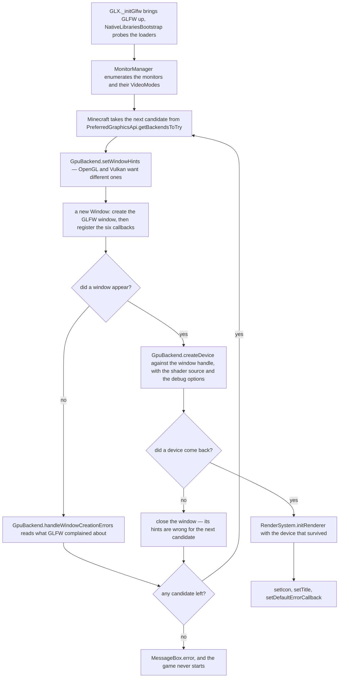
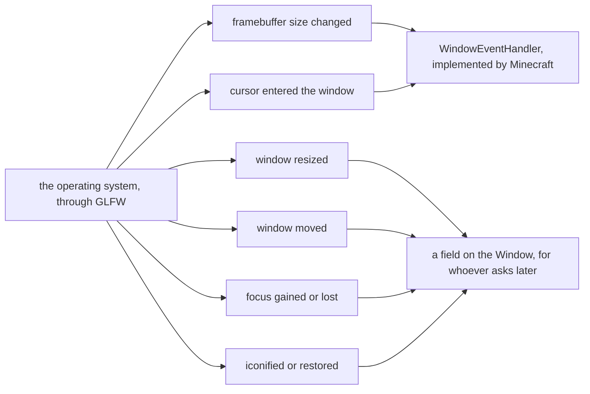

# The window

> Verified against **Minecraft 26.2** · Part XI · before the first frame: the game asks the operating system for a window, and finds out which graphics backend it has by which window survives.

The process is a second old. There is no world, no renderer, no resource
pack and nothing to draw. `GLX._initGlfw` has just brought GLFW up,
`NativeLibrariesBootstrap` has probed for the GL and Vulkan loaders and
`MonitorManager` has enumerated the monitors and the video modes each of them
offers. Now `Minecraft` wants a window — and it cannot ask for one without
already having decided how the pixels will be drawn. **The window and the
graphics backend are created together and neither can go first**: an OpenGL
window and a Vulkan window are made from different GLFW hints, so a Vulkan
attempt that gets a window and then fails at the device does not get to keep
the window. It is thrown away with the attempt, and the next candidate starts
from a fresh one.

That loop is the first half of the page. The second is what the window
turns into once it has survived one: **this is Part XI's platform layer, not
just its window** — the six callbacks the operating system may fire, the
three sizes every GUI element is placed against, and `NativeImage`, the CPU
image type every texture, screenshot, skin and glyph in the game passes
through on its way to or from a file. They share a package and a role rather
than a scenario, and the role is *everything between the game and the
machine it is running on*.

[The frame](the-frame.md) is the lecture you watch first, and it opens on a
surface that has already been acquired. This page is what acquired it.
[Input and keybinds](../client/input-and-keybinds.md) opens on a callback that
has already fired, and [blaze3d](blaze3d.md) on a `GpuDevice` that already
exists. All three of them start here.

## The cast

| class | what it decides | thread |
|---|---|---|
| `Minecraft` | which backends to try, in which order, and when to give up | Render thread |
| `Window` | the GLFW handle, the three sizes, and every fullscreen transition | Render thread |
| `GpuBackend` | the window hints, and whether a failed window is the backend's fault | Render thread |
| `MonitorManager` | which monitor the window is considered to be on | Render thread |
| `Monitor` | which `VideoMode` an exclusive fullscreen switch takes | Render thread |
| `WindowEventHandler` | which of the six operating-system callbacks reach the game | Render thread |
| `FramerateLimitTracker` | what an iconified, idle or menu-bound window is allowed to cost | Render thread |
| `NativeImage` | the CPU-side pixels between a file and a texture | native memory, closed by its owner |

Two of those rows live outside *com/mojang/blaze3d/platform* and the other
six in it: `Minecraft` is the game's own, and `GpuBackend` sits in
*blaze3d/systems* with
[the façades](blaze3d.md#four-objects-the-game-only-touches-through-a-façade).
None of the package exists on the server — `server-classes.txt` has no entry
under *com/mojang/blaze3d* at all — and all of it runs on the Render thread,
which is [one of the four](../anatomy/anatomy.md#four-threads-worth-memorising).

## Trying backends until one of them makes a window

The startup path is a retry loop, and it is drawn as a flowchart rather than a
conversation because the shape *is* the fact: the loop encloses the window and
the device together. A backend that cannot make a window and a backend that
cannot make a device fail identically, and both hand the next candidate a
clean slate.

**The list is never one candidate long.** `PreferredGraphicsApi.getBackendsToTry`
returns an ordered *pair*: every setting has the other API behind it as a
fallback, the default is OpenGL-first, and `GlBackend` and `VulkanBackend` are
the two things the loop above is choosing between. A previous unclean shutdown
downgrades twice over — a Vulkan preference becomes the default, and the
default becomes OpenGL — so a client that crashed on boot comes back on the
safest option it has, and stays there until you set it again. That is why
asking for Vulkan does not always get it.

What the window is asked for is a `DisplayData`: a size, an optional
fullscreen size and a fullscreen flag, with `DisplayData.withSize` and
`DisplayData.withFullscreen` for the transitions that change them later. What
comes back, if anything comes back, is a `Window` holding a `Window.handle`
and a `Window.backend` — and never a `GpuDevice`. The window knows which
backend made it and nothing about what that backend went on to build.

GLFW and STB, reached through LWJGL, are what the package sits on, and it
calls almost nothing else in the game on its way down. The exceptions are all
about reporting a failure upward: `Minecraft`, `CrashReport`, and the one
piece of the dedicated server the client borrows — `ClientShutdownWatchdog`
builds its report with `ServerWatchdog.createWatchdogCrashReport`, which is
the only *net.minecraft.server* name anything here touches. Above the
package, `Minecraft` drives startup and the two per-frame calls
below, `KeyboardHandler` and `MouseHandler` take the input callbacks and the
clipboard, `VideoSettingsScreen` drives the fullscreen and video-mode
controls, and `Screenshot` and `TextureManager` want `NativeImage`. What the
player's saved choices reach is `Options`: an override width and height, the
fullscreen flag and video-mode string, exclusive fullscreen, the GUI scale,
and the graphics-API preference that ordered the loop above. The window's
*position* is not among them — it is a field the move callback keeps and
nobody saves.

### How the loop knows why a window did not appear

`GpuBackend.handleWindowCreationErrors` in that figure reads something, and
what it reads is a list somebody was holding a pen over. `GLFWErrorScope` is
a closeable scope that installs an error callback, runs one piece of work and
puts the previous one back — throwing if anybody else changed it in between —
and what it usually installs is a `GLFWErrorCapture`, which does nothing but
collect what GLFW said into a list. The retry loop runs each window creation
inside one, so a failed attempt comes back with its reasons attached instead
of with a line in somebody's log. The same pairing is around GLFW's own
initialisation, the monitor enumeration and the clipboard read: four places
that expect to fail and want the failure themselves.

The scope is the fourth kind of error-callback swap and the only scoped one.
The other three are the game's life in order: a boot-crash handler while
starting, `Window.setDefaultErrorCallback` once running, and a null on close.
Across all of them `Window.setErrorSection` tags whatever GLFW complains
about with what the game was busy with — *Pre startup*, *Startup*, *Post
startup*, *Pre render* — which is why a driver's error message arrives in a
crash report attached to a phase rather than floating free.

## Six callbacks, and the two of them the game is ever told about

Once the window exists, `Window`'s constructor registers six GLFW callbacks,
and they are almost the whole of what the operating system can say to it.
`WindowEventHandler` — a three-method interface
that `Minecraft` implements — is the whole of what a window is allowed to say
back to the game, and the window only ever reaches for two of those three
methods.

`WindowEventHandler.framebufferSizeChanged` and
`WindowEventHandler.cursorEntered` are the two. A window resize, a window
move, a focus change and an iconify all end in a field — `Window.getX`,
`Window.getY`, `Window.isFocused` and `Window.isIconified` are what anyone
asks instead, whenever they get round to it — so four of the six events the
operating system reports are things the game is never *told*, only things it
can look up. `Window.isMinimized` is the one that reads like a fifth and is
not: it is set by the framebuffer callback, which fires with a zero-by-zero
size when the window goes away, and cleared by the same callback when a real
size comes back. That is also the whole of what minimising suppresses: the
frame skips its surface acquisition and otherwise runs in full, and where the
real saving comes from is [the
frame](the-frame.md#what-a-minimized-client-actually-stops-doing)'s.

The third method on the interface is the odd one.
`WindowEventHandler.resizeGui` is never called by `Window` at all: its callers
are `Minecraft` and `Options`, which is to say the game calling itself when
the GUI scale option changes. And `WindowEventHandler.framebufferSizeChanged` is not only a
callback — `Window.updateFullscreenIfChanged` and
`Window.changeFullscreenVideoMode` both raise it directly, which is how F11
and a video-mode switch reach the renderer by the same route a dragged window
corner does.

Notice what is *not* among the six: keys, characters, mouse buttons, cursor
motion and scrolling. Every input callback is registered somewhere else
entirely, by `KeyboardHandler` and `MouseHandler` — see [input and
keybinds](../client/input-and-keybinds.md).

### The seventh, which is not the constructor's

There is one more, and `Minecraft` adds it after the constructor has run: the
window-close callback, the one that fires when you click the X rather than
quitting from the menu. It is registered late because what it does is not the
window's business at all — it is one of the two places `ClientShutdownWatchdog`
is armed, and it is the one that catches a client hanging on the close button
rather than on the way out. That is why the game sometimes leaves a crash
report behind after you close it. [The two armings and what each may
do](../client/the-client-loop.md#starting-and-the-three-ways-of-stopping) are
the client loop's.

## Three sizes, and every misplaced GUI element is a confusion between them

| the size | how it is asked for | what it is |
|---|---|---|
| framebuffer | `Window.getWidth`, `Window.getHeight` | the pixels the renderer actually targets |
| screen | `Window.getScreenWidth`, `Window.getScreenHeight` | the window as the operating system reports it, which under DPI scaling is not the framebuffer |
| GUI-scaled | `Window.getGuiScaledWidth`, `Window.getGuiScaledHeight` | the framebuffer divided by an integer scale |

The integer scale is the part with a policy in it, and **what the option
asks for is a ceiling the game is allowed to miss in both directions**.
`Window.calculateScale` counts upward from one for as long as the framebuffer
divided by the next scale would still be at least `Window.BASE_WIDTH` by
`Window.BASE_HEIGHT` — 320 by 240 — so on a small window it stops below what
you asked for. Then, if the font needs unicode and the answer came out odd,
it adds one, which is the one case where the result comes back *above* the
ceiling. `Window.setGuiScale` takes whatever that was and stores it, deriving
the two scaled sizes by dividing and rounding up. A high-DPI display is what
makes the first two rows diverge, and a GUI element that lands in the wrong
place is nearly always code that read one of the three and meant another.

## What the window does per frame, which is almost nothing

Two calls, both inside `Minecraft.renderFrame`, both in the *update window*
profiler zone: `Window.updateFullscreenIfChanged` at the very top of it, and
immediately after it a reconfigure-and-acquire of the `GpuSurface` — which is
[Blaze3D](blaze3d.md#how-a-frame-reaches-the-screen)'s object, not the
window's, and is the whole of the window's involvement in getting a picture
onto the screen. Everything else the window does is a callback firing.

`Window.updateFullscreenIfChanged` is where F11 lands.
`Window.toggleFullScreen` and `Window.setWindowed` flip the state,
`Window.isFullscreen` reports it, and `Window.changeFullscreenVideoMode` with
`Window.getPreferredFullscreenVideoMode` and
`Window.setPreferredFullscreenVideoMode` negotiate what exclusive fullscreen
turns into. Dragging the window to the other monitor is the same machinery
approached from the other end: `MonitorManager.findBestMonitor` decides which
monitor a window is on *by overlap*, and `Monitor.getPreferredVidMode` looks
for the saved preference among the modes this monitor actually offers, taking
the monitor's current mode when there is no exact match — it never
approximates. A `Monitor` is a record —
a name, a handle, its list of `VideoMode`s, the current one and its position —
and `Window.getRefreshRate` is the number that comes out of the mode.

The one thing on this page that runs continuously is
`FramerateLimitTracker`, and what it watches is the window: iconification and
idle time, **not** focus — losing focus is a different mechanism with a
different effect. What it does with that, and the four limits it substitutes,
is [the client
loop](../client/the-client-loop.md#the-frame-cap-is-usually-the-option-and-sometimes-is-not)'s;
[the frame](the-frame.md#present-swapbuffers-and-which-of-the-two-names-lies)
is where the limit gets spent.

## `NativeImage`, the seam between a file and a texture

`NativeImage` is a `NativeImage.Format`, a width, a height and a pointer into
native memory. It is where every image in the game briefly is, and it is not
only textures. `NativeImage.read` is an STB decode from a stream, a byte array
or an NIO buffer — that is the PNG path. `NativeImage.copyFromFont` receives a
rasterised FreeType glyph. `NativeImage.copyRect` and `NativeImage.fillRect`
are how one image is cut out of or patched into another — an `Unstitcher`
source slicing a sheet apart before it is ever stitched, or
`SkinTextureDownloader` folding a legacy 64×32 skin into the modern layout —
while `NativeImage.resizeSubRectTo` has exactly one caller in the game, the
world icon being scaled down. `NativeImage.mappedCopy`, `NativeImage.getPixel`
and `NativeImage.setPixel` are the rest of the vocabulary. A downloaded skin
sits in one while it is being validated, and a screenshot arrives in one read
back off the GPU on its way to `NativeImage.writeToFile`. What it is *not* is
where an atlas is built: an atlas is assembled on the GPU, sprite by sprite,
which is [models and
atlases](models-and-atlases.md#the-barrier-and-how-a-sprite-reaches-the-gpu)'.

`NativeImage.computeTransparency` is what a stitched sprite's contents are
scanned with, and it is the reason [a quad's chunk layer is read out of its
sprite's
pixels](models-and-atlases.md#a-quads-chunk-layer-is-read-out-of-the-sprites-pixels)
— a rendering decision made by looking at the pixels of a file.

Because the memory is native, ownership is explicit: `NativeImage.close`
frees it, and `NativeImage.untrack` exists for the cases where something else
has taken the pointer over.

## The corners the story does not pass through

Two of them are worth a sentence each because a player meets them. The cursor
stops changing shape when `Window.setAllowCursorChanges` is clear — it is
driven by a player option on the mouse-settings screen and nothing else, and
with it clear every request is answered with the default arrow; the other half
of that problem is the platform's, since `CursorType.createStandardCursor`
takes a fallback for the shapes a given system does not provide. And
`TextureUtil`, the largest class in the package and the odd one out because
nothing about it is a window, is why a mipmapped texture's edges do not bleed:
before `MipmapGenerator` builds a sprite's mip chain it runs one of two
repairs over it, `TextureUtil.solidify` flooding the nearest opaque colour
outward into every fully transparent pixel or
`TextureUtil.fillEmptyAreasWithDarkColor` filling them with the image's
darkest colour instead. Either way the transparent texels stop being an
arbitrary colour, so that averaging four of them down a mip level cannot bleed
something that was never in the texture into its edges.

The rest of the package is genuinely a list, and the class index is where a
list belongs: clipboard and IME text, the cursor shapes, the window icon set,
the macOS and memory-tracking helpers, the remainder of `GLX`, and
`InputConstants`, the key and mouse-button vocabulary every `KeyMapping` is
written in. Five more names in it are pipeline state and belong to
[Blaze3D](blaze3d.md#a-pipeline-is-a-record-not-a-sequence-of-calls), living
here only by address.

> **For a 1.21-era reader.** The window no longer presents anything:
> *Window.updateDisplay* and *Window.setVsync* are gone, presentation is
> [blaze3d](blaze3d.md)'s `GpuSurface` protocol and vsync is a
> `GpuSurface.PresentMode`. Also gone: *Window.setupGuiState*; and if you are
> reaching for *ScreenManager*, monitor handling is `MonitorManager`, in the
> same package and behind the same GLFW callback ([naming
> drift](../../reference/naming-drift.md#part-xi--rendering)). The constructor
> now takes a `GpuBackend`, because the window cannot be made without knowing
> which API will draw into it.

## Where to look

`Minecraft`'s constructor for the candidate loop and what happens when it runs
out of candidates. `Window`'s constructor for the order in which a window and
a backend come into being, then `Window.updateFullscreenIfChanged` for the
only thing the window does per frame. `MonitorManager.findBestMonitor` and
`Monitor.getPreferredVidMode` for the fullscreen negotiation. `NativeImage.read`
and `NativeImage.computeTransparency` for the image type the rest of Part XI
is built on.

---

*Rules: names, never code · how the system works, not how the code reads ·
newest version only · every backticked name passes `tools/verify_names.py`.*
