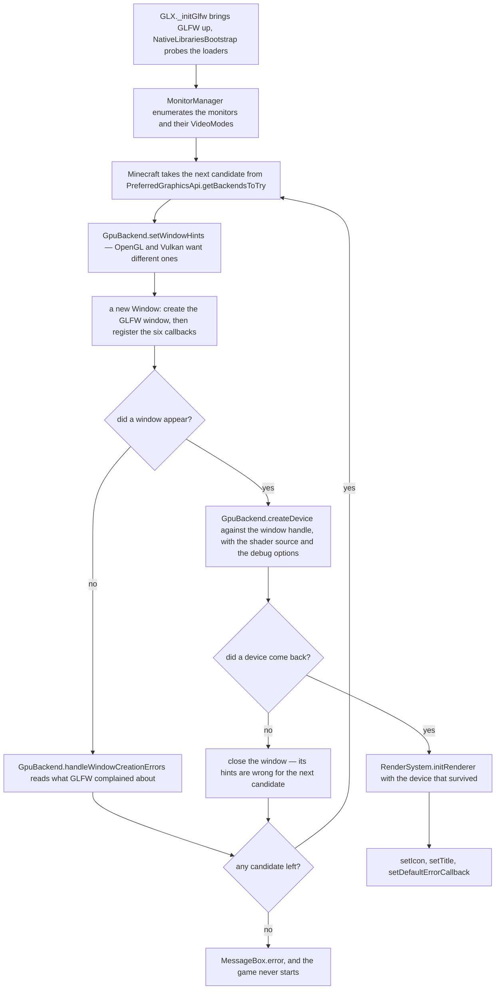
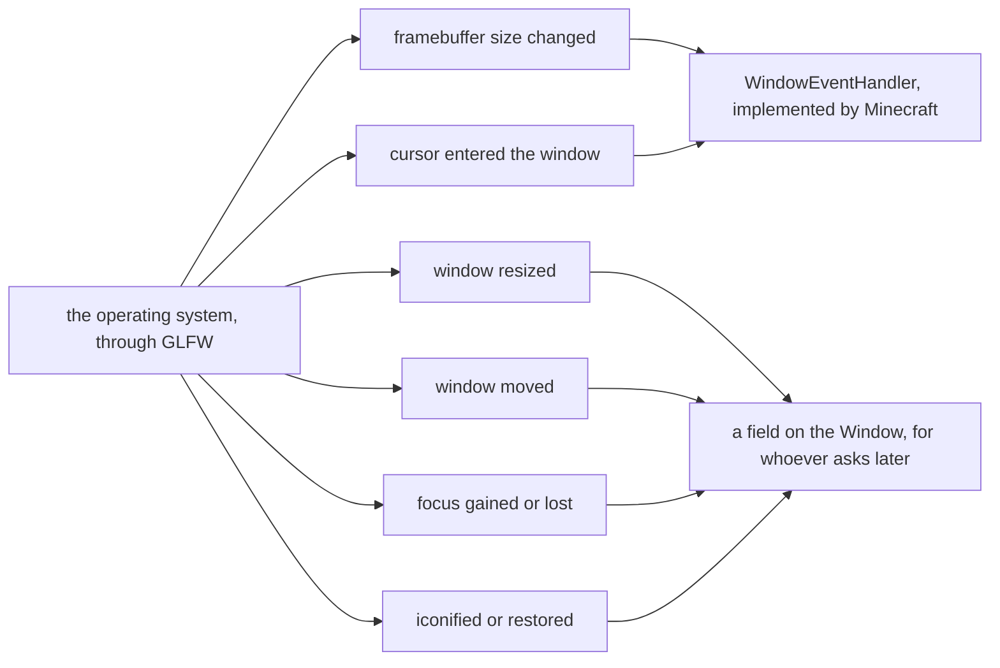

# The window

> Verified against **Minecraft 26.2** · Part XI · before the first frame: the game asks the operating system for a window, and finds out which graphics backend it has by which window survives.

The process is a second old. There is no world, no renderer, no resource
pack and nothing to draw. `GLX._initGlfw` has just brought GLFW up,
`NativeLibrariesBootstrap` has probed for the GL and Vulkan loaders and
`MonitorManager` has enumerated the monitors and the video modes each of them
offers. Now `Minecraft` wants a window — and it cannot ask for one without
already having decided how the pixels will be drawn. **The window and the
graphics backend are created together and neither can go first**: an OpenGL
window and a Vulkan window are made from different GLFW hints, so a Vulkan
attempt that gets a window and then fails at the device does not get to keep
the window. It is thrown away with the attempt, and the next candidate starts
from a fresh one.

[The frame](the-frame.md) is the lecture you watch first, and it opens on a
surface that has already been acquired. This page is what acquired it.
[Input and keybinds](../client/input-and-keybinds.md) opens on a callback that
has already fired, and [blaze3d](blaze3d.md) on a `GpuDevice` that already
exists. All three of them start here.

## The cast

| class | what it decides | thread |
|---|---|---|
| `Minecraft` | which backends to try, in which order, and when to give up | Render thread |
| `Window` | the GLFW handle, the three sizes, and every fullscreen transition | Render thread |
| `GpuBackend` | the window hints, and whether a failed window is the backend's fault | Render thread |
| `MonitorManager` | which monitor the window is considered to be on | Render thread |
| `Monitor` | which `VideoMode` an exclusive fullscreen switch takes | Render thread |
| `WindowEventHandler` | which of the six operating-system callbacks reach the game | Render thread |
| `FramerateLimitTracker` | what an unfocused, idle or iconified window is allowed to cost | Render thread |
| `NativeImage` | the CPU-side pixels between a file and a texture | native memory, closed by its owner |

All of it lives in *com/mojang/blaze3d/platform*, and none of it exists on the
server: `server-classes.txt` has no entry under *com/mojang/blaze3d* at all.

## Trying backends until one of them makes a window

The startup path is a retry loop, and it is drawn as a flowchart rather than a
conversation because the shape *is* the fact: the loop encloses the window and
the device together. A backend that cannot make a window and a backend that
cannot make a device fail identically, and both hand the next candidate a
clean slate.

What the window is asked for is a `DisplayData`: a size, an optional
fullscreen size and a fullscreen flag, with `DisplayData.withSize` and
`DisplayData.withFullscreen` for the transitions that change them later. What
comes back, if anything comes back, is a `Window` holding a `Window.handle`
and a `Window.backend` — and never a `GpuDevice`. The window knows which
backend made it and nothing about what that backend went on to build.

Below GLFW and STB, reached through LWJGL, this package calls nothing else in
the game. Above it, `Minecraft` drives startup and the two per-frame calls
below, `KeyboardHandler` and `MouseHandler` take the input callbacks and the
clipboard, `VideoSettingsScreen` drives the fullscreen and video-mode
controls, and `Screenshot` and `TextureManager` want `NativeImage`. What the
player's saved choices reach is `Options`: the window size and position, the
fullscreen flag and video-mode string, exclusive fullscreen, the GUI scale,
and the graphics-API preference that ordered the loop above.

## Six callbacks are the entire surface, and the game hears two

Once the window exists, the operating system has exactly six things it can
say to it. `WindowEventHandler` — a three-method interface that `Minecraft`
implements — is the whole of what a window is allowed to say back to the
game, and the window only ever reaches for two of those three methods.

`WindowEventHandler.framebufferSizeChanged` and
`WindowEventHandler.cursorEntered` are the two. A window resize, a window
move, a focus change and an iconify all end in a field —
`Window.getX`, `Window.getY`, `Window.isFocused`, `Window.isIconified` and
`Window.isMinimized` are what anyone asks instead, whenever they get round to
it — so three of the six events the operating system reports are things the
game is never *told*, only things it can look up.

The third method on the interface is the odd one.
`WindowEventHandler.resizeGui` is never called by `Window` at all: its callers
are `Minecraft` and `Options`, which is to say the game calling itself when
the GUI scale option changes. And `WindowEventHandler.framebufferSizeChanged` is not only a
callback — `Window.updateFullscreenIfChanged` and
`Window.changeFullscreenVideoMode` both raise it directly, which is how F11
and a video-mode switch reach the renderer by the same route a dragged window
corner does.

Notice what is *not* among the six: keys, characters, mouse buttons, cursor
motion and scrolling. Every input callback is registered somewhere else
entirely, by `KeyboardHandler` and `MouseHandler` — see [input and
keybinds](../client/input-and-keybinds.md).

## Three sizes, and every misplaced GUI element is a confusion between them

| the size | how it is asked for | what it is |
|---|---|---|
| framebuffer | `Window.getWidth`, `Window.getHeight` | the pixels the renderer actually targets |
| screen | `Window.getScreenWidth`, `Window.getScreenHeight` | the window as the operating system reports it, which under DPI scaling is not the framebuffer |
| GUI-scaled | `Window.getGuiScaledWidth`, `Window.getGuiScaledHeight` | the framebuffer divided by an integer scale |

The integer scale is the part with a policy in it. `Window.setGuiScale` takes
what the option asked for and `Window.calculateScale` decides what is
actually possible, measuring the framebuffer against the two constants
`Window.BASE_WIDTH` and `Window.BASE_HEIGHT` and applying a floor when the
font needs unicode. A high-DPI display is what makes the first two rows
diverge, and a GUI element that lands in the wrong place is nearly always
code that read one of the three and meant another.

## What the window does per frame, which is almost nothing

Two calls, both inside `Minecraft.renderFrame`, both in the *update window*
profiler zone: `Window.updateFullscreenIfChanged` at the very top of it, and
the surface reconfigure-and-acquire immediately after. Everything else the
window does is a callback firing.

`Window.updateFullscreenIfChanged` is where F11 lands.
`Window.toggleFullScreen` and `Window.setWindowed` flip the state,
`Window.isFullscreen` reports it, and `Window.changeFullscreenVideoMode` with
`Window.getPreferredFullscreenVideoMode` and
`Window.setPreferredFullscreenVideoMode` negotiate what exclusive fullscreen
turns into. Dragging the window to the other monitor is the same machinery
approached from the other end: `MonitorManager.findBestMonitor` decides which
monitor a window is on *by overlap*, and `Monitor.getPreferredVidMode` picks
the closest available mode to the saved preference. A `Monitor` is a record —
a name, a handle, its list of `VideoMode`s, the current one and its position —
and `Window.getRefreshRate` is the number that comes out of the mode.

The one thing on this page that runs continuously is
`FramerateLimitTracker`, which watches focus and idle time and overrides the
frame limit: ten frames a second for an iconified or long-idle window, thirty
for a short idle, sixty in a menu with no level. [The frame](the-frame.md) is
where that limit gets spent.

## `NativeImage`, the seam between a file and a texture

`NativeImage` is a `NativeImage.Format`, a width, a height and a pointer into
native memory. It is where every image in the game briefly is, and it is not
only textures. `NativeImage.read` is an STB decode from a stream, a byte array
or an NIO buffer — that is the PNG path. `NativeImage.copyFromFont` receives a
rasterised FreeType glyph. An atlas is assembled into one with
`NativeImage.copyRect`, `NativeImage.resizeSubRectTo` and
`NativeImage.fillRect`, and `NativeImage.mappedCopy`,
`NativeImage.getPixel` and `NativeImage.setPixel` are the rest of the
vocabulary. A downloaded skin sits in one while it is being validated, and a
screenshot arrives in one read back off the GPU on its way to
`NativeImage.writeToFile`.

`NativeImage.computeTransparency` is the method that [models and
atlases](models-and-atlases.md) leans on to decide which chunk layer a quad
belongs to — a rendering decision made by looking at the pixels of a file.

Because the memory is native, ownership is explicit: `NativeImage.close`
frees it, and `NativeImage.untrack` exists for the cases where something else
has taken the pointer over.

## Questions players ask

**Why does the game keep drawing while it is minimised?** Because nothing
stops it. `Window.isMinimized` suppresses the surface acquisition and the
frame then runs to completion regardless — see [the frame](the-frame.md). The
work that is actually saved is saved by `FramerateLimitTracker` dropping the
limit to ten, not by the frame being skipped.

**Why does a graphics crash report name the thing the game was doing?**
Because the error callback is swapped three times over the game's life: a
boot-crash handler while starting, `Window.setDefaultErrorCallback` once
running, and a null on close. `Window.setErrorSection` tags whatever GLFW
complains about with what the game was busy with when it complained, so a
driver's error message arrives attached to a phase rather than floating free.

**Why does the mouse cursor stop changing shape sometimes?**
`Window.setAllowCursorChanges` exists because a cursor change part-way
through a drag misbehaves on some platforms, so the game turns them off
rather than risk it. `CursorType.createStandardCursor` takes a fallback for
the shapes a given platform does not provide, which is the other half of the
same problem.

**Why does the game sometimes die a moment after I close it?** Because a
shutdown that hangs is killed from outside. `ClientShutdownWatchdog` starts a
thread that forces the process down if the main thread does not finish
stopping, and it waits a fixed grace period first, so a crash report still has
time to be written.

**What is the rest of the package?** The corners the story above does not pass
through: `ClipboardManager` and `TextInputManager` for copy, paste and IME
text (both reached from `KeyboardHandler`), `CursorType` and `CursorTypes` for
the cursor shapes, `IconSet` for what `Window.setIcon` picks between,
`MacosUtil`, `DebugMemoryUntracker`, the rest of `GLX` (`GLX._getCpuInfo`,
`GLX._getLWJGLVersion`, `GLX.getGlfwPlatform`) — and `InputConstants`, the key
and mouse-button vocabulary that every `KeyMapping` is written in.

> **For a 1.21-era reader.** The headline is that the window no longer
> presents anything: *Window.updateDisplay* and *Window.setVsync* are gone,
> presentation is [blaze3d](blaze3d.md)'s `GpuSurface` protocol and vsync is a
> `GpuSurface.PresentMode`. Also gone: *Window.setupGuiState*, and
> *ScreenManager*, which never existed here — monitor handling has always been
> `MonitorManager`. And the constructor now takes a `GpuBackend`, because the
> window cannot be made without knowing which API is going to draw into it.

## Where to look

`Minecraft`'s constructor for the candidate loop and what happens when it runs
out of candidates. `Window`'s constructor for the order in which a window and
a backend come into being, then `Window.updateFullscreenIfChanged` for the
only thing the window does per frame. `MonitorManager.findBestMonitor` and
`Monitor.getPreferredVidMode` for the fullscreen negotiation. `NativeImage.read`
and `NativeImage.computeTransparency` for the image type the rest of Part XI
is built on.

---

*Rules: names, never code · how the system works, not how the code reads ·
newest version only · every backticked name passes `tools/verify_names.py`.*
