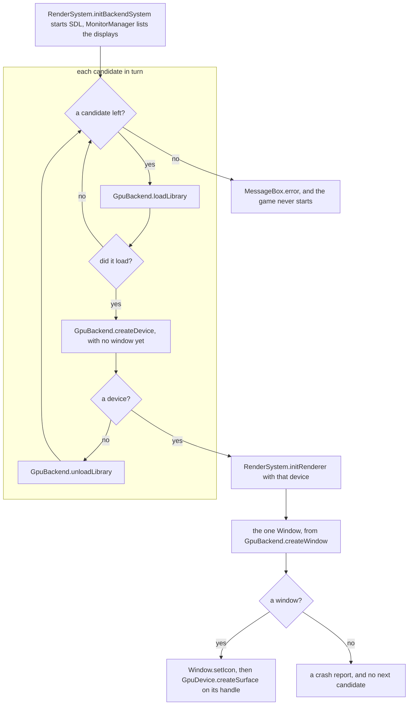
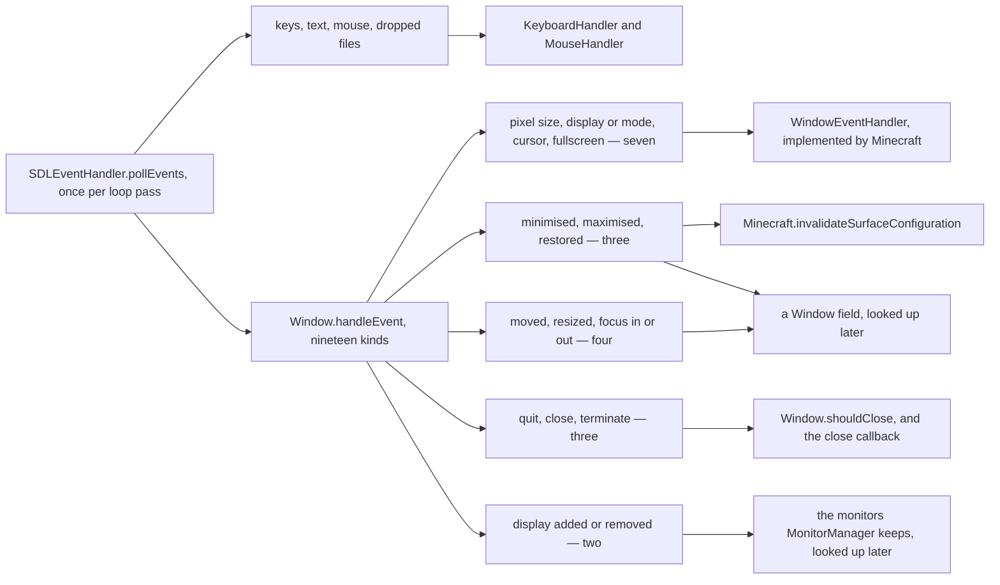

# The window

> Verified against **Minecraft 26.3** · Part XI · before the first frame: the game finds out which graphics backend it has by which device survives, and only then asks the operating system for a window.

The process is a second old. There is no world, no renderer, no resource
pack and nothing to draw. `RenderSystem.initBackendSystem` has just brought
SDL up, `NativeLibrariesBootstrap` has probed for the GL and Vulkan loaders
and `MonitorManager` has enumerated the monitors and the video modes each of
them offers. Now `Minecraft` wants a window — and it cannot ask for one
without already having decided how the pixels will be drawn, because an
OpenGL window and a Vulkan window are asked for with different flags. **So
the device comes first and the window second**: each candidate backend in
turn loads its library and tries to build a whole device before the game has
any window at all — OpenGL's device makes a hidden window of its own to hold
its context — and only the backend that survives is asked for the window,
once. A window that fails at that point is not handed to the next candidate;
it ends the game with a crash report.

That loop is the first half of the page. The second is what the window
turns into once it exists: **this is Part XI's platform layer, not
just its window** — the nineteen kinds of event the window answers, the
three sizes every GUI element is placed against, and `NativeImage`, the CPU
image type every texture, screenshot and skin, and every glyph but the
unihex font's, passes through on its way to or from a file. They share a package and a role rather
than a scenario, and the role is *everything between the game and the
machine it is running on*.

[The frame](the-frame.md) is the lecture you watch first, and it opens on a
surface that has already been acquired. This page is what created it.
[Input and keybinds](../client/input-and-keybinds.md) opens on an event that
has already arrived, and [blaze3d](blaze3d.md) on a `GpuDevice` that already
exists. All three of them start here.

## The cast

| class | what it decides | thread |
|---|---|---|
| `Minecraft` | which backends to try, in which order, and when to give up | Render thread |
| `Window` | the SDL window handle, the three sizes, and every fullscreen transition | Render thread |
| `GpuBackend` | its library, its device, and the flags a window for it is made with | Render thread |
| `MonitorManager` | which monitors the game knows about, kept current by SDL's display events | Render thread |
| `Monitor` | which `VideoMode` an exclusive fullscreen switch asks for | Render thread |
| `WindowEventHandler` | what the window tells the game: size, cursor and fullscreen | Render thread |
| `FramerateLimitTracker` | what an iconified, idle or menu-bound window is allowed to cost | Render thread |
| `NativeImage` | the CPU-side pixels between a file and a texture | native memory, closed by its owner |

Two of those rows live outside *com/mojang/blaze3d/platform* and the other
six in it: `Minecraft` is the game's own, and `GpuBackend` sits in
*renderpearl/api* with
[the façades](blaze3d.md#four-objects-the-game-only-touches-through-a-façade).
None of the package exists on the server — `server-classes.txt` has no entry
under *com/mojang/blaze3d* at all — and most of it runs on the Render thread,
which is [one of the four](../anatomy/anatomy.md#four-threads-worth-memorising):
images are decoded and mipmapped on reload workers (a downloaded skin on the
download pool) and written on the IO pool,
and the shutdown watchdog waits on a thread of its own.

## Trying backends until one of them makes a device

The startup path is a retry loop, and it is drawn as a flowchart rather than a
conversation because the shape *is* the fact: the loop encloses the device
and leaves the window outside it. A backend that cannot load its library
and a backend that cannot make a device land in the same handler, which unloads
the library only in the second case, and both hand the next candidate a clean
slate.

```mermaid
flowchart TD
    START["RenderSystem.initBackendSystem starts SDL, MonitorManager lists the displays"]
    subgraph LOOP["each candidate in turn"]
        NEXT{"a candidate left?"}
        LIB["GpuBackend.loadLibrary"]
        Q1{"did it load?"}
        DEV["GpuBackend.createDevice, with no window yet"]
        Q2{"a device?"}
        UNL["GpuBackend.unloadLibrary"]
    end
    BOX["MessageBox.error, and the game never starts"]
    RS["RenderSystem.initRenderer with that device"]
    WIN["the one Window, from GpuBackend.createWindow"]
    Q3{"a window?"}
    CRASH["a crash report, and no next candidate"]
    DONE["Window.setIcon, then GpuDevice.createSurface on its handle"]
    START --> NEXT
    NEXT -- "yes" --> LIB --> Q1
    Q1 -- "yes" --> DEV --> Q2
    Q1 -- "no" --> NEXT
    Q2 -- "no" --> UNL --> NEXT
    NEXT -- "no" --> BOX
    Q2 -- "yes" --> RS --> WIN --> Q3
    Q3 -- "yes" --> DONE
    Q3 -- "no" --> CRASH
```

*The startup retry loop, the box being the loop: a library or a device that
fails sends the next candidate in, and the loop is left by a device that
survives or by running out of candidates. The window is made once, outside the
loop, and a window that fails is a crash rather than a retry.*

**The list is never one candidate long.** `PreferredGraphicsApi.getBackendsToTry`
returns an ordered *pair*: every setting has the other API behind it as a
fallback, the default is OpenGL-first, and `GlBackend` and `VulkanBackend` are
the two things the loop above is choosing between. A start that ended before it
finished loading, by a crash or otherwise, downgrades the preference one step on the next start — a
Vulkan preference becomes the default, and the default becomes OpenGL — so a
client that keeps crashing on boot comes down to the safest option it has, and
stays there until you set it again. That is why
asking for Vulkan does not always get it.

What the window is asked for is a `DisplayData`: a size, an optional
fullscreen size and a fullscreen flag, with `DisplayData.withSize` and
`DisplayData.withFullscreen` applying the saved size and fullscreen options,
or, after a start that never finished loading, forcing windowed, before the
window is made. What
comes back is a `Window` holding a `Window.handle` — and neither a
`GpuDevice` nor the backend that made it. The window uses the backend once,
to be created, and the device meets the window only afterwards, when
`GpuDevice.createSurface` is handed its handle.

SDL, STB and FreeType, reached through LWJGL, are most of what the package sits on, and it
calls almost nothing else in the game on its way down. The exceptions are
about passing something upward, an event or a failure: `SDLEventHandler`
hands the input up, and a failure goes to `Minecraft`, `CrashReport`, and the
one piece of the dedicated server the client borrows — `ClientShutdownWatchdog`
builds its report with `ServerWatchdog.createWatchdogCrashReport`, which is
the only *net.minecraft.server.dedicated* name anything here touches. Above the
package, `Minecraft` drives startup and the two per-frame calls
below, `KeyboardHandler` and `MouseHandler` take the input events and the
clipboard, `VideoSettingsScreen` drives the fullscreen and video-mode
controls, and `Screenshot` and `TextureManager` want `NativeImage`. What the
player's saved choices reach is `Options`: an override width and height, the
fullscreen flag and video-mode string, exclusive fullscreen, the GUI scale,
and the graphics-API preference that ordered the loop above. The window's
*position* is not among them — it is a field the move event keeps and
nobody saves.

### How the loop knows why a device did not appear

`Minecraft` has to be able to say why every candidate failed, because it may
have to show the player. A failed attempt arrives as a
`BackendCreationException`, carrying a message and a
`BackendCreationException.Reason`, and where the failure is SDL's — a library
that would not load, a context or a window that would not appear — the
backend reads *SDL_GetError* on the spot and writes it into the message. The
loop appends each attempt's name and message to the text `MessageBox.error`
shows if nobody survives, and keeps one exception in
`Minecraft.backendCreationException` for the crash report and the telemetry,
where an OpenGL-missing failure never displaces an earlier one.

Errors are read where they happen: where the game checks an SDL call's result
it mostly reads *SDL_GetError* there and then, or once in the method that made
the call, and what SDL
logs of its own accord goes to the game's log through `SdlDebug`, which
`RenderSystem.initBackendSystem` installs before SDL starts.
`Window.setErrorSection` writes a label for the crash report — *Startup* from the
constructor, then *Pre render*, *Render* and *Post render* on every pass of
the loop — which is why a crash report's *Window* category names the phase
the game was in.

## Nineteen events, and the six the game is never told about

The window registers nothing with the operating system. At the top of every
pass of the client loop, `RenderSystem.pollEvents` runs
`SDLEventHandler.pollEvents`, which drains SDL's queue: the keyboard, mouse
and drop events it deals with itself, and everything else goes to
`Window.handleEvent`, which answers nineteen kinds of event and ignores the
rest. `WindowEventHandler` — a four-method interface that `Minecraft`
implements — is nearly the whole of what a window says back to the game, and
the window only ever reaches for three of those four methods.

```mermaid
flowchart LR
    SEH["SDLEventHandler.pollEvents, once per loop pass"]
    IN["keys, text, mouse, dropped files"]
    KMH["KeyboardHandler and MouseHandler"]
    WHE["Window.handleEvent, nineteen kinds"]
    TOLD["pixel size, display or mode, cursor, fullscreen — seven"]
    WEH["WindowEventHandler, implemented by Minecraft"]
    IC["minimised, maximised, restored — three"]
    MC["Minecraft.invalidateSurfaceConfiguration"]
    QT["quit, close, terminate — three"]
    CB["Window.shouldClose, and the close callback"]
    LOOK["moved, resized, focus in or out — four"]
    W["a Window field, looked up later"]
    DS["display added or removed — two"]
    MM["the monitors MonitorManager keeps, looked up later"]
    SEH --> IN --> KMH
    SEH --> WHE
    WHE --> TOLD --> WEH
    WHE --> IC --> MC
    IC --> W
    WHE --> QT --> CB
    WHE --> LOOK --> W
    WHE --> DS --> MM
```

*The poll's one fork and the window's five groups of event, with how many of
the nineteen kinds each group holds. Input never reaches the window, and the moves,
resizes, focus changes and displays arriving or leaving are the six the game is
never told.*

`WindowEventHandler.framebufferSizeChanged`,
`WindowEventHandler.cursorEntered` and
`WindowEventHandler.fullscreenStateChanged` are the three. A new pixel size, a
move to another display and a change of the display's mode all end in the
first; the cursor crossing the window's edge, in either direction, in the
second; and the operating system taking the window into or out of fullscreen
in the third, which writes the new state back into the fullscreen option. A
move, a resize, focus gained or lost and a display arriving or leaving end in
a field or in `MonitorManager` — `Window.getX`, `Window.getY`,
`Window.getScreenWidth`, `Window.isFocused` and `MonitorManager.getMonitor`
are what anyone asks instead, whenever they get round to it — so six of the
nineteen are things the game is never *told*, only things it can look up.
Minimising reaches the game outside the interface: `Window.isIconified` reads
a field like the others, but `Window` also calls
`Minecraft.invalidateSurfaceConfiguration` itself, on the way down and on the
way back. While the flag is set the frame will not reconfigure its surface,
and the surface was handed the same flag when `GpuDevice.createSurface` made
it, which the OpenGL surface uses to refuse an acquire; otherwise the frame
runs in full, and where the real saving comes from is told in [the
frame](the-frame.md#what-a-minimized-client-actually-stops-doing).

The fourth method on the interface is the odd one.
`WindowEventHandler.resizeGui` is never called by `Window` at all: its callers
are `Minecraft` and `Options`, which is to say the game calling itself — at
startup, after every new framebuffer size, and when the GUI scale or a font
option changes. And `WindowEventHandler.framebufferSizeChanged`
is not only an event's answer — `Window.updateFullscreenIfChanged`,
`Window.changeFullscreenVideoMode` and `Window.setExclusiveFullscreen` all
raise it directly, which is how F11 and a video-mode switch reach the renderer
by the same route a dragged window corner does.

Notice what is *not* among the nineteen: keys, characters, mouse buttons,
cursor motion, scrolling and dropped files. `SDLEventHandler.pollEvents` takes
all of those off the queue before the window sees any and hands them to
`KeyboardHandler` and `MouseHandler` — see [input and
keybinds](../client/input-and-keybinds.md).

### The one callback, which is not the constructor's

The window does hold one callback, and `Minecraft` sets it after the
constructor has run: the window-close callback, the one that runs when you
click the X rather than quitting from the menu — the close request is one of
the nineteen events, and `Window` answers it by setting `Window.shouldClose`
and running the callback. It is registered late because what it does is not
the window's business at all — it is one of the two places
`ClientShutdownWatchdog` is armed, and it is the one live through the teardown that follows a close from the
window, which the other arming, after `Minecraft.exitWorldAndClose` returns, never sees. That is one reason the
game sometimes leaves a crash report behind after you close it. [The two armings
and what each may
do](../client/the-client-loop.md#starting-and-the-three-ways-of-stopping) are
the client loop's.

## Three sizes, and every misplaced GUI element is a confusion between them

| the size | how it is asked for | what it is |
|---|---|---|
| framebuffer | `Window.getWidth`, `Window.getHeight` | the pixels the renderer targets |
| screen | `Window.getScreenWidth`, `Window.getScreenHeight` | the window as the operating system reports it, which under DPI scaling is not the framebuffer |
| GUI-scaled | `Window.getGuiScaledWidth`, `Window.getGuiScaledHeight` | the framebuffer divided by an integer scale |

The integer scale is the part with a policy in it, and **what the option
asks for is a ceiling the game is allowed to miss in both directions**.
`Window.calculateScale` counts upward from one for as long as the framebuffer
divided by the next scale would still be at least `Window.BASE_WIDTH` by
`Window.BASE_HEIGHT` — 320 by 240 — so on a small window it stops below what
you asked for. Then, if the font needs unicode and the answer came out odd,
it adds one, which is the one case where the result comes back *above* the
ceiling. `Window.setGuiScale` takes whatever that was and stores it, deriving
the two scaled sizes by dividing and rounding up. A high-DPI display is what
makes the first two rows diverge, and a GUI element that lands in the wrong
place is nearly always code that read one of the three and meant another.

## What the window does per frame, which is almost nothing

Two calls, both inside `Minecraft.renderFrame`, both in the *update window*
profiler zone: `Window.updateFullscreenIfChanged` at the very top of it, and
immediately after it a reconfigure-and-acquire of the `GpuSurface` — which is
*renderpearl*'s object, not the window's (see
[Blaze3D](blaze3d.md#how-a-frame-reaches-the-screen)), and is the whole of the
window's involvement in getting a picture onto the screen. Everything else
the window does is answering an event.

`Window.updateFullscreenIfChanged` is where F11 lands.
`Window.setFullscreen`, which the fullscreen option calls, sets the request,
`Window.setWindowed` applies one at once, `WindowEventHandler.fullscreenStateChanged`
reports the outcome back to the option, and `Window.changeFullscreenVideoMode`
with `Window.getPreferredFullscreenVideoMode` and
`Window.setPreferredFullscreenVideoMode` negotiate what exclusive fullscreen
turns into. Dragging the window to the other monitor is the same machinery
approached from the other end: `MonitorManager.findBestMonitor` asks SDL
which display the window is on, and `Monitor.getPreferredVideoMode` looks for
the saved preference among the modes this monitor offers, taking the
monitor's current mode when there is no exact match — the monitor never
approximates; SDL does, afterwards, when `Window` asks it for the closest mode
it can set, and an exclusive switch that finds none falls back to borderless.
A `Monitor` is a record — a name, an SDL display id, its list of
`VideoMode`s, the current one and its bounds — and
`Window.getActiveVideoMode`, the mode the window is showing, is where the
debug screen's refresh rate comes from.

The one policy on this page that runs continuously is
`FramerateLimitTracker`, and what it watches is the window's iconification, and
its focus only in exclusive fullscreen, where an unfocused window is throttled
as if it were iconified — anywhere else, losing focus is a
different mechanism with a different effect. Beside the window it watches the
idle time since the last input, when the inactivity option asks it to, and
whether a menu is up with no world. What it does with that, and the
four limits it caps or substitutes, belongs to [the client
loop](../client/the-client-loop.md#the-frame-cap-is-usually-the-option-and-sometimes-is-not);
[the frame](the-frame.md#blit-submit-and-present)
is where the limit gets spent.

## `NativeImage`, the seam between a file and a texture

`NativeImage` is a `NativeImage.Format`, a width, a height and a pointer into
native memory. It is where every image the game reads from or writes to a file briefly is,
the unihex font's glyphs aside, and it is not only textures. `NativeImage.read` is an STB decode from a stream, a byte array
or an NIO buffer — that is the PNG path. `NativeImage.copyFromFont` receives a
rasterised FreeType glyph. `NativeImage.copyRect` and `NativeImage.fillRect`
are how one image is cut out of or patched into another — an `Unstitcher`
source slicing a sheet apart before it is ever stitched, or
`SkinTextureDownloader` folding a legacy 64×32 skin into the modern layout —
while `NativeImage.resizeSubRectTo` has exactly one caller in the game, the
world icon being scaled down. `NativeImage.mappedCopy`, `NativeImage.getPixel`
and `NativeImage.setPixel` are the rest of the vocabulary. A downloaded skin
sits in one while it is being validated, and a screenshot arrives in one read
back off the GPU on its way to `NativeImage.writeToFile`. What it is *not* is
where an atlas is built: an atlas is assembled on the GPU, sprite by sprite,
as [models and
atlases](models-and-atlases.md#the-barrier-and-how-a-sprite-reaches-the-gpu)
explains.

`NativeImage.computeTransparency` is what a stitched sprite's contents are
scanned with, and it is the reason [a quad's chunk layer is read out of its
sprite's
pixels](models-and-atlases.md#a-quads-chunk-layer-is-read-out-of-the-sprites-pixels)
— a rendering decision made by looking at the pixels of a file.

Because the memory is native, ownership is explicit: `NativeImage.close`
frees it, and `NativeImage.untrack` only takes an image out of LWJGL's leak
tracking, for the few special glyphs kept for the life of the process.

## The corners the story does not pass through

Two of them are worth a sentence each because a player meets them. The cursor
stops changing shape when `Window.setAllowCursorChanges` is clear — it is
driven by a player option on the mouse-settings screen and nothing else, and
with it clear every request is answered with the default arrow; the other half
of that problem is the platform's, since `CursorType.createStandardCursor`
takes a fallback for the shapes a given system does not provide. And
`TextureUtil`, the odd one out because nothing about it is a window, is why a
mipmapped texture's edges do not bleed:
before `MipmapGenerator` builds a sprite's mip chain it runs one of two
repairs over it, when the sprite is not an item's and its mipmap strategy
asks for one:
`TextureUtil.solidify` floods the nearest opaque colour outward into every
fully transparent pixel, and `TextureUtil.fillEmptyAreasWithDarkColor` fills
them with a darkened copy of the image's darkest colour instead. The first is
the one that stops the bleed, since a plain average of four texels down a mip
level would otherwise pull in whatever colour the transparent ones held.

The rest of the package is genuinely a list, and the class index is where a
list belongs: clipboard and IME text, the cursor shapes, the window icon set,
the macOS and memory-tracking helpers, `Lighting`'s buffer of diffuse-light
directions, and `InputConstants`, the key and
mouse-button vocabulary every `KeyMapping` is written in. `Transparency`,
which sits here too, is the answer `NativeImage.computeTransparency` gives,
not pipeline state — that belongs to
[Blaze3D](blaze3d.md#a-pipeline-is-a-record-not-a-sequence-of-calls), in
*renderpearl*.

> **For a 1.21-era reader.** GLFW is gone; SDL3 does its work, and *GLX* went
> with it. The window no longer presents anything: *Window.updateDisplay* and
> *Window.updateVsync* are gone, presentation is the `GpuSurface` protocol ([blaze3d](blaze3d.md)) and
> vsync is a `GpuSurface.PresentMode`. *ScreenManager* is now `MonitorManager`,
> in the same package ([naming
> drift](../../reference/naming-drift.md#part-xi--rendering)). The constructor
> now takes the `GpuBackend` that makes the window.

## Where to look

`Minecraft`'s constructor for the candidate loop, what happens when it runs
out of candidates, and the one window made after it.
`SDLEventHandler.pollEvents` and `Window.handleEvent` for where each event
goes, then `Window.updateFullscreenIfChanged` for the one call the window
gets on every frame. `MonitorManager.findBestMonitor` and
`Monitor.getPreferredVideoMode` for the fullscreen negotiation.
`NativeImage.read` and `NativeImage.computeTransparency` for the image type
the rest of Part XI is built on.

---

*Rules: names, never code · how the system works, not how the code reads ·
newest version only · every backticked name passes `tools/verify_names.py`.*
