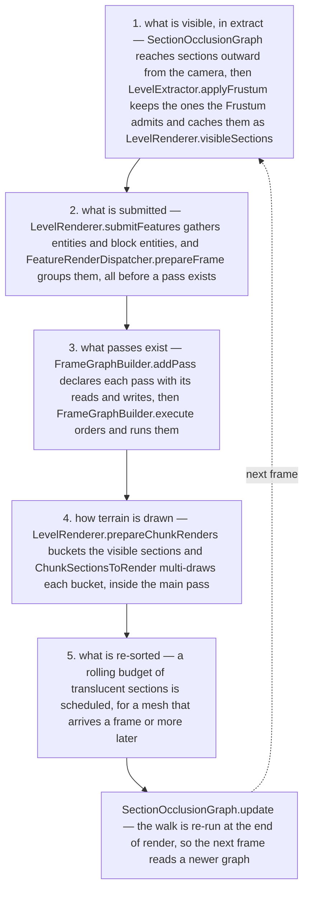
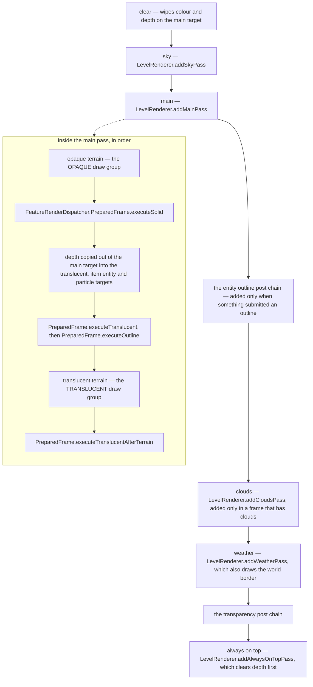

# Visibility and the frame graph

> Verified against **Minecraft 26.2** · Part XI · you fly forward in creative and the world opens out in front of you, one section at a time.

You fly forward in creative and the world arrives. It does not resolve as a
wall of fog lifting all at once — it grows *outward* from where you already
are, section by section, at exactly the rate the mesher can keep up with. That
order is not the download order and it is not the mesher's queue order. It
falls out of an asymmetry inside the walk that decides what is visible at all:
a section that has not been meshed yet is **opaque** to the walk and stops it
dead, a section known to be empty is **transparent** and lets it straight
through, and a section that meshed to *nothing* is neither — it keeps a real
compiled mesh that happens to have no draws in it. Terrain reveals itself
outward because the walk can only reach as far as the meshes that already
exist.

[The frame](the-frame.md) ends where this page begins — but not quite at one
method. The first stage runs on the *extract* side of the wall:
`LevelExtractor.applyFrustum` trims the reached sections to the visible list
before `GameRenderer.render` is called at all. The other four are
`LevelRenderer.render`, which gathers what was submitted, declares the passes
of a frame, draws the terrain, schedules translucency work for a later frame
and re-runs the walk on its way out — in that order, and the order is the
page.

## The cast

| class | what it decides | thread |
|---|---|---|
| `LevelRenderer` | which sections are visible, which passes the frame declares, and how terrain is finally drawn | Render thread |
| `SectionOcclusionGraph` | which sections the walk can reach from the camera at all | full walk on `Util.backgroundExecutor`, partial walk here |
| `SectionOcclusionGraph.GraphState` | the published result of a walk — swapped whole on a rebuild, extended in place by a partial walk | rebuilt by a worker, extended and read here |
| `LevelExtractor` | whether the frustum is re-applied this frame, and so whether the visible list is rebuilt or reused | Render thread |
| `Frustum` | which of the reached sections survive into `LevelRenderer.visibleSections` | Render thread |
| `FrameGraphBuilder` | which passes exist, what each reads and writes, and what order they execute in | Render thread |
| `LevelTargetBundle` | the named render targets the passes hand between them | Render thread |
| `ChunkSectionsToRender` | one bucket per buffer set, so sections that share buffers share a binding | Render thread |

Only one of those reads the world, and it is the one on the extract side:
`LevelExtractor` holds the `ClientLevel` and is the class that carries it
across the wall. `LevelRenderer` does not — its single `ClientLevel`
reference is a *parameter*, to `LevelRenderer.invalidateCompiledGeometry`,
which is the reload path and not the frame path. Everything the drawing half
knows about the world came across in the snapshot; what the renderer still
owns is geometry, targets and order.

## Five stages, and the first one decides the other four

Read it as **reach, gather, declare, draw, defer**, and note that stage one
has already happened when `LevelRenderer.render` is entered — it is the last
thing *extract* does. Stages one and five are bookkeeping that decides what
the drawing stages will have to do, and both are budgeted rather than
complete.

## The walk that decides what exists, and the frustum that only trims it

Visibility here is *reachability*, not a frustum test. `SectionOcclusionGraph`
starts at the camera's own section and walks outward one neighbour at a time,
and — with smart cull on, which is the default — it may step from a section
into a neighbour only if the two faces involved can see each other through
that section's geometry. That per-section answer is
a `VisibilitySet`, computed by `VisGraph` when the section was meshed — so the
question *can you see through this section* is decided once at compile time
and then read for free thousands of times a frame. A wall of stone does not
hide the world behind it because a frustum test rejected it. It hides it
because the walk cannot get past.

The reached sections live in an `Octree` inside
`SectionOcclusionGraph.GraphState`, alongside the queue of sections whose
neighbours still need visiting. A *rebuilt* state is never edited into the
old one: the whole of it is published through an `AtomicReference`, because
`SectionOcclusionGraph.scheduleFullUpdate` runs the complete rebuild on
`Util.backgroundExecutor` and the client thread has to keep reading the old
graph until the new one is ready. Everything else happens on the client
thread, including `SectionOcclusionGraph.runPartialUpdate`, which does edit
the published state in place — it walks outward again from the sections that
`SectionOcclusionGraph.schedulePropagationFrom` flagged, typically because a
new mesh landed for them and their neighbours are worth trying again — which
is a real walk, not a drain, and it is where the outward reveal actually
advances.
`SectionOcclusionGraph.update`, at the very end of `LevelRenderer.render`, is
what runs both.

The frustum arrives after all of this, and only trims.
`SectionOcclusionGraph.addSectionsInFrustum` visits the octree, keeps what a
`Frustum` admits, and fills `LevelRenderer.visibleSections` plus the small
short-radius subset `LevelRenderer.nearbyVisibleSections`. Looking a section
up by position goes through `LevelRenderer.viewArea`.

**Beyond sixty blocks the walk gets harder** — and *sixty blocks* and *three
sections* are one number written twice.
`SectionOcclusionGraph.MINIMUM_ADVANCED_CULLING_DISTANCE` is sixty, and
`SectionOcclusionGraph.MINIMUM_ADVANCED_CULLING_SECTION_DISTANCE` is that
same distance converted to section coordinates, which comes out at three; the
test that uses it compares section coordinates on each axis separately. Out
past it, smart cull adds a ray march *back toward the camera* from the
neighbour being considered, and rejects that neighbour if any section along
the line has not itself been reached by this walk. Inside it, nothing marches
— nearby geometry is cheap enough not to argue about.

### Which is why the reveal is outward

The three states a section can be in are the whole trick. An **uncompiled**
section is opaque: the walk stops there and everything behind it stays
unreached. An **empty** section is transparent: the walk passes through
without needing a mesh at all. A section that **compiled to nothing** is
neither — it holds a real compiled mesh with no draws in it and answers from
its own `VisibilitySet` like any other section. So as meshes land, the
frontier of the walk moves outward one shell at a time, and each newly meshed
section re-arms its neighbours through
`SectionOcclusionGraph.schedulePropagationFrom`.

Streaming is a separate handshake laid over the same walk. A section whose
chunk has not arrived yet is treated as neither opaque nor transparent — it is
*parked*, filed against the chunk it is waiting for, and resumed when
`ClientChunkCache` reports that chunk loaded. The walk then continues from
where it stopped rather than starting over.

The gate this stage controls is not only what gets drawn. **Only visible
sections are re-meshed**, so a block you place behind you costs nothing until
the walk reaches that section again; how a section becomes triangles once it
has been chosen — the dirty flags, the snapshot a worker reads, the compiler,
the three chunk layers and the buffer arenas they upload into — is [section
meshing](section-meshing.md).

### The visible list is a cache, not a per-frame computation

`LevelExtractor.applyFrustum` does not run every frame, and **two different
clocks** decide when it does. They are easy to run together and they are not
the same thing.

The **walk** is thrown away and redone when the camera crosses an eight-block
cell on any axis, when the field of view changes, or when the smart-cull
toggle changes. That is `SectionOcclusionGraph.invalidateIfNeeded`, and what
it schedules is the full off-thread rebuild.

The **frustum step** asks a different question — the walk's result may still
be good while the set of it you can see is not — and it re-runs when either
of two things happens: the graph raises its own frustum-update flag, which a
completed full walk always does and a partial walk does whenever it added a
section inside the offset frustum; or the camera's pitch or yaw crosses a
two-degree step. Turning your head therefore re-applies the frustum without
disturbing the walk at all, and between these events
`LevelRenderer.visibleSections` is simply the list from last time. Stand
still and stare, and the frame's terrain cost does not move.

## Everything is submitted before there is anywhere to put it

Entities and block entities do not draw themselves inside a pass. They are
gathered *first*, before a single pass has been declared.
`LevelRenderer.submitFeatures` runs `LevelRenderer.submitEntities` and
`LevelRenderer.submitBlockEntities` into `LevelRenderer.submitNodeStorage`,
and `FeatureRenderDispatcher.prepareFrame` groups everything submitted into a
`FeatureRenderDispatcher.PreparedFrame`. The passes declared in the next stage
capture that prepared frame and call into it; they never walk an entity list
themselves. What a submission contains, and how an entity produces one, is
[entity rendering](entity-rendering.md).

The ordering matters for a reason that only shows up in the next stage: the
frame graph needs to know, *while it is being declared*, whether anything in
this frame wants an outline. It can know that because the submission has
already happened.

## Declaring the passes, and why none of them is ever culled

`LevelRenderer.render` builds a graph and then executes it. Building it means
declaring resources and passes. `FrameGraphBuilder.importExternal` brings in
the targets that already exist outside the frame — the main render target and
the entity-outline target — and `FrameGraphBuilder.createInternal` declares
five that exist only for the duration of this frame. Each pass comes from
`FrameGraphBuilder.addPass`, states its dependencies with `FramePass.reads`
and `FramePass.readsAndWrites`, and states its body with `FramePass.executes`.
`LevelTargetBundle` is where the handles live under names —
`LevelTargetBundle.main`, `.translucent`, `.itemEntity`, `.particles`,
`.weather`, `.clouds`, `.entityOutline` — and `LevelRenderer.targets` is the
bundle the frame threads through every declaration.

The two post chains in that figure are declared here and explained in
[post-processing](post-processing.md). The outline chain is why the
entity-outline target is imported at all, and the transparency chain is the
only reason the five internal targets are ever created.

**The graph culls passes, and culls none of these.**
`FrameGraphBuilder.execute` keeps only the passes that transitively feed an
imported external resource and drops the rest before it orders anything. Note
the plural: it seeds from *every* imported resource, not from the main target
alone, which is what saves the entity-outline chain — none of its four passes
ever writes to main, and all four survive because the glow target is imported
too. With that seeding, no pass `LevelRenderer` declares is ever dropped in a
stock game. The clouds pass is absent from a clouds-off frame for a
different and much cheaper reason: `LevelRenderer.render` never *adds* it. The
declaration is the branch; the culling machinery is insurance against a
declaration that has become pointless, not the mechanism the game uses to turn
features off.

## One bucket per buffer set, and what bucketing actually buys

`LevelRenderer.prepareChunkRenders` runs before the main pass is declared, and
its output is what that pass will execute. It walks
`LevelRenderer.visibleSections` and, for each layer a section has geometry in,
computes a hash of the buffers that geometry lives in and files the draw under
that hash. Sections sharing buffers land in the same bucket, and
`ChunkSectionsToRender` then issues one `RenderPass.drawMultipleIndexed` per
bucket, with each section's transform arriving as a slice of a uniform buffer
rather than as a per-draw state change. **The saving is not the draw calls.**
Both backends still loop and issue one GPU draw per section — what the bucket
removes is the buffer rebinding and the per-draw state change between them,
which is the expensive part on this side of the driver. The two groups the
main pass renders are
`ChunkSectionLayerGroup.OPAQUE` and `ChunkSectionLayerGroup.TRANSLUCENT`; the
layers underneath them belong to [section meshing](section-meshing.md).

The translucent layer inverts the rule, and it inverts it in the direction
nobody guesses. Its grouping hash omits the buffer contribution entirely, so
the hash never changes — **every** translucent section files into one bucket
instead of being spread across several. That is exactly what preserves the
visit order inside it, and the visit order is what the draw list is then
reversed against, so the far sections blend before the near ones. Correct
blending is bought here by refusing to *distinguish* the buffers, not by
refusing to share them.

**Directional shading is per dimension, and it is not data.** How bright a
face is by direction comes from a `CardinalLighting` record, and there are
exactly two of them: `CardinalLighting.DEFAULT` and `CardinalLighting.NETHER`,
both hard-coded. `DimensionType` carries the choice between them and nothing
else — a datapack picks, it does not supply numbers.

One ordering here catches everyone out. **Terrain is drawn before the sections
queued this frame are compiled**: `LevelRenderer.compileSections` runs *after*
`FrameGraphBuilder.execute`, so even the option that forces a synchronous
rebuild only guarantees the mesh exists by the end of frame *N* — it appears
in frame *N+1*. Again, [section meshing](section-meshing.md).

## Translucency, re-sorted on a budget it never finishes

Translucent quads inside a section have to be sorted back to front from where
you are standing, and where you are standing changes constantly. Re-sorting
every visible section every frame is not affordable, so the client re-sorts a
slice of them each frame and lets the rest be slightly stale.

Two groups are considered. Everything in
`LevelRenderer.nearbyVisibleSections` — the short-radius set the frustum step
filled alongside the main list — and then a round-robin slice of
`LevelRenderer.visibleSections`, an eighth of it or fifteen sections,
whichever is larger, walked from
`LevelRenderer.translucencyResortIterationIndex` so that successive frames
continue where the last one stopped.

Being considered is not being re-sorted. A section is scheduled if its
`TranslucencyPointOfView` actually changed, **or** if the camera's block
position moved since `LevelRenderer.lastTranslucentSortBlockPos` and the
section is either axis-aligned from the camera or one of the nearby ones. It
is then skipped anyway if a re-sort is already scheduled for it, or if it has
no translucent geometry at all. So standing still costs nothing, walking costs
a bounded amount, and a fast enough sideways move can leave a distant pane of
glass sorted for a viewpoint you have already left.

> **For a 1.21-era reader.** *LevelRenderer.renderLevel* does not exist — the
> method is `LevelRenderer.render`, and it is handed render state rather than
> a level. *LevelRenderer.renderChunkLayer* is gone, because a layer is no
> longer drawn by a method looping over chunks: it is a bucketed multi-draw
> built by `LevelRenderer.prepareChunkRenders` and issued by
> `ChunkSectionsToRender`. *LevelRenderer.setupRender* is gone too, its work
> split between `SectionOcclusionGraph` and `LevelExtractor.applyFrustum`. And
> every dirty method that used to hang off `LevelRenderer` moved to
> `LevelExtractor`, the world-facing half of the old class. Four names survive
> unchanged and mean what they always did: `ViewArea`, `VisGraph`, `Octree`
> and `Frustum`.

## Where to look

`LevelRenderer.render` — the stages of this page are that one method, top to
bottom. `SectionOcclusionGraph.update` for the walk, and
`SectionOcclusionGraph.runPartialUpdate` for the only part of it on the client
thread. `LevelExtractor.applyFrustum` for why the visible list is usually a
cache. `FrameGraphBuilder.execute` for how declared passes are ordered and
which are dropped. `LevelRenderer.prepareChunkRenders` and
`ChunkSectionsToRender` for how terrain finally reaches the GPU, with
[blaze3d](blaze3d.md) underneath it. The models and the atlas the terrain is
textured from are [models and atlases](models-and-atlases.md); the block
changes that make sections dirty arrive as the packets in [what the client is
told](../networking/what-the-client-is-told.md) and become dirty sections in
[the client level](../client/the-client-level.md).

---

*Rules: names, never code · how the system works, not how the code reads ·
newest version only · every backticked name passes `tools/verify_names.py`.*
