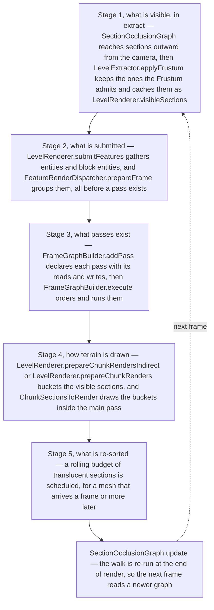
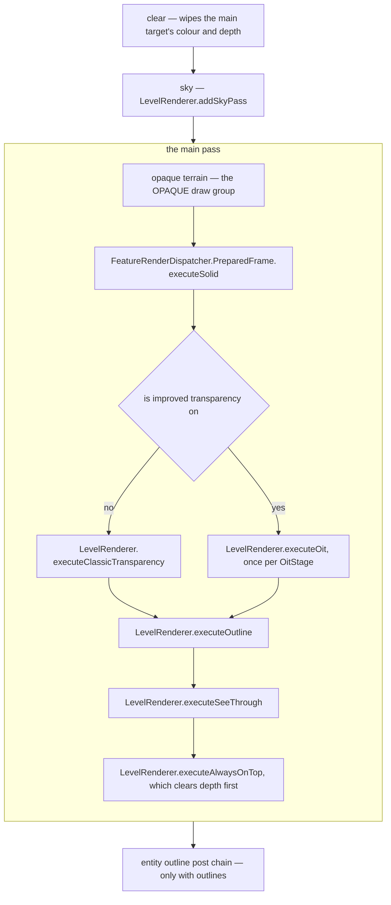

# Visibility and the frame graph

> Verified against **Minecraft 26.3** · Part XI · you fly forward in creative and the world opens out in front of you, one section at a time.

You fly forward in creative and the world arrives. It does not resolve as a
wall of fog lifting all at once — it grows *outward* from where you already
are, section by section, at exactly the rate the mesher can keep up with. That
order is not the download order and it is not the mesher's queue order. It
falls out of an asymmetry inside the walk that decides what is visible at all:
a section that has not been meshed yet is **opaque** to the walk and stops it
dead, a section known to be empty is **transparent** and lets it straight
through, and a section that meshed to *nothing* is transparent too unless it
holds a block entity, which keeps it a real compiled mesh that happens to have
no draws in it. Terrain reveals itself
outward because the walk can only reach as far as the meshes that already
exist.

[The frame](the-frame.md#the-wall-and-the-one-level-at-which-it-is-real) ends
where this page begins, and the page runs in the order the sections below do.
The first stage is the odd one, because it is on the far side of the wall:
`LevelExtractor.applyFrustum` runs near the *top* of extract, so everything
else the extractor does that frame — entities, block entities, dirty sections
alike — is already reading the list of visible sections this stage decided.
Everything after it is `LevelRenderer.render`, which gathers what was
submitted, declares the passes of a frame, draws the terrain and schedules
translucency work for a later frame — then re-runs the walk on its way out,
for the frame after this one.

## The cast

| class | what it decides | thread |
|---|---|---|
| `LevelRenderer` | which sections are visible, which passes the frame declares, and how terrain is finally drawn | Render thread |
| `SectionOcclusionGraph` | which sections the walk can reach from the camera at all | full walk on `Util.backgroundExecutor`, partial walk here |
| `SectionOcclusionGraph.GraphState` | the published result of a walk — swapped whole on a rebuild, extended in place by a partial walk | rebuilt by a worker, extended and read here |
| `LevelExtractor` | whether the frustum is re-applied this frame, and so whether the visible list is rebuilt or reused | Render thread |
| `Frustum` | which of the reached sections survive into `LevelRenderer.visibleSections` | Render thread |
| `FrameGraphBuilder` | which passes exist, what each reads and writes, and what order they execute in | Render thread |
| `LevelTargetBundle` | the named render targets the passes hand between them | Render thread |
| `ChunkSectionsToRender` | one bucket per buffer set, so sections that share buffers share a binding | Render thread |

Only one of those reads the world, and it is the one on the extract side:
`LevelExtractor` holds the `ClientLevel` and is the class that carries it
across [the wall](the-frame.md#the-wall-and-the-one-level-at-which-it-is-real).
What the renderer still owns, on this side of it, is geometry, targets and
order.

## The order a frame does this in, and why the figure loops

```mermaid
flowchart TD
    S1["Stage 1, what is visible, in extract — SectionOcclusionGraph reaches sections outward from the camera, then LevelExtractor.applyFrustum keeps the ones the Frustum admits and caches them as LevelRenderer.visibleSections"]
    S2["Stage 2, what is submitted — LevelRenderer.submitFeatures gathers entities and block entities, and FeatureRenderDispatcher.prepareFrame groups them, all before a pass exists"]
    S3["Stage 3, what passes exist — FrameGraphBuilder.addPass declares each pass with its reads and writes, then FrameGraphBuilder.execute orders and runs them"]
    S4["Stage 4, how terrain is drawn — LevelRenderer.prepareChunkRendersIndirect or LevelRenderer.prepareChunkRenders buckets the visible sections, and ChunkSectionsToRender draws the buckets inside the main pass"]
    S5["Stage 5, what is re-sorted — a rolling budget of translucent sections is scheduled, for a mesh that arrives a frame or more later"]
    S6["SectionOcclusionGraph.update — the walk is re-run at the end of render, so the next frame reads a newer graph"]
    S1 --> S2 --> S3 --> S4 --> S5 --> S6
    S6 -. "next frame" .-> S1
```

Stage one has already happened when `LevelRenderer.render` is entered, and
the last box is that same walk being re-run for the frame after this one,
which is why the figure loops rather than ending. The two bookkeeping stages
are the first and the fifth, and they are incomplete in two different ways:
the first is a **cache**, thrown away and rebuilt only when something
invalidates it, and the fifth is a **budget**, doing a fixed slice of the work
each frame and leaving the rest stale. Both are why a frame's terrain cost
does not track what is on the screen.

## The walk that decides what exists, and the frustum that only trims it

Visibility here is *reachability*, not a frustum test. `SectionOcclusionGraph`
starts at the camera's own section and walks outward one neighbour at a time,
and — with smart cull on, which is the default — it may step from a section
into a neighbour only if the two faces involved can see each other through
that section's geometry. That per-section answer is
a `VisibilitySet`, computed by `VisGraph` when the section was meshed — so the
question *can you see through this section* is decided once at compile time
and then read for free thousands of times a frame. A wall of stone does not
hide the world behind it because a frustum test rejected it. It hides it
because the walk cannot get past.

The reached sections live in an `Octree` inside
`SectionOcclusionGraph.GraphState`, alongside the queue of sections whose
neighbours still need visiting. A *rebuilt* state is never edited into the
old one: the whole of it is published through an `AtomicReference`, because
`SectionOcclusionGraph.scheduleFullUpdate` runs the complete rebuild on
`Util.backgroundExecutor` and the Render thread has to keep reading the old
graph until the new one is ready. Everything else happens on the client
thread, including `SectionOcclusionGraph.runPartialUpdate`, which does edit
the published state in place — it walks outward again from the sections that
`SectionOcclusionGraph.schedulePropagationFrom` flagged, typically because a
new mesh landed for them and their neighbours are worth trying again — which
is a real walk, not a drain, and it is where the outward reveal actually
advances.
`SectionOcclusionGraph.update`, at the very end of `LevelRenderer.render`, is
what runs both.

The frustum arrives after all of this, and only trims.
`SectionOcclusionGraph.addSectionsInFrustum` visits the octree, keeps what a
`Frustum` admits, and fills `LevelRenderer.visibleSections` plus the small
short-radius subset `LevelRenderer.nearbyVisibleSections`. Looking a section
up by position goes through `LevelRenderer.viewArea`.

**Beyond sixty blocks the walk gets harder** — and *sixty blocks* and *three
sections* are one number written twice.
`SectionOcclusionGraph.MINIMUM_ADVANCED_CULLING_DISTANCE` is sixty, and
`SectionOcclusionGraph.MINIMUM_ADVANCED_CULLING_SECTION_DISTANCE` is that
same distance converted to section coordinates, which comes out at three; the
test that uses it compares section coordinates on each axis separately. Out
past it, smart cull adds a ray march *back toward the camera* from the
neighbour being considered, and rejects that neighbour if any section along
the line has not itself been reached by this walk. Inside it, nothing marches
— nearby geometry is cheap enough not to argue about.

### Which is why the reveal is outward

The three states a section can be in are the whole trick. An **uncompiled**
section is opaque: the walk stops there and everything behind it stays
unreached. An **empty** section is transparent: the walk passes through
without needing a mesh at all. A section that **compiled to nothing** is
transparent too, unless it holds a block entity: then it keeps a real compiled
mesh with no draws in it and answers from its own `VisibilitySet` like any
other section. So as meshes land, the
frontier of the walk moves outward one shell at a time, and each newly meshed
section re-arms its neighbours through
`SectionOcclusionGraph.schedulePropagationFrom`.

Streaming is a separate handshake laid over the same walk. A section whose
chunk has not arrived yet is treated as neither opaque nor transparent — it is
*parked*, filed against the chunk it is waiting for, and resumed when
`ClientChunkCache` reports that chunk loaded. The walk then continues from
where it stopped rather than starting over.

The gate this stage controls is not only what gets drawn. **Only visible
sections are re-meshed**, so a block you place behind you costs nothing until
the walk reaches that section again; how a section becomes triangles once it
has been chosen — the dirty flags, the snapshot a worker reads, the compiler,
the three chunk layers and the buffer arenas they upload into — is [section
meshing](section-meshing.md).

### The visible list is a cache, not a per-frame computation

`LevelExtractor.applyFrustum` does not run every frame, and **two different
clocks** decide when it does. They are easy to run together and they are not
the same thing.

The **walk** is thrown away and redone when the camera crosses an eight-block
cell on any axis, when the field of view changes, or when the smart-cull
toggle changes. That is `SectionOcclusionGraph.invalidateIfNeeded`, and what
it schedules is the full off-thread rebuild.

The **frustum step** asks a different question — the walk's result may still
be good while the set of it you can see is not — and it re-runs when either
of two things happens: the graph raises its own frustum-update flag, which a
completed full walk always does and a partial walk does whenever it added a
section inside the offset frustum; or the camera's pitch or yaw crosses a
two-degree step. Turning your head therefore re-applies the frustum without
disturbing the walk at all, and between these events
`LevelRenderer.visibleSections` is simply the list from last time. Stand
still and stare, and the frame's terrain cost does not move.

## Everything is submitted before there is anywhere to put it

Entities and block entities do not draw themselves inside a pass. They are
gathered *first*, before a single pass has been declared.
`LevelRenderer.submitFeatures` runs `LevelRenderer.submitEntities` and
`LevelRenderer.submitBlockEntities` into `LevelRenderer.submitNodeStorage`,
and `FeatureRenderDispatcher.prepareFrame` groups everything submitted into a
`FeatureRenderDispatcher.PreparedFrame`. The passes declared in the next stage
capture that prepared frame and call into it; they never walk an entity list
themselves. What a submission contains, and how an entity produces one, is
[entity rendering](entity-rendering.md).

The ordering matters for a reason that only shows up in the next stage: the
frame graph needs to know, *while it is being declared*, whether anything in
this frame wants an outline. It can know that because the submission has
already happened.

## Declaring the passes, and why none of them is ever culled

`LevelRenderer.render` builds a graph and then executes it. Building it means
declaring resources and passes. `FrameGraphBuilder.importExternal` brings in
the targets that already exist outside the frame — the main render target and
the entity-outline target — and `FrameGraphBuilder.createInternal` declares up
to eight that exist only for the duration of this frame: seven for improved
transparency, when that option is on, and one depth target when an
always-on-top gizmo is drawn while a post effect runs. *For the duration of this
frame* is not the same as *allocated this frame*: every internal target in
the part comes out of one `CrossFrameResourcePool`, which keeps a released
target for three frames in case something asks again for that size and
format, so a target that is conceptually thrown away at the end of a frame is
usually the same GPU memory next frame. Each pass comes from
`FrameGraphBuilder.addPass`, states its dependencies with `FramePass.reads`
and `FramePass.readsAndWrites`, and states its body with `FramePass.executes`.
`LevelTargetBundle` is where the handles live under names —
`LevelTargetBundle.main`, `LevelTargetBundle.entityOutline`,
`LevelTargetBundle.alwaysOnTopDepth`, and the improved-transparency targets
from `LevelTargetBundle.depthBounds` to
`LevelTargetBundle.oitTerrainWithWaterPatchDepth` — and `LevelRenderer.targets`
is the bundle the frame threads through every declaration.

```mermaid
flowchart TD
    CLEAR["clear — wipes the main target's colour and depth"]
    SKY["sky — LevelRenderer.addSkyPass"]
    subgraph MAIN ["the main pass"]
        direction TB
        T1["opaque terrain — the OPAQUE draw group"]
        T2["FeatureRenderDispatcher.PreparedFrame.<br/>executeSolid"]
        D{"is improved transparency on"}
        T3["LevelRenderer.<br/>executeClassicTransparency"]
        T4["LevelRenderer.executeOit, once per OitStage"]
        T5["LevelRenderer.executeOutline"]
        T6["LevelRenderer.executeSeeThrough"]
        T7["LevelRenderer.executeAlwaysOnTop, which clears depth first"]
        T1 --> T2 --> D
        D -->|"no"| T3
        D -->|"yes"| T4
        T3 --> T5
        T4 --> T5
        T5 --> T6 --> T7
    end
    OUT["entity outline post chain — only with outlines"]
    CLEAR --> SKY
    SKY --> MAIN
    MAIN --> OUT
```

*The passes `LevelRenderer.render` declares, with the one `LevelRenderer.addMainPass` declares opened up; look for the one decision inside it, which picks how everything translucent is drawn.*

The post chain in that figure is declared here and explained in
[post-processing](post-processing.md), and it is why the entity-outline target
is imported at all. Everything else after the sky draws inside the main pass,
which opens render passes of its own as it goes. With improved transparency off, which is
the default, `LevelRenderer.executeClassicTransparency` draws translucent
features, translucent terrain, the features that follow terrain, then clouds,
weather and the world border, all into the render pass the opaque terrain went
into. With it on, `LevelRenderer.executeOit` draws the same things once per
`OitStage` through the seven targets declared for it and composites the result
onto the main target, which is the only reason those seven are ever created.
`LevelRenderer.executeOutline`, `LevelRenderer.executeSeeThrough` and
`LevelRenderer.executeAlwaysOnTop` follow, each only in a frame with something
of its kind.

`FrameGraphBuilder.execute` is also where the profiler learns about any of
this: the level's graph is executed with an inspector that pushes a zone per
pass, named after the pass, which is why the F3 pie chart can tell you the
sky cost you something. A graph executed without one — and [there is another
kind](post-processing.md#two-doors-into-the-gpu-and-one-of-them-is-deprecated)
— reports nothing.

**The graph culls passes, and culls none of these.**
`FrameGraphBuilder.execute` keeps only the passes that transitively feed an
imported external resource and drops the rest before it orders anything. Note
the plural: it seeds from *every* imported resource, not from the main target
alone, which is what saves the entity-outline chain — none of its four passes
ever writes to main, and all four survive because the glow target is imported
too. With that seeding, no pass `LevelRenderer` declares is ever dropped in a
stock game. The outline chain is absent from a frame with no outline in it for
a different and much cheaper reason: `LevelRenderer.render` never *adds* it. The
declaration is the branch; the culling machinery is insurance against a
declaration that has become pointless, not the mechanism the game uses to turn
features off.

## One bucket per buffer set, and what bucketing actually buys

`LevelRenderer.prepareChunkRendersIndirect` runs before the main pass is
declared, and its output is what that pass will execute — or
`LevelRenderer.prepareChunkRenders` does, on a device that cannot multi-draw
indirect or with `Minecraft.multiDrawIndirect` switched off. Either walks
`LevelRenderer.visibleSections` and, for each layer a section has geometry in,
computes a hash of the buffers that geometry lives in and files the draw under
that hash. Sections sharing buffers land in the same bucket. The indirect path
writes every bucket's draws into a buffer of commands the GPU reads, and each
section's origin into per-instance vertex data, and
`ChunkSectionsToRender.DrawIndirect` then issues one
`RenderPass.drawIndexedIndirect` per bucket, split only where a bucket holds
more draws than the device takes in one call. **There the saving is the draw
calls.** The fallback's `ChunkSectionsToRender.DrawSeparate` issues one
`RenderPass.drawMultipleIndexed` per layer instead, over the draws in bucket
order, with each section's origin arriving as a slice of a uniform buffer. That
still loops and issues one GPU draw per section, and what the bucket order
saves there is rebinding: the index buffer changes only between buckets, and on
OpenGL the vertex buffer does too.

### Two draw groups over three layers, and why translucent inverts the rule

The main pass renders two *groups*, not three layers.
`ChunkSectionLayerGroup` is the coarser partition the draw side works in:
`ChunkSectionLayerGroup.OPAQUE` covers [the solid and cutout
layers](section-meshing.md#what-the-compiler-makes) together, because neither
blends and both can be drawn in any order, and
`ChunkSectionLayerGroup.TRANSLUCENT` is the third layer alone, which is why
the next paragraph is only ever about that one. Turning a position back into
the section it names is `LevelRenderer.viewArea`, a `ViewArea` — and it holds
its `SectionRenderDispatcher.RenderSection`s in a `RotatingSectionStorage`,
the [same ring the dirty flags live
in](section-meshing.md#the-flag-belongs-to-a-slot-not-to-a-section),
recentred by `ViewArea.repositionCamera` as you move.

The translucent layer inverts the rule whenever the order matters, which is
whenever improved transparency is off: there the visit order decides the
bucket, and the buffers only decide where a bucket ends. Its hash still covers
the buffers, but a translucent draw can join only the bucket of the draw just
before it, so each bucket is a run of neighbours sharing buffers, and a section
whose buffers differ from the one before it opens a new bucket even when an
older bucket has the same ones. That is what
preserves the visit order across the buckets, and the visit order is what the
draw list is then reversed against — the buckets and the draws inside each —
so the far sections blend before the near ones. Correct blending is bought here
by refusing to *regroup* the draws, not by refusing to share buffers. With
improved transparency on, the order stops mattering and translucent sections
bucket exactly as the opaque ones do.

One ordering here catches everyone out, and it is worth stating from this
side because it is a fact about where `LevelRenderer.compileSections` sits:
it runs *after* `FrameGraphBuilder.execute`, so **terrain is drawn before the
sections queued this frame are compiled**. What that costs a player, and why
the option that promises otherwise cannot deliver it, is [section
meshing](section-meshing.md#why-prioritise-chunk-updates-still-costs-you-a-frame)'s.

## Translucency, re-sorted on a budget it never finishes

With improved transparency off, translucent quads inside a section have to be
sorted back to front from where you are standing, and where you are standing
changes constantly. Re-sorting
every visible section every frame is not affordable, so the client re-sorts a
slice of them each frame and lets the rest be slightly stale.

Two groups are considered. Everything in
`LevelRenderer.nearbyVisibleSections` — the short-radius set the frustum step
filled alongside the main list — and then a round-robin slice of
`LevelRenderer.visibleSections`, an eighth of it or fifteen sections,
whichever is larger, walked from
`LevelRenderer.translucencyResortIterationIndex` so that successive frames
continue where the last one stopped.

### What actually counts as having moved

Being considered is not being re-sorted. A section is scheduled if its
`TranslucencyPointOfView` actually changed — and that is three integers, each
clamped to −1, 0 or +1, saying whether the camera's section is before, level
with or past this one on that axis. **Twenty-seven possible values in all**,
which is why "changed" is a cheap test that is usually false: crossing a
section boundary changes it, and wandering about inside one does not.
`TranslucencyPointOfView.isAxisAligned` is the same record answering whether
any axis reads zero — **or** the section is scheduled anyway if the camera's
block position moved since `LevelRenderer.lastTranslucentSortBlockPos` and the
section is either axis-aligned like that or one of the nearby ones. It is then skipped
anyway if a re-sort is already scheduled for it, if it has no translucent
geometry at all, or if improved transparency is on. What runs when one is scheduled is
`SectionRenderDispatcher.RenderSection.resortTransparency`, which reorders the
existing mesh rather than recompiling it — [the cheap path section meshing
hands here](section-meshing.md#onto-the-gpu-and-a-swap-that-is-late-on-purpose).
So standing still costs nothing, walking costs a bounded amount, and a fast
enough sideways move can leave a distant pane of glass sorted for a viewpoint
you have already left.

> **For a 1.21-era reader.** *LevelRenderer.renderLevel* does not exist — the
> method is `LevelRenderer.render`, and it is handed render state rather than
> a level. *LevelRenderer.renderChunkLayer* is gone, because a layer is no
> longer drawn by a method looping over chunks: it is a bucketed multi-draw
> built by `LevelRenderer.prepareChunkRendersIndirect` or
> `LevelRenderer.prepareChunkRenders` and issued by `ChunkSectionsToRender`.
> *LevelRenderer.setupRender* is gone too, its work split between
> `SectionOcclusionGraph` and `LevelExtractor.applyFrustum`.
> *LevelRenderer.addCloudsPass*, *LevelRenderer.addWeatherPass* and Fabulous's
> *transparency* post chain are gone: `LevelRenderer.addMainPass` draws clouds
> and weather, and improved transparency is `LevelRenderer.executeOit`. And
> every dirty method that used to hang off `LevelRenderer` moved to
> `LevelExtractor`, the world-facing half of the old class. Four names survive
> unchanged and mean what they always did: `ViewArea`, `VisGraph`, `Octree`
> and `Frustum`.

## Where to look

`LevelExtractor.applyFrustum` first, because stage one is the one that is not
in `LevelRenderer.render`; then `LevelRenderer.render`, which is stages two to
five top to bottom. `SectionOcclusionGraph.update` for the walk, and
`SectionOcclusionGraph.runPartialUpdate` for the only part of it on the client
thread. `LevelExtractor.applyFrustum` for why the visible list is usually a
cache. `FrameGraphBuilder.execute` for how declared passes are ordered and
which are dropped. `LevelRenderer.prepareChunkRendersIndirect`,
`LevelRenderer.prepareChunkRenders` and `ChunkSectionsToRender` for how
terrain finally reaches the GPU, with
[blaze3d](blaze3d.md) underneath it. The models and the atlas the terrain is
textured from are [models and atlases](models-and-atlases.md); the block
changes that make sections dirty arrive as the packets in [what the client is
told](../networking/what-the-client-is-told.md) and become dirty sections in
[the client level](../client/the-client-level.md).

---

*Rules: names, never code · how the system works, not how the code reads ·
newest version only · every backticked name passes `tools/verify_names.py`.*
