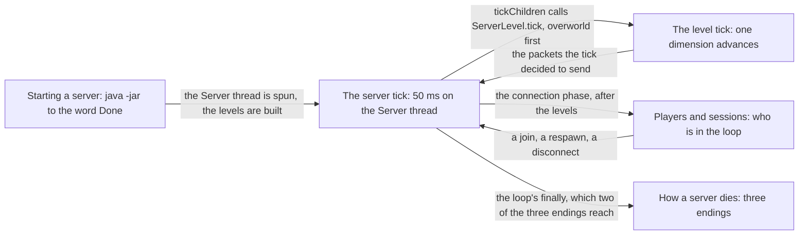

# III · The server

> Verified against **Minecraft 26.2** · Part III · The program that owns the world: one thread, one loop, twenty times a second, from the command line that starts it to the exception that ends it.

Everything a player thinks of as *the world* — the blocks, the mobs, the
weather, the hunger bar — is state owned by one object on one thread, and
this part is that thread doing a full lap. Part I named the Server thread
([anatomy](../anatomy/anatomy.md#four-threads-worth-memorising)); this is the
first place you watch it work. A player recognises this part by its clock:
nothing in the world happens continuously, and a furnace advances in steps of
a twentieth of a second. The claim the part makes is that **almost everything
surprising about a server's timing is the order of one method** — which step
of `MinecraftServer.tickChildren` runs before which — and a reader who
finishes it can answer *when* for anything the server does: when a block
change reaches a screen, when a mob stops being ticked, when a chest is on
disk, and what is lost if the process is killed between two of those moments.

That is a small system to know so much about. Counting the four packages
[the atlas](../../maps/packages.md#where-each-part-lives) lists for this
part, the way it counts everything else, it is
{{#include ../../generated/part-server.md}} — and over half of those lines
are `net/minecraft/server/level`'s forty-two classes, at nearly three hundred
lines apiece, because the objects that own a world are few and enormous. One
of them, `MinecraftServer`, is most of this part's first three pages.

## The shape of the part

Part III is a line into a loop and out again. Two pages are the loop itself
— the server tick and the one step of it that is a whole lecture — and the
other three are the beginning, the population and the end.

The first two are one lecture in two halves and are watched together: seven
later parts assume one of them or the other, which makes them the most
load-bearing pair in the book after *Anatomy*.

## Before you start

[Anatomy](../anatomy/anatomy.md#two-loops-and-a-wire-between-them), and
specifically its *two loops* figure. This part assumes you know that the
Server thread is an event loop as well as a game loop, that a packet is
decoded on a Netty thread and handled on this one, and that the client's
frame loop is a separate clock. Part II's
[codecs](../foundations/codecs-nbt-json.md) and
[registries](../foundations/identifiers-and-registries.md#the-freeze-rule-stated)
are assumed wherever something is written to disk or sent on the wire, and
[the resource system](../foundations/resource-system.md#the-pipeline) is
assumed once, by *starting a server*, which runs its staged load for server
data.

Two pages from a later part are assumed, and they are cut two different
ways. [Tickets and
loading](../world/tickets-and-loading.md#the-number-line) owns what
*entity-ticking* and *block-ticking* range mean, and [the level
tick](server-level-tick.md#three-ranges-before-we-need-them) defines both
before it uses them, so that one keeps until Part IV. [Environment attributes
and
timelines](../world/environment-attributes-and-timelines.md#the-stack-a-value-falls-through)
does not: the level tick's first act is to throw that system's cache away,
and its opening paragraph does not mean much to a reader who has never met
it. That is the one page worth watching out of order before this part;
everything else in Part IV can wait.

## Watch in this order

1. [The server tick](server-tick.md) — one 50 ms lap: the deadline that
   moves before the work starts, every packet since last time handled at
   once, every dimension advanced, and the two writes per client the tick
   leaves behind. *"Can't keep up!"* is not a warning that the server is
   about to skip ticks — it is the skip.
2. [The level tick](server-level-tick.md) — one step of that lap, which is
   the whole world changing: weather, scheduled ticks, mob spawns, random
   ticks, every entity, every block entity. The block changes go out
   *before* the entities move, so a change a piston makes reaches you a tick
   later than one a player's command makes — with falling sand the exception
   that sends its own packet, and a console command the one that is as late
   as the piston.
3. [Players and sessions](players-and-sessions.md) — a join from the end of
   the login handshake to a player standing in a world with chunks on the
   way, and then the four ways that session changes: death, a dimension,
   a disconnect, and a debug command that sends the player back to the
   configuration phase. Dying replaces your player object; the Nether does not.
4. [Starting a server](starting-a-server.md) — *java -jar server.jar* to
   the word *Done*: the EULA, the lock on `session.lock`, the packs and
   registries, the thread, the levels. The step that loads the world's
   chunks loads none of them on an ordinary world.
5. [How a server dies](how-a-server-dies.md) — three endings compared:
   `/stop`, a crash in the tick loop, and the watchdog. A crash saves your
   world. The watchdog does not.

## Where the part stops

A good deal of `server/` is taught elsewhere, because a package is not a
subject. The generation half of `ChunkMap` — `ChunkGenerationTask`,
`ChunkTaskDispatcher`, `ChunkTaskPriorityQueue` and `WorldGenRegion` — belongs
to Part IV, where a chunk is the thing being followed
([chunk generation](../world/chunk-generation-pipeline.md)).
`ServerPlayerGameMode` is the server half of a click and is watched in Parts V
and VIII. `ServerScoreboard`, `ServerFunctionLibrary` and
`ServerAdvancementManager` are data-pack machinery and belong to Part XIII.
`ReloadableServerRegistries` is Part II's reload. What is left here — and it
is the part's whole subject — is the loop, the levels it drives, the players
in them, and the two ends of the process.

## Reference this part uses

[Threads](../../reference/threads.md#the-threads-a-lecture-leans-on) — the
Server thread, the worker pool and the dedicated server's five side threads,
with who makes each. [Game rules](../../reference/gamerules.md) — the fourteen these five pages
name, out of fifty-nine.
[Level data and rules](../../reference/level-data-and-rules.md) — which file
remembers what, and how *level.dat* is written.
[Packets](../../reference/packets.md) — everything the tick sends.
[Diagram lanes](../../reference/lanes.md).

---

*Rules: names, never code · how the system works, not how the code reads ·
newest version only · every backticked name passes `tools/verify_names.py`.*
