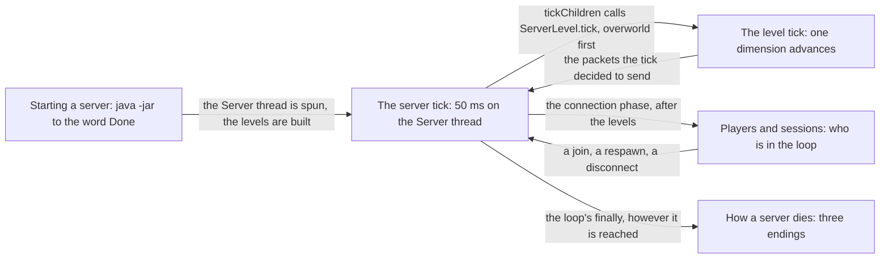

# III · The server

> Verified against **Minecraft 26.2** · Part III · The program that owns the world: one thread, one loop, twenty times a second, from the command line that starts it to the exception that ends it.

Everything a player thinks of as *the world* — the blocks, the mobs, the
weather, the hunger bar — is state owned by one object on one thread, and
this part is that thread doing a full lap. Part I named the Server thread;
this is the first place you watch it work. A player recognises this part by
its clock: nothing in the world happens continuously. A furnace advances in
steps of a twentieth of a second, a hopper moves one item per eight of
them, and when the console prints *Can't keep up! Is the server overloaded?*
some of those steps did not happen at all and never will.

## The shape of the part

Part III is a line into a loop and out again. Two pages are the loop itself
— the server tick and the one step of it that is a whole lecture — and the
other three are the beginning, the population and the end.

## Before you start

[Anatomy](../anatomy/anatomy.md), and specifically its *two loops* figure.
This part assumes you know that the Server thread is an event loop as well
as a game loop, that a packet is decoded on a Netty thread and handled on
this one, and that the client's frame loop is a separate clock. Part II's
[codecs](../foundations/codecs-nbt-json.md) and
[registries](../foundations/identifiers-and-registries.md) are assumed
wherever something is written to disk or sent on the wire.

One page from a later part is assumed and cannot be moved earlier without
moving all of Part IV: [tickets and
loading](../world/tickets-and-loading.md) owns what *entity-ticking* and
*block-ticking* range mean. [The level tick](server-level-tick.md) defines
both in two sentences before it uses them, so you can watch this part
first and Part IV second.

## Watch in this order

1. [The server tick](server-tick.md) — one 50 ms lap: the deadline that
   moves before the work starts, every packet since last time handled at
   once, every dimension advanced, and the two writes per client the tick
   leaves behind. *"Can't keep up!"* is not a warning that the server is
   about to skip ticks — it is the skip.
2. [The level tick](server-level-tick.md) — one step of that lap, which is
   the whole world changing: weather, scheduled ticks, mob spawns, random
   ticks, every entity, every block entity. The block changes go out
   *before* the entities move, so a change an entity makes always reaches
   you a tick later than a change a command makes.
3. [Players and sessions](players-and-sessions.md) — a join from the end of
   the login handshake to a player standing in a world with chunks on the
   way, and then the three ways that session changes: death, a dimension,
   a disconnect. Dying replaces your player object; the Nether does not.
4. [Starting a server](starting-a-server.md) — *java -jar server.jar* to
   the word *Done*: the EULA, the lock on `session.lock`, the packs and
   registries, the thread, the levels. The step that loads the world's
   chunks loads none of them on an ordinary world.
5. [How a server dies](how-a-server-dies.md) — three endings compared:
   `/stop`, a crash in the tick loop, and the watchdog. A crash saves your
   world. The watchdog does not.

## Reference this part uses

[Threads](../../reference/threads.md) — the Server thread, the worker pool
and the dedicated server's five side threads, with who makes each.
[Game rules](../../reference/gamerules.md) — the rules the tick consults,
which is most of them. [Packets](../../reference/packets.md) — everything
the tick sends. [Diagram lanes](../../reference/lanes.md).

---

*Rules: names, never code · how the system works, not how the code reads ·
newest version only · every backticked name passes `tools/verify_names.py`.*
