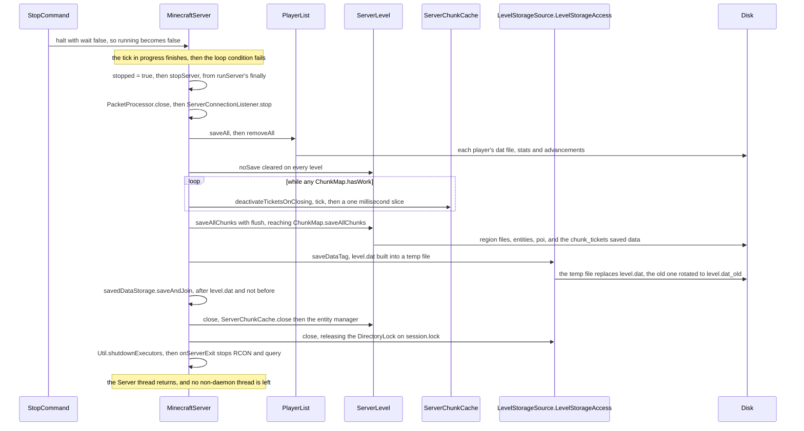
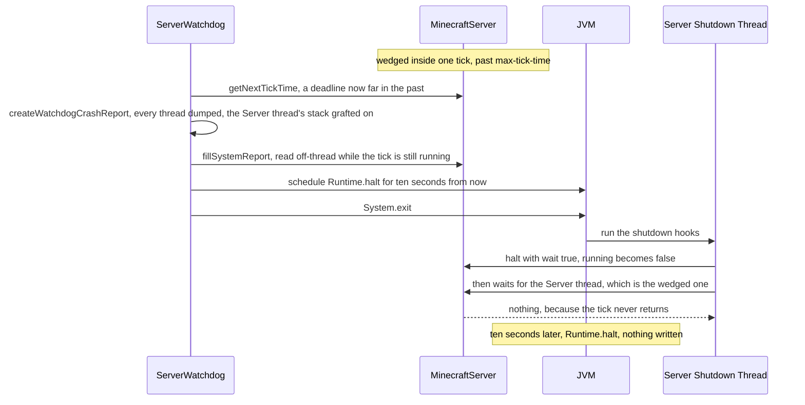

# How a server dies

> Verified against **Minecraft 26.2** · Part III · `/stop` typed at the console, an exception out of the tick loop, and a tick that never ends — three endings that write three different amounts of your world to disk.

An admin types `/stop`. The command sets one boolean and returns, and the
tick already in progress carries on to its end. Everything a player would
call *shutting down* — the players written, the unloads drained, `level.dat`
rotated, `session.lock` released — happens afterwards, inside the *finally*
of the loop that just exited, on the same Server thread that was ticking
mobs a moment ago. Which is what makes the second ending strange, and worth
a lecture: **a crash saves your world and the watchdog does not.** An
exception out of the tick loop lands in that same *finally*, so a server
that dies of a bad block entity writes exactly what `/stop` writes.
`ServerWatchdog` instead calls `System.exit`, which runs the Server Shutdown
Thread hook, which calls `MinecraftServer.halt` with *wait* true and waits
for the Server thread to finish — the very thread wedged in the tick that
tripped the watchdog. That wait never returns. Ten seconds later the
watchdog's own scheduled `Runtime.halt` ends the JVM with nothing written.

## The cast

| class | what it decides | thread |
|---|---|---|
| `MinecraftServer` | the three booleans, the tick loop, and the *finally* that is the whole of shutdown | Server |
| `StopCommand` | that `/stop` is one call to `MinecraftServer.halt` with *wait* false, at `Commands.LEVEL_OWNERS` | Server |
| `DedicatedServer` | what wraps the base teardown: the JSON-RPC notification, `Util.shutdownExecutors`, and the side threads in `DedicatedServer.onServerExit` | Server |
| `ServerWatchdog` | that a tick past *max-tick-time* is a dead server, and that the JVM goes with it | Server Watchdog, a daemon |
| `PlayerList` | that every player is written before anyone is disconnected | Server |
| `ServerChunkCache` · `ChunkMap` | when the world is quiet enough to stop draining, and what a flush save means | Server, with the writes on the IO pool |
| `LevelStorageSource.LevelStorageAccess` | `level.dat` and the `DirectoryLock` on `session.lock` | Server |
| `Util` | the two process-wide pools, and the three-second grace each gets | any |

## Three endings, side by side

|  | `/stop` | a tick-loop crash | a watchdog kill |
|---|---|---|---|
| **what clears `MinecraftServer.running`** | `MinecraftServer.halt`, with *wait* false from `StopCommand`, the JSON-RPC state service or the singleplayer host logging out, with *wait* true from the shutdown hook and the server GUI's close button | nothing: the loop is left by the throw, not by the condition | the shutdown hook, eventually — `System.exit` runs it and it calls `MinecraftServer.halt` with *wait* true |
| **does `MinecraftServer.runServer`'s *finally* run** | yes, on the Server thread | yes, on the Server thread, after the crash report | no: the Server thread never leaves the tick |
| **are players saved** | yes, `PlayerList.saveAll` then `PlayerList.removeAll` | yes, identically | no |
| **are chunks saved** | yes: the unload drain, then `MinecraftServer.saveAllChunks` with *flush* | yes, identically | no — only what the last autosave happened to write |
| **is `level.dat` written** | yes, `LevelStorageSource.LevelStorageAccess.saveDataTag` | yes, identically | no |
| **is `session.lock` released** | yes, `LevelStorageSource.LevelStorageAccess.close` drops the `DirectoryLock` | yes, identically | not by the game — the OS drops it when the process dies |
| **is a crash report written** | no | yes, into *crash-reports/*, from `MinecraftServer.constructOrExtractCrashReport` | yes, into *crash-reports/*, from `ServerWatchdog.createWatchdogCrashReport`, before the exit |
| **what ends the JVM** | nothing explicit: the Server thread returns and no non-daemon thread is left | the same | `Runtime.halt` from the watchdog's own timer, ten seconds after its `System.exit` |

The first two columns differ in one cell. The third differs in every cell
but the last two, and the rest of this page is why.

## `/stop`, in full

### The command is a flag

`StopCommand` registers one literal at `Commands.LEVEL_OWNERS`, sends
*commands.stop.stopping* and calls `MinecraftServer.halt` with *wait* false.
That call assigns `MinecraftServer.running` and returns. Nothing else
happens on that line of the console: the tick that was running the command
finishes its entities, its block entities and its packet flush, and the loop
condition at the top of `MinecraftServer.runServer` fails on the next pass.
Four other places call the same method: the server GUI's window-close
listener and `Main`'s shutdown hook, both with *wait* true, so that they
block until the Server thread has finished; the JSON-RPC management API's
`ServerStateService.stop`, with *wait* false like the command; and
`ServerCommonPacketListenerImpl.onDisconnect`, which stops a singleplayer
server when its host logs out.

Teardown itself is the loop's *finally*. `MinecraftServer.runServer` sets
`MinecraftServer.stopped` and calls `MinecraftServer.stopServer`, then calls
`MinecraftServer.onServerExit` from a nested *finally*, so that a teardown
which throws still stops the side threads. `DedicatedServer.stopServer`
wraps the base with `NotificationManager.serverShuttingDown` before and
`Util.shutdownExecutors` after.

### The front door closes, the guests do not leave

`PacketProcessor.close` is first, before anything is even logged. Afterwards
`PacketProcessor.scheduleIfPossible` refuses a packet a Netty thread has just
decoded, and `PacketProcessor.processQueuedPackets` returns without draining
— so packets already in the queue go the same way as the ones still
arriving. Then `ServerConnectionListener.stop` closes the channels it
*bound*, and only those: closing a Netty parent channel does not close the
connections accepted through it. Live sessions are severed one step later by
`PlayerList.removeAll`, with the *multiplayer.disconnect.server-shutdown*
reason. A connection still in handshake, login or configuration has no
`ServerPlayer` and is in neither list, so it is closed by neither, and simply
dies with the process ([players and sessions](players-and-sessions.md)).

`MinecraftServer.stopped` also changes how work is accepted:
`MinecraftServer.executeIfPossible` rejects anything new outright, and
`MinecraftServer.scheduleExecutables` reports false, so a caller reaching
`BlockableEventLoop.execute` from another thread runs its task inline rather
than queueing it for a loop that has stopped looping.

### Players before chunks, and never `MinecraftServer.saveEverything`

Shutdown does not use the save entry point everything else uses.
`MinecraftServer.saveEverything` — autosave, `/save-all`, the integrated
server's pause, the JSON-RPC save call — is players *then* chunks in one
call. `MinecraftServer.stopServer` does the two halves by hand:
`PlayerList.saveAll` (each player's data through `PlayerDataStorage`, plus
their `ServerStatsCounter` and `PlayerAdvancements`), then
`PlayerList.removeAll`, and only much later `MinecraftServer.saveAllChunks`.
The order is load-bearing: a departing player's tickets go with them, which
is what lets the next step ever finish.

`ServerLevel.noSave` is then cleared on every level. `/save-off` does not
survive `/stop`.

### The drain

`ChunkMap.hasWork` is the question, and it is a broad one: pending light,
pending unloads, a non-empty updating map, POI work, chunks queued to drop,
the worldgen and light dispatchers, and — the reason the loop terminates at
all — `DistanceManager.hasTickets`. While any level answers yes, the server
calls `ServerChunkCache.deactivateTicketsOnClosing` and
`ServerChunkCache.tick` on each, sets the tick deadline one millisecond out,
and runs `MinecraftServer.waitUntilNextTick`, which drains the main-thread
queue and polls each level's chunk executor for that millisecond.

**One millisecond** — each slice of the drain, so unloads and their saves
proceed while the main-thread queue keeps taking chunk results.

`TicketStorage.deactivateTicketsOnClosing` moves every ticket except
`TicketType.UNKNOWN` into a parked map. Parked tickets stop holding chunks —
`TicketStorage.hasTickets` counts only the live map, which is how the loop
ends — but they are not forgotten. `TicketStorage.packTickets` writes both
maps, and the types that `TicketType.persist`, forced and portal, go into the
level's *chunk_tickets* saved data. On the next boot they load back parked
and `TicketStorage.activateAllDeactivatedTickets` re-arms them during
`MinecraftServer.prepareLevels`
([tickets and loading](../world/tickets-and-loading.md),
[starting a server](starting-a-server.md)).

### The flush save

`MinecraftServer.saveAllChunks` with *flush* true is the real save. The
scoreboard is pushed into its saved data, then each `ServerLevel.save`:
`ServerLevel.saveLevelData` joins the level's own `SavedDataStorage`, and
`ServerChunkCache.save` runs the distance manager once more before
`ChunkMap.saveAllChunks` in flush mode. That last one is a *loop*, not a
pass — every holder that `ChunkHolder.wasAccessibleSinceLastSave`, waited on
with `BlockableEventLoop.managedBlock` until `ChunkHolder.isReadyForSaving`,
repeated until a whole round saves nothing new — and then
`SectionStorage.flushAll` for the POI sections, the unloads processed, and
`SimpleRegionStorage.synchronize` joined so that the `IOWorker` has actually
put the bytes down ([chunk storage](../world/chunk-storage.md)). Entities
follow, through the level's `PersistentEntitySectionManager`.

`level.dat` is written the same way at every save, flush or not:
`LevelStorageSource.LevelStorageAccess.saveDataTag` builds the tag from
`PrimaryLevelData.createTag`, wraps it under *Data*, writes it gzipped to a
temp file in the world directory with `NbtIo.writeCompressed`, and
`Util.safeReplaceFile` swaps it in, rotating the previous file to
`level.dat_old`. Only after that does the *server-wide* `SavedDataStorage`
get its `SavedDataStorage.saveAndJoin`. There are two tiers of saved data,
and they are flushed at opposite ends of this section.

### The closes, and the last thread

`ServerLevel.close` is `ServerChunkCache.close` — which saves once more, then
closes the level's saved data, the `ThreadedLevelLightEngine` and `ChunkMap`
— followed by the entity manager. Then the server's own `SavedDataStorage`
(whose `SavedDataStorage.close` is itself a final
`SavedDataStorage.saveAndJoin`), the `MinecraftServer.ReloadableResources`,
and last `LevelStorageSource.LevelStorageAccess.close`, which releases the
`DirectoryLock`. From that moment the world is openable by anything else.

`Util.shutdownExecutors` then stops `Util.backgroundExecutor` and
`Util.ioPool` with a three-second grace each, inside
`DedicatedServer.stopServer` and so *before* `DedicatedServer.onServerExit`
— nothing may need a worker after that point. `Util.nonCriticalIoPool` is
untouched, and survives only because its threads are daemons.
`DedicatedServer.onServerExit` closes the text filter and the GUI and stops
`RconThread`, `QueryThreadGs4` and the `ManagementServer`. There is no
`System.exit` anywhere on this path, and none is needed. Every other thread
the server started is a daemon — the console reader, the Netty groups, the
management server's group, the watchdog — except the RCON and query threads,
which `GenericThread.stop` joins here in one-second slices, and the IO
pool's workers, which went a step earlier with `Util.shutdownExecutors`. So
when `MinecraftServer.runServer` returns, the Server thread is the last one
left, and the JVM ends because there is nothing to keep it
([the thread reference](../../reference/threads.md)).

## The crash that saves

`MinecraftServer.runServer` wraps the entire loop, `DedicatedServer.initServer`
included. Anything thrown out of a tick — a block entity, a mob's AI, a
command, a packet handler that did not catch its own trouble — is logged,
turned into a report, saved, and then falls into the same *finally*.

`MinecraftServer.constructOrExtractCrashReport` walks the cause chain and
keeps the *innermost* `ReportedException` it finds, using that exception's
own report and noting the outer throwable under a *Wrapped in* category. A
throwable with no `ReportedException` anywhere in it becomes a fresh report
titled *Exception in server tick loop*. Either way
`MinecraftServer.fillSystemReport` fills it in — the value of
`MinecraftServer.running`, the player count and roster, the selected and
available data packs, the enabled feature flags, the world-generation
lifecycle, the world seed, and the contents of the server's
`SuppressedExceptionCollector`, which has been quietly accumulating every
chunk load failure, chunk save failure and packet-handler exception since
boot. `DedicatedServer.fillServerSystemReport` adds two lines, the modded
status and the words *Dedicated Server*. The file lands in *crash-reports/*
under `MinecraftServer.getServerDirectory`, named by
`Util.getFilenameFormattedDateTime`. `MinecraftServer.onServerCrash` is a
hook the dedicated server does not override.

**A crash on another thread arrives here too.** `BlockableEventLoop` keeps
one static parked report. `Util.onThreadException` — the uncaught-exception
handler on every `Util.backgroundExecutor` and IO-pool thread — and
`GenerationChunkHolder`, when a generation step completes exceptionally,
both call `BlockableEventLoop.relayDelayCrash`, which parks the report or
suppresses the new one under a report already parked. The next
`BlockableEventLoop.pollTask` on a loop constructed with crash propagation
throws it as a `ReportedException`, and the dedicated server is constructed
that way. So a worker that dies does not die silently: it dies as a
tick-loop crash, on the Server thread, at whatever moment that thread next
looks for a task ([the server tick](server-tick.md)). The integrated server
is constructed with propagation off and hands its report to the client
instead, through `IntegratedServer.onServerCrash`.

## The watchdog that does not

`ServerWatchdog` is a daemon thread started by `DedicatedServer.initServer`
whenever `DedicatedServer.getMaxTickLength` is positive — that is
`DedicatedServerProperties.maxTickTime`, *max-tick-time*, default sixty
thousand milliseconds, and setting it to zero or less means the thread is
never created and there is no backstop at all. Its loop is short: while
`MinecraftServer.isRunning`, compare `Util.getNanos` with
`MinecraftServer.getNextTickTime`, then sleep exactly until the earliest
moment a violation could be true.

What it compares matters. `MinecraftServer.getNextTickTime` is the *deadline*
the loop set for the tick it is running, not a timestamp of when that tick
began, and the tick loop advances it before each tick and again when catching
up after an overload. The watchdog fires when the server is that far past
where it promised to be.

The report comes first, and it is the good part of the design.
`ServerWatchdog.createWatchdogCrashReport` dumps every thread in the JVM,
sorts them daemon-last, appends the lot as a *Thread Dump* category, and
grafts the Server thread's stack trace onto a synthetic error — so the
report's headline stack is the code that hung. `MinecraftServer.fillSystemReport`
adds the usual, plus a *Performance stats* category holding the random-tick
game rule and `ServerLevel.getWatchdogStats` for every level: players,
entities by type, block entities by type, block and fluid tick counts, chunk
source stats. All of it is read from another thread with no synchronisation
whatsoever, off a world that is mid-tick — which is exactly the trade the
class makes, because the alternative is asking a wedged thread for the
answer. It goes to real stdout through `Bootstrap.realStdoutPrintln` and to
*crash-reports/* like any other report.

Then the deadlock. The watchdog schedules `Runtime.halt` on a timer and calls
`System.exit`, which runs the registered shutdown hooks — including the
"Server Shutdown Thread" that `Main` registered at boot, whose whole body is
`MinecraftServer.halt` with *wait* true. That sets `MinecraftServer.running`
false, which the wedged tick will never read, and then waits for the Server
thread to end. It does not end. `System.exit` will not return until its hooks
do, so the JVM sits there until the watchdog's timer fires.

**Ten seconds** — from the watchdog's `System.exit` to its `Runtime.halt`
(`ServerWatchdog.MAX_SHUTDOWN_TIME`), and the world is not touched in any of
them.

The watchdog is a liveness backstop, and reading it as a safe stop gets the
guarantee backwards. It is also why nothing guards shutdown itself: the
watchdog loops only while `MinecraftServer.running` is true, and every clean
path clears that flag *before* the drain and the flush save begin. A server
stuck on "Saving chunks" is stuck with no watchdog left watching it.

## Ctrl-C, the window, and a singleplayer world

Ctrl-C at the console and a *SIGTERM* from a service manager are the same
thing as far as the game is concerned: the JVM runs its shutdown hooks, and
the one `Main` registered calls `MinecraftServer.halt` with *wait* true. The
contrast with the watchdog is only in the health of the thread being waited
for. Here the Server thread is fine, notices the cleared flag at the top of
its next tick, and runs the entire `/stop` teardown while the hook thread
waits. A Ctrl-C on a healthy server *is* a `/stop`, and the JVM does not exit
until the world is on disk. The server GUI's window-close button does the
same thing from the AWT thread.

Singleplayer ends on a poll. `Minecraft.disconnect` — reached from *Save and
Quit*, from a disconnect, and from `Minecraft.emergencySave` — closes the
client's connection, then calls `IntegratedServer.halt` with *wait* false.
That override first uses `BlockableEventLoop.executeBlocking` to remove every
player who is not the host, then clears `MinecraftServer.running` and stops
the LAN pinger. The client then puts up a `GenericMessageScreen` reading
`Gui.SAVING_LEVEL` and calls `Minecraft.renderFrame` in a loop while
`MinecraftServer.isShutdown` is false. The "Saving world" screen is not a
progress bar and is not driven by the server: it is a render loop spinning on
one question, *is the Server thread dead yet*
([the client loop](../client/the-client-loop.md)). Closing the game window
instead goes through the client's own "Client Shutdown Thread" hook, which
calls `IntegratedServer.halt` with *wait* true.

The integrated server never calls `Util.shutdownExecutors`.
`IntegratedServer.stopServer` tears down published state and defers to the
base. The client owns those pools and shuts them down at the very end of its
own life, long after the world is closed.

## Three booleans and a question

`MinecraftServer.running` is volatile and is the loop condition, and it is
the only one of the three that anything sets in order to stop the server.
`MinecraftServer.stopped` is a plain field set in the *finally* just before
teardown, read from other threads through `MinecraftServer.isStopped`, and
it is what closes the task queue. `MinecraftServer.isReady` is volatile, set
at the bottom of every loop iteration, and is not what prints *Done* — that
is logged in `DedicatedServer.initServer`, before the loop is entered.

`MinecraftServer.isShutdown` is the odd one out, and is not a field at all:
it asks whether the Server thread is still alive. Nothing sets it, nothing
can lie about it, and it stays false through the whole teardown whichever
ending is running — which is precisely why the singleplayer client waits on
it rather than on `MinecraftServer.isStopped`, which goes true at the *start*
of teardown, when nothing has been saved yet.

## What you lose if you kill the process

Ordinary autosave is `MinecraftServer.saveEverything` with neither *flush*
nor *force*, every 6000 ticks — five minutes of game clock, floored at 100
ticks. It writes every player, every dirty chunk that has waited out its
per-chunk spacing in `ChunkMap`, and, unconditionally, `level.dat`. So the
world clock, the weather, the spawn point and the game rules on disk are
never more than one autosave stale, even on a server nobody ever stops
cleanly. Everything else — a chest filled two minutes ago, a mob that walked
into a new chunk, an inventory change — lives in the `LevelChunk` and the
entity sections until something saves them.

That gives an honest answer per ending. After `/stop` or a tick-loop crash,
nothing is lost: the drain, the flush save and the joined `IOWorker` mean the
process does not end until the bytes are down. After a watchdog kill, or a
*kill -9*, or a power cut, you lose everything since the last autosave, plus
anything still queued inside the `IOWorker` — those writes run on
`Util.ioPool`, and `Runtime.halt` does not wait for a pool.

What you never lose is access to the world. `session.lock` is an OS advisory
lock taken with `FileChannel.tryLock`, not a file whose contents mean
anything, and the operating system releases it when the process dies however
it dies. A world left behind by a killed server opens on the next start.
Copying a world directory copies a `session.lock` that means nothing at all.

Individual failures are quieter than any of this. A chunk that cannot be
written calls `MinecraftServer.reportChunkSaveFailure`: logged, added to the
`SuppressedExceptionCollector` that the next crash report will print, written
out as its own `ReportType.CHUNK_IO_ERROR` file under *debug/*, and followed
by a disk-space check. The tick does not stop, the server does not stop, and
the only sign at the time is a line in the log.

## Where to look

`StopCommand` · `MinecraftServer.halt` · `MinecraftServer.runServer` ·
`MinecraftServer.constructOrExtractCrashReport` · `MinecraftServer.stopServer` ·
`MinecraftServer.saveAllChunks` · `MinecraftServer.saveEverything` ·
`ServerLevel.save` · `ServerChunkCache.save` · `ChunkMap.saveAllChunks` ·
`ChunkMap.hasWork` · `TicketStorage.deactivateTicketsOnClosing` ·
`LevelStorageSource.LevelStorageAccess.saveDataTag` ·
`LevelStorageSource.LevelStorageAccess.close` · `DirectoryLock` ·
`Util.shutdownExecutors` · `DedicatedServer.stopServer` ·
`DedicatedServer.onServerExit` · `ServerWatchdog.run` ·
`ServerWatchdog.createWatchdogCrashReport` · `Main` (the shutdown hook) ·
`BlockableEventLoop.relayDelayCrash` · `IntegratedServer.halt` ·
`Minecraft.disconnect`

---

*Rules: names, never code · how the system works, not how the code reads ·
newest version only · every backticked name passes `tools/verify_names.py`.*
