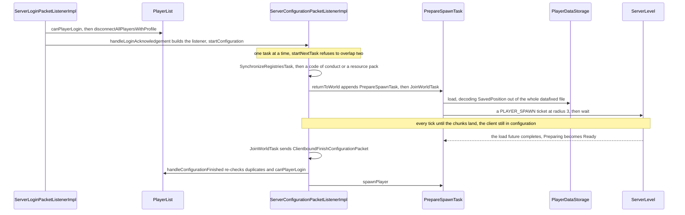
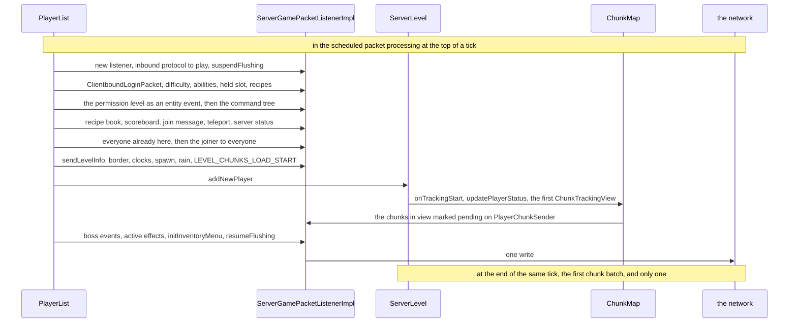

# Players and sessions

> Verified against **Minecraft 26.2** · Part III · One connection, four events: a player joins, dies, walks into a Nether portal, and logs out.

A player clicks a server in the list, watches a progress bar, and is
standing in a world. An hour later they fall in lava, press *Respawn*, walk
through a portal and log off for the night. On the server those are four
events on one object graph, and they disagree about what survives. Dying
**destroys** the `ServerPlayer` and builds a new one; a trip to the Nether
keeps the same object and moves it. Both keep the player's entity id, and
both keep the very same `ServerGamePacketListenerImpl` — a respawn does not
rebuild the connection, it repoints it, in one field assignment, at the new
player. Which is why anyone still holding the old `ServerPlayer` after a
respawn is holding a corpse: an object flagged removed, out of every list,
that will keep answering questions all day.

## The cast

| class | what it decides | thread |
|---|---|---|
| `PlayerList` | who is admitted, who is in the tab list, and the exact order of the join burst | Server |
| `ServerPlayer` | one player's world state, and what a new one inherits from an old one | Server |
| `ServerGamePacketListenerImpl` | the session: the player it points at, the flush suspension, the load gate, the kicks | Netty to decode, Server to handle |
| `ServerConfigurationPacketListenerImpl` | the strictly serial task queue a join is prepared in | Netty, with four handlers hopping to Server |
| `PrepareSpawnTask` | where the player will stand, and when the `ServerPlayer` is finally constructed | Server |
| `PlayerDataStorage` | the `.dat` file, its *.dat_old* twin and its corrupt-copy rescue | Server |
| `PlayerChunkSender` | how many chunks a client is trusted with, starting at almost none | Server |
| `CommonListenerCookie` | the four facts that survive a phase change: profile, latency, client options, transferred | — |

The phases this trace passes through — login, configuration, play, and the
terminal packets between them — belong to
[protocol phases](../networking/protocol-phases.md). This page starts where
that one hands over: with `PlayerList` deciding whether the login is allowed
at all.

## Admission is a `Component` or nothing

Identity here is a `NameAndId`: a record of a UUID and a name, made from the
authenticated `GameProfile`, and the key that every stored-user list, every
op lookup and every save file is addressed by. `UserNameToIdResolver`,
reached through `MinecraftServer.services`, is the cache that maps between
the two halves — a `CachedUserNameToIdResolver` over *usercache.json*, with a
`ProfileResolver` behind it for the lookups the file cannot answer — and
comparing its remembered name against the profile's is how the server notices
a player has been renamed since their last visit.

`PlayerList.canPlayerLogin` returns the reason to refuse, or null. It asks
four questions in order — the ban list, the whitelist, the IP ban list, then
capacity — and the first three ask the same kind of object. A `StoredUserList`
is a JSON file of `StoredUserEntry` records keyed by identity, rewritten whole
on every change, and there are four of them: `UserBanList`, `IpBanList`,
`UserWhiteList` and the `ServerOpList` the next paragraph turns on. The two
ban lists share a `BanListEntry` carrying a source, a reason and an expiry,
and nothing sweeps that expiry on a schedule: `StoredUserList.get` drops what
has lapsed before it answers, so a temporary ban ends the moment somebody
asks about it. The two ways past the gate are not the ones a reader expects.
The
whitelist is bypassed by being an **op**: `PlayerList.isWhiteListed` is
satisfied by presence in the op list, and `DedicatedPlayerList.isWhiteListed`
overrides it to route through `PlayerList.isOp`, which also asks whether
the identity is the singleplayer owner — a branch that never fires here,
because `DedicatedServer.isSingleplayerOwner` returns false for everyone.
The *bypassesPlayerLimit* flag in *ops.json* is a
separate thing entirely and reaches exactly one of the four questions:
`ServerOpListEntry.bypassesPlayerLimit` is read only by
`DedicatedPlayerList.canBypassPlayerLimit`, and only the capacity test calls
it. A banned op is still banned.

The gate runs **twice**, and the second run is not a repeat of the first.
`ServerLoginPacketListenerImpl.verifyLoginAndFinishConnectionSetup` runs it
during login; `ServerConfigurationPacketListenerImpl.handleConfigurationFinished`
runs it again when the client says configuration is over, because a ban or a
newly full server can land in the seconds a configuration takes. Duplicate
logins differ between the two. At login the newcomer wins:
`PlayerList.disconnectAllPlayersWithProfile` kicks every session holding
that UUID with `PlayerList.DUPLICATE_LOGIN_DISCONNECT_MESSAGE`, and the
login parks until the old connection is really gone. At the second check the
newcomer loses — an existing player with that id is a flat rejection, since
by then there is a prepared spawn to throw away rather than a session to
evict.

## Preparing a place to stand

Nothing in that queue overlaps.
`ServerConfigurationPacketListenerImpl.startNextTask` throws rather than
start a task while another is unfinished, so the registry transfer completes
before `PrepareSpawnTask` reads a byte, and the two optional tasks sit
between them. What *does* overlap is the chunk load and the client's
remaining work: once the ticket is placed the task simply reports *not
finished* from `ConfigurationTask.tick` each tick, and the client spends
that time in configuration with no idea a world is being assembled for it.

The ticket needs re-arming. `TicketType.PLAYER_SPAWN` is registered with a
timeout of twenty ticks, so `PrepareSpawnTask.keepAlive` — called from
`ServerConfigurationPacketListenerImpl.tick` — re-adds it at the same radius
every tick once the task has reached `PrepareSpawnTask.Ready`. Without that,
a client slow to acknowledge the finish packet would arrive to find its
spawn chunks expired underneath it.

A player with no save file gets a search instead of a position.
`PlayerSpawnFinder.findSpawn` walks up to
`PlayerSpawnFinder.ABSOLUTE_MAX_ATTEMPTS` candidates — a thousand and
twenty-four, or fewer if `GameRules.RESPAWN_RADIUS` or the world border says
so — in a coprime-strided order from a random offset, loading each
candidate's chunk under a one-tick `TicketType.SPAWN_SEARCH` ticket and
returning a future. The `ChunkLoadCounter` beside it feeds only the
server's `LevelLoadListener`, through
`LevelLoadListener.Stage.LOAD_PLAYER_CHUNKS` — the client's progress bar on
an integrated server, and nothing a remote player ever sees on a dedicated
one, where the listener is a `LoggingLevelLoadListener` that boot already
closed.

## The save file is read twice, and both reads are the whole file

`PrepareSpawnTask.start` reads the `.dat` and decodes
`ServerPlayer.SavedPosition` from it — three optional fields, dimension,
position and rotation, and nothing else. That is all it *decodes*. It is not
all it does: `PlayerDataStorage.load` reads the compressed tag with an
unlimited accounter and runs `DataFixTypes.PLAYER` over the entire document
before any codec sees it ([codecs, NBT and
JSON](../foundations/codecs-nbt-json.md)). So the narrow read saves decoding,
not I/O, and a join pays the migration cost twice — once here, and once in
`PrepareSpawnTask.Ready`, where the file is loaded again for the full
`Entity.load`.

Between the two reads the player is built. `ServerLevel.waitForEntities`
blocks the Server thread until the entities in the spawn chunks have
finished loading — a horse to remount has to exist before a rider can be
attached to it — and then the `ServerPlayer` constructor runs, pulling its
`ServerStatsCounter` and `PlayerAdvancements` out of `PlayerList` on the way
past and defaulting `ServerPlayer.requestedViewDistance` to 2 until the
client's `ClientInformation` says otherwise. The second read fills the
object in, the player is snapped to the prepared position,
`PlayerList.placeNewPlayer` runs, and only afterwards do
`ServerPlayer.loadAndSpawnEnderPearls` and
`ServerPlayer.loadAndSpawnParentVehicle` put back what the player was
carrying and sitting on when they left.

Two rescues are wired into the read, and the first is the file's own.
`PlayerDataStorage.load` tries *\<uuid\>.dat*; if that comes back with
nothing — the file is missing, or `NbtIo.readCompressed` threw and logged
*Failed to load player data* — it copies whatever is there aside as
*\<uuid\>_corrupted_\<timestamp\>.dat* and then tries *\<uuid\>.dat_old*,
the twin the previous write rotated out. So a corrupted file is kept — under
the *corrupted* name, for whoever wants to look at it — and the player loses
one session rather than everything; a player with no readable file and no
twin is built from nothing, which is a new spawn rather than an error. Only
what survives that is datafixed.

The second rescue is about identity. `PlayerList.loadPlayerData` checks
whether the joining identity is the singleplayer owner and, if the world
records a *singleplayer_uuid* in its level data, loads **that** file rather
than the one named for the joining id. It works once: the save writes under
the current id and `MinecraftServer.saveAllChunks` stamps the current
owner's id into the level data, so the old file is read on one join and
orphaned by the first save afterwards.

## `PlayerList.placeNewPlayer` sends a world in one write

The whole method sits inside one suspension, so everything above — a login
packet, a command tree, a scoreboard, a tab list, a world border — leaves as a
single write. It is the same
`ServerCommonPacketListenerImpl.suspendFlushing` bracket [the server
tick](server-tick.md#the-two-writes-each-client-gets) puts around every client
every tick, and the one place in the game it is opened by hand: a join is
handled in the scheduled packet processing that runs *before*
`MinecraftServer.tickChildren` opens the tick's own.

`ClientboundLoginPacket` is where the client learns the entity id it is
about to be given, the hardcore flag, every dimension key the server has,
the view and simulation distances, whether the server authenticates, and a
`CommonPlayerSpawnInfo` from `ServerPlayer.createCommonSpawnInfo` carrying
the dimension type, the obfuscated seed, both game modes, the last death
location, the portal cooldown and the sea level. Three game rules are pinned
into it as plain booleans and never re-sent by this path:
`GameRules.REDUCED_DEBUG_INFO`, `GameRules.LIMITED_CRAFTING`, and
`GameRules.IMMEDIATE_RESPAWN` inverted into *show the death screen*.

The permission level arrives twice over, as a `ClientboundEntityEventPacket`
carrying one of five event ids and as the whole command tree from
`Commands.sendCommands`, both from `PlayerList.sendPlayerPermissionLevel`
resolving a `LevelBasedPermissionSet` out of
`MinecraftServer.getProfilePermissions`. Where such a set comes from is
[permissions](../commands/permissions.md#where-a-set-comes-from); all a join
needs to know is that both halves are re-sent whenever `PlayerList.op` or
`PlayerList.deop` changes it.

The tab list goes out in a deliberate order: the joiner is sent everyone
already present, *then* added to `PlayerList.players`, *then* everyone —
themselves included — is sent the joiner. And the join message is chosen a
few lines earlier than it is sent, because
*multiplayer.player.joined.renamed* is used when the name in the profile
differs from the one the name cache remembers, and the cache is overwritten
at the top of the method.

Entering the level is the step that starts the terrain, though it is not
the last: the boss bars, the active effects, the inventory menu and the join
notification all follow it, and `ServerCommonPacketListenerImpl.resumeFlushing`
closes the single write.
`ServerLevel.addNewPlayer` hands the player to
`PersistentEntitySectionManager.addNewEntity`, whose callback adds it to
`ServerLevel.players` and to the chunk source; `ChunkMap.updatePlayerStatus`
registers the player with `DistanceManager`, resets its chunk tracking to
`ChunkTrackingView.EMPTY` and computes the real one, and every chunk inside
that view is marked pending on the connection's `PlayerChunkSender`. So
there are two player lists, written by different systems:
`PlayerList.players` is *who is on the server* and `PlayerList` alone writes
it, while `ServerLevel.players` is *whose entity is in this level* and only
the entity manager's tracking callbacks write it. A player halfway through a
dimension change is in the first and in neither copy of the second.

**A joining client is trusted with one batch**, which is the only thing about
the chunk-sending loop that is a fact about *joining*: `PlayerChunkSender`
starts with a budget of a single unacknowledged batch, so the first batch a
player ever receives is a hard round trip before the second can leave. The
loop it then settles into — the client's measured rate, the clamps and the
nearest-first order — is [what the client is
told](../networking/what-the-client-is-told.md#the-rate-the-client-asks-for)'s,
and which chunks are in the player's set at all is [tickets and
loading](../world/tickets-and-loading.md#which-chunks-a-player-is-owed-and-what-makes-one-eligible)'s.

## Loaded is something the client says

The player is in the world before the client can play.
`ServerGamePacketListenerImpl.hasClientLoaded` gates movement, block
breaking, item use, sprinting and sneaking, and it answers false until
either the client sends `ServerboundPlayerLoadedPacket` or a sixty-tick
timer runs out — `ServerGamePacketListenerImpl.CLIENT_LOADED_TIMEOUT_TIME`,
started in the listener's constructor and counted down from
`ServerPlayer.tick`, which is to say from the level's entity loop rather
than from the connection.

Death re-arms the same gate by a different mechanism.
`ServerGamePacketListenerImpl.markClientUnloadedAfterDeath`, called at the
end of `ServerPlayer.die`, sets a flag that no timer clears: a dead player's
client counts as unloaded indefinitely, and only
`ServerGamePacketListenerImpl.restartClientLoadTimerAfterRespawn` — reached
from the respawn, or from a brand-new listener — clears the flag and starts
the sixty ticks again. The death screen is held open by the same field the
*Joining world* screen is.

That the countdown ticks from `ServerPlayer.tick` while the food, health and
stat sync tick from `ServerPlayer.doTick` is the whole reason a player is
ticked from two places every tick; [the two-phase
tick](../player/the-two-phase-tick.md#the-trace-one-player-one-tick-twice) is
the lecture on that. The fact worth
carrying out of here is that the level's entity loop ticks players
*regardless* of entity-ticking range, which is how a player standing in an
otherwise idle chunk still moves.

## Four ways the session changes

The join is one story; what happens afterwards is a comparison. Three of
these a player will meet tonight and the fourth exists for one debug
command. They are not quite every way out of a `ServerLevel` — the end
credits are a fifth, and `ServerPlayer.showEndCredits` removes the player
with `Entity.RemovalReason.CHANGED_DIMENSION` on its way to the respawn
below — but they are the four a session is built out of, and they disagree
about almost everything.

| | respawn | dimension change | disconnect | `ServerGamePacketListenerImpl.switchToConfig` |
|---|---|---|---|---|
| **who runs it** | `ServerGamePacketListenerImpl.handleClientCommand` | `ServerPlayer.teleport` | `Connection.handleDisconnection` | `DebugConfigCommand` |
| **same `ServerPlayer`?** | no — `PlayerList.respawn` constructs a new one | yes | yes, briefly | yes, then a new one on the way back |
| **same entity id?** | yes, copied over by `Entity.setId` | yes | — | no, the rebuilt player gets a fresh one |
| **same connection listener?** | yes, `ServerPlayer.connection` is reassigned | yes | — | no, a new one from `PlayerList.placeNewPlayer` |
| **what carries over** | whatever `ServerPlayer.restoreFrom` copies | everything, because nothing is copied | — | whatever the `.dat` holds |
| **is the `.dat` written?** | no | no | yes, inside `PlayerList.remove` | yes, the same call |
| **the client is told** | `ClientboundRespawnPacket`, keeping nothing, or attribute modifiers | `ClientboundRespawnPacket`, `ClientboundRespawnPacket.KEEP_ALL_DATA` | nothing, the channel is already gone | `ClientboundStartConfigurationPacket` |
| **removal reason** | `Entity.RemovalReason.KILLED` | `Entity.RemovalReason.CHANGED_DIMENSION` | `Entity.RemovalReason.UNLOADED_WITH_PLAYER` | the same |

### The object, and the reference that outlives it

`PlayerList.respawn` builds the new `ServerPlayer` from the old one's
profile and client information, then performs three assignments that make
the difference invisible from outside: `ServerPlayer.connection` is set to
the old player's listener, `Entity.setId` copies the entity id, and the
listener's own player field is reassigned by its caller. To every other
client on the server nothing has happened — same id, same UUID, same tab
list row, and no `ClientboundPlayerInfoUpdatePacket` is sent at all. To
anything inside the server holding the old object, everything has happened:
it was removed from its level before the new one existed, and it is not in
`PlayerList.players` any more.

Only two of the four paths take a `TeleportTransition`, and they are the two
that move you. `ServerPlayer.findRespawnPositionAndUseSpawnBlock` turns the
saved `ServerPlayer.RespawnConfig` — respawn data plus a *forced* flag —
into one: a respawn anchor is found and a charge spent unless the point is
forced, a bed is found and costs nothing,
`TeleportTransition.missingRespawnBlock` says the block is gone, and
`TeleportTransition.createDefault` falls back to the world spawn. Both of
those last two are the expensive branch, not just the fallback: each builds
its position with `TeleportTransition.findAdjustedSharedSpawnPos`, so each
runs `ServerPlayer.adjustSpawnLocation` — the same `PlayerSpawnFinder` search
a join runs asynchronously — and blocks the Server thread on the future with
`BlockableEventLoop.managedBlock`.

### What comes across when you die

`ServerPlayer.restoreFrom` has two branches, and the interesting one is not
the one people name it for. Its *restore everything* branch — permanent
attribute modifiers, health, hunger, every active effect, the inventory, the
portal state — is reached only when `PlayerList.respawn` is called with
`Entity.RemovalReason.CHANGED_DIMENSION`, which happens in exactly one place:
a player pressing *Respawn* on the end credits, with `ServerPlayer.wonGame`
set. That is the End-portal return, not *keepInventory*.

An ordinary death takes the other branch. Health is reset to maximum,
effects are gone, and `GameRules.KEEP_INVENTORY` — or having died as a
spectator — decides only whether `ServerPlayer.restoreFrom` runs
`ServerPlayer.transferInventoryXpAndScore`, which moves the inventory, the
experience and the score and nothing else. What the same rule decided on the
way *out*, when the old player died, is [damage and
death](../entities/damage-and-death.md#the-death-screen-and-what-the-client-does-alone)'s.
Outside the branch, and so true of every death, a long tail is copied
unconditionally: the ender chest, the enchantment seed, both game modes,
base attribute values, the recipe book, the warden spawn tracker, the chat
session, the skin customisation, the last death location. The ender chest
surviving death is not a game rule; it is a field assignment.

### Why the Nether keeps your potion effects

Because nothing is copied. `ServerPlayer.teleport` across a dimension
boundary sets `ServerPlayer.isChangingDimension`, sends the client a
`ClientboundRespawnPacket` marked `ClientboundRespawnPacket.KEEP_ALL_DATA`,
removes the entity from the old level with
`Entity.RemovalReason.CHANGED_DIMENSION` — one of the two reasons that
neither destroy an entity nor write it into a chunk ([entity
lifecycle](../entities/entity-lifecycle.md#five-reasons-one-label) has the
five) — immediately calls
`Entity.unsetRemoved`, points it at the new level with
`ServerPlayer.setServerLevel`, and adds it back with
`ServerLevel.addDuringTeleport`. It is one object the whole way. The effects
survive because they were never touched, and what the server then re-sends
— level info, the inventory through `PlayerList.sendAllPlayerInfo`, the
active effects, the abilities, the permission level — is not a restoration
but a **re-sync**, because the client threw its own world away the moment
the respawn packet arrived.

A same-dimension teleport is not this path at all. It is
`ServerGamePacketListenerImpl.teleport` followed by
`ServerGamePacketListenerImpl.resetPosition`, with no client-side world
discarded and no respawn packet sent.

### Where your llama goes when you log out

The channel closes on a Netty thread and nothing happens until
`ServerConnectionListener.tick`, in the connection step of the server tick,
notices and calls `Connection.handleDisconnection` ([the
connection](../networking/the-connection.md#how-a-connection-dies) is the
channel's own account of dying). That reaches
`ServerGamePacketListenerImpl.removePlayerFromWorld`: the leave message,
`ServerPlayer.disconnect` to eject passengers and stop sleeping, and
`PlayerList.remove`.

The order inside `PlayerList.remove` is the answer to the question. The
`.dat` is written **first**, with the stats and advancements JSON beside it,
and `ServerPlayer.saveParentVehicle` writes the entire root vehicle into it
under *RootVehicle* — but only if that vehicle has exactly one player
passenger. The same test then decides whether the vehicle chain is removed
from the world with `Entity.RemovalReason.UNLOADED_WITH_PLAYER` — the other
of those two non-destroying reasons, which is exactly what you want for
something already written into a different file.
In-flight ender pearls go the same way, saved into the file and removed from
the world. So the llama leaves the world with you, rides in your save, and
is put back by `ServerPlayer.loadAndSpawnParentVehicle` after your next
`PlayerList.placeNewPlayer` — unless somebody else was riding it too, in
which case it stays where it is and you land beside it. On an integrated
server one further thing happens:
`ServerCommonPacketListenerImpl.onDisconnect` sees that the leaver is the
singleplayer owner and halts the server ([how a server
dies](how-a-server-dies.md), which owns `PlayerList.saveAll` and
`PlayerList.removeAll` at shutdown).

`ServerGamePacketListenerImpl.switchToConfig` is that same removal with the
connection left alive. It runs `ServerGamePacketListenerImpl.removePlayerFromWorld` — leave message,
saved file, tab-list removal and all — which is the half that belongs here:
as far as this page's four ways are concerned, a reconfigure *is* a leave
that keeps the socket. What the connection then does with the phase, and why
no registry is re-sent on the way back, is [protocol
phases](../networking/protocol-phases.md#play-and-the-way-back)'. It is also
why `CommonListenerCookie` carries the transferred flag and the client's
options across at all.

### What everyone else is told

Very little, and only on the way out. A respawn and a dimension change send
nothing to other clients about the player, because the identity a tab list
is keyed on never changed. A disconnect sends one
`ClientboundPlayerInfoRemovePacket` to everybody, and the only other thing a
tab list hears about anyone is the latency sweep `PlayerList.tick` broadcasts
on its own slow counter ([the server
tick](server-tick.md#what-minecraftservertickchildren-runs-and-in-what-order)).
The rest of what other players see is entity tracking in `ChunkMap`, and the
removal reasons in the table above have already told it what to do.

### The three kicks that come from the tick

`ServerGamePacketListenerImpl.tick` ends sessions of its own accord. An idle
player is disconnected after `MinecraftServer.playerIdleTimeout` minutes
with no action, unless they are sitting on the end credits. A player whose
client reports itself airborne for too long is kicked for flying, on a budget
that stretches as gravity falls and against a list of exemptions the movement
page owns ([input to
movement](../player/input-to-movement.md#questions-players-ask)). And
keep-alive disconnects a client that has stopped answering — a mechanism that
belongs to the connection rather than to the session, because it runs in the
configuration phase too ([the
connection](../networking/the-connection.md#how-a-connection-dies)).

The asymmetry is what this section is about. **The singleplayer owner is
exempt from the keep-alive, and from that alone**: it is the only one of the
three kicks that asks
`ServerCommonPacketListenerImpl.isSingleplayerOwner`, and the host can be
kicked for idling or for flying like anyone else.

> **For a 1.21-era reader.** Identity is a `NameAndId` record, not a
> `GameProfile`, everywhere below the login handshake — the ban list, the op
> list, the whitelist, the save file and the name cache all key on it. And a
> permission is no longer an integer: `ServerOpListEntry` holds a
> `LevelBasedPermissionSet`, and the number in *ops.json* is a spelling of
> one.

## Where to look

`PlayerList.canPlayerLogin` · `PlayerList.placeNewPlayer` ·
`PlayerList.respawn` · `PlayerList.remove` · `PlayerList.loadPlayerData` ·
`PlayerList.sendLevelInfo` · `PrepareSpawnTask` · `JoinWorldTask` ·
`PlayerSpawnFinder` · `PlayerDataStorage` · `ServerPlayer.restoreFrom` ·
`ServerPlayer.teleport` ·
`ServerPlayer.findRespawnPositionAndUseSpawnBlock` · `ServerPlayer.die` ·
`ServerPlayer.doTick` ·
`ServerGamePacketListenerImpl.removePlayerFromWorld` ·
`ServerGamePacketListenerImpl.switchToConfig` ·
`ServerGamePacketListenerImpl.hasClientLoaded` ·
`ServerCommonPacketListenerImpl` · `PlayerChunkSender` ·
`ChunkMap.updatePlayerStatus` · `TeleportTransition`

---

*Rules: names, never code · how the system works, not how the code reads ·
newest version only · every backticked name passes `tools/verify_names.py`.*
