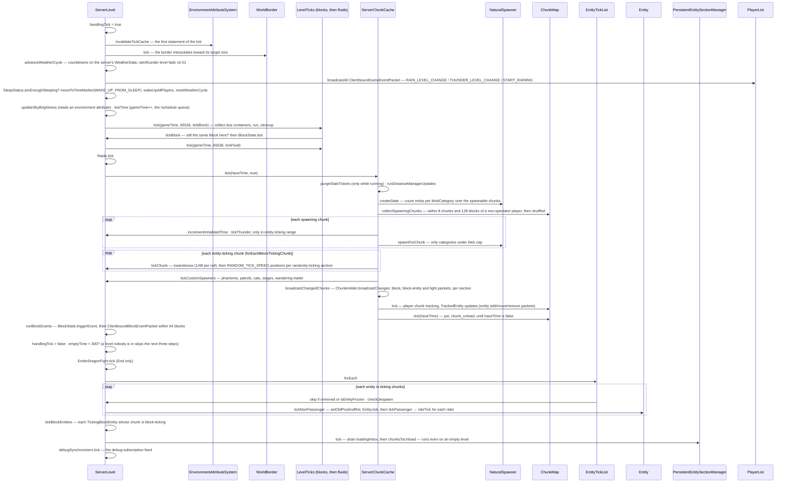

# The level tick

> Verified against **Minecraft 26.2** · Part III · One tick of one `ServerLevel`, from the world border to the last entity, and the queued-up packets it leaves behind.

## Responsibility

`ServerLevel.tick` is where the world actually changes. The server tick
([previous page](server-tick.md)) is scheduling; the level tick is content:
weather advances, scheduled block and fluid ticks fire, raids progress,
chunks near players get random ticks and mob spawns, every entity in range
runs its `Entity.tick`, block entities run their tickers, and the block
changes that all of that produced are batched up for the clients. Each
dimension is its own `ServerLevel` and gets its own call, overworld first.

The one sentence a player recognises: *crops grow, mobs spawn, water flows
and the rain starts — all inside this one method, twenty times a second.*

## The data it owns

- `ServerLevel` holds the per-dimension tick state: `ServerLevel.blockTicks`
  and `ServerLevel.fluidTicks` (two `LevelTicks`, the scheduled-tick queues
  — one `LevelChunkTicks` per loaded chunk, gathered on demand);
  `ServerLevel.blockEvents` (an ordered, de-duplicating set of
  `BlockEventData` — note-block plays, piston pushes, chest lid counts — for
  this tick); `ServerLevel.entityTickList` (an `EntityTickList`: every entity
  whose chunk is in ticking state, keyed by entity id);
  `ServerLevel.entityManager` (the `PersistentEntitySectionManager` that
  decides which entities are in that list); `ServerLevel.raids`;
  `ServerLevel.dragonFight` (an `EnderDragonFight`, End only);
  `ServerLevel.sleepStatus`; `ServerLevel.customSpawners` (the overworld's
  `PhantomSpawner`, `PatrolSpawner`, `CatSpawner`, `VillageSiege`,
  `WanderingTraderSpawner`); `ServerLevel.emptyTime`; and the flag
  `ServerLevel.handlingTick`, which is true from the world border to the block
  events and false again *before* the entity loop. Its one reader in the whole
  game is `PistonBaseBlock`, which uses it to tell a piston update raised
  inside the tick from one raised outside it.
- Two things a 1.21 reader expects here have **left the level**. Day time is
  a set of `WorldClock`s owned by `ServerClockManager` (server-wide saved
  data, ticked from `MinecraftServer.tickChildren`); `ServerLevel.tickTime`
  only advances *gameTime* (and only in the overworld) and runs the timer
  queue. Weather is one `WeatherData` saved-data object owned by the
  *server* — `ServerLevel.getWeatherData` delegates to the `MinecraftServer`
  — and every level that `Level.canHaveWeather` advances the same countdowns; the
  only per-level part is the `Level.rainLevel`/`Level.thunderLevel` fade.
- `ServerChunkCache` (the level's chunk source; the rest of it is [Part IV](../world/tickets-and-loading.md))
  owns the chunk-ticking half: `ServerChunkCache.spawningChunks`,
  `ServerChunkCache.lastSpawnState` (a `NaturalSpawner.SpawnState`, the mob
  counts the debug screen shows) and `ServerChunkCache.chunkHoldersToBroadcast`
  (every `ChunkHolder` with a pending block or light change).
- The random-tick *position* does not come from `Level.random`.
  `Level.getBlockRandomPos` advances `Level.randValue`, a plain LCG, and packs
  x, y and z out of one int. Everything the block then does with that position
  — the crop-growth roll, fire spread, `BlockBehaviour.BlockStateBase.randomTick`
  in general — takes `Level.random`, which is also what the ice/snow and
  lightning rolls and the spawning-chunk shuffle use.
- Inherited from `Level`: `Level.blockEntityTickers` with its
  `Level.pendingBlockEntityTickers` side list and the
  `Level.tickingBlockEntities` guard, so a block entity created mid-tick
  (a chest a piston just pushed) waits a tick.

## When it runs

On the *Server thread*, once per level per server tick, from
`MinecraftServer.tickChildren` under the *levels* profiler section, wrapped
in a `CrashReport` titled "Exception ticking world". The `BooleanSupplier`
it receives is the server's `MinecraftServer.haveTime`; the level itself
does not check it — it hands it to `ServerChunkCache.tick`, which passes it
to `ChunkMap.tick` for chunk unloading, the one time-sliced piece.

Everything below runs to completion on this thread, but several of the
structures it reads are filled from others: `PersistentEntitySectionManager.loadingInbox`
is a concurrent queue that chunk storage fills with entities loaded on IO
threads and the level drains here; `ServerChunkCache.onLightUpdate` is called
from the lighting executor and posts onto the chunk source's main-thread
queue, which is what puts holders into `ServerChunkCache.chunkHoldersToBroadcast`;
and chunk-status promotions arrive as tasks completed onto that same queue.

`TickRateManager.runsNormally` — false while `/tick freeze` is on and no
step is pending — gates most of the steps below individually. The
`ServerChunkCache.tick` call is *not* gated, which is why a frozen world
still loads and unloads chunks and still sends block updates. Inside it,
however, `TicketStorage.purgeStaleTickets` **is** gated, so a frozen world
also stops expiring its tickets.

## The trace: one tick of one level

Narrated:

1. **The environment cache is dropped first.** Before the border, before
   anything, `ServerLevel.handlingTick` goes true and
   `EnvironmentAttributeSystem.invalidateTickCache` throws away last tick's
   resolved environment attributes. That is the layer
   (`world/attribute`) that replaced the old per-dimension and per-biome
   constants; `Level.updateSkyBrightness` later in the tick reads
   `EnvironmentAttributes.SKY_LIGHT_LEVEL` out of it rather than deriving sky
   light from the day time itself. `ServerClockManager` invalidates the same
   cache on every level whenever a clock moves.
2. **Border and weather, if running.** `WorldBorder.tick` moves the
   interpolated extent. `ServerLevel.advanceWeatherCycle` counts down the
   clear/rain/thunder timers on the shared `WeatherData` — the ranges are the
   constants `ServerLevel.RAIN_DELAY`, `ServerLevel.RAIN_DURATION`,
   `ServerLevel.THUNDER_DELAY` and `ServerLevel.THUNDER_DURATION` — under
   `GameRules.ADVANCE_WEATHER`, and fades the two float levels by 0.01 per
   tick, so a rain start is a five-second ramp. Every change is a
   `ClientboundGameEventPacket`: the level packets
   (`ClientboundGameEventPacket.RAIN_LEVEL_CHANGE` and
   `ClientboundGameEventPacket.THUNDER_LEVEL_CHANGE`) go to this dimension's
   players, the start/stop packets go to *every* player in every dimension.
3. **Sleep — which is not gated by the freeze.** `SleepStatus.areEnoughSleeping`
   (against `GameRules.PLAYERS_SLEEPING_PERCENTAGE`) and
   `SleepStatus.areEnoughDeepSleeping` decide the skip; if
   `GameRules.ADVANCE_TIME` is on and the dimension has a default clock,
   `ServerClockManager.moveToTimeMarker` jumps it to
   `ClockTimeMarkers.WAKE_UP_FROM_SLEEP`; `ServerLevel.wakeUpAllPlayers`
   and, if `GameRules.ADVANCE_WEATHER`, `ServerLevel.resetWeatherCycle`.
   The clock move is what sends the `ClientboundSetTimePacket` — the level
   does not send time itself. `Level.updateSkyBrightness` runs unconditionally
   too; only `ServerLevel.tickTime` is behind the freeze gate.
4. **Scheduled ticks.** `LevelTicks.tick` is called twice — blocks, then
   fluids — with *gameTime* and a budget of
   `ServerLevel.MAX_SCHEDULED_TICKS_PER_TICK` (65536) each, and skipped
   entirely in a debug world. It collects every `LevelChunkTicks` container
   whose next `ScheduledTick` is due and whose chunk passes
   `ServerLevel.isPositionTickingWithEntitiesLoaded`, then drains them in
   `ScheduledTick.INTRA_TICK_DRAIN_ORDER` — `TickPriority`, then submission
   order, with no time term, because a container is only collected once its
   head is already due (`ScheduledTick.DRAIN_ORDER`, which does compare
   times, orders each chunk's own queue). Each drained tick calls back
   `ServerLevel.tickBlock` / `ServerLevel.tickFluid` — which check the block
   is *still* the scheduled `Block` before
   `BlockBehaviour.BlockStateBase.tick` runs. A replaced block's pending tick
   silently evaporates. Part IV's [block-ticks-and-fluids](../world/block-ticks-and-fluids.md)
   page has the queue itself.
5. **Raids**, then **the chunk source.** `ServerChunkCache.tick` first purges
   stale tickets — but only while `TickRateManager.runsNormally`, so a frozen
   world never expires one — and runs `DistanceManager` updates (chunks change
   ticking state here, so the reason an entity starts or stops ticking is
   decided *before* entities tick). Then, if running and not a debug world,
   `ServerChunkCache.tickChunks`.
6. **Two chunk sets, two jobs.** `NaturalSpawner.createState` counts every
   mob by `MobCategory` across `DistanceManager.getNaturalSpawnChunkCount`
   chunks; a category may spawn only while its count is under
   `MobCategory.getMaxInstancesPerChunk` × spawnable chunks ÷ 289
   (`NaturalSpawner.MAGIC_NUMBER`, 17²) — the mob cap. `LocalMobCapCalculator`
   then applies a *different*, unscaled test per player: the raw
   `MobCategory.getMaxInstancesPerChunk` within that player's own view.
   Persistent categories (animals) are only considered every 400 ticks, and
   the whole spawning half is behind `GameRules.SPAWN_MOBS`.
   `ChunkMap.collectSpawningChunks` gathers the **spawning chunks** — loaded
   to ticking status and within 8 chunks *and* 128 blocks
   (`ChunkMap.playerIsCloseEnoughForSpawning`) of some player, spectators not
   counting — shuffles them, and each gets its inhabited time bumped, then
   `ServerLevel.tickThunder` *if the chunk is also in entity-ticking range*
   (a 1-in-100000 roll per chunk per tick while raining and thundering; the
   bolt prefers a lightning rod, then a mob that can see the sky, then the
   heightmap; a trap skeleton horse rides in with *effective difficulty* × 1 %
   odds) and `NaturalSpawner.spawnForChunk` if
   `ServerLevel.canSpawnEntitiesInChunk`. Separately
   `ChunkMap.forEachBlockTickingChunk` — which, despite the name, walks the
   *entity*-ticking set — gives each chunk `ServerLevel.tickChunk`:
   *tickSpeed* rolls of 1/48 for ice and snow (`Biome.shouldFreeze`,
   `Biome.shouldSnow`, snow capped by
   `GameRules.MAX_SNOW_ACCUMULATION_HEIGHT`), then
   `GameRules.RANDOM_TICK_SPEED` (default 3) random positions in every
   `LevelChunkSection` that `LevelChunkSection.isRandomlyTicking` — each
   position rolling both `BlockBehaviour.BlockStateBase.randomTick` and the
   fluid's, and a section with nothing that random-ticks costing nothing.
7. **Custom spawners, then the broadcast, then tracking.**
   `ServerLevel.tickCustomSpawners` runs the list above. Three of the five
   have a rule of their own (`GameRules.SPAWN_PHANTOMS`,
   `GameRules.SPAWN_PATROLS`, `GameRules.SPAWN_WANDERING_TRADERS`);
   `CatSpawner` and `VillageSiege` have none, and the whole call sits behind
   `GameRules.SPAWN_MOBS`. Then — and this is the ordering the diagram is
   worth reading twice for — `ServerChunkCache.broadcastChangedChunks` runs
   **before** `ChunkMap.tick`, so block changes are queued ahead of the entity
   movement produced by the same tick.
8. **Block and light changes leave once.** `ServerLevel.sendBlockUpdated`
   never sends a packet; it calls `ServerChunkCache.blockChanged`, which
   marks the `ChunkHolder`. `ServerChunkCache.broadcastChangedChunks` walks
   `ServerChunkCache.chunkHoldersToBroadcast` and `ChunkHolder.broadcastChanges`
   emits, **per 16³ section**, one `ClientboundBlockUpdatePacket` when that
   section had a single change and one `ClientboundSectionBlocksUpdatePacket`
   when it had several — plus a `BlockEntity.getUpdatePacket` for any changed
   position that carries a block entity, and `ClientboundLightUpdatePacket`
   for light. Block updates go to everyone tracking the chunk; light goes only
   to players on the *border* of their tracked area. A hundred blocks changed
   by one command are one packet per affected section, not one packet.
   This all happens **before** entities tick, so an entity's own block changes
   are seen by clients one tick later.
9. **Tracking, then unloads.** `ChunkMap.tick` (the no-argument one) updates
   every player's chunk tracking and every `ChunkMap.TrackedEntity` — the
   entity add/move/remove packets for everything that moved last tick go out
   here, to whoever is in range. Then `ChunkMap.tick` with the supplier: POI
   saving and *chunk_unload* until `MinecraftServer.haveTime` says stop. It is
   the only step in the level tick that yields to the clock — though not
   entirely, since `ChunkMap.processUnloads` force-drains anything over two
   thousand queued unloads regardless of the budget.
10. **Block events.** `ServerLevel.runBlockEvents` drains `ServerLevel.blockEvents`
    completely, calling `BlockBehaviour.BlockStateBase.triggerEvent` — after
    re-checking that the block at the position is still the one the event was
    raised for, the same promise a scheduled tick makes — and, when it returns
    true, broadcasting a `ClientboundBlockEventPacket` to players within 64
    blocks. Events for chunks outside block-ticking range are re-queued
    (`ServerLevel.blockEventsToReschedule`) rather than dropped. Because the
    set is a linked hash set, two identical events in one tick collapse to
    one. `ServerLevel.handlingTick` goes false here, so the entity half of the
    tick runs outside that window.
11. **The empty check.** `ServerChunkCache.hasActiveTickets` resets
    `ServerLevel.emptyTime`; otherwise it counts — but only while running, so
    a frozen level never goes to sleep — and past
    `ServerLevel.EMPTY_TIME_NO_TICK` (300) the level skips exactly three
    things: the dragon fight, the entity loop and the block entities.
    Everything after them still runs.
12. **Entities.** After `EnderDragonFight.tick` in the End,
    `EntityTickList.forEach` runs the loop. Per entity: skip if removed;
    skip if `TickRateManager.isEntityFrozen` (frozen, and not a player or
    a player's mount); `Entity.checkDespawn`; then tick only if it is a
    `ServerPlayer` **or** its chunk is in `DistanceManager.inEntityTickingRange`.
    Inside that branch, a passenger whose vehicle is alive and still lists it
    is skipped and ticked by the vehicle instead (a stale link is broken with
    `Entity.stopRiding`). `ServerLevel.tickNonPassenger` records the old
    position, bumps `Entity.tickCount`, calls `Entity.tick`, then
    `ServerLevel.tickPassenger` → `Entity.rideTick` for each rider that is
    itself a `Player` or in the tick list, recursively. `Level.guardEntityTick`
    wraps each in a crash report titled "Ticking entity".
13. **Block entities, then the two steps nothing skips.**
    `Level.tickBlockEntities` runs every `TickingBlockEntity` whose position
    passes `Level.shouldTickBlocksAt` (block-ticking range, not entity range),
    is itself behind the freeze gate, and is where removed tickers are pruned
    from `Level.blockEntityTickers`. Outside the empty-level guard,
    `PersistentEntitySectionManager.tick` then drains the
    `PersistentEntitySectionManager.loadingInbox` — entities from freshly
    loaded chunks appear in the world now — and processes
    `PersistentEntitySectionManager.chunksToUnload`; the
    `ServerLevel.EntityCallbacks` it fires
    (`ServerLevel.EntityCallbacks.onTickingStart`,
    `ServerLevel.EntityCallbacks.onTickingEnd`) are what add and remove
    entries in `ServerLevel.entityTickList`. Last of all,
    `LevelDebugSynchronizers.tick` pushes this tick's neighbour updates,
    brains, paths and POIs to any client subscribed through
    `DebugSubscriptions` — the one part of the level tick whose only output is
    a debug feed.

## Interfaces

- **Called by:** `MinecraftServer.tickChildren`, only.
- **Calls into:** `LevelTicks` and `BlockBehaviour.BlockStateBase.tick` (Parts IV and V),
  `ServerChunkCache` / `ChunkMap` / `DistanceManager` (Part IV),
  `NaturalSpawner` and `Entity.tick` (Part VI), `TickingBlockEntity`
  ([block entities](../blocks/block-entities.md)), `Raids`, `EnderDragonFight`, `ServerClockManager`.
- **Crosses the network as:** `ClientboundGameEventPacket` (weather, from
  `ServerLevel.advanceWeatherCycle`); `ClientboundBlockUpdatePacket` /
  `ClientboundSectionBlocksUpdatePacket` / `ClientboundLightUpdatePacket`
  (from `ChunkHolder.broadcastChanges`, per section, along with each changed
  block entity's `BlockEntity.getUpdatePacket`); `ClientboundBlockEventPacket`
  (from `ServerLevel.runBlockEvents`); `ClientboundSetTimePacket` (from the clock
  manager, not the level); entity packets from `ChunkMap.TrackedEntity`
  ([what the client is told](../networking/what-the-client-is-told.md)). All of them are queued behind the connection's suspended flush
  and leave at the end of the server tick.
- **Data-driven by:** the game rules named above (`GameRules` now lives in
  `world/level/gamerules`; there is no *DO_DAYLIGHT_CYCLE* or
  *DO_MOB_SPAWNING* — they are `GameRules.ADVANCE_TIME` and `GameRules.SPAWN_MOBS`); `Biome`
  for precipitation; `MobCategory` for the caps; the dimension type's
  default clock for whether sleeping does anything.

## Invariants and surprises

- **The entity loop's stable view is `EntityTickList`'s doing, not the tick
  order's.** Membership changes *during* the loop — a spawner's mob, a fired
  arrow, a lightning bolt — go through
  `ServerLevel.EntityCallbacks.onTickingStart` and land in the list
  immediately. What makes the iteration safe is `EntityTickList` itself: it
  allows exactly one `EntityTickList.forEach` at a time and swaps its
  `EntityTickList.active` / `EntityTickList.passive` maps on a mid-iteration
  add or remove, so the running loop keeps the old view and the new entity
  waits for the next tick.
- **Players always tick, and it is decided twice.** `Player.isAlwaysTicking`
  is what keeps a player in `ServerLevel.entityTickList` no matter what its
  chunk is doing — `PersistentEntitySectionManager` never stops ticking it;
  the `ServerPlayer` check inside the loop is the second, redundant guard. A
  mob in a chunk that is loaded but only `FullChunkStatus.BLOCK_TICKING` is
  not in the list at all, so it neither moves nor despawn-checks —
  `Visibility.fromFullChunkStatus` maps only `FullChunkStatus.ENTITY_TICKING`
  to a ticking visibility.
- **Block entities follow block-ticking range; entities follow entity-ticking
  range.** Two different `ChunkLevel` thresholds
  (`ChunkLevel.BLOCK_TICKING_LEVEL` 32, `ChunkLevel.ENTITY_TICKING_LEVEL` 31);
  a furnace keeps smelting one chunk further out than a zombie keeps walking.
- **Random ticks are per section, and cheap sections are free.**
  `LevelChunkSection.isRandomlyTicking` is a counter maintained on every
  block change; a section of stone is skipped outright.
- **Freezing the game barely touches the chunk system.** Distance updates,
  the block-change broadcast, entity tracking and unloads run every tick
  regardless of `TickRateManager.runsNormally`. Two things inside the chunk
  source *are* gated, and they are easy to miss:
  `ServerChunkCache.tickChunks` (spawning and random ticks) and
  `TicketStorage.purgeStaleTickets` — so a frozen world holds on to expired
  tickets indefinitely.
- **A block's scheduled tick is a promise to *that block*.** `ServerLevel.tickBlock`
  compares the `Block` at the position with the one scheduled; mismatch
  means nothing runs. This is why replacing a block cancels its pending
  ticks without any explicit cancellation.
- **Weather timers are shared by every dimension.** One `WeatherData`;
  `/weather` in the Nether changes the overworld's rain. Only levels whose
  dimension `Level.canHaveWeather` act on it.
- **Two `ServerLevel` tick counters that are not time.** *gameTime*
  advances only in the overworld (`ServerLevel.tickTime`), and the other
  levels read the overworld's; day time is not here at all. The `/schedule`
  queue rides on the same call — a server-wide `TimerQueue` owned by
  `MinecraftServer` but advanced by the overworld's tick, so a scheduled
  function is timed off overworld *gameTime*.
- **An empty dimension is not a stopped one.** Past
  `ServerLevel.EMPTY_TIME_NO_TICK` the level skips the dragon fight, the
  entity loop and the block entities — and nothing else. Weather, scheduled
  ticks, the chunk source, block events, the entity manager's load/unload
  drain and the debug feed all keep running.
- **The debug feed is part of the tick.** `LevelDebugSynchronizers` runs
  last, outside every gate, and pushes server-side state — neighbour updates,
  brains, paths, POIs — to clients that subscribed through
  `DebugSubscriptions`. It is the only step whose entire output is
  diagnostic.

## Where to look

`ServerLevel.tick` · `ServerLevel.tickChunk` · `ServerLevel.tickThunder` ·
`ServerLevel.runBlockEvents` · `ServerLevel.tickNonPassenger` ·
`ServerChunkCache.tick` · `ServerChunkCache.tickChunks` ·
`ServerChunkCache.broadcastChangedChunks` · `ChunkMap.collectSpawningChunks` ·
`ChunkMap.forEachBlockTickingChunk` · `ChunkMap.tick` · `DistanceManager` · `LevelTicks` ·
`NaturalSpawner` · `EntityTickList` · `PersistentEntitySectionManager` ·
`Level` (`Level.tickBlockEntities`, `Level.getBlockRandomPos`) · `WeatherData` ·
`ServerClockManager` · `SleepStatus` · `ChunkHolder.broadcastChanges` ·
`EnvironmentAttributeSystem` · `LevelDebugSynchronizers` · `LocalMobCapCalculator`

---

*Rules: names, never code · how the system works, not how the code reads ·
newest version only · every backticked name passes `tools/verify_names.py`.*
