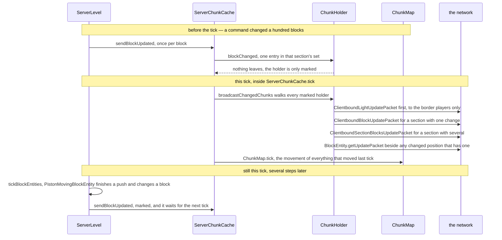

# The level tick

> Verified against **Minecraft 26.2** · Part III · A player stands still for one twentieth of a second while a whole dimension advances — weather, scheduled ticks, spawns, every entity, every block entity.

Nobody moves. A wheat crop is one random tick short of ripe, a creeper is
walking a fence line, rain has been falling for four minutes and a piston
somewhere is halfway through extending. Then `ServerLevel.tick` runs, once,
for this dimension, and all of it advances: the border interpolates, the
weather counts down, the scheduled block ticks fire, mobs are counted and
spawned, chunks near players get their random ticks, every entity in range
runs its `Entity.tick`, block entities run their tickers, and the block
changes that all of that produced are handed to the clients. It is one
method on the Server thread, called once per dimension from
`MinecraftServer.tickChildren` ([the server tick](server-tick.md)), overworld
first. The order inside it is the whole lecture, because one of the steps is
in a place nobody expects: **the block-change broadcast runs before the
entities tick**. `ServerChunkCache.broadcastChangedChunks` comes before
`ChunkMap.tick` and long before `EntityTickList.forEach`, so a block a
command changed reaches your screen this tick and a block a piston changed
reaches it on the next one.

## Three ranges, before we need them

Three phrases run through everything below and they are all one number line.
A chunk is *loaded* when it has a `ChunkHolder` at all; it is
**block-ticking** at level 32 or below (`ChunkLevel.BLOCK_TICKING_LEVEL`) and
**entity-ticking** at 31 or below (`ChunkLevel.ENTITY_TICKING_LEVEL`), and
those last two answers come from the simulation graph, through
`DistanceManager.inBlockTickingRange` and
`DistanceManager.inEntityTickingRange`. How a chunk gets its level — which
tickets put it there and which graph they feed — is Part IV's
[tickets and loading](../world/tickets-and-loading.md); for this page it is
enough that block-ticking reaches one chunk further out than entity-ticking,
and that both are decided fresh, inside this tick, before anything ticks.

## The cast

| class | what it decides | thread |
|---|---|---|
| `ServerLevel` | the order of the tick, and every gate in it — one instance per dimension | Server |
| `ServerChunkCache` | the chunk half of the tick: ticket purging, distance updates, spawning, random ticks, the broadcast | Server |
| `ChunkMap` | which chunks are candidates for spawning, which are entity-ticking, and every player's view of every entity | Server |
| `ChunkHolder` | one chunk's pending block and light changes, and which packet shape they become | Server |
| `LevelTicks` | the two scheduled-tick queues, one `LevelChunkTicks` per chunk, drained by priority | Server |
| `EntityTickList` | which entities are ticked, and a stable view of that set while it is being walked | Server |
| `PersistentEntitySectionManager` | which entities exist and which of them are ticking — the tick list's only editor | Server; its inbox is filled by IO threads |
| `TickRateManager` | whether this is a normal tick at all, through `TickRateManager.runsNormally` | Server |

## The whole tick, and its three gates

The tick is one method calling its own private methods, so its shape is not
a conversation — it is a column with guards down the side. There are three
guards, and every step is behind one of them, a combination of them, or
nothing: *running* (`TickRateManager.runsNormally`, false while
`/tick freeze` holds and no step is pending), *not a debug world*
(`Level.isDebug`), and *the dimension is not empty* (`ServerLevel.emptyTime`
below `ServerLevel.EMPTY_TIME_NO_TICK`, 300).

```mermaid
flowchart TD
    START["MinecraftServer.tickChildren calls ServerLevel.tick, overworld first"]
    ENV["handlingTick goes true, EnvironmentAttributeSystem.invalidateTickCache — no gate"]
    WB["WorldBorder.tick, then advanceWeatherCycle and its game-event packets — running"]
    SLEEP["the sleep check: move the clock, wake the players, reset the weather — no gate"]
    SKY["Level.updateSkyBrightness, read out of the environment attributes — no gate"]
    TIME["ServerLevel.tickTime: gameTime and the schedule queue, overworld only — running"]
    SCHED["ServerLevel.blockTicks then ServerLevel.fluidTicks, 65536 apiece — running, and not a debug world"]
    RAID["Raids.tick — running"]
    SCC["ServerChunkCache.tick, handed the server's time budget — no gate"]
    PURGE["TicketStorage.purgeStaleTickets — running"]
    DIST["ServerChunkCache.runDistanceManagerUpdates: which chunks tick is settled here — no gate"]
    CHUNKS["mob counts, spawning chunks, thunder, spawns, random ticks, custom spawners — running, and not a debug world"]
    CAST["ServerChunkCache.broadcastChangedChunks: block, block-entity and light packets — not a debug world"]
    TRACK["ChunkMap.tick: chunk tracking, and the movement of everything that moved last tick — no gate"]
    UNLOAD["ChunkMap.tick with haveTime: POI saving and chunk unloads, until the budget is spent — no gate"]
    EVENTS["ServerLevel.runBlockEvents, then handlingTick goes false — running"]
    EMPTY["hasActiveTickets resets emptyTime, otherwise it rises — and it rises only while running"]
    DRAGON["EnderDragonFight.tick, the End only — running, and the dimension is not empty"]
    ENT["EntityTickList.forEach: each entity, then its riders — the dimension is not empty"]
    BE["Level.tickBlockEntities — the dimension is not empty, and each ticker fires only while running"]
    EM["PersistentEntitySectionManager.tick: the loading inbox, then the unload set — no gate"]
    DBG["LevelDebugSynchronizers.tick — no gate"]
    START --> ENV --> WB --> SLEEP --> SKY --> TIME --> SCHED --> RAID --> SCC
    SCC --> PURGE --> DIST --> CHUNKS --> CAST --> TRACK --> UNLOAD
    UNLOAD --> EVENTS --> EMPTY --> DRAGON --> ENT --> BE --> EM --> DBG
```

Read the gates and most of the page's surprises fall out of the figure.
Sleeping through the night works with the game frozen. A frozen world still
loads, sends and unloads chunks — and stops expiring its tickets. A debug
world keeps its entities and drops its block updates. And the last two steps
run on a dimension with nobody in it.

## The cache that is dropped before the border

The first thing the tick does to the world, before the border and before
the weather, is `EnvironmentAttributeSystem.invalidateTickCache`: last tick's
resolved environment attributes are thrown away. That system
([environment attributes](../world/environment-attributes-and-timelines.md))
is where the old per-dimension and per-biome constants went, and
`Level.updateSkyBrightness` later in this same tick reads
`EnvironmentAttributes.SKY_LIGHT_LEVEL` out of it rather than deriving sky
light from the time of day. `ServerClockManager` invalidates the same cache
on every level whenever a clock moves, so the level is not its only owner —
it is the first reader of the tick, and it starts clean.

Then `WorldBorder.tick` advances the interpolated extent, and
`ServerLevel.advanceWeatherCycle` counts the clear, rain and thunder timers
down under `GameRules.ADVANCE_WEATHER`, resampling each from
`ServerLevel.RAIN_DELAY`, `ServerLevel.RAIN_DURATION`,
`ServerLevel.THUNDER_DELAY` and `ServerLevel.THUNDER_DURATION` as it
expires, and fading `Level.rainLevel` and `Level.thunderLevel` by 0.01 a
tick, which is why a downpour arrives as a five-second ramp. The countdowns
belong to the *server*: `ServerLevel.getWeatherData` delegates to
`MinecraftServer.getWeatherData`, one `WeatherData` shared by every
dimension, and the only per-level parts are those two floats and the
`Level.canHaveWeather` test that decides whether this dimension acts on any
of it. Every move of a float is a `ClientboundGameEventPacket`
(`ClientboundGameEventPacket.RAIN_LEVEL_CHANGE`,
`ClientboundGameEventPacket.THUNDER_LEVEL_CHANGE`) to this dimension's
players, and a start or a stop goes to every player in every dimension.

## Sleeping is the one thing a freeze cannot stop

`SleepStatus.areEnoughSleeping` and `SleepStatus.areEnoughDeepSleeping`
(against `GameRules.PLAYERS_SLEEPING_PERCENTAGE`) decide the night skip, and
they are checked outside every gate. If the dimension type has a default
clock and `GameRules.ADVANCE_TIME` is on,
`ServerClockManager.moveToTimeMarker` jumps that clock to
`ClockTimeMarkers.WAKE_UP_FROM_SLEEP`; `ServerLevel.wakeUpAllPlayers` gets
everyone out of bed, and `ServerLevel.resetWeatherCycle` clears the storm.
The `ClientboundSetTimePacket` that follows is sent by the clock manager,
not by the level — day time is not the level's state in 26.2 at all.

What the level does own is *gameTime*, and only in the overworld:
`ServerLevel.tickTime` advances it when the level was built with its
`ServerLevel.tickTime` flag set, which `MinecraftServer` does for the
overworld alone, and every other dimension reads that number. The same call
advances the server-wide `TimerQueue` behind `/schedule`
(`MinecraftServer.getScheduledEvents`), so a scheduled function is timed off
overworld *gameTime* and stands still while the world is frozen.

## Scheduled ticks, twice, and a promise to the same block

`LevelTicks.tick` is called twice — `ServerLevel.blockTicks`, then
`ServerLevel.fluidTicks` — each with the current *gameTime* and a budget of
`ServerLevel.MAX_SCHEDULED_TICKS_PER_TICK`, 65536, and both skipped entirely
in a debug world. Each call collects every `LevelChunkTicks` container whose
head is due and whose chunk passes
`ServerLevel.isPositionTickingWithEntitiesLoaded`, drains them in
`ScheduledTick.INTRA_TICK_DRAIN_ORDER` — priority, then submission order,
with no time term, because a container is only collected once its head is
already due, and `ScheduledTick.DRAIN_ORDER`, which does compare times,
orders each chunk's own queue — and hands each drained tick to
`ServerLevel.tickBlock` or `ServerLevel.tickFluid`.

Both of those check that what is at the position is *still* what the tick was
scheduled for: `ServerLevel.tickBlock` the `Block`, before
`BlockBehaviour.BlockStateBase.tick`; `ServerLevel.tickFluid` the `Fluid`,
before `FluidState.tick`.
That check is the whole cancellation mechanism: replace a block and its
pending ticks evaporate, with nothing anywhere removing them. The queue
itself, and what schedules into it, is
[scheduled ticks](../world/scheduled-ticks.md).

## The chunk source does five things in one call

`ServerChunkCache.tick` receives the server's `MinecraftServer.haveTime`
supplier — the level never looks at it, it only passes it on — and does five
things in order.

It purges stale tickets, but only while running, so a frozen world holds on
to expired portal and pearl tickets indefinitely. It runs
`ServerChunkCache.runDistanceManagerUpdates`, ungated, which is where chunks
change ticking state: the reason an entity starts or stops ticking this tick
is decided here, several steps before the entity loop reads it. Then, if
this is not a debug world, it does the spawning and random-ticking work
below and broadcasts the block changes; it updates entity tracking; and
finally it spends whatever time is left on POI saving and chunk unloads.

That last step is the only part of the whole level tick that yields to the
clock, and even it does not yield completely: `ChunkMap.processUnloads`
force-drains anything over two thousand queued unloads whatever the budget
says.

### Two chunk sets, and two different mob caps

`NaturalSpawner.createState` walks `ServerLevel.getAllEntities` — every
entity in the dimension, skipping mobs that require persistence — and counts
them per `MobCategory`, using the chunk each one stands in to charge a
spawn-potential field and to feed a `LocalMobCapCalculator`. That count is
then read two different ways. Globally,
`NaturalSpawner.SpawnState.canSpawnForCategoryGlobal` allows a category
while its count is under `MobCategory.getMaxInstancesPerChunk` ×
`DistanceManager.getNaturalSpawnChunkCount` ÷ 289
(`NaturalSpawner.MAGIC_NUMBER`, 17²) — the mob cap everyone argues about.
Locally, `LocalMobCapCalculator.canSpawn` applies the raw, unscaled
`MobCategory.getMaxInstancesPerChunk` per player close enough to the chunk,
so a category can sit well under the server-wide cap and still refuse to
spawn beside one crowded player. Persistent categories — the animals — are
considered only on a tick where *gameTime* divides by 400, and the whole
spawning half is behind `GameRules.SPAWN_MOBS`.

Two chunk sets are then walked, and they are not the same set.
`ChunkMap.collectSpawningChunks` gathers the **spawning chunks**: the
radius-8 tracker's candidates that have a ticking chunk and at least one
non-spectating player within 128 blocks
(`ChunkMap.playerIsCloseEnoughForSpawning`). They are shuffled, and each
then gets `ChunkAccess.incrementInhabitedTime`, then `ServerLevel.tickThunder`
*if it is also entity-ticking* — a 1-in-100000 roll per chunk per tick while
raining and thundering, whose bolt prefers a lightning rod, then a mob that
can see the sky, then the heightmap, and which brings a trap skeleton horse
along at effective difficulty × 1 % — and then
`NaturalSpawner.spawnForChunk` if `ServerLevel.canSpawnEntitiesInChunk`.

The second set is `ChunkMap.forEachBlockTickingChunk`, which despite its
name walks `DistanceManager.forEachEntityTickingChunk` — the entity-ticking
set, level 31 and below. Each of those chunks gets `ServerLevel.tickChunk`.

### Random ticks are counted per section, and empty sections are free

`ServerLevel.tickChunk` does two things with one number,
`GameRules.RANDOM_TICK_SPEED` (default 3). It rolls that many 1-in-48
chances at `ServerLevel.tickPrecipitation` — the ice and snow layer, using
`Biome.shouldFreeze`, `Biome.shouldSnow` and
`GameRules.MAX_SNOW_ACCUMULATION_HEIGHT` — and then, for every
`LevelChunkSection` in the chunk that reports
`LevelChunkSection.isRandomlyTicking`, picks that many random positions and
rolls both `BlockBehaviour.BlockStateBase.randomTick` and the fluid's at
each. `LevelChunkSection.isRandomlyTicking` is a counter maintained on every
block change, so a section of solid stone costs nothing at all: the loop
over sections is a loop over the chunk's *interesting* height. Set the rule
to zero and both halves stop, ice and snow included.

The position itself does not come from `Level.random`.
`Level.getBlockRandomPos` advances `Level.randValue`, a plain linear
congruential generator, and unpacks x, y and z out of one integer.
Everything the block then *does* with that position — the crop-growth roll,
fire spreading, every implementation of
`BlockBehaviour.BlockStateBase.randomTick` — takes `Level.random`, which is
also what the ice and snow rolls, the lightning roll and the spawning-chunk
shuffle use.

The custom spawners come last inside this step.
`ServerLevel.tickCustomSpawners` runs the overworld's `PhantomSpawner`,
`PatrolSpawner`, `CatSpawner`, `VillageSiege` and `WanderingTraderSpawner` —
a list only the overworld is constructed with. Three of the five carry a
game rule of their own (`GameRules.SPAWN_PHANTOMS`,
`GameRules.SPAWN_PATROLS`, `GameRules.SPAWN_WANDERING_TRADERS`); cats and
sieges answer only to `GameRules.SPAWN_MOBS`, which gates the whole call.

### The broadcast, which is why entities are a tick behind

Almost nothing in the game sends a block update at the moment a block
changes — a landing `FallingBlockEntity` is the exception worth knowing, and
it is dealt with at the end of this section.
`ServerLevel.sendBlockUpdated` calls `ServerChunkCache.blockChanged`, which
finds the `ChunkHolder`, records the position in that holder's per-section
set, and — the first time a holder gains a changed section — adds it to
`ServerChunkCache.chunkHoldersToBroadcast`. Then it returns. The packets are
built once, later, in the chunk source's step.

`ChunkHolder.broadcastChanges` asks two different questions of two
different audiences, and it asks the light one first: if either light filter
has anything in it, `ChunkHolder.PlayerProvider.getPlayers` is called with
the border-only flag set and one `ClientboundLightUpdatePacket` goes to the
players on the edge of their tracked area, before a single block packet is
built. The blocks are then emitted **per 16³ section**, to everyone tracking
the chunk, and the shape depends on how many blocks in that section changed: one
`ClientboundBlockUpdatePacket` for a single change, one
`ClientboundSectionBlocksUpdatePacket` for several, plus
`BlockEntity.getUpdatePacket` for any changed position that carries a block
entity. A hundred blocks changed by one command are therefore a handful of
packets, one per affected section — not a hundred.

Then `ChunkMap.tick` runs — chunk tracking for each player, and
`ChunkMap.TrackedEntity` for each entity, which is where
`ServerEntity.sendChanges` turns last tick's movement into packets. Blocks
first, entities second, and the entity loop only after both. The ordering is
visible from a client: a player's `/setblock` lands in the tick the command
was typed in, because a command packet is handled before
`MinecraftServer.tickChildren` even starts, while a piston head lands in the
tick after the one that moved it.

Falling sand is the exception that proves the rule, and it is deliberate.
`FallingBlockEntity` calls `Level.setBlock` and then, on the very next line,
`ChunkMap.sendToTrackingPlayers` with a `ClientboundBlockUpdatePacket` of its
own — so the block the client sees appear is sent in the same tick the entity
that placed it vanished, rather than a tick behind it. A handful of other
places do the same thing to one player rather than to everyone tracking the
chunk. What the client does with all of this is
[what the client is told](../networking/what-the-client-is-told.md).

## Block events close the handlingTick window

`ServerLevel.runBlockEvents` drains `ServerLevel.blockEvents` — the
note-block plays, piston pushes and chest-lid counts raised anywhere in this
tick — completely, calling `BlockBehaviour.BlockStateBase.triggerEvent`
after re-checking that the block at the position is still the one the event
was raised for, the same promise a scheduled tick makes. When the block
returns true, a `ClientboundBlockEventPacket` goes to players within 64
blocks. Because the set is a linked hash set, two identical events in one
tick collapse into one; and an event whose chunk is not block-ticking is
parked on `ServerLevel.blockEventsToReschedule` and re-queued rather than
dropped.

`ServerLevel.handlingTick` went true at the very top of the tick and goes
false here, so the whole entity half runs outside that window. Its one
reader in the game is `PistonBaseBlock`, which uses it to tell a piston
update raised inside the tick from one raised outside it.

## An empty dimension skips exactly three things

`ServerChunkCache.hasActiveTickets` — really
`TicketStorage.shouldKeepDimensionActive`, which is the players' *simulation*
tickets and a handful of others — resets `ServerLevel.emptyTime`. Otherwise
the counter rises, and it rises only while running, so a frozen dimension
never falls asleep. Past `ServerLevel.EMPTY_TIME_NO_TICK`, 300 ticks, the
level skips the dragon fight, the entity loop and the block entities. That
is the entire skip: the weather, the scheduled ticks, the chunk source, the
block events, the entity manager's load and unload drain and the debug feed
all keep running on a dimension nobody has visited for fifteen seconds.

## Every entity, and then its riders

`EntityTickList.forEach` walks the tick list. An entity is skipped if it has
been removed, or if `TickRateManager.isEntityFrozen` says so — frozen, and
neither a player nor something carrying one. Otherwise it gets
`Entity.checkDespawn`, and then ticks only if it is a `ServerPlayer` or its
chunk answers `DistanceManager.inEntityTickingRange`. A passenger whose
vehicle is alive and still lists it is passed over here and ticked by the
vehicle instead; a stale link is broken with `Entity.stopRiding`.
`ServerLevel.tickNonPassenger` records the old position, bumps
`Entity.tickCount` and calls `Entity.tick`, then `ServerLevel.tickPassenger`
runs `Entity.rideTick` for each rider that is a `Player` or in the tick
list, recursively down the stack. `Level.guardEntityTick` wraps each one in
a crash report titled *Ticking entity*, so a mob that throws names itself.

The list stays stable under all of that by construction. Membership changes
during the loop — a spawner's mob, a fired arrow, a lightning bolt — arrive
through `ServerLevel.EntityCallbacks.onTickingStart` immediately.
`EntityTickList` allows exactly one `EntityTickList.forEach` at a time and,
on any add or remove while it is iterating, copies into its
`EntityTickList.passive` map and swaps that with `EntityTickList.active`:
the running loop keeps walking the view it started with, and the new entity
waits for the next tick. Which entities are in the list at all is
`PersistentEntitySectionManager`'s answer, through
`Visibility.fromFullChunkStatus` — only `FullChunkStatus.ENTITY_TICKING`
maps to a ticking visibility — with one override, `Player.isAlwaysTicking`,
which keeps a player ticking whatever its chunk is doing and makes the
`ServerPlayer` test inside the loop a second, redundant guard. Entities are
Part VI's subject: [entity lifecycle](../entities/entity-lifecycle.md).

## Block entities reach one chunk further than mobs

`Level.tickBlockEntities` walks `Level.blockEntityTickers`, dropping removed
tickers as it goes and running the rest — but only those whose position
passes `ServerLevel.shouldTickBlocksAt`, which is the **block**-ticking
range, and only while `TickRateManager.runsNormally`. That single condition
is why a furnace keeps smelting one chunk further out than a zombie keeps
walking. A block entity created mid-tick — a chest a piston just pushed —
lands on `Level.pendingBlockEntityTickers` instead, because
`Level.tickingBlockEntities` is true, and is merged in at the top of the
next tick. [Block entities](../blocks/block-entities.md) has the rest.

## The two steps that always run

`PersistentEntitySectionManager.tick` drains
`PersistentEntitySectionManager.loadingInbox`, a concurrent queue that chunk
storage fills from IO threads — entities from freshly loaded chunks join the
world here — and then processes
`PersistentEntitySectionManager.chunksToUnload`. The
`ServerLevel.EntityCallbacks` it fires
(`ServerLevel.EntityCallbacks.onTickingStart`,
`ServerLevel.EntityCallbacks.onTickingEnd`) are exactly what add and remove
entries in the tick list the previous step walked.

Last, `LevelDebugSynchronizers.tick` pushes this tick's neighbour updates,
brains, paths, POIs and raids to any client subscribed through
`DebugSubscriptions` — and, just before it, arms or clears the neighbour
listener on `CollectingNeighborUpdater` depending on whether anyone is
subscribed to `DebugSubscriptions.NEIGHBOR_UPDATES` at all. It is the one
step of the level tick whose entire output is diagnostic, and it is outside
every gate.

## What leaves the level, and when

| the packet | the step that sends it | to whom |
|---|---|---|
| `ClientboundGameEventPacket`, rain and thunder levels | `ServerLevel.advanceWeatherCycle` | this dimension's players |
| `ClientboundGameEventPacket`, start and stop raining | the same step, on a transition | every player in every dimension |
| `ClientboundSetTimePacket` | `ServerClockManager.moveToTimeMarker`, from the sleep skip | everyone, sent by the clock manager |
| `ClientboundBlockUpdatePacket` · `ClientboundSectionBlocksUpdatePacket` | `ChunkHolder.broadcastChanges`, per 16³ section | everyone tracking the chunk |
| `BlockEntity.getUpdatePacket` | the same walk, beside a changed position that has one | everyone tracking the chunk |
| `ClientboundLightUpdatePacket` | the same walk, before the blocks | the players on their tracked area's border |
| entity add, move and remove | `ChunkMap.TrackedEntity`, inside `ChunkMap.tick` | whoever tracks that entity |
| `ClientboundBlockEventPacket` | `ServerLevel.runBlockEvents` | players within 64 blocks |

None of them go out when they are written. Every one is queued behind the
suspended flush that `MinecraftServer.tickChildren` opens around all the
levels, and leaves on the wire at the end of the server tick
([the server tick](server-tick.md)).

## Questions players ask

**Does `/tick freeze` stop the server doing work?** Barely, on the chunk
side. Distance updates, the block-change broadcast, entity tracking and
chunk unloads all run every tick regardless. Two things inside the chunk
source *are* frozen and are easy to miss: the spawning and random-ticking
step, and `TicketStorage.purgeStaleTickets` — so a frozen world accumulates
expired tickets and never releases the chunks they hold.

**Why does my furnace keep going after the mobs around it stop?** Two
thresholds, one chunk apart. Block entities are gated on block-ticking range
(`ChunkLevel.BLOCK_TICKING_LEVEL`, 32) and entities on entity-ticking range
(`ChunkLevel.ENTITY_TICKING_LEVEL`, 31), and a chunk on the boundary is in
one and not the other.

**Why did replacing a block cancel its scheduled tick?** Because a scheduled
tick is a promise to *that* block: `ServerLevel.tickBlock` compares the
`Block` at the position with the one scheduled, and a mismatch runs nothing.

**Why does `/weather rain` in the Nether change the overworld?** There is one
`WeatherData` on the `MinecraftServer` and every dimension advances the same
countdowns. Only the fade of `Level.rainLevel` and `Level.thunderLevel` is
per level, and only where `Level.canHaveWeather`.

**Why does a mob that spawns this tick not move until the next one?**
`EntityTickList` swapped its maps the moment the mob was added, so the loop
that is running kept the view it started with. The mob is in the list — it
is just not in *this* walk of it.

**Why is a dimension with nobody in it still burning CPU?** Because going
empty skips three things and nothing else: past 300 ticks with no active
ticket the dragon fight, the entity loop and the block entities stop, and
the weather, scheduled ticks, chunk source, block events and entity manager
carry on.

**Where did the day–night cycle go?** Out of the level. Time is a set of
`WorldClock`s owned by `ServerClockManager` and ticked by the server;
`ServerLevel.tickTime` advances *gameTime* only, only in the overworld, and
every other dimension reads the overworld's number.

## Where to look

`ServerLevel.tick` · `ServerLevel.advanceWeatherCycle` · `ServerLevel.tickTime` ·
`ServerLevel.tickBlock` · `ServerLevel.tickChunk` · `ServerLevel.tickThunder` ·
`ServerLevel.tickCustomSpawners` · `ServerLevel.runBlockEvents` ·
`ServerLevel.tickNonPassenger` · `ServerLevel.tickPassenger` ·
`ServerChunkCache.tick` · `ServerChunkCache.tickChunks` ·
`ServerChunkCache.broadcastChangedChunks` · `ServerChunkCache.blockChanged` ·
`ChunkHolder.broadcastChanges` · `ChunkMap.collectSpawningChunks` ·
`ChunkMap.forEachBlockTickingChunk` · `ChunkMap.tick` · `ChunkMap.processUnloads` ·
`DistanceManager.inEntityTickingRange` · `ChunkLevel.fullStatus` ·
`LevelTicks.tick` · `NaturalSpawner.createState` · `LocalMobCapCalculator.canSpawn` ·
`EntityTickList.forEach` · `PersistentEntitySectionManager.tick` ·
`Level.tickBlockEntities` · `Level.getBlockRandomPos` · `WeatherData` ·
`ServerClockManager.moveToTimeMarker` · `SleepStatus.areEnoughSleeping` ·
`EnvironmentAttributeSystem.invalidateTickCache` · `LevelDebugSynchronizers.tick`

---

*Rules: names, never code · how the system works, not how the code reads ·
newest version only · every backticked name passes `tools/verify_names.py`.*
